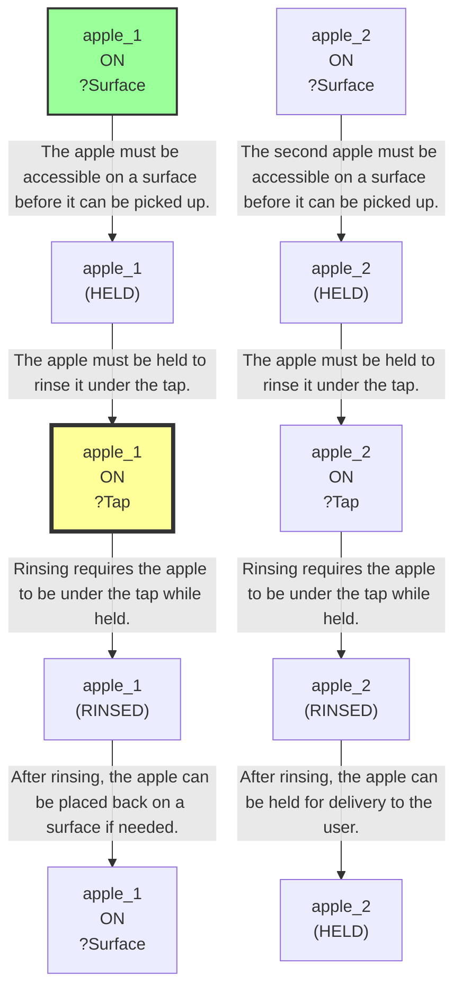
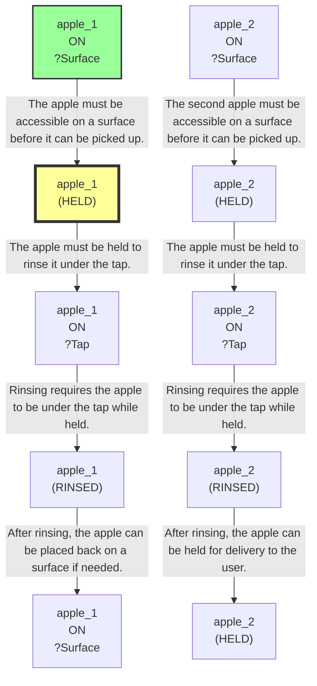
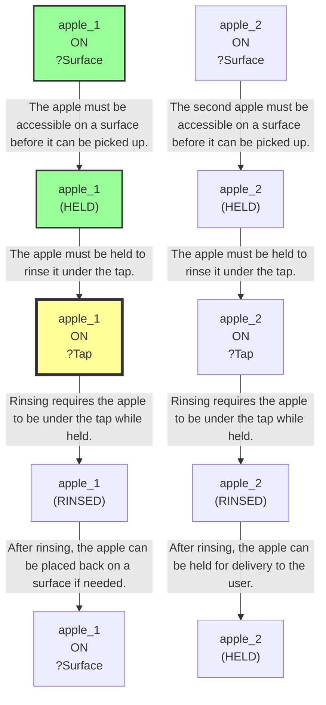
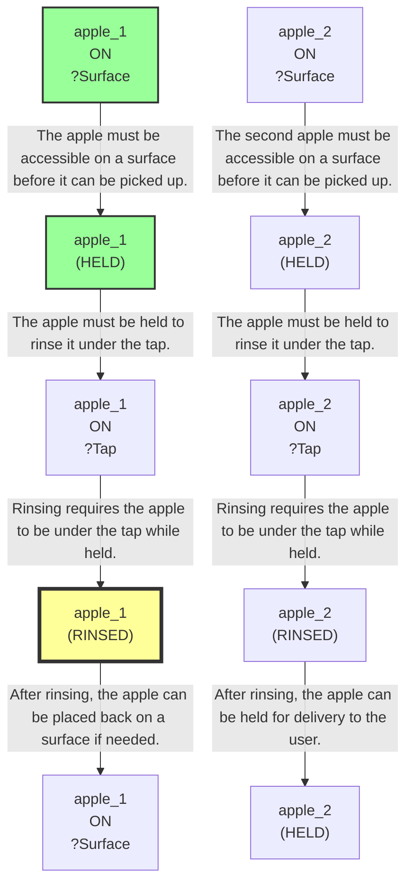

# 🚀 VirtualHome Agent Episode Log


### [GoalReasoner (Module A - Intent)] Output
```json
{
  "literal_instruction": "If there are apples on the table, rinse them under the tap and bring me one."
}
```

### [PerceptionFilter] Output
```json
{
  "reasoning": "Needed items are the target apple(s), the surface they start on, and the tap for rinsing. The SDG implies a held state for the apple, but that is an action state rather than a class. No extra tools are required beyond the tap/wash setup, and no alternative cooling/heating tools are relevant.",
  "selected_classes": [
    "character",
    "apple",
    "sink",
    "faucet",
    "kitchentable"
  ],
  "raw_class_count": 55
}
```

### [LLMExecutor] Output
```json
{
  "reasoning": "The task is to rinse the apple that is on the kitchen table. The apple (437) is already on a surface and close to the character, but to rinse it under the tap the faucet must be on first. Since the faucet is the tap-like object available and has an OFF state, the best next step is to walk to it before switching it on. This progresses toward N2/N3 for the currently observed apple.",
  "satisfied_nodes": [
    "N1"
  ],
  "current_node_focus": "N2",
  "mapped_variables": {
    "?Surface": "kitchentable(231)",
    "?Tap": "faucet(248)"
  },
  "action": "[walk] <faucet> (248)"
}
```

### [RoboStateMultiTaskController] Output
```json
{
  "action": "[walk] <faucet> (248)",
  "active_task_id": "task_1",
  "task_context": {
    "active_task_id": "task_1",
    "pending_task_ids": [],
    "satisfied_task_ids": []
  },
  "source": "llm_executor"
}
```
## Step 0
- **Action**: `[walk] <faucet> (248)`
- **Action Success**: `True`
- **Action Message**: {'0': {'message': 'Success'}}
- **Active Task**: `task_1`
- **Decision Source**: `llm_executor`
- **Task Progress**: T3_without_goal_reasoning_G4_17=pending
- **SDG Status**:

- **Observed Items (9)**: kitchentable(231), sink(247), faucet(248) [OFF], apple(437) [DIRTY], character(1), bathroom(11), bedroom(73), kitchen(205), livingroom(335)


### [PerceptionFilter] Output
```json
{
  "reasoning": "Reused cached class selection.",
  "selected_classes": [
    "character",
    "apple",
    "sink",
    "faucet",
    "kitchentable"
  ],
  "raw_class_count": 55
}
```

### [LLMExecutor] Output
```json
{
  "reasoning": "The apple is already on the kitchen table and I am currently close to the faucet/sink area, but the faucet is OFF. To satisfy the rinse-under-tap requirement, the next needed step is to turn the faucet on before attempting to move or grab the apple. The relevant focus is the faucet state needed for rinsing; the apple remains the target object.",
  "satisfied_nodes": [
    "N1"
  ],
  "current_node_focus": "N2",
  "mapped_variables": {
    "?Surface": "kitchentable(231)",
    "?Tap": "faucet(248)"
  },
  "action": "[switchon] <faucet> (248)"
}
```

### [RoboStateMultiTaskController] Output
```json
{
  "action": "[switchon] <faucet> (248)",
  "active_task_id": "task_1",
  "task_context": {
    "active_task_id": "task_1",
    "pending_task_ids": [],
    "satisfied_task_ids": []
  },
  "source": "llm_executor"
}
```
## Step 1
- **Action**: `[switchon] <faucet> (248)`
- **Action Success**: `True`
- **Action Message**: Faked switch operation in Python layer (bypassed Unity failure)
- **Active Task**: `task_1`
- **Decision Source**: `llm_executor`
- **Task Progress**: T3_without_goal_reasoning_G4_17=pending
- **SDG Status**:

- **Observed Items (9)**: kitchentable(231), sink(247), faucet(248) [OFF], apple(437) [DIRTY], character(1), bathroom(11), bedroom(73), kitchen(205), livingroom(335)


### [PerceptionFilter] Output
```json
{
  "reasoning": "Reused cached class selection.",
  "selected_classes": [
    "character",
    "apple",
    "sink",
    "faucet",
    "kitchentable"
  ],
  "raw_class_count": 55
}
```

### [LLMExecutor] Output
```json
{
  "reasoning": "The task requires rinsing an apple that is on the table under the tap, then bringing it. The current graph shows one apple (apple(437)) on the kitchen table and already dirty, and we are currently close to both the sink and faucet. Since the apple must be held before it can be rinsed, the next step is to go to the apple. I will focus on satisfying the accessibility prerequisite for the dirty apple before grabbing and washing it.",
  "satisfied_nodes": [
    "N1"
  ],
  "current_node_focus": "N4",
  "mapped_variables": {
    "?Surface": "kitchentable(231)",
    "?Tap": "faucet(248)"
  },
  "action": "[walk] <apple> (437)"
}
```

### [RoboStateMultiTaskController] Output
```json
{
  "action": "[walk] <apple> (437)",
  "active_task_id": "task_1",
  "task_context": {
    "active_task_id": "task_1",
    "pending_task_ids": [],
    "satisfied_task_ids": []
  },
  "source": "llm_executor"
}
```
## Step 2
- **Action**: `[walk] <apple> (437)`
- **Action Success**: `True`
- **Action Message**: {'0': {'message': 'Success'}}
- **Active Task**: `task_1`
- **Decision Source**: `llm_executor`
- **Task Progress**: T3_without_goal_reasoning_G4_17=pending
- **SDG Status**:

- **Observed Items (9)**: kitchentable(231), sink(247), faucet(248) [ON], apple(437) [DIRTY], character(1), bathroom(11), bedroom(73), kitchen(205), livingroom(335)


### [PerceptionFilter] Output
```json
{
  "reasoning": "Reused cached class selection.",
  "selected_classes": [
    "character",
    "apple",
    "sink",
    "faucet",
    "kitchentable"
  ],
  "raw_class_count": 55
}
```

### [LLMExecutor] Output
```json
{
  "reasoning": "The current goal requires rinsing the apple that is already on the kitchen table and close to the character. The faucet is on and nearby, but the apple is still on the table and not held yet. Per the SDG, the next prerequisite toward rinsing is to pick up apple(437). I should not repeat walking because I just walked to the apple and it is already close.",
  "satisfied_nodes": [
    "N1"
  ],
  "current_node_focus": "N4",
  "mapped_variables": {
    "?Surface": "kitchentable(231)",
    "?Tap": "faucet(248)"
  },
  "action": "[grab] <apple> (437)"
}
```

### [RoboStateMultiTaskController] Output
```json
{
  "action": "[grab] <apple> (437)",
  "active_task_id": "task_1",
  "task_context": {
    "active_task_id": "task_1",
    "pending_task_ids": [],
    "satisfied_task_ids": []
  },
  "source": "llm_executor"
}
```
## Step 3
- **Action**: `[grab] <apple> (437)`
- **Action Success**: `True`
- **Action Message**: {'0': {'message': 'Success'}}
- **Active Task**: `task_1`
- **Decision Source**: `llm_executor`
- **Task Progress**: T3_without_goal_reasoning_G4_17=pending
- **SDG Status**:

- **Observed Items (9)**: kitchentable(231), sink(247), faucet(248) [ON], apple(437) [DIRTY], character(1), bathroom(11), bedroom(73), kitchen(205), livingroom(335)


### [PerceptionFilter] Output
```json
{
  "reasoning": "Reused cached class selection.",
  "selected_classes": [
    "character",
    "apple",
    "sink",
    "faucet",
    "kitchentable"
  ],
  "raw_class_count": 55
}
```

### [LLMExecutor] Output
```json
{
  "reasoning": "The held apple(437) is DIRTY and already close to the faucet, which is ON. To satisfy the rinse requirement, the next step is to wash/rinse the apple at the sink area. Since washing requires being near a sink and holding the object, and the graph shows the character is currently in the kitchen with the sink available, the best next atomic action is to wash the held apple.",
  "satisfied_nodes": [
    "N1",
    "N4"
  ],
  "current_node_focus": "N2",
  "mapped_variables": {
    "?Tap": "faucet(248)",
    "?Surface": "kitchentable(231)"
  },
  "action": "[wash] <apple> (437)"
}
```

### [RoboStateMultiTaskController] Output
```json
{
  "action": "[wash] <apple> (437)",
  "active_task_id": "task_1",
  "task_context": {
    "active_task_id": "task_1",
    "pending_task_ids": [],
    "satisfied_task_ids": []
  },
  "source": "llm_executor"
}
```
## Step 4
- **Action**: `[wash] <apple> (437)`
- **Action Success**: `False`
- **Action Message**: Failed: Must hold the object and be near a sink.
- **Active Task**: `task_1`
- **Decision Source**: `llm_executor`
- **Task Progress**: T3_without_goal_reasoning_G4_17=pending
- **SDG Status**:

- **Observed Items (9)**: kitchentable(231), sink(247), faucet(248) [ON], apple(437) [DIRTY], character(1), bathroom(11), bedroom(73), kitchen(205), livingroom(335)


### [PerceptionFilter] Output
```json
{
  "reasoning": "Reused cached class selection.",
  "selected_classes": [
    "character",
    "apple",
    "sink",
    "faucet",
    "kitchentable"
  ],
  "raw_class_count": 55
}
```

### [LLMExecutor] Output
```json
{
  "reasoning": "The apple is already held, but the previous wash attempt failed because we are not near the sink. The next required step toward rinsing is to move to the sink; the faucet is already on, and the apple remains dirty in hand. After walking to the sink, the next step will be washing/rinsing the held apple.",
  "satisfied_nodes": [
    "N1",
    "N4"
  ],
  "current_node_focus": "N2",
  "mapped_variables": {
    "?Surface": "kitchentable(231)",
    "?Tap": "faucet(248)"
  },
  "action": "[walk] <sink> (247)"
}
```

### [RoboStateMultiTaskController] Output
```json
{
  "action": "[walk] <sink> (247)",
  "active_task_id": "task_1",
  "task_context": {
    "active_task_id": "task_1",
    "pending_task_ids": [],
    "satisfied_task_ids": []
  },
  "source": "llm_executor"
}
```
## Step 5
- **Action**: `[walk] <sink> (247)`
- **Action Success**: `True`
- **Action Message**: {'0': {'message': 'Success'}}
- **Active Task**: `task_1`
- **Decision Source**: `llm_executor`
- **Task Progress**: T3_without_goal_reasoning_G4_17=pending
- **SDG Status**:

- **Observed Items (9)**: kitchentable(231), sink(247), faucet(248) [ON], apple(437) [DIRTY], character(1), bathroom(11), bedroom(73), kitchen(205), livingroom(335)


### [PerceptionFilter] Output
```json
{
  "reasoning": "Reused cached class selection.",
  "selected_classes": [
    "character",
    "apple",
    "sink",
    "faucet",
    "kitchentable"
  ],
  "raw_class_count": 55
}
```

### [LLMExecutor] Output
```json
{
  "reasoning": "The apple is already held and the character is already close to the sink, which satisfies the proximity requirement for washing. The faucet is on, but the relevant operation for cleaning the apple is [wash] at the sink. This should progress toward rinsing the apple under the tap.",
  "satisfied_nodes": [
    "N1",
    "N4"
  ],
  "current_node_focus": "N3",
  "mapped_variables": {
    "?Surface": "kitchentable(231)",
    "?Tap": "faucet(248)"
  },
  "action": "[wash] <apple> (437)"
}
```

### [RoboStateMultiTaskController] Output
```json
{
  "action": "[wash] <apple> (437)",
  "active_task_id": "task_1",
  "task_context": {
    "active_task_id": "task_1",
    "pending_task_ids": [],
    "satisfied_task_ids": []
  },
  "source": "llm_executor"
}
```
## Step 6
- **Action**: `[wash] <apple> (437)`
- **Action Success**: `True`
- **Action Message**: Washed successfully.
- **Active Task**: `task_1`
- **Decision Source**: `llm_executor`
- **Task Progress**: T3_without_goal_reasoning_G4_17=done
- **SDG Status**:

- **Observed Items (9)**: kitchentable(231), sink(247), faucet(248) [ON], apple(437) [DIRTY], character(1), bathroom(11), bedroom(73), kitchen(205), livingroom(335)

