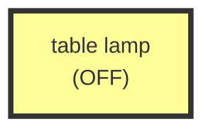

# 🚀 VirtualHome Agent Episode Log


### [GoalReasoner (Module A - Intent)] Output
```json
{
  "literal_instruction": "If the table lamp is on, turn it off."
}
```

### [PerceptionFilter] Output
```json
{
  "reasoning": "The goal is to make the table lamp OFF, so the only necessary object class is the table lamp itself. No separate tool is required because the task is a direct state change on that object.",
  "selected_classes": [
    "tablelamp",
    "character"
  ],
  "raw_class_count": 33
}
```

### [LLMExecutor] Output
```json
{
  "reasoning": "The goal is to make the table lamp OFF. Two candidate table lamps are currently ON in the bedroom. I need to choose one exact instance; both satisfy the lamp class and state, but only one needs to be turned off to satisfy the singular SDG node. I will act on one visible instance, starting by moving close to it because switching requires proximity.",
  "satisfied_nodes": [],
  "current_node_focus": "N1",
  "mapped_variables": {},
  "action": "[walk] <tablelamp> (102)"
}
```

### [RoboStateMultiTaskController] Output
```json
{
  "action": "[walk] <tablelamp> (102)",
  "active_task_id": "task_1",
  "task_context": {
    "active_task_id": "task_1",
    "pending_task_ids": [],
    "satisfied_task_ids": []
  },
  "source": "llm_executor"
}
```
## Step 0
- **Action**: `[walk] <tablelamp> (102)`
- **Action Success**: `True`
- **Action Message**: {'0': {'message': 'Success'}}
- **Active Task**: `task_1`
- **Decision Source**: `llm_executor`
- **Task Progress**: T3_without_goal_reasoning_G4_19=pending
- **SDG Status**:

- **Observed Items (7)**: tablelamp(102) [ON], tablelamp(103) [ON], character(1), bathroom(11), bedroom(73), kitchen(205), livingroom(335)


### [PerceptionFilter] Output
```json
{
  "reasoning": "Reused cached class selection.",
  "selected_classes": [
    "tablelamp",
    "character"
  ],
  "raw_class_count": 33
}
```

### [LLMExecutor] Output
```json
{
  "reasoning": "The goal is to make the table lamp OFF. The current graph shows tablelamp(102) is ON and the character is already CLOSE to it, so no further walk is needed. Since the lamp has a switch, the correct next action is to turn it off.",
  "satisfied_nodes": [],
  "current_node_focus": "N1",
  "mapped_variables": {},
  "action": "[switchoff] <tablelamp> (102)"
}
```

### [RoboStateMultiTaskController] Output
```json
{
  "action": "[switchoff] <tablelamp> (102)",
  "active_task_id": "task_1",
  "task_context": {
    "active_task_id": "task_1",
    "pending_task_ids": [],
    "satisfied_task_ids": []
  },
  "source": "llm_executor"
}
```
## Step 1
- **Action**: `[switchoff] <tablelamp> (102)`
- **Action Success**: `True`
- **Action Message**: Faked switch operation in Python layer (bypassed Unity failure)
- **Active Task**: `task_1`
- **Decision Source**: `llm_executor`
- **Task Progress**: T3_without_goal_reasoning_G4_19=done
- **SDG Status**:

- **Observed Items (7)**: tablelamp(102) [ON], tablelamp(103) [ON], character(1), bathroom(11), bedroom(73), kitchen(205), livingroom(335)

