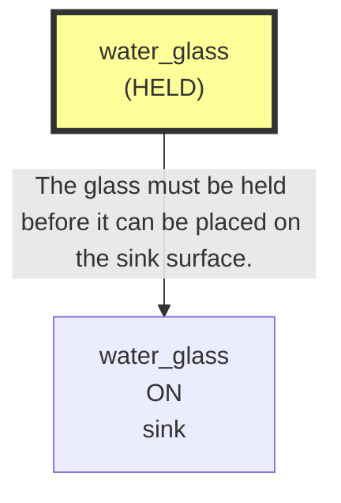
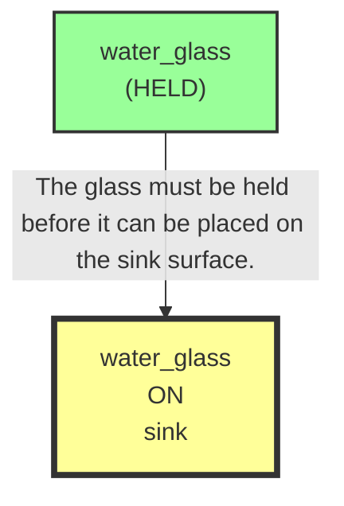
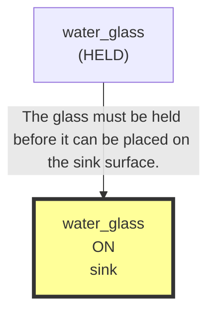

# 🚀 VirtualHome Agent Episode Log


### [GoalReasoner (Module A - Intent)] Output
```json
{
  "literal_instruction": "If you see dirty water glasses, put them in the sink right away."
}
```

### [PerceptionFilter] Output
```json
{
  "reasoning": "The goal is to handle dirty water glasses by putting them in the sink. The SDG requires the water_glass target object and the sink as the location/receptacle. Since the glass must be held before placing it, the water_glass must be selected as well. No other tools are implied for this action.",
  "selected_classes": [
    "waterglass",
    "sink",
    "character"
  ],
  "raw_class_count": 50
}
```

### [LLMExecutor] Output
```json
{
  "reasoning": "A dirty water glass is visible and already close to the character. To satisfy the SDG, it must first be held before it can be placed on the sink. Since it is currently reachable and the sink is available, the next atomic step is to grab the dirty glass with the target ID 64. This also preserves the instruction to deal with dirty water glasses immediately.",
  "satisfied_nodes": [],
  "current_node_focus": "N2",
  "mapped_variables": {
    "?Container": "sink(155)"
  },
  "action": "[grab] <waterglass> (64)"
}
```

### [RoboStateMultiTaskController] Output
```json
{
  "action": "[grab] <waterglass> (64)",
  "active_task_id": "task_1",
  "task_context": {
    "active_task_id": "task_1",
    "pending_task_ids": [],
    "satisfied_task_ids": []
  },
  "source": "llm_executor"
}
```
## Step 0
- **Action**: `[grab] <waterglass> (64)`
- **Action Success**: `False`
- **Action Message**: temporary_unavailable: target disappeared; wait or search and retry
- **Active Task**: `task_1`
- **Decision Source**: `llm_executor`
- **Task Progress**: T3_without_goal_reasoning_M1_03=pending
- **SDG Status**:

- **Observed Items (15)**: waterglass(64) [DIRTY], waterglass(71), waterglass(72), waterglass(79), waterglass(80), waterglass(87), waterglass(88), waterglass(100), sink(155), character(1), kitchen(11), livingroom(183), bedroom(241), bathroom(285), bedroom(346)


### [PerceptionFilter] Output
```json
{
  "reasoning": "Reused cached class selection.",
  "selected_classes": [
    "waterglass",
    "sink",
    "character"
  ],
  "raw_class_count": 50
}
```

### [LLMExecutor] Output
```json
{
  "reasoning": "The active goal is to ensure dirty water glasses are put in the sink. The only dirty glass visible is waterglass(64), and it is currently close to the character, so the immediate prerequisite is to hold it. Since the previous grab failed because the target temporarily disappeared, but it is now present again and close, the correct next step is to retry grabbing the same dirty glass. The sink(155) is the destination for the final placement, but that comes after holding the glass.",
  "satisfied_nodes": [],
  "current_node_focus": "N2",
  "mapped_variables": {
    "?Container": "sink(155)"
  },
  "action": "[grab] <waterglass> (64)"
}
```

### [RoboStateMultiTaskController] Output
```json
{
  "action": "[grab] <waterglass> (64)",
  "active_task_id": "task_1",
  "task_context": {
    "active_task_id": "task_1",
    "pending_task_ids": [],
    "satisfied_task_ids": []
  },
  "source": "llm_executor"
}
```
## Step 1
- **Action**: `[grab] <waterglass> (64)`
- **Action Success**: `False`
- **Action Message**: temporary_unavailable: target is temporarily hidden
- **Active Task**: `task_1`
- **Decision Source**: `llm_executor`
- **Task Progress**: T3_without_goal_reasoning_M1_03=pending
- **SDG Status**:

- **Observed Items (15)**: waterglass(64) [DIRTY], waterglass(71), waterglass(72), waterglass(79), waterglass(80), waterglass(87), waterglass(88), waterglass(100), sink(155), character(1), kitchen(11), livingroom(183), bedroom(241), bathroom(285), bedroom(346)


### [RoboStateMultiTaskController] Output
```json
{
  "action": "[walk] <livingroom> (183)",
  "active_task_id": null,
  "task_context": {
    "active_task_id": null,
    "pending_task_ids": [
      "task_1"
    ],
    "satisfied_task_ids": []
  },
  "source": "loop_recovery_room_revisit"
}
```
## Step 2
- **Action**: `[walk] <livingroom> (183)`
- **Action Success**: `True`
- **Action Message**: {'0': {'message': 'Success'}}
- **Decision Source**: `loop_recovery_room_revisit`
- **Task Progress**: T3_without_goal_reasoning_M1_03=pending
- **SDG Status**:
No SDG active.
- **Observed Items (159)**: wall(12), wall(13), wall(14), wall(15), wall(16), wall(17), wall(18), wall(19), wall(20), wall(21), floor(22), floor(23), floor(24), floor(25), floor(26)...


### [PerceptionFilter] Output
```json
{
  "reasoning": "The goal is to move dirty water glasses onto the sink. The SDG shows the target object is a water_glass and it must be held before placement, so we keep waterglass. The sink is the required destination. No other tools are needed for this immediate action.",
  "selected_classes": [
    "waterglass",
    "sink",
    "character"
  ],
  "raw_class_count": 59
}
```

### [LLMExecutor] Output
```json
{
  "reasoning": "The task is to put dirty water glasses into the sink right away. The only dirty, nearby water glass is waterglass(64), which is currently CLOSE to the character and still in the kitchen. Since the previous grab attempts failed because the target temporarily disappeared, the correct autonomous recovery is to retry by approaching/targeting the glass directly. The next prerequisite for satisfying N2 (HELD) is to get near the dirty glass before grabbing it.",
  "satisfied_nodes": [],
  "current_node_focus": "N2",
  "mapped_variables": {
    "?Glass": "waterglass(64)",
    "?Sink": "sink(155)"
  },
  "action": "[walk] <waterglass> (64)"
}
```

### [RoboStateMultiTaskController] Output
```json
{
  "action": "[walk] <waterglass> (64)",
  "active_task_id": "task_1",
  "task_context": {
    "active_task_id": "task_1",
    "pending_task_ids": [],
    "satisfied_task_ids": []
  },
  "source": "llm_executor"
}
```
## Step 3
- **Action**: `[walk] <waterglass> (64)`
- **Action Success**: `False`
- **Action Message**: temporary_unavailable: target is temporarily hidden
- **Active Task**: `task_1`
- **Decision Source**: `llm_executor`
- **Task Progress**: T3_without_goal_reasoning_M1_03=pending
- **SDG Status**:

- **Observed Items (15)**: waterglass(64) [DIRTY], waterglass(71), waterglass(72), waterglass(79), waterglass(80), waterglass(87), waterglass(88), waterglass(100), sink(155), character(1), kitchen(11), livingroom(183), bedroom(241), bathroom(285), bedroom(346)


### [RoboStateMultiTaskController] Output
```json
{
  "action": "[walk] <bedroom> (241)",
  "active_task_id": null,
  "task_context": {
    "active_task_id": null,
    "pending_task_ids": [
      "task_1"
    ],
    "satisfied_task_ids": []
  },
  "source": "loop_recovery_room_revisit"
}
```
## Step 4
- **Action**: `[walk] <bedroom> (241)`
- **Action Success**: `True`
- **Action Message**: {'0': {'message': 'Success'}}
- **Decision Source**: `loop_recovery_room_revisit`
- **Task Progress**: T3_without_goal_reasoning_M1_03=pending
- **SDG Status**:
No SDG active.
- **Observed Items (211)**: wall(12), wall(13), wall(14), wall(15), wall(16), wall(17), wall(18), wall(19), wall(20), wall(21), floor(22), floor(23), floor(24), floor(25), floor(26)...


### [PerceptionFilter] Output
```json
{
  "reasoning": "The goal is to place dirty water glasses into the sink, so the only necessary classes are the target object waterglass and the sink where it must be put. The SDG also requires the water_glass to be held before placement, but that is a state requirement rather than an additional object class.",
  "selected_classes": [
    "waterglass",
    "sink",
    "character"
  ],
  "raw_class_count": 65
}
```

### [LLMExecutor] Output
```json
{
  "reasoning": "The dirty target glass is waterglass(64), and it is currently close to the character while the character is in the bedroom. To satisfy the SDG, the glass must first be held, then later placed on the sink. The immediate gap is that N2 (HELD) is not yet satisfied. Because the previous grab attempts failed due to temporary unavailability, and the glass is now visible and close, the next best atomic action is to attempt grabbing this dirty glass.",
  "satisfied_nodes": [],
  "current_node_focus": "N2",
  "mapped_variables": {},
  "action": "[grab] <waterglass> (64)"
}
```

### [RoboStateMultiTaskController] Output
```json
{
  "action": "[grab] <waterglass> (64)",
  "active_task_id": "task_1",
  "task_context": {
    "active_task_id": "task_1",
    "pending_task_ids": [],
    "satisfied_task_ids": []
  },
  "source": "llm_executor"
}
```
## Step 5
- **Action**: `[grab] <waterglass> (64)`
- **Action Success**: `True`
- **Action Message**: {'0': {'message': 'Success'}}
- **Active Task**: `task_1`
- **Decision Source**: `llm_executor`
- **Task Progress**: T3_without_goal_reasoning_M1_03=pending
- **SDG Status**:

- **Observed Items (15)**: waterglass(64) [DIRTY], waterglass(71), waterglass(72), waterglass(79), waterglass(80), waterglass(87), waterglass(88), waterglass(100), sink(155), character(1), kitchen(11), livingroom(183), bedroom(241), bathroom(285), bedroom(346)


### [PerceptionFilter] Output
```json
{
  "reasoning": "Reused cached class selection.",
  "selected_classes": [
    "waterglass",
    "sink",
    "character"
  ],
  "raw_class_count": 65
}
```

### [LLMExecutor] Output
```json
{
  "reasoning": "The active task is to put any dirty water glass in the sink right away. The currently held dirty glass is waterglass(64), which satisfies the required HELD prerequisite (N2). The sink is sink(155), and to satisfy N1 I need to place the held glass onto the sink surface. Because putback to a destination requires being near the destination, the next atomic action must be to walk to the sink first.",
  "satisfied_nodes": [
    "N2"
  ],
  "current_node_focus": "N1",
  "mapped_variables": {
    "?Washer": "sink(155)"
  },
  "action": "[walk] <sink> (155)"
}
```

### [RoboStateMultiTaskController] Output
```json
{
  "action": "[walk] <sink> (155)",
  "active_task_id": "task_1",
  "task_context": {
    "active_task_id": "task_1",
    "pending_task_ids": [],
    "satisfied_task_ids": []
  },
  "source": "llm_executor"
}
```
## Step 6
- **Action**: `[walk] <sink> (155)`
- **Action Success**: `True`
- **Action Message**: {'0': {'message': 'Success'}}
- **Active Task**: `task_1`
- **Decision Source**: `llm_executor`
- **Task Progress**: T3_without_goal_reasoning_M1_03=pending
- **SDG Status**:

- **Observed Items (15)**: waterglass(64) [DIRTY], waterglass(71), waterglass(72), waterglass(79), waterglass(80), waterglass(87), waterglass(88), waterglass(100), sink(155), character(1), kitchen(11), livingroom(183), bedroom(241), bathroom(285), bedroom(346)


### [PerceptionFilter] Output
```json
{
  "reasoning": "Reused cached class selection.",
  "selected_classes": [
    "waterglass",
    "sink",
    "character"
  ],
  "raw_class_count": 65
}
```

### [LLMExecutor] Output
```json
{
  "reasoning": "The active task is to put a dirty water glass in the sink right away. The current graph shows waterglass(64) is dirty and is already held in the right hand, and the character is already close to sink(155). The sink is a flat surface, so the next step is to place the held glass onto the sink surface. This should satisfy the remaining relation node N1, while N2 is already satisfied by holding the glass.",
  "satisfied_nodes": [
    "N2"
  ],
  "current_node_focus": "N1",
  "mapped_variables": {
    "?Washer": "sink(155)"
  },
  "action": "[putback] <waterglass> (64) <sink> (155)"
}
```

### [RoboStateMultiTaskController] Output
```json
{
  "action": "[walk] <bathroom> (285)",
  "active_task_id": null,
  "task_context": {
    "active_task_id": null,
    "pending_task_ids": [
      "task_1"
    ],
    "satisfied_task_ids": []
  },
  "source": "loop_recovery_room_revisit"
}
```
## Step 7
- **Action**: `[walk] <bathroom> (285)`
- **Action Success**: `True`
- **Action Message**: {'0': {'message': 'Success'}}
- **Decision Source**: `loop_recovery_room_revisit`
- **Task Progress**: T3_without_goal_reasoning_M1_03=pending
- **SDG Status**:
No SDG active.
- **Observed Items (243)**: wall(12), wall(13), wall(14), wall(15), wall(16), wall(17), wall(18), wall(19), wall(20), wall(21), floor(22), floor(23), floor(24), floor(25), floor(26)...


### [PerceptionFilter] Output
```json
{
  "reasoning": "The goal is to put dirty water glasses into the sink immediately. The SDG shows the water_glass must be held and then placed on the sink. So the only necessary visible classes are the target object and the destination sink. No extra tools are required.",
  "selected_classes": [
    "waterglass",
    "sink",
    "character"
  ],
  "raw_class_count": 81
}
```

### [LLMExecutor] Output
```json
{
  "reasoning": "The active task is to put dirty water glasses in the sink right away. Waterglass(64) is already held in the right hand and is dirty. We are currently inside bathroom(285), and sink(326) is also in the bathroom. Since placement into a sink requires an explicit walk to the destination first, the next step is to walk to sink(326).",
  "satisfied_nodes": [],
  "current_node_focus": "N1",
  "mapped_variables": {
    "?Washer": "sink(326)"
  },
  "action": "[walk] <sink> (326)"
}
```

### [RoboStateMultiTaskController] Output
```json
{
  "action": "[walk] <sink> (326)",
  "active_task_id": "task_1",
  "task_context": {
    "active_task_id": "task_1",
    "pending_task_ids": [],
    "satisfied_task_ids": []
  },
  "source": "llm_executor"
}
```
## Step 8
- **Action**: `[walk] <sink> (326)`
- **Action Success**: `True`
- **Action Message**: {'0': {'message': 'Success'}}
- **Active Task**: `task_1`
- **Decision Source**: `llm_executor`
- **Task Progress**: T3_without_goal_reasoning_M1_03=pending
- **SDG Status**:

- **Observed Items (17)**: waterglass(64) [DIRTY], waterglass(71), waterglass(72), waterglass(79), waterglass(80), waterglass(87), waterglass(88), waterglass(100), sink(155), character(1), kitchen(11), livingroom(183), bedroom(241), bathroom(285), bedroom(346)...


### [PerceptionFilter] Output
```json
{
  "reasoning": "Reused cached class selection.",
  "selected_classes": [
    "waterglass",
    "sink",
    "character"
  ],
  "raw_class_count": 81
}
```

### [LLMExecutor] Output
```json
{
  "reasoning": "The active goal is to place the dirty water glass currently held in the right hand onto the sink surface. The current graph shows waterglass(64) is DIRTY and already held, and character(1) is close to sink(326). The sink is a flat surface, so the correct next step is to put it back onto the sink surface, not into the sink.",
  "satisfied_nodes": [
    "N2"
  ],
  "current_node_focus": "N1",
  "mapped_variables": {
    "?Sink": "sink(326)"
  },
  "action": "[putback] <waterglass> (64) <sink> (326)"
}
```

### [RoboStateMultiTaskController] Output
```json
{
  "action": "[walk] <bedroom> (346)",
  "active_task_id": null,
  "task_context": {
    "active_task_id": null,
    "pending_task_ids": [
      "task_1"
    ],
    "satisfied_task_ids": []
  },
  "source": "loop_recovery_room_revisit"
}
```
## Step 9
- **Action**: `[walk] <bedroom> (346)`
- **Action Success**: `True`
- **Action Message**: {'0': {'message': 'Success'}}
- **Decision Source**: `loop_recovery_room_revisit`
- **Task Progress**: T3_without_goal_reasoning_M1_03=pending
- **SDG Status**:
No SDG active.
- **Observed Items (303)**: wall(12), wall(13), wall(14), wall(15), wall(16), wall(17), wall(18), wall(19), wall(20), wall(21), floor(22), floor(23), floor(24), floor(25), floor(26)...


### [PerceptionFilter] Output
```json
{
  "reasoning": "The goal is to move dirty water glasses into the sink immediately. The SDG shows the target object is a water_glass and the required destination is a sink, with the glass needing to be held first. So the only necessary classes are the water_glass and the sink.",
  "selected_classes": [
    "waterglass",
    "sink",
    "character"
  ],
  "raw_class_count": 91
}
```

### [LLMExecutor] Output
```json
{
  "reasoning": "The active goal is to place a dirty water glass in the sink right away. The currently held object is waterglass(64), and it is dirty. The closest valid sink is sink(155), but I am already close to it per the graph, so the next step should be to put the held glass onto the sink surface to satisfy N1. N2 is already satisfied because the character holds waterglass(64).",
  "satisfied_nodes": [
    "N2"
  ],
  "current_node_focus": "N1",
  "mapped_variables": {
    "?Container": "sink(155)"
  },
  "action": "[putback] <waterglass> (64) <sink> (155)"
}
```

### [RoboStateMultiTaskController] Output
```json
{
  "action": "[walk] <livingroom> (183)",
  "active_task_id": null,
  "task_context": {
    "active_task_id": null,
    "pending_task_ids": [
      "task_1"
    ],
    "satisfied_task_ids": []
  },
  "source": "loop_recovery_room_revisit"
}
```
## Step 10
- **Action**: `[walk] <livingroom> (183)`
- **Action Success**: `True`
- **Action Message**: {'0': {'message': 'Success'}}
- **Decision Source**: `loop_recovery_room_revisit`
- **Task Progress**: T3_without_goal_reasoning_M1_03=pending
- **SDG Status**:
No SDG active.
- **Observed Items (361)**: wall(12), wall(13), wall(14), wall(15), wall(16), wall(17), wall(18), wall(19), wall(20), wall(21), floor(22), floor(23), floor(24), floor(25), floor(26)...


### [PerceptionFilter] Output
```json
{
  "reasoning": "Reused cached class selection.",
  "selected_classes": [
    "waterglass",
    "sink",
    "character"
  ],
  "raw_class_count": 91
}
```

### [LLMExecutor] Output
```json
{
  "reasoning": "The currently held waterglass(64) is dirty and the goal is to put dirty water glasses in the sink right away. Since the SDG requires the glass to be held before placing it on the sink, N2 is already satisfied. We are already close to sink(155) in the living room adjacency state, and the sink is a flat surface, so the next step is to place the held glass onto the sink surface. I will use the sink in the current area rather than the bathroom sink because it is the closest available sink and satisfies the goal.",
  "satisfied_nodes": [
    "N2"
  ],
  "current_node_focus": "N1",
  "mapped_variables": {
    "?Sink": "sink(155)"
  },
  "action": "[putback] <waterglass> (64) <sink> (155)"
}
```

### [RoboStateMultiTaskController] Output
```json
{
  "action": "[walk] <bedroom> (241)",
  "active_task_id": null,
  "task_context": {
    "active_task_id": null,
    "pending_task_ids": [
      "task_1"
    ],
    "satisfied_task_ids": []
  },
  "source": "loop_recovery_room_revisit"
}
```
## Step 11
- **Action**: `[walk] <bedroom> (241)`
- **Action Success**: `True`
- **Action Message**: {'0': {'message': 'Success'}}
- **Decision Source**: `loop_recovery_room_revisit`
- **Task Progress**: T3_without_goal_reasoning_M1_03=pending
- **SDG Status**:
No SDG active.
- **Observed Items (361)**: wall(12), wall(13), wall(14), wall(15), wall(16), wall(17), wall(18), wall(19), wall(20), wall(21), floor(22), floor(23), floor(24), floor(25), floor(26)...


### [PerceptionFilter] Output
```json
{
  "reasoning": "Reused cached class selection.",
  "selected_classes": [
    "waterglass",
    "sink",
    "character"
  ],
  "raw_class_count": 91
}
```

### [LLMExecutor] Output
```json
{
  "reasoning": "The active task is to put dirty water glasses in the sink right away. We already hold waterglass(64) in the right hand, and it is marked DIRTY. The relevant sink for the current location is sink(155), which is close to the character in the bedroom. The SDG requires the glass to be held before being placed on the sink, and N2 is already satisfied by the current HOLD state. The next step is to place the held glass onto the sink surface.",
  "satisfied_nodes": [
    "N2"
  ],
  "current_node_focus": "N1",
  "mapped_variables": {
    "?Sink": "sink(155)"
  },
  "action": "[putback] <waterglass> (64) <sink> (155)"
}
```

### [RoboStateMultiTaskController] Output
```json
{
  "action": "[walk] <kitchen> (11)",
  "active_task_id": null,
  "task_context": {
    "active_task_id": null,
    "pending_task_ids": [
      "task_1"
    ],
    "satisfied_task_ids": []
  },
  "source": "loop_recovery_room_revisit"
}
```
## Step 12
- **Action**: `[walk] <kitchen> (11)`
- **Action Success**: `True`
- **Action Message**: {'0': {'message': 'Success'}}
- **Decision Source**: `loop_recovery_room_revisit`
- **Task Progress**: T3_without_goal_reasoning_M1_03=pending
- **SDG Status**:
No SDG active.
- **Observed Items (361)**: wall(12), wall(13), wall(14), wall(15), wall(16), wall(17), wall(18), wall(19), wall(20), wall(21), floor(22), floor(23), floor(24), floor(25), floor(26)...


### [PerceptionFilter] Output
```json
{
  "reasoning": "Reused cached class selection.",
  "selected_classes": [
    "waterglass",
    "sink",
    "character"
  ],
  "raw_class_count": 91
}
```

### [LLMExecutor] Output
```json
{
  "reasoning": "The active task is to put dirty water glasses in the sink right away. The held object waterglass(64) is dirty and is already in hand, so the next required step toward satisfying the SDG is to place it on the sink surface. The current graph shows sink(155) in the kitchen, and we are already inside the kitchen. Since putback requires being explicitly walked to the destination first, the next action should be to walk to the sink(155).",
  "satisfied_nodes": [
    "N2"
  ],
  "current_node_focus": "N1",
  "mapped_variables": {
    "?Sink": "sink(155)"
  },
  "action": "[walk] <sink> (155)"
}
```

### [RoboStateMultiTaskController] Output
```json
{
  "action": "[walk] <sink> (155)",
  "active_task_id": "task_1",
  "task_context": {
    "active_task_id": "task_1",
    "pending_task_ids": [],
    "satisfied_task_ids": []
  },
  "source": "llm_executor"
}
```
## Step 13
- **Action**: `[walk] <sink> (155)`
- **Action Success**: `True`
- **Action Message**: {'0': {'message': 'Success'}}
- **Active Task**: `task_1`
- **Decision Source**: `llm_executor`
- **Task Progress**: T3_without_goal_reasoning_M1_03=pending
- **SDG Status**:

- **Observed Items (17)**: waterglass(64) [DIRTY], waterglass(71), waterglass(72), waterglass(79), waterglass(80), waterglass(87), waterglass(88), waterglass(100), sink(155), character(1), kitchen(11), livingroom(183), bedroom(241), bathroom(285), bedroom(346)...


### [PerceptionFilter] Output
```json
{
  "reasoning": "Reused cached class selection.",
  "selected_classes": [
    "waterglass",
    "sink",
    "character"
  ],
  "raw_class_count": 91
}
```

### [LLMExecutor] Output
```json
{
  "reasoning": "The active goal is to place a dirty water glass in the sink. In the current graph, waterglass(64) is already held and is dirty, while sink(155) is already close to the character. The prerequisite HE LD state (N2) is satisfied, so the next step toward the final sink relation is to place the held glass on the sink surface.",
  "satisfied_nodes": [
    "N2"
  ],
  "current_node_focus": "N1",
  "mapped_variables": {
    "?WaterGlass": "waterglass(64)",
    "?Sink": "sink(155)"
  },
  "action": "[putback] <waterglass> (64) <sink> (155)"
}
```

### [RoboStateMultiTaskController] Output
```json
{
  "action": "[walk] <bathroom> (285)",
  "active_task_id": null,
  "task_context": {
    "active_task_id": null,
    "pending_task_ids": [
      "task_1"
    ],
    "satisfied_task_ids": []
  },
  "source": "loop_recovery_room_revisit"
}
```
## Step 14
- **Action**: `[walk] <bathroom> (285)`
- **Action Success**: `True`
- **Action Message**: {'0': {'message': 'Success'}}
- **Decision Source**: `loop_recovery_room_revisit`
- **Task Progress**: T3_without_goal_reasoning_M1_03=pending
- **SDG Status**:
No SDG active.
- **Observed Items (361)**: wall(12), wall(13), wall(14), wall(15), wall(16), wall(17), wall(18), wall(19), wall(20), wall(21), floor(22), floor(23), floor(24), floor(25), floor(26)...


### [PerceptionFilter] Output
```json
{
  "reasoning": "Reused cached class selection.",
  "selected_classes": [
    "waterglass",
    "sink",
    "character"
  ],
  "raw_class_count": 91
}
```

### [LLMExecutor] Output
```json
{
  "reasoning": "The active goal requires the dirty water glass to be on the sink. The current graph shows waterglass(64) is already held by the character, and sink(155) is the relevant nearby sink in the bathroom. Since putting an object onto a sink requires first being near the sink, the next step is to walk to sink(155) before performing the putback. This will enable satisfying N2 first and then N1 in the following action.",
  "satisfied_nodes": [
    "N2"
  ],
  "current_node_focus": "N1",
  "mapped_variables": {
    "?Sink": "sink(155)",
    "?WaterGlass": "waterglass(64)"
  },
  "action": "[walk] <sink> (155)"
}
```

### [RoboStateMultiTaskController] Output
```json
{
  "action": "[walk] <sink> (155)",
  "active_task_id": "task_1",
  "task_context": {
    "active_task_id": "task_1",
    "pending_task_ids": [],
    "satisfied_task_ids": []
  },
  "source": "llm_executor"
}
```
## Step 15
- **Action**: `[walk] <sink> (155)`
- **Action Success**: `True`
- **Action Message**: {'0': {'message': 'Success'}}
- **Active Task**: `task_1`
- **Decision Source**: `llm_executor`
- **Task Progress**: T3_without_goal_reasoning_M1_03=pending
- **SDG Status**:

- **Observed Items (17)**: waterglass(64) [DIRTY], waterglass(71), waterglass(72), waterglass(79), waterglass(80), waterglass(87), waterglass(88), waterglass(100), sink(155), character(1), kitchen(11), livingroom(183), bedroom(241), bathroom(285), bedroom(346)...


### [PerceptionFilter] Output
```json
{
  "reasoning": "Reused cached class selection.",
  "selected_classes": [
    "waterglass",
    "sink",
    "character"
  ],
  "raw_class_count": 91
}
```

### [LLMExecutor] Output
```json
{
  "reasoning": "The active task is to place dirty water glasses in the sink right away. The current graph shows waterglass(64) is dirty and already held in the right hand, and sink(155) is the intended sink and is close to the character. Therefore the next step is to place the held dirty glass onto the sink surface. This satisfies the held prerequisite and progresses toward the ON sink relation.",
  "satisfied_nodes": [
    "N2"
  ],
  "current_node_focus": "N1",
  "mapped_variables": {
    "?Glass": "waterglass(64)",
    "?Sink": "sink(155)"
  },
  "action": "[putback] <waterglass> (64) <sink> (155)"
}
```

### [RoboStateMultiTaskController] Output
```json
{
  "action": "[walk] <bedroom> (346)",
  "active_task_id": null,
  "task_context": {
    "active_task_id": null,
    "pending_task_ids": [
      "task_1"
    ],
    "satisfied_task_ids": []
  },
  "source": "loop_recovery_room_revisit"
}
```
## Step 16
- **Action**: `[walk] <bedroom> (346)`
- **Action Success**: `True`
- **Action Message**: {'0': {'message': 'Success'}}
- **Decision Source**: `loop_recovery_room_revisit`
- **Task Progress**: T3_without_goal_reasoning_M1_03=pending
- **SDG Status**:
No SDG active.
- **Observed Items (361)**: wall(12), wall(13), wall(14), wall(15), wall(16), wall(17), wall(18), wall(19), wall(20), wall(21), floor(22), floor(23), floor(24), floor(25), floor(26)...


### [PerceptionFilter] Output
```json
{
  "reasoning": "Reused cached class selection.",
  "selected_classes": [
    "waterglass",
    "sink",
    "character"
  ],
  "raw_class_count": 91
}
```

### [LLMExecutor] Output
```json
{
  "reasoning": "The active task is to put dirty water glasses in the sink right away. In the current graph, waterglass(64) is dirty and already held in the right hand, which satisfies the prerequisite HE LD state (N2). The sink(155) is the relevant sink in the current room and is already close to the character. The next step is to place the held glass onto the sink surface, which will satisfy N1.",
  "satisfied_nodes": [
    "N2"
  ],
  "current_node_focus": "N1",
  "mapped_variables": {
    "?Sink": "sink(155)",
    "?Glass": "waterglass(64)"
  },
  "action": "[putback] <waterglass> (64) <sink> (155)"
}
```

### [RoboStateMultiTaskController] Output
```json
{
  "action": "[walk] <livingroom> (183)",
  "active_task_id": null,
  "task_context": {
    "active_task_id": null,
    "pending_task_ids": [
      "task_1"
    ],
    "satisfied_task_ids": []
  },
  "source": "loop_recovery_room_revisit"
}
```
## Step 17
- **Action**: `[walk] <livingroom> (183)`
- **Action Success**: `True`
- **Action Message**: {'0': {'message': 'Success'}}
- **Decision Source**: `loop_recovery_room_revisit`
- **Task Progress**: T3_without_goal_reasoning_M1_03=pending
- **SDG Status**:
No SDG active.
- **Observed Items (361)**: wall(12), wall(13), wall(14), wall(15), wall(16), wall(17), wall(18), wall(19), wall(20), wall(21), floor(22), floor(23), floor(24), floor(25), floor(26)...

