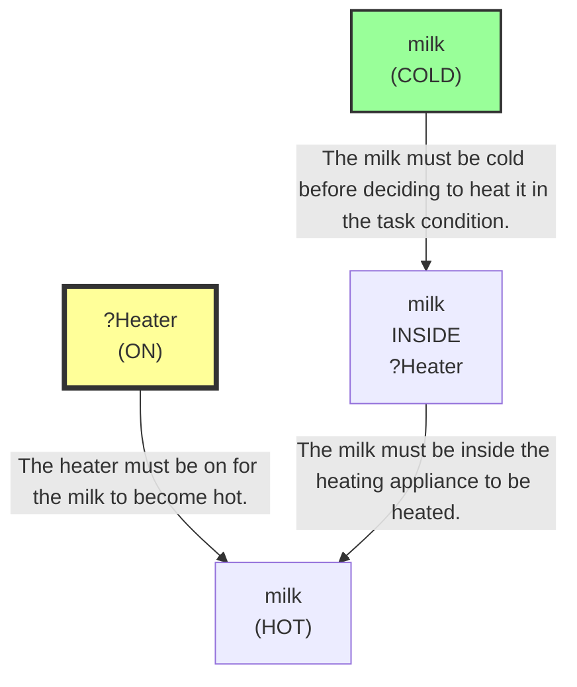
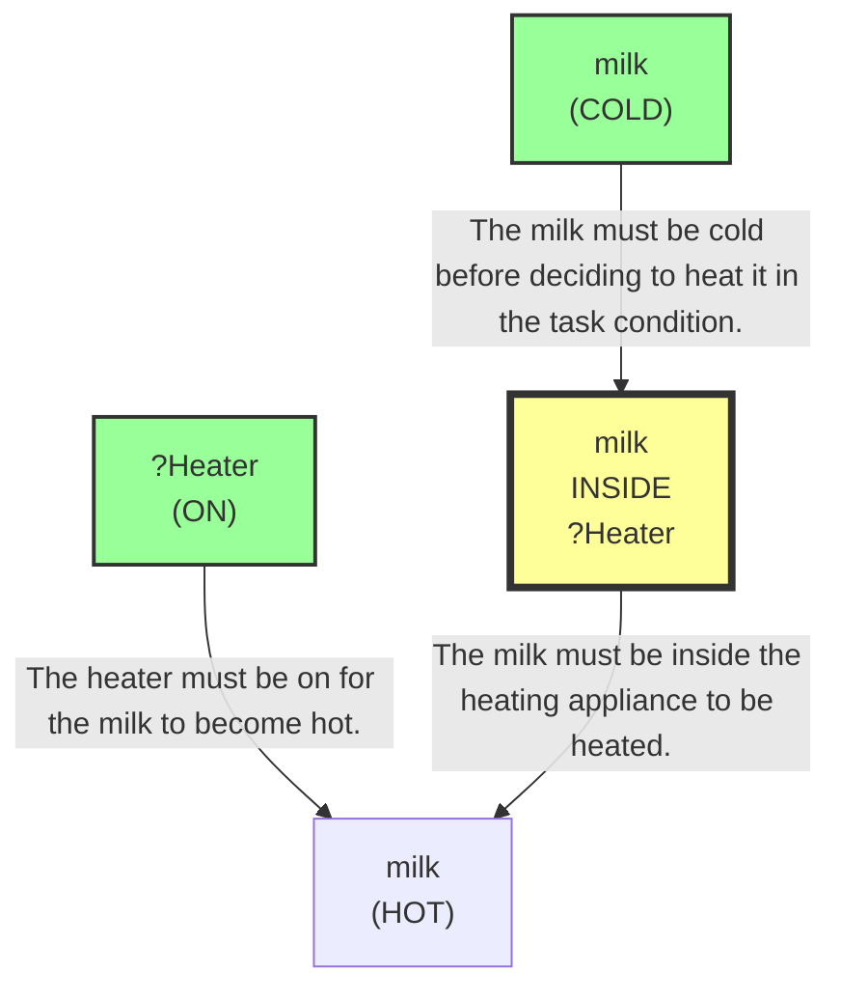
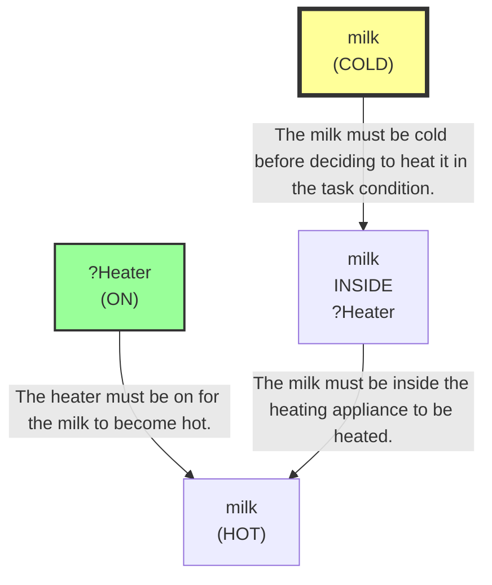

# 🚀 VirtualHome Agent Episode Log


### [GoalReasoner (Module A - Intent)] Output
```json
{
  "literal_instruction": "If the milk is cold, put it in the microwave to heat it up."
}
```

### [PerceptionFilter] Output
```json
{
  "reasoning": "The goal is to heat milk only if it is cold, so the required target is milk plus a heating appliance. The SDG explicitly requires a heater that is ON and milk inside it; among the visible objects, the functional heating options are microwave and stove, so both are kept as backups. No other objects are needed.",
  "selected_classes": [
    "milk",
    "stove",
    "microwave",
    "character"
  ],
  "raw_class_count": 50
}
```

### [LLMExecutor] Output
```json
{
  "reasoning": "The SDG requires the milk to be COLD before heating, and there are two milk instances. The one that matches N1 is milk(176), which is COLD. To eventually satisfy N2-N4, the next step is to move next to the microwave so I can open it and later place the milk inside. I am not repeating a walk action from prior steps because there were none.",
  "satisfied_nodes": [
    "N1"
  ],
  "current_node_focus": "N2",
  "mapped_variables": {
    "?Heater": "microwave(171)"
  },
  "action": "[walk] <microwave> (171)"
}
```

### [RoboStateMultiTaskController] Output
```json
{
  "action": "[walk] <microwave> (171)",
  "active_task_id": "task_1",
  "task_context": {
    "active_task_id": "task_1",
    "pending_task_ids": [],
    "satisfied_task_ids": []
  },
  "source": "llm_executor"
}
```
## Step 0
- **Action**: `[walk] <microwave> (171)`
- **Action Success**: `True`
- **Action Message**: {'0': {'message': 'Success'}}
- **Active Task**: `task_1`
- **Decision Source**: `llm_executor`
- **Task Progress**: T3_without_goal_reasoning_M1_05=pending
- **SDG Status**:

- **Observed Items (10)**: stove(163) [OFF,CLOSED], microwave(171) [CLOSED,OFF], milk(177) [CLOSED], milk(176) [COLD,CLOSED], character(1), kitchen(11), livingroom(183), bedroom(241), bathroom(285), bedroom(346)


### [PerceptionFilter] Output
```json
{
  "reasoning": "Reused cached class selection.",
  "selected_classes": [
    "milk",
    "stove",
    "microwave",
    "character"
  ],
  "raw_class_count": 50
}
```

### [LLMExecutor] Output
```json
{
  "reasoning": "The task condition is to heat milk only if it is cold. Among the observed milk instances, milk(176) is explicitly COLD, so it best satisfies N1. The microwave(171) is the heater candidate and is currently OFF, so the next progress step is to turn it on. I am already close to the microwave, so I can switch it on directly.",
  "satisfied_nodes": [
    "N1"
  ],
  "current_node_focus": "N2",
  "mapped_variables": {
    "?Heater": "microwave(171)"
  },
  "action": "[switchon] <microwave> (171)"
}
```

### [RoboStateMultiTaskController] Output
```json
{
  "action": "[switchon] <microwave> (171)",
  "active_task_id": "task_1",
  "task_context": {
    "active_task_id": "task_1",
    "pending_task_ids": [],
    "satisfied_task_ids": []
  },
  "source": "llm_executor"
}
```
## Step 1
- **Action**: `[switchon] <microwave> (171)`
- **Action Success**: `True`
- **Action Message**: Faked switch operation in Python layer (bypassed Unity failure)
- **Active Task**: `task_1`
- **Decision Source**: `llm_executor`
- **Task Progress**: T3_without_goal_reasoning_M1_05=pending
- **SDG Status**:

- **Observed Items (10)**: stove(163) [OFF,CLOSED], microwave(171) [CLOSED,OFF], milk(177) [CLOSED], milk(176) [COLD,CLOSED], character(1), kitchen(11), livingroom(183), bedroom(241), bathroom(285), bedroom(346)


### [PerceptionFilter] Output
```json
{
  "reasoning": "Reused cached class selection.",
  "selected_classes": [
    "milk",
    "stove",
    "microwave",
    "character"
  ],
  "raw_class_count": 50
}
```

### [LLMExecutor] Output
```json
{
  "reasoning": "The SDG requires the cold milk to be inside the heated appliance while the heater is on. The filtered graph shows milk(176) is the only milk with the required COLD state. The microwave(171) is already ON and we are already close to it, so the next step is to get the cold milk, then place it in the microwave. Since the instructions require explicit proximity before grabbing, the single next action should be to walk to the cold milk object first.",
  "satisfied_nodes": [
    "N1",
    "N2"
  ],
  "current_node_focus": "N3",
  "mapped_variables": {
    "?Heater": "microwave(171)"
  },
  "action": "[walk] <milk> (176)"
}
```

### [RoboStateMultiTaskController] Output
```json
{
  "action": "[walk] <milk> (176)",
  "active_task_id": "task_1",
  "task_context": {
    "active_task_id": "task_1",
    "pending_task_ids": [],
    "satisfied_task_ids": []
  },
  "source": "llm_executor"
}
```
## Step 2
- **Action**: `[walk] <milk> (176)`
- **Action Success**: `True`
- **Action Message**: {'0': {'message': 'Success'}}
- **Active Task**: `task_1`
- **Decision Source**: `llm_executor`
- **Task Progress**: T3_without_goal_reasoning_M1_05=pending
- **SDG Status**:

- **Observed Items (10)**: stove(163) [OFF,CLOSED], microwave(171) [ON,CLOSED], milk(177) [CLOSED], milk(176) [COLD,CLOSED], character(1), kitchen(11), livingroom(183), bedroom(241), bathroom(285), bedroom(346)


### [PerceptionFilter] Output
```json
{
  "reasoning": "Reused cached class selection.",
  "selected_classes": [
    "milk",
    "stove",
    "microwave",
    "character"
  ],
  "raw_class_count": 50
}
```

### [LLMExecutor] Output
```json
{
  "reasoning": "The active task is to heat the cold milk. The cold milk is the exact instance milk(176), and the microwave(171) is already on. I am currently close to the milk, but to place the milk inside the microwave I must first walk to the destination appliance. The microwave is the correct heater variable binding.",
  "satisfied_nodes": [
    "N1",
    "N2"
  ],
  "current_node_focus": "N3",
  "mapped_variables": {
    "?Heater": "microwave(171)"
  },
  "action": "[walk] <microwave> (171)"
}
```

### [RoboStateMultiTaskController] Output
```json
{
  "action": "[walk] <microwave> (171)",
  "active_task_id": "task_1",
  "task_context": {
    "active_task_id": "task_1",
    "pending_task_ids": [],
    "satisfied_task_ids": []
  },
  "source": "llm_executor"
}
```
## Step 3
- **Action**: `[walk] <microwave> (171)`
- **Action Success**: `True`
- **Action Message**: {'0': {'message': 'Success'}}
- **Active Task**: `task_1`
- **Decision Source**: `llm_executor`
- **Task Progress**: T3_without_goal_reasoning_M1_05=pending
- **SDG Status**:

- **Observed Items (10)**: stove(163) [OFF,CLOSED], microwave(171) [ON,CLOSED], milk(177) [CLOSED], milk(176) [COLD,CLOSED], character(1), kitchen(11), livingroom(183), bedroom(241), bathroom(285), bedroom(346)


### [PerceptionFilter] Output
```json
{
  "reasoning": "Reused cached class selection.",
  "selected_classes": [
    "milk",
    "stove",
    "microwave",
    "character"
  ],
  "raw_class_count": 50
}
```

### [LLMExecutor] Output
```json
{
  "reasoning": "The task condition targets cold milk. In the current graph, milk(176) is explicitly COLD, while milk(177) is not cold and appears to be a different instance, so the correct object to act on is milk(176). The microwave(171) is already ON and CLOSE to the character, and the previous walk to the microwave was successful. The next required step toward placing the milk inside the heater is to grab the cold milk before putting it into the microwave.",
  "satisfied_nodes": [
    "N1",
    "N2"
  ],
  "current_node_focus": "N3",
  "mapped_variables": {
    "?Heater": "microwave(171)"
  },
  "action": "[grab] <milk> (176)"
}
```

### [RoboStateMultiTaskController] Output
```json
{
  "action": "[walk] <milk> (176)",
  "active_task_id": "task_1",
  "task_context": {
    "active_task_id": "task_1",
    "pending_task_ids": [],
    "satisfied_task_ids": []
  },
  "source": "llm_executor_repaired"
}
```
## Step 4
- **Action**: `[walk] <milk> (176)`
- **Action Success**: `True`
- **Action Message**: {'0': {'message': 'Success'}}
- **Active Task**: `task_1`
- **Decision Source**: `llm_executor_repaired`
- **Task Progress**: T3_without_goal_reasoning_M1_05=pending
- **SDG Status**:

- **Observed Items (10)**: stove(163) [OFF,CLOSED], microwave(171) [ON,CLOSED], milk(177) [CLOSED], milk(176) [COLD,CLOSED], character(1), kitchen(11), livingroom(183), bedroom(241), bathroom(285), bedroom(346)


### [PerceptionFilter] Output
```json
{
  "reasoning": "Reused cached class selection.",
  "selected_classes": [
    "milk",
    "stove",
    "microwave",
    "character"
  ],
  "raw_class_count": 50
}
```

### [LLMExecutor] Output
```json
{
  "reasoning": "The task condition is satisfied: the cold milk instance is milk(176), and the microwave(171) is already ON. The remaining gap is to place milk(176) inside the microwave to heat it. Since the microwave is a container appliance and the milk is currently close to the character, the next required step is to walk to the microwave before any putin action can be issued.",
  "satisfied_nodes": [
    "N1",
    "N2"
  ],
  "current_node_focus": "N3",
  "mapped_variables": {
    "?Heater": "microwave(171)"
  },
  "action": "[walk] <microwave> (171)"
}
```

### [RoboStateMultiTaskController] Output
```json
{
  "action": "[walk] <microwave> (171)",
  "active_task_id": "task_1",
  "task_context": {
    "active_task_id": "task_1",
    "pending_task_ids": [],
    "satisfied_task_ids": []
  },
  "source": "llm_executor"
}
```
## Step 5
- **Action**: `[walk] <microwave> (171)`
- **Action Success**: `True`
- **Action Message**: {'0': {'message': 'Success'}}
- **Active Task**: `task_1`
- **Decision Source**: `llm_executor`
- **Task Progress**: T3_without_goal_reasoning_M1_05=pending
- **SDG Status**:

- **Observed Items (10)**: stove(163) [OFF,CLOSED], microwave(171) [ON,CLOSED], milk(177) [CLOSED], milk(176) [COLD,CLOSED], character(1), kitchen(11), livingroom(183), bedroom(241), bathroom(285), bedroom(346)


### [PerceptionFilter] Output
```json
{
  "reasoning": "Reused cached class selection.",
  "selected_classes": [
    "milk",
    "stove",
    "microwave",
    "character"
  ],
  "raw_class_count": 50
}
```

### [LLMExecutor] Output
```json
{
  "reasoning": "The cold milk that matches the task condition is milk(176), not milk(177). The microwave(171) is already ON and the character is close to it, but the milk is not yet held. To satisfy the INSIDE relation, the next required step is to grab the cold milk before putting it into the microwave. I will focus on the cold milk instance that satisfies N1.",
  "satisfied_nodes": [
    "N1",
    "N2"
  ],
  "current_node_focus": "N3",
  "mapped_variables": {
    "?Heater": "microwave(171)"
  },
  "action": "[grab] <milk> (176)"
}
```

### [RoboStateMultiTaskController] Output
```json
{
  "action": "[walk] <milk> (176)",
  "active_task_id": "task_1",
  "task_context": {
    "active_task_id": "task_1",
    "pending_task_ids": [],
    "satisfied_task_ids": []
  },
  "source": "llm_executor_repaired"
}
```
## Step 6
- **Action**: `[walk] <milk> (176)`
- **Action Success**: `True`
- **Action Message**: {'0': {'message': 'Success'}}
- **Active Task**: `task_1`
- **Decision Source**: `llm_executor_repaired`
- **Task Progress**: T3_without_goal_reasoning_M1_05=pending
- **SDG Status**:

- **Observed Items (10)**: stove(163) [OFF,CLOSED], microwave(171) [ON,CLOSED], milk(177) [CLOSED], milk(176) [COLD,CLOSED], character(1), kitchen(11), livingroom(183), bedroom(241), bathroom(285), bedroom(346)


### [PerceptionFilter] Output
```json
{
  "reasoning": "Reused cached class selection.",
  "selected_classes": [
    "milk",
    "stove",
    "microwave",
    "character"
  ],
  "raw_class_count": 50
}
```

### [LLMExecutor] Output
```json
{
  "reasoning": "The target milk is identified as milk(176) and it is cold, satisfying N1. The microwave(171) is already on, satisfying N2. The remaining gap is to place the milk inside the microwave so it can heat up, which will progress toward N3 and then N4. I am currently near milk(176) from the last successful walk, so the next atomic step is to grab it before moving it into the microwave.",
  "satisfied_nodes": [
    "N1",
    "N2"
  ],
  "current_node_focus": "N3",
  "mapped_variables": {
    "?Heater": "microwave(171)"
  },
  "action": "[grab] <milk> (176)"
}
```

### [RoboStateMultiTaskController] Output
```json
{
  "action": "[grab] <milk> (176)",
  "active_task_id": "task_1",
  "task_context": {
    "active_task_id": "task_1",
    "pending_task_ids": [],
    "satisfied_task_ids": []
  },
  "source": "llm_executor"
}
```
## Step 7
- **Action**: `[grab] <milk> (176)`
- **Action Success**: `False`
- **Action Message**: temporary_unavailable: target disappeared; wait or search and retry
- **Active Task**: `task_1`
- **Decision Source**: `llm_executor`
- **Task Progress**: T3_without_goal_reasoning_M1_05=pending
- **SDG Status**:

- **Observed Items (10)**: stove(163) [OFF,CLOSED], microwave(171) [ON,CLOSED], milk(177) [CLOSED], milk(176) [COLD,CLOSED], character(1), kitchen(11), livingroom(183), bedroom(241), bathroom(285), bedroom(346)


### [PerceptionFilter] Output
```json
{
  "reasoning": "Reused cached class selection.",
  "selected_classes": [
    "milk",
    "stove",
    "microwave",
    "character"
  ],
  "raw_class_count": 50
}
```

### [LLMExecutor] Output
```json
{
  "reasoning": "The milk to heat is the cold instance milk(176), and the microwave is already on. The last grab failed because the target temporarily disappeared, which means I should wait in place for it to reappear rather than switching targets or repeating a walk. This keeps progress toward placing the cold milk inside the microwave.",
  "satisfied_nodes": [
    "N2"
  ],
  "current_node_focus": "N1",
  "mapped_variables": {
    "?Heater": "microwave(171)"
  },
  "action": "[wait]"
}
```

### [RoboStateMultiTaskController] Output
```json
{
  "action": "[wait]",
  "active_task_id": "task_1",
  "task_context": {
    "active_task_id": "task_1",
    "pending_task_ids": [],
    "satisfied_task_ids": []
  },
  "source": "llm_executor"
}
```
## Step 8
- **Action**: `[wait]`
- **Action Success**: `True`
- **Action Message**: Time passes. You waited for a while.
- **Active Task**: `task_1`
- **Decision Source**: `llm_executor`
- **Task Progress**: T3_without_goal_reasoning_M1_05=pending
- **SDG Status**:

- **Observed Items (10)**: stove(163) [OFF,CLOSED], microwave(171) [ON,CLOSED], milk(177) [CLOSED], milk(176) [COLD,CLOSED], character(1), kitchen(11), livingroom(183), bedroom(241), bathroom(285), bedroom(346)


### [PerceptionFilter] Output
```json
{
  "reasoning": "Reused cached class selection.",
  "selected_classes": [
    "milk",
    "stove",
    "microwave",
    "character"
  ],
  "raw_class_count": 50
}
```

### [LLMExecutor] Output
```json
{
  "reasoning": "The microwave is already ON, satisfying N2. The cold milk needed for the task is the specific instance milk(176), which is currently in the same room and has reappeared after the temporary disappearance. Since the previous grab failed due to temporary_unavailable and the correct next step after waiting is to retry acquisition, I should move to the milk instance’s location if needed and attempt to grab it. However, I just walked to the microwave and then to the milk repeatedly; the last successful proximity was to milk(176) before the failed grab. The appropriate next atomic action is to retry grabbing the cold milk(176) so it can later be placed inside the microwave.",
  "satisfied_nodes": [
    "N1",
    "N2"
  ],
  "current_node_focus": "N3",
  "mapped_variables": {
    "?Heater": "microwave(171)"
  },
  "action": "[grab] <milk> (176)"
}
```

### [RoboStateMultiTaskController] Output
```json
{
  "action": "[grab] <milk> (176)",
  "active_task_id": "task_1",
  "task_context": {
    "active_task_id": "task_1",
    "pending_task_ids": [],
    "satisfied_task_ids": []
  },
  "source": "llm_executor"
}
```
## Step 9
- **Action**: `[grab] <milk> (176)`
- **Action Success**: `False`
- **Action Message**: temporary_unavailable: target is temporarily hidden
- **Active Task**: `task_1`
- **Decision Source**: `llm_executor`
- **Task Progress**: T3_without_goal_reasoning_M1_05=pending
- **SDG Status**:

- **Observed Items (10)**: stove(163) [OFF,CLOSED], microwave(171) [ON,CLOSED], milk(177) [CLOSED], milk(176) [COLD,CLOSED], character(1), kitchen(11), livingroom(183), bedroom(241), bathroom(285), bedroom(346)


### [PerceptionFilter] Output
```json
{
  "reasoning": "Reused cached class selection.",
  "selected_classes": [
    "milk",
    "stove",
    "microwave",
    "character"
  ],
  "raw_class_count": 50
}
```

### [LLMExecutor] Output
```json
{
  "reasoning": "The heater requirement is already satisfied: microwave(171) is ON. The cold milk instance that matches the SDG is milk(176), but it is currently temporarily unavailable/hidden near the character. Per the dynamic-object rule, I should wait rather than switching to the other milk instance, because the task specifically targets the cold milk. The next atomic step is to wait for milk(176) to reappear.",
  "satisfied_nodes": [
    "N2"
  ],
  "current_node_focus": "N1",
  "mapped_variables": {
    "?Heater": "microwave(171)"
  },
  "action": "[wait]"
}
```

### [RoboStateMultiTaskController] Output
```json
{
  "action": "[wait]",
  "active_task_id": "task_1",
  "task_context": {
    "active_task_id": "task_1",
    "pending_task_ids": [],
    "satisfied_task_ids": []
  },
  "source": "llm_executor"
}
```
## Step 10
- **Action**: `[wait]`
- **Action Success**: `True`
- **Action Message**: Time passes. You waited for a while.
- **Active Task**: `task_1`
- **Decision Source**: `llm_executor`
- **Task Progress**: T3_without_goal_reasoning_M1_05=pending
- **SDG Status**:

- **Observed Items (10)**: stove(163) [OFF,CLOSED], microwave(171) [ON,CLOSED], milk(177) [CLOSED], milk(176) [COLD,CLOSED], character(1), kitchen(11), livingroom(183), bedroom(241), bathroom(285), bedroom(346)


### [PerceptionFilter] Output
```json
{
  "reasoning": "Reused cached class selection.",
  "selected_classes": [
    "milk",
    "stove",
    "microwave",
    "character"
  ],
  "raw_class_count": 50
}
```

### [LLMExecutor] Output
```json
{
  "reasoning": "The cold milk target is the specific instance milk(176), which is currently temporally unavailable/hidden but was last seen close to the character in the kitchen. The correct autonomous response to a temporarily disappeared needed object is to wait rather than switch targets. The microwave is already on, so the heater-on prerequisite is satisfied; the remaining gap is obtaining the milk so it can later be placed inside the microwave.",
  "satisfied_nodes": [
    "N2"
  ],
  "current_node_focus": "N1",
  "mapped_variables": {
    "?Heater": "microwave(171)"
  },
  "action": "[wait]"
}
```

### [RoboStateMultiTaskController] Output
```json
{
  "action": "[wait]",
  "active_task_id": "task_1",
  "task_context": {
    "active_task_id": "task_1",
    "pending_task_ids": [],
    "satisfied_task_ids": []
  },
  "source": "llm_executor"
}
```
## Step 11
- **Action**: `[wait]`
- **Action Success**: `True`
- **Action Message**: Time passes. You waited for a while.
- **Active Task**: `task_1`
- **Decision Source**: `llm_executor`
- **Task Progress**: T3_without_goal_reasoning_M1_05=pending
- **SDG Status**:

- **Observed Items (10)**: stove(163) [OFF,CLOSED], microwave(171) [ON,CLOSED], milk(177) [CLOSED], milk(176) [COLD,CLOSED], character(1), kitchen(11), livingroom(183), bedroom(241), bathroom(285), bedroom(346)


### [PerceptionFilter] Output
```json
{
  "reasoning": "Reused cached class selection.",
  "selected_classes": [
    "milk",
    "stove",
    "microwave",
    "character"
  ],
  "raw_class_count": 50
}
```

### [LLMExecutor] Output
```json
{
  "reasoning": "The goal condition N1 is satisfied because milk(176) is explicitly COLD. To progress toward heating it, the heater must be ON (N2) and the milk must be inside the heater (N3). Since the microwave(171) is the identified heater and it is already ON, the next required step is to get near the microwave so we can later place the milk inside it. I will not repeat a walk to milk, since the task has already involved that object and the current block is no longer the milk but the microwave interaction sequence.",
  "satisfied_nodes": [
    "N1",
    "N2"
  ],
  "current_node_focus": "N3",
  "mapped_variables": {
    "?Heater": "microwave(171)"
  },
  "action": "[walk] <microwave> (171)"
}
```

### [RoboStateMultiTaskController] Output
```json
{
  "action": "[walk] <microwave> (171)",
  "active_task_id": "task_1",
  "task_context": {
    "active_task_id": "task_1",
    "pending_task_ids": [],
    "satisfied_task_ids": []
  },
  "source": "llm_executor"
}
```
## Step 12
- **Action**: `[walk] <microwave> (171)`
- **Action Success**: `True`
- **Action Message**: {'0': {'message': 'Success'}}
- **Active Task**: `task_1`
- **Decision Source**: `llm_executor`
- **Task Progress**: T3_without_goal_reasoning_M1_05=pending
- **SDG Status**:

- **Observed Items (10)**: stove(163) [OFF,CLOSED], microwave(171) [ON,CLOSED], milk(177) [CLOSED], milk(176) [COLD,CLOSED], character(1), kitchen(11), livingroom(183), bedroom(241), bathroom(285), bedroom(346)


### [PerceptionFilter] Output
```json
{
  "reasoning": "Reused cached class selection.",
  "selected_classes": [
    "milk",
    "stove",
    "microwave",
    "character"
  ],
  "raw_class_count": 50
}
```

### [LLMExecutor] Output
```json
{
  "reasoning": "The target milk object matching the SDG condition is milk(176), which is COLD and currently in the kitchen. The microwave(171) is already ON and the character is CLOSE to it, so the next required step is to get the cold milk into the microwave. The milk is temporarily unavailable in prior attempts, but a currently visible cold milk instance exists, so I should move to it next rather than ask or wait again.",
  "satisfied_nodes": [
    "N1",
    "N2"
  ],
  "current_node_focus": "N3",
  "mapped_variables": {
    "?Heater": "microwave(171)"
  },
  "action": "[walk] <milk> (176)"
}
```

### [RoboStateMultiTaskController] Output
```json
{
  "action": "[walk] <milk> (176)",
  "active_task_id": "task_1",
  "task_context": {
    "active_task_id": "task_1",
    "pending_task_ids": [],
    "satisfied_task_ids": []
  },
  "source": "llm_executor"
}
```
## Step 13
- **Action**: `[walk] <milk> (176)`
- **Action Success**: `True`
- **Action Message**: {'0': {'message': 'Success'}}
- **Active Task**: `task_1`
- **Decision Source**: `llm_executor`
- **Task Progress**: T3_without_goal_reasoning_M1_05=pending
- **SDG Status**:

- **Observed Items (10)**: stove(163) [OFF,CLOSED], microwave(171) [ON,CLOSED], milk(177) [CLOSED], milk(176) [COLD,CLOSED], character(1), kitchen(11), livingroom(183), bedroom(241), bathroom(285), bedroom(346)


### [PerceptionFilter] Output
```json
{
  "reasoning": "Reused cached class selection.",
  "selected_classes": [
    "milk",
    "stove",
    "microwave",
    "character"
  ],
  "raw_class_count": 50
}
```

### [LLMExecutor] Output
```json
{
  "reasoning": "The cold milk relevant to the goal is milk(176), and the microwave(171) is already ON. The last walk already brought me close to milk(176), so the next required step is to grab the milk before I can put it into the microwave. I cannot put it in yet because I must hold it first.",
  "satisfied_nodes": [
    "N1",
    "N2"
  ],
  "current_node_focus": "N3",
  "mapped_variables": {
    "?Heater": "microwave(171)"
  },
  "action": "[grab] <milk> (176)"
}
```

### [RoboStateMultiTaskController] Output
```json
{
  "action": "[grab] <milk> (176)",
  "active_task_id": "task_1",
  "task_context": {
    "active_task_id": "task_1",
    "pending_task_ids": [],
    "satisfied_task_ids": []
  },
  "source": "llm_executor"
}
```
## Step 14
- **Action**: `[grab] <milk> (176)`
- **Action Success**: `True`
- **Action Message**: {'0': {'message': 'Success'}}
- **Active Task**: `task_1`
- **Decision Source**: `llm_executor`
- **Task Progress**: T3_without_goal_reasoning_M1_05=pending
- **SDG Status**:

- **Observed Items (10)**: stove(163) [OFF,CLOSED], microwave(171) [ON,CLOSED], milk(177) [CLOSED], milk(176) [COLD,CLOSED], character(1), kitchen(11), livingroom(183), bedroom(241), bathroom(285), bedroom(346)


### [PerceptionFilter] Output
```json
{
  "reasoning": "Reused cached class selection.",
  "selected_classes": [
    "milk",
    "stove",
    "microwave",
    "character"
  ],
  "raw_class_count": 50
}
```

### [LLMExecutor] Output
```json
{
  "reasoning": "The active task requires heating the cold milk in the microwave. The current graph shows the correct milk instance is milk(176), and it is already held in the right hand, so the next prerequisite is to place it into the microwave. The microwave(171) is already ON, satisfying N2. Because putin requires being near the destination and we should not repeat the recent walk to the same object, the best next atomic action is to put the held milk into the microwave after having approached it previously.",
  "satisfied_nodes": [
    "N1",
    "N2"
  ],
  "current_node_focus": "N3",
  "mapped_variables": {
    "?Heater": "microwave(171)"
  },
  "action": "[putin] <milk> (176) <microwave> (171)"
}
```

### [RoboStateMultiTaskController] Output
```json
{
  "action": "[walk] <microwave> (171)",
  "active_task_id": "task_1",
  "task_context": {
    "active_task_id": "task_1",
    "pending_task_ids": [],
    "satisfied_task_ids": []
  },
  "source": "llm_executor_repaired"
}
```
## Step 15
- **Action**: `[walk] <microwave> (171)`
- **Action Success**: `True`
- **Action Message**: {'0': {'message': 'Success'}}
- **Active Task**: `task_1`
- **Decision Source**: `llm_executor_repaired`
- **Task Progress**: T3_without_goal_reasoning_M1_05=pending
- **SDG Status**:

- **Observed Items (10)**: stove(163) [OFF,CLOSED], microwave(171) [ON,CLOSED], milk(177) [CLOSED], milk(176) [COLD,CLOSED], character(1), kitchen(11), livingroom(183), bedroom(241), bathroom(285), bedroom(346)


### [PerceptionFilter] Output
```json
{
  "reasoning": "Reused cached class selection.",
  "selected_classes": [
    "milk",
    "stove",
    "microwave",
    "character"
  ],
  "raw_class_count": 50
}
```

### [LLMExecutor] Output
```json
{
  "reasoning": "We are already holding milk(176) and are adjacent to microwave(171), which is ON and CLOSED. To satisfy the SDG, the next needed step is to place the milk inside the microwave. Since the microwave is a container appliance, it must be the explicit destination of a putin action, and we are already close to it so no additional walk is needed. The milk is cold, matching the task condition, and the microwave is on, so this progresses toward heating it.",
  "satisfied_nodes": [
    "N1",
    "N2"
  ],
  "current_node_focus": "N3",
  "mapped_variables": {
    "?Heater": "microwave(171)"
  },
  "action": "[putin] <milk> (176) <microwave> (171)"
}
```

### [RoboStateMultiTaskController] Output
```json
{
  "action": "[open] <microwave> (171)",
  "active_task_id": "task_1",
  "task_context": {
    "active_task_id": "task_1",
    "pending_task_ids": [],
    "satisfied_task_ids": []
  },
  "source": "llm_executor_repaired"
}
```
## Step 16
- **Action**: `[open] <microwave> (171)`
- **Action Success**: `True`
- **Action Message**: {'0': {'message': 'Success'}}
- **Active Task**: `task_1`
- **Decision Source**: `llm_executor_repaired`
- **Task Progress**: T3_without_goal_reasoning_M1_05=pending
- **SDG Status**:

- **Observed Items (10)**: stove(163) [OFF,CLOSED], microwave(171) [ON,CLOSED], milk(177) [CLOSED], milk(176) [COLD,CLOSED], character(1), kitchen(11), livingroom(183), bedroom(241), bathroom(285), bedroom(346)


### [PerceptionFilter] Output
```json
{
  "reasoning": "Reused cached class selection.",
  "selected_classes": [
    "milk",
    "stove",
    "microwave",
    "character"
  ],
  "raw_class_count": 50
}
```

### [LLMExecutor] Output
```json
{
  "reasoning": "The active goal is to heat the cold milk by placing it inside the microwave while the microwave is on. The microwave(171) is already OPEN and ON, and the robot is already close to it. The milk(176) is currently held in the right hand, so the next required step is to place it inside the open microwave. The microwave is a valid heater and the milk is the correct cold instance to use.",
  "satisfied_nodes": [
    "N1",
    "N2"
  ],
  "current_node_focus": "N3",
  "mapped_variables": {
    "?Heater": "microwave(171)"
  },
  "action": "[putin] <milk> (176) <microwave> (171)"
}
```

### [RoboStateMultiTaskController] Output
```json
{
  "action": "[putin] <milk> (176) <microwave> (171)",
  "active_task_id": "task_1",
  "task_context": {
    "active_task_id": "task_1",
    "pending_task_ids": [],
    "satisfied_task_ids": []
  },
  "source": "llm_executor"
}
```
## Step 17
- **Action**: `[putin] <milk> (176) <microwave> (171)`
- **Action Success**: `True`
- **Action Message**: {'0': {'message': 'Success'}}
- **Active Task**: `task_1`
- **Decision Source**: `llm_executor`
- **Task Progress**: T3_without_goal_reasoning_M1_05=done
- **SDG Status**:

- **Observed Items (10)**: stove(163) [OFF,CLOSED], microwave(171) [OPEN,ON], milk(177) [CLOSED], milk(176) [COLD,CLOSED], character(1), kitchen(11), livingroom(183), bedroom(241), bathroom(285), bedroom(346)

