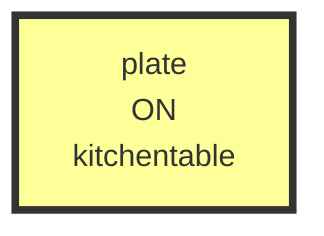

# 🚀 VirtualHome Agent Episode Log


### [GoalReasoner (Module A - Intent)] Output
```json
{
  "literal_instruction": "Put the plate we just used on the kitchentable."
}
```

### [PerceptionFilter] Output
```json
{
  "reasoning": "The goal is to place the plate on the kitchentable, so the only necessary object classes are the target object (plate) and the destination location (kitchentable).",
  "selected_classes": [
    "plate",
    "character",
    "kitchentable"
  ],
  "raw_class_count": 50
}
```

### [LLMExecutor] Output
```json
{
  "reasoning": "The goal is to ensure a plate is on the kitchentable. The current graph already shows multiple plates on kitchentable instances, but the task wording says \"the plate we just used,\" and the only specific plate from past actions is plate(15), which is no longer in the current graph. Since the active task only requires a plate on a kitchentable and there is no indication that a different plate must be manipulated, the safest next step is to work with a nearby plate that is already close to the character and place it onto the kitchentable. To satisfy the proximity rule for putback, I must first walk to the chosen table. I will use the nearby kitchentable(135) because it is close and already associated with nearby plates.",
  "satisfied_nodes": [],
  "current_node_focus": "N1",
  "mapped_variables": {},
  "action": "[walk] <kitchentable> (135)"
}
```

### [RoboStateMultiTaskController] Output
```json
{
  "action": "[walk] <kitchentable> (135)",
  "active_task_id": "task_1",
  "task_context": {
    "active_task_id": "task_1",
    "pending_task_ids": [],
    "satisfied_task_ids": []
  },
  "source": "llm_executor"
}
```
## Step 0
- **Action**: `[walk] <kitchentable> (135)`
- **Action Success**: `True`
- **Action Message**: {'0': {'message': 'Success'}}
- **Active Task**: `task_1`
- **Decision Source**: `llm_executor`
- **Task Progress**: T3_without_goal_reasoning_M4_18=pending
- **SDG Status**:

- **Observed Items (17)**: plate(75), plate(76), plate(83), plate(84), plate(91), plate(103), plate(104), kitchentable(131), kitchentable(135), character(1), plate(67), plate(68), kitchen(11), livingroom(183), bedroom(241)...


### [PerceptionFilter] Output
```json
{
  "reasoning": "Reused cached class selection.",
  "selected_classes": [
    "plate",
    "character",
    "kitchentable"
  ],
  "raw_class_count": 50
}
```

### [LLMExecutor] Output
```json
{
  "reasoning": "The goal is to place a plate on the kitchentable. The current filtered graph already shows plate(75) is ON kitchentable(135) and CLOSE to the character, so the SDG node N1 is already satisfied. No further action is needed, and I should not repeat the recent walk.",
  "satisfied_nodes": [
    "N1"
  ],
  "current_node_focus": "N1",
  "mapped_variables": {},
  "action": "[wait]"
}
```

### [RoboStateMultiTaskController] Output
```json
{
  "action": "[wait]",
  "active_task_id": "task_1",
  "task_context": {
    "active_task_id": "task_1",
    "pending_task_ids": [],
    "satisfied_task_ids": []
  },
  "source": "llm_executor"
}
```
## Step 1
- **Action**: `[wait]`
- **Action Success**: `True`
- **Action Message**: Time passes. You waited for a while.
- **Active Task**: `task_1`
- **Decision Source**: `llm_executor`
- **Task Progress**: T3_without_goal_reasoning_M4_18=pending
- **SDG Status**:

- **Observed Items (17)**: plate(75), plate(76), plate(83), plate(84), plate(91), plate(103), plate(104), kitchentable(131), kitchentable(135), character(1), plate(67), plate(68), kitchen(11), livingroom(183), bedroom(241)...


### [PerceptionFilter] Output
```json
{
  "reasoning": "Reused cached class selection.",
  "selected_classes": [
    "plate",
    "character",
    "kitchentable"
  ],
  "raw_class_count": 50
}
```

### [LLMExecutor] Output
```json
{
  "reasoning": "The goal is to place the plate on the kitchentable. The current graph already shows plate(75) ON kitchentable(135) and CLOSE character(1), so the SDG node N1 is already satisfied. No further physical action is needed; repeating a walk or put action would be unnecessary and could risk disturbing the correct state.",
  "satisfied_nodes": [
    "N1"
  ],
  "current_node_focus": "N1",
  "mapped_variables": {},
  "action": "[wait]"
}
```

### [RoboStateMultiTaskController] Output
```json
{
  "action": "[wait]",
  "active_task_id": "task_1",
  "task_context": {
    "active_task_id": "task_1",
    "pending_task_ids": [],
    "satisfied_task_ids": []
  },
  "source": "llm_executor"
}
```
## Step 2
- **Action**: `[wait]`
- **Action Success**: `True`
- **Action Message**: Time passes. You waited for a while.
- **Active Task**: `task_1`
- **Decision Source**: `llm_executor`
- **Task Progress**: T3_without_goal_reasoning_M4_18=pending
- **SDG Status**:

- **Observed Items (17)**: plate(75), plate(76), plate(83), plate(84), plate(91), plate(103), plate(104), kitchentable(131), kitchentable(135), character(1), plate(67), plate(68), kitchen(11), livingroom(183), bedroom(241)...


### [PerceptionFilter] Output
```json
{
  "reasoning": "Reused cached class selection.",
  "selected_classes": [
    "plate",
    "character",
    "kitchentable"
  ],
  "raw_class_count": 50
}
```

### [LLMExecutor] Output
```json
{
  "reasoning": "The SDG requires the plate to be ON the kitchentable. Current graph already shows plate(75) is on kitchentable(135) and close to the character, so the goal node is satisfied. No further physical action is needed.",
  "satisfied_nodes": [
    "N1"
  ],
  "current_node_focus": "N1",
  "mapped_variables": {},
  "action": "[wait]"
}
```

### [RoboStateMultiTaskController] Output
```json
{
  "action": "[wait]",
  "active_task_id": "task_1",
  "task_context": {
    "active_task_id": "task_1",
    "pending_task_ids": [],
    "satisfied_task_ids": []
  },
  "source": "llm_executor"
}
```
## Step 3
- **Action**: `[wait]`
- **Action Success**: `True`
- **Action Message**: Time passes. You waited for a while.
- **Active Task**: `task_1`
- **Decision Source**: `llm_executor`
- **Task Progress**: T3_without_goal_reasoning_M4_18=pending
- **SDG Status**:

- **Observed Items (17)**: plate(75), plate(76), plate(83), plate(84), plate(91), plate(103), plate(104), kitchentable(131), kitchentable(135), character(1), plate(67), plate(68), kitchen(11), livingroom(183), bedroom(241)...


### [PerceptionFilter] Output
```json
{
  "reasoning": "Reused cached class selection.",
  "selected_classes": [
    "plate",
    "character",
    "kitchentable"
  ],
  "raw_class_count": 50
}
```

### [LLMExecutor] Output
```json
{
  "reasoning": "The goal is to place the used plate on the kitchentable. The current graph shows plate(75) is already ON kitchentable(135) and CLOSE to the character, so the SDG node N1 is already satisfied. No further physical action is needed.",
  "satisfied_nodes": [
    "N1"
  ],
  "current_node_focus": "N1",
  "mapped_variables": {
    "?TargetTable": "kitchentable(135)",
    "?Plate": "plate(75)"
  },
  "action": "[wait]"
}
```

### [RoboStateMultiTaskController] Output
```json
{
  "action": "[wait]",
  "active_task_id": "task_1",
  "task_context": {
    "active_task_id": "task_1",
    "pending_task_ids": [],
    "satisfied_task_ids": []
  },
  "source": "llm_executor"
}
```
## Step 4
- **Action**: `[wait]`
- **Action Success**: `True`
- **Action Message**: Time passes. You waited for a while.
- **Active Task**: `task_1`
- **Decision Source**: `llm_executor`
- **Task Progress**: T3_without_goal_reasoning_M4_18=pending
- **SDG Status**:

- **Observed Items (17)**: plate(75), plate(76), plate(83), plate(84), plate(91), plate(103), plate(104), kitchentable(131), kitchentable(135), character(1), plate(67), plate(68), kitchen(11), livingroom(183), bedroom(241)...


### [PerceptionFilter] Output
```json
{
  "reasoning": "Reused cached class selection.",
  "selected_classes": [
    "plate",
    "character",
    "kitchentable"
  ],
  "raw_class_count": 50
}
```

### [LLMExecutor] Output
```json
{
  "reasoning": "The goal is to place the used plate on the kitchentable. The current graph already shows plate(75) is on kitchentable(135), and the character is close to both the plate and the table. This satisfies the SDG relation ON plate->kitchentable, so no further physical action is needed.",
  "satisfied_nodes": [
    "N1"
  ],
  "current_node_focus": "N1",
  "mapped_variables": {},
  "action": "[wait]"
}
```

### [RoboStateMultiTaskController] Output
```json
{
  "action": "[wait]",
  "active_task_id": "task_1",
  "task_context": {
    "active_task_id": "task_1",
    "pending_task_ids": [],
    "satisfied_task_ids": []
  },
  "source": "llm_executor"
}
```
