# 🚀 VirtualHome Agent Episode Log


### [GoalReasoner (Module A - Intent)] Output
```json
{
  "literal_instruction": "If there is chicken in the fridge, heat the chicken and cutlets in the microwave, put them on a plate, and place the plate on the kitchen table."
}
```

### [PerceptionFilter] Output
```json
{
  "reasoning": "Needed classes are the target foods (chicken, cutlets), the storage location to retrieve chicken (fridge), the heating appliance and possible backup for heating (microwave, stove), the serving item (plate), and the final surface/location for placement (kitchentable).",
  "selected_classes": [
    "plate",
    "chicken",
    "character",
    "stove",
    "cutlets",
    "microwave",
    "fridge",
    "kitchentable"
  ],
  "raw_class_count": 45
}
```

### [LLMExecutor] Output
```json
{
  "reasoning": "The fridge is already open and both target foods, chicken(241) and cutlets(242), are present inside it and close to the character. To start the required sequence, I should first take the chicken out of the fridge so it can later be heated in the microwave. I will focus on the chicken because N1/N3 are prerequisites for the heating chain, while the microwave is already available and there is no evidence it needs plugging in yet.",
  "satisfied_nodes": [
    "N2"
  ],
  "current_node_focus": "N1",
  "mapped_variables": {
    "?Fridge": "fridge(225)",
    "?Heater": "microwave(234)",
    "?Surface": "kitchentable(199)"
  },
  "action": "[grab] <chicken> (241)"
}
```

### [RoboStateMultiTaskController] Output
```json
{
  "action": "[grab] <chicken> (241)",
  "active_task_id": "task_1",
  "task_context": {
    "active_task_id": "task_1",
    "pending_task_ids": [],
    "satisfied_task_ids": []
  },
  "source": "llm_executor"
}
```
## Step 0
- **Action**: `[grab] <chicken> (241)`
- **Action Success**: `True`
- **Action Message**: {'0': {'message': 'Success'}}
- **Active Task**: `task_1`
- **Decision Source**: `llm_executor`
- **Task Progress**: T3_without_goal_reasoning_P1_03=pending
- **SDG Status**:
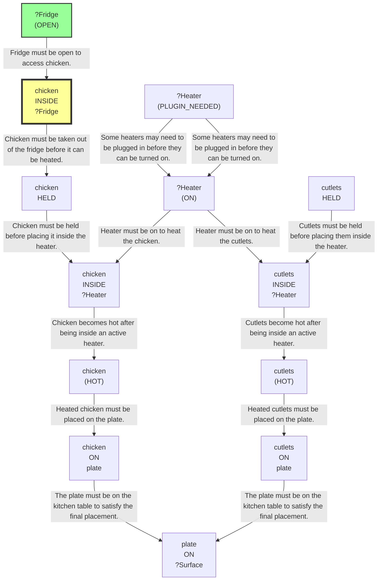
- **Observed Items (18)**: plate(170), plate(171), plate(172), plate(173), plate(177), plate(178), plate(184), kitchentable(199), fridge(225) [OPEN], stove(226) [OFF,CLOSED], microwave(234) [CLOSED,OFF], character(1), chicken(241) [COLD], cutlets(242) [COLD], bathroom(11)...


### [PerceptionFilter] Output
```json
{
  "reasoning": "Reused cached class selection.",
  "selected_classes": [
    "plate",
    "chicken",
    "character",
    "stove",
    "cutlets",
    "microwave",
    "fridge",
    "kitchentable"
  ],
  "raw_class_count": 45
}
```

### [LLMExecutor] Output
```json
{
  "reasoning": "Chicken is already held, and the fridge is open. The next unmet prerequisite is to heat the chicken, which requires placing it inside the microwave. The microwave is the best heater candidate from the graph because it is a container appliance with switch and plug properties. I need to walk to it before putting the held chicken inside.",
  "satisfied_nodes": [
    "N1",
    "N2",
    "N3"
  ],
  "current_node_focus": "N4",
  "mapped_variables": {
    "?Fridge": "fridge(225)",
    "?Heater": "microwave(234)"
  },
  "action": "[walk] <microwave> (234)"
}
```

### [RoboStateMultiTaskController] Output
```json
{
  "action": "[walk] <microwave> (234)",
  "active_task_id": "task_1",
  "task_context": {
    "active_task_id": "task_1",
    "pending_task_ids": [],
    "satisfied_task_ids": []
  },
  "source": "llm_executor"
}
```
## Step 1
- **Action**: `[walk] <microwave> (234)`
- **Action Success**: `True`
- **Action Message**: {'0': {'message': 'Success'}}
- **Active Task**: `task_1`
- **Decision Source**: `llm_executor`
- **Task Progress**: T3_without_goal_reasoning_P1_03=pending
- **SDG Status**:
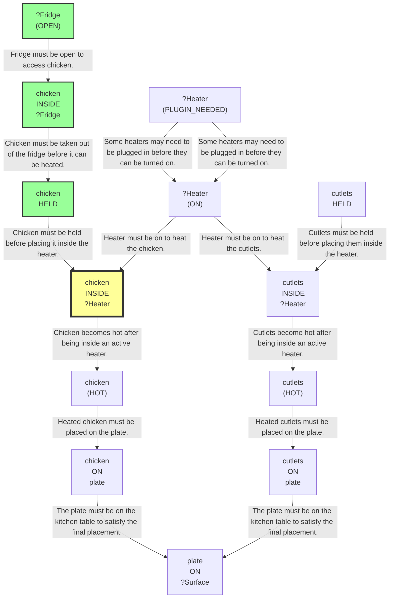
- **Observed Items (18)**: plate(170), plate(171), plate(172), plate(173), plate(177), plate(178), plate(184), kitchentable(199), fridge(225) [OPEN], stove(226) [OFF,CLOSED], microwave(234) [CLOSED,OFF], character(1), chicken(241) [COLD], cutlets(242) [COLD], bathroom(11)...


### [PerceptionFilter] Output
```json
{
  "reasoning": "Reused cached class selection.",
  "selected_classes": [
    "plate",
    "chicken",
    "character",
    "stove",
    "cutlets",
    "microwave",
    "fridge",
    "kitchentable"
  ],
  "raw_class_count": 45
}
```

### [LLMExecutor] Output
```json
{
  "reasoning": "Chicken is already held and we are close to the microwave. The next prerequisite in the SDG is to place the chicken inside the heater, but the microwave is currently CLOSED and must be opened first before putting food inside. The fridge is already open and satisfied; cutlets are still inside the fridge and will be handled after heating the chicken.",
  "satisfied_nodes": [
    "N1",
    "N2",
    "N3"
  ],
  "current_node_focus": "N6",
  "mapped_variables": {
    "?Fridge": "fridge(225)",
    "?Heater": "microwave(234)"
  },
  "action": "[open] <microwave> (234)"
}
```

### [RoboStateMultiTaskController] Output
```json
{
  "action": "[open] <microwave> (234)",
  "active_task_id": "task_1",
  "task_context": {
    "active_task_id": "task_1",
    "pending_task_ids": [],
    "satisfied_task_ids": []
  },
  "source": "llm_executor"
}
```
## Step 2
- **Action**: `[open] <microwave> (234)`
- **Action Success**: `True`
- **Action Message**: {'0': {'message': 'Success'}}
- **Active Task**: `task_1`
- **Decision Source**: `llm_executor`
- **Task Progress**: T3_without_goal_reasoning_P1_03=pending
- **SDG Status**:
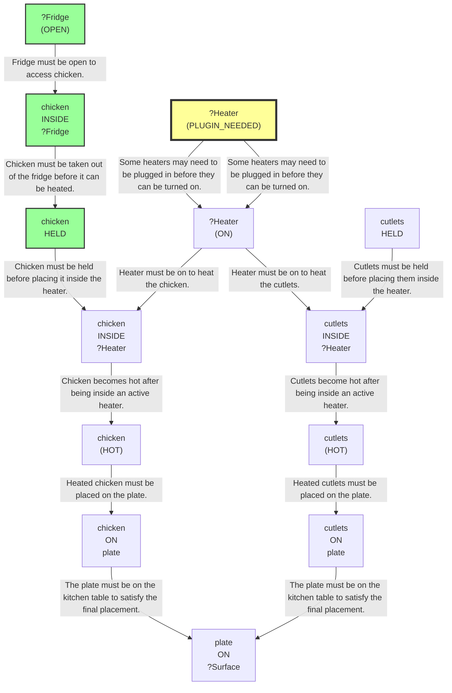
- **Observed Items (18)**: plate(170), plate(171), plate(172), plate(173), plate(177), plate(178), plate(184), kitchentable(199), fridge(225) [OPEN], stove(226) [OFF,CLOSED], microwave(234) [CLOSED,OFF], character(1), chicken(241) [COLD], cutlets(242) [COLD], bathroom(11)...


### [PerceptionFilter] Output
```json
{
  "reasoning": "Reused cached class selection.",
  "selected_classes": [
    "plate",
    "chicken",
    "character",
    "stove",
    "cutlets",
    "microwave",
    "fridge",
    "kitchentable"
  ],
  "raw_class_count": 45
}
```

### [LLMExecutor] Output
```json
{
  "reasoning": "Chicken is already held, and we are close to the opened microwave. The next required step toward heating is to place the chicken inside the microwave. The microwave is the selected heater, and it is already open and accessible. I will not repeat a walk action because the past action already moved me to the microwave.",
  "satisfied_nodes": [
    "N2",
    "N3"
  ],
  "current_node_focus": "N4",
  "mapped_variables": {
    "?Fridge": "fridge(225)",
    "?Heater": "microwave(234)"
  },
  "action": "[putin] <chicken> (241) <microwave> (234)"
}
```

### [RoboStateMultiTaskController] Output
```json
{
  "action": "[putin] <chicken> (241) <microwave> (234)",
  "active_task_id": "task_1",
  "task_context": {
    "active_task_id": "task_1",
    "pending_task_ids": [],
    "satisfied_task_ids": []
  },
  "source": "llm_executor"
}
```
## Step 3
- **Action**: `[putin] <chicken> (241) <microwave> (234)`
- **Action Success**: `True`
- **Action Message**: {'0': {'message': 'Success'}}
- **Active Task**: `task_1`
- **Decision Source**: `llm_executor`
- **Task Progress**: T3_without_goal_reasoning_P1_03=pending
- **SDG Status**:
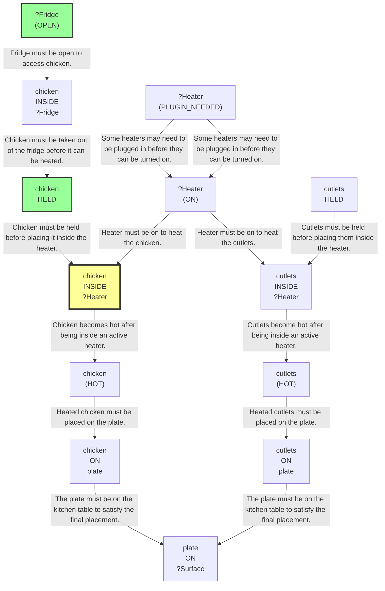
- **Observed Items (19)**: plate(170), plate(171), plate(172), plate(173), plate(177), plate(178), plate(184), kitchentable(199), fridge(225) [OPEN], stove(226) [OFF,CLOSED], microwave(234) [OPEN,OFF], character(1), chicken(241) [COLD], cutlets(242) [COLD], bathroom(11)...


### [PerceptionFilter] Output
```json
{
  "reasoning": "Reused cached class selection.",
  "selected_classes": [
    "plate",
    "chicken",
    "character",
    "stove",
    "cutlets",
    "microwave",
    "fridge",
    "kitchentable"
  ],
  "raw_class_count": 45
}
```

### [LLMExecutor] Output
```json
{
  "reasoning": "The chicken has already been removed from the fridge and placed inside the microwave. The microwave is currently OPEN but OFF, and it has HAS_PLUG, so the next required step toward heating both chicken and cutlets is to turn the microwave on. This advances the heater-on prerequisite for heating the chicken currently inside it.",
  "satisfied_nodes": [
    "N1",
    "N2",
    "N3",
    "N4"
  ],
  "current_node_focus": "N5",
  "mapped_variables": {
    "?Fridge": "fridge(225)",
    "?Heater": "microwave(234)"
  },
  "action": "[switchon] <microwave> (234)"
}
```

### [RoboStateMultiTaskController] Output
```json
{
  "action": "[switchon] <microwave> (234)",
  "active_task_id": "task_1",
  "task_context": {
    "active_task_id": "task_1",
    "pending_task_ids": [],
    "satisfied_task_ids": []
  },
  "source": "llm_executor"
}
```
## Step 4
- **Action**: `[switchon] <microwave> (234)`
- **Action Success**: `True`
- **Action Message**: Faked switch operation in Python layer (bypassed Unity failure)
- **Active Task**: `task_1`
- **Decision Source**: `llm_executor`
- **Task Progress**: T3_without_goal_reasoning_P1_03=pending
- **SDG Status**:
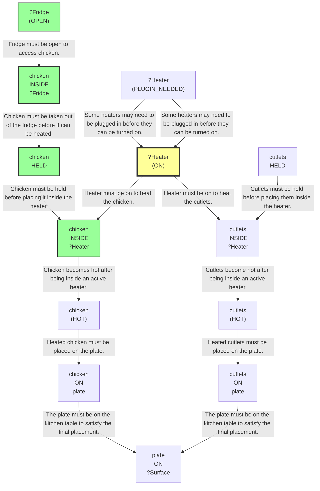
- **Observed Items (19)**: plate(170), plate(171), plate(172), plate(173), plate(177), plate(178), plate(184), kitchentable(199), fridge(225) [OPEN], stove(226) [OFF,CLOSED], microwave(234) [OPEN,OFF], character(1), chicken(241) [COLD], cutlets(242) [COLD], bathroom(11)...


### [PerceptionFilter] Output
```json
{
  "reasoning": "Reused cached class selection.",
  "selected_classes": [
    "plate",
    "chicken",
    "character",
    "stove",
    "cutlets",
    "microwave",
    "fridge",
    "kitchentable"
  ],
  "raw_class_count": 45
}
```

### [LLMExecutor] Output
```json
{
  "reasoning": "Chicken is already inside the microwave and the microwave is open and on, so N1/N2/N4/N5 are satisfied and the chicken is already HOT, satisfying N7. The next unmet prerequisite for the final plating sequence is to obtain the cutlets from the fridge so they can later be heated. The fridge is open, and cutlets(242) are the visible matching item. I should first go to the cutlets before grabbing them because of the proximity rule, and I should not repeat the last microwave walk.",
  "satisfied_nodes": [
    "N1",
    "N2",
    "N4",
    "N5",
    "N6",
    "N7"
  ],
  "current_node_focus": "N8",
  "mapped_variables": {
    "?Fridge": "fridge(225)",
    "?Heater": "microwave(234)",
    "?Surface": "kitchentable(199)"
  },
  "action": "[walk] <cutlets> (242)"
}
```

### [RoboStateMultiTaskController] Output
```json
{
  "action": "[walk] <cutlets> (242)",
  "active_task_id": "task_1",
  "task_context": {
    "active_task_id": "task_1",
    "pending_task_ids": [],
    "satisfied_task_ids": []
  },
  "source": "llm_executor"
}
```
## Step 5
- **Action**: `[walk] <cutlets> (242)`
- **Action Success**: `False`
- **Action Message**: {'0': {'message': 'ScriptExcutor 0: PROCESS WALK: Can not select object: cutlets. REASON: No interaction positions\nEXECUTION_GENERAL: Script is impossible to execute\n\n'}}
- **Active Task**: `task_1`
- **Decision Source**: `llm_executor`
- **Task Progress**: T3_without_goal_reasoning_P1_03=pending
- **SDG Status**:
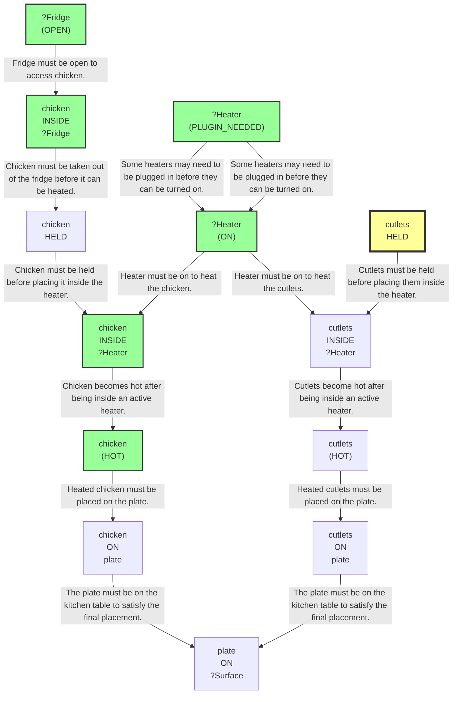
- **Observed Items (19)**: plate(170), plate(171), plate(172), plate(173), plate(177), plate(178), plate(184), kitchentable(199), fridge(225) [OPEN], stove(226) [OFF,CLOSED], microwave(234) [OPEN,ON], character(1), chicken(241) [HOT], cutlets(242) [COLD], bathroom(11)...


### [PerceptionFilter] Output
```json
{
  "reasoning": "Reused cached class selection.",
  "selected_classes": [
    "plate",
    "chicken",
    "character",
    "stove",
    "cutlets",
    "microwave",
    "fridge",
    "kitchentable"
  ],
  "raw_class_count": 45
}
```

### [LLMExecutor] Output
```json
{
  "reasoning": "Chicken is already heated and remains inside the open, on microwave. The next unmet prerequisite toward placing both heated items on a plate is to access the cutlets in the fridge. The fridge is already OPEN, and the prior failed walk indicates cutlets were not selectable from the previous context; however they are currently visible inside the fridge. We should move to the cutlets before attempting to grab them. The microwave is ON and can continue heating chicken. The best next step is to walk to cutlets so we can grab them next.",
  "satisfied_nodes": [
    "N2",
    "N5",
    "N6",
    "N7"
  ],
  "current_node_focus": "N8",
  "mapped_variables": {
    "?Fridge": "fridge(225)",
    "?Heater": "microwave(234)"
  },
  "action": "[walk] <cutlets> (242)"
}
```

### [RoboStateMultiTaskController] Output
```json
{
  "action": "[walk] <cutlets> (242)",
  "active_task_id": "task_1",
  "task_context": {
    "active_task_id": "task_1",
    "pending_task_ids": [],
    "satisfied_task_ids": []
  },
  "source": "llm_executor"
}
```
## Step 6
- **Action**: `[walk] <cutlets> (242)`
- **Action Success**: `True`
- **Action Message**: {'0': {'message': 'Success'}}
- **Active Task**: `task_1`
- **Decision Source**: `llm_executor`
- **Task Progress**: T3_without_goal_reasoning_P1_03=pending
- **SDG Status**:
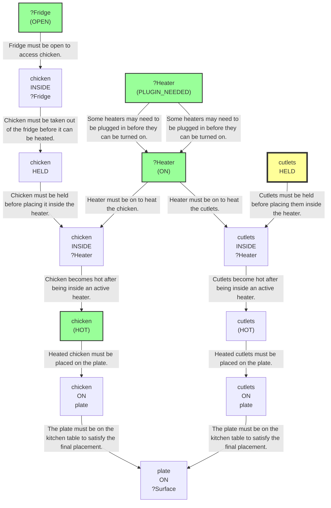
- **Observed Items (19)**: plate(170), plate(171), plate(172), plate(173), plate(177), plate(178), plate(184), kitchentable(199), fridge(225) [OPEN], stove(226) [OFF,CLOSED], microwave(234) [OPEN,ON], character(1), chicken(241) [HOT], cutlets(242) [COLD], bathroom(11)...


### [PerceptionFilter] Output
```json
{
  "reasoning": "Reused cached class selection.",
  "selected_classes": [
    "plate",
    "chicken",
    "character",
    "stove",
    "cutlets",
    "microwave",
    "fridge",
    "kitchentable"
  ],
  "raw_class_count": 45
}
```

### [LLMExecutor] Output
```json
{
  "reasoning": "The chicken is already inside the microwave and the microwave is on, so the chicken-heating part is progressing. The next unmet prerequisite for the cutlets is to access them from the fridge before heating. The fridge is open, and the graph shows cutlets(242) are close to the character, so the correct next step is to grab the cutlets. This also sets up the later sequence to place them in the microwave.",
  "satisfied_nodes": [
    "N1",
    "N2",
    "N4",
    "N5",
    "N6",
    "N7"
  ],
  "current_node_focus": "N8",
  "mapped_variables": {
    "?Fridge": "fridge(225)",
    "?Heater": "microwave(234)"
  },
  "action": "[grab] <cutlets> (242)"
}
```

### [RoboStateMultiTaskController] Output
```json
{
  "action": "[grab] <cutlets> (242)",
  "active_task_id": "task_1",
  "task_context": {
    "active_task_id": "task_1",
    "pending_task_ids": [],
    "satisfied_task_ids": []
  },
  "source": "llm_executor"
}
```
## Step 7
- **Action**: `[grab] <cutlets> (242)`
- **Action Success**: `True`
- **Action Message**: {'0': {'message': 'Success'}}
- **Active Task**: `task_1`
- **Decision Source**: `llm_executor`
- **Task Progress**: T3_without_goal_reasoning_P1_03=pending
- **SDG Status**:

- **Observed Items (19)**: plate(170), plate(171), plate(172), plate(173), plate(177), plate(178), plate(184), kitchentable(199), fridge(225) [OPEN], stove(226) [OFF,CLOSED], microwave(234) [OPEN,ON], character(1), chicken(241) [HOT], cutlets(242) [COLD], bathroom(11)...


### [PerceptionFilter] Output
```json
{
  "reasoning": "Reused cached class selection.",
  "selected_classes": [
    "plate",
    "chicken",
    "character",
    "stove",
    "cutlets",
    "microwave",
    "fridge",
    "kitchentable"
  ],
  "raw_class_count": 45
}
```

### [LLMExecutor] Output
```json
{
  "reasoning": "Chicken is already in the microwave and hot, satisfying the heating part for chicken. The next unmet prerequisite is to get cutlets inside the microwave so they can be heated. I am already holding cutlets(242), and the microwave is open and on, so the best next atomic action is to put the cutlets into the microwave. This advances N8 toward N9 while preserving the current chicken heating state.",
  "satisfied_nodes": [
    "N1",
    "N2",
    "N4",
    "N5",
    "N6",
    "N7"
  ],
  "current_node_focus": "N9",
  "mapped_variables": {
    "?Fridge": "fridge(225)",
    "?Heater": "microwave(234)"
  },
  "action": "[putin] <cutlets> (242) <microwave> (234)"
}
```

### [RoboStateMultiTaskController] Output
```json
{
  "action": "[walk] <microwave> (234)",
  "active_task_id": "task_1",
  "task_context": {
    "active_task_id": "task_1",
    "pending_task_ids": [],
    "satisfied_task_ids": []
  },
  "source": "llm_executor_repaired"
}
```
## Step 8
- **Action**: `[walk] <microwave> (234)`
- **Action Success**: `True`
- **Action Message**: {'0': {'message': 'Success'}}
- **Active Task**: `task_1`
- **Decision Source**: `llm_executor_repaired`
- **Task Progress**: T3_without_goal_reasoning_P1_03=pending
- **SDG Status**:
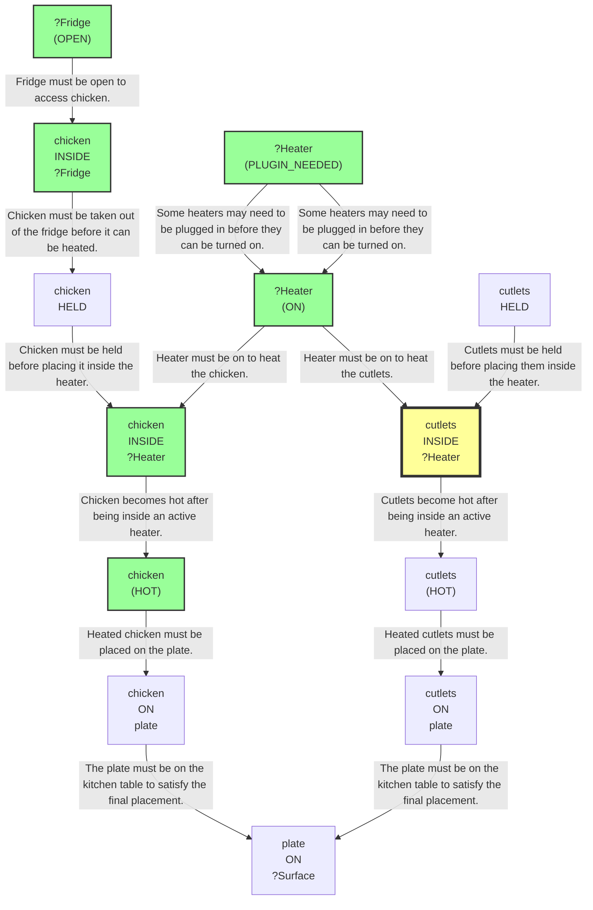
- **Observed Items (19)**: plate(170), plate(171), plate(172), plate(173), plate(177), plate(178), plate(184), kitchentable(199), fridge(225) [OPEN], stove(226) [OFF,CLOSED], microwave(234) [OPEN,ON], character(1), chicken(241) [HOT], cutlets(242) [COLD], bathroom(11)...


### [PerceptionFilter] Output
```json
{
  "reasoning": "Reused cached class selection.",
  "selected_classes": [
    "plate",
    "chicken",
    "character",
    "stove",
    "cutlets",
    "microwave",
    "fridge",
    "kitchentable"
  ],
  "raw_class_count": 45
}
```

### [LLMExecutor] Output
```json
{
  "reasoning": "Chicken is already inside the microwave and the microwave is open and on, satisfying the heating prerequisites for chicken. I am currently holding the cutlets, and the next required step toward heating them is to place them inside the active heater. Since I am already close to the microwave from the previous walk, the single next atomic action is to put the cutlets into the microwave.",
  "satisfied_nodes": [
    "N1",
    "N2",
    "N4",
    "N5",
    "N6",
    "N7",
    "N8"
  ],
  "current_node_focus": "N9",
  "mapped_variables": {
    "?Fridge": "fridge(225)",
    "?Heater": "microwave(234)"
  },
  "action": "[putin] <cutlets> (242) <microwave> (234)"
}
```

### [RoboStateMultiTaskController] Output
```json
{
  "action": "[putin] <cutlets> (242) <microwave> (234)",
  "active_task_id": "task_1",
  "task_context": {
    "active_task_id": "task_1",
    "pending_task_ids": [],
    "satisfied_task_ids": []
  },
  "source": "llm_executor"
}
```
## Step 9
- **Action**: `[putin] <cutlets> (242) <microwave> (234)`
- **Action Success**: `True`
- **Action Message**: {'0': {'message': 'Success'}}
- **Active Task**: `task_1`
- **Decision Source**: `llm_executor`
- **Task Progress**: T3_without_goal_reasoning_P1_03=pending
- **SDG Status**:
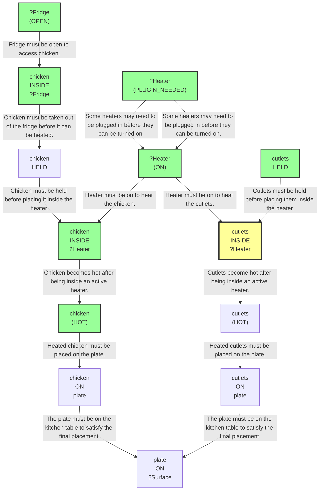
- **Observed Items (19)**: plate(170), plate(171), plate(172), plate(173), plate(177), plate(178), plate(184), kitchentable(199), fridge(225) [OPEN], stove(226) [OFF,CLOSED], microwave(234) [OPEN,ON], character(1), chicken(241) [HOT], cutlets(242) [COLD], bathroom(11)...


### [PerceptionFilter] Output
```json
{
  "reasoning": "Reused cached class selection.",
  "selected_classes": [
    "plate",
    "chicken",
    "character",
    "stove",
    "cutlets",
    "microwave",
    "fridge",
    "kitchentable"
  ],
  "raw_class_count": 45
}
```

### [LLMExecutor] Output
```json
{
  "reasoning": "Chicken and cutlets are already hot and currently inside the open microwave. The next required step is to place the heated chicken onto a plate, which requires first being near the plate destination. Plate(235) is the only plate currently in/near the microwave and is marked HOT, making it a suitable recipient. I will walk to the plate before attempting any put action, per proximity rules.",
  "satisfied_nodes": [
    "N1",
    "N2",
    "N4",
    "N5",
    "N6",
    "N7",
    "N9",
    "N10"
  ],
  "current_node_focus": "N11",
  "mapped_variables": {
    "?Fridge": "fridge(225)",
    "?Heater": "microwave(234)",
    "?Surface": "kitchentable(199)"
  },
  "action": "[walk] <plate> (235)"
}
```

### [RoboStateMultiTaskController] Output
```json
{
  "action": "[walk] <plate> (235)",
  "active_task_id": "task_1",
  "task_context": {
    "active_task_id": "task_1",
    "pending_task_ids": [],
    "satisfied_task_ids": []
  },
  "source": "llm_executor"
}
```
## Step 10
- **Action**: `[walk] <plate> (235)`
- **Action Success**: `True`
- **Action Message**: {'0': {'message': 'Success'}}
- **Active Task**: `task_1`
- **Decision Source**: `llm_executor`
- **Task Progress**: T3_without_goal_reasoning_P1_03=pending
- **SDG Status**:
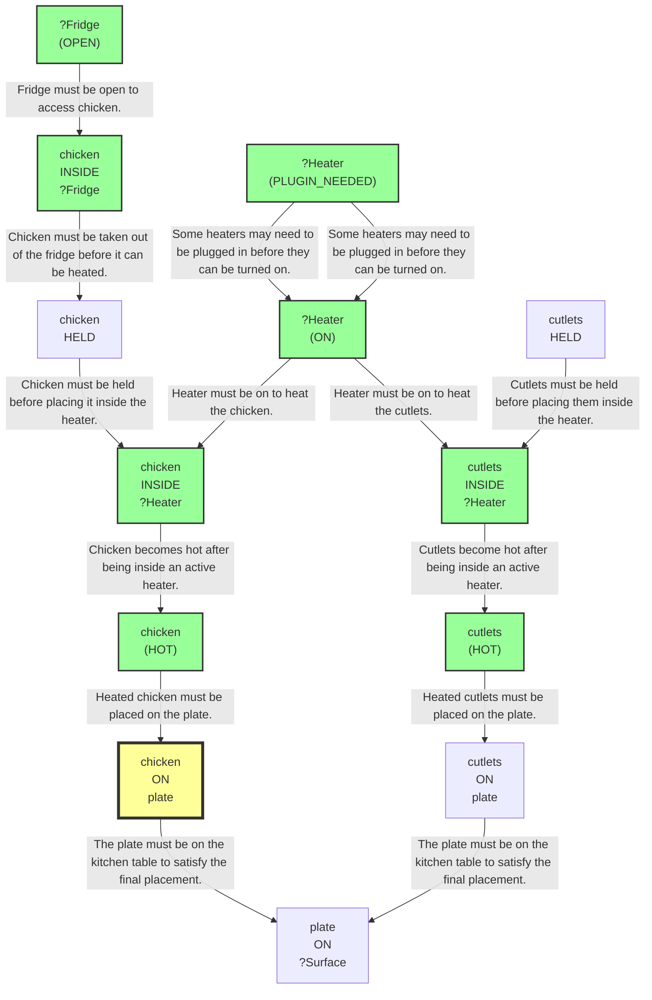
- **Observed Items (19)**: plate(170), plate(171), plate(172), plate(173), plate(177), plate(178), plate(184), kitchentable(199), fridge(225) [OPEN], stove(226) [OFF,CLOSED], microwave(234) [OPEN,ON], character(1), chicken(241) [HOT], cutlets(242) [HOT], bathroom(11)...


### [PerceptionFilter] Output
```json
{
  "reasoning": "Reused cached class selection.",
  "selected_classes": [
    "plate",
    "chicken",
    "character",
    "stove",
    "cutlets",
    "microwave",
    "fridge",
    "kitchentable"
  ],
  "raw_class_count": 45
}
```

### [LLMExecutor] Output
```json
{
  "reasoning": "Chicken and cutlets are already hot inside the open, on microwave. The next unmet prerequisite toward placing them on the plate is to retrieve the chicken from the microwave. I am currently near the microwave from the prior step, and the chicken is close to the character, so I can grab it next. This also progresses toward satisfying N3 and then N11.",
  "satisfied_nodes": [
    "N2",
    "N5",
    "N7",
    "N9",
    "N10"
  ],
  "current_node_focus": "N3",
  "mapped_variables": {
    "?Fridge": "fridge(225)",
    "?Heater": "microwave(234)"
  },
  "action": "[grab] <chicken> (241)"
}
```

### [RoboStateMultiTaskController] Output
```json
{
  "action": "[grab] <chicken> (241)",
  "active_task_id": "task_1",
  "task_context": {
    "active_task_id": "task_1",
    "pending_task_ids": [],
    "satisfied_task_ids": []
  },
  "source": "llm_executor"
}
```
## Step 11
- **Action**: `[grab] <chicken> (241)`
- **Action Success**: `True`
- **Action Message**: {'0': {'message': 'Success'}}
- **Active Task**: `task_1`
- **Decision Source**: `llm_executor`
- **Task Progress**: T3_without_goal_reasoning_P1_03=pending
- **SDG Status**:
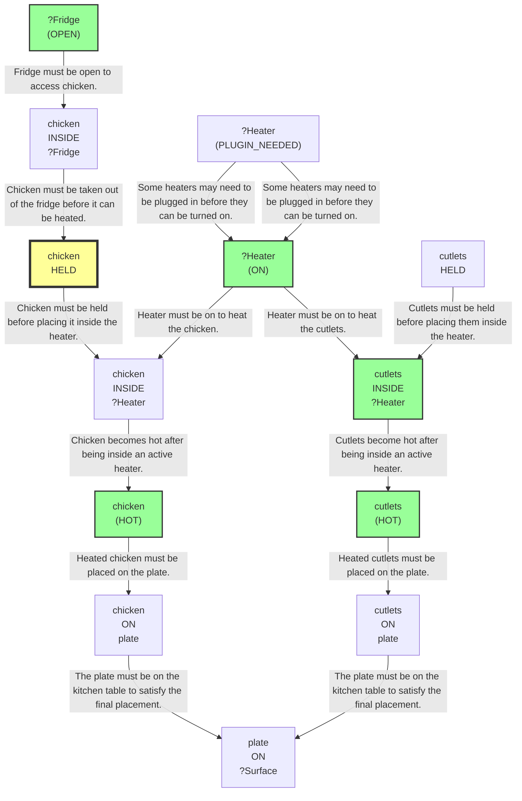
- **Observed Items (19)**: plate(170), plate(171), plate(172), plate(173), plate(177), plate(178), plate(184), kitchentable(199), fridge(225) [OPEN], stove(226) [OFF,CLOSED], microwave(234) [OPEN,ON], character(1), chicken(241) [HOT], cutlets(242) [HOT], bathroom(11)...


### [PerceptionFilter] Output
```json
{
  "reasoning": "Reused cached class selection.",
  "selected_classes": [
    "plate",
    "chicken",
    "character",
    "stove",
    "cutlets",
    "microwave",
    "fridge",
    "kitchentable"
  ],
  "raw_class_count": 45
}
```

### [LLMExecutor] Output
```json
{
  "reasoning": "Chicken is already held and hot, while the microwave is open and on. The next unmet prerequisite on the active path is to place the held chicken into the active heater before it can be considered heating/inside the microwave for the task. I choose the microwave as ?Heater because it matches the required appliance and is already open/on. I do not need to move the plate yet because the chicken has not been placed on it and the cutlets are still in the microwave.",
  "satisfied_nodes": [
    "N2",
    "N5",
    "N6",
    "N7",
    "N9",
    "N10"
  ],
  "current_node_focus": "N4",
  "mapped_variables": {
    "?Fridge": "fridge(225)",
    "?Heater": "microwave(234)",
    "?Surface": "kitchentable(199)"
  },
  "action": "[putin] <chicken> (241) <microwave> (234)"
}
```

### [RoboStateMultiTaskController] Output
```json
{
  "action": "[putin] <chicken> (241) <microwave> (234)",
  "active_task_id": "task_1",
  "task_context": {
    "active_task_id": "task_1",
    "pending_task_ids": [],
    "satisfied_task_ids": []
  },
  "source": "llm_executor"
}
```
## Step 12
- **Action**: `[putin] <chicken> (241) <microwave> (234)`
- **Action Success**: `True`
- **Action Message**: {'0': {'message': 'Success'}}
- **Active Task**: `task_1`
- **Decision Source**: `llm_executor`
- **Task Progress**: T3_without_goal_reasoning_P1_03=pending
- **SDG Status**:
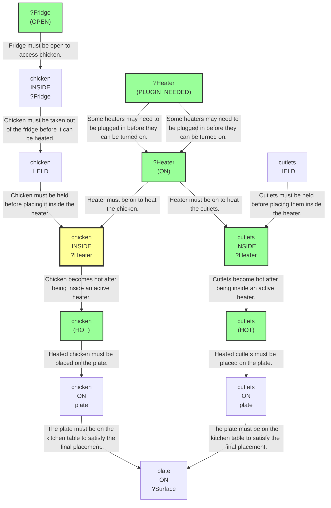
- **Observed Items (19)**: plate(170), plate(171), plate(172), plate(173), plate(177), plate(178), plate(184), kitchentable(199), fridge(225) [OPEN], stove(226) [OFF,CLOSED], microwave(234) [OPEN,ON], character(1), chicken(241) [HOT], cutlets(242) [HOT], bathroom(11)...


### [PerceptionFilter] Output
```json
{
  "reasoning": "Reused cached class selection.",
  "selected_classes": [
    "plate",
    "chicken",
    "character",
    "stove",
    "cutlets",
    "microwave",
    "fridge",
    "kitchentable"
  ],
  "raw_class_count": 45
}
```

### [LLMExecutor] Output
```json
{
  "reasoning": "The chicken and cutlets are already heated and both are currently inside the microwave, with the microwave open and on. The next required progress is to place the heated food onto the plate. Since putin requires being near the destination receptacle, and the current graph shows plate(235) is the relevant nearby plate, I should move to that plate before attempting to place the chicken or cutlets onto it.",
  "satisfied_nodes": [
    "N2",
    "N4",
    "N5",
    "N6",
    "N7",
    "N9",
    "N10"
  ],
  "current_node_focus": "N11",
  "mapped_variables": {
    "?Fridge": "fridge(225)",
    "?Heater": "microwave(234)",
    "?Surface": "kitchentable(199)"
  },
  "action": "[walk] <plate> (235)"
}
```

### [RoboStateMultiTaskController] Output
```json
{
  "action": "[walk] <plate> (235)",
  "active_task_id": "task_1",
  "task_context": {
    "active_task_id": "task_1",
    "pending_task_ids": [],
    "satisfied_task_ids": []
  },
  "source": "llm_executor"
}
```
## Step 13
- **Action**: `[walk] <plate> (235)`
- **Action Success**: `True`
- **Action Message**: {'0': {'message': 'Success'}}
- **Active Task**: `task_1`
- **Decision Source**: `llm_executor`
- **Task Progress**: T3_without_goal_reasoning_P1_03=pending
- **SDG Status**:
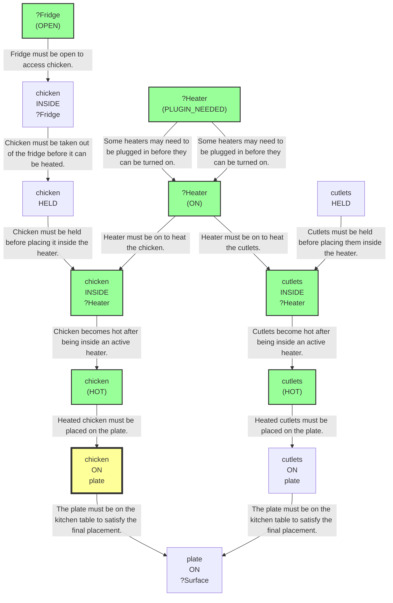
- **Observed Items (19)**: plate(170), plate(171), plate(172), plate(173), plate(177), plate(178), plate(184), kitchentable(199), fridge(225) [OPEN], stove(226) [OFF,CLOSED], microwave(234) [OPEN,ON], character(1), chicken(241) [HOT], cutlets(242) [HOT], bathroom(11)...


### [PerceptionFilter] Output
```json
{
  "reasoning": "Reused cached class selection.",
  "selected_classes": [
    "plate",
    "chicken",
    "character",
    "stove",
    "cutlets",
    "microwave",
    "fridge",
    "kitchentable"
  ],
  "raw_class_count": 45
}
```

### [LLMExecutor] Output
```json
{
  "reasoning": "The chicken and cutlets are already heated and both are inside the microwave, satisfying the hot/heated prerequisites. The next unmet step is to place the chicken on the plate, which requires first holding the chicken. I am already close to the chicken/microwave area after the last walk, so the correct next atomic action is to grab the chicken before moving it to the plate.",
  "satisfied_nodes": [
    "N2",
    "N5",
    "N7",
    "N9",
    "N10"
  ],
  "current_node_focus": "N3",
  "mapped_variables": {
    "?Fridge": "fridge(225)",
    "?Heater": "microwave(234)",
    "?Surface": "kitchentable(199)"
  },
  "action": "[grab] <chicken> (241)"
}
```

### [RoboStateMultiTaskController] Output
```json
{
  "action": "[grab] <chicken> (241)",
  "active_task_id": "task_1",
  "task_context": {
    "active_task_id": "task_1",
    "pending_task_ids": [],
    "satisfied_task_ids": []
  },
  "source": "llm_executor"
}
```
## Step 14
- **Action**: `[grab] <chicken> (241)`
- **Action Success**: `True`
- **Action Message**: {'0': {'message': 'Success'}}
- **Active Task**: `task_1`
- **Decision Source**: `llm_executor`
- **Task Progress**: T3_without_goal_reasoning_P1_03=pending
- **SDG Status**:

- **Observed Items (19)**: plate(170), plate(171), plate(172), plate(173), plate(177), plate(178), plate(184), kitchentable(199), fridge(225) [OPEN], stove(226) [OFF,CLOSED], microwave(234) [OPEN,ON], character(1), chicken(241) [HOT], cutlets(242) [HOT], bathroom(11)...

