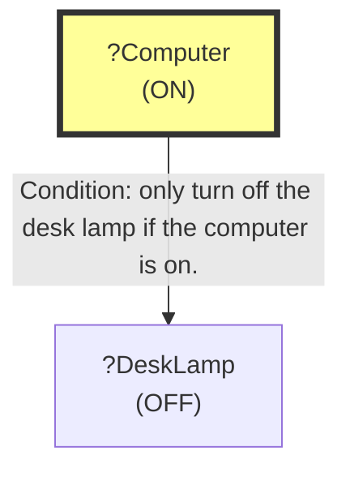

# 🚀 VirtualHome Agent Episode Log


### [GoalReasoner (Module A - Intent)] Output
```json
{
  "objects": [
    "computer",
    "desk lamp"
  ],
  "quantities": [
    1,
    1
  ],
  "states": {
    "computer": "on",
    "desk lamp": "off"
  },
  "conditions": [
    "if the computer is on"
  ],
  "destinations": [],
  "clarification_question": ""
}
```

### [PerceptionFilter] Output
```json
{
  "reasoning": "The goal requires the computer to be on and the desk lamp to be off. To satisfy this, we keep the target object class computer and the closest matching desk lamp class available, tablelamp, since no exact 'desk lamp' class is listed. The SDG adds the condition that the lamp is only turned off if the computer is on, so no extra supporting tools or locations are needed.",
  "selected_classes": [
    "desk",
    "character",
    "tablelamp",
    "computer"
  ],
  "raw_class_count": 33
}
```

### [LLMExecutor] Output
```json
{
  "reasoning": "The SDG requires the computer to be ON before turning off the desk lamp. However, the only computer present is explicitly marked BROKEN and OFF, so the prerequisite 'computer is on' is permanently impossible to satisfy. This is an inherently false precondition, so the correct next step is to report impossibility rather than attempt physical actions.",
  "satisfied_nodes": [],
  "current_node_focus": "N1",
  "mapped_variables": {
    "?Computer": "computer(174)",
    "?DeskLamp": "tablelamp(102)"
  },
  "action": "[ask] The task requires the computer to be on before the desk lamp can be turned off, but the only available computer is broken and cannot be turned on. Should I proceed with just turning off the desk lamp, or is there another computer to use?"
}
```

### [RoboStateMultiTaskController] Output
```json
{
  "action": "[ask] The task requires the computer to be on before the desk lamp can be turned off, but the only available computer is broken and cannot be turned on. Should I proceed with just turning off the desk lamp, or is there another computer to use?",
  "active_task_id": "task_1",
  "task_context": {
    "active_task_id": "task_1",
    "pending_task_ids": [],
    "satisfied_task_ids": []
  },
  "source": "llm_executor"
}
```
## Step 0
- **Action**: `[ask] The task requires the computer to be on before the desk lamp can be turned off, but the only available computer is broken and cannot be turned on. Should I proceed with just turning off the desk lamp, or is there another computer to use?`
- **Action Success**: `True`
- **Action Message**: nothing to claim
- **Active Task**: `task_1`
- **Decision Source**: `llm_executor`
- **Task Progress**: T3_without_intention_G3_12=pending
- **SDG Status**:

- **Observed Items (9)**: tablelamp(102) [ON], tablelamp(103) [ON], desk(108) [CLOSED], computer(174) [OFF,BROKEN], character(1), bathroom(11), bedroom(73), kitchen(205), livingroom(335)

