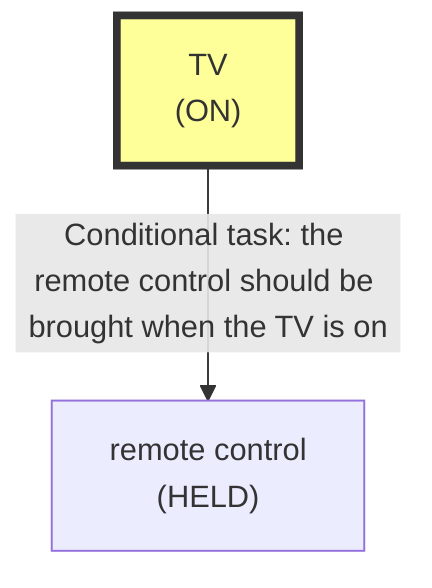

# 🚀 VirtualHome Agent Episode Log


### [GoalReasoner (Module A - Intent)] Output
```json
{
  "objects": [
    "TV",
    "remote control"
  ],
  "quantities": [
    {
      "object": "TV",
      "quantity": 1
    },
    {
      "object": "remote control",
      "quantity": 1
    }
  ],
  "states": [
    {
      "object": "TV",
      "state": "on"
    }
  ],
  "conditions": [
    {
      "if": "TV is on",
      "then": "bring the remote control"
    }
  ],
  "destinations": [],
  "clarification_question": "Where should the remote control be brought?"
}
```

### [PerceptionFilter] Output
```json
{
  "reasoning": "The goal requires interacting with the TV being on and bringing the remote control. Per exact-match retention, I must keep the TV and the remote control class. No other tool or location is explicitly required by the SDG.",
  "selected_classes": [
    "tv",
    "character",
    "remotecontrol"
  ],
  "raw_class_count": 40
}
```

### [LLMExecutor] Output
```json
{
  "reasoning": "The SDG requires TV to be ON before the remote control is brought/held. However, the only TV in the filtered graph is tv(426), which is explicitly marked BROKEN and currently OFF. Since a broken TV cannot be turned on, the fundamental precondition for the task is permanently impossible in the current environment. Per the failure-handling rules, this is an inherently false precondition, so I must ask for clarification/report impossibility rather than attempt physical actions.",
  "satisfied_nodes": [],
  "current_node_focus": "N1",
  "mapped_variables": {
    "?TV": "tv(426)",
    "?Remote": "remotecontrol(452)"
  },
  "action": "[ask] The only available TV (tv(426)) is BROKEN, so it cannot be turned on. The task condition 'if TV is on, bring the remote control' is impossible to satisfy with the current TV. Please provide a different TV or a different instruction."
}
```

### [RoboStateMultiTaskController] Output
```json
{
  "action": "[ask] The only available TV (tv(426)) is BROKEN, so it cannot be turned on. The task condition 'if TV is on, bring the remote control' is impossible to satisfy with the current TV. Please provide a different TV or a different instruction.",
  "active_task_id": "task_1",
  "task_context": {
    "active_task_id": "task_1",
    "pending_task_ids": [],
    "satisfied_task_ids": []
  },
  "source": "llm_executor"
}
```
## Step 0
- **Action**: `[ask] The only available TV (tv(426)) is BROKEN, so it cannot be turned on. The task condition 'if TV is on, bring the remote control' is impossible to satisfy with the current TV. Please provide a different TV or a different instruction.`
- **Action Success**: `True`
- **Action Message**: nothing to claim
- **Active Task**: `task_1`
- **Decision Source**: `llm_executor`
- **Task Progress**: T3_without_intention_G3_13=pending
- **SDG Status**:

- **Observed Items (7)**: tv(426) [OFF,BROKEN], remotecontrol(452) [OFF], character(1), bathroom(11), bedroom(73), kitchen(205), livingroom(335)

