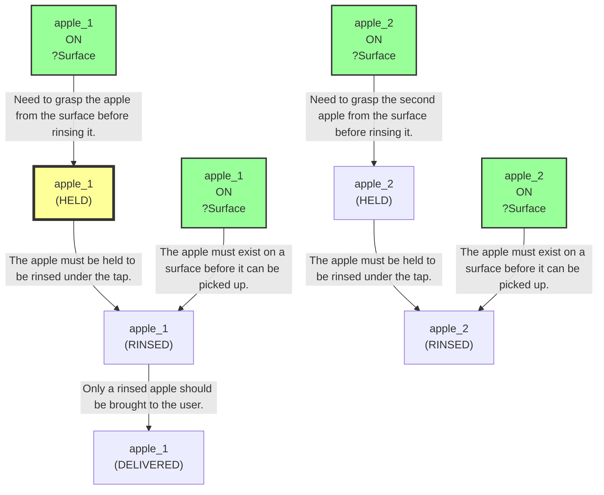
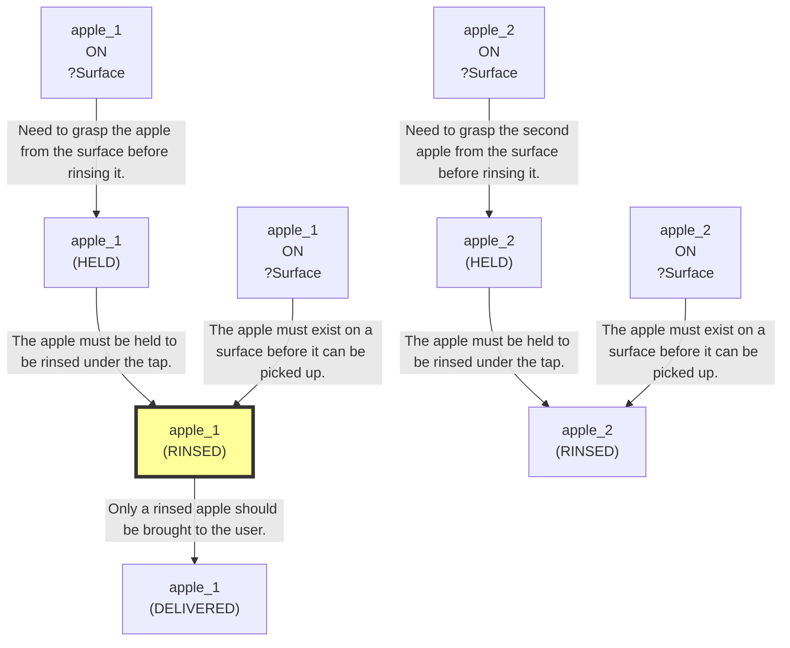
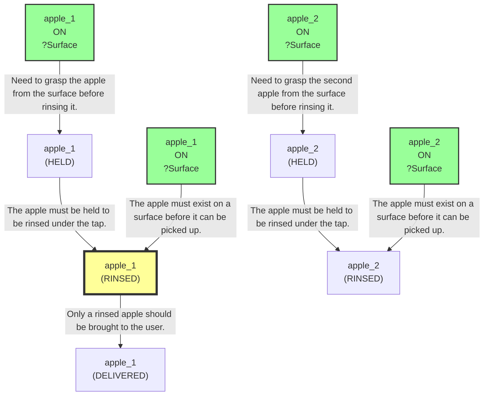
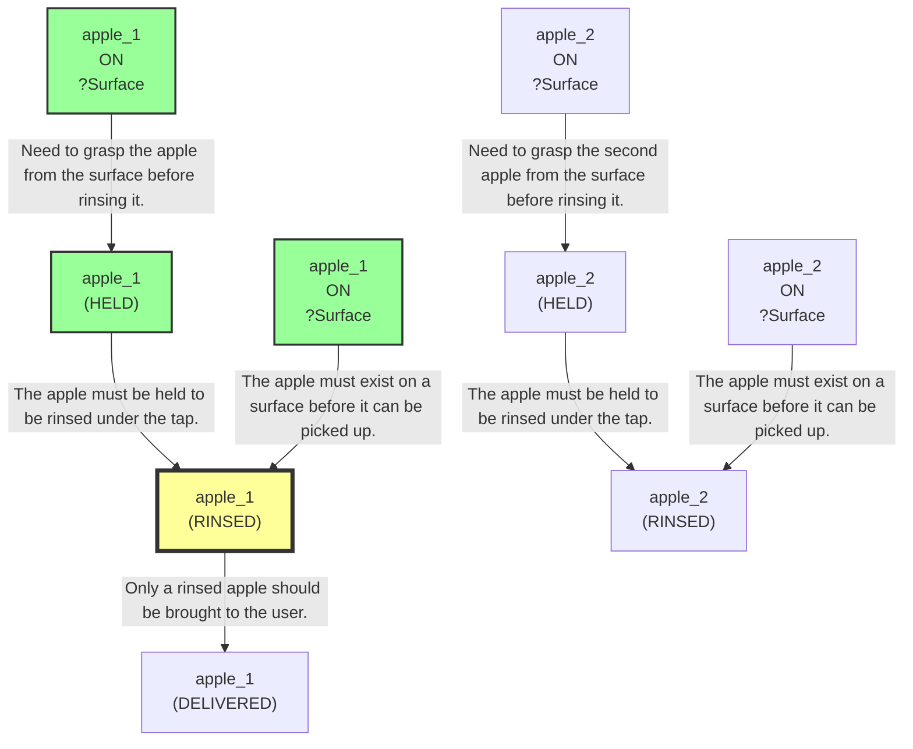

# 🚀 VirtualHome Agent Episode Log


### [GoalReasoner (Module A - Intent)] Output
```json
{
  "objects": [
    "apples",
    "table",
    "tap"
  ],
  "quantities": {
    "apples": "one"
  },
  "states": [
    "on the table",
    "rinsed"
  ],
  "conditions": [
    "if there are apples on the table"
  ],
  "destinations": [
    "me"
  ],
  "actions": [
    "rinse apples under the tap",
    "bring one apple to me"
  ],
  "clarification_question": null
}
```

### [PerceptionFilter] Output
```json
{
  "reasoning": "Need the target apple(s), the surface for locating them on the table, and the tap/faucet for rinsing. The SDG also requires holding and delivering the apple, which implies a graspable target but no extra tool beyond the apple itself. Keep the exact goal-mentioned classes and the washing/receptacle location needed for rinsing.",
  "selected_classes": [
    "kitchentable",
    "apple",
    "character",
    "faucet"
  ],
  "raw_class_count": 55
}
```

### [LLMExecutor] Output
```json
{
  "reasoning": "The active task requires one apple to be rinsed under the tap and then delivered. The current graph shows a single apple(437) on the kitchen table and currently DIRTY. Since the apple is already on the table and the character is close to the table, the next necessary step is to pick up the apple before it can be washed/rinsed at the faucet. The faucet is available but currently OFF; however, washing/rinsing cannot begin until the apple is held. I will focus on satisfying the held prerequisite for the apple.",
  "satisfied_nodes": [
    "N1",
    "N2",
    "N5",
    "N6"
  ],
  "current_node_focus": "N4",
  "mapped_variables": {
    "?Surface": "kitchentable(231)"
  },
  "action": "[grab] <apple> (437)"
}
```

### [RoboStateMultiTaskController] Output
```json
{
  "action": "[walk] <apple> (437)",
  "active_task_id": "task_1",
  "task_context": {
    "active_task_id": "task_1",
    "pending_task_ids": [],
    "satisfied_task_ids": []
  },
  "source": "llm_executor_repaired"
}
```
## Step 0
- **Action**: `[walk] <apple> (437)`
- **Action Success**: `True`
- **Action Message**: {'0': {'message': 'Success'}}
- **Active Task**: `task_1`
- **Decision Source**: `llm_executor_repaired`
- **Task Progress**: T3_without_intention_G4_17=pending
- **SDG Status**:

- **Observed Items (8)**: kitchentable(231), faucet(248) [OFF], apple(437) [DIRTY], character(1), bathroom(11), bedroom(73), kitchen(205), livingroom(335)


### [PerceptionFilter] Output
```json
{
  "reasoning": "Reused cached class selection.",
  "selected_classes": [
    "kitchentable",
    "apple",
    "character",
    "faucet"
  ],
  "raw_class_count": 55
}
```

### [LLMExecutor] Output
```json
{
  "reasoning": "The current target apple(437) is already adjacent and on the kitchen table, satisfying the prerequisite relation needed for pickup. It is still DIRTY and must be held before it can be rinsed under the tap. Since I am already close to the apple, the next atomic step is to grab it.",
  "satisfied_nodes": [
    "N1",
    "N2",
    "N5",
    "N6"
  ],
  "current_node_focus": "N4",
  "mapped_variables": {
    "?Surface": "kitchentable(231)"
  },
  "action": "[grab] <apple> (437)"
}
```

### [RoboStateMultiTaskController] Output
```json
{
  "action": "[grab] <apple> (437)",
  "active_task_id": "task_1",
  "task_context": {
    "active_task_id": "task_1",
    "pending_task_ids": [],
    "satisfied_task_ids": []
  },
  "source": "llm_executor"
}
```
## Step 1
- **Action**: `[grab] <apple> (437)`
- **Action Success**: `True`
- **Action Message**: {'0': {'message': 'Success'}}
- **Active Task**: `task_1`
- **Decision Source**: `llm_executor`
- **Task Progress**: T3_without_intention_G4_17=pending
- **SDG Status**:

- **Observed Items (8)**: kitchentable(231), faucet(248) [OFF], apple(437) [DIRTY], character(1), bathroom(11), bedroom(73), kitchen(205), livingroom(335)


### [PerceptionFilter] Output
```json
{
  "reasoning": "Reused cached class selection.",
  "selected_classes": [
    "kitchentable",
    "apple",
    "character",
    "faucet"
  ],
  "raw_class_count": 55
}
```

### [LLMExecutor] Output
```json
{
  "reasoning": "The apple_1 candidate is already in hand and is DIRTY, so the next prerequisite toward being rinsed is to move to the tap/faucet. Since washing/rinsing requires being near the sink-like water source and holding the apple, the single next atomic action should be to walk to the faucet. After that, the apple can be rinsed on the following step.",
  "satisfied_nodes": [],
  "current_node_focus": "N3",
  "mapped_variables": {
    "?Surface": "kitchentable(231)"
  },
  "action": "[walk] <faucet> (248)"
}
```

### [RoboStateMultiTaskController] Output
```json
{
  "action": "[walk] <faucet> (248)",
  "active_task_id": "task_1",
  "task_context": {
    "active_task_id": "task_1",
    "pending_task_ids": [],
    "satisfied_task_ids": []
  },
  "source": "llm_executor"
}
```
## Step 2
- **Action**: `[walk] <faucet> (248)`
- **Action Success**: `True`
- **Action Message**: {'0': {'message': 'Success'}}
- **Active Task**: `task_1`
- **Decision Source**: `llm_executor`
- **Task Progress**: T3_without_intention_G4_17=pending
- **SDG Status**:

- **Observed Items (8)**: kitchentable(231), faucet(248) [OFF], apple(437) [DIRTY], character(1), bathroom(11), bedroom(73), kitchen(205), livingroom(335)


### [PerceptionFilter] Output
```json
{
  "reasoning": "Reused cached class selection.",
  "selected_classes": [
    "kitchentable",
    "apple",
    "character",
    "faucet"
  ],
  "raw_class_count": 55
}
```

### [LLMExecutor] Output
```json
{
  "reasoning": "The apple (437) is already held and we are already close to the faucet (248), but the faucet is OFF. To rinse the held dirty apple under the tap, the tap must be turned on first. The apple-on-table prerequisite is already implicitly satisfied by the task context and the current apple object is the active target.",
  "satisfied_nodes": [
    "N1",
    "N2",
    "N5",
    "N6"
  ],
  "current_node_focus": "N3",
  "mapped_variables": {
    "?Surface": "kitchentable(231)",
    "?Washer": "faucet(248)"
  },
  "action": "[switchon] <faucet> (248)"
}
```

### [RoboStateMultiTaskController] Output
```json
{
  "action": "[switchon] <faucet> (248)",
  "active_task_id": "task_1",
  "task_context": {
    "active_task_id": "task_1",
    "pending_task_ids": [],
    "satisfied_task_ids": []
  },
  "source": "llm_executor"
}
```
## Step 3
- **Action**: `[switchon] <faucet> (248)`
- **Action Success**: `True`
- **Action Message**: Faked switch operation in Python layer (bypassed Unity failure)
- **Active Task**: `task_1`
- **Decision Source**: `llm_executor`
- **Task Progress**: T3_without_intention_G4_17=pending
- **SDG Status**:

- **Observed Items (8)**: kitchentable(231), faucet(248) [OFF], apple(437) [DIRTY], character(1), bathroom(11), bedroom(73), kitchen(205), livingroom(335)


### [PerceptionFilter] Output
```json
{
  "reasoning": "Reused cached class selection.",
  "selected_classes": [
    "kitchentable",
    "apple",
    "character",
    "faucet"
  ],
  "raw_class_count": 55
}
```

### [LLMExecutor] Output
```json
{
  "reasoning": "The apple (437) is already held and the faucet is on. The next required step to satisfy the SDG is to rinse the held apple at the faucet/sink-equivalent. Since washing requires being near a sink/dishwasher, and the faucet is the active rinse source already close to the character, the best next atomic action is to wash the apple.",
  "satisfied_nodes": [
    "N1",
    "N4",
    "N2"
  ],
  "current_node_focus": "N3",
  "mapped_variables": {
    "?Surface": "kitchentable(231)"
  },
  "action": "[wash] <apple> (437)"
}
```

### [RoboStateMultiTaskController] Output
```json
{
  "action": "[wash] <apple> (437)",
  "active_task_id": "task_1",
  "task_context": {
    "active_task_id": "task_1",
    "pending_task_ids": [],
    "satisfied_task_ids": []
  },
  "source": "llm_executor"
}
```
## Step 4
- **Action**: `[wash] <apple> (437)`
- **Action Success**: `True`
- **Action Message**: Washed successfully.
- **Active Task**: `task_1`
- **Decision Source**: `llm_executor`
- **Task Progress**: T3_without_intention_G4_17=done
- **SDG Status**:

- **Observed Items (8)**: kitchentable(231), faucet(248) [ON], apple(437) [DIRTY], character(1), bathroom(11), bedroom(73), kitchen(205), livingroom(335)

