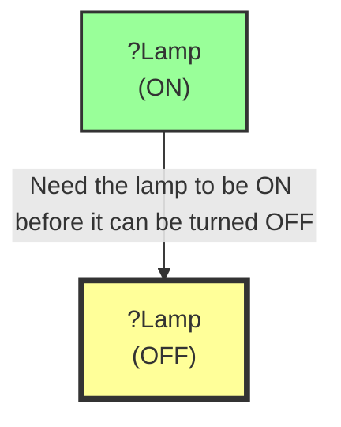

# 🚀 VirtualHome Agent Episode Log


### [GoalReasoner (Module A - Intent)] Output
```json
{
  "objects": [
    "desk lamp"
  ],
  "quantities": [
    1
  ],
  "states": [
    {
      "object": "desk lamp",
      "state": "on"
    },
    {
      "object": "desk lamp",
      "state": "off"
    }
  ],
  "conditions": [
    {
      "if": {
        "object": "desk lamp",
        "state": "on"
      }
    }
  ],
  "destinations": [],
  "action": "turn off",
  "clarification_question": "Should the desk lamp be turned off only if it is currently on?"
}
```

### [PerceptionFilter] Output
```json
{
  "reasoning": "The goal is to turn off a desk lamp, and the SDG requires the lamp to be ON before it can be turned OFF. The visible exact lamp-like class matching this target is tablelamp, so it must be kept as the needed object class. No other tools or locations are required.",
  "selected_classes": [
    "desk",
    "character",
    "tablelamp"
  ],
  "raw_class_count": 33
}
```

### [LLMExecutor] Output
```json
{
  "reasoning": "The active task is to turn off a desk lamp only if it is currently on. The filtered graph shows two candidate desk lamps, both in the ON state: tablelamp(102) and tablelamp(103). The SDG requires moving from ON to OFF, so the current focus is to satisfy OFF by switching off one lamp. Since there is no indication that one of these is already the designated lamp, and the user asked about turning off a desk lamp if on, any currently ON desk lamp is a valid match. I will start with one ON lamp and attempt to switch it off. A walk is required before interacting with the lamp.",
  "satisfied_nodes": [
    "N2"
  ],
  "current_node_focus": "N1",
  "mapped_variables": {
    "?Lamp": "tablelamp(102)"
  },
  "action": "[walk] <tablelamp> (102)"
}
```

### [RoboStateMultiTaskController] Output
```json
{
  "action": "[walk] <tablelamp> (102)",
  "active_task_id": "task_1",
  "task_context": {
    "active_task_id": "task_1",
    "pending_task_ids": [],
    "satisfied_task_ids": []
  },
  "source": "llm_executor"
}
```
## Step 0
- **Action**: `[walk] <tablelamp> (102)`
- **Action Success**: `True`
- **Action Message**: {'0': {'message': 'Success'}}
- **Active Task**: `task_1`
- **Decision Source**: `llm_executor`
- **Task Progress**: T3_without_intention_G4_19=pending
- **SDG Status**:

- **Observed Items (8)**: tablelamp(102) [ON], tablelamp(103) [ON], desk(108) [CLOSED], character(1), bathroom(11), bedroom(73), kitchen(205), livingroom(335)


### [PerceptionFilter] Output
```json
{
  "reasoning": "Reused cached class selection.",
  "selected_classes": [
    "desk",
    "character",
    "tablelamp"
  ],
  "raw_class_count": 33
}
```

### [LLMExecutor] Output
```json
{
  "reasoning": "The active task is to turn off a desk lamp only if it is currently on. The filtered graph shows tablelamp(102) is ON and we are already close to it, so the next atomic step is to switch it off. This directly satisfies the final SDG node N1 (OFF).",
  "satisfied_nodes": [
    "N2"
  ],
  "current_node_focus": "N1",
  "mapped_variables": {
    "?Lamp": "tablelamp(102)"
  },
  "action": "[switchoff] <tablelamp> (102)"
}
```

### [RoboStateMultiTaskController] Output
```json
{
  "action": "[switchoff] <tablelamp> (102)",
  "active_task_id": "task_1",
  "task_context": {
    "active_task_id": "task_1",
    "pending_task_ids": [],
    "satisfied_task_ids": []
  },
  "source": "llm_executor"
}
```
## Step 1
- **Action**: `[switchoff] <tablelamp> (102)`
- **Action Success**: `True`
- **Action Message**: Faked switch operation in Python layer (bypassed Unity failure)
- **Active Task**: `task_1`
- **Decision Source**: `llm_executor`
- **Task Progress**: T3_without_intention_G4_19=done
- **SDG Status**:

- **Observed Items (8)**: tablelamp(102) [ON], tablelamp(103) [ON], desk(108) [CLOSED], character(1), bathroom(11), bedroom(73), kitchen(205), livingroom(335)

