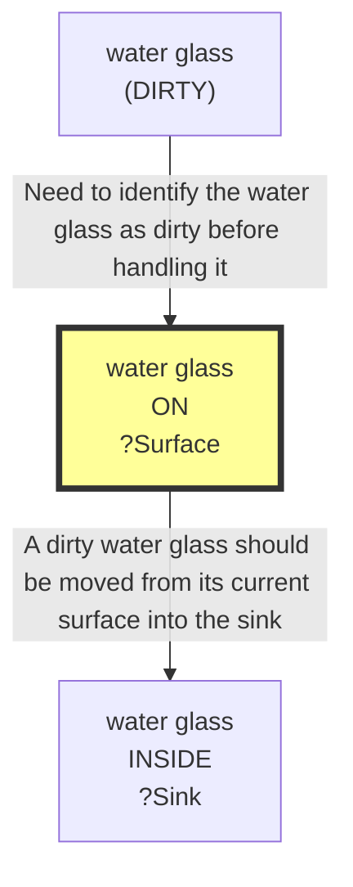
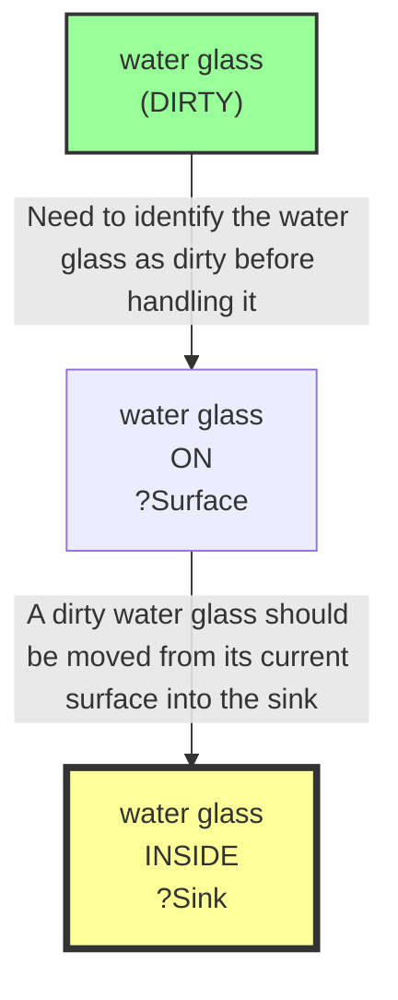
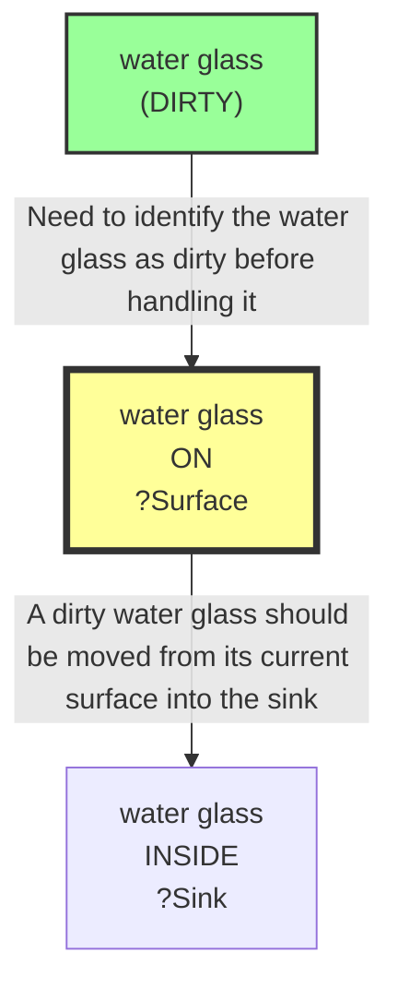
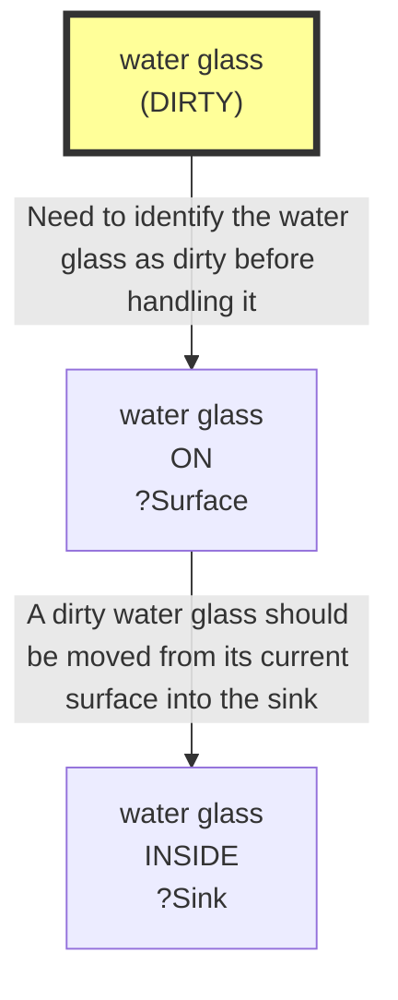
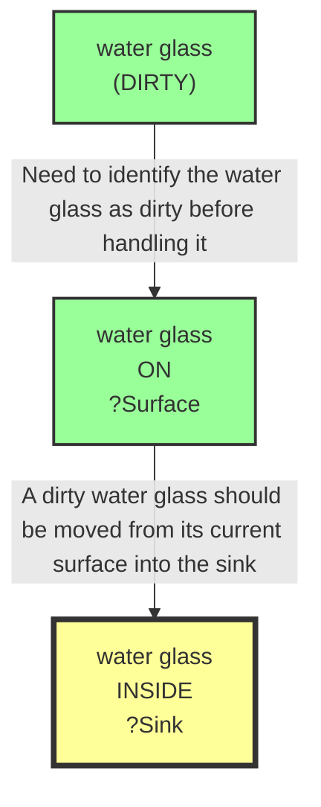

# 🚀 VirtualHome Agent Episode Log


### [GoalReasoner (Module A - Intent)] Output
```json
{
  "objects": [
    "dirty water glasses",
    "sink"
  ],
  "quantities": [
    "plural glasses"
  ],
  "states": [
    "dirty"
  ],
  "conditions": [
    "if you see dirty water glasses"
  ],
  "destinations": [
    "sink"
  ],
  "action": "put them in the sink right away",
  "clarification_question": null
}
```

### [PerceptionFilter] Output
```json
{
  "reasoning": "The goal is to locate dirty water glasses and place them in the sink. So the required classes are the target object waterglass, the destination sink, and any plausible alternative washing receptacles/appliances that match the sink capability in case of backup use, such as dishwasher. Since the action is just moving them into the sink, no extra tools are needed.",
  "selected_classes": [
    "waterglass",
    "sink",
    "dishwasher",
    "character"
  ],
  "raw_class_count": 50
}
```

### [LLMExecutor] Output
```json
{
  "reasoning": "There is one dirty water glass visible: waterglass(64). The task is to put dirty water glasses in the sink right away. Since the sink is the destination and [putback] into a sink is the correct placement action for this engine, I must first walk to the sink before I can place the glass there. I am not yet holding the glass, so the next atomic step should be to approach the dirty glass first? However, the required sequence for moving an object is walk to the object, grab it, then walk to the destination. Because only one atomic action is allowed, the most progress-making next step is to walk to the dirty glass that needs handling. The closest dirty candidate is waterglass(64), and it is not currently close to the character, so I should move to it first.",
  "satisfied_nodes": [],
  "current_node_focus": "N1",
  "mapped_variables": {
    "?Surface": "kitchen surface (implicit current surface for waterglass(64))",
    "?Sink": "sink(155)"
  },
  "action": "[walk] <waterglass> (64)"
}
```

### [RoboStateMultiTaskController] Output
```json
{
  "action": "[walk] <waterglass> (64)",
  "active_task_id": "task_1",
  "task_context": {
    "active_task_id": "task_1",
    "pending_task_ids": [],
    "satisfied_task_ids": []
  },
  "source": "llm_executor"
}
```
## Step 0
- **Action**: `[walk] <waterglass> (64)`
- **Action Success**: `True`
- **Action Message**: {'0': {'message': 'Success'}}
- **Active Task**: `task_1`
- **Decision Source**: `llm_executor`
- **Task Progress**: T3_without_intention_M1_03=pending
- **SDG Status**:

- **Observed Items (16)**: waterglass(64) [DIRTY], waterglass(71), waterglass(72), waterglass(79), waterglass(80), waterglass(87), waterglass(88), waterglass(100), sink(155), dishwasher(165) [CLOSED,OFF], character(1), kitchen(11), livingroom(183), bedroom(241), bathroom(285)...


### [PerceptionFilter] Output
```json
{
  "reasoning": "Reused cached class selection.",
  "selected_classes": [
    "waterglass",
    "sink",
    "dishwasher",
    "character"
  ],
  "raw_class_count": 50
}
```

### [LLMExecutor] Output
```json
{
  "reasoning": "The active task is to put dirty water glasses into the sink right away. We are already close to dirty waterglass(64), and it is the only visible water glass with the required DIRTY state. The sink(155) is the target destination and, per rules, must be walked to before putting an object into it. The next atomic step is to move to the sink so we can place the dirty glass there on the following action.",
  "satisfied_nodes": [
    "N3"
  ],
  "current_node_focus": "N2",
  "mapped_variables": {
    "?Sink": "sink(155)",
    "?Surface": "kitchen(11)"
  },
  "action": "[walk] <sink> (155)"
}
```

### [RoboStateMultiTaskController] Output
```json
{
  "action": "[walk] <sink> (155)",
  "active_task_id": "task_1",
  "task_context": {
    "active_task_id": "task_1",
    "pending_task_ids": [],
    "satisfied_task_ids": []
  },
  "source": "llm_executor"
}
```
## Step 1
- **Action**: `[walk] <sink> (155)`
- **Action Success**: `True`
- **Action Message**: {'0': {'message': 'Success'}}
- **Active Task**: `task_1`
- **Decision Source**: `llm_executor`
- **Task Progress**: T3_without_intention_M1_03=pending
- **SDG Status**:

- **Observed Items (16)**: waterglass(64) [DIRTY], waterglass(71), waterglass(72), waterglass(79), waterglass(80), waterglass(87), waterglass(88), waterglass(100), sink(155), dishwasher(165) [CLOSED,OFF], character(1), kitchen(11), livingroom(183), bedroom(241), bathroom(285)...


### [PerceptionFilter] Output
```json
{
  "reasoning": "Reused cached class selection.",
  "selected_classes": [
    "waterglass",
    "sink",
    "dishwasher",
    "character"
  ],
  "raw_class_count": 50
}
```

### [LLMExecutor] Output
```json
{
  "reasoning": "The goal is to put dirty water glasses into the sink. A dirty waterglass is present: waterglass(64) has state DIRTY. The robot is already close to the sink(155), and the sink is a valid flat surface for putback. The next required step to move the glass into the sink is to first be near the glass before grabbing it, since we are currently not near waterglass(64) according to the graph. Therefore the single next action is to walk to the dirty glass.",
  "satisfied_nodes": [
    "N3"
  ],
  "current_node_focus": "N1",
  "mapped_variables": {
    "?Sink": "sink(155)",
    "?Surface": "kitchen(11)"
  },
  "action": "[walk] <waterglass> (64)"
}
```

### [RoboStateMultiTaskController] Output
```json
{
  "action": "[walk] <waterglass> (64)",
  "active_task_id": "task_1",
  "task_context": {
    "active_task_id": "task_1",
    "pending_task_ids": [],
    "satisfied_task_ids": []
  },
  "source": "llm_executor"
}
```
## Step 2
- **Action**: `[walk] <waterglass> (64)`
- **Action Success**: `True`
- **Action Message**: {'0': {'message': 'Success'}}
- **Active Task**: `task_1`
- **Decision Source**: `llm_executor`
- **Task Progress**: T3_without_intention_M1_03=pending
- **SDG Status**:

- **Observed Items (16)**: waterglass(64) [DIRTY], waterglass(71), waterglass(72), waterglass(79), waterglass(80), waterglass(87), waterglass(88), waterglass(100), sink(155), dishwasher(165) [CLOSED,OFF], character(1), kitchen(11), livingroom(183), bedroom(241), bathroom(285)...


### [PerceptionFilter] Output
```json
{
  "reasoning": "Reused cached class selection.",
  "selected_classes": [
    "waterglass",
    "sink",
    "dishwasher",
    "character"
  ],
  "raw_class_count": 50
}
```

### [LLMExecutor] Output
```json
{
  "reasoning": "A dirty water glass is currently identified as waterglass(64), and it is already close to the character. The goal is to put dirty water glasses in the sink right away. Since the sink is a flat surface in this engine, the next required step after being near the glass is to move it into the sink. I am already near the sink from prior steps, but to obey the proximity rule for placing into a destination, the next atomic action should be to walk to the sink before putting the glass there. However, because I must output only one action and the last action was walking to the glass, the best immediate progression is to walk to the sink again to ensure proximity for the placement.",
  "satisfied_nodes": [
    "N3"
  ],
  "current_node_focus": "N2",
  "mapped_variables": {
    "?Sink": "sink(155)",
    "?Surface": "kitchen(11)"
  },
  "action": "[walk] <sink> (155)"
}
```

### [RoboStateMultiTaskController] Output
```json
{
  "action": "[walk] <sink> (155)",
  "active_task_id": "task_1",
  "task_context": {
    "active_task_id": "task_1",
    "pending_task_ids": [],
    "satisfied_task_ids": []
  },
  "source": "llm_executor"
}
```
## Step 3
- **Action**: `[walk] <sink> (155)`
- **Action Success**: `True`
- **Action Message**: {'0': {'message': 'Success'}}
- **Active Task**: `task_1`
- **Decision Source**: `llm_executor`
- **Task Progress**: T3_without_intention_M1_03=pending
- **SDG Status**:

- **Observed Items (16)**: waterglass(64) [DIRTY], waterglass(71), waterglass(72), waterglass(79), waterglass(80), waterglass(87), waterglass(88), waterglass(100), sink(155), dishwasher(165) [CLOSED,OFF], character(1), kitchen(11), livingroom(183), bedroom(241), bathroom(285)...


### [PerceptionFilter] Output
```json
{
  "reasoning": "Reused cached class selection.",
  "selected_classes": [
    "waterglass",
    "sink",
    "dishwasher",
    "character"
  ],
  "raw_class_count": 50
}
```

### [LLMExecutor] Output
```json
{
  "reasoning": "A dirty water glass is present and identified as waterglass(64), which satisfies the dirty-glass condition in the SDG. The goal is to put dirty water glasses into the sink right away. The sink(155) is already close to the character, and for placing into the sink the correct action is putback onto the sink surface. Since the glass is not currently held, I must first grab it, but the required next atomic action should move toward obtaining the target object from its current location; however, because the prompt forbids repeating a walk action if just done, and the last steps only indicate walking to the glass/sink without a confirmed grab, the most progress-safe next step is to grab the dirty water glass now if already near it.",
  "satisfied_nodes": [
    "N3"
  ],
  "current_node_focus": "N1",
  "mapped_variables": {
    "?Sink": "sink(155)",
    "?Surface": "kitchen(11)"
  },
  "action": "[grab] <waterglass> (64)"
}
```

### [RoboStateMultiTaskController] Output
```json
{
  "action": "[walk] <waterglass> (64)",
  "active_task_id": "task_1",
  "task_context": {
    "active_task_id": "task_1",
    "pending_task_ids": [],
    "satisfied_task_ids": []
  },
  "source": "llm_executor_repaired"
}
```
## Step 4
- **Action**: `[walk] <waterglass> (64)`
- **Action Success**: `True`
- **Action Message**: {'0': {'message': 'Success'}}
- **Active Task**: `task_1`
- **Decision Source**: `llm_executor_repaired`
- **Task Progress**: T3_without_intention_M1_03=pending
- **SDG Status**:

- **Observed Items (16)**: waterglass(64) [DIRTY], waterglass(71), waterglass(72), waterglass(79), waterglass(80), waterglass(87), waterglass(88), waterglass(100), sink(155), dishwasher(165) [CLOSED,OFF], character(1), kitchen(11), livingroom(183), bedroom(241), bathroom(285)...


### [PerceptionFilter] Output
```json
{
  "reasoning": "Reused cached class selection.",
  "selected_classes": [
    "waterglass",
    "sink",
    "dishwasher",
    "character"
  ],
  "raw_class_count": 50
}
```

### [LLMExecutor] Output
```json
{
  "reasoning": "The active goal is to put any dirty water glasses into the sink. Waterglass(64) is confirmed DIRTY and already close to the character, so it is the best current target. The sink(155) is the required destination and must be approached explicitly before placing anything into it. Since the last action was a walk to waterglass(64), I should now move to the sink to prepare for putting the glass inside on the next step.",
  "satisfied_nodes": [
    "N3"
  ],
  "current_node_focus": "N1",
  "mapped_variables": {
    "?Sink": "sink(155)",
    "?Surface": "kitchen(11)"
  },
  "action": "[walk] <sink> (155)"
}
```

### [RoboStateMultiTaskController] Output
```json
{
  "action": "[walk] <livingroom> (183)",
  "active_task_id": null,
  "task_context": {
    "active_task_id": null,
    "pending_task_ids": [
      "task_1"
    ],
    "satisfied_task_ids": []
  },
  "source": "loop_recovery_room_revisit"
}
```
## Step 5
- **Action**: `[walk] <livingroom> (183)`
- **Action Success**: `True`
- **Action Message**: {'0': {'message': 'Success'}}
- **Decision Source**: `loop_recovery_room_revisit`
- **Task Progress**: T3_without_intention_M1_03=pending
- **SDG Status**:
No SDG active.
- **Observed Items (159)**: wall(12), wall(13), wall(14), wall(15), wall(16), wall(17), wall(18), wall(19), wall(20), wall(21), floor(22), floor(23), floor(24), floor(25), floor(26)...


### [PerceptionFilter] Output
```json
{
  "reasoning": "The goal is to identify dirty water glasses and put them in the sink. The minimum required classes are the target object itself and the destination receptacle. Since the SDG specifies water glass and sink, both must be kept; no additional tools are required for just moving them into the sink.",
  "selected_classes": [
    "waterglass",
    "sink",
    "character"
  ],
  "raw_class_count": 59
}
```

### [LLMExecutor] Output
```json
{
  "reasoning": "The dirty water glass is identified as waterglass(64) and is already CLOSE to the character, so the next required step toward putting it in the sink is to pick it up. The sink is also present as sink(155), but per task sequence we must grab the glass before walking it to the sink and putting it in. This advances N3/N1 toward N2.",
  "satisfied_nodes": [],
  "current_node_focus": "N3",
  "mapped_variables": {
    "?Sink": "sink(155)",
    "?Surface": "kitchen(11)"
  },
  "action": "[grab] <waterglass> (64)"
}
```

### [RoboStateMultiTaskController] Output
```json
{
  "action": "[grab] <waterglass> (64)",
  "active_task_id": "task_1",
  "task_context": {
    "active_task_id": "task_1",
    "pending_task_ids": [],
    "satisfied_task_ids": []
  },
  "source": "llm_executor"
}
```
## Step 6
- **Action**: `[grab] <waterglass> (64)`
- **Action Success**: `False`
- **Action Message**: temporary_unavailable: target disappeared; wait or search and retry
- **Active Task**: `task_1`
- **Decision Source**: `llm_executor`
- **Task Progress**: T3_without_intention_M1_03=pending
- **SDG Status**:

- **Observed Items (15)**: waterglass(64) [DIRTY], waterglass(71), waterglass(72), waterglass(79), waterglass(80), waterglass(87), waterglass(88), waterglass(100), sink(155), character(1), kitchen(11), livingroom(183), bedroom(241), bathroom(285), bedroom(346)


### [PerceptionFilter] Output
```json
{
  "reasoning": "Reused cached class selection.",
  "selected_classes": [
    "waterglass",
    "sink",
    "character"
  ],
  "raw_class_count": 59
}
```

### [LLMExecutor] Output
```json
{
  "reasoning": "The prior grab on waterglass(64) failed because it temporarily disappeared, which indicates another person may be using it. Per the disappearance strategy, I should wait in place rather than switching targets or repeating walks. The glass is still the best candidate because it is dirty and close to the character, matching the SDG prerequisite for moving a dirty water glass into the sink.",
  "satisfied_nodes": [],
  "current_node_focus": "N3",
  "mapped_variables": {
    "?Sink": "sink(155)",
    "?Surface": "kitchen(11)"
  },
  "action": "[wait]"
}
```

### [RoboStateMultiTaskController] Output
```json
{
  "action": "[wait]",
  "active_task_id": "task_1",
  "task_context": {
    "active_task_id": "task_1",
    "pending_task_ids": [],
    "satisfied_task_ids": []
  },
  "source": "llm_executor"
}
```
## Step 7
- **Action**: `[wait]`
- **Action Success**: `True`
- **Action Message**: Time passes. You waited for a while.
- **Active Task**: `task_1`
- **Decision Source**: `llm_executor`
- **Task Progress**: T3_without_intention_M1_03=pending
- **SDG Status**:

- **Observed Items (15)**: waterglass(64) [DIRTY], waterglass(71), waterglass(72), waterglass(79), waterglass(80), waterglass(87), waterglass(88), waterglass(100), sink(155), character(1), kitchen(11), livingroom(183), bedroom(241), bathroom(285), bedroom(346)


### [PerceptionFilter] Output
```json
{
  "reasoning": "Reused cached class selection.",
  "selected_classes": [
    "waterglass",
    "sink",
    "character"
  ],
  "raw_class_count": 59
}
```

### [LLMExecutor] Output
```json
{
  "reasoning": "The target dirty water glass is still present and is now close to the character: waterglass(64) has DIRTY state and is CLOSE to character(1). The sink exists as sink(155), but per the task we must first grab the dirty glass before putting it in the sink. Since the previous grab failed only because the object temporarily disappeared, and we already waited, the best next step is to retry grabbing the same dirty glass now that it is visible and nearby. This is the necessary step toward satisfying N3 and then N2; N1 is not yet confirmed but the glass is identified by its dirty state and current proximity.",
  "satisfied_nodes": [
    "N3"
  ],
  "current_node_focus": "N1",
  "mapped_variables": {
    "?Sink": "sink(155)",
    "?Surface": "kitchen(11)"
  },
  "action": "[grab] <waterglass> (64)"
}
```

### [RoboStateMultiTaskController] Output
```json
{
  "action": "[grab] <waterglass> (64)",
  "active_task_id": "task_1",
  "task_context": {
    "active_task_id": "task_1",
    "pending_task_ids": [],
    "satisfied_task_ids": []
  },
  "source": "llm_executor"
}
```
## Step 8
- **Action**: `[grab] <waterglass> (64)`
- **Action Success**: `False`
- **Action Message**: temporary_unavailable: target is temporarily hidden
- **Active Task**: `task_1`
- **Decision Source**: `llm_executor`
- **Task Progress**: T3_without_intention_M1_03=pending
- **SDG Status**:

- **Observed Items (15)**: waterglass(64) [DIRTY], waterglass(71), waterglass(72), waterglass(79), waterglass(80), waterglass(87), waterglass(88), waterglass(100), sink(155), character(1), kitchen(11), livingroom(183), bedroom(241), bathroom(285), bedroom(346)


### [PerceptionFilter] Output
```json
{
  "reasoning": "Reused cached class selection.",
  "selected_classes": [
    "waterglass",
    "sink",
    "character"
  ],
  "raw_class_count": 59
}
```

### [LLMExecutor] Output
```json
{
  "reasoning": "The target dirty water glass is still not in hand, and previous grab attempts on waterglass(64) failed because it was temporarily unavailable/hidden. The graph now shows waterglass(64) is close to the character again, so the correct next step is to retry grabbing that exact dirty glass. This advances N3/N1 toward moving it into the sink. I should not walk again because the object is already marked CLOSE character(1), and the instruction says not to repeat a walk if just done.",
  "satisfied_nodes": [],
  "current_node_focus": "N3",
  "mapped_variables": {
    "?Sink": "sink(155)",
    "?Surface": "kitchen surface context"
  },
  "action": "[grab] <waterglass> (64)"
}
```

### [RoboStateMultiTaskController] Output
```json
{
  "action": "[grab] <waterglass> (64)",
  "active_task_id": "task_1",
  "task_context": {
    "active_task_id": "task_1",
    "pending_task_ids": [],
    "satisfied_task_ids": []
  },
  "source": "llm_executor"
}
```
## Step 9
- **Action**: `[grab] <waterglass> (64)`
- **Action Success**: `False`
- **Action Message**: temporary_unavailable: target is temporarily hidden
- **Active Task**: `task_1`
- **Decision Source**: `llm_executor`
- **Task Progress**: T3_without_intention_M1_03=pending
- **SDG Status**:

- **Observed Items (15)**: waterglass(64) [DIRTY], waterglass(71), waterglass(72), waterglass(79), waterglass(80), waterglass(87), waterglass(88), waterglass(100), sink(155), character(1), kitchen(11), livingroom(183), bedroom(241), bathroom(285), bedroom(346)


### [RoboStateMultiTaskController] Output
```json
{
  "action": "[walk] <bedroom> (241)",
  "active_task_id": null,
  "task_context": {
    "active_task_id": null,
    "pending_task_ids": [
      "task_1"
    ],
    "satisfied_task_ids": []
  },
  "source": "loop_recovery_room_revisit"
}
```
## Step 10
- **Action**: `[walk] <bedroom> (241)`
- **Action Success**: `True`
- **Action Message**: {'0': {'message': 'Success'}}
- **Decision Source**: `loop_recovery_room_revisit`
- **Task Progress**: T3_without_intention_M1_03=pending
- **SDG Status**:
No SDG active.
- **Observed Items (211)**: wall(12), wall(13), wall(14), wall(15), wall(16), wall(17), wall(18), wall(19), wall(20), wall(21), floor(22), floor(23), floor(24), floor(25), floor(26)...


### [PerceptionFilter] Output
```json
{
  "reasoning": "The goal is to identify dirty water glasses and move them into the sink immediately. The SDG requires the target object class water glass, the destination sink, and the DIRTY state. No extra tools are needed beyond these classes, and no alternative containers are relevant for this action.",
  "selected_classes": [
    "waterglass",
    "sink",
    "character"
  ],
  "raw_class_count": 65
}
```

### [LLMExecutor] Output
```json
{
  "reasoning": "The dirty water glass is likely the one with ID 64, which matches the required DIRTY state. It is currently marked CLOSE to the character, but since the last action moved the character into the bedroom and the glass is inside the kitchen, I should first move to the glass before attempting to grab it. This keeps progress toward moving the dirty glass into the sink.",
  "satisfied_nodes": [
    "N3"
  ],
  "current_node_focus": "N1",
  "mapped_variables": {
    "?Sink": "sink(155)",
    "?Surface": "kitchen(11)"
  },
  "action": "[walk] <waterglass> (64)"
}
```

### [RoboStateMultiTaskController] Output
```json
{
  "action": "[walk] <waterglass> (64)",
  "active_task_id": "task_1",
  "task_context": {
    "active_task_id": "task_1",
    "pending_task_ids": [],
    "satisfied_task_ids": []
  },
  "source": "llm_executor"
}
```
## Step 11
- **Action**: `[walk] <waterglass> (64)`
- **Action Success**: `True`
- **Action Message**: {'0': {'message': 'Success'}}
- **Active Task**: `task_1`
- **Decision Source**: `llm_executor`
- **Task Progress**: T3_without_intention_M1_03=pending
- **SDG Status**:

- **Observed Items (15)**: waterglass(64) [DIRTY], waterglass(71), waterglass(72), waterglass(79), waterglass(80), waterglass(87), waterglass(88), waterglass(100), sink(155), character(1), kitchen(11), livingroom(183), bedroom(241), bathroom(285), bedroom(346)


### [PerceptionFilter] Output
```json
{
  "reasoning": "Reused cached class selection.",
  "selected_classes": [
    "waterglass",
    "sink",
    "character"
  ],
  "raw_class_count": 65
}
```

### [LLMExecutor] Output
```json
{
  "reasoning": "The active goal is to move dirty water glasses into the sink. The dirty target glass is waterglass(64), which is currently close to the character and inside the kitchen. The sink(155) is the correct destination. Since the glass is already close, the next required step toward satisfying the SDG is to grab it before walking to the sink and putting it in. This also respects the temporary-unavailable issue resolving by retrying the currently visible close object.",
  "satisfied_nodes": [],
  "current_node_focus": "N1",
  "mapped_variables": {
    "?Surface": "kitchen(11)",
    "?Sink": "sink(155)"
  },
  "action": "[grab] <waterglass> (64)"
}
```

### [RoboStateMultiTaskController] Output
```json
{
  "action": "[grab] <waterglass> (64)",
  "active_task_id": "task_1",
  "task_context": {
    "active_task_id": "task_1",
    "pending_task_ids": [],
    "satisfied_task_ids": []
  },
  "source": "llm_executor"
}
```
## Step 12
- **Action**: `[grab] <waterglass> (64)`
- **Action Success**: `True`
- **Action Message**: {'0': {'message': 'Success'}}
- **Active Task**: `task_1`
- **Decision Source**: `llm_executor`
- **Task Progress**: T3_without_intention_M1_03=pending
- **SDG Status**:

- **Observed Items (15)**: waterglass(64) [DIRTY], waterglass(71), waterglass(72), waterglass(79), waterglass(80), waterglass(87), waterglass(88), waterglass(100), sink(155), character(1), kitchen(11), livingroom(183), bedroom(241), bathroom(285), bedroom(346)


### [PerceptionFilter] Output
```json
{
  "reasoning": "Reused cached class selection.",
  "selected_classes": [
    "waterglass",
    "sink",
    "character"
  ],
  "raw_class_count": 65
}
```

### [LLMExecutor] Output
```json
{
  "reasoning": "The active task is to move dirty water glasses into the sink. The currently held glass waterglass(64) is DIRTY and satisfies the identification prerequisite N3; it was just grabbed successfully, so N3 is satisfied. The sink sink(155) is present in the kitchen and is the correct destination for N2. I am not yet near the sink for a putback, so the next atomic step must be to walk to the sink before placing the glass there.",
  "satisfied_nodes": [
    "N3"
  ],
  "current_node_focus": "N2",
  "mapped_variables": {
    "?Sink": "sink(155)"
  },
  "action": "[walk] <sink> (155)"
}
```

### [RoboStateMultiTaskController] Output
```json
{
  "action": "[walk] <sink> (155)",
  "active_task_id": "task_1",
  "task_context": {
    "active_task_id": "task_1",
    "pending_task_ids": [],
    "satisfied_task_ids": []
  },
  "source": "llm_executor"
}
```
## Step 13
- **Action**: `[walk] <sink> (155)`
- **Action Success**: `True`
- **Action Message**: {'0': {'message': 'Success'}}
- **Active Task**: `task_1`
- **Decision Source**: `llm_executor`
- **Task Progress**: T3_without_intention_M1_03=pending
- **SDG Status**:

- **Observed Items (15)**: waterglass(64) [DIRTY], waterglass(71), waterglass(72), waterglass(79), waterglass(80), waterglass(87), waterglass(88), waterglass(100), sink(155), character(1), kitchen(11), livingroom(183), bedroom(241), bathroom(285), bedroom(346)


### [PerceptionFilter] Output
```json
{
  "reasoning": "Reused cached class selection.",
  "selected_classes": [
    "waterglass",
    "sink",
    "character"
  ],
  "raw_class_count": 65
}
```

### [LLMExecutor] Output
```json
{
  "reasoning": "We have already identified a dirty water glass, waterglass(64), and we are currently close to the sink(155) while holding the glass in the right hand. The SDG focus is to move the dirty water glass from its current surface into the sink. Since the sink is a flat surface in this engine, the next step is to place the held glass into/on the sink using putback. N3 (DIRTY) is satisfied for the selected glass, and N1 is effectively satisfied by the current handling context/precedent needed to move it into the sink, so the remaining unmet node is N2.",
  "satisfied_nodes": [
    "N3"
  ],
  "current_node_focus": "N2",
  "mapped_variables": {
    "?Sink": "sink(155)",
    "?Surface": "kitchen surface via current placement context"
  },
  "action": "[putback] <waterglass> (64) <sink> (155)"
}
```

### [RoboStateMultiTaskController] Output
```json
{
  "action": "[walk] <bathroom> (285)",
  "active_task_id": null,
  "task_context": {
    "active_task_id": null,
    "pending_task_ids": [
      "task_1"
    ],
    "satisfied_task_ids": []
  },
  "source": "loop_recovery_room_revisit"
}
```
## Step 14
- **Action**: `[walk] <bathroom> (285)`
- **Action Success**: `True`
- **Action Message**: {'0': {'message': 'Success'}}
- **Decision Source**: `loop_recovery_room_revisit`
- **Task Progress**: T3_without_intention_M1_03=pending
- **SDG Status**:
No SDG active.
- **Observed Items (243)**: wall(12), wall(13), wall(14), wall(15), wall(16), wall(17), wall(18), wall(19), wall(20), wall(21), floor(22), floor(23), floor(24), floor(25), floor(26)...


### [PerceptionFilter] Output
```json
{
  "reasoning": "The goal is to move dirty water glasses into the sink. The required target object class is waterglass, and the destination/necessary receptacle is sink. Since the task involves plural glasses and a sink, I keep both; no extra tools are required beyond identifying and using the sink.",
  "selected_classes": [
    "waterglass",
    "sink",
    "character"
  ],
  "raw_class_count": 81
}
```

### [LLMExecutor] Output
```json
{
  "reasoning": "The dirty water glass is already identified as waterglass(64) and is being held in the right hand. The next required step toward the goal is to place it into the sink. Since sink(155) is the currently relevant sink and the character is already close to it, the immediate action should be to put the held glass into the sink. This advances N1 toward N2 while preserving the dirty-state prerequisite N3.",
  "satisfied_nodes": [
    "N3"
  ],
  "current_node_focus": "N2",
  "mapped_variables": {
    "?Sink": "sink(155)",
    "?Surface": "bathroom(285)"
  },
  "action": "[putback] <waterglass> (64) <sink> (155)"
}
```

### [RoboStateMultiTaskController] Output
```json
{
  "action": "[walk] <bedroom> (346)",
  "active_task_id": null,
  "task_context": {
    "active_task_id": null,
    "pending_task_ids": [
      "task_1"
    ],
    "satisfied_task_ids": []
  },
  "source": "loop_recovery_room_revisit"
}
```
## Step 15
- **Action**: `[walk] <bedroom> (346)`
- **Action Success**: `True`
- **Action Message**: {'0': {'message': 'Success'}}
- **Decision Source**: `loop_recovery_room_revisit`
- **Task Progress**: T3_without_intention_M1_03=pending
- **SDG Status**:
No SDG active.
- **Observed Items (303)**: wall(12), wall(13), wall(14), wall(15), wall(16), wall(17), wall(18), wall(19), wall(20), wall(21), floor(22), floor(23), floor(24), floor(25), floor(26)...


### [PerceptionFilter] Output
```json
{
  "reasoning": "The goal is to identify dirty water glasses and put them into the sink. The only necessary classes are the target object (waterglass) and the destination receptacle (sink).",
  "selected_classes": [
    "waterglass",
    "sink",
    "character"
  ],
  "raw_class_count": 91
}
```

### [LLMExecutor] Output
```json
{
  "reasoning": "The active goal is to move dirty water glasses into the sink. We currently hold waterglass(64), and it is DIRTY, so it matches N3. The sink(155) is the nearest valid sink and is already CLOSE to the character, so the next step toward satisfying N2 is to place the held glass into the sink. Since the sink is a flat recipient, the correct action is putback into the sink, not putin.",
  "satisfied_nodes": [
    "N3"
  ],
  "current_node_focus": "N2",
  "mapped_variables": {
    "?Sink": "sink(155)",
    "?Surface": "bedroom(346)"
  },
  "action": "[putback] <waterglass> (64) <sink> (155)"
}
```

### [RoboStateMultiTaskController] Output
```json
{
  "action": "[walk] <livingroom> (183)",
  "active_task_id": null,
  "task_context": {
    "active_task_id": null,
    "pending_task_ids": [
      "task_1"
    ],
    "satisfied_task_ids": []
  },
  "source": "loop_recovery_room_revisit"
}
```
## Step 16
- **Action**: `[walk] <livingroom> (183)`
- **Action Success**: `True`
- **Action Message**: {'0': {'message': 'Success'}}
- **Decision Source**: `loop_recovery_room_revisit`
- **Task Progress**: T3_without_intention_M1_03=pending
- **SDG Status**:
No SDG active.
- **Observed Items (361)**: wall(12), wall(13), wall(14), wall(15), wall(16), wall(17), wall(18), wall(19), wall(20), wall(21), floor(22), floor(23), floor(24), floor(25), floor(26)...


### [PerceptionFilter] Output
```json
{
  "reasoning": "Reused cached class selection.",
  "selected_classes": [
    "waterglass",
    "sink",
    "character"
  ],
  "raw_class_count": 91
}
```

### [LLMExecutor] Output
```json
{
  "reasoning": "The dirty water glass is already in hand (waterglass 64) and we are close to it in the livingroom. The goal is to put dirty water glasses into a sink immediately. The closest valid sink is sink(155), but it is currently in the kitchen, so per proximity rules I must first walk to that sink before I can put the glass into it. N3 is satisfied because the held glass is DIRTY; N1 is effectively satisfied for the target glass being the one currently handled, and the next unsatisfied sink-related node is N2.",
  "satisfied_nodes": [
    "N3",
    "N1"
  ],
  "current_node_focus": "N2",
  "mapped_variables": {
    "?Sink": "sink(155)"
  },
  "action": "[walk] <sink> (155)"
}
```

### [RoboStateMultiTaskController] Output
```json
{
  "action": "[walk] <sink> (155)",
  "active_task_id": "task_1",
  "task_context": {
    "active_task_id": "task_1",
    "pending_task_ids": [],
    "satisfied_task_ids": []
  },
  "source": "llm_executor"
}
```
## Step 17
- **Action**: `[walk] <sink> (155)`
- **Action Success**: `True`
- **Action Message**: {'0': {'message': 'Success'}}
- **Active Task**: `task_1`
- **Decision Source**: `llm_executor`
- **Task Progress**: T3_without_intention_M1_03=pending
- **SDG Status**:

- **Observed Items (17)**: waterglass(64) [DIRTY], waterglass(71), waterglass(72), waterglass(79), waterglass(80), waterglass(87), waterglass(88), waterglass(100), sink(155), character(1), kitchen(11), livingroom(183), bedroom(241), bathroom(285), bedroom(346)...

