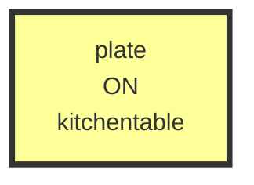

# 🚀 VirtualHome Agent Episode Log


### [GoalReasoner (Module A - Intent)] Output
```json
{
  "objects": [
    "plate",
    "kitchentable"
  ],
  "quantities": {
    "plate": 1
  },
  "states": [
    "used"
  ],
  "conditions": [
    "we just used"
  ],
  "destinations": [
    "kitchentable"
  ],
  "clarification_question": null
}
```

### [PerceptionFilter] Output
```json
{
  "reasoning": "The goal and SDG require only the used plate to be on the kitchentable. So the minimal necessary classes are the target object plate and the destination kitchentable. No tools or alternate receptacles are implied.",
  "selected_classes": [
    "plate",
    "character",
    "kitchentable"
  ],
  "raw_class_count": 50
}
```

### [LLMExecutor] Output
```json
{
  "reasoning": "The SDG goal is already satisfied in the current graph: plate(75) is ON kitchentable(135), and both are in the kitchen with the character close to the table. No further physical action is needed for this active task.",
  "satisfied_nodes": [
    "N1"
  ],
  "current_node_focus": "N1",
  "mapped_variables": {
    "?Container": "kitchentable(135)"
  },
  "action": "[wait]"
}
```

### [RoboStateMultiTaskController] Output
```json
{
  "action": "[wait]",
  "active_task_id": "task_1",
  "task_context": {
    "active_task_id": "task_1",
    "pending_task_ids": [],
    "satisfied_task_ids": []
  },
  "source": "llm_executor"
}
```
## Step 0
- **Action**: `[wait]`
- **Action Success**: `True`
- **Action Message**: Time passes. You waited for a while.
- **Active Task**: `task_1`
- **Decision Source**: `llm_executor`
- **Task Progress**: T3_without_intention_M4_18=pending
- **SDG Status**:

- **Observed Items (17)**: plate(75), plate(76), plate(83), plate(84), plate(91), plate(103), plate(104), kitchentable(131), kitchentable(135), character(1), plate(67), plate(68), kitchen(11), livingroom(183), bedroom(241)...


### [PerceptionFilter] Output
```json
{
  "reasoning": "Reused cached class selection.",
  "selected_classes": [
    "plate",
    "character",
    "kitchentable"
  ],
  "raw_class_count": 50
}
```

### [LLMExecutor] Output
```json
{
  "reasoning": "The goal is to ensure one plate is ON a kitchentable. The current graph already shows multiple plates on kitchentables, so the SDG node N1 is satisfied. No further physical action is needed for the active task.",
  "satisfied_nodes": [
    "N1"
  ],
  "current_node_focus": "N1",
  "mapped_variables": {},
  "action": "[wait]"
}
```

### [RoboStateMultiTaskController] Output
```json
{
  "action": "[wait]",
  "active_task_id": "task_1",
  "task_context": {
    "active_task_id": "task_1",
    "pending_task_ids": [],
    "satisfied_task_ids": []
  },
  "source": "llm_executor"
}
```
## Step 1
- **Action**: `[wait]`
- **Action Success**: `True`
- **Action Message**: Time passes. You waited for a while.
- **Active Task**: `task_1`
- **Decision Source**: `llm_executor`
- **Task Progress**: T3_without_intention_M4_18=pending
- **SDG Status**:

- **Observed Items (17)**: plate(75), plate(76), plate(83), plate(84), plate(91), plate(103), plate(104), kitchentable(131), kitchentable(135), character(1), plate(67), plate(68), kitchen(11), livingroom(183), bedroom(241)...


### [PerceptionFilter] Output
```json
{
  "reasoning": "Reused cached class selection.",
  "selected_classes": [
    "plate",
    "character",
    "kitchentable"
  ],
  "raw_class_count": 50
}
```

### [LLMExecutor] Output
```json
{
  "reasoning": "The goal is to have one used plate ON a kitchentable. In the current graph, plate(75) is already on kitchentable(135) and is close to the character, so the SDG node N1 is already satisfied. No physical action is needed; the safest next step is to wait/hold position only if required, but since the task is complete, there is no further manipulation to do.",
  "satisfied_nodes": [
    "N1"
  ],
  "current_node_focus": "N1",
  "mapped_variables": {},
  "action": "[wait]"
}
```

### [RoboStateMultiTaskController] Output
```json
{
  "action": "[wait]",
  "active_task_id": "task_1",
  "task_context": {
    "active_task_id": "task_1",
    "pending_task_ids": [],
    "satisfied_task_ids": []
  },
  "source": "llm_executor"
}
```
## Step 2
- **Action**: `[wait]`
- **Action Success**: `True`
- **Action Message**: Time passes. You waited for a while.
- **Active Task**: `task_1`
- **Decision Source**: `llm_executor`
- **Task Progress**: T3_without_intention_M4_18=pending
- **SDG Status**:

- **Observed Items (17)**: plate(75), plate(76), plate(83), plate(84), plate(91), plate(103), plate(104), kitchentable(131), kitchentable(135), character(1), plate(67), plate(68), kitchen(11), livingroom(183), bedroom(241)...


### [PerceptionFilter] Output
```json
{
  "reasoning": "Reused cached class selection.",
  "selected_classes": [
    "plate",
    "character",
    "kitchentable"
  ],
  "raw_class_count": 50
}
```

### [LLMExecutor] Output
```json
{
  "reasoning": "The SDG goal is already satisfied in the current filtered graph: plate(75) is ON kitchentable(135), and it is also CLOSE to the character. No additional action is needed for the active task. Since the instruction asks for the single next action and the task state already matches the goal, the safest choice is to wait.",
  "satisfied_nodes": [
    "N1"
  ],
  "current_node_focus": "N1",
  "mapped_variables": {
    "?Plate": "plate(75)",
    "?Table": "kitchentable(135)"
  },
  "action": "[wait]"
}
```

### [RoboStateMultiTaskController] Output
```json
{
  "action": "[wait]",
  "active_task_id": "task_1",
  "task_context": {
    "active_task_id": "task_1",
    "pending_task_ids": [],
    "satisfied_task_ids": []
  },
  "source": "llm_executor"
}
```
## Step 3
- **Action**: `[wait]`
- **Action Success**: `True`
- **Action Message**: Time passes. You waited for a while.
- **Active Task**: `task_1`
- **Decision Source**: `llm_executor`
- **Task Progress**: T3_without_intention_M4_18=pending
- **SDG Status**:

- **Observed Items (17)**: plate(75), plate(76), plate(83), plate(84), plate(91), plate(103), plate(104), kitchentable(131), kitchentable(135), character(1), plate(67), plate(68), kitchen(11), livingroom(183), bedroom(241)...


### [PerceptionFilter] Output
```json
{
  "reasoning": "Reused cached class selection.",
  "selected_classes": [
    "plate",
    "character",
    "kitchentable"
  ],
  "raw_class_count": 50
}
```

### [LLMExecutor] Output
```json
{
  "reasoning": "The goal is to have one plate ON the kitchentable. The current graph already shows multiple plates on kitchentable and close to the character, so the relation is satisfied for the active task. No physical action is needed. I will avoid manipulating any extra plates since the task only requires one satisfied instance.",
  "satisfied_nodes": [
    "N1"
  ],
  "current_node_focus": "N1",
  "mapped_variables": {
    "?Container": "kitchentable(131)"
  },
  "action": "[wait]"
}
```

### [RoboStateMultiTaskController] Output
```json
{
  "action": "[wait]",
  "active_task_id": "task_1",
  "task_context": {
    "active_task_id": "task_1",
    "pending_task_ids": [],
    "satisfied_task_ids": []
  },
  "source": "llm_executor"
}
```
