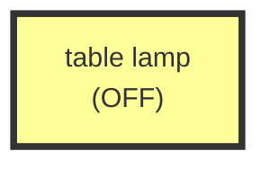

# 🚀 VirtualHome Agent Episode Log


### [GoalReasoner (Module A - Intent)] Output
```json
{
  "is_instruction_obviously_vague": false,
  "clarification_question": null,
  "target_object": "table lamp",
  "location_hint": null,
  "reasoning_chain": [
    {
      "question": "Why does the user want this object?",
      "answer": "The user wants the lamp's current state changed if it is on."
    },
    {
      "question": "Why is that important?",
      "answer": "Because the user likely wants to stop the lamp from providing light or consuming power."
    },
    {
      "question": "What fundamental need does this fulfill?",
      "answer": "The user wants to control illumination in the environment."
    },
    {
      "question": "Are there any deeper psychological or physical motivations?",
      "answer": "The user may want the room to be darker, more comfortable, or more suitable for a specific activity."
    }
  ],
  "deep_intent": "The user wants to reduce illumination in the room.",
  "acceptable_alternatives_properties": [
    {
      "priority": 1,
      "description": "Other indoor light sources that can be turned off, such as a desk lamp or floor lamp"
    },
    {
      "priority": 2,
      "description": "Any nearby room lighting that can be switched off to reduce brightness"
    },
    {
      "priority": 3,
      "description": "Other controllable household lights or illuminated devices that can be powered down"
    },
    {
      "priority": 4,
      "description": "If switching off the lamp is not possible, lowering nearby lighting by dimming available lights"
    }
  ]
}
```

### [PerceptionFilter] Output
```json
{
  "reasoning": "The goal is to turn off the table lamp, so I need the exact target class and any closely related alternative controllable light sources or controls that could reduce illumination. The visible item matching the target is tablelamp. Since the intent is to reduce room illumination, nearby controllable lighting and its switch are also relevant backups: ceilinglamp, lightswitch, and candle as an alternative light source to control/consider.",
  "selected_classes": [
    "character",
    "candle",
    "floor",
    "lightswitch",
    "ceilinglamp",
    "tablelamp",
    "desk"
  ],
  "raw_class_count": 33
}
```

### [LLMExecutor] Output
```json
{
  "reasoning": "The active SDG requires the table lamp to be OFF. In the current graph, both tablelamp(102) and tablelamp(103) are ON, and either would satisfy the user's intent to reduce illumination. Since the task specifically targets a table lamp and we need a single next atomic action, the correct first step is to move near one lamp before switching it off. I choose tablelamp(102) as a valid instance with the required switchable property.",
  "satisfied_nodes": [],
  "current_node_focus": "N1",
  "mapped_variables": {},
  "action": "[walk] <tablelamp> (102)"
}
```

### [RoboStateMultiTaskController] Output
```json
{
  "action": "[walk] <tablelamp> (102)",
  "active_task_id": "task_1",
  "task_context": {
    "active_task_id": "task_1",
    "pending_task_ids": [],
    "satisfied_task_ids": []
  },
  "source": "llm_executor"
}
```
## Step 0
- **Action**: `[walk] <tablelamp> (102)`
- **Action Success**: `True`
- **Action Message**: {'0': {'message': 'Success'}}
- **Active Task**: `task_1`
- **Decision Source**: `llm_executor`
- **Task Progress**: T3_without_memory_G1_04=pending
- **SDG Status**:

- **Observed Items (20)**: floor(74), floor(75), floor(76), floor(77), floor(78), floor(79), floor(80), floor(81), floor(82), ceilinglamp(101), tablelamp(102) [ON], tablelamp(103) [ON], desk(108) [CLOSED], lightswitch(173) [ON], candle(181) [OFF]...


### [PerceptionFilter] Output
```json
{
  "reasoning": "Reused cached class selection.",
  "selected_classes": [
    "character",
    "candle",
    "floor",
    "lightswitch",
    "ceilinglamp",
    "tablelamp",
    "desk"
  ],
  "raw_class_count": 33
}
```

### [LLMExecutor] Output
```json
{
  "reasoning": "The SDG requires the table lamp to be OFF. In the current graph, tablelamp(102) is ON and already CLOSE to the character, so no walking is needed. Since it has HAS_SWITCH, the correct next step is to switch it off directly. This targets the exact task object and moves toward satisfying N1.",
  "satisfied_nodes": [],
  "current_node_focus": "N1",
  "mapped_variables": {
    "?Lamp": "tablelamp(102)"
  },
  "action": "[switchoff] <tablelamp> (102)"
}
```

### [RoboStateMultiTaskController] Output
```json
{
  "action": "[switchoff] <tablelamp> (102)",
  "active_task_id": "task_1",
  "task_context": {
    "active_task_id": "task_1",
    "pending_task_ids": [],
    "satisfied_task_ids": []
  },
  "source": "llm_executor"
}
```
## Step 1
- **Action**: `[switchoff] <tablelamp> (102)`
- **Action Success**: `True`
- **Action Message**: Faked switch operation in Python layer (bypassed Unity failure)
- **Active Task**: `task_1`
- **Decision Source**: `llm_executor`
- **Task Progress**: T3_without_memory_G1_04=done
- **SDG Status**:

- **Observed Items (20)**: floor(74), floor(75), floor(76), floor(77), floor(78), floor(79), floor(80), floor(81), floor(82), ceilinglamp(101), tablelamp(102) [ON], tablelamp(103) [ON], desk(108) [CLOSED], lightswitch(173) [ON], candle(181) [OFF]...

