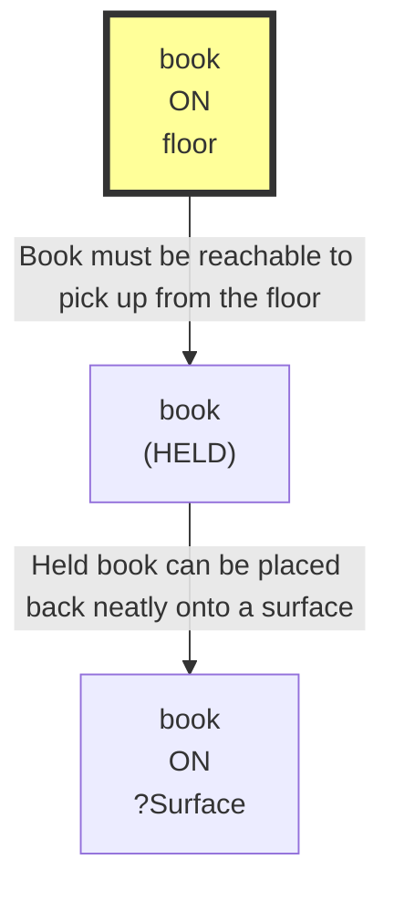
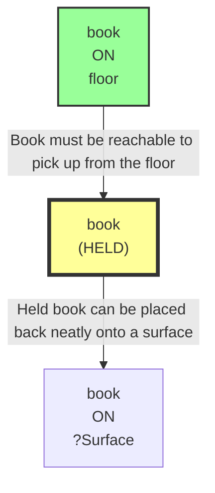
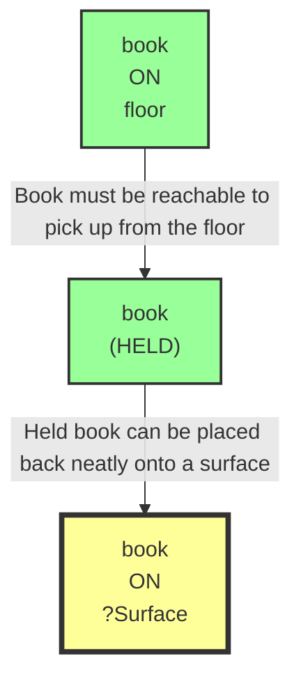
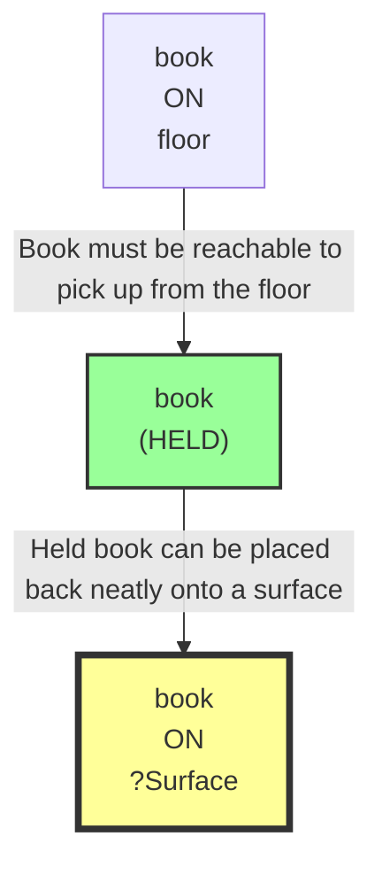
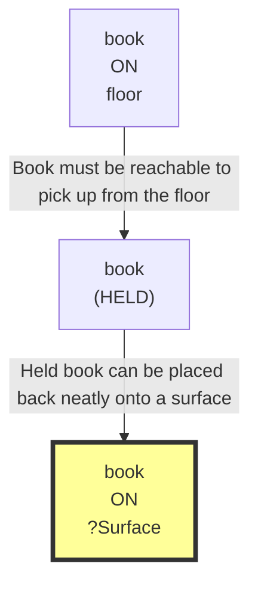
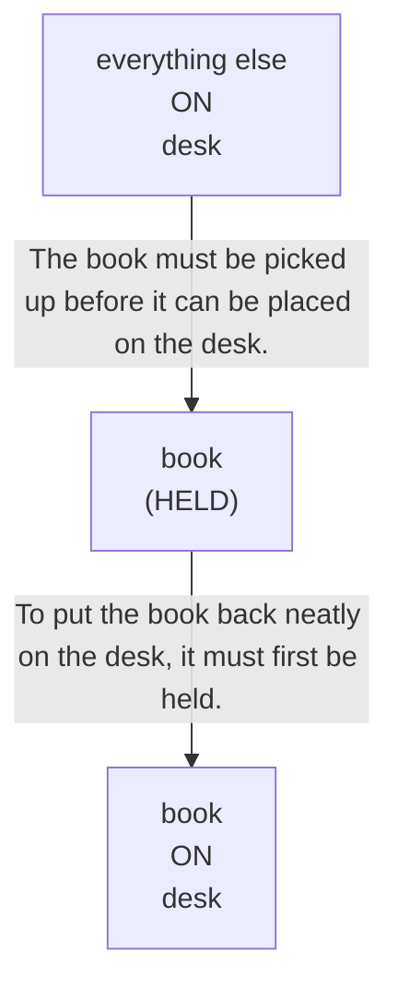

# 🚀 VirtualHome Agent Episode Log


### [GoalReasoner (Module A - Intent)] Output
```json
{
  "is_instruction_obviously_vague": false,
  "clarification_question": null,
  "target_object": "book",
  "location_hint": "floor",
  "reasoning_chain": [
    {
      "question": "Why does the user want this object?",
      "answer": "To handle it after it falls onto the floor."
    },
    {
      "question": "Why is that important?",
      "answer": "To restore the item to its proper place and keep it organized."
    },
    {
      "question": "What fundamental need does this fulfill?",
      "answer": "It fulfills the need to maintain order and return a displaced object to its intended storage position."
    },
    {
      "question": "Are there any deeper psychological or physical motivations?",
      "answer": "It likely reduces clutter, prevents the item from being left on the floor, and preserves a neat environment."
    }
  ],
  "deep_intent": "The user wants a displaced household item to be retrieved and restored to an orderly stored state.",
  "acceptable_alternatives_properties": [
    {
      "priority": 1,
      "description": "Other portable household items that have fallen to the floor and can be placed back in their proper spot, such as a magazine, notebook, or folder."
    },
    {
      "priority": 2,
      "description": "Similar flat reading or paper items that can be returned neatly to a shelf or table."
    },
    {
      "priority": 3,
      "description": "Other small household objects that are out of place and should be tidied up."
    },
    {
      "priority": 4,
      "description": "Any nearby fallen item that can be safely picked up and put away to restore order."
    }
  ]
}
```

### [PerceptionFilter] Output
```json
{
  "reasoning": "The goal is to pick up a book from the floor and put it back on a proper surface. The only necessary target is the book, plus the floor location and at least one plausible return surface/storage location that the book can be restored to. From the visible objects, bookshelf is the most directly relevant storage surface, and desk/coffeetable are also valid places for neatly placing a book back.",
  "selected_classes": [
    "book",
    "character",
    "floor",
    "paper",
    "coffeetable",
    "bookshelf",
    "folder",
    "desk"
  ],
  "raw_class_count": 41
}
```

### [LLMExecutor] Output
```json
{
  "reasoning": "The SDG requires first satisfying that a book is on the floor. The filtered graph shows multiple books on floor(336); I need to choose one exact instance to begin the pickup sequence. Since no prior actions exist and I am not already holding anything, the best next step is to walk to a specific book on the floor so I can grab it in the following action.",
  "satisfied_nodes": [],
  "current_node_focus": "N1",
  "mapped_variables": {},
  "action": "[walk] <book> (190)"
}
```

### [RoboStateMultiTaskController] Output
```json
{
  "action": "[walk] <book> (190)",
  "active_task_id": "task_1",
  "task_context": {
    "active_task_id": "task_1",
    "pending_task_ids": [],
    "satisfied_task_ids": []
  },
  "source": "llm_executor"
}
```
## Step 0
- **Action**: `[walk] <book> (190)`
- **Action Success**: `True`
- **Action Message**: {'0': {'message': 'Success'}}
- **Active Task**: `task_1`
- **Decision Source**: `llm_executor`
- **Task Progress**: T3_without_memory_G2_09=pending
- **SDG Status**:

- **Observed Items (22)**: floor(336), floor(337), floor(338), floor(339), floor(340), floor(341), floor(342), floor(343), floor(344), bookshelf(370), coffeetable(371), desk(373) [CLOSED], paper(451), folder(453) [CLOSED], book(190) [CLOSED]...


### [PerceptionFilter] Output
```json
{
  "reasoning": "Reused cached class selection.",
  "selected_classes": [
    "book",
    "character",
    "floor",
    "paper",
    "coffeetable",
    "bookshelf",
    "folder",
    "desk"
  ],
  "raw_class_count": 41
}
```

### [LLMExecutor] Output
```json
{
  "reasoning": "The goal is to retrieve a book that is on the floor. Multiple books match the SDG prerequisite N1, and the current graph shows three candidate books (190, 191, 268) all on the floor and close to the character. Since the task is to handle a book fallen on the floor and then restore it, the immediate next step is to move to one specific eligible book before grabbing it. I will focus on book(190) as a valid floor book candidate.",
  "satisfied_nodes": [
    "N1"
  ],
  "current_node_focus": "N2",
  "mapped_variables": {},
  "action": "[walk] <book> (190)"
}
```

### [RoboStateMultiTaskController] Output
```json
{
  "action": "[walk] <book> (190)",
  "active_task_id": "task_1",
  "task_context": {
    "active_task_id": "task_1",
    "pending_task_ids": [],
    "satisfied_task_ids": []
  },
  "source": "llm_executor"
}
```
## Step 1
- **Action**: `[walk] <book> (190)`
- **Action Success**: `True`
- **Action Message**: {'0': {'message': 'Success'}}
- **Active Task**: `task_1`
- **Decision Source**: `llm_executor`
- **Task Progress**: T3_without_memory_G2_09=pending
- **SDG Status**:

- **Observed Items (22)**: floor(336), floor(337), floor(338), floor(339), floor(340), floor(341), floor(342), floor(343), floor(344), bookshelf(370), coffeetable(371), desk(373) [CLOSED], paper(451), folder(453) [CLOSED], book(190) [CLOSED]...


### [PerceptionFilter] Output
```json
{
  "reasoning": "Reused cached class selection.",
  "selected_classes": [
    "book",
    "character",
    "floor",
    "paper",
    "coffeetable",
    "bookshelf",
    "folder",
    "desk"
  ],
  "raw_class_count": 41
}
```

### [LLMExecutor] Output
```json
{
  "reasoning": "The goal is to restore a book that is currently on the floor to a proper stored state. The book is already visible, grabbable, and close to the character, so the next required step is to pick it up before any placement can occur.",
  "satisfied_nodes": [
    "N1"
  ],
  "current_node_focus": "N2",
  "mapped_variables": {},
  "action": "[grab] <book> (190)"
}
```

### [RoboStateMultiTaskController] Output
```json
{
  "action": "[grab] <book> (190)",
  "active_task_id": "task_1",
  "task_context": {
    "active_task_id": "task_1",
    "pending_task_ids": [],
    "satisfied_task_ids": []
  },
  "source": "llm_executor"
}
```
## Step 2
- **Action**: `[grab] <book> (190)`
- **Action Success**: `True`
- **Action Message**: {'0': {'message': 'Success'}}
- **Active Task**: `task_1`
- **Decision Source**: `llm_executor`
- **Task Progress**: T3_without_memory_G2_09=pending
- **SDG Status**:

- **Observed Items (22)**: floor(336), floor(337), floor(338), floor(339), floor(340), floor(341), floor(342), floor(343), floor(344), bookshelf(370), coffeetable(371), desk(373) [CLOSED], paper(451), folder(453) [CLOSED], book(190) [CLOSED]...


### [PerceptionFilter] Output
```json
{
  "reasoning": "Reused cached class selection.",
  "selected_classes": [
    "book",
    "character",
    "floor",
    "paper",
    "coffeetable",
    "bookshelf",
    "folder",
    "desk"
  ],
  "raw_class_count": 41
}
```

### [LLMExecutor] Output
```json
{
  "reasoning": "The SDG requires the book to be on the floor first (N1). There are multiple books on the floor, and the character is already close to book(191) and book(268). Since the task is to retrieve a fallen book, the best next step is to pick up one of the floor books that matches the goal object class. Book(191) is clearly on the floor and close, so I will try to grab it first to satisfy the 'HELD' prerequisite (N2).",
  "satisfied_nodes": [
    "N1"
  ],
  "current_node_focus": "N2",
  "mapped_variables": {},
  "action": "[grab] <book> (191)"
}
```

### [RoboStateMultiTaskController] Output
```json
{
  "action": "[grab] <book> (191)",
  "active_task_id": "task_1",
  "task_context": {
    "active_task_id": "task_1",
    "pending_task_ids": [],
    "satisfied_task_ids": []
  },
  "source": "llm_executor"
}
```
## Step 3
- **Action**: `[grab] <book> (191)`
- **Action Success**: `True`
- **Action Message**: {'0': {'message': 'Success'}}
- **Active Task**: `task_1`
- **Decision Source**: `llm_executor`
- **Task Progress**: T3_without_memory_G2_09=pending
- **SDG Status**:

- **Observed Items (23)**: floor(336), floor(337), floor(338), floor(339), floor(340), floor(341), floor(342), floor(343), floor(344), bookshelf(370), coffeetable(371), desk(373) [CLOSED], paper(451), folder(453) [CLOSED], book(191) [CLOSED]...


### [PerceptionFilter] Output
```json
{
  "reasoning": "Reused cached class selection.",
  "selected_classes": [
    "book",
    "character",
    "floor",
    "paper",
    "coffeetable",
    "bookshelf",
    "folder",
    "desk"
  ],
  "raw_class_count": 41
}
```

### [LLMExecutor] Output
```json
{
  "reasoning": "The active goal is to retrieve the book that is on the floor. In the current graph, book(268) is explicitly ON floor(336) and CLOSE to the character, so the prerequisite relation N1 is satisfied. The next SDG step is to hold the book, which requires grabbing it. Because grab requires being near the object and the graph already indicates closeness, the most direct next atomic action is to grab book(268).",
  "satisfied_nodes": [
    "N1"
  ],
  "current_node_focus": "N2",
  "mapped_variables": {},
  "action": "[grab] <book> (268)"
}
```

### [RoboStateMultiTaskController] Output
```json
{
  "action": "[grab] <book> (268)",
  "active_task_id": "task_1",
  "task_context": {
    "active_task_id": "task_1",
    "pending_task_ids": [],
    "satisfied_task_ids": []
  },
  "source": "llm_executor"
}
```
## Step 4
- **Action**: `[grab] <book> (268)`
- **Action Success**: `False`
- **Action Message**: {'0': {'message': 'ScriptExcutor 0: EXECUTION_GENERAL: Script is impossible to execute\n\n'}}
- **Active Task**: `task_1`
- **Decision Source**: `llm_executor`
- **Task Progress**: T3_without_memory_G2_09=pending
- **SDG Status**:

- **Observed Items (24)**: floor(336), floor(337), floor(338), floor(339), floor(340), floor(341), floor(342), floor(343), floor(344), bookshelf(370), coffeetable(371), desk(373) [CLOSED], paper(451), folder(453) [CLOSED], book(268) [CLOSED]...


### [PerceptionFilter] Output
```json
{
  "reasoning": "Reused cached class selection.",
  "selected_classes": [
    "book",
    "character",
    "floor",
    "paper",
    "coffeetable",
    "bookshelf",
    "folder",
    "desk"
  ],
  "raw_class_count": 41
}
```

### [LLMExecutor] Output
```json
{
  "reasoning": "The target book is book(268), and the graph shows it is already CLOSE to the character and ON the floor, so the next required step toward satisfying N2 is to pick it up. The previous grab failed, but there is no indication the book is gone or that the task is impossible, so the correct recovery is to re-attempt the grab from the currently identified book object.",
  "satisfied_nodes": [
    "N1"
  ],
  "current_node_focus": "N2",
  "mapped_variables": {},
  "action": "[grab] <book> (268)"
}
```

### [RoboStateMultiTaskController] Output
```json
{
  "action": "[grab] <book> (268)",
  "active_task_id": "task_1",
  "task_context": {
    "active_task_id": "task_1",
    "pending_task_ids": [],
    "satisfied_task_ids": []
  },
  "source": "llm_executor"
}
```
## Step 5
- **Action**: `[grab] <book> (268)`
- **Action Success**: `False`
- **Action Message**: {'0': {'message': 'ScriptExcutor 0: EXECUTION_GENERAL: Script is impossible to execute\n\n'}}
- **Active Task**: `task_1`
- **Decision Source**: `llm_executor`
- **Task Progress**: T3_without_memory_G2_09=pending
- **SDG Status**:

- **Observed Items (24)**: floor(336), floor(337), floor(338), floor(339), floor(340), floor(341), floor(342), floor(343), floor(344), bookshelf(370), coffeetable(371), desk(373) [CLOSED], paper(451), folder(453) [CLOSED], book(268) [CLOSED]...


### [RoboStateMultiTaskController] Output
```json
{
  "action": "[walk] <bathroom> (11)",
  "active_task_id": null,
  "task_context": {
    "active_task_id": null,
    "pending_task_ids": [
      "task_1"
    ],
    "satisfied_task_ids": []
  },
  "source": "loop_recovery_room_revisit"
}
```
## Step 6
- **Action**: `[walk] <bathroom> (11)`
- **Action Success**: `True`
- **Action Message**: {'0': {'message': 'Success'}}
- **Decision Source**: `loop_recovery_room_revisit`
- **Task Progress**: T3_without_memory_G2_09=pending
- **SDG Status**:
No SDG active.
- **Observed Items (84)**: floor(336), floor(337), floor(338), floor(339), floor(340), floor(341), floor(342), floor(343), floor(344), wall(345), wall(346), wall(347), wall(348), wall(349), wall(350)...


### [PerceptionFilter] Output
```json
{
  "reasoning": "The goal is to pick up a fallen book from the floor and restore it to a stored place. The only strictly necessary target object is the book. Since the SDG requires the book to be on the floor and then held before being placed on some surface, the floor is also relevant as the location context. No additional tool or receptacle is explicitly required beyond a generic surface, so other objects are unnecessary.",
  "selected_classes": [
    "book",
    "floor",
    "character"
  ],
  "raw_class_count": 34
}
```

### [LLMExecutor] Output
```json
{
  "reasoning": "The previous grabs for book(268) failed, and the current graph no longer shows that ID. The only reachable book instances now are book(190) and book(191), both close to the character and already held, so the task state gap is to restore a held book to a surface. Since both hands are full, the next valid progress action is to place one held book onto a flat surface; this will also free a hand for later placement of the other book if needed. I will use the closest generic floor surface as the placement target because the SDG's final node only requires the book to be ON some surface.",
  "satisfied_nodes": [
    "N1",
    "N2"
  ],
  "current_node_focus": "N3",
  "mapped_variables": {},
  "action": "[walk] <floor> (12)"
}
```

### [RoboStateMultiTaskController] Output
```json
{
  "action": "[walk] <floor> (12)",
  "active_task_id": "task_1",
  "task_context": {
    "active_task_id": "task_1",
    "pending_task_ids": [],
    "satisfied_task_ids": []
  },
  "source": "llm_executor"
}
```
## Step 7
- **Action**: `[walk] <floor> (12)`
- **Action Success**: `True`
- **Action Message**: {'0': {'message': 'Success'}}
- **Active Task**: `task_1`
- **Decision Source**: `llm_executor`
- **Task Progress**: T3_without_memory_G2_09=pending
- **SDG Status**:

- **Observed Items (15)**: floor(12), floor(13), floor(14), floor(15), floor(16), floor(17), character(1), book(191) [CLOSED], book(190) [CLOSED], bathroom(11), bedroom(73), kitchen(205), livingroom(335), book(190) [CLOSED], book(191) [CLOSED]


### [PerceptionFilter] Output
```json
{
  "reasoning": "Reused cached class selection.",
  "selected_classes": [
    "book",
    "floor",
    "character"
  ],
  "raw_class_count": 34
}
```

### [LLMExecutor] Output
```json
{
  "reasoning": "The previously targeted book(268) is no longer present; the current graph shows two nearby books (190 and 191), both already held by the character. Since the task is to restore a book from the floor to a surface, the only progress possible now is to place one held book onto an appropriate flat surface. The SDG requires N2 (book HELD) before N3 (book ON ?Surface), and N2 is already satisfied for both held books. I will focus on satisfying the final placement node by moving a held book onto a flat surface; however, because the exact desired surface is not specified in the SDG, the safest immediate next step is to walk to a valid flat surface first. The current graph only explicitly lists floor surfaces, which are valid flat surfaces, so I will move to one of them to prepare for placing a book down next.",
  "satisfied_nodes": [
    "N2"
  ],
  "current_node_focus": "N3",
  "mapped_variables": {},
  "action": "[walk] <floor> (12)"
}
```

### [RoboStateMultiTaskController] Output
```json
{
  "action": "[walk] <floor> (12)",
  "active_task_id": "task_1",
  "task_context": {
    "active_task_id": "task_1",
    "pending_task_ids": [],
    "satisfied_task_ids": []
  },
  "source": "llm_executor"
}
```
## Step 8
- **Action**: `[walk] <floor> (12)`
- **Action Success**: `True`
- **Action Message**: {'0': {'message': 'Success'}}
- **Active Task**: `task_1`
- **Decision Source**: `llm_executor`
- **Task Progress**: T3_without_memory_G2_09=pending
- **SDG Status**:

- **Observed Items (15)**: floor(12), floor(13), floor(14), floor(15), floor(16), floor(17), character(1), book(191) [CLOSED], book(190) [CLOSED], bathroom(11), bedroom(73), kitchen(205), livingroom(335), book(190) [CLOSED], book(191) [CLOSED]


### [PerceptionFilter] Output
```json
{
  "reasoning": "Reused cached class selection.",
  "selected_classes": [
    "book",
    "floor",
    "character"
  ],
  "raw_class_count": 34
}
```

### [LLMExecutor] Output
```json
{
  "reasoning": "The SDG requires a book on the floor, but the currently visible books are both already held by the character, and there is no book shown on the floor in the current graph. The previous grab attempts on book(268) failed, and that object is not present now. Since the task is about restoring a displaced item and we already hold two books, the best immediate progress is to place one held book onto an appropriate flat surface to satisfy the final placement node, while keeping within the hands rule. I will target a nearby floor surface as the placement surface because it is explicitly available and matches a flat surface requirement.",
  "satisfied_nodes": [
    "N2"
  ],
  "current_node_focus": "N3",
  "mapped_variables": {},
  "action": "[walk] <floor> (12)"
}
```

### [RoboStateMultiTaskController] Output
```json
{
  "action": "[walk] <bedroom> (73)",
  "active_task_id": null,
  "task_context": {
    "active_task_id": null,
    "pending_task_ids": [
      "task_1"
    ],
    "satisfied_task_ids": []
  },
  "source": "loop_recovery_room_revisit"
}
```
## Step 9
- **Action**: `[walk] <bedroom> (73)`
- **Action Success**: `True`
- **Action Message**: {'0': {'message': 'Success'}}
- **Decision Source**: `loop_recovery_room_revisit`
- **Task Progress**: T3_without_memory_G2_09=pending
- **SDG Status**:
No SDG active.
- **Observed Items (70)**: floor(12), floor(13), floor(14), floor(15), floor(16), floor(17), wall(18), wall(19), wall(20), wall(21), wall(22), wall(23), ceiling(24), ceiling(25), ceiling(26)...


### [PerceptionFilter] Output
```json
{
  "reasoning": "The goal is to pick up a book from the floor and restore it to a stored surface. The only strictly necessary classes are the target object and the floor it is on. A resting surface is implied by the SDG, so I keep the visible furniture that can serve as the destination for putting the book back, with a minimal set of plausible surfaces.",
  "selected_classes": [
    "book",
    "bed",
    "character",
    "nightstand",
    "floor",
    "coffeetable",
    "bookshelf",
    "tablelamp",
    "desk"
  ],
  "raw_class_count": 34
}
```

### [LLMExecutor] Output
```json
{
  "reasoning": "The SDG requires a book on the floor, then held, then placed on a surface. The current graph does not show any book on the floor; the available books are book(190) and book(191), both already held by the character. The earlier attempts to grab book(268) failed because that object is not present in the current filtered graph. Since the task is to restore a book to an orderly stored state and the user allowed reasonable alternatives, the next progress-making step is to place one held book onto a suitable surface. A nearby flat surface is the coffeetable(111), which is close to the character and valid for putback.",
  "satisfied_nodes": [],
  "current_node_focus": "N3",
  "mapped_variables": {
    "?Surface": "coffeetable(111)"
  },
  "action": "[walk] <coffeetable> (111)"
}
```

### [RoboStateMultiTaskController] Output
```json
{
  "action": "[walk] <coffeetable> (111)",
  "active_task_id": "task_1",
  "task_context": {
    "active_task_id": "task_1",
    "pending_task_ids": [],
    "satisfied_task_ids": []
  },
  "source": "llm_executor"
}
```
## Step 10
- **Action**: `[walk] <coffeetable> (111)`
- **Action Success**: `True`
- **Action Message**: {'0': {'message': 'Success'}}
- **Active Task**: `task_1`
- **Decision Source**: `llm_executor`
- **Task Progress**: T3_without_memory_G2_09=pending
- **SDG Status**:

- **Observed Items (26)**: floor(74), floor(75), floor(76), floor(77), floor(78), floor(79), floor(80), floor(81), floor(82), tablelamp(102) [ON], tablelamp(103) [ON], nightstand(104) [CLOSED], bookshelf(105), nightstand(106) [CLOSED], desk(108) [CLOSED]...


### [PerceptionFilter] Output
```json
{
  "reasoning": "Reused cached class selection.",
  "selected_classes": [
    "book",
    "bed",
    "character",
    "nightstand",
    "floor",
    "coffeetable",
    "bookshelf",
    "tablelamp",
    "desk"
  ],
  "raw_class_count": 34
}
```

### [LLMExecutor] Output
```json
{
  "reasoning": "The original book target (book(268)) is not present in the current graph and the only available books are already held by the character, not on the floor. Because the task specifically requires retrieving a book from the floor, the current state does not expose the required target object to interact with. The previous grab attempts on book(268) failed as impossible, so the next best compliant step is to ask for clarification on which visible fallen item should be restored, since the exact target cannot be uniquely bound from the current graph.",
  "satisfied_nodes": [],
  "current_node_focus": "N1",
  "mapped_variables": {},
  "action": "[ask] The book on the floor is not visible in the current graph. Please specify which visible fallen item should be picked up and put away, or provide the correct book ID/location."
}
```

### [RoboStateMultiTaskController] Output
```json
{
  "action": "[ask] The book on the floor is not visible in the current graph. Please specify which visible fallen item should be picked up and put away, or provide the correct book ID/location.",
  "active_task_id": "task_1",
  "task_context": {
    "active_task_id": "task_1",
    "pending_task_ids": [],
    "satisfied_task_ids": []
  },
  "source": "llm_executor"
}
```
## Step 11
- **Action**: `[ask] The book on the floor is not visible in the current graph. Please specify which visible fallen item should be picked up and put away, or provide the correct book ID/location.`
- **Action Success**: `True`
- **Action Message**: Pick up everything and place it on the desk.
- **Active Task**: `task_1`
- **Decision Source**: `llm_executor`
- **Task Progress**: T3_without_memory_G2_09=pending
- **SDG Status**:

- **Observed Items (26)**: floor(74), floor(75), floor(76), floor(77), floor(78), floor(79), floor(80), floor(81), floor(82), tablelamp(102) [ON], tablelamp(103) [ON], nightstand(104) [CLOSED], bookshelf(105), nightstand(106) [CLOSED], desk(108) [CLOSED]...


### [GoalReasoner (Module A - Intent)] Output
```json
{
  "is_instruction_obviously_vague": false,
  "clarification_question": null,
  "target_object": "book",
  "location_hint": "desk",
  "reasoning_chain": [
    {
      "question": "Why does the user want this object?",
      "answer": "To restore the book to a proper place after it has fallen on the floor."
    },
    {
      "question": "Why is that important?",
      "answer": "To keep the desk area orderly and ensure the book is not left on the floor."
    },
    {
      "question": "What fundamental need does this fulfill?",
      "answer": "Maintaining organization and tidiness in the workspace."
    },
    {
      "question": "Are there any deeper psychological or physical motivations?",
      "answer": "It may reduce clutter, prevent the book from being damaged, and make the environment feel orderly and usable."
    }
  ],
  "deep_intent": "The user wants to restore order and tidiness in the workspace by returning displaced items to their proper place.",
  "acceptable_alternatives_properties": [
    {
      "priority": 1,
      "description": "Other misplaced tabletop items that can be returned to the desk in a neat arrangement, such as notebooks, papers, or stationery."
    },
    {
      "priority": 2,
      "description": "Similar desk items that can be organized together, such as folders, magazines, or small office supplies."
    },
    {
      "priority": 3,
      "description": "General clutter items from the immediate area that can be sorted and placed neatly on the desk."
    },
    {
      "priority": 4,
      "description": "Other household objects that can be tidied and returned to an orderly location, even if they are not desk-specific."
    }
  ]
}
```

### [RoboStateMultiTaskController] Output
```json
{
  "action": "[walk] <kitchen> (205)",
  "active_task_id": "task_1",
  "task_context": {
    "active_task_id": "task_1",
    "pending_task_ids": [],
    "satisfied_task_ids": []
  },
  "source": "room_frontier"
}
```
## Step 12
- **Action**: `[walk] <kitchen> (205)`
- **Action Success**: `True`
- **Action Message**: {'0': {'message': 'Success'}}
- **Active Task**: `task_1`
- **Decision Source**: `room_frontier`
- **Task Progress**: T3_without_memory_G2_09=pending
- **SDG Status**:

- **Observed Items (78)**: floor(74), floor(75), floor(76), floor(77), floor(78), floor(79), floor(80), floor(81), floor(82), wall(83), wall(84), wall(85), wall(86), wall(87), wall(88)...


### [RoboStateMultiTaskController] Output
```json
{
  "action": "[walk] <livingroom> (335)",
  "active_task_id": null,
  "task_context": {
    "active_task_id": null,
    "pending_task_ids": [
      "task_1"
    ],
    "satisfied_task_ids": []
  },
  "source": "loop_recovery_room_revisit"
}
```
## Step 13
- **Action**: `[walk] <livingroom> (335)`
- **Action Success**: `True`
- **Action Message**: {'0': {'message': 'Success'}}
- **Decision Source**: `loop_recovery_room_revisit`
- **Task Progress**: T3_without_memory_G2_09=pending
- **SDG Status**:
No SDG active.
- **Observed Items (115)**: floor(206), floor(207), floor(208), floor(209), floor(210), floor(211), wall(212), wall(213), wall(214), wall(215), wall(216), wall(217), ceiling(218), ceiling(219), ceiling(220)...


### [RoboStateMultiTaskController] Output
```json
{
  "action": "[walk] <bathroom> (11)",
  "active_task_id": null,
  "task_context": {
    "active_task_id": null,
    "pending_task_ids": [
      "task_1"
    ],
    "satisfied_task_ids": []
  },
  "source": "loop_recovery_room_revisit"
}
```
## Step 14
- **Action**: `[walk] <bathroom> (11)`
- **Action Success**: `True`
- **Action Message**: {'0': {'message': 'Success'}}
- **Decision Source**: `loop_recovery_room_revisit`
- **Task Progress**: T3_without_memory_G2_09=pending
- **SDG Status**:
No SDG active.
- **Observed Items (84)**: floor(336), floor(337), floor(338), floor(339), floor(340), floor(341), floor(342), floor(343), floor(344), wall(345), wall(346), wall(347), wall(348), wall(349), wall(350)...

