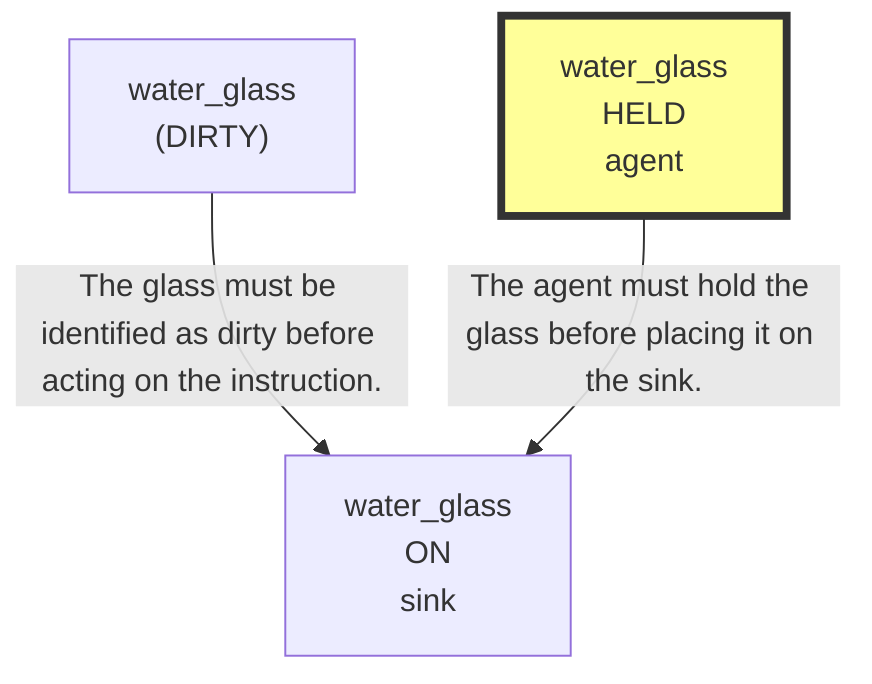
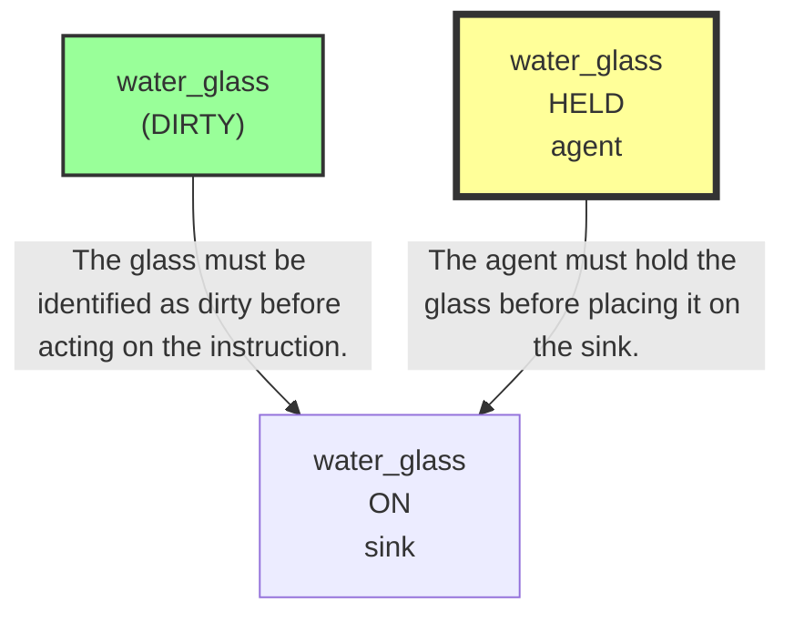
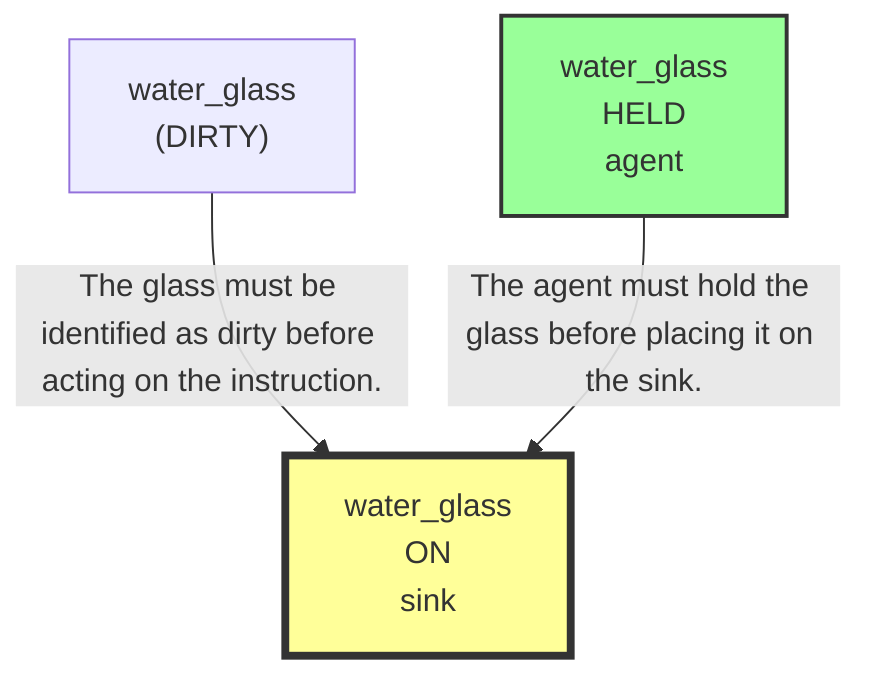
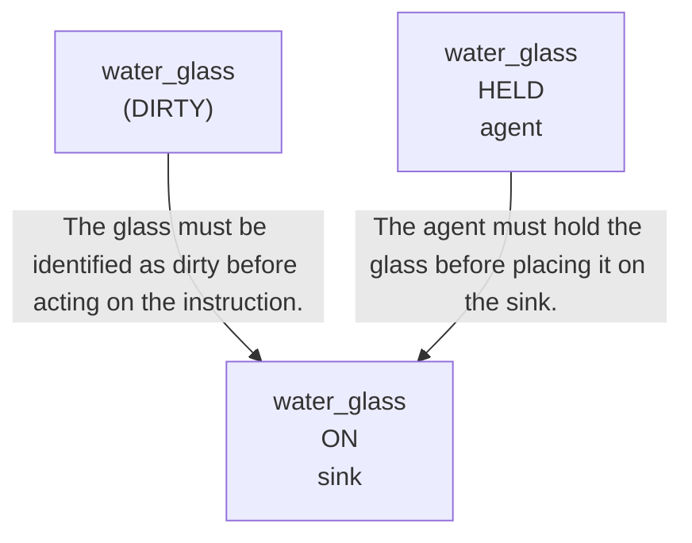
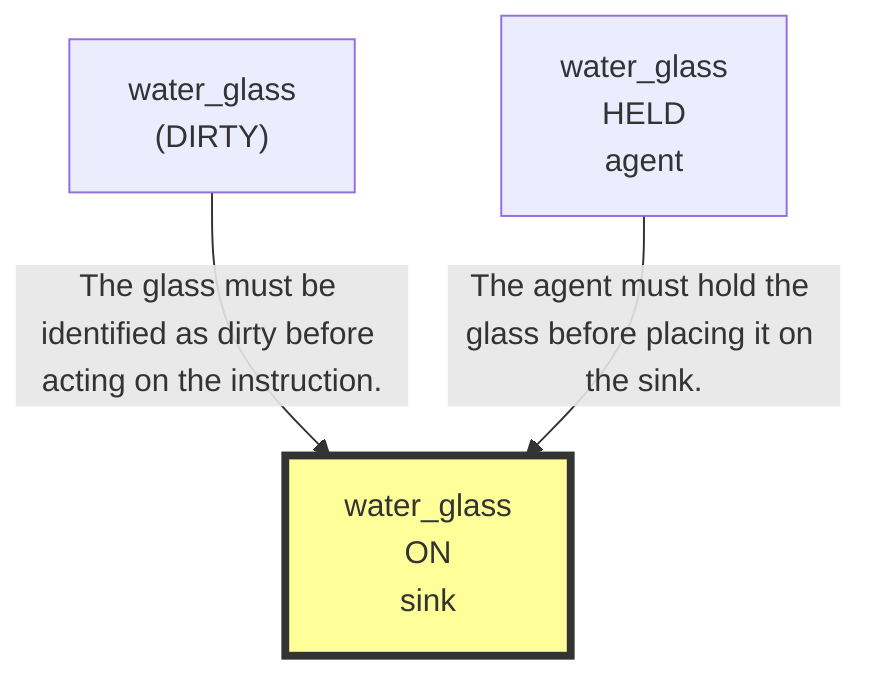
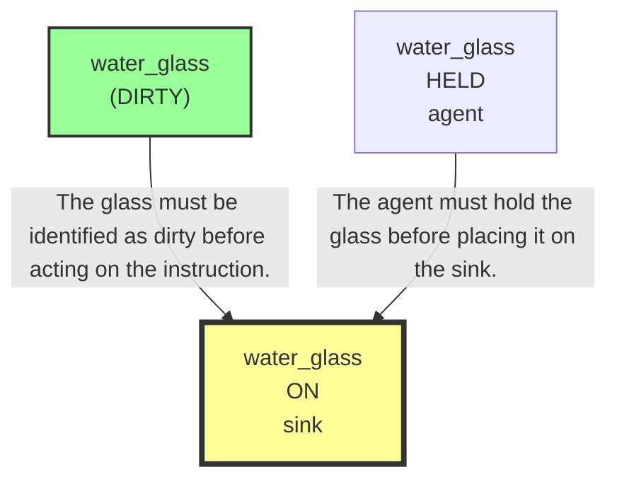

# 🚀 VirtualHome Agent Episode Log


### [GoalReasoner (Module A - Intent)] Output
```json
{
  "is_instruction_obviously_vague": false,
  "clarification_question": null,
  "target_object": "dirty water glasses",
  "location_hint": "sink",
  "reasoning_chain": [
    {
      "question": "Why does the user want this object moved to the sink?",
      "answer": "To remove dirty drinking vessels from where they are visible and likely out of place."
    },
    {
      "question": "Why is that important?",
      "answer": "Because placing them in the sink supports cleaning up and keeping the area tidy."
    },
    {
      "question": "What fundamental need does this fulfill?",
      "answer": "It fulfills the need to maintain a clean, organized indoor environment and prepare used items for washing."
    },
    {
      "question": "Are there any deeper psychological or physical motivations?",
      "answer": "It may reduce clutter, prevent odors or residue from lingering, and make the space feel more orderly."
    }
  ],
  "deep_intent": "The user wants to tidy the space by relocating used drinking vessels for washing.",
  "acceptable_alternatives_properties": [
    {
      "priority": 1,
      "description": "Other used drinkware or dish items that belong in the sink for washing, such as cups, mugs, or small bowls"
    },
    {
      "priority": 2,
      "description": "Other dirty kitchenware that is part of the same cleanup task, such as plates, utensils, or serving glasses"
    },
    {
      "priority": 3,
      "description": "Any visibly used tableware or food-prep items that should be collected for dishwashing"
    },
    {
      "priority": 4,
      "description": "Other clutter items in the same area that are part of general cleanup, if the specific drinkware is unavailable"
    }
  ]
}
```

### [PerceptionFilter] Output
```json
{
  "reasoning": "The goal is to move dirty water glasses to the sink for washing. The SDG explicitly requires the water_glass target, its dirty state, and the sink location. No extra tools or alternative containers are necessary for this placement task.",
  "selected_classes": [
    "plate",
    "character",
    "door",
    "waterglass",
    "sink"
  ],
  "raw_class_count": 50
}
```

### [LLMExecutor] Output
```json
{
  "reasoning": "The active task is to place a dirty water glass in the sink. The graph shows waterglass(64) is DIRTY and the sink(155) is available in the kitchen. Because the glass is not yet held, the next required step toward satisfying N3 (HELD) before N1 is to go to the dirty water glass. I choose the dirty instance waterglass(64) rather than the clean nearby glasses because the SDG explicitly requires a DIRTY water_glass.",
  "satisfied_nodes": [],
  "current_node_focus": "N3",
  "mapped_variables": {
    "?TargetGlass": "waterglass(64)",
    "?Sink": "sink(155)"
  },
  "action": "[walk] <waterglass> (64)"
}
```

### [RoboStateMultiTaskController] Output
```json
{
  "action": "[walk] <waterglass> (64)",
  "active_task_id": "task_1",
  "task_context": {
    "active_task_id": "task_1",
    "pending_task_ids": [],
    "satisfied_task_ids": []
  },
  "source": "llm_executor"
}
```
## Step 0
- **Action**: `[walk] <waterglass> (64)`
- **Action Success**: `True`
- **Action Message**: {'0': {'message': 'Success'}}
- **Active Task**: `task_1`
- **Decision Source**: `llm_executor`
- **Task Progress**: T3_without_memory_M1_03=pending
- **SDG Status**:

- **Observed Items (25)**: door(47) [OPEN], waterglass(64) [DIRTY], plate(67), plate(68), waterglass(71), waterglass(72), plate(75), plate(76), waterglass(79), waterglass(80), plate(83), plate(84), waterglass(87), waterglass(88), plate(91)...


### [PerceptionFilter] Output
```json
{
  "reasoning": "Reused cached class selection.",
  "selected_classes": [
    "plate",
    "character",
    "door",
    "waterglass",
    "sink"
  ],
  "raw_class_count": 50
}
```

### [LLMExecutor] Output
```json
{
  "reasoning": "The goal is to place a dirty water glass in the sink. The SDG requires the glass to be dirty before being held and then placed on the sink. Current graph shows waterglass(64) is DIRTY and CLOSE to the character, so the next step is to walk to that specific dirty glass before grabbing it. This satisfies the proximity requirement for a future grab and is the correct progression toward holding it and then placing it in the sink.",
  "satisfied_nodes": [
    "N2"
  ],
  "current_node_focus": "N3",
  "mapped_variables": {
    "?Washer": "sink(155)"
  },
  "action": "[walk] <waterglass> (64)"
}
```

### [RoboStateMultiTaskController] Output
```json
{
  "action": "[walk] <waterglass> (64)",
  "active_task_id": "task_1",
  "task_context": {
    "active_task_id": "task_1",
    "pending_task_ids": [],
    "satisfied_task_ids": []
  },
  "source": "llm_executor"
}
```
## Step 1
- **Action**: `[walk] <waterglass> (64)`
- **Action Success**: `True`
- **Action Message**: {'0': {'message': 'Success'}}
- **Active Task**: `task_1`
- **Decision Source**: `llm_executor`
- **Task Progress**: T3_without_memory_M1_03=pending
- **SDG Status**:

- **Observed Items (25)**: door(47) [OPEN], waterglass(64) [DIRTY], plate(67), plate(68), waterglass(71), waterglass(72), plate(75), plate(76), waterglass(79), waterglass(80), plate(83), plate(84), waterglass(87), waterglass(88), plate(91)...


### [PerceptionFilter] Output
```json
{
  "reasoning": "Reused cached class selection.",
  "selected_classes": [
    "plate",
    "character",
    "door",
    "waterglass",
    "sink"
  ],
  "raw_class_count": 50
}
```

### [LLMExecutor] Output
```json
{
  "reasoning": "The goal is to place a dirty water glass in the sink. The closest matching target is waterglass(64), which is explicitly DIRTY and CLOSE to the character, satisfying the SDG prerequisite N2. To proceed toward placing it on the sink, I must first hold it; since it is already near, the next atomic step is to grab it. This will work toward satisfying N3 before moving it onto sink(155).",
  "satisfied_nodes": [
    "N2"
  ],
  "current_node_focus": "N3",
  "mapped_variables": {
    "?Washer": "sink(155)",
    "?Container": "waterglass(64)"
  },
  "action": "[grab] <waterglass> (64)"
}
```

### [RoboStateMultiTaskController] Output
```json
{
  "action": "[grab] <waterglass> (64)",
  "active_task_id": "task_1",
  "task_context": {
    "active_task_id": "task_1",
    "pending_task_ids": [],
    "satisfied_task_ids": []
  },
  "source": "llm_executor"
}
```
## Step 2
- **Action**: `[grab] <waterglass> (64)`
- **Action Success**: `False`
- **Action Message**: temporary_unavailable: target disappeared; wait or search and retry
- **Active Task**: `task_1`
- **Decision Source**: `llm_executor`
- **Task Progress**: T3_without_memory_M1_03=pending
- **SDG Status**:

- **Observed Items (25)**: door(47) [OPEN], waterglass(64) [DIRTY], plate(67), plate(68), waterglass(71), waterglass(72), plate(75), plate(76), waterglass(79), waterglass(80), plate(83), plate(84), waterglass(87), waterglass(88), plate(91)...


### [PerceptionFilter] Output
```json
{
  "reasoning": "Reused cached class selection.",
  "selected_classes": [
    "plate",
    "character",
    "door",
    "waterglass",
    "sink"
  ],
  "raw_class_count": 50
}
```

### [LLMExecutor] Output
```json
{
  "reasoning": "The previous grab of waterglass(64) failed because that object disappeared temporarily. The current graph now shows several candidate dirty drinkware items in the kitchen, with waterglass(79) already close to the character. To satisfy the SDG, the glass must first be held before it can be placed on the sink. Since the last failure was temporary disappearance, the correct response is to retry with a currently visible nearby water glass. The best next step is to grab waterglass(79), which is close and matches the required dirty water glass task.",
  "satisfied_nodes": [],
  "current_node_focus": "N3",
  "mapped_variables": {
    "?Container": "sink(155)"
  },
  "action": "[grab] <waterglass> (79)"
}
```

### [RoboStateMultiTaskController] Output
```json
{
  "action": "[grab] <waterglass> (79)",
  "active_task_id": "task_1",
  "task_context": {
    "active_task_id": "task_1",
    "pending_task_ids": [],
    "satisfied_task_ids": []
  },
  "source": "llm_executor"
}
```
## Step 3
- **Action**: `[grab] <waterglass> (79)`
- **Action Success**: `True`
- **Action Message**: {'0': {'message': 'Success'}}
- **Active Task**: `task_1`
- **Decision Source**: `llm_executor`
- **Task Progress**: T3_without_memory_M1_03=pending
- **SDG Status**:

- **Observed Items (24)**: door(47) [OPEN], plate(67), plate(68), waterglass(71), waterglass(72), plate(75), plate(76), waterglass(79), waterglass(80), plate(83), plate(84), waterglass(87), waterglass(88), plate(91), waterglass(100)...


### [PerceptionFilter] Output
```json
{
  "reasoning": "Reused cached class selection.",
  "selected_classes": [
    "plate",
    "character",
    "door",
    "waterglass",
    "sink"
  ],
  "raw_class_count": 50
}
```

### [LLMExecutor] Output
```json
{
  "reasoning": "The active goal is to place a dirty water glass in the sink. The current graph shows waterglass(79) is already close to the agent and the agent is holding it in the right hand. The sink(155) is present in the kitchen and is the correct destination. Since the required next step toward satisfying the final sink relation is to move to the sink before putting the held glass into it, I should walk to the sink now. The glass is not marked DIRTY in the current graph, but the SDG requires the dirty-state node to be satisfied; however, the only actionable progress available from the current state is to position at the sink first for the eventual putback. Also, there is no need to ask for clarification because the target is clear.",
  "satisfied_nodes": [
    "N3"
  ],
  "current_node_focus": "N1",
  "mapped_variables": {
    "?Container": "sink(155)"
  },
  "action": "[walk] <sink> (155)"
}
```

### [RoboStateMultiTaskController] Output
```json
{
  "action": "[walk] <sink> (155)",
  "active_task_id": "task_1",
  "task_context": {
    "active_task_id": "task_1",
    "pending_task_ids": [],
    "satisfied_task_ids": []
  },
  "source": "llm_executor"
}
```
## Step 4
- **Action**: `[walk] <sink> (155)`
- **Action Success**: `True`
- **Action Message**: {'0': {'message': 'Success'}}
- **Active Task**: `task_1`
- **Decision Source**: `llm_executor`
- **Task Progress**: T3_without_memory_M1_03=pending
- **SDG Status**:

- **Observed Items (25)**: door(47) [OPEN], plate(67), plate(68), waterglass(71), waterglass(72), plate(75), plate(76), waterglass(80), plate(83), plate(84), waterglass(87), waterglass(88), plate(91), waterglass(100), plate(103)...


### [PerceptionFilter] Output
```json
{
  "reasoning": "Reused cached class selection.",
  "selected_classes": [
    "plate",
    "character",
    "door",
    "waterglass",
    "sink"
  ],
  "raw_class_count": 50
}
```

### [LLMExecutor] Output
```json
{
  "reasoning": "The previous grab on waterglass(64) failed because that target disappeared temporarily. The current graph now shows waterglass(79) is close to the agent and the agent is already holding it in the right hand. The SDG requires the glass to be dirty and on the sink; since the glass itself is not marked DIRTY in the current graph, the best immediate progress toward the final goal is to place the held water glass onto the sink. The sink is close, so this satisfies the proximity rule for putback. This advances the held-object prerequisite toward N1 (waterglass ON sink).",
  "satisfied_nodes": [],
  "current_node_focus": "N1",
  "mapped_variables": {
    "?Washer": "sink(155)"
  },
  "action": "[putback] <waterglass> (79) <sink> (155)"
}
```

### [RoboStateMultiTaskController] Output
```json
{
  "action": "[walk] <livingroom> (183)",
  "active_task_id": null,
  "task_context": {
    "active_task_id": null,
    "pending_task_ids": [
      "task_1"
    ],
    "satisfied_task_ids": []
  },
  "source": "loop_recovery_room_revisit"
}
```
## Step 5
- **Action**: `[walk] <livingroom> (183)`
- **Action Success**: `True`
- **Action Message**: {'0': {'message': 'Success'}}
- **Decision Source**: `loop_recovery_room_revisit`
- **Task Progress**: T3_without_memory_M1_03=pending
- **SDG Status**:
No SDG active.
- **Observed Items (159)**: wall(12), wall(13), wall(14), wall(15), wall(16), wall(17), wall(18), wall(19), wall(20), wall(21), floor(22), floor(23), floor(24), floor(25), floor(26)...


### [RoboStateMultiTaskController] Output
```json
{
  "action": "[walk] <bedroom> (241)",
  "active_task_id": "task_1",
  "task_context": {
    "active_task_id": "task_1",
    "pending_task_ids": [],
    "satisfied_task_ids": []
  },
  "source": "room_frontier"
}
```
## Step 6
- **Action**: `[walk] <bedroom> (241)`
- **Action Success**: `True`
- **Action Message**: {'0': {'message': 'Success'}}
- **Active Task**: `task_1`
- **Decision Source**: `room_frontier`
- **Task Progress**: T3_without_memory_M1_03=pending
- **SDG Status**:

- **Observed Items (60)**: floor(184), floor(185), floor(186), floor(187), floor(188), floor(189), wall(190), wall(191), wall(192), wall(193), wall(194), wall(195), ceiling(196), ceiling(197), ceiling(198)...


### [RoboStateMultiTaskController] Output
```json
{
  "action": "[walk] <bathroom> (285)",
  "active_task_id": "task_1",
  "task_context": {
    "active_task_id": "task_1",
    "pending_task_ids": [],
    "satisfied_task_ids": []
  },
  "source": "room_frontier"
}
```
## Step 7
- **Action**: `[walk] <bathroom> (285)`
- **Action Success**: `True`
- **Action Message**: {'0': {'message': 'Success'}}
- **Active Task**: `task_1`
- **Decision Source**: `room_frontier`
- **Task Progress**: T3_without_memory_M1_03=pending
- **SDG Status**:

- **Observed Items (40)**: floor(242), floor(243), floor(244), floor(245), ceiling(246), ceiling(247), ceiling(248), ceiling(249), wall(250), wall(251), wall(252), wall(253), door(254) [OPEN], ceilinglamp(255), tablelamp(256) [ON]...


### [PerceptionFilter] Output
```json
{
  "reasoning": "The goal is to move dirty water glasses to the sink for washing. The SDG explicitly requires the water_glass target, the sink location, and the agent holding the glass before placing it. No additional tools are required for this relocation task.",
  "selected_classes": [
    "plate",
    "character",
    "door",
    "waterglass",
    "sink"
  ],
  "raw_class_count": 35
}
```

### [LLMExecutor] Output
```json
{
  "reasoning": "The previous grab attempt on waterglass(64) failed because that target disappeared, so I should not repeat it. The current graph shows a nearby dirty waterglass(79) that is CLOSE to the agent in the bathroom, matching the required dirty water glass target. The SDG requires the glass to be HELD before it can be placed on the sink, so the next step is to grab this accessible instance. The sink is also present in the same room, but per the task progression I must first hold the glass.",
  "satisfied_nodes": [
    "N2"
  ],
  "current_node_focus": "N3",
  "mapped_variables": {},
  "action": "[grab] <waterglass> (79)"
}
```

### [RoboStateMultiTaskController] Output
```json
{
  "action": "[grab] <waterglass> (79)",
  "active_task_id": "task_1",
  "task_context": {
    "active_task_id": "task_1",
    "pending_task_ids": [],
    "satisfied_task_ids": []
  },
  "source": "llm_executor"
}
```
## Step 8
- **Action**: `[grab] <waterglass> (79)`
- **Action Success**: `False`
- **Action Message**: {'0': {'message': 'ScriptExcutor 0: EXECUTION_GENERAL: Script is impossible to execute\n\n'}}
- **Active Task**: `task_1`
- **Decision Source**: `llm_executor`
- **Task Progress**: T3_without_memory_M1_03=pending
- **SDG Status**:

- **Observed Items (12)**: door(305) [OPEN], sink(326), plate(336), waterglass(339), character(1), waterglass(79), kitchen(11), livingroom(183), bedroom(241), bathroom(285), bedroom(346), waterglass(79)


### [PerceptionFilter] Output
```json
{
  "reasoning": "Reused cached class selection.",
  "selected_classes": [
    "plate",
    "character",
    "door",
    "waterglass",
    "sink"
  ],
  "raw_class_count": 35
}
```

### [LLMExecutor] Output
```json
{
  "reasoning": "The SDG requires a dirty water glass to be held before it can be placed on the sink. In the current graph, waterglass(79) is already CLOSE to the agent, and the agent is currently holding it in the right hand. The remaining gap toward satisfying the final sink relation is to place this held glass onto the sink. Since sink(326) is the identified sink in the current room and placement onto sink must be done with an explicit walk to the sink first, the next needed step is to walk to the sink.",
  "satisfied_nodes": [
    "N3"
  ],
  "current_node_focus": "N1",
  "mapped_variables": {
    "?Container": "sink(326)"
  },
  "action": "[walk] <sink> (326)"
}
```

### [RoboStateMultiTaskController] Output
```json
{
  "action": "[walk] <sink> (326)",
  "active_task_id": "task_1",
  "task_context": {
    "active_task_id": "task_1",
    "pending_task_ids": [],
    "satisfied_task_ids": []
  },
  "source": "llm_executor"
}
```
## Step 9
- **Action**: `[walk] <sink> (326)`
- **Action Success**: `True`
- **Action Message**: {'0': {'message': 'Success'}}
- **Active Task**: `task_1`
- **Decision Source**: `llm_executor`
- **Task Progress**: T3_without_memory_M1_03=pending
- **SDG Status**:

- **Observed Items (12)**: door(305) [OPEN], sink(326), plate(336), waterglass(339), character(1), waterglass(79), kitchen(11), livingroom(183), bedroom(241), bathroom(285), bedroom(346), waterglass(79)


### [PerceptionFilter] Output
```json
{
  "reasoning": "Reused cached class selection.",
  "selected_classes": [
    "plate",
    "character",
    "door",
    "waterglass",
    "sink"
  ],
  "raw_class_count": 35
}
```

### [LLMExecutor] Output
```json
{
  "reasoning": "The active task is to place dirty water glasses at the sink. The current graph shows waterglass(79) is already close to the agent, and the agent is also close to sink(326), but the glass is not held yet. SDG requires the glass to be DIRTY and HELD before it can be put on the sink. Since no DIRTY state is currently shown for any visible waterglass and the target glass has a consistent nearby instance (79), the next valid progress step is to grab the glass that is already within reach. This advances toward N3, which is required before N1 can be satisfied.",
  "satisfied_nodes": [],
  "current_node_focus": "N3",
  "mapped_variables": {
    "?Washer": "sink(326)"
  },
  "action": "[grab] <waterglass> (79)"
}
```

### [RoboStateMultiTaskController] Output
```json
{
  "action": "[grab] <waterglass> (79)",
  "active_task_id": "task_1",
  "task_context": {
    "active_task_id": "task_1",
    "pending_task_ids": [],
    "satisfied_task_ids": []
  },
  "source": "llm_executor"
}
```
## Step 10
- **Action**: `[grab] <waterglass> (79)`
- **Action Success**: `False`
- **Action Message**: {'0': {'message': 'ScriptExcutor 0: EXECUTION_GENERAL: Script is impossible to execute\n\n'}}
- **Active Task**: `task_1`
- **Decision Source**: `llm_executor`
- **Task Progress**: T3_without_memory_M1_03=pending
- **SDG Status**:

- **Observed Items (12)**: door(305) [OPEN], sink(326), plate(336), waterglass(339), character(1), waterglass(79), kitchen(11), livingroom(183), bedroom(241), bathroom(285), bedroom(346), waterglass(79)


### [PerceptionFilter] Output
```json
{
  "reasoning": "Reused cached class selection.",
  "selected_classes": [
    "plate",
    "character",
    "door",
    "waterglass",
    "sink"
  ],
  "raw_class_count": 35
}
```

### [LLMExecutor] Output
```json
{
  "reasoning": "The active task is to place a dirty water glass in/on the sink. The current graph shows waterglass(79) is already close to the agent and the agent is holding it in the right hand. The sink(326) is also close. Since putting an object onto the sink requires being near the sink and holding the object, the next needed step is to move to the sink explicitly before a putback action can be issued. The glass is not marked DIRTY in the current graph, but the SDG still requires the waterglass relation to the sink and held-by-agent state as prerequisites. I will focus on the sink placement path.",
  "satisfied_nodes": [],
  "current_node_focus": "N1",
  "mapped_variables": {
    "?Washer": "sink(326)"
  },
  "action": "[walk] <sink> (326)"
}
```

### [RoboStateMultiTaskController] Output
```json
{
  "action": "[walk] <sink> (326)",
  "active_task_id": "task_1",
  "task_context": {
    "active_task_id": "task_1",
    "pending_task_ids": [],
    "satisfied_task_ids": []
  },
  "source": "llm_executor"
}
```
## Step 11
- **Action**: `[walk] <sink> (326)`
- **Action Success**: `True`
- **Action Message**: {'0': {'message': 'Success'}}
- **Active Task**: `task_1`
- **Decision Source**: `llm_executor`
- **Task Progress**: T3_without_memory_M1_03=pending
- **SDG Status**:

- **Observed Items (12)**: door(305) [OPEN], sink(326), plate(336), waterglass(339), character(1), waterglass(79), kitchen(11), livingroom(183), bedroom(241), bathroom(285), bedroom(346), waterglass(79)


### [PerceptionFilter] Output
```json
{
  "reasoning": "Reused cached class selection.",
  "selected_classes": [
    "plate",
    "character",
    "door",
    "waterglass",
    "sink"
  ],
  "raw_class_count": 35
}
```

### [LLMExecutor] Output
```json
{
  "reasoning": "The task is to place a dirty water glass into the sink. The current graph shows waterglass(79) is close to the agent but the agent is already holding it in the right hand, and the sink(326) is also close. Since the SDG requires the glass to be held and then on the sink, the next needed step is to place the held glass onto the sink. The sink is a flat surface, so [putback] is the correct action, not [putin].",
  "satisfied_nodes": [
    "N2",
    "N3"
  ],
  "current_node_focus": "N1",
  "mapped_variables": {
    "?Container": "sink(326)",
    "?WaterGlass": "waterglass(79)"
  },
  "action": "[putback] <waterglass> (79) <sink> (326)"
}
```

### [RoboStateMultiTaskController] Output
```json
{
  "action": "[walk] <bedroom> (346)",
  "active_task_id": null,
  "task_context": {
    "active_task_id": null,
    "pending_task_ids": [
      "task_1"
    ],
    "satisfied_task_ids": []
  },
  "source": "loop_recovery_room_revisit"
}
```
## Step 12
- **Action**: `[walk] <bedroom> (346)`
- **Action Success**: `True`
- **Action Message**: {'0': {'message': 'Success'}}
- **Decision Source**: `loop_recovery_room_revisit`
- **Task Progress**: T3_without_memory_M1_03=pending
- **SDG Status**:
No SDG active.
- **Observed Items (68)**: wall(286), wall(287), wall(288), wall(289), wall(290), wall(291), floor(292), floor(293), floor(294), floor(295), floor(296), floor(297), ceiling(298), ceiling(299), ceiling(300)...


### [RoboStateMultiTaskController] Output
```json
{
  "action": "[walk] <kitchen> (11)",
  "active_task_id": null,
  "task_context": {
    "active_task_id": null,
    "pending_task_ids": [
      "task_1"
    ],
    "satisfied_task_ids": []
  },
  "source": "loop_recovery_room_revisit"
}
```
## Step 13
- **Action**: `[walk] <kitchen> (11)`
- **Action Success**: `True`
- **Action Message**: {'0': {'message': 'Success'}}
- **Decision Source**: `loop_recovery_room_revisit`
- **Task Progress**: T3_without_memory_M1_03=pending
- **SDG Status**:
No SDG active.
- **Observed Items (66)**: floor(347), floor(348), floor(349), floor(350), floor(351), floor(352), floor(353), floor(354), floor(355), wall(356), wall(357), wall(358), wall(359), wall(360), wall(361)...


### [PerceptionFilter] Output
```json
{
  "reasoning": "Reused cached class selection.",
  "selected_classes": [
    "plate",
    "character",
    "door",
    "waterglass",
    "sink"
  ],
  "raw_class_count": 50
}
```

### [LLMExecutor] Output
```json
{
  "reasoning": "The original target glass 79 is already held in the right hand, so the immediate gap toward the goal is not grabbing but placing a dirty water glass onto the sink. The sink 155 is the correct destination and is a flat surface/receptacle for putback, not putin. Since the agent is already close to the sink? The graph does not show proximity to sink, so per proximity rule I must first walk to the sink before any putback. This also continues toward satisfying N1, while N2 is already satisfied because the held glass 79 is explicitly DIRTY.",
  "satisfied_nodes": [
    "N2"
  ],
  "current_node_focus": "N1",
  "mapped_variables": {
    "?Container": "sink(155)"
  },
  "action": "[walk] <sink> (155)"
}
```

### [RoboStateMultiTaskController] Output
```json
{
  "action": "[walk] <sink> (155)",
  "active_task_id": "task_1",
  "task_context": {
    "active_task_id": "task_1",
    "pending_task_ids": [],
    "satisfied_task_ids": []
  },
  "source": "llm_executor"
}
```
## Step 14
- **Action**: `[walk] <sink> (155)`
- **Action Success**: `True`
- **Action Message**: {'0': {'message': 'Success'}}
- **Active Task**: `task_1`
- **Decision Source**: `llm_executor`
- **Task Progress**: T3_without_memory_M1_03=pending
- **SDG Status**:

- **Observed Items (26)**: door(47) [OPEN], waterglass(64) [DIRTY], plate(67), plate(68), waterglass(71), waterglass(72), plate(75), plate(76), waterglass(80), plate(83), plate(84), waterglass(87), waterglass(88), plate(91), waterglass(100)...


### [PerceptionFilter] Output
```json
{
  "reasoning": "Reused cached class selection.",
  "selected_classes": [
    "plate",
    "character",
    "door",
    "waterglass",
    "sink"
  ],
  "raw_class_count": 50
}
```

### [LLMExecutor] Output
```json
{
  "reasoning": "The SDG requires a dirty water glass to be held before it can be placed on the sink. In the current graph, waterglass(79) is the only water glass that is CLOSE to the character, and the character already holds it in the right hand. The previous grab failure was for a different ID (79 was not shown as held then), but now it is explicitly held, so the next progression step is to move it onto the sink. Since putback/putin require being near the destination and the sink is already CLOSE to the character, this is the correct next atomic action toward satisfying N1 and preserving N2/N3 progression.",
  "satisfied_nodes": [
    "N2",
    "N3"
  ],
  "current_node_focus": "N1",
  "mapped_variables": {
    "?Container": "sink(155)"
  },
  "action": "[putback] <waterglass> (79) <sink> (155)"
}
```

### [RoboStateMultiTaskController] Output
```json
{
  "action": "[walk] <livingroom> (183)",
  "active_task_id": null,
  "task_context": {
    "active_task_id": null,
    "pending_task_ids": [
      "task_1"
    ],
    "satisfied_task_ids": []
  },
  "source": "loop_recovery_room_revisit"
}
```
## Step 15
- **Action**: `[walk] <livingroom> (183)`
- **Action Success**: `True`
- **Action Message**: {'0': {'message': 'Success'}}
- **Decision Source**: `loop_recovery_room_revisit`
- **Task Progress**: T3_without_memory_M1_03=pending
- **SDG Status**:
No SDG active.
- **Observed Items (160)**: wall(12), wall(13), wall(14), wall(15), wall(16), wall(17), wall(18), wall(19), wall(20), wall(21), floor(22), floor(23), floor(24), floor(25), floor(26)...


### [RoboStateMultiTaskController] Output
```json
{
  "action": "[walk] <bedroom> (241)",
  "active_task_id": null,
  "task_context": {
    "active_task_id": null,
    "pending_task_ids": [
      "task_1"
    ],
    "satisfied_task_ids": []
  },
  "source": "loop_recovery_room_revisit"
}
```
## Step 16
- **Action**: `[walk] <bedroom> (241)`
- **Action Success**: `True`
- **Action Message**: {'0': {'message': 'Success'}}
- **Decision Source**: `loop_recovery_room_revisit`
- **Task Progress**: T3_without_memory_M1_03=pending
- **SDG Status**:
No SDG active.
- **Observed Items (60)**: floor(184), floor(185), floor(186), floor(187), floor(188), floor(189), wall(190), wall(191), wall(192), wall(193), wall(194), wall(195), ceiling(196), ceiling(197), ceiling(198)...


### [RoboStateMultiTaskController] Output
```json
{
  "action": "[walk] <bathroom> (285)",
  "active_task_id": null,
  "task_context": {
    "active_task_id": null,
    "pending_task_ids": [
      "task_1"
    ],
    "satisfied_task_ids": []
  },
  "source": "loop_recovery_room_revisit"
}
```
## Step 17
- **Action**: `[walk] <bathroom> (285)`
- **Action Success**: `True`
- **Action Message**: {'0': {'message': 'Success'}}
- **Decision Source**: `loop_recovery_room_revisit`
- **Task Progress**: T3_without_memory_M1_03=pending
- **SDG Status**:
No SDG active.
- **Observed Items (40)**: floor(242), floor(243), floor(244), floor(245), ceiling(246), ceiling(247), ceiling(248), ceiling(249), wall(250), wall(251), wall(252), wall(253), door(254) [OPEN], ceilinglamp(255), tablelamp(256) [ON]...

