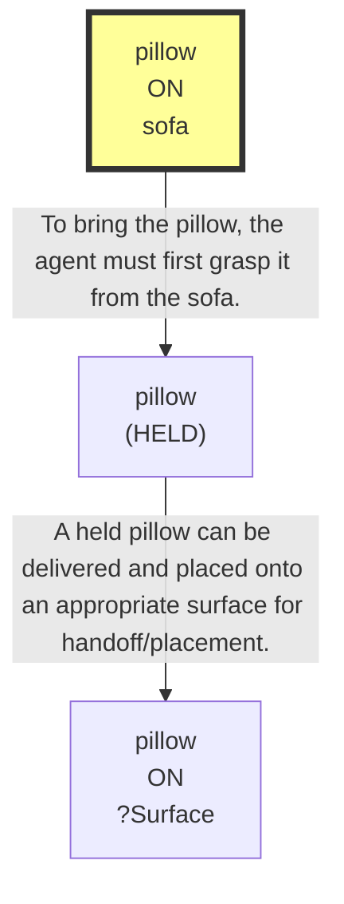
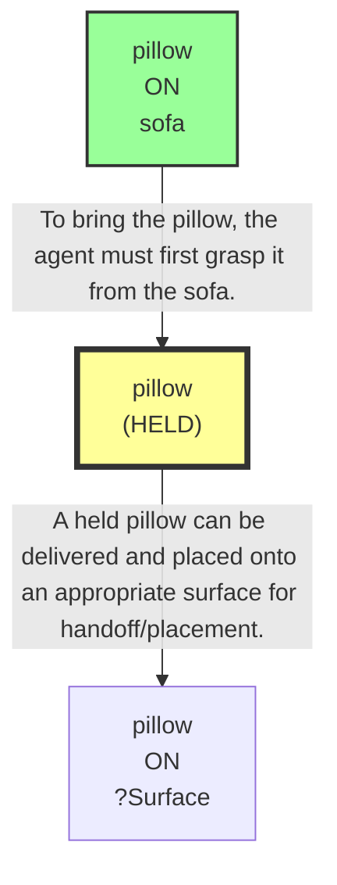
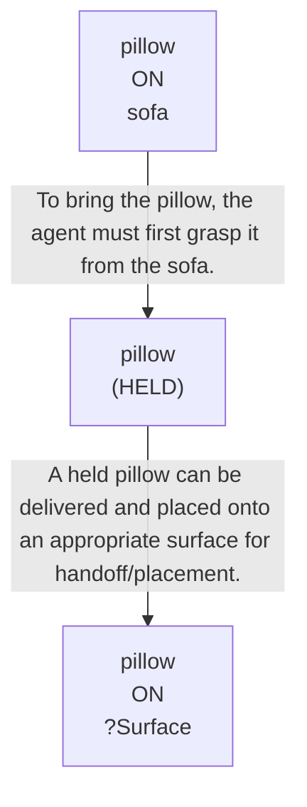

# 🚀 VirtualHome Agent Episode Log


### [GoalReasoner (Module A - Intent)] Output
```json
{
  "is_instruction_obviously_vague": false,
  "clarification_question": null,
  "target_object": "pillow",
  "location_hint": "sofa",
  "reasoning_chain": [
    {
      "question": "Why does the user want this object?",
      "answer": "To obtain a pillow from the sofa."
    },
    {
      "question": "Why is that important?",
      "answer": "The user likely wants something soft or supportive for comfort or rest."
    },
    {
      "question": "What fundamental need does this fulfill?",
      "answer": "It fulfills the need for physical comfort or support while sitting or lying down."
    },
    {
      "question": "Are there any deeper psychological or physical motivations?",
      "answer": "It may help the user relax, rest, or improve bodily comfort by having a cushion-like item nearby."
    }
  ],
  "deep_intent": "The user wants physical comfort or support for resting.",
  "acceptable_alternatives_properties": [
    {
      "priority": 1,
      "description": "Other soft cushions or throw pillows that provide similar comfort and support"
    },
    {
      "priority": 2,
      "description": "Blankets, folded towels, or cushions that can offer padding or support"
    },
    {
      "priority": 3,
      "description": "Any household soft furnishing that can be used for resting support"
    },
    {
      "priority": 4,
      "description": "A folded sweater or other soft fabric item that can provide temporary comfort"
    }
  ]
}
```

### [PerceptionFilter] Output
```json
{
  "reasoning": "The goal is to obtain a pillow from the sofa, so the only strictly necessary classes are the target pillow and the sofa location it is on. No extra tools or backup receptacles are required for this retrieval task.",
  "selected_classes": [
    "sofa",
    "character",
    "pillow"
  ],
  "raw_class_count": 30
}
```

### [LLMExecutor] Output
```json
{
  "reasoning": "The pillow target is already identified and it is on the sofa. The current graph shows the character is close to the sofa, but to grab the pillow I must explicitly walk to the pillow itself first per proximity rules. This is the next step toward satisfying N1 and then N2.",
  "satisfied_nodes": [],
  "current_node_focus": "N1",
  "mapped_variables": {},
  "action": "[walk] <pillow> (303)"
}
```

### [RoboStateMultiTaskController] Output
```json
{
  "action": "[walk] <pillow> (303)",
  "active_task_id": "task_1",
  "task_context": {
    "active_task_id": "task_1",
    "pending_task_ids": [],
    "satisfied_task_ids": []
  },
  "source": "llm_executor"
}
```
## Step 0
- **Action**: `[walk] <pillow> (303)`
- **Action Success**: `True`
- **Action Message**: {'0': {'message': 'Success'}}
- **Active Task**: `task_1`
- **Decision Source**: `llm_executor`
- **Task Progress**: T3_without_memory_M1_04=pending
- **SDG Status**:

- **Observed Items (7)**: sofa(288), pillow(303), character(1), bathroom(11), bedroom(50), kitchen(126), livingroom(261)


### [PerceptionFilter] Output
```json
{
  "reasoning": "Reused cached class selection.",
  "selected_classes": [
    "sofa",
    "character",
    "pillow"
  ],
  "raw_class_count": 30
}
```

### [LLMExecutor] Output
```json
{
  "reasoning": "The pillow is already in the same room and explicitly close to the character, and the SDG requires first satisfying that the pillow is on the sofa before it can be held. Since I am already near both the sofa and pillow, the next atomic step is to grab the pillow from the sofa.",
  "satisfied_nodes": [
    "N1"
  ],
  "current_node_focus": "N2",
  "mapped_variables": {},
  "action": "[grab] <pillow> (303)"
}
```

### [RoboStateMultiTaskController] Output
```json
{
  "action": "[grab] <pillow> (303)",
  "active_task_id": "task_1",
  "task_context": {
    "active_task_id": "task_1",
    "pending_task_ids": [],
    "satisfied_task_ids": []
  },
  "source": "llm_executor"
}
```
## Step 1
- **Action**: `[grab] <pillow> (303)`
- **Action Success**: `False`
- **Action Message**: temporary_unavailable: target disappeared; wait or search and retry
- **Active Task**: `task_1`
- **Decision Source**: `llm_executor`
- **Task Progress**: T3_without_memory_M1_04=pending
- **SDG Status**:

- **Observed Items (7)**: sofa(288), pillow(303), character(1), bathroom(11), bedroom(50), kitchen(126), livingroom(261)


### [RoboStateMultiTaskController] Output
```json
{
  "action": "[walk] <bathroom> (11)",
  "active_task_id": "task_1",
  "task_context": {
    "active_task_id": "task_1",
    "pending_task_ids": [],
    "satisfied_task_ids": []
  },
  "source": "room_frontier"
}
```
## Step 2
- **Action**: `[walk] <bathroom> (11)`
- **Action Success**: `True`
- **Action Message**: {'0': {'message': 'Success'}}
- **Active Task**: `task_1`
- **Decision Source**: `room_frontier`
- **Task Progress**: T3_without_memory_M1_04=pending
- **SDG Status**:

- **Observed Items (63)**: wall(262), wall(263), wall(264), wall(265), wall(266), wall(267), wall(268), wall(269), ceiling(270), ceiling(271), ceiling(272), ceiling(273), ceiling(274), ceiling(275), ceiling(276)...


### [RoboStateMultiTaskController] Output
```json
{
  "action": "[walk] <bedroom> (50)",
  "active_task_id": "task_1",
  "task_context": {
    "active_task_id": "task_1",
    "pending_task_ids": [],
    "satisfied_task_ids": []
  },
  "source": "room_frontier"
}
```
## Step 3
- **Action**: `[walk] <bedroom> (50)`
- **Action Success**: `True`
- **Action Message**: {'0': {'message': 'Success'}}
- **Active Task**: `task_1`
- **Decision Source**: `room_frontier`
- **Task Progress**: T3_without_memory_M1_04=pending
- **SDG Status**:

- **Observed Items (43)**: wall(12), wall(13), wall(14), wall(15), ceiling(16), ceiling(17), ceiling(18), ceiling(19), floor(20), floor(21), floor(22), floor(23), toilet(24) [CLOSED], stall(25), bathroomcabinet(26) [CLOSED]...


### [PerceptionFilter] Output
```json
{
  "reasoning": "The goal is to obtain a pillow from the sofa, so the only strictly necessary object class is the target item itself. The sofa is mentioned as the source/location in the SDG and goal, so it must also be retained.",
  "selected_classes": [
    "sofa",
    "character",
    "pillow"
  ],
  "raw_class_count": 40
}
```

### [LLMExecutor] Output
```json
{
  "reasoning": "The pillow we need is currently visible on sofa(85) in the bedroom, and the previous grab attempt failed because the target had temporarily disappeared. Since the object is present again and the goal requires the pillow to be HELD first, the correct next step is to move close to it before retrying the grab. This satisfies the proximity rule and sets up N1 -> N2 progression.",
  "satisfied_nodes": [],
  "current_node_focus": "N1",
  "mapped_variables": {},
  "action": "[walk] <pillow> (122)"
}
```

### [RoboStateMultiTaskController] Output
```json
{
  "action": "[walk] <pillow> (122)",
  "active_task_id": "task_1",
  "task_context": {
    "active_task_id": "task_1",
    "pending_task_ids": [],
    "satisfied_task_ids": []
  },
  "source": "llm_executor"
}
```
## Step 4
- **Action**: `[walk] <pillow> (122)`
- **Action Success**: `True`
- **Action Message**: {'0': {'message': 'Success'}}
- **Active Task**: `task_1`
- **Decision Source**: `llm_executor`
- **Task Progress**: T3_without_memory_M1_04=pending
- **SDG Status**:

- **Observed Items (7)**: sofa(85), pillow(122), character(1), bathroom(11), bedroom(50), kitchen(126), livingroom(261)


### [PerceptionFilter] Output
```json
{
  "reasoning": "Reused cached class selection.",
  "selected_classes": [
    "sofa",
    "character",
    "pillow"
  ],
  "raw_class_count": 40
}
```

### [LLMExecutor] Output
```json
{
  "reasoning": "The target pillow is currently present again in the filtered graph and is on the sofa while being close to the character, so the previous temporary_unavailable issue has resolved. The SDG requires first satisfying the pillow-on-sofa relation before any holding/relocation steps. Since I am already close to the pillow and sofa, the next atomic step is to grab the pillow from the sofa.",
  "satisfied_nodes": [
    "N1"
  ],
  "current_node_focus": "N2",
  "mapped_variables": {},
  "action": "[grab] <pillow> (122)"
}
```

### [RoboStateMultiTaskController] Output
```json
{
  "action": "[grab] <pillow> (122)",
  "active_task_id": "task_1",
  "task_context": {
    "active_task_id": "task_1",
    "pending_task_ids": [],
    "satisfied_task_ids": []
  },
  "source": "llm_executor"
}
```
## Step 5
- **Action**: `[grab] <pillow> (122)`
- **Action Success**: `True`
- **Action Message**: {'0': {'message': 'Success'}}
- **Active Task**: `task_1`
- **Decision Source**: `llm_executor`
- **Task Progress**: T3_without_memory_M1_04=done
- **SDG Status**:

- **Observed Items (7)**: sofa(85), pillow(122), character(1), bathroom(11), bedroom(50), kitchen(126), livingroom(261)

