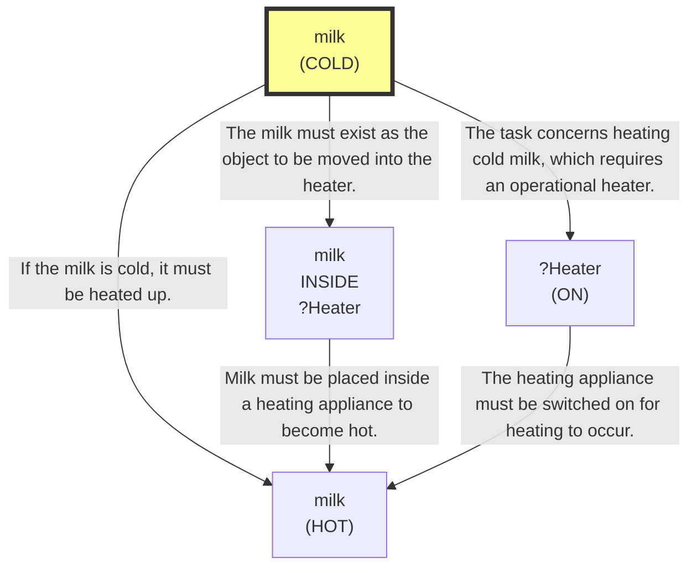
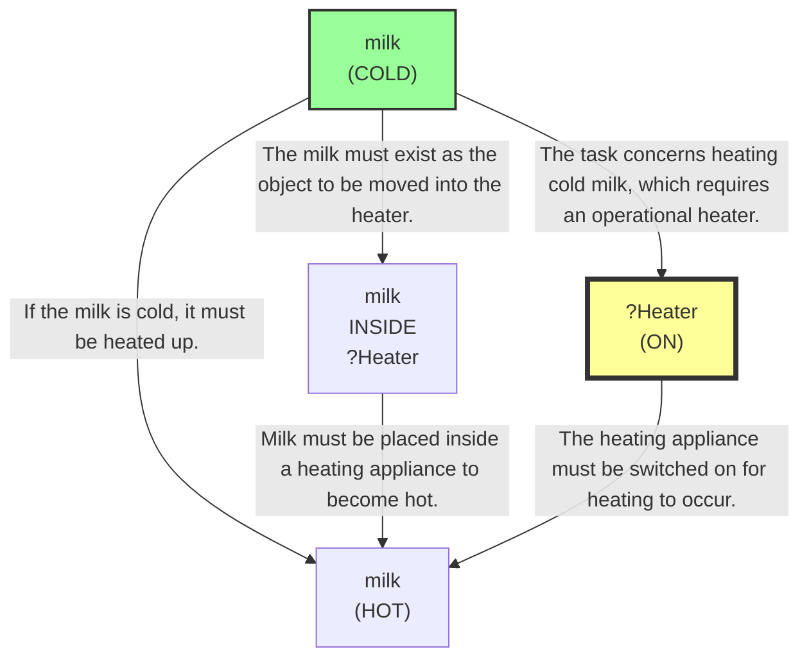
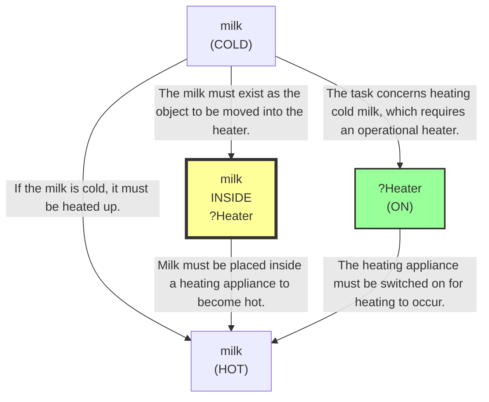
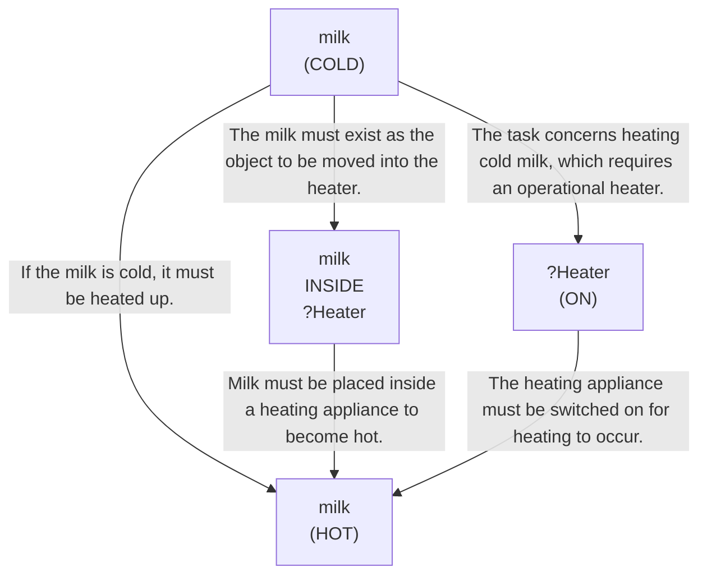
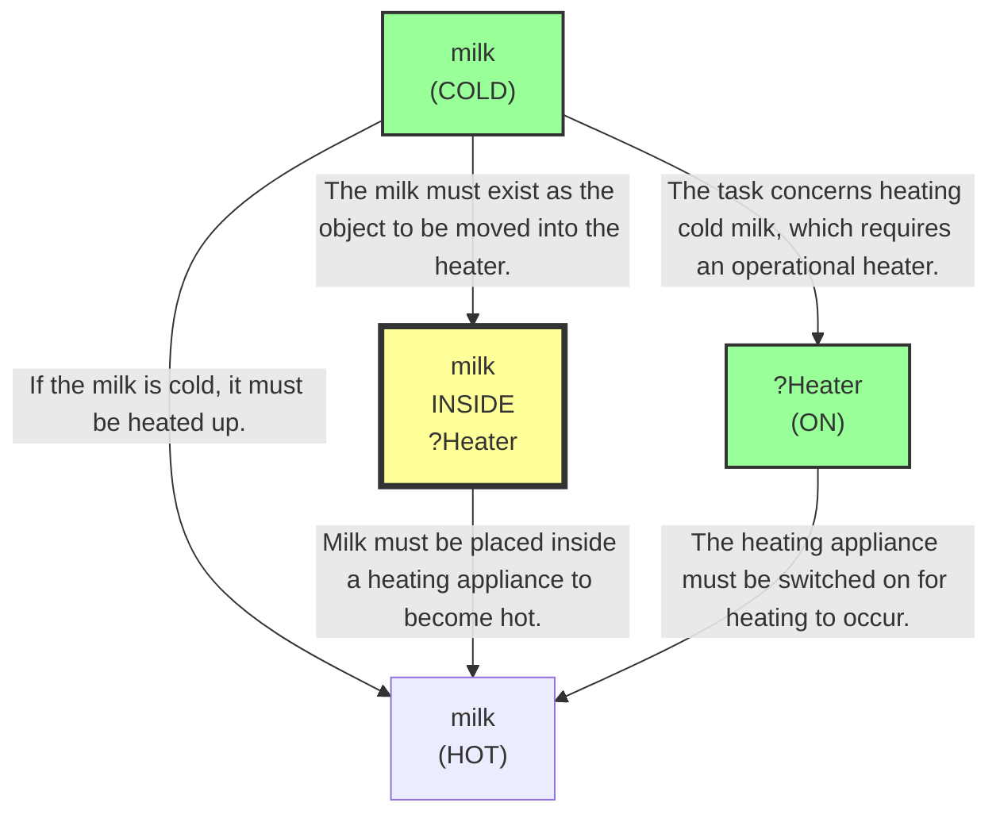
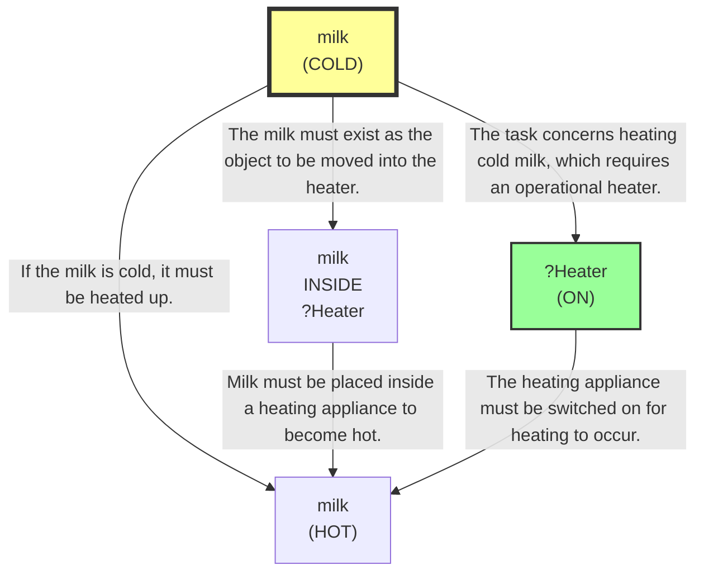
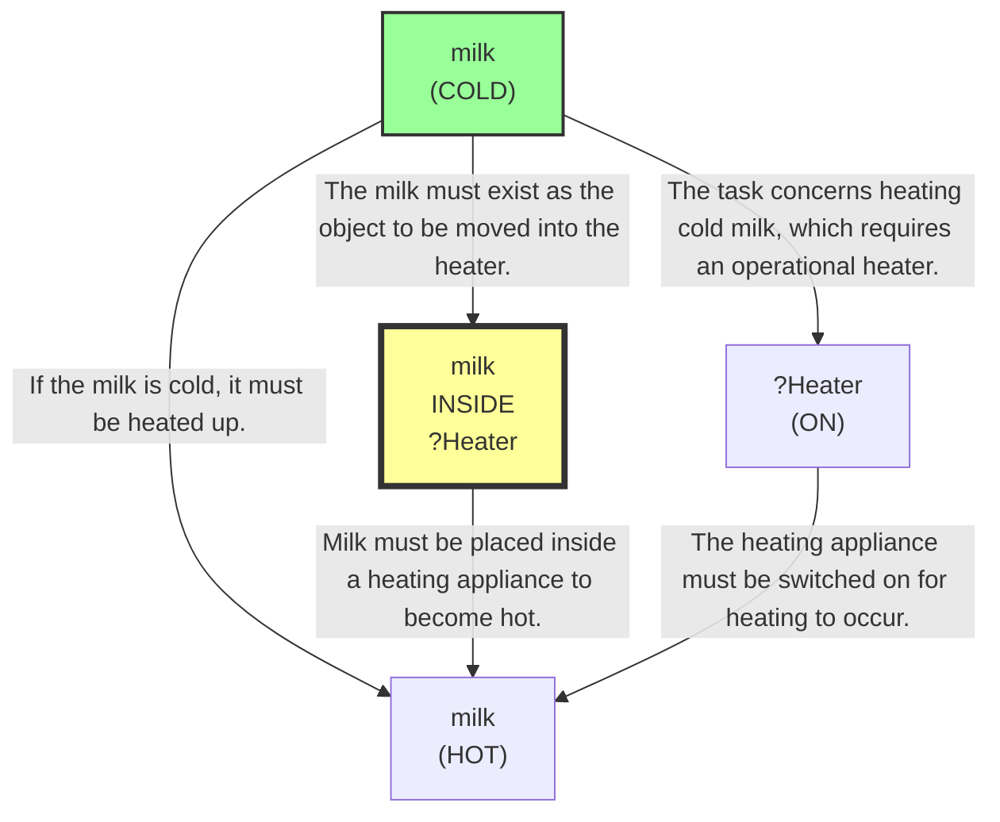

# 🚀 VirtualHome Agent Episode Log


### [GoalReasoner (Module A - Intent)] Output
```json
{
  "is_instruction_obviously_vague": false,
  "clarification_question": null,
  "target_object": "milk",
  "location_hint": null,
  "reasoning_chain": [
    {
      "question": "Why does the user want this object?",
      "answer": "To have the milk warmed up if it is currently cold."
    },
    {
      "question": "Why is that important?",
      "answer": "Warm milk may be needed for drinking or for another intended use requiring a higher temperature."
    },
    {
      "question": "What fundamental need does this fulfill?",
      "answer": "It fulfills the need to obtain a beverage at a desired temperature."
    },
    {
      "question": "Are there any deeper psychological or physical motivations?",
      "answer": "The underlying motivation is likely comfort, preference, or preparation for consumption or use in a recipe."
    }
  ],
  "deep_intent": "The user wants a beverage heated to a desired temperature.",
  "acceptable_alternatives_properties": [
    {
      "priority": 1,
      "description": "Other cold beverages that can be safely warmed for drinking, such as water or a prepared drink."
    },
    {
      "priority": 2,
      "description": "Other dairy or plant-based beverages that serve the same role and can be heated, such as cream or a milk alternative."
    },
    {
      "priority": 3,
      "description": "Ready-to-drink liquids intended for warming, such as broth or hot chocolate mix prepared as a drink."
    },
    {
      "priority": 4,
      "description": "Any consumable liquid that can satisfy the same need for a warm drink, such as tea or soup broth."
    }
  ]
}
```

### [PerceptionFilter] Output
```json
{
  "reasoning": "The goal is to heat milk, so the target object milk must be kept. The SDG requires a heater that can be turned on; from the visible objects, the valid heating appliances are microwave and stove, and both must be retained as functional alternatives/backups.",
  "selected_classes": [
    "stove",
    "milk",
    "microwave",
    "character"
  ],
  "raw_class_count": 50
}
```

### [LLMExecutor] Output
```json
{
  "reasoning": "The SDG requires a cold milk object to be moved into a heater that is ON. In the current graph, milk(176) is the only milk explicitly marked COLD, so it is the correct target. Before I can grab it, I must first walk to it because it is inside the kitchen and not yet adjacent. The heater candidate is the microwave(171), which can be opened, has a plug, and is currently OFF; however, the immediate next step is proximity to the milk so I can pick it up before later opening/switching on the microwave and placing the milk inside.",
  "satisfied_nodes": [
    "N1"
  ],
  "current_node_focus": "N1",
  "mapped_variables": {
    "?Heater": "microwave(171)"
  },
  "action": "[walk] <milk> (176)"
}
```

### [RoboStateMultiTaskController] Output
```json
{
  "action": "[walk] <milk> (176)",
  "active_task_id": "task_1",
  "task_context": {
    "active_task_id": "task_1",
    "pending_task_ids": [],
    "satisfied_task_ids": []
  },
  "source": "llm_executor"
}
```
## Step 0
- **Action**: `[walk] <milk> (176)`
- **Action Success**: `True`
- **Action Message**: {'0': {'message': 'Success'}}
- **Active Task**: `task_1`
- **Decision Source**: `llm_executor`
- **Task Progress**: T3_without_memory_M1_05=pending
- **SDG Status**:

- **Observed Items (10)**: stove(163) [OFF,CLOSED], microwave(171) [CLOSED,OFF], milk(177) [CLOSED], milk(176) [CLOSED,COLD], character(1), kitchen(11), livingroom(183), bedroom(241), bathroom(285), bedroom(346)


### [PerceptionFilter] Output
```json
{
  "reasoning": "Reused cached class selection.",
  "selected_classes": [
    "stove",
    "milk",
    "microwave",
    "character"
  ],
  "raw_class_count": 50
}
```

### [LLMExecutor] Output
```json
{
  "reasoning": "The goal is to heat cold milk. The SDG requires choosing a heater, placing the milk inside it, and turning the heater on. The filtered graph shows two milk instances: milk(176) is explicitly COLD and close to the character, so it matches N1. The microwave(171) is a valid heater because it has CAN_OPEN, HAS_SWITCH, CONTAINERS, and is OFF. Since I cannot put milk into a heater unless I am near the destination and the milk must first be held, the immediate next step is to walk to the cold milk so I can grab it next.",
  "satisfied_nodes": [],
  "current_node_focus": "N1",
  "mapped_variables": {
    "?Heater": "microwave(171)"
  },
  "action": "[walk] <milk> (176)"
}
```

### [RoboStateMultiTaskController] Output
```json
{
  "action": "[walk] <milk> (176)",
  "active_task_id": "task_1",
  "task_context": {
    "active_task_id": "task_1",
    "pending_task_ids": [],
    "satisfied_task_ids": []
  },
  "source": "llm_executor"
}
```
## Step 1
- **Action**: `[walk] <milk> (176)`
- **Action Success**: `True`
- **Action Message**: {'0': {'message': 'Success'}}
- **Active Task**: `task_1`
- **Decision Source**: `llm_executor`
- **Task Progress**: T3_without_memory_M1_05=pending
- **SDG Status**:

- **Observed Items (10)**: stove(163) [OFF,CLOSED], microwave(171) [CLOSED,OFF], milk(177) [CLOSED], milk(176) [CLOSED,COLD], character(1), kitchen(11), livingroom(183), bedroom(241), bathroom(285), bedroom(346)


### [PerceptionFilter] Output
```json
{
  "reasoning": "Reused cached class selection.",
  "selected_classes": [
    "stove",
    "milk",
    "microwave",
    "character"
  ],
  "raw_class_count": 50
}
```

### [LLMExecutor] Output
```json
{
  "reasoning": "The SDG requires heating a cold milk object by placing it inside a heater and turning that heater on. In the current graph, milk(176) is already cold and close to the character, while microwave(171) is a valid heater because it has HAS_PLUG and can be switched on. Before any interaction with the heater, the proximity rule requires walking to it. I am choosing the microwave as ?Heater because the stove is closed/off and would require opening; the microwave is the more direct heater candidate.",
  "satisfied_nodes": [
    "N1"
  ],
  "current_node_focus": "N4",
  "mapped_variables": {
    "?Heater": "microwave(171)"
  },
  "action": "[walk] <microwave> (171)"
}
```

### [RoboStateMultiTaskController] Output
```json
{
  "action": "[walk] <microwave> (171)",
  "active_task_id": "task_1",
  "task_context": {
    "active_task_id": "task_1",
    "pending_task_ids": [],
    "satisfied_task_ids": []
  },
  "source": "llm_executor"
}
```
## Step 2
- **Action**: `[walk] <microwave> (171)`
- **Action Success**: `True`
- **Action Message**: {'0': {'message': 'Success'}}
- **Active Task**: `task_1`
- **Decision Source**: `llm_executor`
- **Task Progress**: T3_without_memory_M1_05=pending
- **SDG Status**:

- **Observed Items (10)**: stove(163) [OFF,CLOSED], microwave(171) [CLOSED,OFF], milk(177) [CLOSED], milk(176) [CLOSED,COLD], character(1), kitchen(11), livingroom(183), bedroom(241), bathroom(285), bedroom(346)


### [PerceptionFilter] Output
```json
{
  "reasoning": "Reused cached class selection.",
  "selected_classes": [
    "stove",
    "milk",
    "microwave",
    "character"
  ],
  "raw_class_count": 50
}
```

### [LLMExecutor] Output
```json
{
  "reasoning": "The SDG requires a cold milk object to be heated to HOT using a heater that is ON. The filtered graph shows milk(176) is explicitly COLD, so it is the best binding for the target milk. A microwave(171) is present, close to the character, has a switch, and is a plausible heater. It is currently CLOSED and OFF, so the next step toward heating is to turn it on. Because proximity is already indicated as CLOSE, the next atomic action can be switching it on.",
  "satisfied_nodes": [
    "N1"
  ],
  "current_node_focus": "N4",
  "mapped_variables": {
    "?Heater": "microwave(171)"
  },
  "action": "[switchon] <microwave> (171)"
}
```

### [RoboStateMultiTaskController] Output
```json
{
  "action": "[switchon] <microwave> (171)",
  "active_task_id": "task_1",
  "task_context": {
    "active_task_id": "task_1",
    "pending_task_ids": [],
    "satisfied_task_ids": []
  },
  "source": "llm_executor"
}
```
## Step 3
- **Action**: `[switchon] <microwave> (171)`
- **Action Success**: `True`
- **Action Message**: Faked switch operation in Python layer (bypassed Unity failure)
- **Active Task**: `task_1`
- **Decision Source**: `llm_executor`
- **Task Progress**: T3_without_memory_M1_05=pending
- **SDG Status**:

- **Observed Items (10)**: stove(163) [OFF,CLOSED], microwave(171) [CLOSED,OFF], milk(177) [CLOSED], milk(176) [CLOSED,COLD], character(1), kitchen(11), livingroom(183), bedroom(241), bathroom(285), bedroom(346)


### [PerceptionFilter] Output
```json
{
  "reasoning": "Reused cached class selection.",
  "selected_classes": [
    "stove",
    "milk",
    "microwave",
    "character"
  ],
  "raw_class_count": 50
}
```

### [LLMExecutor] Output
```json
{
  "reasoning": "The goal is to heat cold milk. The SDG requires the milk to be inside a heater and the heater to be ON. In the filtered graph, microwave(171) is already ON and closed, and milk(177) is the only milk currently close to the character. Since milk is pourable and can be placed inside the microwave, the next needed step is to first move to the microwave before any putin action can be attempted. This advances toward satisfying N3 and then N2.",
  "satisfied_nodes": [
    "N4"
  ],
  "current_node_focus": "N3",
  "mapped_variables": {
    "?Heater": "microwave(171)"
  },
  "action": "[walk] <microwave> (171)"
}
```

### [RoboStateMultiTaskController] Output
```json
{
  "action": "[walk] <microwave> (171)",
  "active_task_id": "task_1",
  "task_context": {
    "active_task_id": "task_1",
    "pending_task_ids": [],
    "satisfied_task_ids": []
  },
  "source": "llm_executor"
}
```
## Step 4
- **Action**: `[walk] <microwave> (171)`
- **Action Success**: `True`
- **Action Message**: {'0': {'message': 'Success'}}
- **Active Task**: `task_1`
- **Decision Source**: `llm_executor`
- **Task Progress**: T3_without_memory_M1_05=pending
- **SDG Status**:

- **Observed Items (10)**: stove(163) [OFF,CLOSED], microwave(171) [ON,CLOSED], milk(177) [CLOSED], milk(176) [CLOSED,COLD], character(1), kitchen(11), livingroom(183), bedroom(241), bathroom(285), bedroom(346)


### [PerceptionFilter] Output
```json
{
  "reasoning": "Reused cached class selection.",
  "selected_classes": [
    "stove",
    "milk",
    "microwave",
    "character"
  ],
  "raw_class_count": 50
}
```

### [LLMExecutor] Output
```json
{
  "reasoning": "The SDG requires the milk object to end up HOT and inside an ON heater. The filtered graph contains two milk instances: milk(176) is explicitly COLD, while milk(177) is only CLOSED and close to the character but not marked cold. Since the task is specifically to heat cold milk and we must use current graph states only, the best current focus is to prepare the heater path by confirming the heater is accessible and usable. The microwave(171) is ON and has HAS_PLUG, and it is a valid heater/container. The next atomic step should therefore be to move near the microwave before any grab/putin action can be done later.",
  "satisfied_nodes": [
    "N4"
  ],
  "current_node_focus": "N3",
  "mapped_variables": {
    "?Heater": "microwave(171)"
  },
  "action": "[walk] <microwave> (171)"
}
```

### [RoboStateMultiTaskController] Output
```json
{
  "action": "[walk] <microwave> (171)",
  "active_task_id": "task_1",
  "task_context": {
    "active_task_id": "task_1",
    "pending_task_ids": [],
    "satisfied_task_ids": []
  },
  "source": "llm_executor"
}
```
## Step 5
- **Action**: `[walk] <microwave> (171)`
- **Action Success**: `True`
- **Action Message**: {'0': {'message': 'Success'}}
- **Active Task**: `task_1`
- **Decision Source**: `llm_executor`
- **Task Progress**: T3_without_memory_M1_05=pending
- **SDG Status**:

- **Observed Items (10)**: stove(163) [OFF,CLOSED], microwave(171) [ON,CLOSED], milk(177) [CLOSED], milk(176) [CLOSED,COLD], character(1), kitchen(11), livingroom(183), bedroom(241), bathroom(285), bedroom(346)


### [PerceptionFilter] Output
```json
{
  "reasoning": "Reused cached class selection.",
  "selected_classes": [
    "stove",
    "milk",
    "microwave",
    "character"
  ],
  "raw_class_count": 50
}
```

### [LLMExecutor] Output
```json
{
  "reasoning": "The SDG requires a COLD milk object to become HOT by being inside an ON heater. In the current graph, milk(176) is the only milk explicitly marked COLD, and microwave(171) is already ON and has CONTAINERS, making it a valid heater. However, the proximity rule says I must first walk to the destination receptacle before putting an object into it. I am not yet holding milk(176), so the correct next step is to walk to the microwave first, then I can grab the cold milk and place it inside. This action advances toward the final heating condition without assuming any hidden proximity.",
  "satisfied_nodes": [
    "N4"
  ],
  "current_node_focus": "N3",
  "mapped_variables": {
    "?Heater": "microwave(171)"
  },
  "action": "[walk] <microwave> (171)"
}
```

### [RoboStateMultiTaskController] Output
```json
{
  "action": "[walk] <livingroom> (183)",
  "active_task_id": null,
  "task_context": {
    "active_task_id": null,
    "pending_task_ids": [
      "task_1"
    ],
    "satisfied_task_ids": []
  },
  "source": "loop_recovery_room_revisit"
}
```
## Step 6
- **Action**: `[walk] <livingroom> (183)`
- **Action Success**: `True`
- **Action Message**: {'0': {'message': 'Success'}}
- **Decision Source**: `loop_recovery_room_revisit`
- **Task Progress**: T3_without_memory_M1_05=pending
- **SDG Status**:
No SDG active.
- **Observed Items (159)**: wall(12), wall(13), wall(14), wall(15), wall(16), wall(17), wall(18), wall(19), wall(20), wall(21), floor(22), floor(23), floor(24), floor(25), floor(26)...


### [RoboStateMultiTaskController] Output
```json
{
  "action": "[walk] <bedroom> (241)",
  "active_task_id": "task_1",
  "task_context": {
    "active_task_id": "task_1",
    "pending_task_ids": [],
    "satisfied_task_ids": []
  },
  "source": "room_frontier"
}
```
## Step 7
- **Action**: `[walk] <bedroom> (241)`
- **Action Success**: `True`
- **Action Message**: {'0': {'message': 'Success'}}
- **Active Task**: `task_1`
- **Decision Source**: `room_frontier`
- **Task Progress**: T3_without_memory_M1_05=pending
- **SDG Status**:

- **Observed Items (58)**: floor(184), floor(185), floor(186), floor(187), floor(188), floor(189), wall(190), wall(191), wall(192), wall(193), wall(194), wall(195), ceiling(196), ceiling(197), ceiling(198)...


### [RoboStateMultiTaskController] Output
```json
{
  "action": "[walk] <bathroom> (285)",
  "active_task_id": "task_1",
  "task_context": {
    "active_task_id": "task_1",
    "pending_task_ids": [],
    "satisfied_task_ids": []
  },
  "source": "room_frontier"
}
```
## Step 8
- **Action**: `[walk] <bathroom> (285)`
- **Action Success**: `True`
- **Action Message**: {'0': {'message': 'Success'}}
- **Active Task**: `task_1`
- **Decision Source**: `room_frontier`
- **Task Progress**: T3_without_memory_M1_05=pending
- **SDG Status**:

- **Observed Items (38)**: floor(242), floor(243), floor(244), floor(245), ceiling(246), ceiling(247), ceiling(248), ceiling(249), wall(250), wall(251), wall(252), wall(253), door(254) [OPEN], ceilinglamp(255), tablelamp(256) [ON]...


### [RoboStateMultiTaskController] Output
```json
{
  "action": "[walk] <bedroom> (346)",
  "active_task_id": "task_1",
  "task_context": {
    "active_task_id": "task_1",
    "pending_task_ids": [],
    "satisfied_task_ids": []
  },
  "source": "room_frontier"
}
```
## Step 9
- **Action**: `[walk] <bedroom> (346)`
- **Action Success**: `True`
- **Action Message**: {'0': {'message': 'Success'}}
- **Active Task**: `task_1`
- **Decision Source**: `room_frontier`
- **Task Progress**: T3_without_memory_M1_05=pending
- **SDG Status**:

- **Observed Items (66)**: wall(286), wall(287), wall(288), wall(289), wall(290), wall(291), floor(292), floor(293), floor(294), floor(295), floor(296), floor(297), ceiling(298), ceiling(299), ceiling(300)...


### [RoboStateMultiTaskController] Output
```json
{
  "action": "[walk] <kitchen> (11)",
  "active_task_id": null,
  "task_context": {
    "active_task_id": null,
    "pending_task_ids": [
      "task_1"
    ],
    "satisfied_task_ids": []
  },
  "source": "loop_recovery_room_revisit"
}
```
## Step 10
- **Action**: `[walk] <kitchen> (11)`
- **Action Success**: `True`
- **Action Message**: {'0': {'message': 'Success'}}
- **Decision Source**: `loop_recovery_room_revisit`
- **Task Progress**: T3_without_memory_M1_05=pending
- **SDG Status**:
No SDG active.
- **Observed Items (64)**: floor(347), floor(348), floor(349), floor(350), floor(351), floor(352), floor(353), floor(354), floor(355), wall(356), wall(357), wall(358), wall(359), wall(360), wall(361)...


### [PerceptionFilter] Output
```json
{
  "reasoning": "Reused cached class selection.",
  "selected_classes": [
    "stove",
    "milk",
    "microwave",
    "character"
  ],
  "raw_class_count": 50
}
```

### [LLMExecutor] Output
```json
{
  "reasoning": "The SDG requires a COLD milk instance and then heating it to HOT inside an ON heater. The current graph contains two milk objects: milk(176) is explicitly COLD, while milk(177) is not. No prior actions have been taken, so the next step is to move to the correct milk instance before grabbing it. Since grabbing requires proximity, the immediate action is to walk to milk(176).",
  "satisfied_nodes": [],
  "current_node_focus": "N1",
  "mapped_variables": {
    "?Heater": "microwave(171)"
  },
  "action": "[walk] <milk> (176)"
}
```

### [RoboStateMultiTaskController] Output
```json
{
  "action": "[walk] <milk> (176)",
  "active_task_id": "task_1",
  "task_context": {
    "active_task_id": "task_1",
    "pending_task_ids": [],
    "satisfied_task_ids": []
  },
  "source": "llm_executor"
}
```
## Step 11
- **Action**: `[walk] <milk> (176)`
- **Action Success**: `True`
- **Action Message**: {'0': {'message': 'Success'}}
- **Active Task**: `task_1`
- **Decision Source**: `llm_executor`
- **Task Progress**: T3_without_memory_M1_05=pending
- **SDG Status**:

- **Observed Items (10)**: stove(163) [OFF,CLOSED], microwave(171) [ON,CLOSED], milk(177) [CLOSED], milk(176) [CLOSED,COLD], character(1), kitchen(11), livingroom(183), bedroom(241), bathroom(285), bedroom(346)


### [PerceptionFilter] Output
```json
{
  "reasoning": "Reused cached class selection.",
  "selected_classes": [
    "stove",
    "milk",
    "microwave",
    "character"
  ],
  "raw_class_count": 50
}
```

### [LLMExecutor] Output
```json
{
  "reasoning": "The SDG requires the cold milk object to be heated by placing it inside an ON heater. In the current graph, milk(176) is explicitly COLD and already CLOSE to the character, so it is the correct target milk instance. The microwave(171) is ON and is a valid heater. To place milk into it, I must first be near the destination heater, so the next atomic step is to walk to the microwave.",
  "satisfied_nodes": [
    "N1",
    "N4"
  ],
  "current_node_focus": "N3",
  "mapped_variables": {
    "?Heater": "microwave(171)"
  },
  "action": "[walk] <microwave> (171)"
}
```

### [RoboStateMultiTaskController] Output
```json
{
  "action": "[walk] <microwave> (171)",
  "active_task_id": "task_1",
  "task_context": {
    "active_task_id": "task_1",
    "pending_task_ids": [],
    "satisfied_task_ids": []
  },
  "source": "llm_executor"
}
```
## Step 12
- **Action**: `[walk] <microwave> (171)`
- **Action Success**: `True`
- **Action Message**: {'0': {'message': 'Success'}}
- **Active Task**: `task_1`
- **Decision Source**: `llm_executor`
- **Task Progress**: T3_without_memory_M1_05=pending
- **SDG Status**:

- **Observed Items (10)**: stove(163) [OFF,CLOSED], microwave(171) [ON,CLOSED], milk(177) [CLOSED], milk(176) [CLOSED,COLD], character(1), kitchen(11), livingroom(183), bedroom(241), bathroom(285), bedroom(346)


### [PerceptionFilter] Output
```json
{
  "reasoning": "Reused cached class selection.",
  "selected_classes": [
    "stove",
    "milk",
    "microwave",
    "character"
  ],
  "raw_class_count": 50
}
```

### [LLMExecutor] Output
```json
{
  "reasoning": "The SDG requires cold milk to become hot by being inside a heater that is ON. The best heater available is microwave(171), which is already ON and CLOSED and also close to the character, so the next necessary step is to open it before placing milk inside. I will focus on the specific cold milk instance milk(176) because it matches the required COLD state; milk(177) is not cold and is not the target for this task state progression.",
  "satisfied_nodes": [
    "N1",
    "N4"
  ],
  "current_node_focus": "N3",
  "mapped_variables": {
    "?Heater": "microwave(171)"
  },
  "action": "[open] <microwave> (171)"
}
```

### [RoboStateMultiTaskController] Output
```json
{
  "action": "[open] <microwave> (171)",
  "active_task_id": "task_1",
  "task_context": {
    "active_task_id": "task_1",
    "pending_task_ids": [],
    "satisfied_task_ids": []
  },
  "source": "llm_executor"
}
```
## Step 13
- **Action**: `[open] <microwave> (171)`
- **Action Success**: `True`
- **Action Message**: {'0': {'message': 'Success'}}
- **Active Task**: `task_1`
- **Decision Source**: `llm_executor`
- **Task Progress**: T3_without_memory_M1_05=pending
- **SDG Status**:

- **Observed Items (10)**: stove(163) [OFF,CLOSED], microwave(171) [ON,CLOSED], milk(177) [CLOSED], milk(176) [CLOSED,COLD], character(1), kitchen(11), livingroom(183), bedroom(241), bathroom(285), bedroom(346)


### [PerceptionFilter] Output
```json
{
  "reasoning": "Reused cached class selection.",
  "selected_classes": [
    "stove",
    "milk",
    "microwave",
    "character"
  ],
  "raw_class_count": 50
}
```

### [LLMExecutor] Output
```json
{
  "reasoning": "The SDG requires a cold milk object to be heated by placing it inside an ON heater. The current graph shows two milk instances: milk(176) is explicitly COLD, while milk(177) is close but not cold. The microwave(171) is already ON and open, so the remaining gap is to move the correct cold milk into the heater. Since the robot is not currently holding milk(176), the next atomic step must be to walk to the cold milk before grabbing it.",
  "satisfied_nodes": [
    "N1",
    "N4"
  ],
  "current_node_focus": "N1",
  "mapped_variables": {
    "?Heater": "microwave(171)"
  },
  "action": "[walk] <milk> (176)"
}
```

### [RoboStateMultiTaskController] Output
```json
{
  "action": "[walk] <milk> (176)",
  "active_task_id": "task_1",
  "task_context": {
    "active_task_id": "task_1",
    "pending_task_ids": [],
    "satisfied_task_ids": []
  },
  "source": "llm_executor"
}
```
## Step 14
- **Action**: `[walk] <milk> (176)`
- **Action Success**: `True`
- **Action Message**: {'0': {'message': 'Success'}}
- **Active Task**: `task_1`
- **Decision Source**: `llm_executor`
- **Task Progress**: T3_without_memory_M1_05=pending
- **SDG Status**:

- **Observed Items (10)**: stove(163) [OFF,CLOSED], microwave(171) [OPEN,ON], milk(177) [CLOSED], milk(176) [CLOSED,COLD], character(1), kitchen(11), livingroom(183), bedroom(241), bathroom(285), bedroom(346)


### [PerceptionFilter] Output
```json
{
  "reasoning": "Reused cached class selection.",
  "selected_classes": [
    "stove",
    "milk",
    "microwave",
    "character"
  ],
  "raw_class_count": 50
}
```

### [LLMExecutor] Output
```json
{
  "reasoning": "The goal is to heat the cold milk. The current graph already shows a valid target milk instance, milk(176), which is COLD and CLOSE to the character. To satisfy the prerequisite for heating, I need to place this milk into a heater. The microwave(171) is ON and already OPEN, so it is the best heater candidate. However, I cannot put the milk in from across the room; I must first walk to the microwave before I can use putin. This action advances toward N3 and supports N2.",
  "satisfied_nodes": [
    "N1"
  ],
  "current_node_focus": "N3",
  "mapped_variables": {
    "?Heater": "microwave(171)"
  },
  "action": "[walk] <microwave> (171)"
}
```

### [RoboStateMultiTaskController] Output
```json
{
  "action": "[walk] <microwave> (171)",
  "active_task_id": "task_1",
  "task_context": {
    "active_task_id": "task_1",
    "pending_task_ids": [],
    "satisfied_task_ids": []
  },
  "source": "llm_executor"
}
```
## Step 15
- **Action**: `[walk] <microwave> (171)`
- **Action Success**: `True`
- **Action Message**: {'0': {'message': 'Success'}}
- **Active Task**: `task_1`
- **Decision Source**: `llm_executor`
- **Task Progress**: T3_without_memory_M1_05=pending
- **SDG Status**:

- **Observed Items (10)**: stove(163) [OFF,CLOSED], microwave(171) [OPEN,ON], milk(177) [CLOSED], milk(176) [CLOSED,COLD], character(1), kitchen(11), livingroom(183), bedroom(241), bathroom(285), bedroom(346)


### [PerceptionFilter] Output
```json
{
  "reasoning": "Reused cached class selection.",
  "selected_classes": [
    "stove",
    "milk",
    "microwave",
    "character"
  ],
  "raw_class_count": 50
}
```

### [LLMExecutor] Output
```json
{
  "reasoning": "The SDG requires a cold milk object to be heated by placing it inside a heater that is ON. In the current graph, microwave(171) is already ON and OPEN, so it is the best heater candidate. The relevant milk object that is closest and likely intended for manipulation is milk(177), which is CLOSE to the character; however, it is currently not held. Because I cannot put an object into the microwave without first grabbing it, the next atomic step is to walk to the milk so it can be picked up next. This also avoids assuming I am already at the milk's exact interaction point.",
  "satisfied_nodes": [
    "N4"
  ],
  "current_node_focus": "N1",
  "mapped_variables": {
    "?Heater": "microwave(171)"
  },
  "action": "[walk] <milk> (177)"
}
```

### [RoboStateMultiTaskController] Output
```json
{
  "action": "[walk] <milk> (177)",
  "active_task_id": "task_1",
  "task_context": {
    "active_task_id": "task_1",
    "pending_task_ids": [],
    "satisfied_task_ids": []
  },
  "source": "llm_executor"
}
```
## Step 16
- **Action**: `[walk] <milk> (177)`
- **Action Success**: `True`
- **Action Message**: {'0': {'message': 'Success'}}
- **Active Task**: `task_1`
- **Decision Source**: `llm_executor`
- **Task Progress**: T3_without_memory_M1_05=pending
- **SDG Status**:

- **Observed Items (10)**: stove(163) [OFF,CLOSED], microwave(171) [OPEN,ON], milk(177) [CLOSED], milk(176) [CLOSED,COLD], character(1), kitchen(11), livingroom(183), bedroom(241), bathroom(285), bedroom(346)


### [PerceptionFilter] Output
```json
{
  "reasoning": "Reused cached class selection.",
  "selected_classes": [
    "stove",
    "milk",
    "microwave",
    "character"
  ],
  "raw_class_count": 50
}
```

### [LLMExecutor] Output
```json
{
  "reasoning": "The SDG requires the milk to become HOT by being inside a heater that is ON. In the current graph, microwave(171) is already ON and OPEN, and milk(177) is the closest milk object and is currently CLOSE to the character. Since milk(177) is the only milk with no COLD state shown, but the task explicitly concerns heating milk and the SDG requires the milk object to be moved into the heater, the next necessary step is to first get near the milk and then grab it. Because I have not yet walked to the milk in this action sequence, the single next atomic action should be to walk to the milk(177) before attempting any grab or placement.",
  "satisfied_nodes": [
    "N4"
  ],
  "current_node_focus": "N1",
  "mapped_variables": {
    "?Heater": "microwave(171)"
  },
  "action": "[walk] <milk> (177)"
}
```

### [RoboStateMultiTaskController] Output
```json
{
  "action": "[walk] <milk> (177)",
  "active_task_id": "task_1",
  "task_context": {
    "active_task_id": "task_1",
    "pending_task_ids": [],
    "satisfied_task_ids": []
  },
  "source": "llm_executor"
}
```
## Step 17
- **Action**: `[walk] <milk> (177)`
- **Action Success**: `True`
- **Action Message**: {'0': {'message': 'Success'}}
- **Active Task**: `task_1`
- **Decision Source**: `llm_executor`
- **Task Progress**: T3_without_memory_M1_05=pending
- **SDG Status**:

- **Observed Items (10)**: stove(163) [OFF,CLOSED], microwave(171) [OPEN,ON], milk(177) [CLOSED], milk(176) [CLOSED,COLD], character(1), kitchen(11), livingroom(183), bedroom(241), bathroom(285), bedroom(346)

