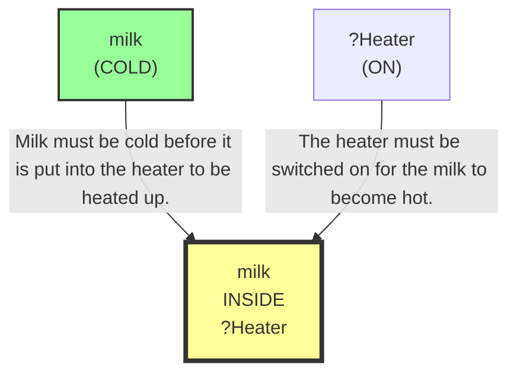
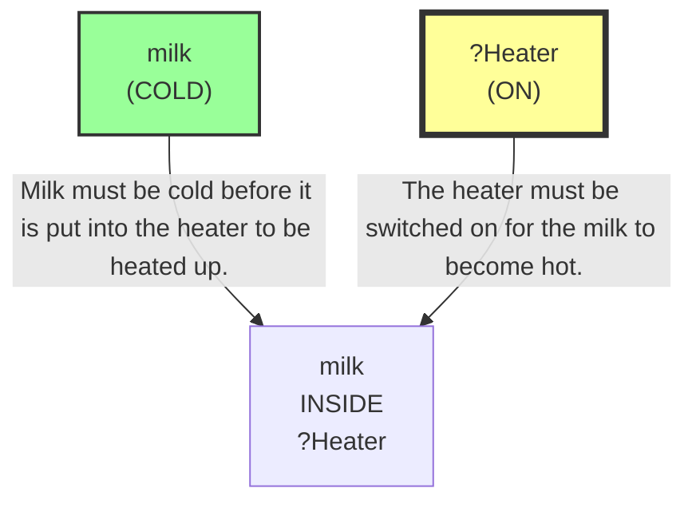
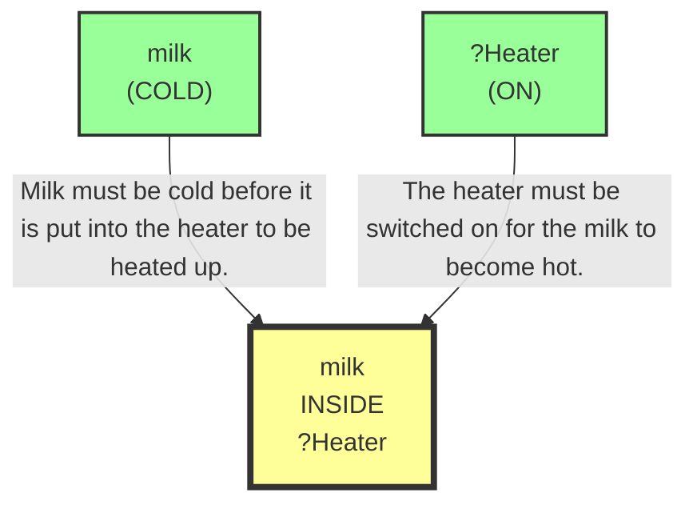
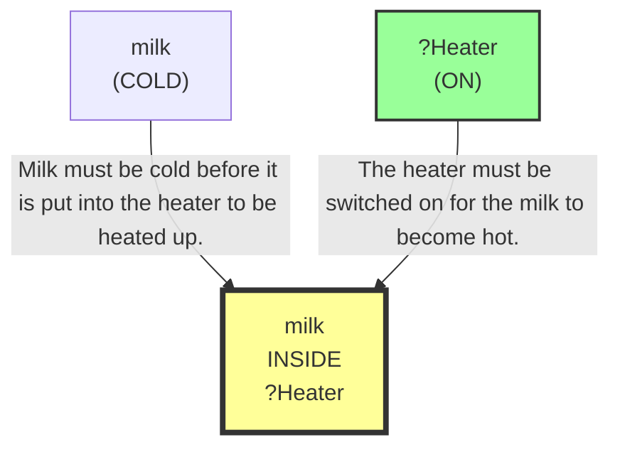
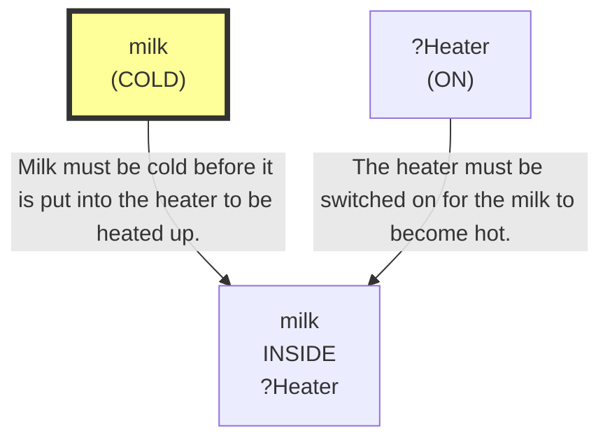
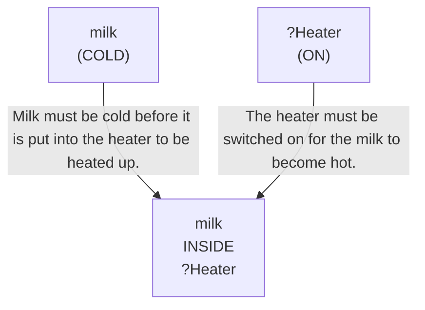

# 🚀 VirtualHome Agent Episode Log


### [GoalReasoner (Module A - Intent)] Output
```json
{
  "is_instruction_obviously_vague": false,
  "clarification_question": null,
  "target_object": "milk",
  "location_hint": null,
  "reasoning_chain": [
    {
      "question": "Why does the user want this object?",
      "answer": "To heat the milk if it is cold."
    },
    {
      "question": "Why is that important?",
      "answer": "Because they want the milk to be at a warmer temperature for use or consumption."
    },
    {
      "question": "What fundamental need does this fulfill?",
      "answer": "It fulfills the need to make a beverage or food item thermally suitable for drinking or preparing with."
    },
    {
      "question": "Are there any deeper psychological or physical motivations?",
      "answer": "The primary motivation is physical comfort or usability, specifically achieving a desired warm state rather than consuming it cold."
    }
  ],
  "deep_intent": "The user wants a cold liquid to be warmed to a usable or comfortable temperature.",
  "acceptable_alternatives_properties": [
    {
      "priority": 1,
      "description": "Other drinkable liquids that can be safely warmed, such as water, coffee, or tea."
    },
    {
      "priority": 2,
      "description": "Other dairy or beverage items commonly heated for consumption, such as hot chocolate or broth."
    },
    {
      "priority": 3,
      "description": "Any cold beverage that the user wants made warm, if compatible with microwave heating."
    },
    {
      "priority": 4,
      "description": "Warm prepared drinks that already satisfy the same need without requiring heating."
    }
  ]
}
```

### [PerceptionFilter] Output
```json
{
  "reasoning": "The goal is to heat milk, so the target object milk must be kept. The SDG requires a heater that can be turned on, so I keep all plausible heating appliances available as functional alternatives: microwave, stove, and coffeemaker. I also keep the sink as a relevant appliance in case the liquid needs handling or temperature adjustment support, though it is not the primary heater.",
  "selected_classes": [
    "character",
    "milk",
    "stove",
    "microwave",
    "coffeemaker",
    "sink"
  ],
  "raw_class_count": 50
}
```

### [LLMExecutor] Output
```json
{
  "reasoning": "The SDG requires a cold milk object and then that milk inside a heater that is switched on. In the current graph, milk(176) is explicitly COLD and appears to be the best match for N1. The heater should be a valid heating appliance; among available objects, microwave(171) is the most appropriate heater and has HAS_SWITCH. Before we can place milk inside it, we need to be near the microwave first. No prior walk has occurred, so the next atomic step is to approach the microwave.",
  "satisfied_nodes": [
    "N1"
  ],
  "current_node_focus": "N2",
  "mapped_variables": {
    "?Heater": "microwave(171)"
  },
  "action": "[walk] <microwave> (171)"
}
```

### [RoboStateMultiTaskController] Output
```json
{
  "action": "[walk] <microwave> (171)",
  "active_task_id": "task_1",
  "task_context": {
    "active_task_id": "task_1",
    "pending_task_ids": [],
    "satisfied_task_ids": []
  },
  "source": "llm_executor"
}
```
## Step 0
- **Action**: `[walk] <microwave> (171)`
- **Action Success**: `True`
- **Action Message**: {'0': {'message': 'Success'}}
- **Active Task**: `task_1`
- **Decision Source**: `llm_executor`
- **Task Progress**: T3_without_memory_M1_05=pending
- **SDG Status**:

- **Observed Items (12)**: sink(155), stove(163) [OFF,CLOSED], coffeemaker(169) [OFF], microwave(171) [CLOSED,OFF], milk(177) [CLOSED], milk(176) [COLD,CLOSED], character(1), kitchen(11), livingroom(183), bedroom(241), bathroom(285), bedroom(346)


### [PerceptionFilter] Output
```json
{
  "reasoning": "Reused cached class selection.",
  "selected_classes": [
    "character",
    "milk",
    "stove",
    "microwave",
    "coffeemaker",
    "sink"
  ],
  "raw_class_count": 50
}
```

### [LLMExecutor] Output
```json
{
  "reasoning": "The SDG requires a COLD milk object to be placed INSIDE a heater, and the heater must be ON. In the current graph, milk(176) is explicitly COLD, while milk(177) is only close and not cold, so milk(176) is the correct binding for the milk node. The most suitable heater is microwave(171) because it has HAS_SWITCH and is a valid heater. Since I am already close to the microwave, the next step is to turn it on to satisfy the heater-on prerequisite before putting the milk inside.",
  "satisfied_nodes": [
    "N1"
  ],
  "current_node_focus": "N3",
  "mapped_variables": {
    "?Heater": "microwave(171)"
  },
  "action": "[switchon] <microwave> (171)"
}
```

### [RoboStateMultiTaskController] Output
```json
{
  "action": "[switchon] <microwave> (171)",
  "active_task_id": "task_1",
  "task_context": {
    "active_task_id": "task_1",
    "pending_task_ids": [],
    "satisfied_task_ids": []
  },
  "source": "llm_executor"
}
```
## Step 1
- **Action**: `[switchon] <microwave> (171)`
- **Action Success**: `True`
- **Action Message**: Faked switch operation in Python layer (bypassed Unity failure)
- **Active Task**: `task_1`
- **Decision Source**: `llm_executor`
- **Task Progress**: T3_without_memory_M1_05=pending
- **SDG Status**:

- **Observed Items (12)**: sink(155), stove(163) [OFF,CLOSED], coffeemaker(169) [OFF], microwave(171) [CLOSED,OFF], milk(177) [CLOSED], milk(176) [COLD,CLOSED], character(1), kitchen(11), livingroom(183), bedroom(241), bathroom(285), bedroom(346)


### [PerceptionFilter] Output
```json
{
  "reasoning": "Reused cached class selection.",
  "selected_classes": [
    "character",
    "milk",
    "stove",
    "microwave",
    "coffeemaker",
    "sink"
  ],
  "raw_class_count": 50
}
```

### [LLMExecutor] Output
```json
{
  "reasoning": "The SDG requires the milk to be COLD and then INSIDE a heater that is ON. In the current graph, milk(176) is the only milk explicitly marked COLD, and microwave(171) is already ON and close to the character. To progress toward N2, I should first ensure I am at the milk itself before grabbing it. Since the milk is close and not yet held, the next atomic step is to walk to milk(176).",
  "satisfied_nodes": [
    "N1",
    "N3"
  ],
  "current_node_focus": "N2",
  "mapped_variables": {
    "?Heater": "microwave(171)"
  },
  "action": "[walk] <milk> (176)"
}
```

### [RoboStateMultiTaskController] Output
```json
{
  "action": "[walk] <milk> (176)",
  "active_task_id": "task_1",
  "task_context": {
    "active_task_id": "task_1",
    "pending_task_ids": [],
    "satisfied_task_ids": []
  },
  "source": "llm_executor"
}
```
## Step 2
- **Action**: `[walk] <milk> (176)`
- **Action Success**: `True`
- **Action Message**: {'0': {'message': 'Success'}}
- **Active Task**: `task_1`
- **Decision Source**: `llm_executor`
- **Task Progress**: T3_without_memory_M1_05=pending
- **SDG Status**:

- **Observed Items (12)**: sink(155), stove(163) [OFF,CLOSED], coffeemaker(169) [OFF], microwave(171) [ON,CLOSED], milk(177) [CLOSED], milk(176) [COLD,CLOSED], character(1), kitchen(11), livingroom(183), bedroom(241), bathroom(285), bedroom(346)


### [PerceptionFilter] Output
```json
{
  "reasoning": "Reused cached class selection.",
  "selected_classes": [
    "character",
    "milk",
    "stove",
    "microwave",
    "coffeemaker",
    "sink"
  ],
  "raw_class_count": 50
}
```

### [LLMExecutor] Output
```json
{
  "reasoning": "The goal is to warm the cold milk by putting it inside a heater that is on. The graph contains two milk instances, but only milk(176) is explicitly COLD, so it is the correct target. To satisfy the INSIDE relation, I need to be near the destination heater before any putin action. The microwave(171) is already ON and functions as a heater, so the next step is to walk to it.",
  "satisfied_nodes": [
    "N3"
  ],
  "current_node_focus": "N2",
  "mapped_variables": {
    "?Heater": "microwave(171)"
  },
  "action": "[walk] <microwave> (171)"
}
```

### [RoboStateMultiTaskController] Output
```json
{
  "action": "[walk] <microwave> (171)",
  "active_task_id": "task_1",
  "task_context": {
    "active_task_id": "task_1",
    "pending_task_ids": [],
    "satisfied_task_ids": []
  },
  "source": "llm_executor"
}
```
## Step 3
- **Action**: `[walk] <microwave> (171)`
- **Action Success**: `True`
- **Action Message**: {'0': {'message': 'Success'}}
- **Active Task**: `task_1`
- **Decision Source**: `llm_executor`
- **Task Progress**: T3_without_memory_M1_05=pending
- **SDG Status**:

- **Observed Items (12)**: sink(155), stove(163) [OFF,CLOSED], coffeemaker(169) [OFF], microwave(171) [ON,CLOSED], milk(177) [CLOSED], milk(176) [COLD,CLOSED], character(1), kitchen(11), livingroom(183), bedroom(241), bathroom(285), bedroom(346)


### [PerceptionFilter] Output
```json
{
  "reasoning": "Reused cached class selection.",
  "selected_classes": [
    "character",
    "milk",
    "stove",
    "microwave",
    "coffeemaker",
    "sink"
  ],
  "raw_class_count": 50
}
```

### [LLMExecutor] Output
```json
{
  "reasoning": "The SDG requires the milk to be COLD, then INSIDE a heater, and the heater ON. Among the available milk instances, milk(176) already has the required COLD state, while milk(177) does not. The microwave(171) is the best heater candidate because it is a heater-like appliance, is CLOSE to the character, and is already ON. To progress toward putting the cold milk inside the heater, I must first move to the milk before I can grab it.",
  "satisfied_nodes": [
    "N1",
    "N3"
  ],
  "current_node_focus": "N2",
  "mapped_variables": {
    "?Heater": "microwave(171)"
  },
  "action": "[walk] <milk> (176)"
}
```

### [RoboStateMultiTaskController] Output
```json
{
  "action": "[walk] <milk> (176)",
  "active_task_id": "task_1",
  "task_context": {
    "active_task_id": "task_1",
    "pending_task_ids": [],
    "satisfied_task_ids": []
  },
  "source": "llm_executor"
}
```
## Step 4
- **Action**: `[walk] <milk> (176)`
- **Action Success**: `True`
- **Action Message**: {'0': {'message': 'Success'}}
- **Active Task**: `task_1`
- **Decision Source**: `llm_executor`
- **Task Progress**: T3_without_memory_M1_05=pending
- **SDG Status**:

- **Observed Items (12)**: sink(155), stove(163) [OFF,CLOSED], coffeemaker(169) [OFF], microwave(171) [ON,CLOSED], milk(177) [CLOSED], milk(176) [COLD,CLOSED], character(1), kitchen(11), livingroom(183), bedroom(241), bathroom(285), bedroom(346)


### [PerceptionFilter] Output
```json
{
  "reasoning": "Reused cached class selection.",
  "selected_classes": [
    "character",
    "milk",
    "stove",
    "microwave",
    "coffeemaker",
    "sink"
  ],
  "raw_class_count": 50
}
```

### [LLMExecutor] Output
```json
{
  "reasoning": "The goal requires a milk object that is COLD, inside a heater, and the heater ON. In the current graph, milk(176) is explicitly COLD and near the character, and microwave(171) is ON but not open. Since the milk must be inside the heater and we must be near the destination before putting it in, the next step is to move to the microwave. I choose microwave(171) as the heater because it satisfies the ON requirement already and is a valid heater/container for warming milk.",
  "satisfied_nodes": [
    "N1",
    "N3"
  ],
  "current_node_focus": "N2",
  "mapped_variables": {
    "?Heater": "microwave(171)"
  },
  "action": "[walk] <microwave> (171)"
}
```

### [RoboStateMultiTaskController] Output
```json
{
  "action": "[walk] <microwave> (171)",
  "active_task_id": "task_1",
  "task_context": {
    "active_task_id": "task_1",
    "pending_task_ids": [],
    "satisfied_task_ids": []
  },
  "source": "llm_executor"
}
```
## Step 5
- **Action**: `[walk] <microwave> (171)`
- **Action Success**: `True`
- **Action Message**: {'0': {'message': 'Success'}}
- **Active Task**: `task_1`
- **Decision Source**: `llm_executor`
- **Task Progress**: T3_without_memory_M1_05=pending
- **SDG Status**:

- **Observed Items (12)**: sink(155), stove(163) [OFF,CLOSED], coffeemaker(169) [OFF], microwave(171) [ON,CLOSED], milk(177) [CLOSED], milk(176) [COLD,CLOSED], character(1), kitchen(11), livingroom(183), bedroom(241), bathroom(285), bedroom(346)


### [PerceptionFilter] Output
```json
{
  "reasoning": "Reused cached class selection.",
  "selected_classes": [
    "character",
    "milk",
    "stove",
    "microwave",
    "coffeemaker",
    "sink"
  ],
  "raw_class_count": 50
}
```

### [LLMExecutor] Output
```json
{
  "reasoning": "The SDG requires a milk object that is COLD and then inside a heater that is ON. There are two milk instances: milk(177) is only CLOSED and does not show COLD, while milk(176) is explicitly COLD and CLOSED, so milk(176) best matches N1. The microwave(171) is already ON and CLOSED, and it is the most plausible heater in the graph. I am already close to the microwave and milk, but to satisfy the proximity rule before interacting with the heater/container destination, the next step should be to walk to the microwave so I can then open/use it and place the milk inside on subsequent actions.",
  "satisfied_nodes": [
    "N1",
    "N3"
  ],
  "current_node_focus": "N2",
  "mapped_variables": {
    "?Heater": "microwave(171)"
  },
  "action": "[walk] <microwave> (171)"
}
```

### [RoboStateMultiTaskController] Output
```json
{
  "action": "[walk] <microwave> (171)",
  "active_task_id": "task_1",
  "task_context": {
    "active_task_id": "task_1",
    "pending_task_ids": [],
    "satisfied_task_ids": []
  },
  "source": "llm_executor"
}
```
## Step 6
- **Action**: `[walk] <microwave> (171)`
- **Action Success**: `True`
- **Action Message**: {'0': {'message': 'Success'}}
- **Active Task**: `task_1`
- **Decision Source**: `llm_executor`
- **Task Progress**: T3_without_memory_M1_05=pending
- **SDG Status**:

- **Observed Items (12)**: sink(155), stove(163) [OFF,CLOSED], coffeemaker(169) [OFF], microwave(171) [ON,CLOSED], milk(177) [CLOSED], milk(176) [COLD,CLOSED], character(1), kitchen(11), livingroom(183), bedroom(241), bathroom(285), bedroom(346)


### [PerceptionFilter] Output
```json
{
  "reasoning": "Reused cached class selection.",
  "selected_classes": [
    "character",
    "milk",
    "stove",
    "microwave",
    "coffeemaker",
    "sink"
  ],
  "raw_class_count": 50
}
```

### [LLMExecutor] Output
```json
{
  "reasoning": "The SDG requires the milk to be COLD, then INSIDE a heater, with the heater ON. The current graph shows two milk instances: milk(176) is explicitly COLD and CLOSED, so it best matches N1. The microwave(171) is already ON and CLOSE to the character, so it is the best candidate for ?Heater. To satisfy the INSIDE relation, I must first get the milk object and then put it into the microwave; however, the next atomic step should be to walk to the milk object before grabbing it, since I cannot grab across the room and must approach the specific milk instance first.",
  "satisfied_nodes": [],
  "current_node_focus": "N1",
  "mapped_variables": {
    "?Heater": "microwave(171)"
  },
  "action": "[walk] <milk> (176)"
}
```

### [RoboStateMultiTaskController] Output
```json
{
  "action": "[walk] <milk> (176)",
  "active_task_id": "task_1",
  "task_context": {
    "active_task_id": "task_1",
    "pending_task_ids": [],
    "satisfied_task_ids": []
  },
  "source": "llm_executor"
}
```
## Step 7
- **Action**: `[walk] <milk> (176)`
- **Action Success**: `True`
- **Action Message**: {'0': {'message': 'Success'}}
- **Active Task**: `task_1`
- **Decision Source**: `llm_executor`
- **Task Progress**: T3_without_memory_M1_05=pending
- **SDG Status**:

- **Observed Items (12)**: sink(155), stove(163) [OFF,CLOSED], coffeemaker(169) [OFF], microwave(171) [ON,CLOSED], milk(177) [CLOSED], milk(176) [COLD,CLOSED], character(1), kitchen(11), livingroom(183), bedroom(241), bathroom(285), bedroom(346)


### [PerceptionFilter] Output
```json
{
  "reasoning": "Reused cached class selection.",
  "selected_classes": [
    "character",
    "milk",
    "stove",
    "microwave",
    "coffeemaker",
    "sink"
  ],
  "raw_class_count": 50
}
```

### [LLMExecutor] Output
```json
{
  "reasoning": "The SDG requires a cold milk object and a heater that is ON with the milk INSIDE it. Two milk instances exist; milk(176) is explicitly COLD and is the best binding for N1. The microwave(171) is already ON and is a valid heater, and unlike the stove it is a container that can hold milk. I still need to ensure I can place the milk into it, which requires being near the destination first. Since no prior walk has been done, the next step is to walk to the microwave so I can later open it and insert the milk.",
  "satisfied_nodes": [
    "N1",
    "N3"
  ],
  "current_node_focus": "N2",
  "mapped_variables": {
    "?Heater": "microwave(171)"
  },
  "action": "[walk] <microwave> (171)"
}
```

### [RoboStateMultiTaskController] Output
```json
{
  "action": "[walk] <microwave> (171)",
  "active_task_id": "task_1",
  "task_context": {
    "active_task_id": "task_1",
    "pending_task_ids": [],
    "satisfied_task_ids": []
  },
  "source": "llm_executor"
}
```
## Step 8
- **Action**: `[walk] <microwave> (171)`
- **Action Success**: `True`
- **Action Message**: {'0': {'message': 'Success'}}
- **Active Task**: `task_1`
- **Decision Source**: `llm_executor`
- **Task Progress**: T3_without_memory_M1_05=pending
- **SDG Status**:

- **Observed Items (12)**: sink(155), stove(163) [OFF,CLOSED], coffeemaker(169) [OFF], microwave(171) [ON,CLOSED], milk(177) [CLOSED], milk(176) [COLD,CLOSED], character(1), kitchen(11), livingroom(183), bedroom(241), bathroom(285), bedroom(346)


### [PerceptionFilter] Output
```json
{
  "reasoning": "Reused cached class selection.",
  "selected_classes": [
    "character",
    "milk",
    "stove",
    "microwave",
    "coffeemaker",
    "sink"
  ],
  "raw_class_count": 50
}
```

### [LLMExecutor] Output
```json
{
  "reasoning": "The SDG requires a milk instance that is COLD and then INSIDE a heater that is ON. In the current graph, milk(176) is explicitly COLD and both milk(176) and microwave(171) are close to the character. The microwave is already ON, so the remaining first step toward satisfying the INSIDE relation is to interact with the milk directly. Since the milk is not yet held, the correct next atomic action is to grab the cold milk instance before moving it into the heater.",
  "satisfied_nodes": [
    "N1",
    "N3"
  ],
  "current_node_focus": "N2",
  "mapped_variables": {
    "?Heater": "microwave(171)"
  },
  "action": "[grab] <milk> (176)"
}
```

### [RoboStateMultiTaskController] Output
```json
{
  "action": "[walk] <milk> (176)",
  "active_task_id": "task_1",
  "task_context": {
    "active_task_id": "task_1",
    "pending_task_ids": [],
    "satisfied_task_ids": []
  },
  "source": "llm_executor_repaired"
}
```
## Step 9
- **Action**: `[walk] <milk> (176)`
- **Action Success**: `True`
- **Action Message**: {'0': {'message': 'Success'}}
- **Active Task**: `task_1`
- **Decision Source**: `llm_executor_repaired`
- **Task Progress**: T3_without_memory_M1_05=pending
- **SDG Status**:

- **Observed Items (12)**: sink(155), stove(163) [OFF,CLOSED], coffeemaker(169) [OFF], microwave(171) [ON,CLOSED], milk(177) [CLOSED], milk(176) [COLD,CLOSED], character(1), kitchen(11), livingroom(183), bedroom(241), bathroom(285), bedroom(346)


### [PerceptionFilter] Output
```json
{
  "reasoning": "Reused cached class selection.",
  "selected_classes": [
    "character",
    "milk",
    "stove",
    "microwave",
    "coffeemaker",
    "sink"
  ],
  "raw_class_count": 50
}
```

### [LLMExecutor] Output
```json
{
  "reasoning": "The SDG requires a cold milk object to be inside a heater, and that heater must be on. The current graph shows milk(176) is the best bind for the target milk because it is explicitly COLD. The microwave(171) is the best heater bind because it is a heater-like appliance already ON and CLOSED, so it satisfies the heater-on requirement. To put milk inside it, I must first be near the microwave before any putin action. No prior action has been taken yet, so the correct next step is to walk to the microwave.",
  "satisfied_nodes": [
    "N1",
    "N3"
  ],
  "current_node_focus": "N2",
  "mapped_variables": {
    "?Heater": "microwave(171)"
  },
  "action": "[walk] <microwave> (171)"
}
```

### [RoboStateMultiTaskController] Output
```json
{
  "action": "[walk] <livingroom> (183)",
  "active_task_id": null,
  "task_context": {
    "active_task_id": null,
    "pending_task_ids": [
      "task_1"
    ],
    "satisfied_task_ids": []
  },
  "source": "loop_recovery_room_revisit"
}
```
## Step 10
- **Action**: `[walk] <livingroom> (183)`
- **Action Success**: `True`
- **Action Message**: {'0': {'message': 'Success'}}
- **Decision Source**: `loop_recovery_room_revisit`
- **Task Progress**: T3_without_memory_M1_05=pending
- **SDG Status**:
No SDG active.
- **Observed Items (159)**: wall(12), wall(13), wall(14), wall(15), wall(16), wall(17), wall(18), wall(19), wall(20), wall(21), floor(22), floor(23), floor(24), floor(25), floor(26)...


### [RoboStateMultiTaskController] Output
```json
{
  "action": "[walk] <bedroom> (241)",
  "active_task_id": "task_1",
  "task_context": {
    "active_task_id": "task_1",
    "pending_task_ids": [],
    "satisfied_task_ids": []
  },
  "source": "room_frontier"
}
```
## Step 11
- **Action**: `[walk] <bedroom> (241)`
- **Action Success**: `True`
- **Action Message**: {'0': {'message': 'Success'}}
- **Active Task**: `task_1`
- **Decision Source**: `room_frontier`
- **Task Progress**: T3_without_memory_M1_05=pending
- **SDG Status**:

- **Observed Items (58)**: floor(184), floor(185), floor(186), floor(187), floor(188), floor(189), wall(190), wall(191), wall(192), wall(193), wall(194), wall(195), ceiling(196), ceiling(197), ceiling(198)...


### [RoboStateMultiTaskController] Output
```json
{
  "action": "[walk] <bathroom> (285)",
  "active_task_id": "task_1",
  "task_context": {
    "active_task_id": "task_1",
    "pending_task_ids": [],
    "satisfied_task_ids": []
  },
  "source": "room_frontier"
}
```
## Step 12
- **Action**: `[walk] <bathroom> (285)`
- **Action Success**: `True`
- **Action Message**: {'0': {'message': 'Success'}}
- **Active Task**: `task_1`
- **Decision Source**: `room_frontier`
- **Task Progress**: T3_without_memory_M1_05=pending
- **SDG Status**:

- **Observed Items (38)**: floor(242), floor(243), floor(244), floor(245), ceiling(246), ceiling(247), ceiling(248), ceiling(249), wall(250), wall(251), wall(252), wall(253), door(254) [OPEN], ceilinglamp(255), tablelamp(256) [ON]...


### [RoboStateMultiTaskController] Output
```json
{
  "action": "[walk] <bedroom> (346)",
  "active_task_id": "task_1",
  "task_context": {
    "active_task_id": "task_1",
    "pending_task_ids": [],
    "satisfied_task_ids": []
  },
  "source": "room_frontier"
}
```
## Step 13
- **Action**: `[walk] <bedroom> (346)`
- **Action Success**: `True`
- **Action Message**: {'0': {'message': 'Success'}}
- **Active Task**: `task_1`
- **Decision Source**: `room_frontier`
- **Task Progress**: T3_without_memory_M1_05=pending
- **SDG Status**:

- **Observed Items (66)**: wall(286), wall(287), wall(288), wall(289), wall(290), wall(291), floor(292), floor(293), floor(294), floor(295), floor(296), floor(297), ceiling(298), ceiling(299), ceiling(300)...


### [RoboStateMultiTaskController] Output
```json
{
  "action": "[walk] <kitchen> (11)",
  "active_task_id": null,
  "task_context": {
    "active_task_id": null,
    "pending_task_ids": [
      "task_1"
    ],
    "satisfied_task_ids": []
  },
  "source": "loop_recovery_room_revisit"
}
```
## Step 14
- **Action**: `[walk] <kitchen> (11)`
- **Action Success**: `True`
- **Action Message**: {'0': {'message': 'Success'}}
- **Decision Source**: `loop_recovery_room_revisit`
- **Task Progress**: T3_without_memory_M1_05=pending
- **SDG Status**:
No SDG active.
- **Observed Items (64)**: floor(347), floor(348), floor(349), floor(350), floor(351), floor(352), floor(353), floor(354), floor(355), wall(356), wall(357), wall(358), wall(359), wall(360), wall(361)...


### [PerceptionFilter] Output
```json
{
  "reasoning": "Reused cached class selection.",
  "selected_classes": [
    "character",
    "milk",
    "stove",
    "microwave",
    "coffeemaker",
    "sink"
  ],
  "raw_class_count": 50
}
```

### [LLMExecutor] Output
```json
{
  "reasoning": "The SDG requires the milk to be COLD, inside a heater, and the heater ON. In the current graph, milk(176) is explicitly COLD and CLOSED, and microwave(171) is already ON and CLOSED. The only remaining gap is to satisfy the INSIDE relation by placing the milk into the heater. Since putin requires being near the destination and the microwave is the most appropriate heater with ON already satisfied, the next atomic step is to walk to the microwave before attempting to open it or insert the milk.",
  "satisfied_nodes": [
    "N1",
    "N3"
  ],
  "current_node_focus": "N2",
  "mapped_variables": {
    "?Heater": "microwave(171)"
  },
  "action": "[walk] <microwave> (171)"
}
```

### [RoboStateMultiTaskController] Output
```json
{
  "action": "[walk] <microwave> (171)",
  "active_task_id": "task_1",
  "task_context": {
    "active_task_id": "task_1",
    "pending_task_ids": [],
    "satisfied_task_ids": []
  },
  "source": "llm_executor"
}
```
## Step 15
- **Action**: `[walk] <microwave> (171)`
- **Action Success**: `True`
- **Action Message**: {'0': {'message': 'Success'}}
- **Active Task**: `task_1`
- **Decision Source**: `llm_executor`
- **Task Progress**: T3_without_memory_M1_05=pending
- **SDG Status**:

- **Observed Items (12)**: sink(155), stove(163) [OFF,CLOSED], coffeemaker(169) [OFF], microwave(171) [ON,CLOSED], milk(177) [CLOSED], milk(176) [COLD,CLOSED], character(1), kitchen(11), livingroom(183), bedroom(241), bathroom(285), bedroom(346)


### [PerceptionFilter] Output
```json
{
  "reasoning": "Reused cached class selection.",
  "selected_classes": [
    "character",
    "milk",
    "stove",
    "microwave",
    "coffeemaker",
    "sink"
  ],
  "raw_class_count": 50
}
```

### [LLMExecutor] Output
```json
{
  "reasoning": "The SDG requires milk to be cold and then inside a heater, with the heater on. There are two milk instances, and only milk(176) is explicitly COLD, so it best matches N1. The microwave(171) is already ON and CLOSE to the character, so the remaining gap is to move the cold milk into the microwave. Because I must be near the destination before putting something inside it, the next atomic step is to walk to the microwave. This also prepares for the required sequence before putting the milk inside.",
  "satisfied_nodes": [
    "N1",
    "N3"
  ],
  "current_node_focus": "N2",
  "mapped_variables": {
    "?Heater": "microwave(171)"
  },
  "action": "[walk] <microwave> (171)"
}
```

### [RoboStateMultiTaskController] Output
```json
{
  "action": "[walk] <microwave> (171)",
  "active_task_id": "task_1",
  "task_context": {
    "active_task_id": "task_1",
    "pending_task_ids": [],
    "satisfied_task_ids": []
  },
  "source": "llm_executor"
}
```
## Step 16
- **Action**: `[walk] <microwave> (171)`
- **Action Success**: `True`
- **Action Message**: {'0': {'message': 'Success'}}
- **Active Task**: `task_1`
- **Decision Source**: `llm_executor`
- **Task Progress**: T3_without_memory_M1_05=pending
- **SDG Status**:

- **Observed Items (12)**: sink(155), stove(163) [OFF,CLOSED], coffeemaker(169) [OFF], microwave(171) [ON,CLOSED], milk(177) [CLOSED], milk(176) [COLD,CLOSED], character(1), kitchen(11), livingroom(183), bedroom(241), bathroom(285), bedroom(346)


### [PerceptionFilter] Output
```json
{
  "reasoning": "Reused cached class selection.",
  "selected_classes": [
    "character",
    "milk",
    "stove",
    "microwave",
    "coffeemaker",
    "sink"
  ],
  "raw_class_count": 50
}
```

### [LLMExecutor] Output
```json
{
  "reasoning": "The SDG requires a cold milk object to be placed inside a heater that is ON. In the current graph, milk(176) is the only milk explicitly marked COLD, and microwave(171) is already ON and CLOSE to the character. To satisfy the containment prerequisite, I should first get near the milk before grabbing it. Since no previous walk was performed, the next atomic step is to walk to milk(176).",
  "satisfied_nodes": [
    "N1",
    "N3"
  ],
  "current_node_focus": "N2",
  "mapped_variables": {
    "?Heater": "microwave(171)"
  },
  "action": "[walk] <milk> (176)"
}
```

### [RoboStateMultiTaskController] Output
```json
{
  "action": "[walk] <milk> (176)",
  "active_task_id": "task_1",
  "task_context": {
    "active_task_id": "task_1",
    "pending_task_ids": [],
    "satisfied_task_ids": []
  },
  "source": "llm_executor"
}
```
## Step 17
- **Action**: `[walk] <milk> (176)`
- **Action Success**: `True`
- **Action Message**: {'0': {'message': 'Success'}}
- **Active Task**: `task_1`
- **Decision Source**: `llm_executor`
- **Task Progress**: T3_without_memory_M1_05=pending
- **SDG Status**:

- **Observed Items (12)**: sink(155), stove(163) [OFF,CLOSED], coffeemaker(169) [OFF], microwave(171) [ON,CLOSED], milk(177) [CLOSED], milk(176) [COLD,CLOSED], character(1), kitchen(11), livingroom(183), bedroom(241), bathroom(285), bedroom(346)

