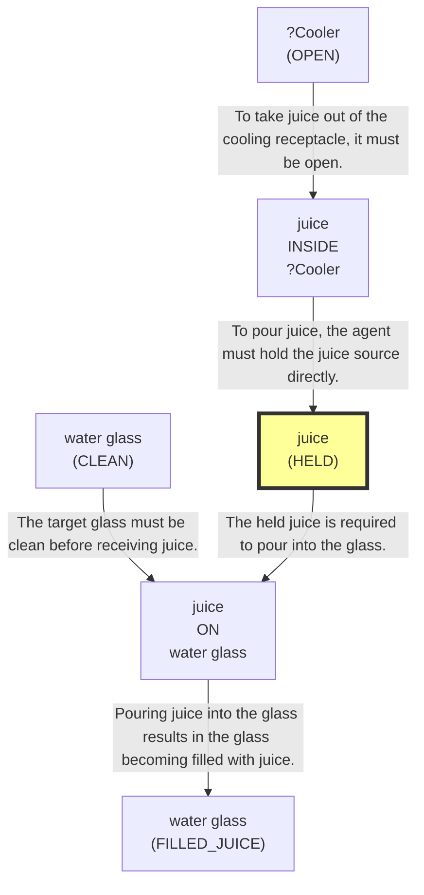
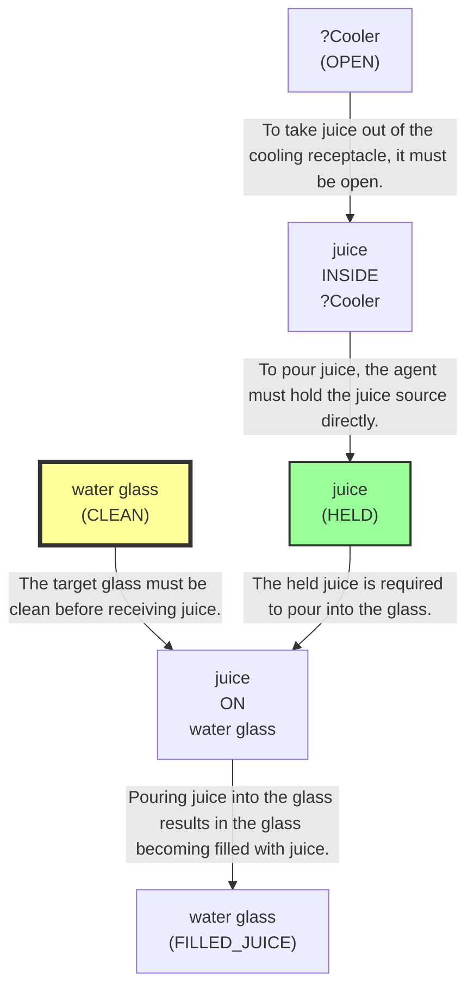
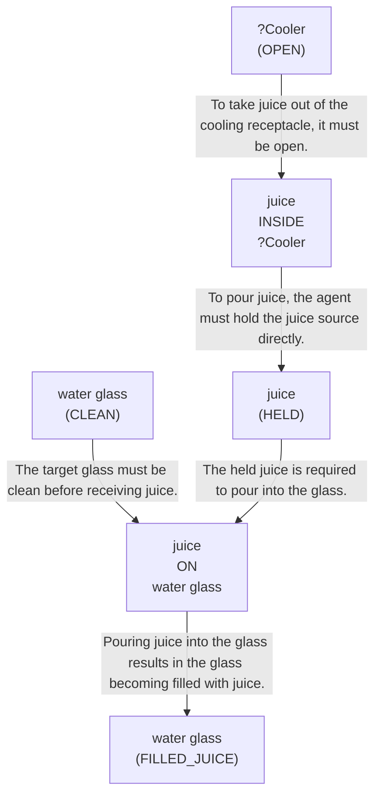
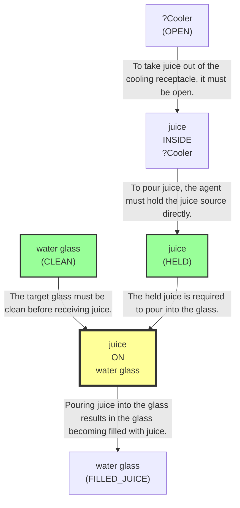

# 🚀 VirtualHome Agent Episode Log


### [GoalReasoner (Module A - Intent)] Output
```json
{
  "is_instruction_obviously_vague": false,
  "clarification_question": null,
  "target_object": "juice",
  "location_hint": "fridge",
  "reasoning_chain": [
    {
      "question": "Why does the user want this object?",
      "answer": "To have some juice available in a glass for drinking."
    },
    {
      "question": "Why is that important?",
      "answer": "It likely serves refreshment or hydration."
    },
    {
      "question": "What fundamental need does this fulfill?",
      "answer": "It fulfills the need to drink a beverage, typically for refreshment and hydration."
    },
    {
      "question": "Are there any deeper psychological or physical motivations?",
      "answer": "The user may want a convenient, ready-to-drink beverage experience rather than leaving it in the container."
    }
  ],
  "deep_intent": "The user wants to obtain and drink a refreshing beverage.",
  "acceptable_alternatives_properties": [
    {
      "priority": 1,
      "description": "Other ready-to-drink beverages stored in the refrigerator, such as water, milk, or another chilled drink"
    },
    {
      "priority": 2,
      "description": "Similar juice or juice-based drinks"
    },
    {
      "priority": 3,
      "description": "Cold packaged beverages that can be poured into a glass"
    },
    {
      "priority": 4,
      "description": "Any hydrating or refreshing drink available indoors, such as a flavored drink or tea"
    }
  ]
}
```

### [PerceptionFilter] Output
```json
{
  "reasoning": "The goal is to obtain juice from the refrigerator and pour it into a clean water glass. The SDG requires the juice source, the cooling receptacle (fridge), and the target glass. Because opening the cooler is required, the fridge must be included as the physical cooler. The water glass is explicitly required and must be clean/filled, so it is retained.",
  "selected_classes": [
    "milk",
    "door",
    "character",
    "juice",
    "fridge",
    "waterglass"
  ],
  "raw_class_count": 50
}
```

### [LLMExecutor] Output
```json
{
  "reasoning": "The SDG requires the juice to be HELD before it can be poured into a clean water glass. In the current graph, juice(174) is already close to the character, so the next step is to grab it. The refrigerator is open already, but the target juice for the goal is the accessible juice(174), not the colder juice(173) inside the fridge. The chosen glass should be a clean one; waterglass(64) is clean and close, but that matters later after holding the juice.",
  "satisfied_nodes": [],
  "current_node_focus": "N1",
  "mapped_variables": {
    "?Cooler": "fridge(162)"
  },
  "action": "[grab] <juice> (174)"
}
```

### [RoboStateMultiTaskController] Output
```json
{
  "action": "[grab] <juice> (174)",
  "active_task_id": "task_1",
  "task_context": {
    "active_task_id": "task_1",
    "pending_task_ids": [],
    "satisfied_task_ids": []
  },
  "source": "llm_executor"
}
```
## Step 0
- **Action**: `[grab] <juice> (174)`
- **Action Success**: `True`
- **Action Message**: {'0': {'message': 'Success'}}
- **Active Task**: `task_1`
- **Decision Source**: `llm_executor`
- **Task Progress**: T3_without_memory_M2_09=pending
- **SDG Status**:

- **Observed Items (20)**: door(47) [OPEN], waterglass(64) [CLEAN], waterglass(71) [DIRTY], waterglass(72) [DIRTY], waterglass(79), waterglass(80), waterglass(87), waterglass(88), waterglass(100), fridge(162) [OPEN], juice(174), milk(177) [CLOSED], character(1), juice(173) [COLD], milk(176) [CLOSED,COLD]...


### [PerceptionFilter] Output
```json
{
  "reasoning": "Reused cached class selection.",
  "selected_classes": [
    "milk",
    "door",
    "character",
    "juice",
    "fridge",
    "waterglass"
  ],
  "raw_class_count": 50
}
```

### [LLMExecutor] Output
```json
{
  "reasoning": "The task requires the juice to be held, then poured into a clean water glass. Current graph shows I already hold juice(174) in the right hand, so N1 is satisfied. There is a clean recipient available: waterglass(64) is CLEAN and CLOSE to the character, so it is the best match for the required water glass. To satisfy the next prerequisite toward pouring, I must first move near the target glass before any putback/pour interaction. The fridge is already open, and the juice source is already held, so the immediate gap is proximity to the clean glass.",
  "satisfied_nodes": [
    "N1"
  ],
  "current_node_focus": "N4",
  "mapped_variables": {
    "?Cooler": "fridge(162)"
  },
  "action": "[walk] <waterglass> (64)"
}
```

### [RoboStateMultiTaskController] Output
```json
{
  "action": "[walk] <waterglass> (64)",
  "active_task_id": "task_1",
  "task_context": {
    "active_task_id": "task_1",
    "pending_task_ids": [],
    "satisfied_task_ids": []
  },
  "source": "llm_executor"
}
```
## Step 1
- **Action**: `[walk] <waterglass> (64)`
- **Action Success**: `True`
- **Action Message**: {'0': {'message': 'Success'}}
- **Active Task**: `task_1`
- **Decision Source**: `llm_executor`
- **Task Progress**: T3_without_memory_M2_09=pending
- **SDG Status**:

- **Observed Items (21)**: door(47) [OPEN], waterglass(64) [CLEAN], waterglass(71) [DIRTY], waterglass(72) [DIRTY], waterglass(79), waterglass(80), waterglass(87), waterglass(88), waterglass(100), fridge(162) [OPEN], milk(177) [CLOSED], character(1), juice(174), juice(173) [COLD], milk(176) [CLOSED,COLD]...


### [PerceptionFilter] Output
```json
{
  "reasoning": "Reused cached class selection.",
  "selected_classes": [
    "milk",
    "door",
    "character",
    "juice",
    "fridge",
    "waterglass"
  ],
  "raw_class_count": 50
}
```

### [LLMExecutor] Output
```json
{
  "reasoning": "The SDG requires the juice to be HELD and then poured into a clean water glass. The current graph already shows juice(174) is CLOSE to the character and being held in the right hand, so N1 is already satisfied. The next unmet prerequisite on the path to pouring is to select a clean recipient glass. waterglass(64) is CLEAN and CLOSE to the character, so it is the best binding for the target glass. To satisfy the proximity rule before grabbing, I should walk to that glass first.",
  "satisfied_nodes": [
    "N1"
  ],
  "current_node_focus": "N4",
  "mapped_variables": {
    "?Cooler": "fridge(162)"
  },
  "action": "[walk] <waterglass> (64)"
}
```

### [RoboStateMultiTaskController] Output
```json
{
  "action": "[walk] <waterglass> (64)",
  "active_task_id": "task_1",
  "task_context": {
    "active_task_id": "task_1",
    "pending_task_ids": [],
    "satisfied_task_ids": []
  },
  "source": "llm_executor"
}
```
## Step 2
- **Action**: `[walk] <waterglass> (64)`
- **Action Success**: `True`
- **Action Message**: {'0': {'message': 'Success'}}
- **Active Task**: `task_1`
- **Decision Source**: `llm_executor`
- **Task Progress**: T3_without_memory_M2_09=pending
- **SDG Status**:

- **Observed Items (21)**: door(47) [OPEN], waterglass(64) [CLEAN], waterglass(71) [DIRTY], waterglass(72) [DIRTY], waterglass(79), waterglass(80), waterglass(87), waterglass(88), waterglass(100), fridge(162) [OPEN], milk(177) [CLOSED], character(1), juice(174), juice(173) [COLD], milk(176) [CLOSED,COLD]...


### [PerceptionFilter] Output
```json
{
  "reasoning": "Reused cached class selection.",
  "selected_classes": [
    "milk",
    "door",
    "character",
    "juice",
    "fridge",
    "waterglass"
  ],
  "raw_class_count": 50
}
```

### [LLMExecutor] Output
```json
{
  "reasoning": "The active task is to get juice and prepare it in a water glass. The current graph already shows juice(174) is held by the character, so N1 is satisfied. To proceed toward pouring, we need a clean water glass; among the visible glasses, waterglass(64) is explicitly CLEAN and close to the character, making it the best binding for the required water glass. The next prerequisite is to move near that glass before grabbing it, since grab requires proximity and we cannot pour until we hold the glass.",
  "satisfied_nodes": [
    "N1"
  ],
  "current_node_focus": "N4",
  "mapped_variables": {
    "?Cooler": "fridge(162)"
  },
  "action": "[walk] <waterglass> (64)"
}
```

### [RoboStateMultiTaskController] Output
```json
{
  "action": "[walk] <livingroom> (183)",
  "active_task_id": null,
  "task_context": {
    "active_task_id": null,
    "pending_task_ids": [
      "task_1"
    ],
    "satisfied_task_ids": []
  },
  "source": "loop_recovery_room_revisit"
}
```
## Step 3
- **Action**: `[walk] <livingroom> (183)`
- **Action Success**: `True`
- **Action Message**: {'0': {'message': 'Success'}}
- **Decision Source**: `loop_recovery_room_revisit`
- **Task Progress**: T3_without_memory_M2_09=pending
- **SDG Status**:
No SDG active.
- **Observed Items (160)**: wall(12), wall(13), wall(14), wall(15), wall(16), wall(17), wall(18), wall(19), wall(20), wall(21), floor(22), floor(23), floor(24), floor(25), floor(26)...


### [RoboStateMultiTaskController] Output
```json
{
  "action": "[walk] <bedroom> (241)",
  "active_task_id": "task_1",
  "task_context": {
    "active_task_id": "task_1",
    "pending_task_ids": [],
    "satisfied_task_ids": []
  },
  "source": "room_frontier"
}
```
## Step 4
- **Action**: `[walk] <bedroom> (241)`
- **Action Success**: `True`
- **Action Message**: {'0': {'message': 'Success'}}
- **Active Task**: `task_1`
- **Decision Source**: `room_frontier`
- **Task Progress**: T3_without_memory_M2_09=pending
- **SDG Status**:

- **Observed Items (60)**: floor(184), floor(185), floor(186), floor(187), floor(188), floor(189), wall(190), wall(191), wall(192), wall(193), wall(194), wall(195), ceiling(196), ceiling(197), ceiling(198)...


### [RoboStateMultiTaskController] Output
```json
{
  "action": "[walk] <bathroom> (285)",
  "active_task_id": "task_1",
  "task_context": {
    "active_task_id": "task_1",
    "pending_task_ids": [],
    "satisfied_task_ids": []
  },
  "source": "room_frontier"
}
```
## Step 5
- **Action**: `[walk] <bathroom> (285)`
- **Action Success**: `True`
- **Action Message**: {'0': {'message': 'Success'}}
- **Active Task**: `task_1`
- **Decision Source**: `room_frontier`
- **Task Progress**: T3_without_memory_M2_09=pending
- **SDG Status**:

- **Observed Items (40)**: floor(242), floor(243), floor(244), floor(245), ceiling(246), ceiling(247), ceiling(248), ceiling(249), wall(250), wall(251), wall(252), wall(253), door(254) [OPEN], ceilinglamp(255), tablelamp(256) [ON]...


### [RoboStateMultiTaskController] Output
```json
{
  "action": "[walk] <bedroom> (346)",
  "active_task_id": "task_1",
  "task_context": {
    "active_task_id": "task_1",
    "pending_task_ids": [],
    "satisfied_task_ids": []
  },
  "source": "room_frontier"
}
```
## Step 6
- **Action**: `[walk] <bedroom> (346)`
- **Action Success**: `True`
- **Action Message**: {'0': {'message': 'Success'}}
- **Active Task**: `task_1`
- **Decision Source**: `room_frontier`
- **Task Progress**: T3_without_memory_M2_09=pending
- **SDG Status**:

- **Observed Items (68)**: wall(286), wall(287), wall(288), wall(289), wall(290), wall(291), floor(292), floor(293), floor(294), floor(295), floor(296), floor(297), ceiling(298), ceiling(299), ceiling(300)...


### [RoboStateMultiTaskController] Output
```json
{
  "action": "[walk] <kitchen> (11)",
  "active_task_id": null,
  "task_context": {
    "active_task_id": null,
    "pending_task_ids": [
      "task_1"
    ],
    "satisfied_task_ids": []
  },
  "source": "loop_recovery_room_revisit"
}
```
## Step 7
- **Action**: `[walk] <kitchen> (11)`
- **Action Success**: `True`
- **Action Message**: {'0': {'message': 'Success'}}
- **Decision Source**: `loop_recovery_room_revisit`
- **Task Progress**: T3_without_memory_M2_09=pending
- **SDG Status**:
No SDG active.
- **Observed Items (66)**: floor(347), floor(348), floor(349), floor(350), floor(351), floor(352), floor(353), floor(354), floor(355), wall(356), wall(357), wall(358), wall(359), wall(360), wall(361)...


### [PerceptionFilter] Output
```json
{
  "reasoning": "Reused cached class selection.",
  "selected_classes": [
    "milk",
    "door",
    "character",
    "juice",
    "fridge",
    "waterglass"
  ],
  "raw_class_count": 50
}
```

### [LLMExecutor] Output
```json
{
  "reasoning": "The SDG requires the juice to be held first, then poured into a clean water glass. The current graph shows juice(174) is already held in the right hand, so N1 is satisfied. A clean water glass is available and close to the character: waterglass(64) is CLEAN and CLOSE. To satisfy the next prerequisite for pouring, I should move to the target glass before pouring. I am not repeating a prior walk; this is the first step toward the pour target.",
  "satisfied_nodes": [
    "N1"
  ],
  "current_node_focus": "N4",
  "mapped_variables": {
    "?Cooler": "fridge(162)"
  },
  "action": "[walk] <waterglass> (64)"
}
```

### [RoboStateMultiTaskController] Output
```json
{
  "action": "[walk] <waterglass> (64)",
  "active_task_id": "task_1",
  "task_context": {
    "active_task_id": "task_1",
    "pending_task_ids": [],
    "satisfied_task_ids": []
  },
  "source": "llm_executor"
}
```
## Step 8
- **Action**: `[walk] <waterglass> (64)`
- **Action Success**: `True`
- **Action Message**: {'0': {'message': 'Success'}}
- **Active Task**: `task_1`
- **Decision Source**: `llm_executor`
- **Task Progress**: T3_without_memory_M2_09=pending
- **SDG Status**:

- **Observed Items (21)**: door(47) [OPEN], waterglass(64) [CLEAN], waterglass(71) [DIRTY], waterglass(72) [DIRTY], waterglass(79), waterglass(80), waterglass(87), waterglass(88), waterglass(100), fridge(162) [OPEN], milk(177) [CLOSED], character(1), juice(174), juice(173) [COLD], milk(176) [CLOSED,COLD]...


### [PerceptionFilter] Output
```json
{
  "reasoning": "Reused cached class selection.",
  "selected_classes": [
    "milk",
    "door",
    "character",
    "juice",
    "fridge",
    "waterglass"
  ],
  "raw_class_count": 50
}
```

### [LLMExecutor] Output
```json
{
  "reasoning": "The SDG requires the juice to be HELD before it can be poured into a clean water glass. The current graph shows juice(174) is already CLOSE to the character and currently held in the right hand, while a clean waterglass(64) is also close and available. Since N1 is already satisfied and the next needed progress toward N5/N6 is to pour the held juice into the clean glass, the immediate prerequisite is to be near the target glass. We should walk to the clean water glass instance that is already close and clean, waterglass(64), to prepare for the subsequent pour.",
  "satisfied_nodes": [
    "N1",
    "N4"
  ],
  "current_node_focus": "N5",
  "mapped_variables": {
    "?Cooler": "fridge(162)"
  },
  "action": "[walk] <waterglass> (64)"
}
```

### [RoboStateMultiTaskController] Output
```json
{
  "action": "[walk] <waterglass> (64)",
  "active_task_id": "task_1",
  "task_context": {
    "active_task_id": "task_1",
    "pending_task_ids": [],
    "satisfied_task_ids": []
  },
  "source": "llm_executor"
}
```
## Step 9
- **Action**: `[walk] <waterglass> (64)`
- **Action Success**: `True`
- **Action Message**: {'0': {'message': 'Success'}}
- **Active Task**: `task_1`
- **Decision Source**: `llm_executor`
- **Task Progress**: T3_without_memory_M2_09=pending
- **SDG Status**:

- **Observed Items (21)**: door(47) [OPEN], waterglass(64) [CLEAN], waterglass(71) [DIRTY], waterglass(72) [DIRTY], waterglass(79), waterglass(80), waterglass(87), waterglass(88), waterglass(100), fridge(162) [OPEN], milk(177) [CLOSED], character(1), juice(174), juice(173) [COLD], milk(176) [CLOSED,COLD]...


### [PerceptionFilter] Output
```json
{
  "reasoning": "Reused cached class selection.",
  "selected_classes": [
    "milk",
    "door",
    "character",
    "juice",
    "fridge",
    "waterglass"
  ],
  "raw_class_count": 50
}
```

### [LLMExecutor] Output
```json
{
  "reasoning": "The current SDG requires the juice to be HELD, and the filtered graph already shows character(1) holding juice(174) in the right hand. The next unmet dependency is to pour that held juice into a clean water glass. Among the available glasses, waterglass(64) is explicitly CLEAN and close to the character, so it best satisfies N4 and can receive the juice next. To obey the proximity rule for pouring, I must first walk to the target glass before any pour action.",
  "satisfied_nodes": [
    "N1"
  ],
  "current_node_focus": "N4",
  "mapped_variables": {
    "?Cooler": "fridge(162)"
  },
  "action": "[walk] <waterglass> (64)"
}
```

### [RoboStateMultiTaskController] Output
```json
{
  "action": "[walk] <livingroom> (183)",
  "active_task_id": null,
  "task_context": {
    "active_task_id": null,
    "pending_task_ids": [
      "task_1"
    ],
    "satisfied_task_ids": []
  },
  "source": "loop_recovery_room_revisit"
}
```
## Step 10
- **Action**: `[walk] <livingroom> (183)`
- **Action Success**: `True`
- **Action Message**: {'0': {'message': 'Success'}}
- **Decision Source**: `loop_recovery_room_revisit`
- **Task Progress**: T3_without_memory_M2_09=pending
- **SDG Status**:
No SDG active.
- **Observed Items (160)**: wall(12), wall(13), wall(14), wall(15), wall(16), wall(17), wall(18), wall(19), wall(20), wall(21), floor(22), floor(23), floor(24), floor(25), floor(26)...


### [RoboStateMultiTaskController] Output
```json
{
  "action": "[walk] <bedroom> (241)",
  "active_task_id": null,
  "task_context": {
    "active_task_id": null,
    "pending_task_ids": [
      "task_1"
    ],
    "satisfied_task_ids": []
  },
  "source": "loop_recovery_room_revisit"
}
```
## Step 11
- **Action**: `[walk] <bedroom> (241)`
- **Action Success**: `True`
- **Action Message**: {'0': {'message': 'Success'}}
- **Decision Source**: `loop_recovery_room_revisit`
- **Task Progress**: T3_without_memory_M2_09=pending
- **SDG Status**:
No SDG active.
- **Observed Items (60)**: floor(184), floor(185), floor(186), floor(187), floor(188), floor(189), wall(190), wall(191), wall(192), wall(193), wall(194), wall(195), ceiling(196), ceiling(197), ceiling(198)...


### [RoboStateMultiTaskController] Output
```json
{
  "action": "[walk] <bathroom> (285)",
  "active_task_id": null,
  "task_context": {
    "active_task_id": null,
    "pending_task_ids": [
      "task_1"
    ],
    "satisfied_task_ids": []
  },
  "source": "loop_recovery_room_revisit"
}
```
## Step 12
- **Action**: `[walk] <bathroom> (285)`
- **Action Success**: `True`
- **Action Message**: {'0': {'message': 'Success'}}
- **Decision Source**: `loop_recovery_room_revisit`
- **Task Progress**: T3_without_memory_M2_09=pending
- **SDG Status**:
No SDG active.
- **Observed Items (40)**: floor(242), floor(243), floor(244), floor(245), ceiling(246), ceiling(247), ceiling(248), ceiling(249), wall(250), wall(251), wall(252), wall(253), door(254) [OPEN], ceilinglamp(255), tablelamp(256) [ON]...


### [RoboStateMultiTaskController] Output
```json
{
  "action": "[walk] <bedroom> (346)",
  "active_task_id": null,
  "task_context": {
    "active_task_id": null,
    "pending_task_ids": [
      "task_1"
    ],
    "satisfied_task_ids": []
  },
  "source": "loop_recovery_room_revisit"
}
```
## Step 13
- **Action**: `[walk] <bedroom> (346)`
- **Action Success**: `True`
- **Action Message**: {'0': {'message': 'Success'}}
- **Decision Source**: `loop_recovery_room_revisit`
- **Task Progress**: T3_without_memory_M2_09=pending
- **SDG Status**:
No SDG active.
- **Observed Items (68)**: wall(286), wall(287), wall(288), wall(289), wall(290), wall(291), floor(292), floor(293), floor(294), floor(295), floor(296), floor(297), ceiling(298), ceiling(299), ceiling(300)...


### [RoboStateMultiTaskController] Output
```json
{
  "action": "[walk] <kitchen> (11)",
  "active_task_id": null,
  "task_context": {
    "active_task_id": null,
    "pending_task_ids": [
      "task_1"
    ],
    "satisfied_task_ids": []
  },
  "source": "loop_recovery_room_revisit"
}
```
## Step 14
- **Action**: `[walk] <kitchen> (11)`
- **Action Success**: `True`
- **Action Message**: {'0': {'message': 'Success'}}
- **Decision Source**: `loop_recovery_room_revisit`
- **Task Progress**: T3_without_memory_M2_09=pending
- **SDG Status**:
No SDG active.
- **Observed Items (66)**: floor(347), floor(348), floor(349), floor(350), floor(351), floor(352), floor(353), floor(354), floor(355), wall(356), wall(357), wall(358), wall(359), wall(360), wall(361)...

