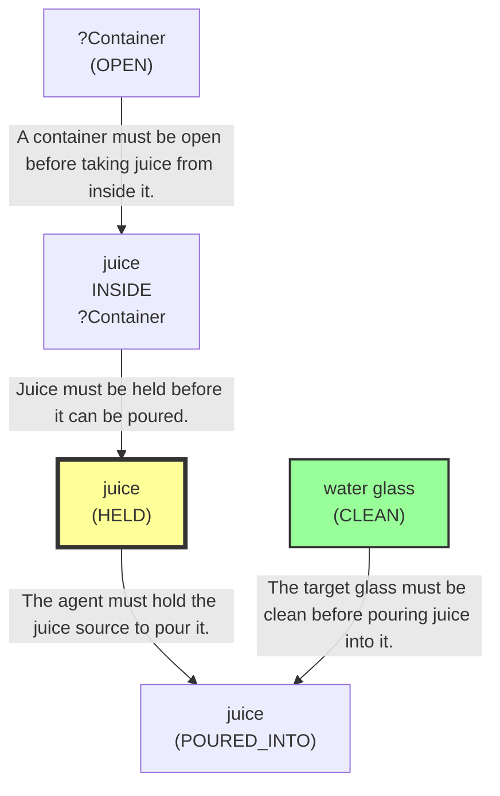
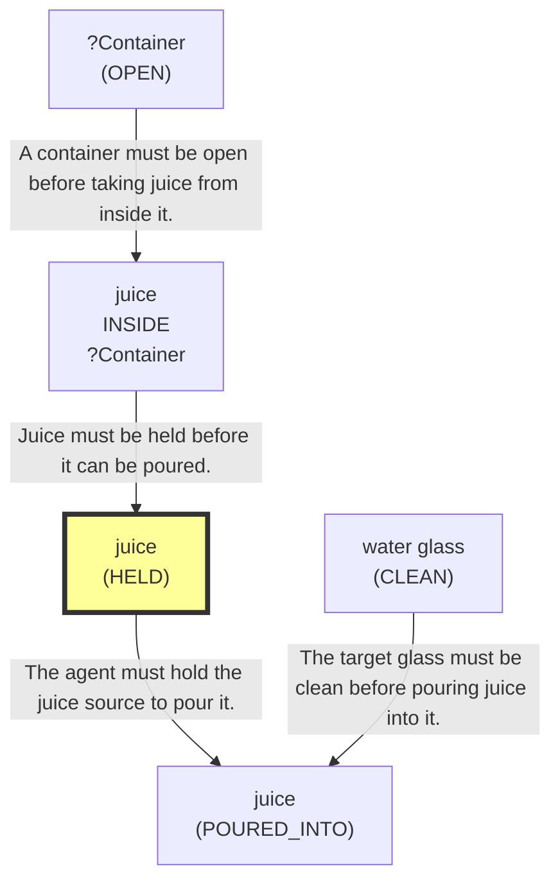
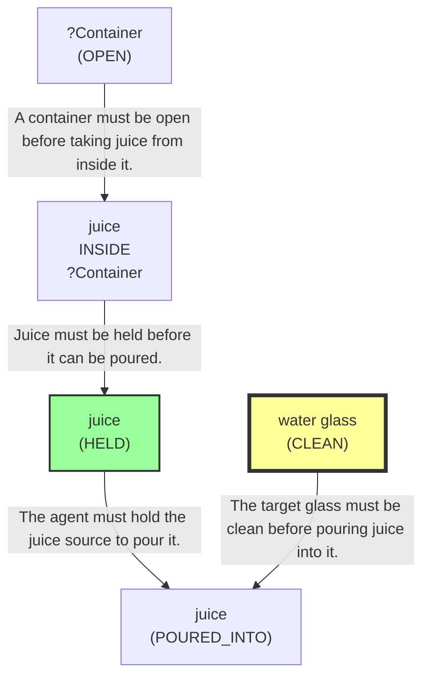
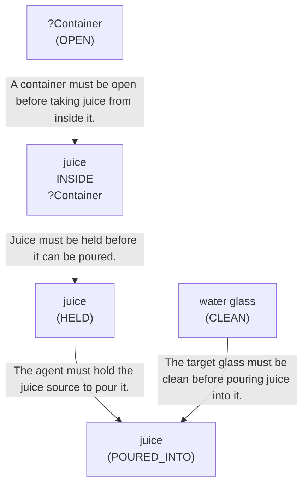
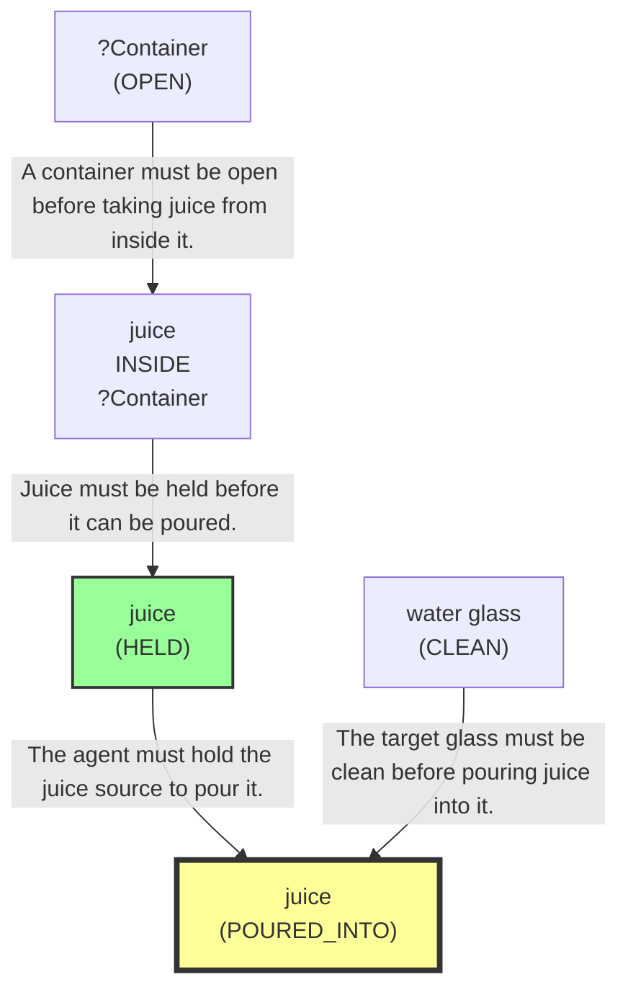

# 🚀 VirtualHome Agent Episode Log


### [GoalReasoner (Module A - Intent)] Output
```json
{
  "is_instruction_obviously_vague": false,
  "clarification_question": null,
  "target_object": "juice",
  "location_hint": "fridge",
  "reasoning_chain": [
    {
      "question": "Why does the user want this object?",
      "answer": "To have some juice available in a glass."
    },
    {
      "question": "Why is that important?",
      "answer": "So it can be consumed or used as a drink."
    },
    {
      "question": "What fundamental need does this fulfill?",
      "answer": "It helps relieve thirst and provide refreshment."
    },
    {
      "question": "Are there any deeper psychological or physical motivations?",
      "answer": "The user may want hydration, a pleasant beverage, or a small refreshment break."
    }
  ],
  "deep_intent": "The user wants to relieve thirst and obtain refreshment.",
  "acceptable_alternatives_properties": [
    {
      "priority": 1,
      "description": "Other ready-to-drink beverages already in the fridge, such as water, milk, or another juice."
    },
    {
      "priority": 2,
      "description": "Similar cold drinks in a household setting, such as flavored water or iced tea."
    },
    {
      "priority": 3,
      "description": "Any safe drinkable beverage available indoors that can provide hydration and refreshment."
    },
    {
      "priority": 4,
      "description": "A different non-alcoholic drink choice that still helps satisfy thirst, such as a fruit-based drink."
    }
  ]
}
```

### [PerceptionFilter] Output
```json
{
  "reasoning": "Needed items are the juice target, the fridge location where it is expected to be found, and the clean water glass required to pour it into. I also keep milk as a ready-to-drink alternative beverage available in the fridge per the intent.",
  "selected_classes": [
    "character",
    "milk",
    "juice",
    "fridge",
    "door",
    "waterglass"
  ],
  "raw_class_count": 50
}
```

### [LLMExecutor] Output
```json
{
  "reasoning": "The SDG requires juice to be held and then poured, and the clean target glass requirement is already satisfied by waterglass(64) being CLEAN. There are two juice candidates: juice(174) is close to the character and not inside a container, while juice(173) is inside the open fridge. Since the goal intent is juice from the fridge, but the current graph also shows a juice object already nearby, the safest next step toward satisfying N1 is to walk to the reachable juice(174) so it can be grabbed next. However, to strictly follow the SDG's held-before-pour sequence, the immediate actionable focus is to get close enough to the juice object first.",
  "satisfied_nodes": [
    "N5"
  ],
  "current_node_focus": "N1",
  "mapped_variables": {
    "?Container": "fridge(162)"
  },
  "action": "[walk] <juice> (174)"
}
```

### [RoboStateMultiTaskController] Output
```json
{
  "action": "[walk] <juice> (174)",
  "active_task_id": "task_1",
  "task_context": {
    "active_task_id": "task_1",
    "pending_task_ids": [],
    "satisfied_task_ids": []
  },
  "source": "llm_executor"
}
```
## Step 0
- **Action**: `[walk] <juice> (174)`
- **Action Success**: `True`
- **Action Message**: {'0': {'message': 'Success'}}
- **Active Task**: `task_1`
- **Decision Source**: `llm_executor`
- **Task Progress**: T3_without_memory_M2_09=pending
- **SDG Status**:

- **Observed Items (20)**: door(47) [OPEN], waterglass(64) [CLEAN], waterglass(71) [DIRTY], waterglass(72) [DIRTY], waterglass(79), waterglass(80), waterglass(87), waterglass(88), waterglass(100), fridge(162) [OPEN], juice(174), milk(177) [CLOSED], character(1), juice(173) [COLD], milk(176) [COLD,CLOSED]...


### [PerceptionFilter] Output
```json
{
  "reasoning": "Reused cached class selection.",
  "selected_classes": [
    "character",
    "milk",
    "juice",
    "fridge",
    "door",
    "waterglass"
  ],
  "raw_class_count": 50
}
```

### [LLMExecutor] Output
```json
{
  "reasoning": "The goal requires juice to be held first, and the current graph shows juice(174) is already CLOSE to the character in the kitchen and not inside a container. Since no walk is needed before grabbing a nearby object, the best next step is to grab juice(174).",
  "satisfied_nodes": [],
  "current_node_focus": "N1",
  "mapped_variables": {},
  "action": "[grab] <juice> (174)"
}
```

### [RoboStateMultiTaskController] Output
```json
{
  "action": "[grab] <juice> (174)",
  "active_task_id": "task_1",
  "task_context": {
    "active_task_id": "task_1",
    "pending_task_ids": [],
    "satisfied_task_ids": []
  },
  "source": "llm_executor"
}
```
## Step 1
- **Action**: `[grab] <juice> (174)`
- **Action Success**: `True`
- **Action Message**: {'0': {'message': 'Success'}}
- **Active Task**: `task_1`
- **Decision Source**: `llm_executor`
- **Task Progress**: T3_without_memory_M2_09=pending
- **SDG Status**:

- **Observed Items (20)**: door(47) [OPEN], waterglass(64) [CLEAN], waterglass(71) [DIRTY], waterglass(72) [DIRTY], waterglass(79), waterglass(80), waterglass(87), waterglass(88), waterglass(100), fridge(162) [OPEN], juice(174), milk(177) [CLOSED], character(1), juice(173) [COLD], milk(176) [COLD,CLOSED]...


### [PerceptionFilter] Output
```json
{
  "reasoning": "Reused cached class selection.",
  "selected_classes": [
    "character",
    "milk",
    "juice",
    "fridge",
    "door",
    "waterglass"
  ],
  "raw_class_count": 50
}
```

### [LLMExecutor] Output
```json
{
  "reasoning": "The SDG requires juice to be held, and the current graph already shows juice(174) held in the right hand (HOLDS_RH juice(174)). So N1 is already satisfied. The remaining needed progression is to get juice into a suitable container: a clean water glass is available and close to the character, with waterglass(64) explicitly CLEAN and POURABLE. To pour into it later, I first need to ensure the target container choice is bound; the best match is waterglass(64). Since pouring requires being near the target and the current step should progress toward that, I will walk to the clean glass next.",
  "satisfied_nodes": [
    "N1"
  ],
  "current_node_focus": "N5",
  "mapped_variables": {
    "?Container": "waterglass(64)"
  },
  "action": "[walk] <waterglass> (64)"
}
```

### [RoboStateMultiTaskController] Output
```json
{
  "action": "[walk] <waterglass> (64)",
  "active_task_id": "task_1",
  "task_context": {
    "active_task_id": "task_1",
    "pending_task_ids": [],
    "satisfied_task_ids": []
  },
  "source": "llm_executor"
}
```
## Step 2
- **Action**: `[walk] <waterglass> (64)`
- **Action Success**: `True`
- **Action Message**: {'0': {'message': 'Success'}}
- **Active Task**: `task_1`
- **Decision Source**: `llm_executor`
- **Task Progress**: T3_without_memory_M2_09=pending
- **SDG Status**:

- **Observed Items (21)**: door(47) [OPEN], waterglass(64) [CLEAN], waterglass(71) [DIRTY], waterglass(72) [DIRTY], waterglass(79), waterglass(80), waterglass(87), waterglass(88), waterglass(100), fridge(162) [OPEN], milk(177) [CLOSED], character(1), juice(174), juice(173) [COLD], milk(176) [COLD,CLOSED]...


### [PerceptionFilter] Output
```json
{
  "reasoning": "Reused cached class selection.",
  "selected_classes": [
    "character",
    "milk",
    "juice",
    "fridge",
    "door",
    "waterglass"
  ],
  "raw_class_count": 50
}
```

### [LLMExecutor] Output
```json
{
  "reasoning": "The SDG requires juice to be held, but the current graph already shows the character holding juice(174) in the right hand. The next unmet prerequisite on the path to pouring is that the target water glass must be clean; waterglass(64) is explicitly CLEAN and also close to the character, making it the best container choice. To eventually pour, I need to get near the destination receptacle first, so I will walk to the clean water glass.",
  "satisfied_nodes": [
    "N1"
  ],
  "current_node_focus": "N5",
  "mapped_variables": {
    "?Container": "waterglass(64)"
  },
  "action": "[walk] <waterglass> (64)"
}
```

### [RoboStateMultiTaskController] Output
```json
{
  "action": "[walk] <waterglass> (64)",
  "active_task_id": "task_1",
  "task_context": {
    "active_task_id": "task_1",
    "pending_task_ids": [],
    "satisfied_task_ids": []
  },
  "source": "llm_executor"
}
```
## Step 3
- **Action**: `[walk] <waterglass> (64)`
- **Action Success**: `True`
- **Action Message**: {'0': {'message': 'Success'}}
- **Active Task**: `task_1`
- **Decision Source**: `llm_executor`
- **Task Progress**: T3_without_memory_M2_09=pending
- **SDG Status**:

- **Observed Items (21)**: door(47) [OPEN], waterglass(64) [CLEAN], waterglass(71) [DIRTY], waterglass(72) [DIRTY], waterglass(79), waterglass(80), waterglass(87), waterglass(88), waterglass(100), fridge(162) [OPEN], milk(177) [CLOSED], character(1), juice(174), juice(173) [COLD], milk(176) [COLD,CLOSED]...


### [PerceptionFilter] Output
```json
{
  "reasoning": "Reused cached class selection.",
  "selected_classes": [
    "character",
    "milk",
    "juice",
    "fridge",
    "door",
    "waterglass"
  ],
  "raw_class_count": 50
}
```

### [LLMExecutor] Output
```json
{
  "reasoning": "The SDG requires juice to be HELD before it can be poured, and the current graph already shows juice(174) is CLOSE to the character and currently held in the right hand. The remaining gap is that the target water glass must be clean before pouring. Among the available glasses, waterglass(64) is already CLEAN and also CLOSE to the character, so the next step should be to move to that glass before any pouring can happen.",
  "satisfied_nodes": [
    "N1"
  ],
  "current_node_focus": "N5",
  "mapped_variables": {},
  "action": "[walk] <waterglass> (64)"
}
```

### [RoboStateMultiTaskController] Output
```json
{
  "action": "[walk] <livingroom> (183)",
  "active_task_id": null,
  "task_context": {
    "active_task_id": null,
    "pending_task_ids": [
      "task_1"
    ],
    "satisfied_task_ids": []
  },
  "source": "loop_recovery_room_revisit"
}
```
## Step 4
- **Action**: `[walk] <livingroom> (183)`
- **Action Success**: `True`
- **Action Message**: {'0': {'message': 'Success'}}
- **Decision Source**: `loop_recovery_room_revisit`
- **Task Progress**: T3_without_memory_M2_09=pending
- **SDG Status**:
No SDG active.
- **Observed Items (160)**: wall(12), wall(13), wall(14), wall(15), wall(16), wall(17), wall(18), wall(19), wall(20), wall(21), floor(22), floor(23), floor(24), floor(25), floor(26)...


### [RoboStateMultiTaskController] Output
```json
{
  "action": "[walk] <bedroom> (241)",
  "active_task_id": "task_1",
  "task_context": {
    "active_task_id": "task_1",
    "pending_task_ids": [],
    "satisfied_task_ids": []
  },
  "source": "room_frontier"
}
```
## Step 5
- **Action**: `[walk] <bedroom> (241)`
- **Action Success**: `True`
- **Action Message**: {'0': {'message': 'Success'}}
- **Active Task**: `task_1`
- **Decision Source**: `room_frontier`
- **Task Progress**: T3_without_memory_M2_09=pending
- **SDG Status**:

- **Observed Items (60)**: floor(184), floor(185), floor(186), floor(187), floor(188), floor(189), wall(190), wall(191), wall(192), wall(193), wall(194), wall(195), ceiling(196), ceiling(197), ceiling(198)...


### [RoboStateMultiTaskController] Output
```json
{
  "action": "[walk] <bathroom> (285)",
  "active_task_id": "task_1",
  "task_context": {
    "active_task_id": "task_1",
    "pending_task_ids": [],
    "satisfied_task_ids": []
  },
  "source": "room_frontier"
}
```
## Step 6
- **Action**: `[walk] <bathroom> (285)`
- **Action Success**: `True`
- **Action Message**: {'0': {'message': 'Success'}}
- **Active Task**: `task_1`
- **Decision Source**: `room_frontier`
- **Task Progress**: T3_without_memory_M2_09=pending
- **SDG Status**:

- **Observed Items (40)**: floor(242), floor(243), floor(244), floor(245), ceiling(246), ceiling(247), ceiling(248), ceiling(249), wall(250), wall(251), wall(252), wall(253), door(254) [OPEN], ceilinglamp(255), tablelamp(256) [ON]...


### [RoboStateMultiTaskController] Output
```json
{
  "action": "[walk] <bedroom> (346)",
  "active_task_id": "task_1",
  "task_context": {
    "active_task_id": "task_1",
    "pending_task_ids": [],
    "satisfied_task_ids": []
  },
  "source": "room_frontier"
}
```
## Step 7
- **Action**: `[walk] <bedroom> (346)`
- **Action Success**: `True`
- **Action Message**: {'0': {'message': 'Success'}}
- **Active Task**: `task_1`
- **Decision Source**: `room_frontier`
- **Task Progress**: T3_without_memory_M2_09=pending
- **SDG Status**:

- **Observed Items (68)**: wall(286), wall(287), wall(288), wall(289), wall(290), wall(291), floor(292), floor(293), floor(294), floor(295), floor(296), floor(297), ceiling(298), ceiling(299), ceiling(300)...


### [RoboStateMultiTaskController] Output
```json
{
  "action": "[walk] <kitchen> (11)",
  "active_task_id": null,
  "task_context": {
    "active_task_id": null,
    "pending_task_ids": [
      "task_1"
    ],
    "satisfied_task_ids": []
  },
  "source": "loop_recovery_room_revisit"
}
```
## Step 8
- **Action**: `[walk] <kitchen> (11)`
- **Action Success**: `True`
- **Action Message**: {'0': {'message': 'Success'}}
- **Decision Source**: `loop_recovery_room_revisit`
- **Task Progress**: T3_without_memory_M2_09=pending
- **SDG Status**:
No SDG active.
- **Observed Items (66)**: floor(347), floor(348), floor(349), floor(350), floor(351), floor(352), floor(353), floor(354), floor(355), wall(356), wall(357), wall(358), wall(359), wall(360), wall(361)...


### [PerceptionFilter] Output
```json
{
  "reasoning": "Reused cached class selection.",
  "selected_classes": [
    "character",
    "milk",
    "juice",
    "fridge",
    "door",
    "waterglass"
  ],
  "raw_class_count": 50
}
```

### [LLMExecutor] Output
```json
{
  "reasoning": "The SDG requires juice to be held and then poured into a clean water glass. The current graph shows the agent is already holding juice(174) and is close to a clean recipient, waterglass(64). To satisfy the next prerequisite toward pouring, I should move to the clean water glass before attempting the pour. This also avoids interacting across the room and respects the explicit walk-before-pour rule.",
  "satisfied_nodes": [
    "N1"
  ],
  "current_node_focus": "N4",
  "mapped_variables": {
    "?Container": "waterglass(64)"
  },
  "action": "[walk] <waterglass> (64)"
}
```

### [RoboStateMultiTaskController] Output
```json
{
  "action": "[walk] <waterglass> (64)",
  "active_task_id": "task_1",
  "task_context": {
    "active_task_id": "task_1",
    "pending_task_ids": [],
    "satisfied_task_ids": []
  },
  "source": "llm_executor"
}
```
## Step 9
- **Action**: `[walk] <waterglass> (64)`
- **Action Success**: `True`
- **Action Message**: {'0': {'message': 'Success'}}
- **Active Task**: `task_1`
- **Decision Source**: `llm_executor`
- **Task Progress**: T3_without_memory_M2_09=pending
- **SDG Status**:

- **Observed Items (21)**: door(47) [OPEN], waterglass(64) [CLEAN], waterglass(71) [DIRTY], waterglass(72) [DIRTY], waterglass(79), waterglass(80), waterglass(87), waterglass(88), waterglass(100), fridge(162) [OPEN], milk(177) [CLOSED], character(1), juice(174), juice(173) [COLD], milk(176) [COLD,CLOSED]...


### [PerceptionFilter] Output
```json
{
  "reasoning": "Reused cached class selection.",
  "selected_classes": [
    "character",
    "milk",
    "juice",
    "fridge",
    "door",
    "waterglass"
  ],
  "raw_class_count": 50
}
```

### [LLMExecutor] Output
```json
{
  "reasoning": "The SDG requires the juice to be HELD before pouring, and the current graph already shows juice(174) is CLOSE to the character and currently held in the right hand. The remaining prerequisite before pouring is to use a clean target glass; waterglass(64) is the only glass marked CLEAN and is also CLOSE to the character. To satisfy the next logical dependency toward pouring juice, I should move to the clean glass first so I can interact with it next.",
  "satisfied_nodes": [
    "N1"
  ],
  "current_node_focus": "N5",
  "mapped_variables": {},
  "action": "[walk] <waterglass> (64)"
}
```

### [RoboStateMultiTaskController] Output
```json
{
  "action": "[walk] <waterglass> (64)",
  "active_task_id": "task_1",
  "task_context": {
    "active_task_id": "task_1",
    "pending_task_ids": [],
    "satisfied_task_ids": []
  },
  "source": "llm_executor"
}
```
## Step 10
- **Action**: `[walk] <waterglass> (64)`
- **Action Success**: `True`
- **Action Message**: {'0': {'message': 'Success'}}
- **Active Task**: `task_1`
- **Decision Source**: `llm_executor`
- **Task Progress**: T3_without_memory_M2_09=pending
- **SDG Status**:

- **Observed Items (21)**: door(47) [OPEN], waterglass(64) [CLEAN], waterglass(71) [DIRTY], waterglass(72) [DIRTY], waterglass(79), waterglass(80), waterglass(87), waterglass(88), waterglass(100), fridge(162) [OPEN], milk(177) [CLOSED], character(1), juice(174), juice(173) [COLD], milk(176) [COLD,CLOSED]...


### [PerceptionFilter] Output
```json
{
  "reasoning": "Reused cached class selection.",
  "selected_classes": [
    "character",
    "milk",
    "juice",
    "fridge",
    "door",
    "waterglass"
  ],
  "raw_class_count": 50
}
```

### [LLMExecutor] Output
```json
{
  "reasoning": "The active SDG requires juice to be held, then ultimately poured into a clean water glass. The current graph already shows juice(174) is in the character's right hand, so N1 (juice held) is satisfied. The clean recipient available is waterglass(64), which is close to the character and already CLEAN, satisfying N5. The next unmet prerequisite toward pouring is to be near the target container before a pour/put action, and the pour target must be a specific pourable recipient. I will move to the clean water glass to prepare for pouring in the next step.",
  "satisfied_nodes": [
    "N1",
    "N5"
  ],
  "current_node_focus": "N4",
  "mapped_variables": {
    "?Container": "waterglass(64)"
  },
  "action": "[walk] <waterglass> (64)"
}
```

### [RoboStateMultiTaskController] Output
```json
{
  "action": "[walk] <livingroom> (183)",
  "active_task_id": null,
  "task_context": {
    "active_task_id": null,
    "pending_task_ids": [
      "task_1"
    ],
    "satisfied_task_ids": []
  },
  "source": "loop_recovery_room_revisit"
}
```
## Step 11
- **Action**: `[walk] <livingroom> (183)`
- **Action Success**: `True`
- **Action Message**: {'0': {'message': 'Success'}}
- **Decision Source**: `loop_recovery_room_revisit`
- **Task Progress**: T3_without_memory_M2_09=pending
- **SDG Status**:
No SDG active.
- **Observed Items (160)**: wall(12), wall(13), wall(14), wall(15), wall(16), wall(17), wall(18), wall(19), wall(20), wall(21), floor(22), floor(23), floor(24), floor(25), floor(26)...


### [RoboStateMultiTaskController] Output
```json
{
  "action": "[walk] <bedroom> (241)",
  "active_task_id": null,
  "task_context": {
    "active_task_id": null,
    "pending_task_ids": [
      "task_1"
    ],
    "satisfied_task_ids": []
  },
  "source": "loop_recovery_room_revisit"
}
```
## Step 12
- **Action**: `[walk] <bedroom> (241)`
- **Action Success**: `True`
- **Action Message**: {'0': {'message': 'Success'}}
- **Decision Source**: `loop_recovery_room_revisit`
- **Task Progress**: T3_without_memory_M2_09=pending
- **SDG Status**:
No SDG active.
- **Observed Items (60)**: floor(184), floor(185), floor(186), floor(187), floor(188), floor(189), wall(190), wall(191), wall(192), wall(193), wall(194), wall(195), ceiling(196), ceiling(197), ceiling(198)...


### [RoboStateMultiTaskController] Output
```json
{
  "action": "[walk] <bathroom> (285)",
  "active_task_id": null,
  "task_context": {
    "active_task_id": null,
    "pending_task_ids": [
      "task_1"
    ],
    "satisfied_task_ids": []
  },
  "source": "loop_recovery_room_revisit"
}
```
## Step 13
- **Action**: `[walk] <bathroom> (285)`
- **Action Success**: `True`
- **Action Message**: {'0': {'message': 'Success'}}
- **Decision Source**: `loop_recovery_room_revisit`
- **Task Progress**: T3_without_memory_M2_09=pending
- **SDG Status**:
No SDG active.
- **Observed Items (40)**: floor(242), floor(243), floor(244), floor(245), ceiling(246), ceiling(247), ceiling(248), ceiling(249), wall(250), wall(251), wall(252), wall(253), door(254) [OPEN], ceilinglamp(255), tablelamp(256) [ON]...


### [RoboStateMultiTaskController] Output
```json
{
  "action": "[walk] <bedroom> (346)",
  "active_task_id": null,
  "task_context": {
    "active_task_id": null,
    "pending_task_ids": [
      "task_1"
    ],
    "satisfied_task_ids": []
  },
  "source": "loop_recovery_room_revisit"
}
```
## Step 14
- **Action**: `[walk] <bedroom> (346)`
- **Action Success**: `True`
- **Action Message**: {'0': {'message': 'Success'}}
- **Decision Source**: `loop_recovery_room_revisit`
- **Task Progress**: T3_without_memory_M2_09=pending
- **SDG Status**:
No SDG active.
- **Observed Items (68)**: wall(286), wall(287), wall(288), wall(289), wall(290), wall(291), floor(292), floor(293), floor(294), floor(295), floor(296), floor(297), ceiling(298), ceiling(299), ceiling(300)...

