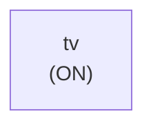
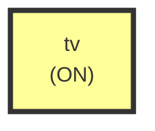

# 🚀 VirtualHome Agent Episode Log


### [GoalReasoner (Module A - Intent)] Output
```json
{
  "is_instruction_obviously_vague": false,
  "clarification_question": null,
  "target_object": "TV",
  "location_hint": null,
  "reasoning_chain": [
    {
      "question": "Why does the user want this object?",
      "answer": "To have the television powered on."
    },
    {
      "question": "Why is that important?",
      "answer": "So the television can display content or be ready for use."
    },
    {
      "question": "What fundamental need does this fulfill?",
      "answer": "It fulfills the need to access visual entertainment or information."
    },
    {
      "question": "Are there any deeper psychological or physical motivations?",
      "answer": "The user may want convenience, relaxation, or immediate access to media."
    }
  ],
  "deep_intent": "The user wants to access visual entertainment or information.",
  "acceptable_alternatives_properties": [
    {
      "priority": 1,
      "description": "Another display device that can show media, such as a monitor or smart display"
    },
    {
      "priority": 2,
      "description": "A different television or similar household screen device"
    },
    {
      "priority": 3,
      "description": "Any indoor media playback device that can provide audiovisual content"
    },
    {
      "priority": 4,
      "description": "A radio or tablet as a fallback for accessing information or entertainment in another format"
    }
  ]
}
```

### [RoboStateMultiTaskController] Output
```json
{
  "action": "[walk] <bathroom> (11)",
  "active_task_id": "task_1",
  "task_context": {
    "active_task_id": "task_1",
    "pending_task_ids": [],
    "satisfied_task_ids": []
  },
  "source": "room_frontier"
}
```
## Step 0
- **Action**: `[walk] <bathroom> (11)`
- **Action Success**: `True`
- **Action Message**: {'0': {'message': 'Success'}}
- **Active Task**: `task_1`
- **Decision Source**: `room_frontier`
- **Task Progress**: T3_without_memory_M3_12=pending
- **SDG Status**:

- **Observed Items (124)**: floor(127), floor(128), floor(129), floor(130), floor(131), floor(132), floor(133), floor(134), floor(135), ceiling(136), ceiling(137), ceiling(138), ceiling(139), ceiling(140), ceiling(141)...


### [RoboStateMultiTaskController] Output
```json
{
  "action": "[walk] <bedroom> (50)",
  "active_task_id": "task_1",
  "task_context": {
    "active_task_id": "task_1",
    "pending_task_ids": [],
    "satisfied_task_ids": []
  },
  "source": "room_frontier"
}
```
## Step 1
- **Action**: `[walk] <bedroom> (50)`
- **Action Success**: `True`
- **Action Message**: {'0': {'message': 'Success'}}
- **Active Task**: `task_1`
- **Decision Source**: `room_frontier`
- **Task Progress**: T3_without_memory_M3_12=pending
- **SDG Status**:

- **Observed Items (43)**: wall(12), wall(13), wall(14), wall(15), ceiling(16), ceiling(17), ceiling(18), ceiling(19), floor(20), floor(21), floor(22), floor(23), toilet(24) [CLOSED], stall(25), bathroomcabinet(26) [CLOSED]...


### [RoboStateMultiTaskController] Output
```json
{
  "action": "[walk] <livingroom> (261)",
  "active_task_id": "task_1",
  "task_context": {
    "active_task_id": "task_1",
    "pending_task_ids": [],
    "satisfied_task_ids": []
  },
  "source": "room_frontier"
}
```
## Step 2
- **Action**: `[walk] <livingroom> (261)`
- **Action Success**: `True`
- **Action Message**: {'0': {'message': 'Success'}}
- **Active Task**: `task_1`
- **Decision Source**: `room_frontier`
- **Task Progress**: T3_without_memory_M3_12=pending
- **SDG Status**:

- **Observed Items (75)**: floor(51), floor(52), floor(53), floor(54), floor(55), floor(56), floor(57), floor(58), floor(59), wall(60), wall(61), wall(62), wall(63), wall(64), wall(65)...


### [PerceptionFilter] Output
```json
{
  "reasoning": "The goal is to have the TV powered on, so the target TV must be kept. A remotecontrol is the key functional tool for turning it on, and a powersocket is a necessary power-related support object if the TV needs power/access. The tvstand is the relevant location/furniture associated with the TV setup. Alternative display/media devices are not needed because the goal specifically targets the TV state.",
  "selected_classes": [
    "remotecontrol",
    "tv",
    "character",
    "tvstand",
    "powersocket"
  ],
  "raw_class_count": 30
}
```

### [LLMExecutor] Output
```json
{
  "reasoning": "The goal is to turn the TV ON, but a global rule currently forbids turning on the TV because the master is sleeping. Since this is a temporary ban and directly blocks the required action, the correct next step is to wait until the rule expires.",
  "satisfied_nodes": [],
  "current_node_focus": "N1",
  "mapped_variables": {},
  "action": "[wait]"
}
```

### [RoboStateMultiTaskController] Output
```json
{
  "action": "[wait]",
  "active_task_id": "task_1",
  "task_context": {
    "active_task_id": "task_1",
    "pending_task_ids": [],
    "satisfied_task_ids": []
  },
  "source": "llm_executor"
}
```
## Step 3
- **Action**: `[wait]`
- **Action Success**: `True`
- **Action Message**: Time passes. You waited for a while.
- **Active Task**: `task_1`
- **Decision Source**: `llm_executor`
- **Task Progress**: T3_without_memory_M3_12=pending
- **SDG Status**:

- **Observed Items (9)**: tvstand(292), tv(300) [OFF], powersocket(301), remotecontrol(321) [OFF], character(1), bathroom(11), bedroom(50), kitchen(126), livingroom(261)


### [PerceptionFilter] Output
```json
{
  "reasoning": "Reused cached class selection.",
  "selected_classes": [
    "remotecontrol",
    "tv",
    "character",
    "tvstand",
    "powersocket"
  ],
  "raw_class_count": 30
}
```

### [LLMExecutor] Output
```json
{
  "reasoning": "The SDG requires the TV to be ON, and the current graph shows tv(300) is OFF. However, an active global rule explicitly forbids turning on the TV while the master is sleeping, and it expires at step 6. Since this blocks the required state change, the correct next step is to wait until the ban lifts.",
  "satisfied_nodes": [],
  "current_node_focus": "N1",
  "mapped_variables": {},
  "action": "[wait]"
}
```

### [RoboStateMultiTaskController] Output
```json
{
  "action": "[wait]",
  "active_task_id": "task_1",
  "task_context": {
    "active_task_id": "task_1",
    "pending_task_ids": [],
    "satisfied_task_ids": []
  },
  "source": "llm_executor"
}
```
## Step 4
- **Action**: `[wait]`
- **Action Success**: `True`
- **Action Message**: Time passes. You waited for a while.
- **Active Task**: `task_1`
- **Decision Source**: `llm_executor`
- **Task Progress**: T3_without_memory_M3_12=pending
- **SDG Status**:

- **Observed Items (9)**: tvstand(292), tv(300) [OFF], powersocket(301), remotecontrol(321) [OFF], character(1), bathroom(11), bedroom(50), kitchen(126), livingroom(261)


### [PerceptionFilter] Output
```json
{
  "reasoning": "Reused cached class selection.",
  "selected_classes": [
    "remotecontrol",
    "tv",
    "character",
    "tvstand",
    "powersocket"
  ],
  "raw_class_count": 30
}
```

### [LLMExecutor] Output
```json
{
  "reasoning": "The required goal is TV ON, but there is an active global rule forbidding turning on the TV while the master is sleeping. This is a temporary block that expires at step 6, so the correct next move is to wait rather than interact with the TV or remote.",
  "satisfied_nodes": [],
  "current_node_focus": "N1",
  "mapped_variables": {},
  "action": "[wait]"
}
```

### [RoboStateMultiTaskController] Output
```json
{
  "action": "[wait]",
  "active_task_id": "task_1",
  "task_context": {
    "active_task_id": "task_1",
    "pending_task_ids": [],
    "satisfied_task_ids": []
  },
  "source": "llm_executor"
}
```
## Step 5
- **Action**: `[wait]`
- **Action Success**: `True`
- **Action Message**: Time passes. You waited for a while.
- **Active Task**: `task_1`
- **Decision Source**: `llm_executor`
- **Task Progress**: T3_without_memory_M3_12=pending
- **SDG Status**:

- **Observed Items (9)**: tvstand(292), tv(300) [OFF], powersocket(301), remotecontrol(321) [OFF], character(1), bathroom(11), bedroom(50), kitchen(126), livingroom(261)


### [PerceptionFilter] Output
```json
{
  "reasoning": "Reused cached class selection.",
  "selected_classes": [
    "remotecontrol",
    "tv",
    "character",
    "tvstand",
    "powersocket"
  ],
  "raw_class_count": 30
}
```

### [LLMExecutor] Output
```json
{
  "reasoning": "The active goal is to satisfy N1: tv(300) must be ON. The TV has HAS_SWITCH and HAS_PLUG, and the powersocket is available, but the graph does not yet show the TV plugged in. Per the required order for powered appliances, the next atomic step should be to move near the TV first so it can be operated directly or plugged in afterward. No other nodes are satisfied yet.",
  "satisfied_nodes": [],
  "current_node_focus": "N1",
  "mapped_variables": {
    "?Device": "tv(300)"
  },
  "action": "[walk] <tv> (300)"
}
```

### [RoboStateMultiTaskController] Output
```json
{
  "action": "[walk] <tv> (300)",
  "active_task_id": "task_1",
  "task_context": {
    "active_task_id": "task_1",
    "pending_task_ids": [],
    "satisfied_task_ids": []
  },
  "source": "llm_executor"
}
```
## Step 6
- **Action**: `[walk] <tv> (300)`
- **Action Success**: `True`
- **Action Message**: {'0': {'message': 'Success'}}
- **Active Task**: `task_1`
- **Decision Source**: `llm_executor`
- **Task Progress**: T3_without_memory_M3_12=pending
- **SDG Status**:

- **Observed Items (9)**: tvstand(292), tv(300) [OFF], powersocket(301), remotecontrol(321) [OFF], character(1), bathroom(11), bedroom(50), kitchen(126), livingroom(261)


### [PerceptionFilter] Output
```json
{
  "reasoning": "Reused cached class selection.",
  "selected_classes": [
    "remotecontrol",
    "tv",
    "character",
    "tvstand",
    "powersocket"
  ],
  "raw_class_count": 30
}
```

### [LLMExecutor] Output
```json
{
  "reasoning": "The goal is to get the television ON. The current graph shows tv(300) is OFF and the character is already CLOSE to it, so the next valid step is to switch it on. The TV has HAS_SWITCH and HAS_PLUG, but there is no indication it is unplugged, so plugging is not required right now.",
  "satisfied_nodes": [],
  "current_node_focus": "N1",
  "mapped_variables": {},
  "action": "[switchon] <tv> (300)"
}
```

### [RoboStateMultiTaskController] Output
```json
{
  "action": "[switchon] <tv> (300)",
  "active_task_id": "task_1",
  "task_context": {
    "active_task_id": "task_1",
    "pending_task_ids": [],
    "satisfied_task_ids": []
  },
  "source": "llm_executor"
}
```
## Step 7
- **Action**: `[switchon] <tv> (300)`
- **Action Success**: `True`
- **Action Message**: Faked switch operation in Python layer (bypassed Unity failure)
- **Active Task**: `task_1`
- **Decision Source**: `llm_executor`
- **Task Progress**: T3_without_memory_M3_12=done
- **SDG Status**:

- **Observed Items (9)**: tvstand(292), tv(300) [OFF], powersocket(301), remotecontrol(321) [OFF], character(1), bathroom(11), bedroom(50), kitchen(126), livingroom(261)

