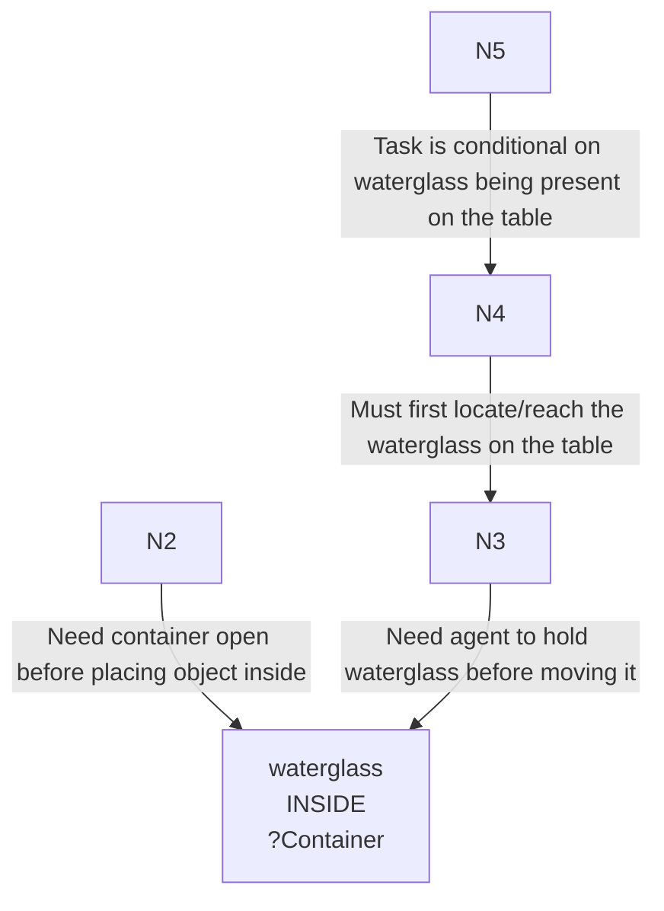

# 🚀 VirtualHome Agent Episode Log


### [GoalReasoner (Module A - Intent)] Output
```json
{
  "is_instruction_obviously_vague": false,
  "clarification_question": null,
  "target_object": "waterglass",
  "location_hint": "table",
  "reasoning_chain": [
    {
      "question": "Why does the user want this object moved?",
      "answer": "To relocate the glass from the table to a kitchen cabinet if it is present."
    },
    {
      "question": "Why is that important?",
      "answer": "It likely helps clear the table or store the glass in its proper place."
    },
    {
      "question": "What fundamental need does this fulfill?",
      "answer": "It fulfills the need to organize or tidy the indoor space by storing an item away."
    },
    {
      "question": "Are there any deeper psychological or physical motivations?",
      "answer": "The user may want a cleaner surface, easier access to the glass later, or a more orderly kitchen environment."
    }
  ],
  "deep_intent": "The user wants to organize indoor space by storing a drinking vessel away from the table.",
  "acceptable_alternatives_properties": [
    {
      "priority": 1,
      "description": "Other drinking vessels that are out on the table and can be stored in the kitchen cabinet, such as a cup or mug"
    },
    {
      "priority": 2,
      "description": "Similar kitchenware or drinkware that belongs in the cabinet, such as a tumbler or small glass"
    },
    {
      "priority": 3,
      "description": "Other small household items on the table that can be put away in a cabinet to reduce clutter"
    },
    {
      "priority": 4,
      "description": "Any tabletop item that serves a storage-worthy household organization goal, if the exact glass is unavailable"
    }
  ]
}
```

### [RoboStateMultiTaskController] Output
```json
{
  "action": "[walk] <kitchen> (11)",
  "active_task_id": "task_1",
  "task_context": {
    "active_task_id": "task_1",
    "pending_task_ids": [],
    "satisfied_task_ids": []
  },
  "source": "room_frontier"
}
```
## Step 0
- **Action**: `[walk] <kitchen> (11)`
- **Action Success**: `True`
- **Action Message**: {'0': {'message': 'Success'}}
- **Active Task**: `task_1`
- **Decision Source**: `room_frontier`
- **Task Progress**: T3_without_memory_M3_13=pending
- **SDG Status**:

- **Observed Items (58)**: floor(184), floor(185), floor(186), floor(187), floor(188), floor(189), wall(190), wall(191), wall(192), wall(193), wall(194), wall(195), ceiling(196), ceiling(197), ceiling(198)...


### [PerceptionFilter] Output
```json
{
  "reasoning": "The goal is to move the waterglass from the table into a kitchen cabinet. So I must keep the target object, the source location/table, the destination container/cabinet, and the agent-needed holding context implied by the SDG. No other objects are necessary.",
  "selected_classes": [
    "door",
    "kitchentable",
    "character",
    "kitchencabinet",
    "waterglass"
  ],
  "raw_class_count": 50
}
```

### [LLMExecutor] Output
```json
{
  "reasoning": "The goal is to place the waterglass inside a kitchen cabinet, but the active global rule temporarily forbids opening the cabinet or putting anything inside it until step 6. The target glass is already on the table and close to the character, so the only valid move that respects the rule while preserving progress is to wait for the disinfecting ban to expire.",
  "satisfied_nodes": [
    "N5",
    "N4"
  ],
  "current_node_focus": "N3",
  "mapped_variables": {},
  "action": "[wait]"
}
```

### [RoboStateMultiTaskController] Output
```json
{
  "action": "[wait]",
  "active_task_id": "task_1",
  "task_context": {
    "active_task_id": "task_1",
    "pending_task_ids": [],
    "satisfied_task_ids": []
  },
  "source": "llm_executor"
}
```
## Step 1
- **Action**: `[wait]`
- **Action Success**: `True`
- **Action Message**: Time passes. You waited for a while.
- **Active Task**: `task_1`
- **Decision Source**: `llm_executor`
- **Task Progress**: T3_without_memory_M3_13=pending
- **SDG Status**:

- **Observed Items (25)**: door(47) [OPEN], waterglass(64), waterglass(71), waterglass(72), waterglass(79), waterglass(80), waterglass(87), waterglass(88), waterglass(100), kitchentable(131), kitchentable(135), kitchencabinet(138) [CLOSED], kitchencabinet(139) [CLOSED], kitchencabinet(140) [CLOSED], kitchencabinet(141) [CLOSED]...


### [PerceptionFilter] Output
```json
{
  "reasoning": "Reused cached class selection.",
  "selected_classes": [
    "door",
    "kitchentable",
    "character",
    "kitchencabinet",
    "waterglass"
  ],
  "raw_class_count": 50
}
```

### [LLMExecutor] Output
```json
{
  "reasoning": "The target waterglass is present and already close to the character on the kitchen table, so the next required SDG step is to hold it before moving it. The cabinet is currently under a temporary disinfection ban, so opening or storing it now is blocked; the correct autonomous action is to pick up the glass and wait for the ban to expire before attempting to open/put it inside later. This action focuses on satisfying the prerequisite for N1 via N3.",
  "satisfied_nodes": [
    "N5",
    "N4"
  ],
  "current_node_focus": "N3",
  "mapped_variables": {},
  "action": "[grab] <waterglass> (64)"
}
```

### [RoboStateMultiTaskController] Output
```json
{
  "action": "[grab] <waterglass> (64)",
  "active_task_id": "task_1",
  "task_context": {
    "active_task_id": "task_1",
    "pending_task_ids": [],
    "satisfied_task_ids": []
  },
  "source": "llm_executor"
}
```
## Step 2
- **Action**: `[grab] <waterglass> (64)`
- **Action Success**: `True`
- **Action Message**: {'0': {'message': 'Success'}}
- **Active Task**: `task_1`
- **Decision Source**: `llm_executor`
- **Task Progress**: T3_without_memory_M3_13=pending
- **SDG Status**:

- **Observed Items (25)**: door(47) [OPEN], waterglass(64), waterglass(71), waterglass(72), waterglass(79), waterglass(80), waterglass(87), waterglass(88), waterglass(100), kitchentable(131), kitchentable(135), kitchencabinet(138) [CLOSED], kitchencabinet(139) [CLOSED], kitchencabinet(140) [CLOSED], kitchencabinet(141) [CLOSED]...


### [PerceptionFilter] Output
```json
{
  "reasoning": "Reused cached class selection.",
  "selected_classes": [
    "door",
    "kitchentable",
    "character",
    "kitchencabinet",
    "waterglass"
  ],
  "raw_class_count": 50
}
```

### [LLMExecutor] Output
```json
{
  "reasoning": "The goal is to store a waterglass inside a kitchen cabinet, but the active global rule temporarily forbids opening the cabinet or putting anything inside it until step 6. The target waterglass is already on the kitchen table and one instance (waterglass(64)) is close to the character, so the only blocker is the temporary cabinet disinfection ban. Waiting is required until the rule expires.",
  "satisfied_nodes": [],
  "current_node_focus": "N2",
  "mapped_variables": {},
  "action": "[wait]"
}
```

### [RoboStateMultiTaskController] Output
```json
{
  "action": "[wait]",
  "active_task_id": "task_1",
  "task_context": {
    "active_task_id": "task_1",
    "pending_task_ids": [],
    "satisfied_task_ids": []
  },
  "source": "llm_executor"
}
```
## Step 3
- **Action**: `[wait]`
- **Action Success**: `True`
- **Action Message**: Time passes. You waited for a while.
- **Active Task**: `task_1`
- **Decision Source**: `llm_executor`
- **Task Progress**: T3_without_memory_M3_13=pending
- **SDG Status**:

- **Observed Items (26)**: door(47) [OPEN], waterglass(71), waterglass(72), waterglass(79), waterglass(80), waterglass(87), waterglass(88), waterglass(100), kitchentable(131), kitchentable(135), kitchencabinet(138) [CLOSED], kitchencabinet(139) [CLOSED], kitchencabinet(140) [CLOSED], kitchencabinet(141) [CLOSED], kitchencabinet(142) [CLOSED]...


### [PerceptionFilter] Output
```json
{
  "reasoning": "Reused cached class selection.",
  "selected_classes": [
    "door",
    "kitchentable",
    "character",
    "kitchencabinet",
    "waterglass"
  ],
  "raw_class_count": 50
}
```

### [LLMExecutor] Output
```json
{
  "reasoning": "The goal is to move a waterglass from the table into a kitchen cabinet, but the active global rule temporarily forbids opening the cabinet or putting anything inside it until step 6. The cabinet is the required final container for N1, so I cannot progress with placement yet. Since this is a temporary ban, the correct action is to wait until the restriction expires. The closest relevant target is the cabinet variables for future placement, but no physical interaction is allowed now.",
  "satisfied_nodes": [],
  "current_node_focus": "N2",
  "mapped_variables": {
    "?Container": "kitchencabinet(138)"
  },
  "action": "[wait]"
}
```

### [RoboStateMultiTaskController] Output
```json
{
  "action": "[wait]",
  "active_task_id": "task_1",
  "task_context": {
    "active_task_id": "task_1",
    "pending_task_ids": [],
    "satisfied_task_ids": []
  },
  "source": "llm_executor"
}
```
## Step 4
- **Action**: `[wait]`
- **Action Success**: `True`
- **Action Message**: Time passes. You waited for a while.
- **Active Task**: `task_1`
- **Decision Source**: `llm_executor`
- **Task Progress**: T3_without_memory_M3_13=pending
- **SDG Status**:

- **Observed Items (26)**: door(47) [OPEN], waterglass(71), waterglass(72), waterglass(79), waterglass(80), waterglass(87), waterglass(88), waterglass(100), kitchentable(131), kitchentable(135), kitchencabinet(138) [CLOSED], kitchencabinet(139) [CLOSED], kitchencabinet(140) [CLOSED], kitchencabinet(141) [CLOSED], kitchencabinet(142) [CLOSED]...


### [PerceptionFilter] Output
```json
{
  "reasoning": "Reused cached class selection.",
  "selected_classes": [
    "door",
    "kitchentable",
    "character",
    "kitchencabinet",
    "waterglass"
  ],
  "raw_class_count": 50
}
```

### [LLMExecutor] Output
```json
{
  "reasoning": "The goal is to store the waterglass inside a kitchen cabinet, but the only available cabinets are under a temporary disinfection rule that forbids opening or putting anything inside until step 6. A [wait] is required to respect this active global rule before any further progress toward the final INSIDE relation can be made. The waterglass is already identified and one instance is close, so no searching is needed yet.",
  "satisfied_nodes": [],
  "current_node_focus": "N2",
  "mapped_variables": {
    "?Container": "kitchencabinet(138)"
  },
  "action": "[wait]"
}
```

### [RoboStateMultiTaskController] Output
```json
{
  "action": "[wait]",
  "active_task_id": "task_1",
  "task_context": {
    "active_task_id": "task_1",
    "pending_task_ids": [],
    "satisfied_task_ids": []
  },
  "source": "llm_executor"
}
```
## Step 5
- **Action**: `[wait]`
- **Action Success**: `True`
- **Action Message**: Time passes. You waited for a while.
- **Active Task**: `task_1`
- **Decision Source**: `llm_executor`
- **Task Progress**: T3_without_memory_M3_13=pending
- **SDG Status**:

- **Observed Items (26)**: door(47) [OPEN], waterglass(71), waterglass(72), waterglass(79), waterglass(80), waterglass(87), waterglass(88), waterglass(100), kitchentable(131), kitchentable(135), kitchencabinet(138) [CLOSED], kitchencabinet(139) [CLOSED], kitchencabinet(140) [CLOSED], kitchencabinet(141) [CLOSED], kitchencabinet(142) [CLOSED]...


### [PerceptionFilter] Output
```json
{
  "reasoning": "Reused cached class selection.",
  "selected_classes": [
    "door",
    "kitchentable",
    "character",
    "kitchencabinet",
    "waterglass"
  ],
  "raw_class_count": 50
}
```

### [LLMExecutor] Output
```json
{
  "reasoning": "The goal is to store a waterglass inside a kitchen cabinet. The current graph shows several waterglasses on kitchen tables, and the character is already close to waterglass(64) and holding it in the right hand, so the holding prerequisite for N3 is satisfied. The next missing dependency toward N1 is locating/reaching the destination container and opening it. Among the available cabinets, any closed kitchen cabinet is a valid container candidate; I will use kitchencabinet(138) as the target container binding. Since putting inside requires being near the container and the cabinet is currently closed, the immediate next atomic step is to walk to the cabinet before opening it.",
  "satisfied_nodes": [
    "N3"
  ],
  "current_node_focus": "N2",
  "mapped_variables": {
    "?Container": "kitchencabinet(138)"
  },
  "action": "[walk] <kitchencabinet> (138)"
}
```

### [RoboStateMultiTaskController] Output
```json
{
  "action": "[walk] <kitchencabinet> (138)",
  "active_task_id": "task_1",
  "task_context": {
    "active_task_id": "task_1",
    "pending_task_ids": [],
    "satisfied_task_ids": []
  },
  "source": "llm_executor"
}
```
## Step 6
- **Action**: `[walk] <kitchencabinet> (138)`
- **Action Success**: `True`
- **Action Message**: {'0': {'message': 'Success'}}
- **Active Task**: `task_1`
- **Decision Source**: `llm_executor`
- **Task Progress**: T3_without_memory_M3_13=pending
- **SDG Status**:

- **Observed Items (26)**: door(47) [OPEN], waterglass(71), waterglass(72), waterglass(79), waterglass(80), waterglass(87), waterglass(88), waterglass(100), kitchentable(131), kitchentable(135), kitchencabinet(138) [CLOSED], kitchencabinet(139) [CLOSED], kitchencabinet(140) [CLOSED], kitchencabinet(141) [CLOSED], kitchencabinet(142) [CLOSED]...


### [PerceptionFilter] Output
```json
{
  "reasoning": "Reused cached class selection.",
  "selected_classes": [
    "door",
    "kitchentable",
    "character",
    "kitchencabinet",
    "waterglass"
  ],
  "raw_class_count": 50
}
```

### [LLMExecutor] Output
```json
{
  "reasoning": "The goal is to store a waterglass inside a kitchen cabinet. The current graph shows multiple waterglasses on kitchen tables; the clearest target is waterglass(71) on kitchentable(135), and the relevant container candidates are closed kitchencabinets. Since I cannot grab across the room and must first be near the target object, the next step is to walk to the chosen waterglass. No SDG node is satisfied yet because the glass is not held and not inside a cabinet.",
  "satisfied_nodes": [],
  "current_node_focus": "N4",
  "mapped_variables": {
    "?Container": "kitchencabinet(138)"
  },
  "action": "[walk] <waterglass> (71)"
}
```

### [RoboStateMultiTaskController] Output
```json
{
  "action": "[walk] <waterglass> (71)",
  "active_task_id": "task_1",
  "task_context": {
    "active_task_id": "task_1",
    "pending_task_ids": [],
    "satisfied_task_ids": []
  },
  "source": "llm_executor"
}
```
## Step 7
- **Action**: `[walk] <waterglass> (71)`
- **Action Success**: `True`
- **Action Message**: {'0': {'message': 'Success'}}
- **Active Task**: `task_1`
- **Decision Source**: `llm_executor`
- **Task Progress**: T3_without_memory_M3_13=pending
- **SDG Status**:

- **Observed Items (26)**: door(47) [OPEN], waterglass(71), waterglass(72), waterglass(79), waterglass(80), waterglass(87), waterglass(88), waterglass(100), kitchentable(131), kitchentable(135), kitchencabinet(138) [CLOSED], kitchencabinet(139) [CLOSED], kitchencabinet(140) [CLOSED], kitchencabinet(141) [CLOSED], kitchencabinet(142) [CLOSED]...


### [PerceptionFilter] Output
```json
{
  "reasoning": "Reused cached class selection.",
  "selected_classes": [
    "door",
    "kitchentable",
    "character",
    "kitchencabinet",
    "waterglass"
  ],
  "raw_class_count": 50
}
```

### [LLMExecutor] Output
```json
{
  "reasoning": "The goal is to place the waterglass inside a kitchen cabinet. The current graph shows the robot is already holding waterglass(64), and there are multiple closed kitchen cabinets available. To satisfy the remaining SDG node N1, we must next choose a cabinet as the destination, but first the cabinet must be opened per the container rule. Since the robot is already near kitchen cabinets and the task is to store the glass away, I will focus on opening one cabinet before putting the glass inside it.",
  "satisfied_nodes": [
    "N3",
    "N4",
    "N5"
  ],
  "current_node_focus": "N2",
  "mapped_variables": {
    "?Container": "kitchencabinet(138)"
  },
  "action": "[open] <kitchencabinet> (138)"
}
```

### [RoboStateMultiTaskController] Output
```json
{
  "action": "[walk] <kitchencabinet> (138)",
  "active_task_id": "task_1",
  "task_context": {
    "active_task_id": "task_1",
    "pending_task_ids": [],
    "satisfied_task_ids": []
  },
  "source": "llm_executor_repaired"
}
```
## Step 8
- **Action**: `[walk] <kitchencabinet> (138)`
- **Action Success**: `True`
- **Action Message**: {'0': {'message': 'Success'}}
- **Active Task**: `task_1`
- **Decision Source**: `llm_executor_repaired`
- **Task Progress**: T3_without_memory_M3_13=pending
- **SDG Status**:

- **Observed Items (26)**: door(47) [OPEN], waterglass(71), waterglass(72), waterglass(79), waterglass(80), waterglass(87), waterglass(88), waterglass(100), kitchentable(131), kitchentable(135), kitchencabinet(138) [CLOSED], kitchencabinet(139) [CLOSED], kitchencabinet(140) [CLOSED], kitchencabinet(141) [CLOSED], kitchencabinet(142) [CLOSED]...


### [PerceptionFilter] Output
```json
{
  "reasoning": "Reused cached class selection.",
  "selected_classes": [
    "door",
    "kitchentable",
    "character",
    "kitchencabinet",
    "waterglass"
  ],
  "raw_class_count": 50
}
```

### [LLMExecutor] Output
```json
{
  "reasoning": "The goal is to store a waterglass inside a kitchen cabinet. The current graph shows the agent already holds waterglass(64) in the right hand and is close to several cabinets, including kitchencabinet(138), which is CLOSED and thus not yet usable as a container destination. Since N1 requires the glass to be inside a container and N2 is the prerequisite to open the cabinet before putting the glass in, the next needed step is to open the chosen cabinet. I select kitchencabinet(138) because it is explicitly CLOSE to the character and is a valid CLOSED cabinet container. No walk is needed for the first cabinet-opening interaction because proximity is already provided in the graph.",
  "satisfied_nodes": [],
  "current_node_focus": "N2",
  "mapped_variables": {
    "?Container": "kitchencabinet(138)"
  },
  "action": "[open] <kitchencabinet> (138)"
}
```

### [RoboStateMultiTaskController] Output
```json
{
  "action": "[open] <kitchencabinet> (138)",
  "active_task_id": "task_1",
  "task_context": {
    "active_task_id": "task_1",
    "pending_task_ids": [],
    "satisfied_task_ids": []
  },
  "source": "llm_executor"
}
```
## Step 9
- **Action**: `[open] <kitchencabinet> (138)`
- **Action Success**: `True`
- **Action Message**: {'0': {'message': 'Success'}}
- **Active Task**: `task_1`
- **Decision Source**: `llm_executor`
- **Task Progress**: T3_without_memory_M3_13=pending
- **SDG Status**:

- **Observed Items (26)**: door(47) [OPEN], waterglass(71), waterglass(72), waterglass(79), waterglass(80), waterglass(87), waterglass(88), waterglass(100), kitchentable(131), kitchentable(135), kitchencabinet(138) [CLOSED], kitchencabinet(139) [CLOSED], kitchencabinet(140) [CLOSED], kitchencabinet(141) [CLOSED], kitchencabinet(142) [CLOSED]...


### [PerceptionFilter] Output
```json
{
  "reasoning": "Reused cached class selection.",
  "selected_classes": [
    "door",
    "kitchentable",
    "character",
    "kitchencabinet",
    "waterglass"
  ],
  "raw_class_count": 50
}
```

### [LLMExecutor] Output
```json
{
  "reasoning": "The goal is to store a waterglass inside a kitchen cabinet. In the current graph, multiple waterglasses are available on kitchen tables, and the closest actionable one is waterglass(64), which is already close to the character. The cabinet candidate kitchencabinet(139) is closed, so before putting the glass inside, the cabinet must be opened. Since the task focus is progressing toward N1 (waterglass INSIDE ?Container) and N2 requires the container to be open first, the next atomic action should be to open the nearest closed cabinet that is a valid container. I choose kitchencabinet(139) because it is a container, closed, and close to the character.",
  "satisfied_nodes": [],
  "current_node_focus": "N2",
  "mapped_variables": {
    "?Container": "kitchencabinet(139)"
  },
  "action": "[open] <kitchencabinet> (139)"
}
```

### [RoboStateMultiTaskController] Output
```json
{
  "action": "[open] <kitchencabinet> (139)",
  "active_task_id": "task_1",
  "task_context": {
    "active_task_id": "task_1",
    "pending_task_ids": [],
    "satisfied_task_ids": []
  },
  "source": "llm_executor"
}
```
## Step 10
- **Action**: `[open] <kitchencabinet> (139)`
- **Action Success**: `True`
- **Action Message**: {'0': {'message': 'Success'}}
- **Active Task**: `task_1`
- **Decision Source**: `llm_executor`
- **Task Progress**: T3_without_memory_M3_13=pending
- **SDG Status**:

- **Observed Items (26)**: door(47) [OPEN], waterglass(71), waterglass(72), waterglass(79), waterglass(80), waterglass(87), waterglass(88), waterglass(100), kitchentable(131), kitchentable(135), kitchencabinet(138) [OPEN], kitchencabinet(139) [CLOSED], kitchencabinet(140) [CLOSED], kitchencabinet(141) [CLOSED], kitchencabinet(142) [CLOSED]...


### [PerceptionFilter] Output
```json
{
  "reasoning": "Reused cached class selection.",
  "selected_classes": [
    "door",
    "kitchentable",
    "character",
    "kitchencabinet",
    "waterglass"
  ],
  "raw_class_count": 50
}
```

### [LLMExecutor] Output
```json
{
  "reasoning": "The goal is to place a waterglass inside a kitchen cabinet. The current graph shows multiple waterglasses on kitchen tables, and the character is already holding waterglass(64) and is close to it. The target container can be any suitable kitchen cabinet; kitchencabinet(140) is a valid closed cabinet, but before putting anything inside it I must walk to that cabinet and then open it. Since the next needed prerequisite is proximity to the destination container, the single best next step is to walk to the closed cabinet chosen for storage.",
  "satisfied_nodes": [
    "N5",
    "N4",
    "N3"
  ],
  "current_node_focus": "N2",
  "mapped_variables": {
    "?Container": "kitchencabinet(140)"
  },
  "action": "[walk] <kitchencabinet> (140)"
}
```

### [RoboStateMultiTaskController] Output
```json
{
  "action": "[walk] <kitchencabinet> (140)",
  "active_task_id": "task_1",
  "task_context": {
    "active_task_id": "task_1",
    "pending_task_ids": [],
    "satisfied_task_ids": []
  },
  "source": "llm_executor"
}
```
## Step 11
- **Action**: `[walk] <kitchencabinet> (140)`
- **Action Success**: `True`
- **Action Message**: {'0': {'message': 'Success'}}
- **Active Task**: `task_1`
- **Decision Source**: `llm_executor`
- **Task Progress**: T3_without_memory_M3_13=pending
- **SDG Status**:

- **Observed Items (26)**: door(47) [OPEN], waterglass(71), waterglass(72), waterglass(79), waterglass(80), waterglass(87), waterglass(88), waterglass(100), kitchentable(131), kitchentable(135), kitchencabinet(138) [OPEN], kitchencabinet(139) [OPEN], kitchencabinet(140) [CLOSED], kitchencabinet(141) [CLOSED], kitchencabinet(142) [CLOSED]...


### [PerceptionFilter] Output
```json
{
  "reasoning": "Reused cached class selection.",
  "selected_classes": [
    "door",
    "kitchentable",
    "character",
    "kitchencabinet",
    "waterglass"
  ],
  "raw_class_count": 50
}
```

### [LLMExecutor] Output
```json
{
  "reasoning": "The goal is to place a waterglass inside a kitchen cabinet. A suitable target glass is visible on the kitchen table: waterglass(71). Since the task requires holding the glass before moving it, the next required step is to walk to that specific glass before attempting to grab it. The cabinet target is not yet relevant until the glass is in hand.",
  "satisfied_nodes": [],
  "current_node_focus": "N4",
  "mapped_variables": {
    "?Container": "kitchencabinet(140)"
  },
  "action": "[walk] <waterglass> (71)"
}
```

### [RoboStateMultiTaskController] Output
```json
{
  "action": "[walk] <waterglass> (71)",
  "active_task_id": "task_1",
  "task_context": {
    "active_task_id": "task_1",
    "pending_task_ids": [],
    "satisfied_task_ids": []
  },
  "source": "llm_executor"
}
```
## Step 12
- **Action**: `[walk] <waterglass> (71)`
- **Action Success**: `True`
- **Action Message**: {'0': {'message': 'Success'}}
- **Active Task**: `task_1`
- **Decision Source**: `llm_executor`
- **Task Progress**: T3_without_memory_M3_13=pending
- **SDG Status**:

- **Observed Items (26)**: door(47) [OPEN], waterglass(71), waterglass(72), waterglass(79), waterglass(80), waterglass(87), waterglass(88), waterglass(100), kitchentable(131), kitchentable(135), kitchencabinet(138) [OPEN], kitchencabinet(139) [OPEN], kitchencabinet(140) [CLOSED], kitchencabinet(141) [CLOSED], kitchencabinet(142) [CLOSED]...


### [PerceptionFilter] Output
```json
{
  "reasoning": "Reused cached class selection.",
  "selected_classes": [
    "door",
    "kitchentable",
    "character",
    "kitchencabinet",
    "waterglass"
  ],
  "raw_class_count": 50
}
```

### [LLMExecutor] Output
```json
{
  "reasoning": "The SDG requires the waterglass to be inside a container, and the graph shows several candidate waterglasses on the kitchentable. Since the active task is to store a drinking vessel away from the table, the next prerequisite is to pick up the closest matching glass. Waterglass(64) is already close to the character, but it is only listed as close, not on the table, so to satisfy the location hint and avoid using a previously held object without confirmation, I will target the clearly table-bound glass that is also close: waterglass(71) on kitchentable(135). The immediate gap is that the agent is not yet holding the target object, so the next atomic step should be to walk to that glass before grabbing it.",
  "satisfied_nodes": [
    "N5"
  ],
  "current_node_focus": "N4",
  "mapped_variables": {
    "?Container": "kitchencabinet(138)"
  },
  "action": "[walk] <waterglass> (71)"
}
```

### [RoboStateMultiTaskController] Output
```json
{
  "action": "[walk] <waterglass> (71)",
  "active_task_id": "task_1",
  "task_context": {
    "active_task_id": "task_1",
    "pending_task_ids": [],
    "satisfied_task_ids": []
  },
  "source": "llm_executor"
}
```
## Step 13
- **Action**: `[walk] <waterglass> (71)`
- **Action Success**: `True`
- **Action Message**: {'0': {'message': 'Success'}}
- **Active Task**: `task_1`
- **Decision Source**: `llm_executor`
- **Task Progress**: T3_without_memory_M3_13=pending
- **SDG Status**:

- **Observed Items (26)**: door(47) [OPEN], waterglass(71), waterglass(72), waterglass(79), waterglass(80), waterglass(87), waterglass(88), waterglass(100), kitchentable(131), kitchentable(135), kitchencabinet(138) [OPEN], kitchencabinet(139) [OPEN], kitchencabinet(140) [CLOSED], kitchencabinet(141) [CLOSED], kitchencabinet(142) [CLOSED]...


### [PerceptionFilter] Output
```json
{
  "reasoning": "Reused cached class selection.",
  "selected_classes": [
    "door",
    "kitchentable",
    "character",
    "kitchencabinet",
    "waterglass"
  ],
  "raw_class_count": 50
}
```

### [LLMExecutor] Output
```json
{
  "reasoning": "The task is to store the waterglass inside a kitchen cabinet. The current graph shows multiple candidate waterglasses on kitchentables, but only one object is explicitly CLOSE to the character while still on the table: waterglass(71) on kitchentable(135). Since the goal node N1 requires the waterglass be INSIDE some container, the prerequisite node N4 (reach the waterglass on the table) is the immediate unmet step. I have not yet grabbed anything, and I am already close to waterglass(71), so the next atomic action should be to walk to that specific glass before attempting a grab. This also aligns with the instruction to use the exact instance visible in the current graph.",
  "satisfied_nodes": [
    "N5"
  ],
  "current_node_focus": "N4",
  "mapped_variables": {},
  "action": "[walk] <waterglass> (71)"
}
```

### [RoboStateMultiTaskController] Output
```json
{
  "action": "[walk] <bedroom> (241)",
  "active_task_id": null,
  "task_context": {
    "active_task_id": null,
    "pending_task_ids": [
      "task_1"
    ],
    "satisfied_task_ids": []
  },
  "source": "loop_recovery_room_revisit"
}
```
## Step 14
- **Action**: `[walk] <bedroom> (241)`
- **Action Success**: `True`
- **Action Message**: {'0': {'message': 'Success'}}
- **Decision Source**: `loop_recovery_room_revisit`
- **Task Progress**: T3_without_memory_M3_13=pending
- **SDG Status**:
No SDG active.
- **Observed Items (160)**: wall(12), wall(13), wall(14), wall(15), wall(16), wall(17), wall(18), wall(19), wall(20), wall(21), floor(22), floor(23), floor(24), floor(25), floor(26)...

