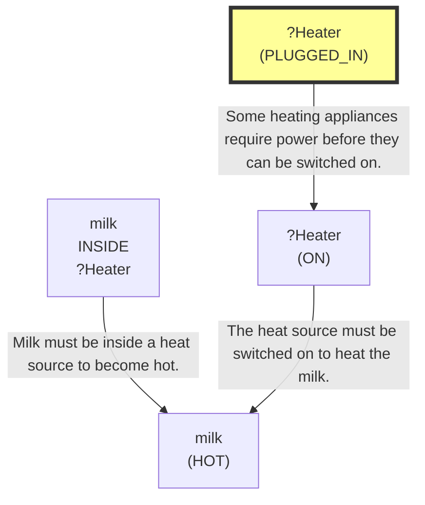
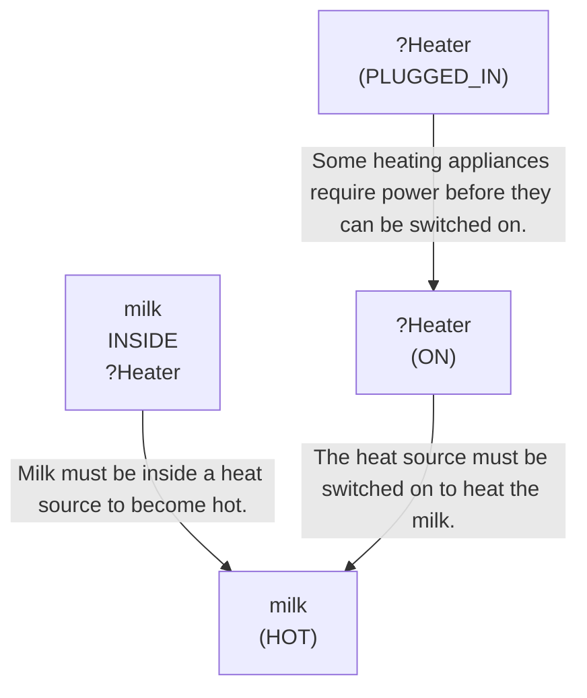
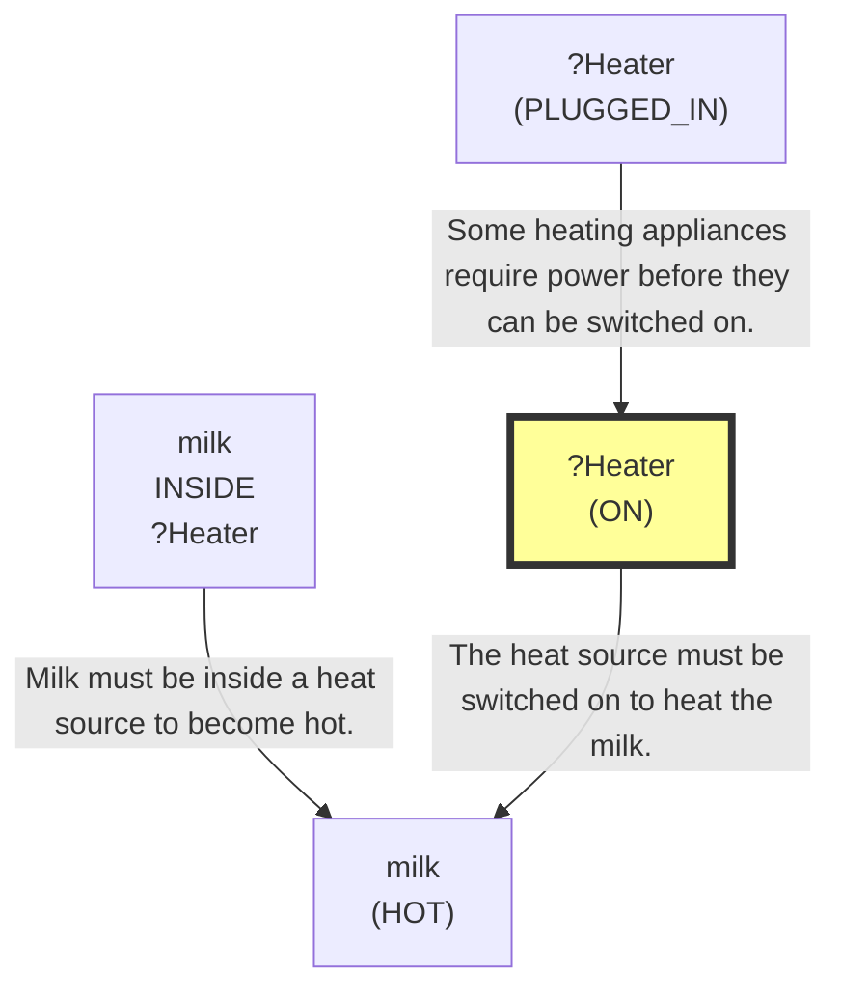
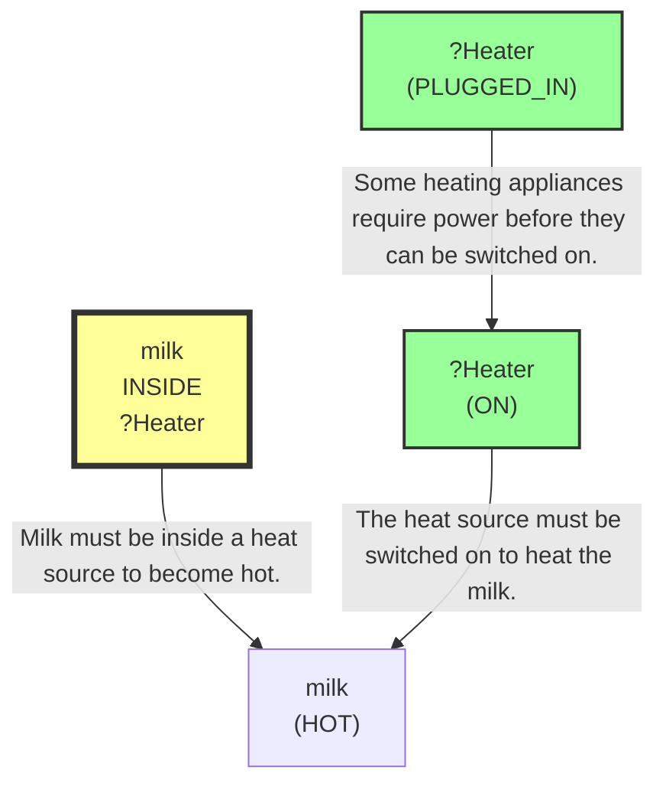
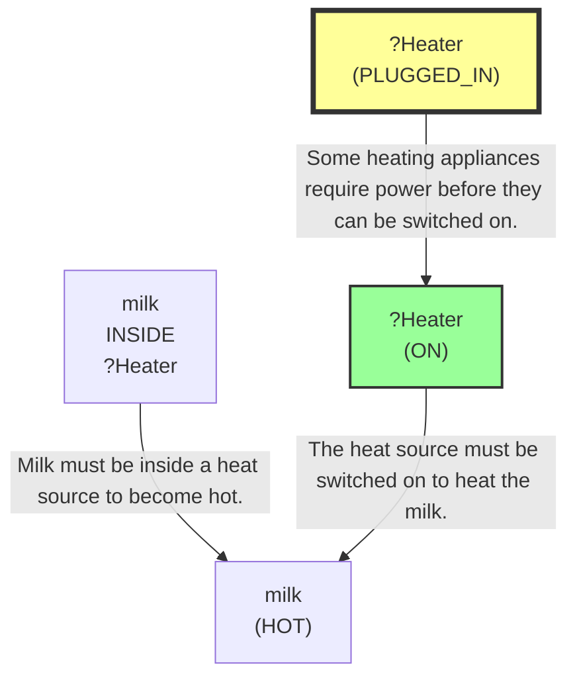

# 🚀 VirtualHome Agent Episode Log


### [GoalReasoner (Module A - Intent)] Output
```json
{
  "is_instruction_obviously_vague": false,
  "clarification_question": null,
  "target_object": "milk",
  "location_hint": null,
  "reasoning_chain": [
    {
      "question": "Why does the user want this object?",
      "answer": "To have the milk in a warmer state."
    },
    {
      "question": "Why is that important?",
      "answer": "Because the current temperature is cold and the user wants it heated."
    },
    {
      "question": "What fundamental need does this fulfill?",
      "answer": "It fulfills the need to warm a consumable liquid to a desired temperature."
    },
    {
      "question": "Are there any deeper psychological or physical motivations?",
      "answer": "The likely motivation is comfort or preference for a warm beverage or ingredient."
    }
  ],
  "deep_intent": "The user wants to warm a consumable liquid to a less cold temperature.",
  "acceptable_alternatives_properties": [
    {
      "priority": 1,
      "description": "Other drinkable liquids that can be safely warmed, such as water, hot chocolate, or a beverage mix."
    },
    {
      "priority": 2,
      "description": "Other refrigerated beverages that are commonly heated for comfort or use, such as plant-based milk or cream."
    },
    {
      "priority": 3,
      "description": "Warm drinks that serve the same comfort or consumption purpose, such as tea or coffee."
    },
    {
      "priority": 4,
      "description": "Any safe warm beverage that can replace the need for a heated drink."
    }
  ]
}
```

### [PerceptionFilter] Output
```json
{
  "reasoning": "The goal is to heat milk, so we must keep the target object milk and all plausible heating appliances that can serve as the required heater. Per backup retention, both microwave and stove are included as alternative heat sources, along with the powersocket needed to plug in an appliance if required.",
  "selected_classes": [
    "stove",
    "microwave",
    "character",
    "powersocket",
    "milk"
  ],
  "raw_class_count": 50
}
```

### [LLMExecutor] Output
```json
{
  "reasoning": "The goal is to heat milk. The SDG requires a heater that is ON, PLUGGED_IN, and then the milk inside it. The filtered graph shows a stove(163) with HAS_SWITCH and as a container, and it is not blocked by the temporary microwave ban. Since the stove is already in the kitchen and is the best available heater that does not require a plug, the next step is to walk to the stove so I can subsequently open/switch it on and place the milk inside.",
  "satisfied_nodes": [],
  "current_node_focus": "N3",
  "mapped_variables": {
    "?Heater": "stove(163)"
  },
  "action": "[walk] <stove> (163)"
}
```

### [RoboStateMultiTaskController] Output
```json
{
  "action": "[walk] <stove> (163)",
  "active_task_id": "task_1",
  "task_context": {
    "active_task_id": "task_1",
    "pending_task_ids": [],
    "satisfied_task_ids": []
  },
  "source": "llm_executor"
}
```
## Step 0
- **Action**: `[walk] <stove> (163)`
- **Action Success**: `True`
- **Action Message**: {'0': {'message': 'Success'}}
- **Active Task**: `task_1`
- **Decision Source**: `llm_executor`
- **Task Progress**: T3_without_memory_M3_15=pending
- **SDG Status**:

- **Observed Items (11)**: powersocket(57), stove(163) [OFF,CLOSED], microwave(171) [CLOSED,OFF], milk(177) [CLOSED,COLD], milk(176) [CLOSED,COLD], character(1), kitchen(11), livingroom(183), bedroom(241), bathroom(285), bedroom(346)


### [PerceptionFilter] Output
```json
{
  "reasoning": "Reused cached class selection.",
  "selected_classes": [
    "stove",
    "microwave",
    "character",
    "powersocket",
    "milk"
  ],
  "raw_class_count": 50
}
```

### [LLMExecutor] Output
```json
{
  "reasoning": "The goal is to make milk hot. The microwave is temporarily unavailable, so the viable heater in the current graph is the stove(163), which is closed and off but has HAS_SWITCH and CAN_OPEN. To progress toward the SDG, I should first move next to the stove before I can open/switch it on or place milk inside. No nodes are satisfied yet because milk is not hot, the heater is not on or plugged in, and milk is not inside any heater.",
  "satisfied_nodes": [],
  "current_node_focus": "N3",
  "mapped_variables": {
    "?Heater": "stove(163)"
  },
  "action": "[walk] <stove> (163)"
}
```

### [RoboStateMultiTaskController] Output
```json
{
  "action": "[walk] <stove> (163)",
  "active_task_id": "task_1",
  "task_context": {
    "active_task_id": "task_1",
    "pending_task_ids": [],
    "satisfied_task_ids": []
  },
  "source": "llm_executor"
}
```
## Step 1
- **Action**: `[walk] <stove> (163)`
- **Action Success**: `True`
- **Action Message**: {'0': {'message': 'Success'}}
- **Active Task**: `task_1`
- **Decision Source**: `llm_executor`
- **Task Progress**: T3_without_memory_M3_15=pending
- **SDG Status**:

- **Observed Items (11)**: powersocket(57), stove(163) [OFF,CLOSED], microwave(171) [CLOSED,OFF], milk(177) [CLOSED,COLD], milk(176) [CLOSED,COLD], character(1), kitchen(11), livingroom(183), bedroom(241), bathroom(285), bedroom(346)


### [PerceptionFilter] Output
```json
{
  "reasoning": "Reused cached class selection.",
  "selected_classes": [
    "stove",
    "microwave",
    "character",
    "powersocket",
    "milk"
  ],
  "raw_class_count": 50
}
```

### [LLMExecutor] Output
```json
{
  "reasoning": "The goal is to make milk HOT. The SDG indicates the heater must be plugged in and switched on before the milk can be placed inside it. The microwave would be a valid heater, but it is temporarily occupied by someone else and the active rule forbids using or opening it until step 6. The stove is available in the current graph, has HAS_SWITCH, and does not require plugging in, so it is the best usable heater candidate. I am currently in the kitchen and close to the stove, but I must explicitly walk to the stove before interacting with it.",
  "satisfied_nodes": [],
  "current_node_focus": "N3",
  "mapped_variables": {
    "?Heater": "stove(163)"
  },
  "action": "[walk] <stove> (163)"
}
```

### [RoboStateMultiTaskController] Output
```json
{
  "action": "[walk] <livingroom> (183)",
  "active_task_id": null,
  "task_context": {
    "active_task_id": null,
    "pending_task_ids": [
      "task_1"
    ],
    "satisfied_task_ids": []
  },
  "source": "loop_recovery_room_revisit"
}
```
## Step 2
- **Action**: `[walk] <livingroom> (183)`
- **Action Success**: `True`
- **Action Message**: {'0': {'message': 'Success'}}
- **Decision Source**: `loop_recovery_room_revisit`
- **Task Progress**: T3_without_memory_M3_15=pending
- **SDG Status**:
No SDG active.
- **Observed Items (159)**: wall(12), wall(13), wall(14), wall(15), wall(16), wall(17), wall(18), wall(19), wall(20), wall(21), floor(22), floor(23), floor(24), floor(25), floor(26)...


### [RoboStateMultiTaskController] Output
```json
{
  "action": "[walk] <bedroom> (241)",
  "active_task_id": "task_1",
  "task_context": {
    "active_task_id": "task_1",
    "pending_task_ids": [],
    "satisfied_task_ids": []
  },
  "source": "room_frontier"
}
```
## Step 3
- **Action**: `[walk] <bedroom> (241)`
- **Action Success**: `True`
- **Action Message**: {'0': {'message': 'Success'}}
- **Active Task**: `task_1`
- **Decision Source**: `room_frontier`
- **Task Progress**: T3_without_memory_M3_15=pending
- **SDG Status**:

- **Observed Items (58)**: floor(184), floor(185), floor(186), floor(187), floor(188), floor(189), wall(190), wall(191), wall(192), wall(193), wall(194), wall(195), ceiling(196), ceiling(197), ceiling(198)...


### [RoboStateMultiTaskController] Output
```json
{
  "action": "[walk] <bathroom> (285)",
  "active_task_id": "task_1",
  "task_context": {
    "active_task_id": "task_1",
    "pending_task_ids": [],
    "satisfied_task_ids": []
  },
  "source": "room_frontier"
}
```
## Step 4
- **Action**: `[walk] <bathroom> (285)`
- **Action Success**: `True`
- **Action Message**: {'0': {'message': 'Success'}}
- **Active Task**: `task_1`
- **Decision Source**: `room_frontier`
- **Task Progress**: T3_without_memory_M3_15=pending
- **SDG Status**:

- **Observed Items (38)**: floor(242), floor(243), floor(244), floor(245), ceiling(246), ceiling(247), ceiling(248), ceiling(249), wall(250), wall(251), wall(252), wall(253), door(254) [OPEN], ceilinglamp(255), tablelamp(256) [ON]...


### [RoboStateMultiTaskController] Output
```json
{
  "action": "[walk] <bedroom> (346)",
  "active_task_id": "task_1",
  "task_context": {
    "active_task_id": "task_1",
    "pending_task_ids": [],
    "satisfied_task_ids": []
  },
  "source": "room_frontier"
}
```
## Step 5
- **Action**: `[walk] <bedroom> (346)`
- **Action Success**: `True`
- **Action Message**: {'0': {'message': 'Success'}}
- **Active Task**: `task_1`
- **Decision Source**: `room_frontier`
- **Task Progress**: T3_without_memory_M3_15=pending
- **SDG Status**:

- **Observed Items (66)**: wall(286), wall(287), wall(288), wall(289), wall(290), wall(291), floor(292), floor(293), floor(294), floor(295), floor(296), floor(297), ceiling(298), ceiling(299), ceiling(300)...


### [RoboStateMultiTaskController] Output
```json
{
  "action": "[walk] <kitchen> (11)",
  "active_task_id": null,
  "task_context": {
    "active_task_id": null,
    "pending_task_ids": [
      "task_1"
    ],
    "satisfied_task_ids": []
  },
  "source": "loop_recovery_room_revisit"
}
```
## Step 6
- **Action**: `[walk] <kitchen> (11)`
- **Action Success**: `True`
- **Action Message**: {'0': {'message': 'Success'}}
- **Decision Source**: `loop_recovery_room_revisit`
- **Task Progress**: T3_without_memory_M3_15=pending
- **SDG Status**:
No SDG active.
- **Observed Items (64)**: floor(347), floor(348), floor(349), floor(350), floor(351), floor(352), floor(353), floor(354), floor(355), wall(356), wall(357), wall(358), wall(359), wall(360), wall(361)...


### [PerceptionFilter] Output
```json
{
  "reasoning": "Reused cached class selection.",
  "selected_classes": [
    "stove",
    "microwave",
    "character",
    "powersocket",
    "milk"
  ],
  "raw_class_count": 50
}
```

### [LLMExecutor] Output
```json
{
  "reasoning": "The goal is to make milk HOT. The SDG requires a heater that is PLUGGED_IN and ON, and the milk must be inside it. From the filtered graph, microwave(171) is the best heater candidate because it has HAS_PLUG and HAS_SWITCH and is a container. The first unmet prerequisite is plugging it in; I am not already shown as near it, so per proximity rules the next atomic step must be to walk to the microwave before any plug/switch action.",
  "satisfied_nodes": [],
  "current_node_focus": "N3",
  "mapped_variables": {
    "?Heater": "microwave(171)"
  },
  "action": "[walk] <microwave> (171)"
}
```

### [RoboStateMultiTaskController] Output
```json
{
  "action": "[walk] <microwave> (171)",
  "active_task_id": "task_1",
  "task_context": {
    "active_task_id": "task_1",
    "pending_task_ids": [],
    "satisfied_task_ids": []
  },
  "source": "llm_executor"
}
```
## Step 7
- **Action**: `[walk] <microwave> (171)`
- **Action Success**: `True`
- **Action Message**: {'0': {'message': 'Success'}}
- **Active Task**: `task_1`
- **Decision Source**: `llm_executor`
- **Task Progress**: T3_without_memory_M3_15=pending
- **SDG Status**:

- **Observed Items (11)**: powersocket(57), stove(163) [OFF,CLOSED], microwave(171) [CLOSED,OFF], milk(177) [CLOSED,COLD], milk(176) [CLOSED,COLD], character(1), kitchen(11), livingroom(183), bedroom(241), bathroom(285), bedroom(346)


### [PerceptionFilter] Output
```json
{
  "reasoning": "Reused cached class selection.",
  "selected_classes": [
    "stove",
    "microwave",
    "character",
    "powersocket",
    "milk"
  ],
  "raw_class_count": 50
}
```

### [LLMExecutor] Output
```json
{
  "reasoning": "The goal requires a heater that is both PLUGGED_IN and ON, and the best available heater is the microwave(171) because it has HAS_PLUG and HAS_SWITCH. We are already close to the microwave, but it is currently OFF and closed. To progress toward heating the milk, the next required state is to turn the heater on; plugging it in is also required by the SDG, but the immediate actionable gap on the chosen heater is its OFF state. Since the microwave is already nearby, the next atomic action is to switch it on.",
  "satisfied_nodes": [],
  "current_node_focus": "N2",
  "mapped_variables": {
    "?Heater": "microwave(171)"
  },
  "action": "[switchon] <microwave> (171)"
}
```

### [RoboStateMultiTaskController] Output
```json
{
  "action": "[switchon] <microwave> (171)",
  "active_task_id": "task_1",
  "task_context": {
    "active_task_id": "task_1",
    "pending_task_ids": [],
    "satisfied_task_ids": []
  },
  "source": "llm_executor"
}
```
## Step 8
- **Action**: `[switchon] <microwave> (171)`
- **Action Success**: `True`
- **Action Message**: Faked switch operation in Python layer (bypassed Unity failure)
- **Active Task**: `task_1`
- **Decision Source**: `llm_executor`
- **Task Progress**: T3_without_memory_M3_15=pending
- **SDG Status**:

- **Observed Items (11)**: powersocket(57), stove(163) [OFF,CLOSED], microwave(171) [CLOSED,OFF], milk(177) [CLOSED,COLD], milk(176) [CLOSED,COLD], character(1), kitchen(11), livingroom(183), bedroom(241), bathroom(285), bedroom(346)


### [PerceptionFilter] Output
```json
{
  "reasoning": "Reused cached class selection.",
  "selected_classes": [
    "stove",
    "microwave",
    "character",
    "powersocket",
    "milk"
  ],
  "raw_class_count": 50
}
```

### [LLMExecutor] Output
```json
{
  "reasoning": "The goal is to make milk HOT. The SDG requires a heater that is PLUGGED_IN and ON, and the current graph shows a microwave(171) that is already ON, CLOSED, and has HAS_PLUG, so it is the best match for ?Heater. Since the milk(177) is already CLOSE to the character and the microwave is also close, the next needed step to progress toward placing milk inside the heater is to open the microwave first. This is necessary before the milk can be put inside.",
  "satisfied_nodes": [
    "N2",
    "N3"
  ],
  "current_node_focus": "N4",
  "mapped_variables": {
    "?Heater": "microwave(171)"
  },
  "action": "[open] <microwave> (171)"
}
```

### [RoboStateMultiTaskController] Output
```json
{
  "action": "[open] <microwave> (171)",
  "active_task_id": "task_1",
  "task_context": {
    "active_task_id": "task_1",
    "pending_task_ids": [],
    "satisfied_task_ids": []
  },
  "source": "llm_executor"
}
```
## Step 9
- **Action**: `[open] <microwave> (171)`
- **Action Success**: `True`
- **Action Message**: {'0': {'message': 'Success'}}
- **Active Task**: `task_1`
- **Decision Source**: `llm_executor`
- **Task Progress**: T3_without_memory_M3_15=pending
- **SDG Status**:

- **Observed Items (11)**: powersocket(57), stove(163) [OFF,CLOSED], microwave(171) [ON,CLOSED], milk(177) [CLOSED,COLD], milk(176) [CLOSED,COLD], character(1), kitchen(11), livingroom(183), bedroom(241), bathroom(285), bedroom(346)


### [PerceptionFilter] Output
```json
{
  "reasoning": "Reused cached class selection.",
  "selected_classes": [
    "stove",
    "microwave",
    "character",
    "powersocket",
    "milk"
  ],
  "raw_class_count": 50
}
```

### [LLMExecutor] Output
```json
{
  "reasoning": "The SDG requires a heater that is both PLUGGED_IN and ON, and the current graph shows the only viable heater candidate is microwave(171), which is already ON but not yet explicitly confirmed PLUGGED_IN. Since the task is to heat milk and the microwave is a valid heating appliance with HAS_PLUG, the next missing prerequisite toward making milk HOT is to plug it in before relying on its ON state. I cannot skip directly to putting milk inside because the goal depends on the heater state chain. The character is already close to the microwave, so the next atomic step is to plug it in.",
  "satisfied_nodes": [
    "N2"
  ],
  "current_node_focus": "N3",
  "mapped_variables": {
    "?Heater": "microwave(171)"
  },
  "action": "[plugin] <microwave> (171)"
}
```

### [RoboStateMultiTaskController] Output
```json
{
  "action": "[plugin] <microwave> (171)",
  "active_task_id": "task_1",
  "task_context": {
    "active_task_id": "task_1",
    "pending_task_ids": [],
    "satisfied_task_ids": []
  },
  "source": "llm_executor"
}
```
## Step 10
- **Action**: `[plugin] <microwave> (171)`
- **Action Success**: `True`
- **Action Message**: Faked plug operation in Python layer
- **Active Task**: `task_1`
- **Decision Source**: `llm_executor`
- **Task Progress**: T3_without_memory_M3_15=pending
- **SDG Status**:

- **Observed Items (11)**: powersocket(57), stove(163) [OFF,CLOSED], microwave(171) [OPEN,ON], milk(177) [CLOSED,COLD], milk(176) [CLOSED,COLD], character(1), kitchen(11), livingroom(183), bedroom(241), bathroom(285), bedroom(346)


### [PerceptionFilter] Output
```json
{
  "reasoning": "Reused cached class selection.",
  "selected_classes": [
    "stove",
    "microwave",
    "character",
    "powersocket",
    "milk"
  ],
  "raw_class_count": 50
}
```

### [LLMExecutor] Output
```json
{
  "reasoning": "The SDG requires choosing a heater that is ON and PLUGGED_IN, then placing milk inside it. The filtered graph already shows microwave(171) is ON and PLUGGED_IN, and it is the best available heater. The milk is currently close to the character, but to place it inside the microwave I must first be explicitly near the destination, and the microwave is currently open, which is acceptable for insertion. Since no prior walk action exists and the next prerequisite toward N4/N1 is to get near the heater, I will walk to the microwave.",
  "satisfied_nodes": [
    "N2",
    "N3"
  ],
  "current_node_focus": "N4",
  "mapped_variables": {
    "?Heater": "microwave(171)"
  },
  "action": "[walk] <microwave> (171)"
}
```

### [RoboStateMultiTaskController] Output
```json
{
  "action": "[walk] <microwave> (171)",
  "active_task_id": "task_1",
  "task_context": {
    "active_task_id": "task_1",
    "pending_task_ids": [],
    "satisfied_task_ids": []
  },
  "source": "llm_executor"
}
```
## Step 11
- **Action**: `[walk] <microwave> (171)`
- **Action Success**: `True`
- **Action Message**: {'0': {'message': 'Success'}}
- **Active Task**: `task_1`
- **Decision Source**: `llm_executor`
- **Task Progress**: T3_without_memory_M3_15=pending
- **SDG Status**:

- **Observed Items (11)**: powersocket(57), stove(163) [OFF,CLOSED], microwave(171) [OPEN,ON,PLUGGED_IN], milk(177) [CLOSED,COLD], milk(176) [CLOSED,COLD], character(1), kitchen(11), livingroom(183), bedroom(241), bathroom(285), bedroom(346)


### [PerceptionFilter] Output
```json
{
  "reasoning": "Reused cached class selection.",
  "selected_classes": [
    "stove",
    "microwave",
    "character",
    "powersocket",
    "milk"
  ],
  "raw_class_count": 50
}
```

### [LLMExecutor] Output
```json
{
  "reasoning": "The goal requires milk to be HOT inside a heater that is ON and PLUGGED_IN. The best available heater is microwave(171), which already satisfies ON and PLUGGED_IN, so N2 and N3 are already satisfied. The milk is currently not in the heater and is only close to the character, so the next required step is to walk to the milk before grabbing it and eventually placing it into the microwave. Since the instruction forbids repeating a walk action if just done, and no prior actions exist, walking to the milk is the correct next atomic step.",
  "satisfied_nodes": [
    "N2",
    "N3"
  ],
  "current_node_focus": "N4",
  "mapped_variables": {
    "?Heater": "microwave(171)"
  },
  "action": "[walk] <milk> (177)"
}
```

### [RoboStateMultiTaskController] Output
```json
{
  "action": "[walk] <milk> (177)",
  "active_task_id": "task_1",
  "task_context": {
    "active_task_id": "task_1",
    "pending_task_ids": [],
    "satisfied_task_ids": []
  },
  "source": "llm_executor"
}
```
## Step 12
- **Action**: `[walk] <milk> (177)`
- **Action Success**: `True`
- **Action Message**: {'0': {'message': 'Success'}}
- **Active Task**: `task_1`
- **Decision Source**: `llm_executor`
- **Task Progress**: T3_without_memory_M3_15=pending
- **SDG Status**:

- **Observed Items (11)**: powersocket(57), stove(163) [OFF,CLOSED], microwave(171) [OPEN,ON,PLUGGED_IN], milk(177) [CLOSED,COLD], milk(176) [CLOSED,COLD], character(1), kitchen(11), livingroom(183), bedroom(241), bathroom(285), bedroom(346)


### [PerceptionFilter] Output
```json
{
  "reasoning": "Reused cached class selection.",
  "selected_classes": [
    "stove",
    "microwave",
    "character",
    "powersocket",
    "milk"
  ],
  "raw_class_count": 50
}
```

### [LLMExecutor] Output
```json
{
  "reasoning": "The SDG requires a heater that is plugged in and switched on so the milk can be heated. The current graph shows the microwave(171) is already PLUGGED_IN and ON, and it is also CLOSE to the character. The milk(177) is also CLOSE to the character and is the best available milk instance to satisfy the HOT milk goal. Since the milk must be inside the heater, the next required step is to place the milk into the microwave. I must first be near the destination (microwave), and I already am according to the graph, so the next atomic action is to put the milk into it.",
  "satisfied_nodes": [
    "N2",
    "N3"
  ],
  "current_node_focus": "N4",
  "mapped_variables": {
    "?Heater": "microwave(171)"
  },
  "action": "[putin] <milk> (177) <microwave> (171)"
}
```

### [RoboStateMultiTaskController] Output
```json
{
  "action": "[grab] <milk> (177)",
  "active_task_id": "task_1",
  "task_context": {
    "active_task_id": "task_1",
    "pending_task_ids": [],
    "satisfied_task_ids": []
  },
  "source": "llm_executor_repaired"
}
```
## Step 13
- **Action**: `[grab] <milk> (177)`
- **Action Success**: `True`
- **Action Message**: {'0': {'message': 'Success'}}
- **Active Task**: `task_1`
- **Decision Source**: `llm_executor_repaired`
- **Task Progress**: T3_without_memory_M3_15=pending
- **SDG Status**:

- **Observed Items (11)**: powersocket(57), stove(163) [OFF,CLOSED], microwave(171) [OPEN,ON,PLUGGED_IN], milk(177) [CLOSED,COLD], milk(176) [CLOSED,COLD], character(1), kitchen(11), livingroom(183), bedroom(241), bathroom(285), bedroom(346)


### [PerceptionFilter] Output
```json
{
  "reasoning": "Reused cached class selection.",
  "selected_classes": [
    "stove",
    "microwave",
    "character",
    "powersocket",
    "milk"
  ],
  "raw_class_count": 50
}
```

### [LLMExecutor] Output
```json
{
  "reasoning": "The goal requires milk to become HOT inside a heater, and the only viable heater in the graph is the microwave(171), which is already ON and PLUGGED_IN. However, the microwave is currently OPEN, and to heat milk inside it we need to place the milk into the microwave first. The current state shows milk(177) is close to the character and held in the right hand, so the next required step is to be near the microwave before putting it in. Since the instruction says not to repeat a walk action if you just did it, and no prior walk exists, the correct immediate step is to walk to the microwave.",
  "satisfied_nodes": [
    "N3",
    "N2"
  ],
  "current_node_focus": "N4",
  "mapped_variables": {
    "?Heater": "microwave(171)"
  },
  "action": "[walk] <microwave> (171)"
}
```

### [RoboStateMultiTaskController] Output
```json
{
  "action": "[walk] <microwave> (171)",
  "active_task_id": "task_1",
  "task_context": {
    "active_task_id": "task_1",
    "pending_task_ids": [],
    "satisfied_task_ids": []
  },
  "source": "llm_executor"
}
```
## Step 14
- **Action**: `[walk] <microwave> (171)`
- **Action Success**: `True`
- **Action Message**: {'0': {'message': 'Success'}}
- **Active Task**: `task_1`
- **Decision Source**: `llm_executor`
- **Task Progress**: T3_without_memory_M3_15=pending
- **SDG Status**:

- **Observed Items (12)**: powersocket(57), stove(163) [OFF,CLOSED], microwave(171) [OPEN,ON,PLUGGED_IN], milk(176) [CLOSED,COLD], character(1), milk(177) [CLOSED,COLD], kitchen(11), livingroom(183), bedroom(241), bathroom(285), bedroom(346), milk(177) [CLOSED,COLD]

