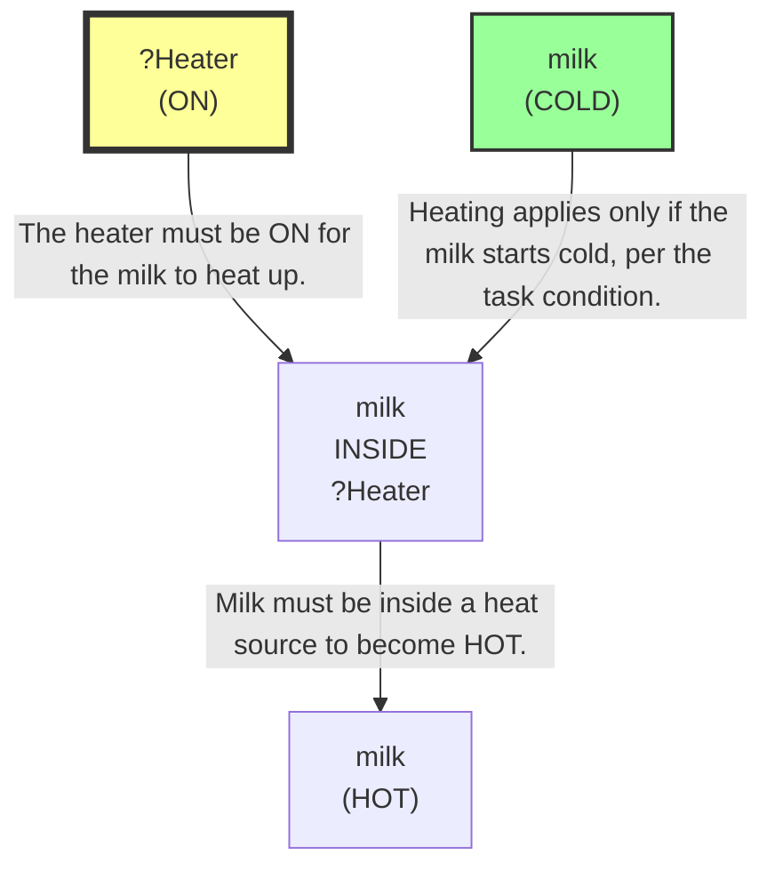
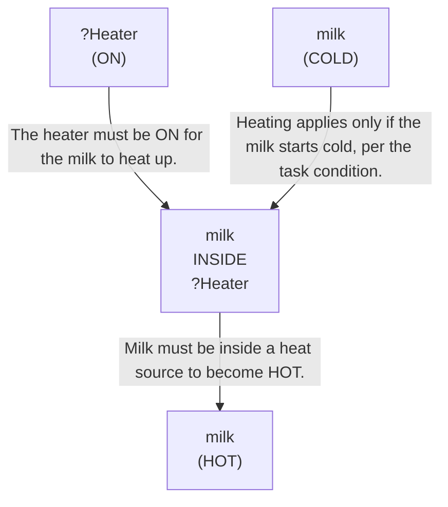
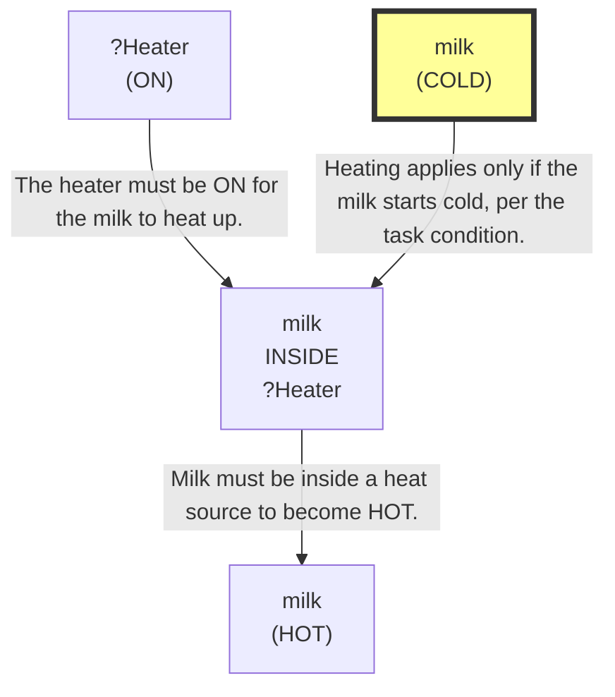
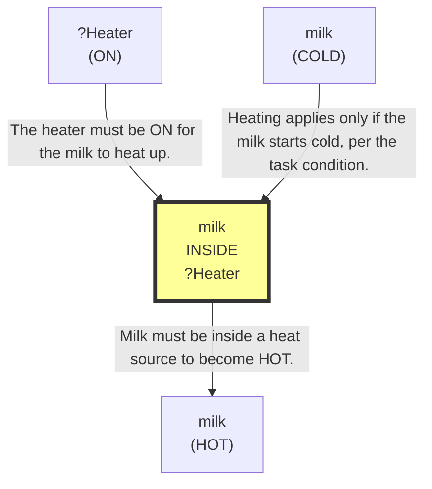
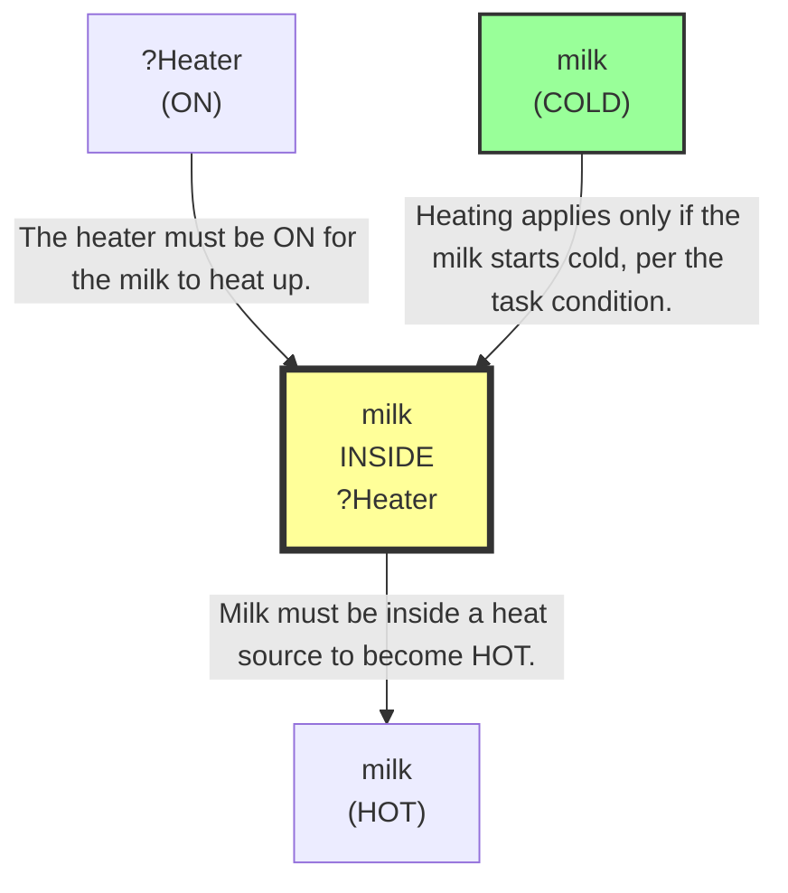

# 🚀 VirtualHome Agent Episode Log


### [GoalReasoner (Module A - Intent)] Output
```json
{
  "is_instruction_obviously_vague": false,
  "clarification_question": null,
  "target_object": "milk",
  "location_hint": null,
  "reasoning_chain": [
    {
      "question": "Why does the user want this object?",
      "answer": "To have the milk in a warmer state than it is now."
    },
    {
      "question": "Why is that important?",
      "answer": "Because the current temperature may be too cold for the intended use or preference."
    },
    {
      "question": "What fundamental need does this fulfill?",
      "answer": "It helps make a beverage or food item more suitable for consumption or preparation."
    },
    {
      "question": "Are there any deeper psychological or physical motivations?",
      "answer": "The user likely wants physical comfort, convenience, or to prepare the milk for drinking or mixing."
    }
  ],
  "deep_intent": "The user wants a cold beverage ingredient warmed to a more suitable temperature.",
  "acceptable_alternatives_properties": [
    {
      "priority": 1,
      "description": "Other liquid dairy or non-dairy beverages that can be safely warmed, such as cream or plant-based milk."
    },
    {
      "priority": 2,
      "description": "Other drink ingredients intended to be served warm, such as cocoa mix prepared with milk or a warm beverage base."
    },
    {
      "priority": 3,
      "description": "Ready-to-heat beverages or liquids in a household setting that can be warmed for drinking."
    },
    {
      "priority": 4,
      "description": "Other warm drinks that satisfy a comfort or warming need, such as tea or broth."
    }
  ]
}
```

### [PerceptionFilter] Output
```json
{
  "reasoning": "Needed items are the target milk plus all viable heating options and their implied control/utility locations. The SDG requires a heater that is ON, so I retain the available heat-capable appliances that could warm milk: microwave, stove, coffeemaker, and also pot/pan as necessary containers for heating on a stove. I also keep sink/faucet as a relevant household utility location if a transfer or prep step is needed, and fridge only as the likely current cold storage context for milk.",
  "selected_classes": [
    "fryingpan",
    "character",
    "milk",
    "stove",
    "microwave",
    "coffeemaker",
    "cookingpot",
    "fridge",
    "sink",
    "faucet"
  ],
  "raw_class_count": 50
}
```

### [LLMExecutor] Output
```json
{
  "reasoning": "The goal is to make milk HOT by placing it inside a heater that is ON. The microwave is temporarily unavailable due to an active global rule, so it cannot be used now. The stove is present and can function as a heater if switched on; the milk is currently cold and closed, and there are two milk instances. Since the character is close to milk(176), but we need to choose a heater target first only after deciding the heating route, the next actionable prerequisite toward heating is to walk to the stove so we can later open/switch it on and use a heat source. Focusing on the stove is the best route because it is a valid heater and not blocked by the microwave ban.",
  "satisfied_nodes": [
    "N4"
  ],
  "current_node_focus": "N3",
  "mapped_variables": {
    "?Heater": "stove(163)"
  },
  "action": "[walk] <stove> (163)"
}
```

### [RoboStateMultiTaskController] Output
```json
{
  "action": "[walk] <stove> (163)",
  "active_task_id": "task_1",
  "task_context": {
    "active_task_id": "task_1",
    "pending_task_ids": [],
    "satisfied_task_ids": []
  },
  "source": "llm_executor"
}
```
## Step 0
- **Action**: `[walk] <stove> (163)`
- **Action Success**: `True`
- **Action Message**: {'0': {'message': 'Success'}}
- **Active Task**: `task_1`
- **Decision Source**: `llm_executor`
- **Task Progress**: T3_without_memory_M3_15=pending
- **SDG Status**:

- **Observed Items (16)**: fryingpan(62), cookingpot(63) [CLOSED], sink(155), faucet(156) [OFF], fridge(162) [CLOSED], stove(163) [OFF,CLOSED], coffeemaker(169) [OFF], microwave(171) [CLOSED,OFF], milk(177) [COLD,CLOSED], milk(176) [COLD,CLOSED], character(1), kitchen(11), livingroom(183), bedroom(241), bathroom(285)...


### [PerceptionFilter] Output
```json
{
  "reasoning": "Reused cached class selection.",
  "selected_classes": [
    "fryingpan",
    "character",
    "milk",
    "stove",
    "microwave",
    "coffeemaker",
    "cookingpot",
    "fridge",
    "sink",
    "faucet"
  ],
  "raw_class_count": 50
}
```

### [LLMExecutor] Output
```json
{
  "reasoning": "The goal is to heat cold milk to HOT by placing it inside an ON heater. The microwave is temporarily unavailable, so I should use an alternative heater. The stove is present, has a heating surface/container relation, and is currently OFF. Since milk is currently in the kitchen and there are two candidate milk instances, both are COLD and CLOSED; either could satisfy the task. The next required step toward heating with the stove is to get near the stove before interacting with it. Because the character is already close to the stove, but the engine requires explicit walking before interacting with a destination, I will walk to the stove to enable turning it on next.",
  "satisfied_nodes": [
    "N4"
  ],
  "current_node_focus": "N3",
  "mapped_variables": {
    "?Heater": "stove(163)"
  },
  "action": "[walk] <stove> (163)"
}
```

### [RoboStateMultiTaskController] Output
```json
{
  "action": "[walk] <stove> (163)",
  "active_task_id": "task_1",
  "task_context": {
    "active_task_id": "task_1",
    "pending_task_ids": [],
    "satisfied_task_ids": []
  },
  "source": "llm_executor"
}
```
## Step 1
- **Action**: `[walk] <stove> (163)`
- **Action Success**: `True`
- **Action Message**: {'0': {'message': 'Success'}}
- **Active Task**: `task_1`
- **Decision Source**: `llm_executor`
- **Task Progress**: T3_without_memory_M3_15=pending
- **SDG Status**:

- **Observed Items (16)**: fryingpan(62), cookingpot(63) [CLOSED], sink(155), faucet(156) [OFF], fridge(162) [CLOSED], stove(163) [OFF,CLOSED], coffeemaker(169) [OFF], microwave(171) [CLOSED,OFF], milk(177) [COLD,CLOSED], milk(176) [COLD,CLOSED], character(1), kitchen(11), livingroom(183), bedroom(241), bathroom(285)...


### [PerceptionFilter] Output
```json
{
  "reasoning": "Reused cached class selection.",
  "selected_classes": [
    "fryingpan",
    "character",
    "milk",
    "stove",
    "microwave",
    "coffeemaker",
    "cookingpot",
    "fridge",
    "sink",
    "faucet"
  ],
  "raw_class_count": 50
}
```

### [LLMExecutor] Output
```json
{
  "reasoning": "The goal is to make the milk hot. The microwave is temporarily unavailable due to an active global rule, so I should not use it. The stove is present and close, and the fryingpan is already on the stove and close to me. Since the milk is not yet held or placed in a heater, the next step toward satisfying the SDG is to go to a usable heater/container destination and then heat via the stove setup. The immediate atomic action should be to move to the stove so I can interact with the heating setup next.",
  "satisfied_nodes": [],
  "current_node_focus": "N2",
  "mapped_variables": {
    "?Heater": "stove(163)"
  },
  "action": "[walk] <stove> (163)"
}
```

### [RoboStateMultiTaskController] Output
```json
{
  "action": "[walk] <livingroom> (183)",
  "active_task_id": null,
  "task_context": {
    "active_task_id": null,
    "pending_task_ids": [
      "task_1"
    ],
    "satisfied_task_ids": []
  },
  "source": "loop_recovery_room_revisit"
}
```
## Step 2
- **Action**: `[walk] <livingroom> (183)`
- **Action Success**: `True`
- **Action Message**: {'0': {'message': 'Success'}}
- **Decision Source**: `loop_recovery_room_revisit`
- **Task Progress**: T3_without_memory_M3_15=pending
- **SDG Status**:
No SDG active.
- **Observed Items (159)**: wall(12), wall(13), wall(14), wall(15), wall(16), wall(17), wall(18), wall(19), wall(20), wall(21), floor(22), floor(23), floor(24), floor(25), floor(26)...


### [RoboStateMultiTaskController] Output
```json
{
  "action": "[walk] <bedroom> (241)",
  "active_task_id": "task_1",
  "task_context": {
    "active_task_id": "task_1",
    "pending_task_ids": [],
    "satisfied_task_ids": []
  },
  "source": "room_frontier"
}
```
## Step 3
- **Action**: `[walk] <bedroom> (241)`
- **Action Success**: `True`
- **Action Message**: {'0': {'message': 'Success'}}
- **Active Task**: `task_1`
- **Decision Source**: `room_frontier`
- **Task Progress**: T3_without_memory_M3_15=pending
- **SDG Status**:

- **Observed Items (58)**: floor(184), floor(185), floor(186), floor(187), floor(188), floor(189), wall(190), wall(191), wall(192), wall(193), wall(194), wall(195), ceiling(196), ceiling(197), ceiling(198)...


### [RoboStateMultiTaskController] Output
```json
{
  "action": "[walk] <bathroom> (285)",
  "active_task_id": "task_1",
  "task_context": {
    "active_task_id": "task_1",
    "pending_task_ids": [],
    "satisfied_task_ids": []
  },
  "source": "room_frontier"
}
```
## Step 4
- **Action**: `[walk] <bathroom> (285)`
- **Action Success**: `True`
- **Action Message**: {'0': {'message': 'Success'}}
- **Active Task**: `task_1`
- **Decision Source**: `room_frontier`
- **Task Progress**: T3_without_memory_M3_15=pending
- **SDG Status**:

- **Observed Items (38)**: floor(242), floor(243), floor(244), floor(245), ceiling(246), ceiling(247), ceiling(248), ceiling(249), wall(250), wall(251), wall(252), wall(253), door(254) [OPEN], ceilinglamp(255), tablelamp(256) [ON]...


### [RoboStateMultiTaskController] Output
```json
{
  "action": "[walk] <bedroom> (346)",
  "active_task_id": "task_1",
  "task_context": {
    "active_task_id": "task_1",
    "pending_task_ids": [],
    "satisfied_task_ids": []
  },
  "source": "room_frontier"
}
```
## Step 5
- **Action**: `[walk] <bedroom> (346)`
- **Action Success**: `True`
- **Action Message**: {'0': {'message': 'Success'}}
- **Active Task**: `task_1`
- **Decision Source**: `room_frontier`
- **Task Progress**: T3_without_memory_M3_15=pending
- **SDG Status**:

- **Observed Items (66)**: wall(286), wall(287), wall(288), wall(289), wall(290), wall(291), floor(292), floor(293), floor(294), floor(295), floor(296), floor(297), ceiling(298), ceiling(299), ceiling(300)...


### [RoboStateMultiTaskController] Output
```json
{
  "action": "[walk] <kitchen> (11)",
  "active_task_id": null,
  "task_context": {
    "active_task_id": null,
    "pending_task_ids": [
      "task_1"
    ],
    "satisfied_task_ids": []
  },
  "source": "loop_recovery_room_revisit"
}
```
## Step 6
- **Action**: `[walk] <kitchen> (11)`
- **Action Success**: `True`
- **Action Message**: {'0': {'message': 'Success'}}
- **Decision Source**: `loop_recovery_room_revisit`
- **Task Progress**: T3_without_memory_M3_15=pending
- **SDG Status**:
No SDG active.
- **Observed Items (64)**: floor(347), floor(348), floor(349), floor(350), floor(351), floor(352), floor(353), floor(354), floor(355), wall(356), wall(357), wall(358), wall(359), wall(360), wall(361)...


### [PerceptionFilter] Output
```json
{
  "reasoning": "Reused cached class selection.",
  "selected_classes": [
    "fryingpan",
    "character",
    "milk",
    "stove",
    "microwave",
    "coffeemaker",
    "cookingpot",
    "fridge",
    "sink",
    "faucet"
  ],
  "raw_class_count": 50
}
```

### [LLMExecutor] Output
```json
{
  "reasoning": "The goal is to make milk hot. The SDG requires milk to be inside an ON heater. Among available heaters, the microwave(171) is a valid heater with HAS_SWITCH and CAN_OPEN. The milk objects (176, 177) are both cold and closed, and no prior actions exist, so the first necessary step is to move close to one milk instance before grabbing it. I choose milk(176) as a valid candidate to bind to milk.",
  "satisfied_nodes": [],
  "current_node_focus": "N4",
  "mapped_variables": {
    "?Heater": "microwave(171)"
  },
  "action": "[walk] <milk> (176)"
}
```

### [RoboStateMultiTaskController] Output
```json
{
  "action": "[walk] <milk> (176)",
  "active_task_id": "task_1",
  "task_context": {
    "active_task_id": "task_1",
    "pending_task_ids": [],
    "satisfied_task_ids": []
  },
  "source": "llm_executor"
}
```
## Step 7
- **Action**: `[walk] <milk> (176)`
- **Action Success**: `True`
- **Action Message**: {'0': {'message': 'Success'}}
- **Active Task**: `task_1`
- **Decision Source**: `llm_executor`
- **Task Progress**: T3_without_memory_M3_15=pending
- **SDG Status**:

- **Observed Items (16)**: fryingpan(62), cookingpot(63) [CLOSED], sink(155), faucet(156) [OFF], fridge(162) [CLOSED], stove(163) [OFF,CLOSED], coffeemaker(169) [OFF], microwave(171) [CLOSED,OFF], milk(177) [COLD,CLOSED], milk(176) [COLD,CLOSED], character(1), kitchen(11), livingroom(183), bedroom(241), bathroom(285)...


### [PerceptionFilter] Output
```json
{
  "reasoning": "Reused cached class selection.",
  "selected_classes": [
    "fryingpan",
    "character",
    "milk",
    "stove",
    "microwave",
    "coffeemaker",
    "cookingpot",
    "fridge",
    "sink",
    "faucet"
  ],
  "raw_class_count": 50
}
```

### [LLMExecutor] Output
```json
{
  "reasoning": "The goal is to make milk HOT by placing it inside an ON heater. The current graph shows two milk instances, and milk(176) is explicitly CLOSE to the character, making it the best bind for the target milk object. It is COLD, which matches the required starting condition. No heater is currently ON, so the immediate next step is to approach the most plausible heater, the stove(163), which has a heat source and is a valid candidate for ?Heater. I need to walk there before any interaction due to the proximity rule.",
  "satisfied_nodes": [
    "N4"
  ],
  "current_node_focus": "N3",
  "mapped_variables": {
    "?Heater": "stove(163)"
  },
  "action": "[walk] <stove> (163)"
}
```

### [RoboStateMultiTaskController] Output
```json
{
  "action": "[walk] <stove> (163)",
  "active_task_id": "task_1",
  "task_context": {
    "active_task_id": "task_1",
    "pending_task_ids": [],
    "satisfied_task_ids": []
  },
  "source": "llm_executor"
}
```
## Step 8
- **Action**: `[walk] <stove> (163)`
- **Action Success**: `True`
- **Action Message**: {'0': {'message': 'Success'}}
- **Active Task**: `task_1`
- **Decision Source**: `llm_executor`
- **Task Progress**: T3_without_memory_M3_15=pending
- **SDG Status**:

- **Observed Items (16)**: fryingpan(62), cookingpot(63) [CLOSED], sink(155), faucet(156) [OFF], fridge(162) [CLOSED], stove(163) [OFF,CLOSED], coffeemaker(169) [OFF], microwave(171) [CLOSED,OFF], milk(177) [COLD,CLOSED], milk(176) [COLD,CLOSED], character(1), kitchen(11), livingroom(183), bedroom(241), bathroom(285)...


### [PerceptionFilter] Output
```json
{
  "reasoning": "Reused cached class selection.",
  "selected_classes": [
    "fryingpan",
    "character",
    "milk",
    "stove",
    "microwave",
    "coffeemaker",
    "cookingpot",
    "fridge",
    "sink",
    "faucet"
  ],
  "raw_class_count": 50
}
```

### [LLMExecutor] Output
```json
{
  "reasoning": "The goal is to heat milk until it becomes HOT. The current graph shows two candidate milk objects, both COLD and CLOSED, with no heater state yet satisfied. To make progress, I should first choose one milk instance to work with. Since both are equivalent in current states/properties, either is acceptable; I will bind the task target to milk(176) and move toward it before any grab action, per proximity rules.",
  "satisfied_nodes": [],
  "current_node_focus": "N4",
  "mapped_variables": {
    "?Heater": "stove(163)"
  },
  "action": "[walk] <milk> (176)"
}
```

### [RoboStateMultiTaskController] Output
```json
{
  "action": "[walk] <milk> (176)",
  "active_task_id": "task_1",
  "task_context": {
    "active_task_id": "task_1",
    "pending_task_ids": [],
    "satisfied_task_ids": []
  },
  "source": "llm_executor"
}
```
## Step 9
- **Action**: `[walk] <milk> (176)`
- **Action Success**: `True`
- **Action Message**: {'0': {'message': 'Success'}}
- **Active Task**: `task_1`
- **Decision Source**: `llm_executor`
- **Task Progress**: T3_without_memory_M3_15=pending
- **SDG Status**:

- **Observed Items (16)**: fryingpan(62), cookingpot(63) [CLOSED], sink(155), faucet(156) [OFF], fridge(162) [CLOSED], stove(163) [OFF,CLOSED], coffeemaker(169) [OFF], microwave(171) [CLOSED,OFF], milk(177) [COLD,CLOSED], milk(176) [COLD,CLOSED], character(1), kitchen(11), livingroom(183), bedroom(241), bathroom(285)...


### [PerceptionFilter] Output
```json
{
  "reasoning": "Reused cached class selection.",
  "selected_classes": [
    "fryingpan",
    "character",
    "milk",
    "stove",
    "microwave",
    "coffeemaker",
    "cookingpot",
    "fridge",
    "sink",
    "faucet"
  ],
  "raw_class_count": 50
}
```

### [LLMExecutor] Output
```json
{
  "reasoning": "The goal is to heat milk until it becomes HOT and is inside a heater that is ON. The best available heater is the microwave(171), which has HAS_SWITCH and CAN_OPEN. Since I am currently in the kitchen and not yet at the microwave, the next required step is to walk to the microwave before I can open or switch it on. The milk candidates are milk(176) and milk(177); milk(176) is currently CLOSE to the character and already COLD/CLOSED, so it is the most accessible choice once I can interact with it.",
  "satisfied_nodes": [],
  "current_node_focus": "N2",
  "mapped_variables": {
    "?Heater": "microwave(171)"
  },
  "action": "[walk] <microwave> (171)"
}
```

### [RoboStateMultiTaskController] Output
```json
{
  "action": "[walk] <microwave> (171)",
  "active_task_id": "task_1",
  "task_context": {
    "active_task_id": "task_1",
    "pending_task_ids": [],
    "satisfied_task_ids": []
  },
  "source": "llm_executor"
}
```
## Step 10
- **Action**: `[walk] <microwave> (171)`
- **Action Success**: `True`
- **Action Message**: {'0': {'message': 'Success'}}
- **Active Task**: `task_1`
- **Decision Source**: `llm_executor`
- **Task Progress**: T3_without_memory_M3_15=pending
- **SDG Status**:

- **Observed Items (16)**: fryingpan(62), cookingpot(63) [CLOSED], sink(155), faucet(156) [OFF], fridge(162) [CLOSED], stove(163) [OFF,CLOSED], coffeemaker(169) [OFF], microwave(171) [CLOSED,OFF], milk(177) [COLD,CLOSED], milk(176) [COLD,CLOSED], character(1), kitchen(11), livingroom(183), bedroom(241), bathroom(285)...


### [PerceptionFilter] Output
```json
{
  "reasoning": "Reused cached class selection.",
  "selected_classes": [
    "fryingpan",
    "character",
    "milk",
    "stove",
    "microwave",
    "coffeemaker",
    "cookingpot",
    "fridge",
    "sink",
    "faucet"
  ],
  "raw_class_count": 50
}
```

### [LLMExecutor] Output
```json
{
  "reasoning": "The goal is to make milk hot by placing it inside an active heater. The filtered graph shows two milk instances, both cold and closed. Since the character is already close to milk(177), the first required step is to move to the specific milk object before grabbing it. I will bind ?Heater to microwave(171) later because it is a valid heater and is currently nearby, but I cannot interact with it until I have the milk in hand and can then walk to it. Current focus is to satisfy the prerequisite of acquiring the milk.",
  "satisfied_nodes": [],
  "current_node_focus": "N4",
  "mapped_variables": {
    "?Heater": "microwave(171)"
  },
  "action": "[walk] <milk> (177)"
}
```

### [RoboStateMultiTaskController] Output
```json
{
  "action": "[walk] <milk> (177)",
  "active_task_id": "task_1",
  "task_context": {
    "active_task_id": "task_1",
    "pending_task_ids": [],
    "satisfied_task_ids": []
  },
  "source": "llm_executor"
}
```
## Step 11
- **Action**: `[walk] <milk> (177)`
- **Action Success**: `True`
- **Action Message**: {'0': {'message': 'Success'}}
- **Active Task**: `task_1`
- **Decision Source**: `llm_executor`
- **Task Progress**: T3_without_memory_M3_15=pending
- **SDG Status**:

- **Observed Items (16)**: fryingpan(62), cookingpot(63) [CLOSED], sink(155), faucet(156) [OFF], fridge(162) [CLOSED], stove(163) [OFF,CLOSED], coffeemaker(169) [OFF], microwave(171) [CLOSED,OFF], milk(177) [COLD,CLOSED], milk(176) [COLD,CLOSED], character(1), kitchen(11), livingroom(183), bedroom(241), bathroom(285)...


### [PerceptionFilter] Output
```json
{
  "reasoning": "Reused cached class selection.",
  "selected_classes": [
    "fryingpan",
    "character",
    "milk",
    "stove",
    "microwave",
    "coffeemaker",
    "cookingpot",
    "fridge",
    "sink",
    "faucet"
  ],
  "raw_class_count": 50
}
```

### [LLMExecutor] Output
```json
{
  "reasoning": "The goal is to heat milk until it is HOT and inside a heater that is ON. The current graph shows two candidate milk objects, both COLD and CLOSED, with milk(177) close to the character. A heater must be selected from the available appliances; the microwave(171) is a valid heater candidate because it is a switchable appliance and already close to the character. Since I cannot turn it on until I am at it, the single next step should be to walk to the microwave. This advances toward satisfying N3 and enables the later open/switch-on/putin sequence.",
  "satisfied_nodes": [
    "N4"
  ],
  "current_node_focus": "N3",
  "mapped_variables": {
    "?Heater": "microwave(171)"
  },
  "action": "[walk] <microwave> (171)"
}
```

### [RoboStateMultiTaskController] Output
```json
{
  "action": "[walk] <microwave> (171)",
  "active_task_id": "task_1",
  "task_context": {
    "active_task_id": "task_1",
    "pending_task_ids": [],
    "satisfied_task_ids": []
  },
  "source": "llm_executor"
}
```
## Step 12
- **Action**: `[walk] <microwave> (171)`
- **Action Success**: `True`
- **Action Message**: {'0': {'message': 'Success'}}
- **Active Task**: `task_1`
- **Decision Source**: `llm_executor`
- **Task Progress**: T3_without_memory_M3_15=pending
- **SDG Status**:

- **Observed Items (16)**: fryingpan(62), cookingpot(63) [CLOSED], sink(155), faucet(156) [OFF], fridge(162) [CLOSED], stove(163) [OFF,CLOSED], coffeemaker(169) [OFF], microwave(171) [CLOSED,OFF], milk(177) [COLD,CLOSED], milk(176) [COLD,CLOSED], character(1), kitchen(11), livingroom(183), bedroom(241), bathroom(285)...


### [PerceptionFilter] Output
```json
{
  "reasoning": "Reused cached class selection.",
  "selected_classes": [
    "fryingpan",
    "character",
    "milk",
    "stove",
    "microwave",
    "coffeemaker",
    "cookingpot",
    "fridge",
    "sink",
    "faucet"
  ],
  "raw_class_count": 50
}
```

### [LLMExecutor] Output
```json
{
  "reasoning": "The goal is to make the milk HOT by placing it inside an ON heater. Among the available heaters, the microwave(171) is a suitable heat source and is currently CLOSE to the character and CLOSED/OFF. Since I must explicitly walk to the destination before interacting with it, the immediate needed step is to approach the microwave so I can open and turn it on next.",
  "satisfied_nodes": [
    "N4"
  ],
  "current_node_focus": "N2",
  "mapped_variables": {
    "?Heater": "microwave(171)"
  },
  "action": "[walk] <microwave> (171)"
}
```

### [RoboStateMultiTaskController] Output
```json
{
  "action": "[walk] <microwave> (171)",
  "active_task_id": "task_1",
  "task_context": {
    "active_task_id": "task_1",
    "pending_task_ids": [],
    "satisfied_task_ids": []
  },
  "source": "llm_executor"
}
```
## Step 13
- **Action**: `[walk] <microwave> (171)`
- **Action Success**: `True`
- **Action Message**: {'0': {'message': 'Success'}}
- **Active Task**: `task_1`
- **Decision Source**: `llm_executor`
- **Task Progress**: T3_without_memory_M3_15=pending
- **SDG Status**:

- **Observed Items (16)**: fryingpan(62), cookingpot(63) [CLOSED], sink(155), faucet(156) [OFF], fridge(162) [CLOSED], stove(163) [OFF,CLOSED], coffeemaker(169) [OFF], microwave(171) [CLOSED,OFF], milk(177) [COLD,CLOSED], milk(176) [COLD,CLOSED], character(1), kitchen(11), livingroom(183), bedroom(241), bathroom(285)...


### [PerceptionFilter] Output
```json
{
  "reasoning": "Reused cached class selection.",
  "selected_classes": [
    "fryingpan",
    "character",
    "milk",
    "stove",
    "microwave",
    "coffeemaker",
    "cookingpot",
    "fridge",
    "sink",
    "faucet"
  ],
  "raw_class_count": 50
}
```

### [LLMExecutor] Output
```json
{
  "reasoning": "The goal is to make milk hot. The SDG requires a milk object that is COLD, inside a heater, and the heater ON. In the current graph, milk(177) is the best match because it is COLD and nearby, and microwave(171) is a valid heater because it is a closable appliance with HAS_SWITCH and is also nearby. Before I can open or use the microwave, I must explicitly walk to it first due to the proximity rule.",
  "satisfied_nodes": [
    "N4"
  ],
  "current_node_focus": "N3",
  "mapped_variables": {
    "?Heater": "microwave(171)"
  },
  "action": "[walk] <microwave> (171)"
}
```

### [RoboStateMultiTaskController] Output
```json
{
  "action": "[walk] <livingroom> (183)",
  "active_task_id": null,
  "task_context": {
    "active_task_id": null,
    "pending_task_ids": [
      "task_1"
    ],
    "satisfied_task_ids": []
  },
  "source": "loop_recovery_room_revisit"
}
```
## Step 14
- **Action**: `[walk] <livingroom> (183)`
- **Action Success**: `True`
- **Action Message**: {'0': {'message': 'Success'}}
- **Decision Source**: `loop_recovery_room_revisit`
- **Task Progress**: T3_without_memory_M3_15=pending
- **SDG Status**:
No SDG active.
- **Observed Items (159)**: wall(12), wall(13), wall(14), wall(15), wall(16), wall(17), wall(18), wall(19), wall(20), wall(21), floor(22), floor(23), floor(24), floor(25), floor(26)...

