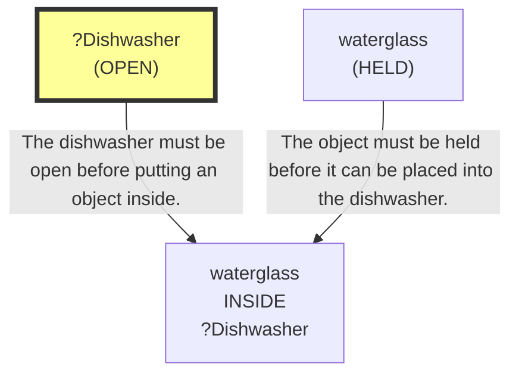
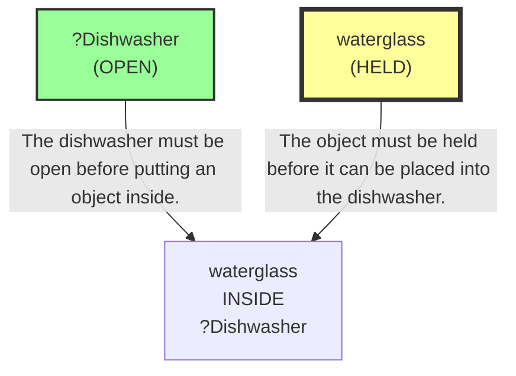
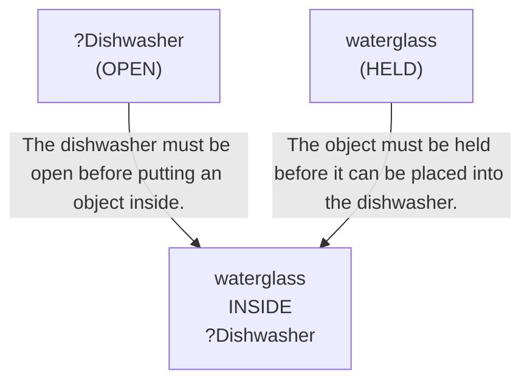
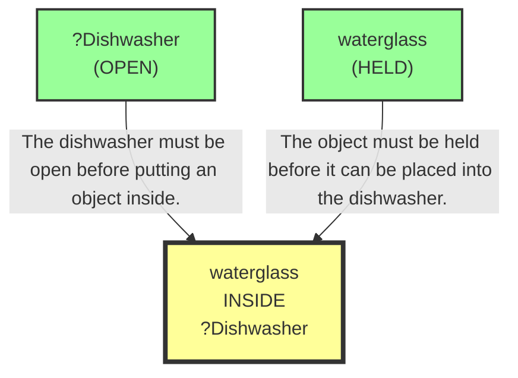

# 🚀 VirtualHome Agent Episode Log


### [GoalReasoner (Module A - Intent)] Output
```json
{
  "is_instruction_obviously_vague": false,
  "clarification_question": null,
  "target_object": "waterglass",
  "location_hint": "dishwasher",
  "reasoning_chain": [
    {
      "question": "Why does the user want this object placed in the dishwasher?",
      "answer": "To have the used glass cleaned."
    },
    {
      "question": "Why is cleaning the glass important?",
      "answer": "To remove residue and make it ready for future use."
    },
    {
      "question": "What fundamental need does this fulfill?",
      "answer": "Maintaining clean, usable drinkware in the home."
    },
    {
      "question": "Are there any deeper psychological or physical motivations?",
      "answer": "The user likely wants to reduce clutter and keep the kitchen organized while ensuring the item is sanitized."
    }
  ],
  "deep_intent": "The user wants to clean a used drinking vessel and keep the kitchen organized.",
  "acceptable_alternatives_properties": [
    {
      "priority": 1,
      "description": "Other used drinkware that can be safely washed in the dishwasher, such as a cup, mug, or tumbler"
    },
    {
      "priority": 2,
      "description": "Other dishwasher-safe kitchenware items that need cleaning, such as small bowls or plates"
    },
    {
      "priority": 3,
      "description": "Any dirty dishwasher-safe dishes or utensils that help reduce kitchen clutter and need sanitizing"
    },
    {
      "priority": 4,
      "description": "Other clean-up tasks in the kitchen that support organization and hygiene, such as rinsing or loading similar items"
    }
  ]
}
```

### [PerceptionFilter] Output
```json
{
  "reasoning": "The goal is to clean and load a used waterglass into the dishwasher, so the only necessary classes are the target drinkware and the appliance that will clean it. The SDG also requires the dishwasher to be open and the waterglass to be held, but those are states, not object classes.",
  "selected_classes": [
    "dishwasher",
    "plate",
    "character",
    "waterglass"
  ],
  "raw_class_count": 50
}
```

### [LLMExecutor] Output
```json
{
  "reasoning": "The target waterglass must be inside the dishwasher, and the dishwasher is currently CLOSED. Before any grab/put action can satisfy the SDG, I need to open the dishwasher. Among the available waterglasses, waterglass(64) is dirty and close to the character, but the SDG specifically requires holding the glass and then placing it inside the dishwasher; opening the dishwasher is the first unmet prerequisite.",
  "satisfied_nodes": [],
  "current_node_focus": "N2",
  "mapped_variables": {
    "?Dishwasher": "dishwasher(165)"
  },
  "action": "[open] <dishwasher> (165)"
}
```

### [RoboStateMultiTaskController] Output
```json
{
  "action": "[walk] <dishwasher> (165)",
  "active_task_id": "task_1",
  "task_context": {
    "active_task_id": "task_1",
    "pending_task_ids": [],
    "satisfied_task_ids": []
  },
  "source": "llm_executor_repaired"
}
```
## Step 0
- **Action**: `[walk] <dishwasher> (165)`
- **Action Success**: `True`
- **Action Message**: {'0': {'message': 'Success'}}
- **Active Task**: `task_1`
- **Decision Source**: `llm_executor_repaired`
- **Task Progress**: T3_without_memory_M4_16=pending
- **SDG Status**:

- **Observed Items (24)**: waterglass(64) [DIRTY,EMPTY], plate(67), plate(68), waterglass(71) [CLEAN,EMPTY], waterglass(72) [DIRTY,FILLED_MILK], plate(75), plate(76), waterglass(79), waterglass(80), plate(83), plate(84), waterglass(87), waterglass(88), plate(91), waterglass(100)...


### [PerceptionFilter] Output
```json
{
  "reasoning": "Reused cached class selection.",
  "selected_classes": [
    "dishwasher",
    "plate",
    "character",
    "waterglass"
  ],
  "raw_class_count": 50
}
```

### [LLMExecutor] Output
```json
{
  "reasoning": "The goal is to place a waterglass into the dishwasher. The dishwasher is currently CLOSED, so the next required step is to open it before any put-in action. The best bind for ?Dishwasher is dishwasher(165), which is explicitly close to the character. No object is currently held yet, so N3 is not satisfied. Since opening is the immediate prerequisite and we are already close to the dishwasher, I will open it now.",
  "satisfied_nodes": [],
  "current_node_focus": "N2",
  "mapped_variables": {
    "?Dishwasher": "dishwasher(165)"
  },
  "action": "[open] <dishwasher> (165)"
}
```

### [RoboStateMultiTaskController] Output
```json
{
  "action": "[open] <dishwasher> (165)",
  "active_task_id": "task_1",
  "task_context": {
    "active_task_id": "task_1",
    "pending_task_ids": [],
    "satisfied_task_ids": []
  },
  "source": "llm_executor"
}
```
## Step 1
- **Action**: `[open] <dishwasher> (165)`
- **Action Success**: `True`
- **Action Message**: {'0': {'message': 'Success'}}
- **Active Task**: `task_1`
- **Decision Source**: `llm_executor`
- **Task Progress**: T3_without_memory_M4_16=pending
- **SDG Status**:

- **Observed Items (24)**: waterglass(64) [DIRTY,EMPTY], plate(67), plate(68), waterglass(71) [CLEAN,EMPTY], waterglass(72) [DIRTY,FILLED_MILK], plate(75), plate(76), waterglass(79), waterglass(80), plate(83), plate(84), waterglass(87), waterglass(88), plate(91), waterglass(100)...


### [PerceptionFilter] Output
```json
{
  "reasoning": "Reused cached class selection.",
  "selected_classes": [
    "dishwasher",
    "plate",
    "character",
    "waterglass"
  ],
  "raw_class_count": 50
}
```

### [LLMExecutor] Output
```json
{
  "reasoning": "The goal is to place a waterglass inside the dishwasher. The dishwasher(165) is already OPEN and the target glass should be a dirty used waterglass; waterglass(64) matches this best because it is DIRTY and empty. I am currently close to the dishwasher, but I do not yet hold the glass, so the next required step toward N3 is to go to the glass before grabbing it. No goal node is satisfied yet because the glass is not held and not inside the dishwasher.",
  "satisfied_nodes": [
    "N2"
  ],
  "current_node_focus": "N3",
  "mapped_variables": {
    "?Dishwasher": "dishwasher(165)"
  },
  "action": "[walk] <waterglass> (64)"
}
```

### [RoboStateMultiTaskController] Output
```json
{
  "action": "[walk] <waterglass> (64)",
  "active_task_id": "task_1",
  "task_context": {
    "active_task_id": "task_1",
    "pending_task_ids": [],
    "satisfied_task_ids": []
  },
  "source": "llm_executor"
}
```
## Step 2
- **Action**: `[walk] <waterglass> (64)`
- **Action Success**: `True`
- **Action Message**: {'0': {'message': 'Success'}}
- **Active Task**: `task_1`
- **Decision Source**: `llm_executor`
- **Task Progress**: T3_without_memory_M4_16=pending
- **SDG Status**:

- **Observed Items (24)**: waterglass(64) [DIRTY,EMPTY], plate(67), plate(68), waterglass(71) [CLEAN,EMPTY], waterglass(72) [DIRTY,FILLED_MILK], plate(75), plate(76), waterglass(79), waterglass(80), plate(83), plate(84), waterglass(87), waterglass(88), plate(91), waterglass(100)...


### [PerceptionFilter] Output
```json
{
  "reasoning": "Reused cached class selection.",
  "selected_classes": [
    "dishwasher",
    "plate",
    "character",
    "waterglass"
  ],
  "raw_class_count": 50
}
```

### [LLMExecutor] Output
```json
{
  "reasoning": "The target waterglass must be inside the dishwasher, and the dishwasher is already OPEN in the current graph. The remaining unmet SDG condition is that the waterglass must be HELD before it can be placed inside. Among the available waterglasses, waterglass(64) is DIRTY and CLOSE to the character, making it the best match for the task intent of cleaning a used drinking vessel. The next atomic step is to move close enough to grab it; after that, it can be loaded into the open dishwasher.",
  "satisfied_nodes": [
    "N2"
  ],
  "current_node_focus": "N3",
  "mapped_variables": {
    "?Dishwasher": "dishwasher(165)"
  },
  "action": "[walk] <waterglass> (64)"
}
```

### [RoboStateMultiTaskController] Output
```json
{
  "action": "[walk] <waterglass> (64)",
  "active_task_id": "task_1",
  "task_context": {
    "active_task_id": "task_1",
    "pending_task_ids": [],
    "satisfied_task_ids": []
  },
  "source": "llm_executor"
}
```
## Step 3
- **Action**: `[walk] <waterglass> (64)`
- **Action Success**: `True`
- **Action Message**: {'0': {'message': 'Success'}}
- **Active Task**: `task_1`
- **Decision Source**: `llm_executor`
- **Task Progress**: T3_without_memory_M4_16=pending
- **SDG Status**:

- **Observed Items (24)**: waterglass(64) [DIRTY,EMPTY], plate(67), plate(68), waterglass(71) [CLEAN,EMPTY], waterglass(72) [DIRTY,FILLED_MILK], plate(75), plate(76), waterglass(79), waterglass(80), plate(83), plate(84), waterglass(87), waterglass(88), plate(91), waterglass(100)...


### [PerceptionFilter] Output
```json
{
  "reasoning": "Reused cached class selection.",
  "selected_classes": [
    "dishwasher",
    "plate",
    "character",
    "waterglass"
  ],
  "raw_class_count": 50
}
```

### [LLMExecutor] Output
```json
{
  "reasoning": "The SDG requires a waterglass to be inside the dishwasher, and the dishwasher is already OPEN. The remaining prerequisite is to hold a suitable waterglass. Among the nearby candidates, waterglass(64) is DIRTY but reachable and clearly matches the target class; however, to satisfy the immediate next SDG node for placing it into the dishwasher, the next atomic step is to get it into hand, starting by moving to it. Since I am not yet holding it, I must walk to the chosen waterglass before I can grab it.",
  "satisfied_nodes": [
    "N2"
  ],
  "current_node_focus": "N3",
  "mapped_variables": {
    "?Dishwasher": "dishwasher(165)"
  },
  "action": "[walk] <waterglass> (64)"
}
```

### [RoboStateMultiTaskController] Output
```json
{
  "action": "[walk] <livingroom> (183)",
  "active_task_id": null,
  "task_context": {
    "active_task_id": null,
    "pending_task_ids": [
      "task_1"
    ],
    "satisfied_task_ids": []
  },
  "source": "loop_recovery_room_revisit"
}
```
## Step 4
- **Action**: `[walk] <livingroom> (183)`
- **Action Success**: `True`
- **Action Message**: {'0': {'message': 'Success'}}
- **Decision Source**: `loop_recovery_room_revisit`
- **Task Progress**: T3_without_memory_M4_16=pending
- **SDG Status**:
No SDG active.
- **Observed Items (161)**: wall(12), wall(13), wall(14), wall(15), wall(16), wall(17), wall(18), wall(19), wall(20), wall(21), floor(22), floor(23), floor(24), floor(25), floor(26)...


### [RoboStateMultiTaskController] Output
```json
{
  "action": "[walk] <bedroom> (241)",
  "active_task_id": "task_1",
  "task_context": {
    "active_task_id": "task_1",
    "pending_task_ids": [],
    "satisfied_task_ids": []
  },
  "source": "room_frontier"
}
```
## Step 5
- **Action**: `[walk] <bedroom> (241)`
- **Action Success**: `True`
- **Action Message**: {'0': {'message': 'Success'}}
- **Active Task**: `task_1`
- **Decision Source**: `room_frontier`
- **Task Progress**: T3_without_memory_M4_16=pending
- **SDG Status**:

- **Observed Items (58)**: floor(184), floor(185), floor(186), floor(187), floor(188), floor(189), wall(190), wall(191), wall(192), wall(193), wall(194), wall(195), ceiling(196), ceiling(197), ceiling(198)...


### [RoboStateMultiTaskController] Output
```json
{
  "action": "[walk] <bathroom> (285)",
  "active_task_id": "task_1",
  "task_context": {
    "active_task_id": "task_1",
    "pending_task_ids": [],
    "satisfied_task_ids": []
  },
  "source": "room_frontier"
}
```
## Step 6
- **Action**: `[walk] <bathroom> (285)`
- **Action Success**: `True`
- **Action Message**: {'0': {'message': 'Success'}}
- **Active Task**: `task_1`
- **Decision Source**: `room_frontier`
- **Task Progress**: T3_without_memory_M4_16=pending
- **SDG Status**:

- **Observed Items (38)**: floor(242), floor(243), floor(244), floor(245), ceiling(246), ceiling(247), ceiling(248), ceiling(249), wall(250), wall(251), wall(252), wall(253), door(254) [OPEN], ceilinglamp(255), tablelamp(256) [ON]...


### [RoboStateMultiTaskController] Output
```json
{
  "action": "[walk] <bedroom> (346)",
  "active_task_id": "task_1",
  "task_context": {
    "active_task_id": "task_1",
    "pending_task_ids": [],
    "satisfied_task_ids": []
  },
  "source": "room_frontier"
}
```
## Step 7
- **Action**: `[walk] <bedroom> (346)`
- **Action Success**: `True`
- **Action Message**: {'0': {'message': 'Success'}}
- **Active Task**: `task_1`
- **Decision Source**: `room_frontier`
- **Task Progress**: T3_without_memory_M4_16=pending
- **SDG Status**:

- **Observed Items (66)**: wall(286), wall(287), wall(288), wall(289), wall(290), wall(291), floor(292), floor(293), floor(294), floor(295), floor(296), floor(297), ceiling(298), ceiling(299), ceiling(300)...


### [RoboStateMultiTaskController] Output
```json
{
  "action": "[walk] <kitchen> (11)",
  "active_task_id": null,
  "task_context": {
    "active_task_id": null,
    "pending_task_ids": [
      "task_1"
    ],
    "satisfied_task_ids": []
  },
  "source": "loop_recovery_room_revisit"
}
```
## Step 8
- **Action**: `[walk] <kitchen> (11)`
- **Action Success**: `True`
- **Action Message**: {'0': {'message': 'Success'}}
- **Decision Source**: `loop_recovery_room_revisit`
- **Task Progress**: T3_without_memory_M4_16=pending
- **SDG Status**:
No SDG active.
- **Observed Items (64)**: floor(347), floor(348), floor(349), floor(350), floor(351), floor(352), floor(353), floor(354), floor(355), wall(356), wall(357), wall(358), wall(359), wall(360), wall(361)...


### [PerceptionFilter] Output
```json
{
  "reasoning": "Reused cached class selection.",
  "selected_classes": [
    "dishwasher",
    "plate",
    "character",
    "waterglass"
  ],
  "raw_class_count": 50
}
```

### [LLMExecutor] Output
```json
{
  "reasoning": "The task is to place a waterglass inside the dishwasher. The best match for the target object is waterglass(64), which is dirty and currently close to the character. The dishwasher(165) is already OPEN, satisfying N2. However, the glass is not yet held, so N3 is not satisfied and the next required step is to grab the glass before it can be put in the dishwasher.",
  "satisfied_nodes": [
    "N2"
  ],
  "current_node_focus": "N3",
  "mapped_variables": {
    "?Dishwasher": "dishwasher(165)"
  },
  "action": "[grab] <waterglass> (64)"
}
```

### [RoboStateMultiTaskController] Output
```json
{
  "action": "[grab] <waterglass> (64)",
  "active_task_id": "task_1",
  "task_context": {
    "active_task_id": "task_1",
    "pending_task_ids": [],
    "satisfied_task_ids": []
  },
  "source": "llm_executor"
}
```
## Step 9
- **Action**: `[grab] <waterglass> (64)`
- **Action Success**: `True`
- **Action Message**: {'0': {'message': 'Success'}}
- **Active Task**: `task_1`
- **Decision Source**: `llm_executor`
- **Task Progress**: T3_without_memory_M4_16=pending
- **SDG Status**:

- **Observed Items (24)**: waterglass(64) [DIRTY,EMPTY], plate(67), plate(68), waterglass(71) [CLEAN,EMPTY], waterglass(72) [DIRTY,FILLED_MILK], plate(75), plate(76), waterglass(79), waterglass(80), plate(83), plate(84), waterglass(87), waterglass(88), plate(91), waterglass(100)...


### [PerceptionFilter] Output
```json
{
  "reasoning": "Reused cached class selection.",
  "selected_classes": [
    "dishwasher",
    "plate",
    "character",
    "waterglass"
  ],
  "raw_class_count": 50
}
```

### [LLMExecutor] Output
```json
{
  "reasoning": "The goal is to place a waterglass inside the dishwasher, which requires the dishwasher to be OPEN and the target glass to be HELD. The current graph shows dishwasher(165) is already OPEN, and character(1) is holding waterglass(64). Therefore the remaining unsatisfied node is to put the held waterglass into the dishwasher. Because put-in actions require being near the destination first, the next atomic step must be to walk to the dishwasher.",
  "satisfied_nodes": [
    "N2",
    "N3"
  ],
  "current_node_focus": "N1",
  "mapped_variables": {
    "?Dishwasher": "dishwasher(165)"
  },
  "action": "[walk] <dishwasher> (165)"
}
```

### [RoboStateMultiTaskController] Output
```json
{
  "action": "[walk] <dishwasher> (165)",
  "active_task_id": "task_1",
  "task_context": {
    "active_task_id": "task_1",
    "pending_task_ids": [],
    "satisfied_task_ids": []
  },
  "source": "llm_executor"
}
```
## Step 10
- **Action**: `[walk] <dishwasher> (165)`
- **Action Success**: `True`
- **Action Message**: {'0': {'message': 'Success'}}
- **Active Task**: `task_1`
- **Decision Source**: `llm_executor`
- **Task Progress**: T3_without_memory_M4_16=pending
- **SDG Status**:

- **Observed Items (25)**: plate(67), plate(68), waterglass(71) [CLEAN,EMPTY], waterglass(72) [DIRTY,FILLED_MILK], plate(75), plate(76), waterglass(79), waterglass(80), plate(83), plate(84), waterglass(87), waterglass(88), plate(91), waterglass(100), plate(103)...


### [PerceptionFilter] Output
```json
{
  "reasoning": "Reused cached class selection.",
  "selected_classes": [
    "dishwasher",
    "plate",
    "character",
    "waterglass"
  ],
  "raw_class_count": 50
}
```

### [LLMExecutor] Output
```json
{
  "reasoning": "The SDG requires the waterglass to be inside the dishwasher, and the dishwasher is already OPEN. The current graph shows waterglass(64) is DIRTY, EMPTY, and CLOSE to the character, so it is the best binding for the required waterglass. Since the object must be held before placement, the next atomic step is to grab it.",
  "satisfied_nodes": [
    "N2"
  ],
  "current_node_focus": "N3",
  "mapped_variables": {
    "?Dishwasher": "dishwasher(165)"
  },
  "action": "[grab] <waterglass> (64)"
}
```

### [RoboStateMultiTaskController] Output
```json
{
  "action": "[grab] <waterglass> (64)",
  "active_task_id": "task_1",
  "task_context": {
    "active_task_id": "task_1",
    "pending_task_ids": [],
    "satisfied_task_ids": []
  },
  "source": "llm_executor"
}
```
## Step 11
- **Action**: `[grab] <waterglass> (64)`
- **Action Success**: `False`
- **Action Message**: {'0': {'message': 'ScriptExcutor 0: EXECUTION_GENERAL: Script is impossible to execute\n\n'}}
- **Active Task**: `task_1`
- **Decision Source**: `llm_executor`
- **Task Progress**: T3_without_memory_M4_16=pending
- **SDG Status**:

- **Observed Items (25)**: plate(67), plate(68), waterglass(71) [CLEAN,EMPTY], waterglass(72) [DIRTY,FILLED_MILK], plate(75), plate(76), waterglass(79), waterglass(80), plate(83), plate(84), waterglass(87), waterglass(88), plate(91), waterglass(100), plate(103)...


### [PerceptionFilter] Output
```json
{
  "reasoning": "Reused cached class selection.",
  "selected_classes": [
    "dishwasher",
    "plate",
    "character",
    "waterglass"
  ],
  "raw_class_count": 50
}
```

### [LLMExecutor] Output
```json
{
  "reasoning": "The original waterglass(64) is confirmed close to the character but the previous grab attempt failed, and it is currently DIRTY/EMPTY. Because the task is to place a waterglass into the dishwasher, the required first actionable step is to successfully grab that specific waterglass before any dishwasher interaction. The dishwasher(165) is already OPEN, so N2 is satisfied; N1 and N3 are not yet satisfied. I will retry grabbing waterglass(64) since it is the target object and is currently nearby.",
  "satisfied_nodes": [
    "N2"
  ],
  "current_node_focus": "N3",
  "mapped_variables": {
    "?Dishwasher": "dishwasher(165)"
  },
  "action": "[grab] <waterglass> (64)"
}
```

### [RoboStateMultiTaskController] Output
```json
{
  "action": "[grab] <waterglass> (64)",
  "active_task_id": "task_1",
  "task_context": {
    "active_task_id": "task_1",
    "pending_task_ids": [],
    "satisfied_task_ids": []
  },
  "source": "llm_executor"
}
```
## Step 12
- **Action**: `[grab] <waterglass> (64)`
- **Action Success**: `False`
- **Action Message**: {'0': {'message': 'ScriptExcutor 0: EXECUTION_GENERAL: Script is impossible to execute\n\n'}}
- **Active Task**: `task_1`
- **Decision Source**: `llm_executor`
- **Task Progress**: T3_without_memory_M4_16=pending
- **SDG Status**:

- **Observed Items (25)**: plate(67), plate(68), waterglass(71) [CLEAN,EMPTY], waterglass(72) [DIRTY,FILLED_MILK], plate(75), plate(76), waterglass(79), waterglass(80), plate(83), plate(84), waterglass(87), waterglass(88), plate(91), waterglass(100), plate(103)...


### [RoboStateMultiTaskController] Output
```json
{
  "action": "[walk] <livingroom> (183)",
  "active_task_id": null,
  "task_context": {
    "active_task_id": null,
    "pending_task_ids": [
      "task_1"
    ],
    "satisfied_task_ids": []
  },
  "source": "loop_recovery_room_revisit"
}
```
## Step 13
- **Action**: `[walk] <livingroom> (183)`
- **Action Success**: `True`
- **Action Message**: {'0': {'message': 'Success'}}
- **Decision Source**: `loop_recovery_room_revisit`
- **Task Progress**: T3_without_memory_M4_16=pending
- **SDG Status**:
No SDG active.
- **Observed Items (162)**: wall(12), wall(13), wall(14), wall(15), wall(16), wall(17), wall(18), wall(19), wall(20), wall(21), floor(22), floor(23), floor(24), floor(25), floor(26)...


### [RoboStateMultiTaskController] Output
```json
{
  "action": "[walk] <bedroom> (241)",
  "active_task_id": null,
  "task_context": {
    "active_task_id": null,
    "pending_task_ids": [
      "task_1"
    ],
    "satisfied_task_ids": []
  },
  "source": "loop_recovery_room_revisit"
}
```
## Step 14
- **Action**: `[walk] <bedroom> (241)`
- **Action Success**: `True`
- **Action Message**: {'0': {'message': 'Success'}}
- **Decision Source**: `loop_recovery_room_revisit`
- **Task Progress**: T3_without_memory_M4_16=pending
- **SDG Status**:
No SDG active.
- **Observed Items (60)**: floor(184), floor(185), floor(186), floor(187), floor(188), floor(189), wall(190), wall(191), wall(192), wall(193), wall(194), wall(195), ceiling(196), ceiling(197), ceiling(198)...

