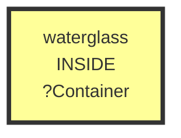
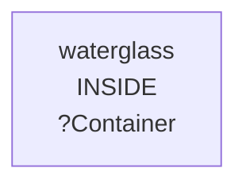

# 🚀 VirtualHome Agent Episode Log


### [GoalReasoner (Module A - Intent)] Output
```json
{
  "is_instruction_obviously_vague": false,
  "clarification_question": null,
  "target_object": "waterglass",
  "location_hint": "dishwasher",
  "reasoning_chain": [
    {
      "question": "Why does the user want this object?",
      "answer": "To have the used drinking glass cleaned and stored in the dishwasher."
    },
    {
      "question": "Why is that important?",
      "answer": "Because placing it in the dishwasher prepares it for washing and keeps the area tidy."
    },
    {
      "question": "What fundamental need does this fulfill?",
      "answer": "It fulfills the need to clean used dishware and maintain an organized kitchen environment."
    },
    {
      "question": "Are there any deeper psychological or physical motivations?",
      "answer": "The user likely wants convenience, cleanliness, and reduced clutter after using the glass."
    }
  ],
  "deep_intent": "The user wants to clean used dishware and keep the kitchen organized.",
  "acceptable_alternatives_properties": [
    {
      "priority": 1,
      "description": "Other used drinkware items that can be placed in the dishwasher, such as a cup, mug, or tumbler"
    },
    {
      "priority": 2,
      "description": "Other used kitchen items that are dishwasher-safe, such as plates, bowls, or utensils"
    },
    {
      "priority": 3,
      "description": "Any dishwasher-safe food or drink containers that need washing"
    },
    {
      "priority": 4,
      "description": "Other dirty household items that need to be collected for cleaning in the kitchen, if dishwasher-safe"
    }
  ]
}
```

### [PerceptionFilter] Output
```json
{
  "reasoning": "The goal is to clean and place the used waterglass in the dishwasher. I kept the target object, the dishwasher as the required location/receptacle, and the sink as the backup cleaning tool/location implied by washing dishware if needed. I also kept other dishwasher-safe dishware alternatives mentioned by the intent so they can serve as valid backups if the waterglass is not the only item to collect.",
  "selected_classes": [
    "cup",
    "plate",
    "character",
    "mug",
    "tumbler",
    "dishwasher",
    "dishbowl",
    "cutleryknife",
    "waterglass",
    "sink",
    "cutleryfork"
  ],
  "raw_class_count": 50
}
```

### [LLMExecutor] Output
```json
{
  "reasoning": "The SDG requires the waterglass to be inside some container. The best match in the graph for the user’s dishwasher-related intent is the dishwasher(165), which is a container and currently CLOSED/OFF. To satisfy INSIDE dishwasher, I must first get close to the dishwasher, then later open it before putting the glass in. Since I am currently close to waterglass(87) and the dishwasher is a separate destination, the next atomic step is to walk to the dishwasher.",
  "satisfied_nodes": [],
  "current_node_focus": "N1",
  "mapped_variables": {
    "?Container": "dishwasher(165)"
  },
  "action": "[walk] <dishwasher> (165)"
}
```

### [RoboStateMultiTaskController] Output
```json
{
  "action": "[walk] <dishwasher> (165)",
  "active_task_id": "task_1",
  "task_context": {
    "active_task_id": "task_1",
    "pending_task_ids": [],
    "satisfied_task_ids": []
  },
  "source": "llm_executor"
}
```
## Step 0
- **Action**: `[walk] <dishwasher> (165)`
- **Action Success**: `True`
- **Action Message**: {'0': {'message': 'Success'}}
- **Active Task**: `task_1`
- **Decision Source**: `llm_executor`
- **Task Progress**: T3_without_memory_M4_16=pending
- **SDG Status**:

- **Observed Items (49)**: cutleryknife(59), cutleryknife(60), waterglass(64) [DIRTY,EMPTY], cutleryknife(65), cutleryfork(66), plate(67), plate(68), cutleryfork(69), cutleryknife(70), waterglass(71) [EMPTY,CLEAN], waterglass(72) [DIRTY,FILLED_MILK], cutleryknife(73), cutleryfork(74), plate(75), plate(76)...


### [PerceptionFilter] Output
```json
{
  "reasoning": "Reused cached class selection.",
  "selected_classes": [
    "cup",
    "plate",
    "character",
    "mug",
    "tumbler",
    "dishwasher",
    "dishbowl",
    "cutleryknife",
    "waterglass",
    "sink",
    "cutleryfork"
  ],
  "raw_class_count": 50
}
```

### [LLMExecutor] Output
```json
{
  "reasoning": "The SDG requires the waterglass to be inside some container. The target waterglass is waterglass(64), which is dirty and already in the kitchen. The best matching container for the user's intent and location hint is the dishwasher(165), which is present, accessible, and currently closed/off. Since I cannot put an object into a closed container, the immediate next step is to walk to the dishwasher before opening it and placing the glass inside.",
  "satisfied_nodes": [],
  "current_node_focus": "N1",
  "mapped_variables": {
    "?Container": "dishwasher(165)"
  },
  "action": "[walk] <dishwasher> (165)"
}
```

### [RoboStateMultiTaskController] Output
```json
{
  "action": "[walk] <dishwasher> (165)",
  "active_task_id": "task_1",
  "task_context": {
    "active_task_id": "task_1",
    "pending_task_ids": [],
    "satisfied_task_ids": []
  },
  "source": "llm_executor"
}
```
## Step 1
- **Action**: `[walk] <dishwasher> (165)`
- **Action Success**: `True`
- **Action Message**: {'0': {'message': 'Success'}}
- **Active Task**: `task_1`
- **Decision Source**: `llm_executor`
- **Task Progress**: T3_without_memory_M4_16=pending
- **SDG Status**:

- **Observed Items (49)**: cutleryknife(59), cutleryknife(60), waterglass(64) [DIRTY,EMPTY], cutleryknife(65), cutleryfork(66), plate(67), plate(68), cutleryfork(69), cutleryknife(70), waterglass(71) [EMPTY,CLEAN], waterglass(72) [DIRTY,FILLED_MILK], cutleryknife(73), cutleryfork(74), plate(75), plate(76)...


### [PerceptionFilter] Output
```json
{
  "reasoning": "Reused cached class selection.",
  "selected_classes": [
    "cup",
    "plate",
    "character",
    "mug",
    "tumbler",
    "dishwasher",
    "dishbowl",
    "cutleryknife",
    "waterglass",
    "sink",
    "cutleryfork"
  ],
  "raw_class_count": 50
}
```

### [LLMExecutor] Output
```json
{
  "reasoning": "The SDG requires the waterglass to end up inside some container. The most relevant destination in the scene is the dishwasher(165), which is explicitly in the goal intent. Since it is currently CLOSED, and I must be near the destination before opening or putting anything in it, the next step is to walk to the dishwasher.",
  "satisfied_nodes": [],
  "current_node_focus": "N1",
  "mapped_variables": {
    "?Container": "dishwasher(165)"
  },
  "action": "[walk] <dishwasher> (165)"
}
```

### [RoboStateMultiTaskController] Output
```json
{
  "action": "[walk] <livingroom> (183)",
  "active_task_id": null,
  "task_context": {
    "active_task_id": null,
    "pending_task_ids": [
      "task_1"
    ],
    "satisfied_task_ids": []
  },
  "source": "loop_recovery_room_revisit"
}
```
## Step 2
- **Action**: `[walk] <livingroom> (183)`
- **Action Success**: `True`
- **Action Message**: {'0': {'message': 'Success'}}
- **Decision Source**: `loop_recovery_room_revisit`
- **Task Progress**: T3_without_memory_M4_16=pending
- **SDG Status**:
No SDG active.
- **Observed Items (159)**: wall(12), wall(13), wall(14), wall(15), wall(16), wall(17), wall(18), wall(19), wall(20), wall(21), floor(22), floor(23), floor(24), floor(25), floor(26)...


### [RoboStateMultiTaskController] Output
```json
{
  "action": "[walk] <bedroom> (241)",
  "active_task_id": "task_1",
  "task_context": {
    "active_task_id": "task_1",
    "pending_task_ids": [],
    "satisfied_task_ids": []
  },
  "source": "room_frontier"
}
```
## Step 3
- **Action**: `[walk] <bedroom> (241)`
- **Action Success**: `True`
- **Action Message**: {'0': {'message': 'Success'}}
- **Active Task**: `task_1`
- **Decision Source**: `room_frontier`
- **Task Progress**: T3_without_memory_M4_16=pending
- **SDG Status**:

- **Observed Items (58)**: floor(184), floor(185), floor(186), floor(187), floor(188), floor(189), wall(190), wall(191), wall(192), wall(193), wall(194), wall(195), ceiling(196), ceiling(197), ceiling(198)...


### [RoboStateMultiTaskController] Output
```json
{
  "action": "[walk] <bathroom> (285)",
  "active_task_id": "task_1",
  "task_context": {
    "active_task_id": "task_1",
    "pending_task_ids": [],
    "satisfied_task_ids": []
  },
  "source": "room_frontier"
}
```
## Step 4
- **Action**: `[walk] <bathroom> (285)`
- **Action Success**: `True`
- **Action Message**: {'0': {'message': 'Success'}}
- **Active Task**: `task_1`
- **Decision Source**: `room_frontier`
- **Task Progress**: T3_without_memory_M4_16=pending
- **SDG Status**:

- **Observed Items (38)**: floor(242), floor(243), floor(244), floor(245), ceiling(246), ceiling(247), ceiling(248), ceiling(249), wall(250), wall(251), wall(252), wall(253), door(254) [OPEN], ceilinglamp(255), tablelamp(256) [ON]...


### [RoboStateMultiTaskController] Output
```json
{
  "action": "[walk] <bedroom> (346)",
  "active_task_id": "task_1",
  "task_context": {
    "active_task_id": "task_1",
    "pending_task_ids": [],
    "satisfied_task_ids": []
  },
  "source": "room_frontier"
}
```
## Step 5
- **Action**: `[walk] <bedroom> (346)`
- **Action Success**: `True`
- **Action Message**: {'0': {'message': 'Success'}}
- **Active Task**: `task_1`
- **Decision Source**: `room_frontier`
- **Task Progress**: T3_without_memory_M4_16=pending
- **SDG Status**:

- **Observed Items (66)**: wall(286), wall(287), wall(288), wall(289), wall(290), wall(291), floor(292), floor(293), floor(294), floor(295), floor(296), floor(297), ceiling(298), ceiling(299), ceiling(300)...


### [RoboStateMultiTaskController] Output
```json
{
  "action": "[walk] <kitchen> (11)",
  "active_task_id": null,
  "task_context": {
    "active_task_id": null,
    "pending_task_ids": [
      "task_1"
    ],
    "satisfied_task_ids": []
  },
  "source": "loop_recovery_room_revisit"
}
```
## Step 6
- **Action**: `[walk] <kitchen> (11)`
- **Action Success**: `True`
- **Action Message**: {'0': {'message': 'Success'}}
- **Decision Source**: `loop_recovery_room_revisit`
- **Task Progress**: T3_without_memory_M4_16=pending
- **SDG Status**:
No SDG active.
- **Observed Items (64)**: floor(347), floor(348), floor(349), floor(350), floor(351), floor(352), floor(353), floor(354), floor(355), wall(356), wall(357), wall(358), wall(359), wall(360), wall(361)...


### [PerceptionFilter] Output
```json
{
  "reasoning": "Reused cached class selection.",
  "selected_classes": [
    "cup",
    "plate",
    "character",
    "mug",
    "tumbler",
    "dishwasher",
    "dishbowl",
    "cutleryknife",
    "waterglass",
    "sink",
    "cutleryfork"
  ],
  "raw_class_count": 50
}
```

### [LLMExecutor] Output
```json
{
  "reasoning": "The goal is to place the target waterglass inside the dishwasher. The dishwasher is currently closed, so I need to get to it first before opening it. The best matching target is dishwasher(165), which is present in the kitchen and is the required container for the final INSIDE relation.",
  "satisfied_nodes": [],
  "current_node_focus": "N1",
  "mapped_variables": {
    "?Container": "dishwasher(165)"
  },
  "action": "[walk] <dishwasher> (165)"
}
```

### [RoboStateMultiTaskController] Output
```json
{
  "action": "[walk] <dishwasher> (165)",
  "active_task_id": "task_1",
  "task_context": {
    "active_task_id": "task_1",
    "pending_task_ids": [],
    "satisfied_task_ids": []
  },
  "source": "llm_executor"
}
```
## Step 7
- **Action**: `[walk] <dishwasher> (165)`
- **Action Success**: `True`
- **Action Message**: {'0': {'message': 'Success'}}
- **Active Task**: `task_1`
- **Decision Source**: `llm_executor`
- **Task Progress**: T3_without_memory_M4_16=pending
- **SDG Status**:

- **Observed Items (49)**: cutleryknife(59), cutleryknife(60), waterglass(64) [DIRTY,EMPTY], cutleryknife(65), cutleryfork(66), plate(67), plate(68), cutleryfork(69), cutleryknife(70), waterglass(71) [EMPTY,CLEAN], waterglass(72) [DIRTY,FILLED_MILK], cutleryknife(73), cutleryfork(74), plate(75), plate(76)...


### [PerceptionFilter] Output
```json
{
  "reasoning": "Reused cached class selection.",
  "selected_classes": [
    "cup",
    "plate",
    "character",
    "mug",
    "tumbler",
    "dishwasher",
    "dishbowl",
    "cutleryknife",
    "waterglass",
    "sink",
    "cutleryfork"
  ],
  "raw_class_count": 50
}
```

### [LLMExecutor] Output
```json
{
  "reasoning": "The goal is to place the waterglass inside the dishwasher. The dishwasher is the best container match for ?Container because it is explicitly present, closed, and intended for dishware cleaning. Per proximity and container rules, I must first walk to the dishwasher before I can open it or put anything inside. The target waterglass is not yet being manipulated, so this step focuses on approaching the destination container.",
  "satisfied_nodes": [],
  "current_node_focus": "N1",
  "mapped_variables": {
    "?Container": "dishwasher(165)"
  },
  "action": "[walk] <dishwasher> (165)"
}
```

### [RoboStateMultiTaskController] Output
```json
{
  "action": "[walk] <dishwasher> (165)",
  "active_task_id": "task_1",
  "task_context": {
    "active_task_id": "task_1",
    "pending_task_ids": [],
    "satisfied_task_ids": []
  },
  "source": "llm_executor"
}
```
## Step 8
- **Action**: `[walk] <dishwasher> (165)`
- **Action Success**: `True`
- **Action Message**: {'0': {'message': 'Success'}}
- **Active Task**: `task_1`
- **Decision Source**: `llm_executor`
- **Task Progress**: T3_without_memory_M4_16=pending
- **SDG Status**:

- **Observed Items (49)**: cutleryknife(59), cutleryknife(60), waterglass(64) [DIRTY,EMPTY], cutleryknife(65), cutleryfork(66), plate(67), plate(68), cutleryfork(69), cutleryknife(70), waterglass(71) [EMPTY,CLEAN], waterglass(72) [DIRTY,FILLED_MILK], cutleryknife(73), cutleryfork(74), plate(75), plate(76)...


### [PerceptionFilter] Output
```json
{
  "reasoning": "Reused cached class selection.",
  "selected_classes": [
    "cup",
    "plate",
    "character",
    "mug",
    "tumbler",
    "dishwasher",
    "dishbowl",
    "cutleryknife",
    "waterglass",
    "sink",
    "cutleryfork"
  ],
  "raw_class_count": 50
}
```

### [LLMExecutor] Output
```json
{
  "reasoning": "The goal is to get the dirty waterglass inside the dishwasher. The target instance that matches best is waterglass(64) because it is DIRTY and in the kitchen. The dishwasher(165) is the only explicit dishwasher container and is currently CLOSED, so before putting the glass inside it, I need to be near the dishwasher and open it. The next atomic step should therefore move me adjacent to the dishwasher.",
  "satisfied_nodes": [],
  "current_node_focus": "N1",
  "mapped_variables": {
    "?Container": "dishwasher(165)"
  },
  "action": "[walk] <dishwasher> (165)"
}
```

### [RoboStateMultiTaskController] Output
```json
{
  "action": "[walk] <livingroom> (183)",
  "active_task_id": null,
  "task_context": {
    "active_task_id": null,
    "pending_task_ids": [
      "task_1"
    ],
    "satisfied_task_ids": []
  },
  "source": "loop_recovery_room_revisit"
}
```
## Step 9
- **Action**: `[walk] <livingroom> (183)`
- **Action Success**: `True`
- **Action Message**: {'0': {'message': 'Success'}}
- **Decision Source**: `loop_recovery_room_revisit`
- **Task Progress**: T3_without_memory_M4_16=pending
- **SDG Status**:
No SDG active.
- **Observed Items (159)**: wall(12), wall(13), wall(14), wall(15), wall(16), wall(17), wall(18), wall(19), wall(20), wall(21), floor(22), floor(23), floor(24), floor(25), floor(26)...


### [RoboStateMultiTaskController] Output
```json
{
  "action": "[walk] <bedroom> (241)",
  "active_task_id": null,
  "task_context": {
    "active_task_id": null,
    "pending_task_ids": [
      "task_1"
    ],
    "satisfied_task_ids": []
  },
  "source": "loop_recovery_room_revisit"
}
```
## Step 10
- **Action**: `[walk] <bedroom> (241)`
- **Action Success**: `True`
- **Action Message**: {'0': {'message': 'Success'}}
- **Decision Source**: `loop_recovery_room_revisit`
- **Task Progress**: T3_without_memory_M4_16=pending
- **SDG Status**:
No SDG active.
- **Observed Items (58)**: floor(184), floor(185), floor(186), floor(187), floor(188), floor(189), wall(190), wall(191), wall(192), wall(193), wall(194), wall(195), ceiling(196), ceiling(197), ceiling(198)...


### [RoboStateMultiTaskController] Output
```json
{
  "action": "[walk] <bathroom> (285)",
  "active_task_id": null,
  "task_context": {
    "active_task_id": null,
    "pending_task_ids": [
      "task_1"
    ],
    "satisfied_task_ids": []
  },
  "source": "loop_recovery_room_revisit"
}
```
## Step 11
- **Action**: `[walk] <bathroom> (285)`
- **Action Success**: `True`
- **Action Message**: {'0': {'message': 'Success'}}
- **Decision Source**: `loop_recovery_room_revisit`
- **Task Progress**: T3_without_memory_M4_16=pending
- **SDG Status**:
No SDG active.
- **Observed Items (38)**: floor(242), floor(243), floor(244), floor(245), ceiling(246), ceiling(247), ceiling(248), ceiling(249), wall(250), wall(251), wall(252), wall(253), door(254) [OPEN], ceilinglamp(255), tablelamp(256) [ON]...


### [RoboStateMultiTaskController] Output
```json
{
  "action": "[walk] <bedroom> (346)",
  "active_task_id": null,
  "task_context": {
    "active_task_id": null,
    "pending_task_ids": [
      "task_1"
    ],
    "satisfied_task_ids": []
  },
  "source": "loop_recovery_room_revisit"
}
```
## Step 12
- **Action**: `[walk] <bedroom> (346)`
- **Action Success**: `True`
- **Action Message**: {'0': {'message': 'Success'}}
- **Decision Source**: `loop_recovery_room_revisit`
- **Task Progress**: T3_without_memory_M4_16=pending
- **SDG Status**:
No SDG active.
- **Observed Items (66)**: wall(286), wall(287), wall(288), wall(289), wall(290), wall(291), floor(292), floor(293), floor(294), floor(295), floor(296), floor(297), ceiling(298), ceiling(299), ceiling(300)...


### [RoboStateMultiTaskController] Output
```json
{
  "action": "[walk] <kitchen> (11)",
  "active_task_id": null,
  "task_context": {
    "active_task_id": null,
    "pending_task_ids": [
      "task_1"
    ],
    "satisfied_task_ids": []
  },
  "source": "loop_recovery_room_revisit"
}
```
## Step 13
- **Action**: `[walk] <kitchen> (11)`
- **Action Success**: `True`
- **Action Message**: {'0': {'message': 'Success'}}
- **Decision Source**: `loop_recovery_room_revisit`
- **Task Progress**: T3_without_memory_M4_16=pending
- **SDG Status**:
No SDG active.
- **Observed Items (64)**: floor(347), floor(348), floor(349), floor(350), floor(351), floor(352), floor(353), floor(354), floor(355), wall(356), wall(357), wall(358), wall(359), wall(360), wall(361)...


### [PerceptionFilter] Output
```json
{
  "reasoning": "Reused cached class selection.",
  "selected_classes": [
    "cup",
    "plate",
    "character",
    "mug",
    "tumbler",
    "dishwasher",
    "dishbowl",
    "cutleryknife",
    "waterglass",
    "sink",
    "cutleryfork"
  ],
  "raw_class_count": 50
}
```

### [LLMExecutor] Output
```json
{
  "reasoning": "The goal is to place the waterglass inside the dishwasher. The dishwasher is present and currently CLOSED, so before we can put the glass inside it we must first get near the dishwasher and open it. The best matching target object for the task is waterglass(64), which is dirty and already close to the character, but the next required step toward the final SDG node is to access the dishwasher container.",
  "satisfied_nodes": [],
  "current_node_focus": "N1",
  "mapped_variables": {
    "?Container": "dishwasher(165)"
  },
  "action": "[walk] <dishwasher> (165)"
}
```

### [RoboStateMultiTaskController] Output
```json
{
  "action": "[walk] <dishwasher> (165)",
  "active_task_id": "task_1",
  "task_context": {
    "active_task_id": "task_1",
    "pending_task_ids": [],
    "satisfied_task_ids": []
  },
  "source": "llm_executor"
}
```
## Step 14
- **Action**: `[walk] <dishwasher> (165)`
- **Action Success**: `True`
- **Action Message**: {'0': {'message': 'Success'}}
- **Active Task**: `task_1`
- **Decision Source**: `llm_executor`
- **Task Progress**: T3_without_memory_M4_16=pending
- **SDG Status**:

- **Observed Items (49)**: cutleryknife(59), cutleryknife(60), waterglass(64) [DIRTY,EMPTY], cutleryknife(65), cutleryfork(66), plate(67), plate(68), cutleryfork(69), cutleryknife(70), waterglass(71) [EMPTY,CLEAN], waterglass(72) [DIRTY,FILLED_MILK], cutleryknife(73), cutleryfork(74), plate(75), plate(76)...

