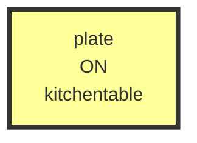

# 🚀 VirtualHome Agent Episode Log


### [GoalReasoner (Module A - Intent)] Output
```json
{
  "is_instruction_obviously_vague": false,
  "clarification_question": null,
  "target_object": "plate",
  "location_hint": "kitchentable",
  "reasoning_chain": [
    {
      "question": "Why does the user want this object placed there?",
      "answer": "To return the used plate to the kitchen table area after use."
    },
    {
      "question": "Why is that important?",
      "answer": "It helps organize the used item in a designated household location."
    },
    {
      "question": "What fundamental need does this fulfill?",
      "answer": "It supports tidiness and routine cleanup after a meal or food use."
    },
    {
      "question": "Are there any deeper psychological or physical motivations?",
      "answer": "It may reduce clutter, make the space feel orderly, and prepare the item for later washing or clearing."
    }
  ],
  "deep_intent": "The user wants to tidy up after using an eating dish by placing it in the kitchen area.",
  "acceptable_alternatives_properties": [
    {
      "priority": 1,
      "description": "Other used dining items that can be placed on the kitchen table, such as a bowl, cup, or utensil."
    },
    {
      "priority": 2,
      "description": "Other meal-related items that belong with dishes in the kitchen area, such as a serving plate or tray."
    },
    {
      "priority": 3,
      "description": "Other tableware or food-related items that are being cleared from use and stored in the kitchen area."
    },
    {
      "priority": 4,
      "description": "Any similar household item that needs to be returned to the kitchen area as part of cleanup and organization."
    }
  ]
}
```

### [PerceptionFilter] Output
```json
{
  "reasoning": "The goal explicitly requires the plate and the kitchen table location. No other objects are necessary for the stated placement task.",
  "selected_classes": [
    "plate",
    "kitchentable",
    "character"
  ],
  "raw_class_count": 50
}
```

### [LLMExecutor] Output
```json
{
  "reasoning": "The SDG goal is already satisfied in the current graph: plate(75), plate(76), plate(83), plate(84), and plate(91) are all ON a kitchentable, with plate(75) and plate(84) also close to the character. Since the target is a plate on the kitchen table and at least one matching plate is already there, no further action is needed to satisfy the active task.",
  "satisfied_nodes": [
    "N1"
  ],
  "current_node_focus": "N1",
  "mapped_variables": {
    "?Container": "kitchentable(135)"
  },
  "action": "[wait]"
}
```

### [RoboStateMultiTaskController] Output
```json
{
  "action": "[wait]",
  "active_task_id": "task_1",
  "task_context": {
    "active_task_id": "task_1",
    "pending_task_ids": [],
    "satisfied_task_ids": []
  },
  "source": "llm_executor"
}
```
## Step 0
- **Action**: `[wait]`
- **Action Success**: `True`
- **Action Message**: Time passes. You waited for a while.
- **Active Task**: `task_1`
- **Decision Source**: `llm_executor`
- **Task Progress**: T3_without_memory_M4_18=pending
- **SDG Status**:

- **Observed Items (17)**: plate(75), plate(76), plate(83), plate(84), plate(91), plate(103), plate(104), kitchentable(131), kitchentable(135), character(1), plate(67), plate(68), kitchen(11), livingroom(183), bedroom(241)...


### [PerceptionFilter] Output
```json
{
  "reasoning": "Reused cached class selection.",
  "selected_classes": [
    "plate",
    "kitchentable",
    "character"
  ],
  "raw_class_count": 50
}
```

### [LLMExecutor] Output
```json
{
  "reasoning": "The goal is to have a plate ON the kitchentable. The current graph already shows multiple plates satisfying this relation, including plate(75) on kitchentable(135) and plate(76) on kitchentable(131). Since the SDG only requires one plate on a kitchentable, the goal node is already satisfied and no physical action is needed.",
  "satisfied_nodes": [
    "N1"
  ],
  "current_node_focus": "N1",
  "mapped_variables": {
    "?Container": "kitchentable(131)"
  },
  "action": "[wait]"
}
```

### [RoboStateMultiTaskController] Output
```json
{
  "action": "[wait]",
  "active_task_id": "task_1",
  "task_context": {
    "active_task_id": "task_1",
    "pending_task_ids": [],
    "satisfied_task_ids": []
  },
  "source": "llm_executor"
}
```
## Step 1
- **Action**: `[wait]`
- **Action Success**: `True`
- **Action Message**: Time passes. You waited for a while.
- **Active Task**: `task_1`
- **Decision Source**: `llm_executor`
- **Task Progress**: T3_without_memory_M4_18=pending
- **SDG Status**:

- **Observed Items (17)**: plate(75), plate(76), plate(83), plate(84), plate(91), plate(103), plate(104), kitchentable(131), kitchentable(135), character(1), plate(67), plate(68), kitchen(11), livingroom(183), bedroom(241)...


### [PerceptionFilter] Output
```json
{
  "reasoning": "Reused cached class selection.",
  "selected_classes": [
    "plate",
    "kitchentable",
    "character"
  ],
  "raw_class_count": 50
}
```

### [LLMExecutor] Output
```json
{
  "reasoning": "The SDG requires a plate to be ON the kitchentable. The current graph already shows multiple plates on kitchen tables, and plate(75) is explicitly ON kitchentable(135) and CLOSE to the character, so this node is already satisfied without any action.",
  "satisfied_nodes": [
    "N1"
  ],
  "current_node_focus": "N1",
  "mapped_variables": {},
  "action": "[wait]"
}
```

### [RoboStateMultiTaskController] Output
```json
{
  "action": "[wait]",
  "active_task_id": "task_1",
  "task_context": {
    "active_task_id": "task_1",
    "pending_task_ids": [],
    "satisfied_task_ids": []
  },
  "source": "llm_executor"
}
```
## Step 2
- **Action**: `[wait]`
- **Action Success**: `True`
- **Action Message**: Time passes. You waited for a while.
- **Active Task**: `task_1`
- **Decision Source**: `llm_executor`
- **Task Progress**: T3_without_memory_M4_18=pending
- **SDG Status**:

- **Observed Items (17)**: plate(75), plate(76), plate(83), plate(84), plate(91), plate(103), plate(104), kitchentable(131), kitchentable(135), character(1), plate(67), plate(68), kitchen(11), livingroom(183), bedroom(241)...


### [PerceptionFilter] Output
```json
{
  "reasoning": "Reused cached class selection.",
  "selected_classes": [
    "plate",
    "kitchentable",
    "character"
  ],
  "raw_class_count": 50
}
```

### [LLMExecutor] Output
```json
{
  "reasoning": "The goal is to have a plate on the kitchen table. The current graph already shows multiple plates on kitchentable objects, including plate(75) and plate(76) on kitchentable(135), and plate(83) and plate(103) on kitchentable(131). Because the SDG only requires one plate ON the kitchentable, the goal node is already satisfied in the current filtered graph. No action is needed to progress the active task.",
  "satisfied_nodes": [
    "N1"
  ],
  "current_node_focus": "N1",
  "mapped_variables": {
    "?TargetPlate": "plate(75)",
    "?Table": "kitchentable(135)"
  },
  "action": "[wait]"
}
```

### [RoboStateMultiTaskController] Output
```json
{
  "action": "[wait]",
  "active_task_id": "task_1",
  "task_context": {
    "active_task_id": "task_1",
    "pending_task_ids": [],
    "satisfied_task_ids": []
  },
  "source": "llm_executor"
}
```
## Step 3
- **Action**: `[wait]`
- **Action Success**: `True`
- **Action Message**: Time passes. You waited for a while.
- **Active Task**: `task_1`
- **Decision Source**: `llm_executor`
- **Task Progress**: T3_without_memory_M4_18=pending
- **SDG Status**:

- **Observed Items (17)**: plate(75), plate(76), plate(83), plate(84), plate(91), plate(103), plate(104), kitchentable(131), kitchentable(135), character(1), plate(67), plate(68), kitchen(11), livingroom(183), bedroom(241)...


### [PerceptionFilter] Output
```json
{
  "reasoning": "Reused cached class selection.",
  "selected_classes": [
    "plate",
    "kitchentable",
    "character"
  ],
  "raw_class_count": 50
}
```

### [LLMExecutor] Output
```json
{
  "reasoning": "The SDG requires a plate to be ON a kitchentable. The current filtered graph already shows multiple plates on kitchen tables, and plate(75) is explicitly ON kitchentable(135). Therefore the goal node is already satisfied and no physical action is needed.",
  "satisfied_nodes": [
    "N1"
  ],
  "current_node_focus": "N1",
  "mapped_variables": {
    "?TargetPlate": "plate(75)",
    "?Table": "kitchentable(135)"
  },
  "action": "[wait]"
}
```

### [RoboStateMultiTaskController] Output
```json
{
  "action": "[wait]",
  "active_task_id": "task_1",
  "task_context": {
    "active_task_id": "task_1",
    "pending_task_ids": [],
    "satisfied_task_ids": []
  },
  "source": "llm_executor"
}
```
