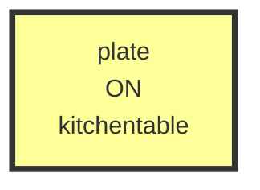

# 🚀 VirtualHome Agent Episode Log


### [GoalReasoner (Module A - Intent)] Output
```json
{
  "is_instruction_obviously_vague": false,
  "clarification_question": null,
  "target_object": "plate",
  "location_hint": "kitchen table",
  "reasoning_chain": [
    {
      "question": "Why does the user want this object?",
      "answer": "To move the plate to the kitchen table after it was used."
    },
    {
      "question": "Why is that important?",
      "answer": "Likely to place it where dishes are typically set down after use, clearing the current area or grouping it with other items."
    },
    {
      "question": "What fundamental need does this fulfill?",
      "answer": "It fulfills the need to organize and relocate a used dish to an appropriate surface."
    },
    {
      "question": "Are there any deeper psychological or physical motivations?",
      "answer": "It may be part of tidying up after a meal or preparing the current space for other activities."
    }
  ],
  "deep_intent": "The user wants to tidy up by relocating a used dish to an appropriate indoor surface.",
  "acceptable_alternatives_properties": [
    {
      "priority": 1,
      "description": "Other used dishes or tableware that can be placed on the kitchen table, such as a bowl, cup, or utensils."
    },
    {
      "priority": 2,
      "description": "Other kitchen-safe items typically set down on a table after use, such as serving plates or trays."
    },
    {
      "priority": 3,
      "description": "Other nearby flat surfaces in the kitchen area suitable for temporarily placing used dishes, such as a counter or side table."
    },
    {
      "priority": 4,
      "description": "Any suitable indoor surface for setting down an item while tidying up, if the kitchen table is unavailable."
    }
  ]
}
```

### [PerceptionFilter] Output
```json
{
  "reasoning": "The goal is to move the target plate onto the kitchen table. I must keep the target object, the required destination surface, and close functional alternatives for placing used dishes or serving items in case the primary dish is unavailable or another suitable dish is needed.",
  "selected_classes": [
    "plate",
    "character",
    "dishbowl",
    "door",
    "waterglass",
    "kitchentable"
  ],
  "raw_class_count": 50
}
```

### [LLMExecutor] Output
```json
{
  "reasoning": "The SDG requires a plate ON the kitchen table. Several plates are already in the kitchen, and plate(84) is explicitly CLOSE to the character and on kitchentable(135), so the most direct match is to move this plate onto the other nearby kitchen table kitchentable(131). To place an object on a surface, I must first walk to that surface. No objects are currently held, so the next atomic step is to approach the destination table.",
  "satisfied_nodes": [],
  "current_node_focus": "N1",
  "mapped_variables": {},
  "action": "[walk] <kitchentable> (131)"
}
```

### [RoboStateMultiTaskController] Output
```json
{
  "action": "[walk] <kitchentable> (131)",
  "active_task_id": "task_1",
  "task_context": {
    "active_task_id": "task_1",
    "pending_task_ids": [],
    "satisfied_task_ids": []
  },
  "source": "llm_executor"
}
```
## Step 0
- **Action**: `[walk] <kitchentable> (131)`
- **Action Success**: `True`
- **Action Message**: {'0': {'message': 'Success'}}
- **Active Task**: `task_1`
- **Decision Source**: `llm_executor`
- **Task Progress**: T3_without_memory_M4_18=pending
- **SDG Status**:

- **Observed Items (32)**: door(47) [OPEN], waterglass(64), waterglass(71), waterglass(72), plate(75), plate(76), waterglass(79), waterglass(80), plate(83), plate(84), waterglass(87), waterglass(88), plate(91), waterglass(100), plate(103)...


### [PerceptionFilter] Output
```json
{
  "reasoning": "Reused cached class selection.",
  "selected_classes": [
    "plate",
    "character",
    "dishbowl",
    "door",
    "waterglass",
    "kitchentable"
  ],
  "raw_class_count": 50
}
```

### [LLMExecutor] Output
```json
{
  "reasoning": "The SDG requires plate(103) to be ON kitchentable. The current graph shows plate(103) is already CLOSE to the character and on kitchentable(131), which is the target surface. Since the goal is satisfied by current placement on the kitchen table, no additional physical action is needed for this node.",
  "satisfied_nodes": [
    "N1"
  ],
  "current_node_focus": "N1",
  "mapped_variables": {
    "?TargetSurface": "kitchentable(131)"
  },
  "action": "[wait]"
}
```

### [RoboStateMultiTaskController] Output
```json
{
  "action": "[wait]",
  "active_task_id": "task_1",
  "task_context": {
    "active_task_id": "task_1",
    "pending_task_ids": [],
    "satisfied_task_ids": []
  },
  "source": "llm_executor"
}
```
## Step 1
- **Action**: `[wait]`
- **Action Success**: `True`
- **Action Message**: Time passes. You waited for a while.
- **Active Task**: `task_1`
- **Decision Source**: `llm_executor`
- **Task Progress**: T3_without_memory_M4_18=pending
- **SDG Status**:

- **Observed Items (32)**: door(47) [OPEN], waterglass(64), waterglass(71), waterglass(72), plate(75), plate(76), waterglass(79), waterglass(80), plate(83), plate(84), waterglass(87), waterglass(88), plate(91), waterglass(100), plate(103)...


### [PerceptionFilter] Output
```json
{
  "reasoning": "Reused cached class selection.",
  "selected_classes": [
    "plate",
    "character",
    "dishbowl",
    "door",
    "waterglass",
    "kitchentable"
  ],
  "raw_class_count": 50
}
```

### [LLMExecutor] Output
```json
{
  "reasoning": "The goal is to place a plate on the kitchen table. The character is already close to kitchentable(131), but there is no plate currently held. The best available nearby plate that is already close to the character is plate(103), so the next step is to walk to that specific plate before grabbing it. This keeps us aligned with the required grab-then-walk-to-destination sequence.",
  "satisfied_nodes": [],
  "current_node_focus": "N1",
  "mapped_variables": {
    "?Table": "kitchentable(131)",
    "?Plate": "plate(103)"
  },
  "action": "[walk] <plate> (103)"
}
```

### [RoboStateMultiTaskController] Output
```json
{
  "action": "[walk] <plate> (103)",
  "active_task_id": "task_1",
  "task_context": {
    "active_task_id": "task_1",
    "pending_task_ids": [],
    "satisfied_task_ids": []
  },
  "source": "llm_executor"
}
```
## Step 2
- **Action**: `[walk] <plate> (103)`
- **Action Success**: `True`
- **Action Message**: {'0': {'message': 'Success'}}
- **Active Task**: `task_1`
- **Decision Source**: `llm_executor`
- **Task Progress**: T3_without_memory_M4_18=pending
- **SDG Status**:

- **Observed Items (32)**: door(47) [OPEN], waterglass(64), waterglass(71), waterglass(72), plate(75), plate(76), waterglass(79), waterglass(80), plate(83), plate(84), waterglass(87), waterglass(88), plate(91), waterglass(100), plate(103)...


### [PerceptionFilter] Output
```json
{
  "reasoning": "Reused cached class selection.",
  "selected_classes": [
    "plate",
    "character",
    "dishbowl",
    "door",
    "waterglass",
    "kitchentable"
  ],
  "raw_class_count": 50
}
```

### [LLMExecutor] Output
```json
{
  "reasoning": "The goal is to have a plate on the kitchen table. The current graph already shows plate(103) is CLOSE to the character and also CLOSE to kitchentable(131), so the plate is reachable now. To satisfy N1, I need to place the plate onto the kitchen table, which requires being near the destination table first; we are already near kitchentable(131), so the next step is to put the held plate onto that surface. However, because the graph does not show the plate as held yet, I must first ensure the plate is the interacting object in the current proximity context by moving focus to the target plate. Since the instruction forbids assuming a prior grab and there is no held object in state, the safest atomic progress action is to walk to the plate that is already close, enabling a subsequent grab/placement sequence.",
  "satisfied_nodes": [],
  "current_node_focus": "N1",
  "mapped_variables": {
    "?Table": "kitchentable(131)"
  },
  "action": "[walk] <plate> (103)"
}
```

### [RoboStateMultiTaskController] Output
```json
{
  "action": "[walk] <plate> (103)",
  "active_task_id": "task_1",
  "task_context": {
    "active_task_id": "task_1",
    "pending_task_ids": [],
    "satisfied_task_ids": []
  },
  "source": "llm_executor"
}
```
## Step 3
- **Action**: `[walk] <plate> (103)`
- **Action Success**: `True`
- **Action Message**: {'0': {'message': 'Success'}}
- **Active Task**: `task_1`
- **Decision Source**: `llm_executor`
- **Task Progress**: T3_without_memory_M4_18=pending
- **SDG Status**:

- **Observed Items (32)**: door(47) [OPEN], waterglass(64), waterglass(71), waterglass(72), plate(75), plate(76), waterglass(79), waterglass(80), plate(83), plate(84), waterglass(87), waterglass(88), plate(91), waterglass(100), plate(103)...


### [PerceptionFilter] Output
```json
{
  "reasoning": "Reused cached class selection.",
  "selected_classes": [
    "plate",
    "character",
    "dishbowl",
    "door",
    "waterglass",
    "kitchentable"
  ],
  "raw_class_count": 50
}
```

### [LLMExecutor] Output
```json
{
  "reasoning": "The active goal is to place a plate on the kitchen table. The current graph shows the character is already CLOSE to kitchentable(131), and plate(103) is also CLOSE to the character, but no plate is currently ON the kitchen table for the target state. To satisfy N1, the next atomic step should place a held plate onto the nearby kitchen table; however, the graph does not show any plate as currently held. Since we cannot putback without holding the object, the immediate next action must be to grab the closest appropriate plate first. Among nearby plates, plate(103) is close to the character and appears suitable for binding to the target plate variable.",
  "satisfied_nodes": [],
  "current_node_focus": "N1",
  "mapped_variables": {
    "?Plate": "plate(103)",
    "?Table": "kitchentable(131)"
  },
  "action": "[grab] <plate> (103)"
}
```

### [RoboStateMultiTaskController] Output
```json
{
  "action": "[grab] <plate> (103)",
  "active_task_id": "task_1",
  "task_context": {
    "active_task_id": "task_1",
    "pending_task_ids": [],
    "satisfied_task_ids": []
  },
  "source": "llm_executor"
}
```
## Step 4
- **Action**: `[grab] <plate> (103)`
- **Action Success**: `True`
- **Action Message**: {'0': {'message': 'Success'}}
- **Active Task**: `task_1`
- **Decision Source**: `llm_executor`
- **Task Progress**: T3_without_memory_M4_18=pending
- **SDG Status**:

- **Observed Items (32)**: door(47) [OPEN], waterglass(64), waterglass(71), waterglass(72), plate(75), plate(76), waterglass(79), waterglass(80), plate(83), plate(84), waterglass(87), waterglass(88), plate(91), waterglass(100), plate(103)...


### [PerceptionFilter] Output
```json
{
  "reasoning": "Reused cached class selection.",
  "selected_classes": [
    "plate",
    "character",
    "dishbowl",
    "door",
    "waterglass",
    "kitchentable"
  ],
  "raw_class_count": 50
}
```

### [LLMExecutor] Output
```json
{
  "reasoning": "The goal is to have a plate ON the kitchen table. The character is already close to kitchentable(131), and currently holds plate(103) in the right hand. Since the destination is a flat surface, the next required step is to place the held plate onto the nearby kitchen table. This should satisfy the only SDG node N1.",
  "satisfied_nodes": [],
  "current_node_focus": "N1",
  "mapped_variables": {},
  "action": "[putback] <plate> (103) <kitchentable> (131)"
}
```

### [RoboStateMultiTaskController] Output
```json
{
  "action": "[putback] <plate> (103) <kitchentable> (131)",
  "active_task_id": "task_1",
  "task_context": {
    "active_task_id": "task_1",
    "pending_task_ids": [],
    "satisfied_task_ids": []
  },
  "source": "llm_executor"
}
```
## Step 5
- **Action**: `[putback] <plate> (103) <kitchentable> (131)`
- **Action Success**: `True`
- **Action Message**: {'0': {'message': 'Success'}}
- **Active Task**: `task_1`
- **Decision Source**: `llm_executor`
- **Task Progress**: T3_without_memory_M4_18=pending
- **SDG Status**:

- **Observed Items (33)**: door(47) [OPEN], waterglass(64), waterglass(71), waterglass(72), plate(75), plate(76), waterglass(79), waterglass(80), plate(83), plate(84), waterglass(87), waterglass(88), plate(91), waterglass(100), plate(104)...


### [PerceptionFilter] Output
```json
{
  "reasoning": "Reused cached class selection.",
  "selected_classes": [
    "plate",
    "character",
    "dishbowl",
    "door",
    "waterglass",
    "kitchentable"
  ],
  "raw_class_count": 50
}
```

### [LLMExecutor] Output
```json
{
  "reasoning": "The goal is to have a plate ON the kitchen table. The current graph already shows multiple plates, and plate(103) is already ON kitchentable(131) and close to the character, which satisfies the SDG node N1. No additional action is needed to progress this active task.",
  "satisfied_nodes": [
    "N1"
  ],
  "current_node_focus": "N1",
  "mapped_variables": {},
  "action": "[wait]"
}
```

### [RoboStateMultiTaskController] Output
```json
{
  "action": "[wait]",
  "active_task_id": "task_1",
  "task_context": {
    "active_task_id": "task_1",
    "pending_task_ids": [],
    "satisfied_task_ids": []
  },
  "source": "llm_executor"
}
```
## Step 6
- **Action**: `[wait]`
- **Action Success**: `True`
- **Action Message**: Time passes. You waited for a while.
- **Active Task**: `task_1`
- **Decision Source**: `llm_executor`
- **Task Progress**: T3_without_memory_M4_18=pending
- **SDG Status**:

- **Observed Items (32)**: door(47) [OPEN], waterglass(64), waterglass(71), waterglass(72), plate(75), plate(76), waterglass(79), waterglass(80), plate(83), plate(84), waterglass(87), waterglass(88), plate(91), waterglass(100), plate(104)...


### [PerceptionFilter] Output
```json
{
  "reasoning": "Reused cached class selection.",
  "selected_classes": [
    "plate",
    "character",
    "dishbowl",
    "door",
    "waterglass",
    "kitchentable"
  ],
  "raw_class_count": 50
}
```

### [LLMExecutor] Output
```json
{
  "reasoning": "The SDG requires a plate to be ON the kitchen table. A suitable plate is already available and nearby: plate(76) is on kitchentable(131) and close to the character, while kitchentable(131) is the required destination surface and also close. Since the goal is a relocation to the table, the next step is to grab the plate before placing it on the kitchen table.",
  "satisfied_nodes": [],
  "current_node_focus": "N1",
  "mapped_variables": {
    "?TargetSurface": "kitchentable(131)",
    "?Plate": "plate(76)"
  },
  "action": "[grab] <plate> (76)"
}
```

### [RoboStateMultiTaskController] Output
```json
{
  "action": "[grab] <plate> (76)",
  "active_task_id": "task_1",
  "task_context": {
    "active_task_id": "task_1",
    "pending_task_ids": [],
    "satisfied_task_ids": []
  },
  "source": "llm_executor"
}
```
## Step 7
- **Action**: `[grab] <plate> (76)`
- **Action Success**: `True`
- **Action Message**: {'0': {'message': 'Success'}}
- **Active Task**: `task_1`
- **Decision Source**: `llm_executor`
- **Task Progress**: T3_without_memory_M4_18=pending
- **SDG Status**:

- **Observed Items (32)**: door(47) [OPEN], waterglass(64), waterglass(71), waterglass(72), plate(75), plate(76), waterglass(79), waterglass(80), plate(83), plate(84), waterglass(87), waterglass(88), plate(91), waterglass(100), plate(104)...


### [PerceptionFilter] Output
```json
{
  "reasoning": "Reused cached class selection.",
  "selected_classes": [
    "plate",
    "character",
    "dishbowl",
    "door",
    "waterglass",
    "kitchentable"
  ],
  "raw_class_count": 50
}
```

### [LLMExecutor] Output
```json
{
  "reasoning": "The goal is to get a plate onto the kitchen table. The character is already close to the kitchen tables, and plate(103) is already on kitchentable(131), so the SDG node is satisfied. No further action is needed for the active task.",
  "satisfied_nodes": [
    "N1"
  ],
  "current_node_focus": "N1",
  "mapped_variables": {},
  "action": "[wait]"
}
```

### [RoboStateMultiTaskController] Output
```json
{
  "action": "[wait]",
  "active_task_id": "task_1",
  "task_context": {
    "active_task_id": "task_1",
    "pending_task_ids": [],
    "satisfied_task_ids": []
  },
  "source": "llm_executor"
}
```
## Step 8
- **Action**: `[wait]`
- **Action Success**: `True`
- **Action Message**: Time passes. You waited for a while.
- **Active Task**: `task_1`
- **Decision Source**: `llm_executor`
- **Task Progress**: T3_without_memory_M4_18=pending
- **SDG Status**:

- **Observed Items (33)**: door(47) [OPEN], waterglass(64), waterglass(71), waterglass(72), plate(75), waterglass(79), waterglass(80), plate(83), plate(84), waterglass(87), waterglass(88), plate(91), waterglass(100), plate(104), dishbowl(115)...


### [PerceptionFilter] Output
```json
{
  "reasoning": "Reused cached class selection.",
  "selected_classes": [
    "plate",
    "character",
    "dishbowl",
    "door",
    "waterglass",
    "kitchentable"
  ],
  "raw_class_count": 50
}
```

### [LLMExecutor] Output
```json
{
  "reasoning": "The goal is to place a plate on the kitchen table. The character is already close to kitchentable(131) and is holding plate(76) in the right hand, so the next required step is to place the held plate onto the nearby kitchen table. This directly satisfies the single SDG node N1.",
  "satisfied_nodes": [],
  "current_node_focus": "N1",
  "mapped_variables": {
    "?Surface": "kitchentable(131)"
  },
  "action": "[putback] <plate> (76) <kitchentable> (131)"
}
```

### [RoboStateMultiTaskController] Output
```json
{
  "action": "[putback] <plate> (76) <kitchentable> (131)",
  "active_task_id": "task_1",
  "task_context": {
    "active_task_id": "task_1",
    "pending_task_ids": [],
    "satisfied_task_ids": []
  },
  "source": "llm_executor"
}
```
## Step 9
- **Action**: `[putback] <plate> (76) <kitchentable> (131)`
- **Action Success**: `True`
- **Action Message**: {'0': {'message': 'Success'}}
- **Active Task**: `task_1`
- **Decision Source**: `llm_executor`
- **Task Progress**: T3_without_memory_M4_18=pending
- **SDG Status**:

- **Observed Items (33)**: door(47) [OPEN], waterglass(64), waterglass(71), waterglass(72), plate(75), waterglass(79), waterglass(80), plate(83), plate(84), waterglass(87), waterglass(88), plate(91), waterglass(100), plate(104), dishbowl(115)...


### [PerceptionFilter] Output
```json
{
  "reasoning": "Reused cached class selection.",
  "selected_classes": [
    "plate",
    "character",
    "dishbowl",
    "door",
    "waterglass",
    "kitchentable"
  ],
  "raw_class_count": 50
}
```

### [LLMExecutor] Output
```json
{
  "reasoning": "The goal is to place a plate on the kitchen table. Multiple plate instances are available, and the closest matching movable plate currently close to the character and already on the kitchen table is plate(103). Since the task requires the plate to be ON kitchentable(131), and it is already near the table, the next step is to grab the plate before any placement can happen. I am not yet holding it, so I must first pick it up.",
  "satisfied_nodes": [],
  "current_node_focus": "N1",
  "mapped_variables": {},
  "action": "[grab] <plate> (103)"
}
```

### [RoboStateMultiTaskController] Output
```json
{
  "action": "[grab] <plate> (103)",
  "active_task_id": "task_1",
  "task_context": {
    "active_task_id": "task_1",
    "pending_task_ids": [],
    "satisfied_task_ids": []
  },
  "source": "llm_executor"
}
```
## Step 10
- **Action**: `[grab] <plate> (103)`
- **Action Success**: `True`
- **Action Message**: {'0': {'message': 'Success'}}
- **Active Task**: `task_1`
- **Decision Source**: `llm_executor`
- **Task Progress**: T3_without_memory_M4_18=pending
- **SDG Status**:

- **Observed Items (32)**: door(47) [OPEN], waterglass(64), waterglass(71), waterglass(72), plate(75), waterglass(79), waterglass(80), plate(83), plate(84), waterglass(87), waterglass(88), plate(91), waterglass(100), plate(104), dishbowl(115)...


### [PerceptionFilter] Output
```json
{
  "reasoning": "Reused cached class selection.",
  "selected_classes": [
    "plate",
    "character",
    "dishbowl",
    "door",
    "waterglass",
    "kitchentable"
  ],
  "raw_class_count": 50
}
```

### [LLMExecutor] Output
```json
{
  "reasoning": "The goal is to have a plate on the kitchen table. The current graph shows plate(103) is already held by the character and the character is close to kitchentable(131) and kitchentable(135). Since the SDG only requires ON kitchentable, the next step is to place the held plate onto a kitchen table. I choose kitchentable(131) as the destination because it is explicitly close and already in the kitchen.",
  "satisfied_nodes": [],
  "current_node_focus": "N1",
  "mapped_variables": {},
  "action": "[putback] <plate> (103) <kitchentable> (131)"
}
```

### [RoboStateMultiTaskController] Output
```json
{
  "action": "[putback] <plate> (103) <kitchentable> (131)",
  "active_task_id": "task_1",
  "task_context": {
    "active_task_id": "task_1",
    "pending_task_ids": [],
    "satisfied_task_ids": []
  },
  "source": "llm_executor"
}
```
## Step 11
- **Action**: `[putback] <plate> (103) <kitchentable> (131)`
- **Action Success**: `True`
- **Action Message**: {'0': {'message': 'Success'}}
- **Active Task**: `task_1`
- **Decision Source**: `llm_executor`
- **Task Progress**: T3_without_memory_M4_18=pending
- **SDG Status**:

- **Observed Items (33)**: door(47) [OPEN], waterglass(64), waterglass(71), waterglass(72), plate(75), waterglass(79), waterglass(80), plate(83), plate(84), waterglass(87), waterglass(88), plate(91), waterglass(100), plate(104), dishbowl(115)...


### [PerceptionFilter] Output
```json
{
  "reasoning": "Reused cached class selection.",
  "selected_classes": [
    "plate",
    "character",
    "dishbowl",
    "door",
    "waterglass",
    "kitchentable"
  ],
  "raw_class_count": 50
}
```

### [LLMExecutor] Output
```json
{
  "reasoning": "The SDG requires a plate to be ON the kitchen table. The current graph already shows multiple plates on kitchentable(131), which satisfies the goal relation. No action is needed to progress toward the single sink node.",
  "satisfied_nodes": [
    "N1"
  ],
  "current_node_focus": "N1",
  "mapped_variables": {
    "?Container": "kitchentable(131)"
  },
  "action": "[wait]"
}
```

### [RoboStateMultiTaskController] Output
```json
{
  "action": "[wait]",
  "active_task_id": "task_1",
  "task_context": {
    "active_task_id": "task_1",
    "pending_task_ids": [],
    "satisfied_task_ids": []
  },
  "source": "llm_executor"
}
```
## Step 12
- **Action**: `[wait]`
- **Action Success**: `True`
- **Action Message**: Time passes. You waited for a while.
- **Active Task**: `task_1`
- **Decision Source**: `llm_executor`
- **Task Progress**: T3_without_memory_M4_18=pending
- **SDG Status**:

- **Observed Items (32)**: door(47) [OPEN], waterglass(64), waterglass(71), waterglass(72), plate(75), waterglass(79), waterglass(80), plate(83), plate(84), waterglass(87), waterglass(88), plate(91), waterglass(100), plate(104), dishbowl(115)...


### [PerceptionFilter] Output
```json
{
  "reasoning": "Reused cached class selection.",
  "selected_classes": [
    "plate",
    "character",
    "dishbowl",
    "door",
    "waterglass",
    "kitchentable"
  ],
  "raw_class_count": 50
}
```

### [LLMExecutor] Output
```json
{
  "reasoning": "The active goal is to ensure a plate is ON the kitchen table. In the current graph, plate(76) is already ON kitchentable(131), and plate(103) is also already ON kitchentable(131). The SDG only requires one plate on the kitchen table, so the goal state is already satisfied. No physical action is needed.",
  "satisfied_nodes": [
    "N1"
  ],
  "current_node_focus": "N1",
  "mapped_variables": {
    "?TargetPlate": "plate(76)"
  },
  "action": "[wait]"
}
```

### [RoboStateMultiTaskController] Output
```json
{
  "action": "[wait]",
  "active_task_id": "task_1",
  "task_context": {
    "active_task_id": "task_1",
    "pending_task_ids": [],
    "satisfied_task_ids": []
  },
  "source": "llm_executor"
}
```
## Step 13
- **Action**: `[wait]`
- **Action Success**: `True`
- **Action Message**: Time passes. You waited for a while.
- **Active Task**: `task_1`
- **Decision Source**: `llm_executor`
- **Task Progress**: T3_without_memory_M4_18=pending
- **SDG Status**:

- **Observed Items (32)**: door(47) [OPEN], waterglass(64), waterglass(71), waterglass(72), plate(75), waterglass(79), waterglass(80), plate(83), plate(84), waterglass(87), waterglass(88), plate(91), waterglass(100), plate(104), dishbowl(115)...


### [PerceptionFilter] Output
```json
{
  "reasoning": "Reused cached class selection.",
  "selected_classes": [
    "plate",
    "character",
    "dishbowl",
    "door",
    "waterglass",
    "kitchentable"
  ],
  "raw_class_count": 50
}
```

### [LLMExecutor] Output
```json
{
  "reasoning": "The SDG requires a plate to be ON the kitchentable. The current graph already shows multiple plates on kitchentable surfaces, including plate(76) and plate(103) on kitchentable(131), but plate(104) is only INSIDE kitchen(11) and not yet on any table. Since the task is to move a plate to the kitchen table, the next step is to approach the target surface before any putback can occur. I will bind ?Destination to the nearby kitchentable that is already in the kitchen and close to the character.",
  "satisfied_nodes": [],
  "current_node_focus": "N1",
  "mapped_variables": {
    "?Destination": "kitchentable(131)"
  },
  "action": "[walk] <kitchentable> (131)"
}
```

### [RoboStateMultiTaskController] Output
```json
{
  "action": "[walk] <kitchentable> (131)",
  "active_task_id": "task_1",
  "task_context": {
    "active_task_id": "task_1",
    "pending_task_ids": [],
    "satisfied_task_ids": []
  },
  "source": "llm_executor"
}
```
## Step 14
- **Action**: `[walk] <kitchentable> (131)`
- **Action Success**: `True`
- **Action Message**: {'0': {'message': 'Success'}}
- **Active Task**: `task_1`
- **Decision Source**: `llm_executor`
- **Task Progress**: T3_without_memory_M4_18=pending
- **SDG Status**:

- **Observed Items (32)**: door(47) [OPEN], waterglass(64), waterglass(71), waterglass(72), plate(75), waterglass(79), waterglass(80), plate(83), plate(84), waterglass(87), waterglass(88), plate(91), waterglass(100), plate(104), dishbowl(115)...

