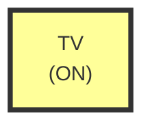

# 🚀 VirtualHome Agent Episode Log


### [GoalReasoner (Module A - Intent)] Output
```json
{
  "is_instruction_obviously_vague": false,
  "clarification_question": null,
  "target_object": "TV",
  "location_hint": null,
  "reasoning_chain": [
    {
      "question": "Why does the user want this object?",
      "answer": "To have the television powered on if it is currently off."
    },
    {
      "question": "Why is that important?",
      "answer": "So the user can view or use the television as needed."
    },
    {
      "question": "What fundamental need does this fulfill?",
      "answer": "It fulfills the need to access entertainment or information displayed on a screen."
    },
    {
      "question": "Are there any deeper psychological or physical motivations?",
      "answer": "The user may want convenience, relaxation, or access to media content."
    }
  ],
  "deep_intent": "The user wants to access entertainment or information from a screen.",
  "acceptable_alternatives_properties": [
    {
      "priority": 1,
      "description": "Other screen-based media devices that can display content, such as a monitor or tablet"
    },
    {
      "priority": 2,
      "description": "A different television or another indoor display device that can be turned on"
    },
    {
      "priority": 3,
      "description": "Portable media devices that provide audio-visual entertainment"
    },
    {
      "priority": 4,
      "description": "Any indoor device that can deliver entertainment or information, such as a radio if visual display is not required"
    }
  ]
}
```

### [PerceptionFilter] Output
```json
{
  "reasoning": "The goal is to have the TV powered ON, so the only strictly necessary object class is the TV itself. No additional tools or locations are required by the SDG, and no alternative media device is needed because the target is explicitly the television.",
  "selected_classes": [
    "tv",
    "character"
  ],
  "raw_class_count": 39
}
```

### [LLMExecutor] Output
```json
{
  "reasoning": "The sole SDG node N1 requires the TV to be ON. The current graph shows tv(426) is OFF, has a switch, and is already CLOSE to the character, so no walking is needed. It is not reported as BROKEN and it has a plug, so the next direct step is to switch it on.",
  "satisfied_nodes": [],
  "current_node_focus": "N1",
  "mapped_variables": {},
  "action": "[switchon] <tv> (426)"
}
```

### [RoboStateMultiTaskController] Output
```json
{
  "action": "[switchon] <tv> (426)",
  "active_task_id": "task_1",
  "task_context": {
    "active_task_id": "task_1",
    "pending_task_ids": [],
    "satisfied_task_ids": []
  },
  "source": "llm_executor"
}
```
## Step 0
- **Action**: `[switchon] <tv> (426)`
- **Action Success**: `True`
- **Action Message**: Faked switch operation in Python layer (bypassed Unity failure)
- **Active Task**: `task_1`
- **Decision Source**: `llm_executor`
- **Task Progress**: T3_without_memory_M4_19=done
- **SDG Status**:

- **Observed Items (6)**: tv(426) [OFF], character(1), bathroom(11), bedroom(73), kitchen(205), livingroom(335)

