# 🚀 VirtualHome Agent Episode Log


### [GoalReasoner (Module A - Intent)] Output
```json
{
  "is_instruction_obviously_vague": false,
  "clarification_question": null,
  "target_object": "chicken and cutlets",
  "location_hint": "fridge, microwave, kitchen table",
  "reasoning_chain": [
    {
      "question": "Why does the user want this object?",
      "answer": "They want the chicken and cutlets heated, plated, and placed on the kitchen table for use or consumption."
    },
    {
      "question": "Why is that important?",
      "answer": "Because warming and serving the food makes it ready to eat in a convenient location."
    },
    {
      "question": "What fundamental need does this fulfill?",
      "answer": "It fulfills the need to eat and be fed."
    },
    {
      "question": "Are there any deeper psychological or physical motivations?",
      "answer": "The user likely wants to satisfy hunger or provide a prepared meal for someone."
    }
  ],
  "deep_intent": "The user wants to prepare food so it is ready to eat.",
  "acceptable_alternatives_properties": [
    {
      "priority": 1,
      "description": "Other cooked ready-to-eat protein foods that can be reheated and served on a plate, such as leftovers, sliced meat, or a prepared casserole"
    },
    {
      "priority": 2,
      "description": "Other meal components that can be microwaved and plated, such as cooked vegetables, rice, or pasta"
    },
    {
      "priority": 3,
      "description": "Other ready-to-serve indoor food items that provide a filling meal, such as a sandwich or soup"
    },
    {
      "priority": 4,
      "description": "Any edible food that can satisfy hunger, such as fruit, crackers, or packaged snacks"
    }
  ]
}
```

### [PerceptionFilter] Output
```json
{
  "reasoning": "Need the target foods (chicken, cutlets), the storage/heating/serving items implied by the SDG and location hint (fridge, microwave, plate, kitchen table), plus the exact required support surfaces/functional alternatives for heating and holding/serving food. No extra background objects are needed.",
  "selected_classes": [
    "plate",
    "chicken",
    "character",
    "cutlets",
    "microwave",
    "fridge",
    "door",
    "kitchentable"
  ],
  "raw_class_count": 45
}
```

### [LLMExecutor] Output
```json
{
  "reasoning": "The goal requires chicken and cutlets to be heated and served, but the immediate prerequisite is to take chicken out of the fridge. The current graph shows chicken(241) is inside fridge(225), and the fridge is open and the character is close to both the fridge and chicken. Because grabbing requires being near the object and the chicken is available now, the next atomic step is to walk directly to chicken(241) so it can be grabbed in the following action.",
  "satisfied_nodes": [
    "N3"
  ],
  "current_node_focus": "N1",
  "mapped_variables": {
    "?Cooler": "fridge(225)",
    "?Heater": "microwave(234)",
    "?Surface": "kitchentable(199)"
  },
  "action": "[walk] <chicken> (241)"
}
```

### [RoboStateMultiTaskController] Output
```json
{
  "action": "[walk] <chicken> (241)",
  "active_task_id": "task_1",
  "task_context": {
    "active_task_id": "task_1",
    "pending_task_ids": [],
    "satisfied_task_ids": []
  },
  "source": "llm_executor"
}
```
## Step 0
- **Action**: `[walk] <chicken> (241)`
- **Action Success**: `False`
- **Action Message**: {'0': {'message': 'ScriptExcutor 0: PROCESS WALK: Can not select object: chicken. REASON: No interaction positions\nEXECUTION_GENERAL: Script is impossible to execute\n\n'}}
- **Active Task**: `task_1`
- **Decision Source**: `llm_executor`
- **Task Progress**: T3_without_memory_P1_03=pending
- **SDG Status**:
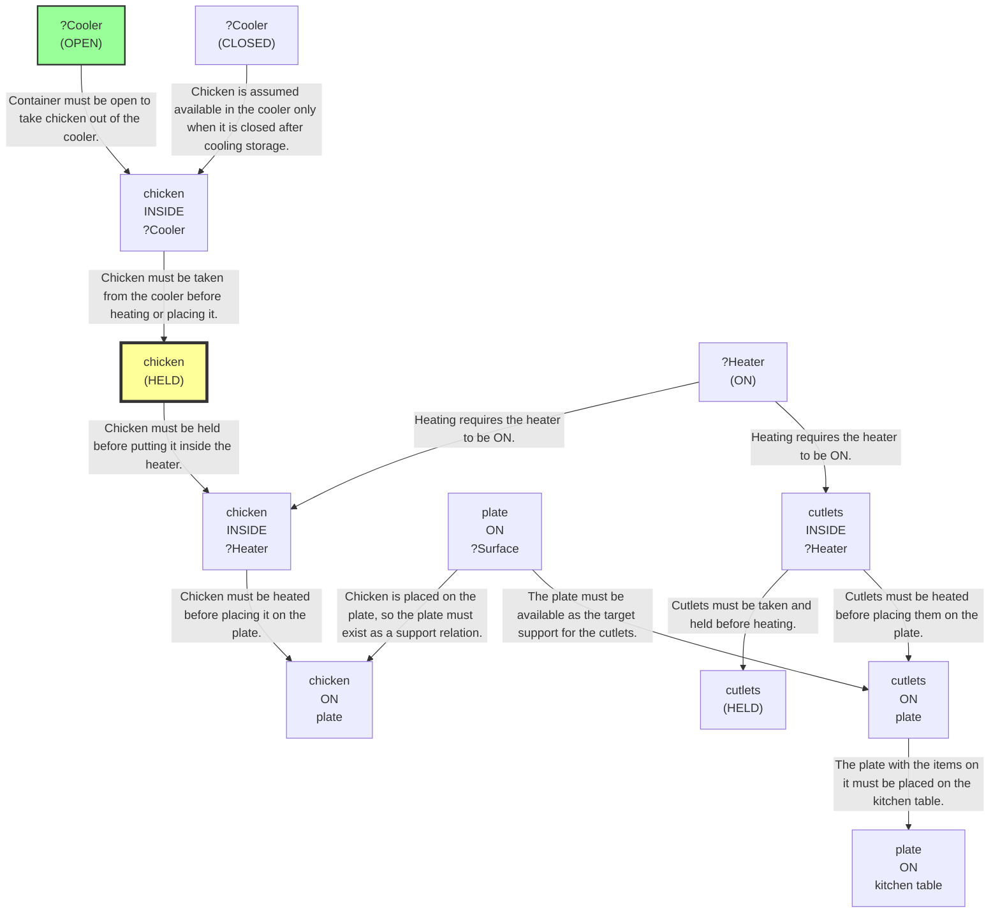
- **Observed Items (19)**: door(145) [OPEN], door(146) [OPEN], plate(170), plate(171), plate(172), plate(173), plate(177), plate(178), plate(184), kitchentable(199), fridge(225) [OPEN], microwave(234) [CLOSED,OFF], character(1), chicken(241) [COLD], cutlets(242) [COLD]...


### [PerceptionFilter] Output
```json
{
  "reasoning": "Reused cached class selection.",
  "selected_classes": [
    "plate",
    "chicken",
    "character",
    "cutlets",
    "microwave",
    "fridge",
    "door",
    "kitchentable"
  ],
  "raw_class_count": 45
}
```

### [LLMExecutor] Output
```json
{
  "reasoning": "The chicken and cutlets are both visible in the fridge and close to the character, but the SDG requires the chicken to be held first before any heating steps. The previous walk attempt failed because the target was incorrectly referenced, so I should now directly walk to the specific visible chicken object 241 to enable a subsequent grab.",
  "satisfied_nodes": [
    "N3",
    "N4",
    "N6",
    "N8",
    "N12"
  ],
  "current_node_focus": "N1",
  "mapped_variables": {
    "?Cooler": "fridge(225)",
    "?Heater": "microwave(234)",
    "?Surface": "kitchentable(199)"
  },
  "action": "[walk] <chicken> (241)"
}
```

### [RoboStateMultiTaskController] Output
```json
{
  "action": "[walk] <chicken> (241)",
  "active_task_id": "task_1",
  "task_context": {
    "active_task_id": "task_1",
    "pending_task_ids": [],
    "satisfied_task_ids": []
  },
  "source": "llm_executor"
}
```
## Step 1
- **Action**: `[walk] <chicken> (241)`
- **Action Success**: `False`
- **Action Message**: {'0': {'message': 'ScriptExcutor 0: PROCESS WALK: Can not select object: chicken. REASON: No interaction positions\nEXECUTION_GENERAL: Script is impossible to execute\n\n'}}
- **Active Task**: `task_1`
- **Decision Source**: `llm_executor`
- **Task Progress**: T3_without_memory_P1_03=pending
- **SDG Status**:
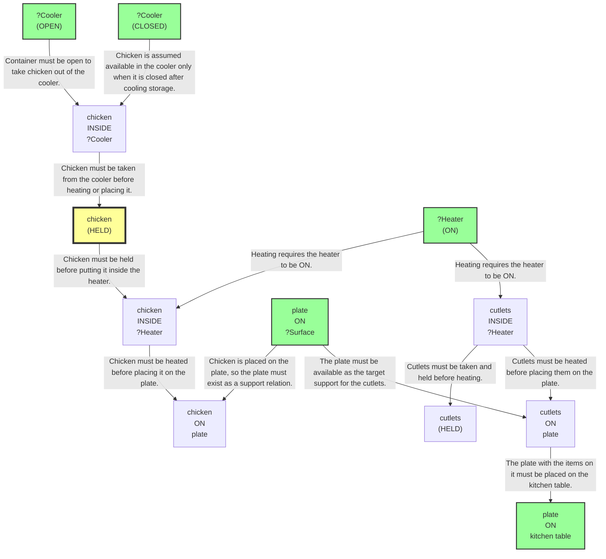
- **Observed Items (19)**: door(145) [OPEN], door(146) [OPEN], plate(170), plate(171), plate(172), plate(173), plate(177), plate(178), plate(184), kitchentable(199), fridge(225) [OPEN], microwave(234) [CLOSED,OFF], character(1), chicken(241) [COLD], cutlets(242) [COLD]...


### [RoboStateMultiTaskController] Output
```json
{
  "action": "[walk] <bathroom> (11)",
  "active_task_id": null,
  "task_context": {
    "active_task_id": null,
    "pending_task_ids": [
      "task_1"
    ],
    "satisfied_task_ids": []
  },
  "source": "loop_recovery_room_revisit"
}
```
## Step 2
- **Action**: `[walk] <bathroom> (11)`
- **Action Success**: `True`
- **Action Message**: {'0': {'message': 'Success'}}
- **Decision Source**: `loop_recovery_room_revisit`
- **Task Progress**: T3_without_memory_P1_03=pending
- **SDG Status**:
No SDG active.
- **Observed Items (124)**: floor(127), floor(128), floor(129), floor(130), floor(131), floor(132), floor(133), floor(134), floor(135), ceiling(136), ceiling(137), ceiling(138), ceiling(139), ceiling(140), ceiling(141)...


### [RoboStateMultiTaskController] Output
```json
{
  "action": "[walk] <bedroom> (50)",
  "active_task_id": "task_1",
  "task_context": {
    "active_task_id": "task_1",
    "pending_task_ids": [],
    "satisfied_task_ids": []
  },
  "source": "room_frontier"
}
```
## Step 3
- **Action**: `[walk] <bedroom> (50)`
- **Action Success**: `True`
- **Action Message**: {'0': {'message': 'Success'}}
- **Active Task**: `task_1`
- **Decision Source**: `room_frontier`
- **Task Progress**: T3_without_memory_P1_03=pending
- **SDG Status**:
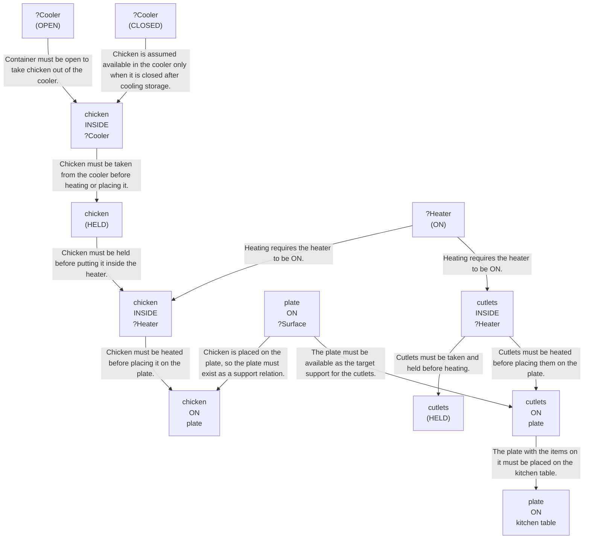
- **Observed Items (43)**: wall(12), wall(13), wall(14), wall(15), ceiling(16), ceiling(17), ceiling(18), ceiling(19), floor(20), floor(21), floor(22), floor(23), toilet(24) [CLOSED], stall(25), bathroomcabinet(26) [CLOSED]...


### [RoboStateMultiTaskController] Output
```json
{
  "action": "[walk] <livingroom> (261)",
  "active_task_id": "task_1",
  "task_context": {
    "active_task_id": "task_1",
    "pending_task_ids": [],
    "satisfied_task_ids": []
  },
  "source": "room_frontier"
}
```
## Step 4
- **Action**: `[walk] <livingroom> (261)`
- **Action Success**: `True`
- **Action Message**: {'0': {'message': 'Success'}}
- **Active Task**: `task_1`
- **Decision Source**: `room_frontier`
- **Task Progress**: T3_without_memory_P1_03=pending
- **SDG Status**:

- **Observed Items (75)**: floor(51), floor(52), floor(53), floor(54), floor(55), floor(56), floor(57), floor(58), floor(59), wall(60), wall(61), wall(62), wall(63), wall(64), wall(65)...


### [RoboStateMultiTaskController] Output
```json
{
  "action": "[walk] <kitchen> (126)",
  "active_task_id": null,
  "task_context": {
    "active_task_id": null,
    "pending_task_ids": [
      "task_1"
    ],
    "satisfied_task_ids": []
  },
  "source": "loop_recovery_room_revisit"
}
```
## Step 5
- **Action**: `[walk] <kitchen> (126)`
- **Action Success**: `True`
- **Action Message**: {'0': {'message': 'Success'}}
- **Decision Source**: `loop_recovery_room_revisit`
- **Task Progress**: T3_without_memory_P1_03=pending
- **SDG Status**:
No SDG active.
- **Observed Items (64)**: wall(262), wall(263), wall(264), wall(265), wall(266), wall(267), wall(268), wall(269), ceiling(270), ceiling(271), ceiling(272), ceiling(273), ceiling(274), ceiling(275), ceiling(276)...


### [PerceptionFilter] Output
```json
{
  "reasoning": "Reused cached class selection.",
  "selected_classes": [
    "plate",
    "chicken",
    "character",
    "cutlets",
    "microwave",
    "fridge",
    "door",
    "kitchentable"
  ],
  "raw_class_count": 45
}
```

### [LLMExecutor] Output
```json
{
  "reasoning": "The previous walk attempts failed because chicken(241) has no interaction positions, so it cannot be directly approached. The goal still requires chicken to be held, then heated, then plated. Since the fridge is open and reachable, the next viable step is to walk to the fridge so I can access the chicken inside by a valid container interaction path.",
  "satisfied_nodes": [],
  "current_node_focus": "N1",
  "mapped_variables": {
    "?Cooler": "fridge(225)"
  },
  "action": "[walk] <fridge> (225)"
}
```

### [RoboStateMultiTaskController] Output
```json
{
  "action": "[walk] <fridge> (225)",
  "active_task_id": "task_1",
  "task_context": {
    "active_task_id": "task_1",
    "pending_task_ids": [],
    "satisfied_task_ids": []
  },
  "source": "llm_executor"
}
```
## Step 6
- **Action**: `[walk] <fridge> (225)`
- **Action Success**: `True`
- **Action Message**: {'0': {'message': 'Success'}}
- **Active Task**: `task_1`
- **Decision Source**: `llm_executor`
- **Task Progress**: T3_without_memory_P1_03=pending
- **SDG Status**:
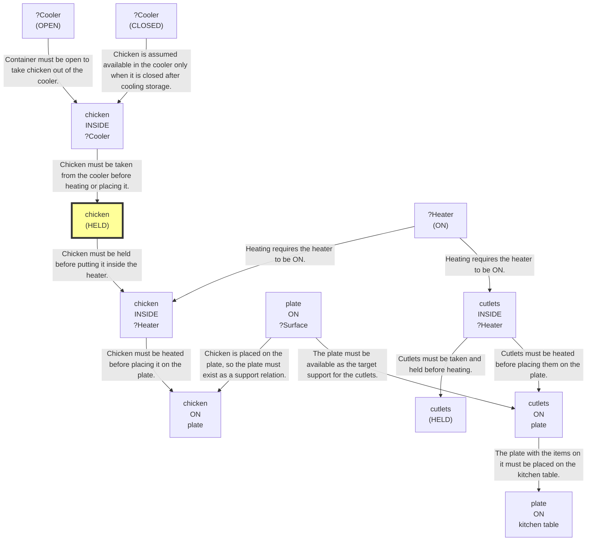
- **Observed Items (19)**: door(145) [OPEN], door(146) [OPEN], plate(170), plate(171), plate(172), plate(173), plate(177), plate(178), plate(184), kitchentable(199), fridge(225) [OPEN], microwave(234) [CLOSED,OFF], character(1), chicken(241) [COLD], cutlets(242) [COLD]...


### [PerceptionFilter] Output
```json
{
  "reasoning": "Reused cached class selection.",
  "selected_classes": [
    "plate",
    "chicken",
    "character",
    "cutlets",
    "microwave",
    "fridge",
    "door",
    "kitchentable"
  ],
  "raw_class_count": 45
}
```

### [LLMExecutor] Output
```json
{
  "reasoning": "The previous walk attempts failed because chicken(241) has no interaction positions for direct walking from the current state. The graph shows both chicken(241) and cutlets(242) are already CLOSE to the character and inside the open fridge(225), so the immediate feasible next step is to grab the required item that is currently accessible. To satisfy the SDG, the task must start by holding chicken before any heating or plating steps. Since the fridge is already OPEN and the character is close to the chicken, I will attempt to grab chicken now.",
  "satisfied_nodes": [
    "N3",
    "N4",
    "N6"
  ],
  "current_node_focus": "N1",
  "mapped_variables": {
    "?Cooler": "fridge(225)",
    "?Heater": "microwave(234)",
    "?Surface": "kitchentable(199)"
  },
  "action": "[grab] <chicken> (241)"
}
```

### [RoboStateMultiTaskController] Output
```json
{
  "action": "[grab] <chicken> (241)",
  "active_task_id": "task_1",
  "task_context": {
    "active_task_id": "task_1",
    "pending_task_ids": [],
    "satisfied_task_ids": []
  },
  "source": "llm_executor"
}
```
## Step 7
- **Action**: `[grab] <chicken> (241)`
- **Action Success**: `True`
- **Action Message**: {'0': {'message': 'Success'}}
- **Active Task**: `task_1`
- **Decision Source**: `llm_executor`
- **Task Progress**: T3_without_memory_P1_03=pending
- **SDG Status**:
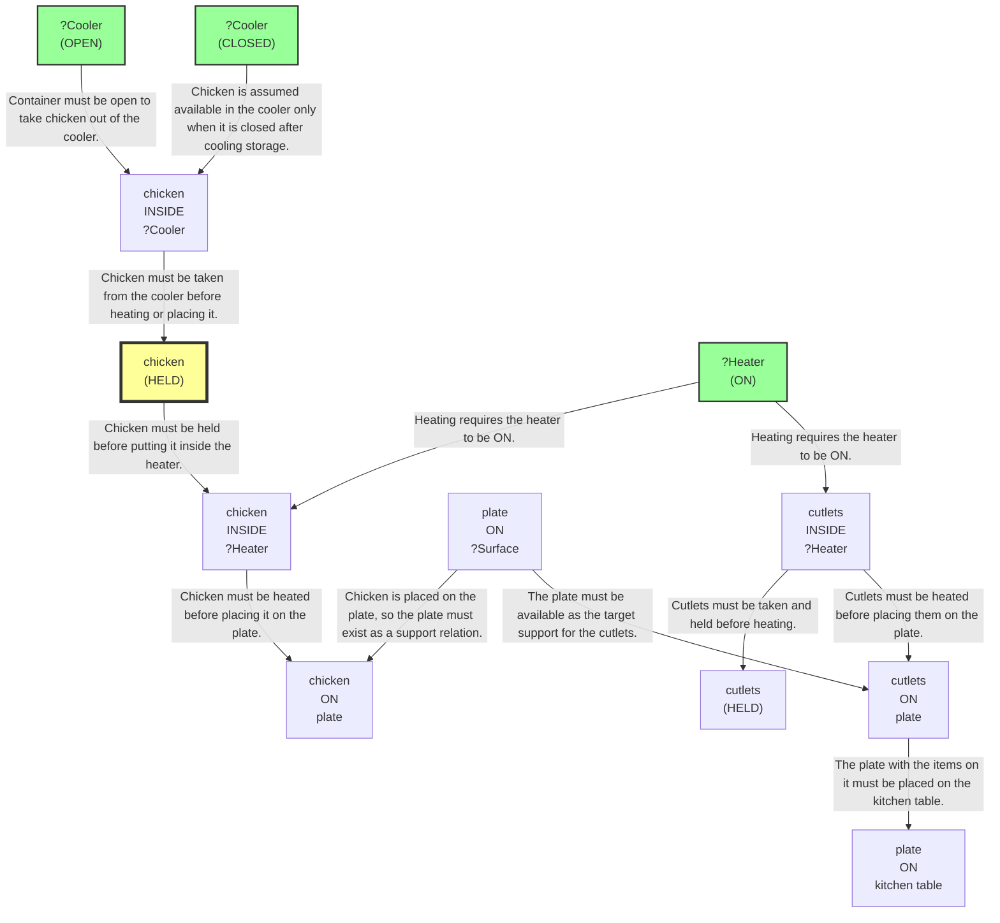
- **Observed Items (19)**: door(145) [OPEN], door(146) [OPEN], plate(170), plate(171), plate(172), plate(173), plate(177), plate(178), plate(184), kitchentable(199), fridge(225) [OPEN], microwave(234) [CLOSED,OFF], character(1), chicken(241) [COLD], cutlets(242) [COLD]...


### [PerceptionFilter] Output
```json
{
  "reasoning": "Reused cached class selection.",
  "selected_classes": [
    "plate",
    "chicken",
    "character",
    "cutlets",
    "microwave",
    "fridge",
    "door",
    "kitchentable"
  ],
  "raw_class_count": 45
}
```

### [LLMExecutor] Output
```json
{
  "reasoning": "We already hold chicken(241), so N1 is satisfied. The next unmet prerequisite toward heating the chicken is to get the heater open/accessible. In the current graph, microwave(234) is the only heater candidate, and it is CLOSED and OFF. Since the last two attempts to walk to chicken failed and the chicken is already held, walking to the microwave is the correct next step before any open/switch actions. This also avoids repeating the failed walk to chicken.",
  "satisfied_nodes": [
    "N1"
  ],
  "current_node_focus": "N3",
  "mapped_variables": {
    "?Cooler": "fridge(225)",
    "?Heater": "microwave(234)",
    "?Surface": "kitchentable(199)"
  },
  "action": "[walk] <microwave> (234)"
}
```

### [RoboStateMultiTaskController] Output
```json
{
  "action": "[walk] <microwave> (234)",
  "active_task_id": "task_1",
  "task_context": {
    "active_task_id": "task_1",
    "pending_task_ids": [],
    "satisfied_task_ids": []
  },
  "source": "llm_executor"
}
```
## Step 8
- **Action**: `[walk] <microwave> (234)`
- **Action Success**: `True`
- **Action Message**: {'0': {'message': 'Success'}}
- **Active Task**: `task_1`
- **Decision Source**: `llm_executor`
- **Task Progress**: T3_without_memory_P1_03=pending
- **SDG Status**:
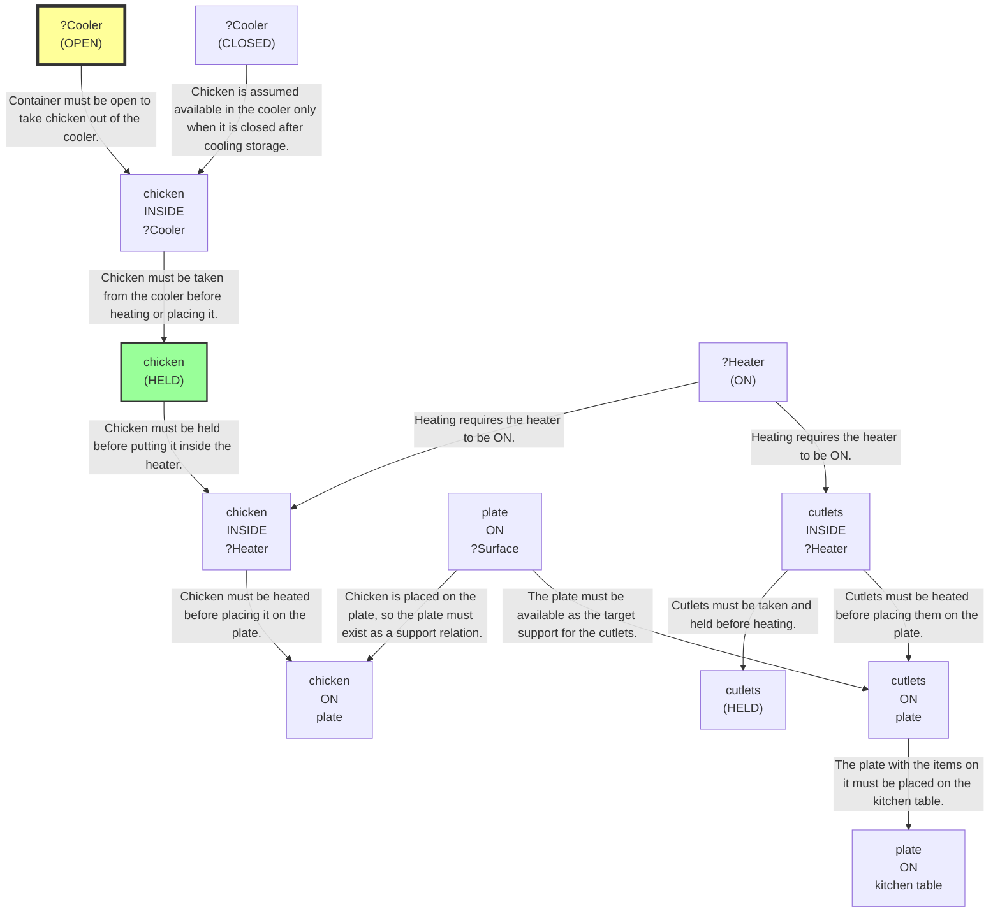
- **Observed Items (20)**: door(145) [OPEN], door(146) [OPEN], plate(170), plate(171), plate(172), plate(173), plate(177), plate(178), plate(184), kitchentable(199), fridge(225) [OPEN], microwave(234) [CLOSED,OFF], character(1), chicken(241) [COLD], cutlets(242) [COLD]...


### [PerceptionFilter] Output
```json
{
  "reasoning": "Reused cached class selection.",
  "selected_classes": [
    "plate",
    "chicken",
    "character",
    "cutlets",
    "microwave",
    "fridge",
    "door",
    "kitchentable"
  ],
  "raw_class_count": 45
}
```

### [LLMExecutor] Output
```json
{
  "reasoning": "The previous [walk] attempts to chicken(241) failed because the graph reports no interaction positions for that object, so repeating that walk would loop without progress. To continue the task, I should switch to the other required food item that is available in the fridge. The cutlets(242) are inside the open fridge(225), and the next SDG-relevant step is to get them held before heating. Since I cannot grab from across the room, I must first walk to the cutlets object itself.",
  "satisfied_nodes": [
    "N2",
    "N3",
    "N4"
  ],
  "current_node_focus": "N9",
  "mapped_variables": {
    "?Cooler": "fridge(225)",
    "?Heater": "microwave(234)",
    "?Surface": "kitchentable(199)"
  },
  "action": "[walk] <cutlets> (242)"
}
```

### [RoboStateMultiTaskController] Output
```json
{
  "action": "[walk] <cutlets> (242)",
  "active_task_id": "task_1",
  "task_context": {
    "active_task_id": "task_1",
    "pending_task_ids": [],
    "satisfied_task_ids": []
  },
  "source": "llm_executor"
}
```
## Step 9
- **Action**: `[walk] <cutlets> (242)`
- **Action Success**: `False`
- **Action Message**: {'0': {'message': 'ScriptExcutor 0: PROCESS WALK: Can not select object: cutlets. REASON: No interaction positions\nEXECUTION_GENERAL: Script is impossible to execute\n\n'}}
- **Active Task**: `task_1`
- **Decision Source**: `llm_executor`
- **Task Progress**: T3_without_memory_P1_03=pending
- **SDG Status**:
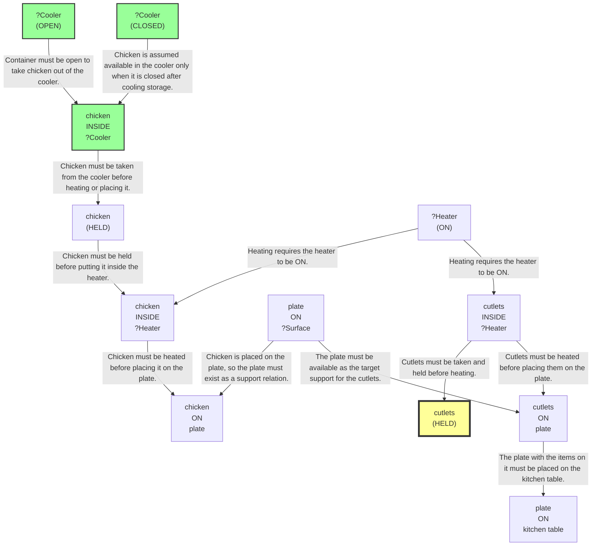
- **Observed Items (20)**: door(145) [OPEN], door(146) [OPEN], plate(170), plate(171), plate(172), plate(173), plate(177), plate(178), plate(184), kitchentable(199), fridge(225) [OPEN], microwave(234) [CLOSED,OFF], character(1), chicken(241) [COLD], cutlets(242) [COLD]...


### [PerceptionFilter] Output
```json
{
  "reasoning": "Reused cached class selection.",
  "selected_classes": [
    "plate",
    "chicken",
    "character",
    "cutlets",
    "microwave",
    "fridge",
    "door",
    "kitchentable"
  ],
  "raw_class_count": 45
}
```

### [LLMExecutor] Output
```json
{
  "reasoning": "The current task is to heat and serve chicken and cutlets. I already hold chicken(241) in my right hand, and it is close to me. The best immediate progress is to get the other required food item, cutlets(242). Since cutlets are inside the open fridge(225) and the previous walk attempt targeted the object directly and failed because it has no interaction positions, I should now walk to the fridge itself so I can access the cutlets next. This avoids repeating the failed object walk and follows the required container-access sequence.",
  "satisfied_nodes": [
    "N1",
    "N2"
  ],
  "current_node_focus": "N10",
  "mapped_variables": {
    "?Cooler": "fridge(225)",
    "?Heater": "microwave(234)",
    "?Surface": "kitchentable(199)"
  },
  "action": "[walk] <fridge> (225)"
}
```

### [RoboStateMultiTaskController] Output
```json
{
  "action": "[walk] <fridge> (225)",
  "active_task_id": "task_1",
  "task_context": {
    "active_task_id": "task_1",
    "pending_task_ids": [],
    "satisfied_task_ids": []
  },
  "source": "llm_executor"
}
```
## Step 10
- **Action**: `[walk] <fridge> (225)`
- **Action Success**: `True`
- **Action Message**: {'0': {'message': 'Success'}}
- **Active Task**: `task_1`
- **Decision Source**: `llm_executor`
- **Task Progress**: T3_without_memory_P1_03=pending
- **SDG Status**:
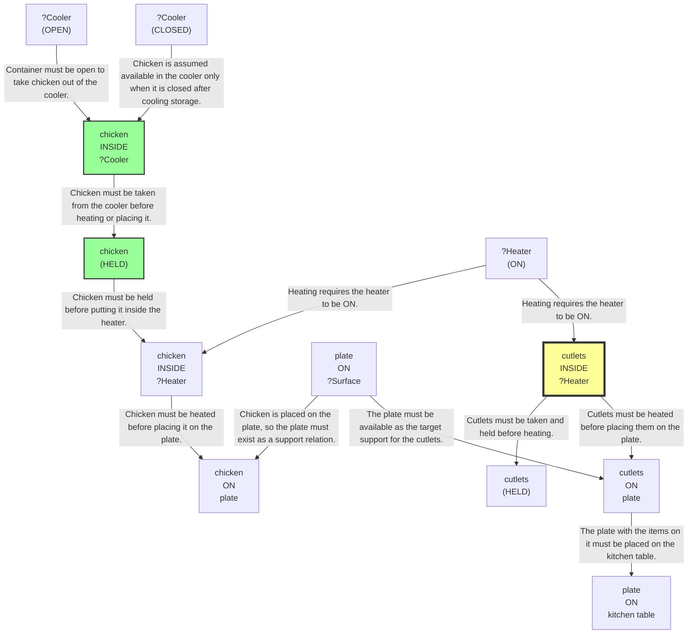
- **Observed Items (20)**: door(145) [OPEN], door(146) [OPEN], plate(170), plate(171), plate(172), plate(173), plate(177), plate(178), plate(184), kitchentable(199), fridge(225) [OPEN], microwave(234) [CLOSED,OFF], character(1), chicken(241) [COLD], cutlets(242) [COLD]...


### [PerceptionFilter] Output
```json
{
  "reasoning": "Reused cached class selection.",
  "selected_classes": [
    "plate",
    "chicken",
    "character",
    "cutlets",
    "microwave",
    "fridge",
    "door",
    "kitchentable"
  ],
  "raw_class_count": 45
}
```

### [LLMExecutor] Output
```json
{
  "reasoning": "The chicken is already held in the right hand, so the next unmet prerequisite for the chicken side of the goal is to get the cooler open so the chicken can be placed inside the heater path. The only suitable cooler in the graph is the fridge(225), which is a container with CAN_OPEN and is currently OPEN, so the next useful step is not to reopen it. Since the previous walk attempts failed because chicken/cutlets had no interaction positions, I should not repeat that. The remaining actionable path is to move toward the microwave, which serves as the heater in the SDG, so I can later open/switch it on and process the food. However, because this task requires a strict single atomic action and I am already near the fridge/table area, the most direct next step toward the heater workflow is to walk to the microwave(234).",
  "satisfied_nodes": [],
  "current_node_focus": "N6",
  "mapped_variables": {
    "?Cooler": "fridge(225)",
    "?Heater": "microwave(234)",
    "?Surface": "kitchentable(199)"
  },
  "action": "[walk] <microwave> (234)"
}
```

### [RoboStateMultiTaskController] Output
```json
{
  "action": "[walk] <microwave> (234)",
  "active_task_id": "task_1",
  "task_context": {
    "active_task_id": "task_1",
    "pending_task_ids": [],
    "satisfied_task_ids": []
  },
  "source": "llm_executor"
}
```
## Step 11
- **Action**: `[walk] <microwave> (234)`
- **Action Success**: `True`
- **Action Message**: {'0': {'message': 'Success'}}
- **Active Task**: `task_1`
- **Decision Source**: `llm_executor`
- **Task Progress**: T3_without_memory_P1_03=pending
- **SDG Status**:
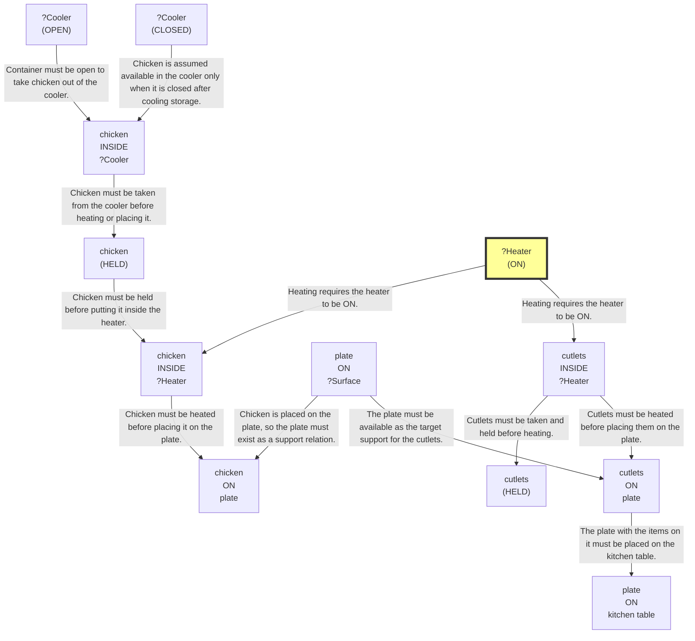
- **Observed Items (20)**: door(145) [OPEN], door(146) [OPEN], plate(170), plate(171), plate(172), plate(173), plate(177), plate(178), plate(184), kitchentable(199), fridge(225) [OPEN], microwave(234) [CLOSED,OFF], character(1), chicken(241) [COLD], cutlets(242) [COLD]...


### [PerceptionFilter] Output
```json
{
  "reasoning": "Reused cached class selection.",
  "selected_classes": [
    "plate",
    "chicken",
    "character",
    "cutlets",
    "microwave",
    "fridge",
    "door",
    "kitchentable"
  ],
  "raw_class_count": 45
}
```

### [LLMExecutor] Output
```json
{
  "reasoning": "The current graph shows chicken(241) is already held and close, so N1 is satisfied. Cutlets(242) are the next required item but are inside the fridge(225), which is open. Since the previous walk-to-cutlets attempt failed because cutlets have no interaction position from the current location, the correct next step is to walk to the fridge first so the cutlets can be accessed and then grabbed on the following action.",
  "satisfied_nodes": [
    "N1"
  ],
  "current_node_focus": "N10",
  "mapped_variables": {
    "?Cooler": "fridge(225)",
    "?Heater": "microwave(234)",
    "?Surface": "kitchentable(199)"
  },
  "action": "[walk] <fridge> (225)"
}
```

### [RoboStateMultiTaskController] Output
```json
{
  "action": "[walk] <fridge> (225)",
  "active_task_id": "task_1",
  "task_context": {
    "active_task_id": "task_1",
    "pending_task_ids": [],
    "satisfied_task_ids": []
  },
  "source": "llm_executor"
}
```
## Step 12
- **Action**: `[walk] <fridge> (225)`
- **Action Success**: `True`
- **Action Message**: {'0': {'message': 'Success'}}
- **Active Task**: `task_1`
- **Decision Source**: `llm_executor`
- **Task Progress**: T3_without_memory_P1_03=pending
- **SDG Status**:
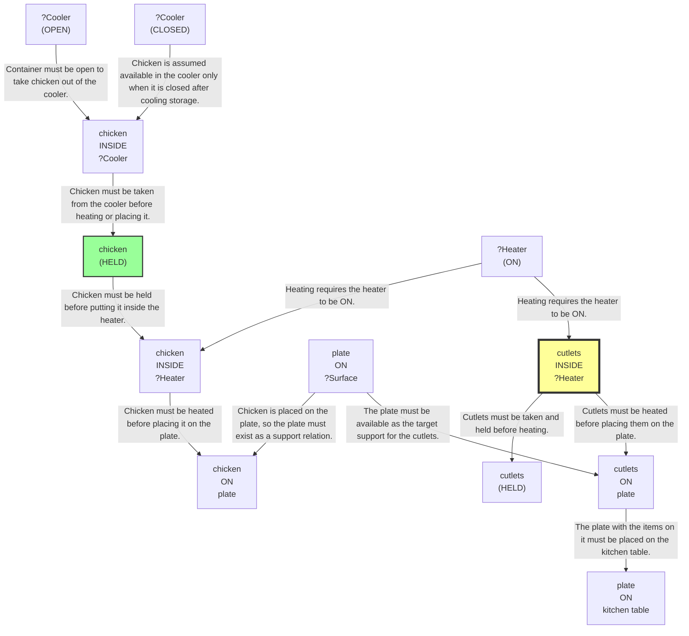
- **Observed Items (20)**: door(145) [OPEN], door(146) [OPEN], plate(170), plate(171), plate(172), plate(173), plate(177), plate(178), plate(184), kitchentable(199), fridge(225) [OPEN], microwave(234) [CLOSED,OFF], character(1), chicken(241) [COLD], cutlets(242) [COLD]...


### [PerceptionFilter] Output
```json
{
  "reasoning": "Reused cached class selection.",
  "selected_classes": [
    "plate",
    "chicken",
    "character",
    "cutlets",
    "microwave",
    "fridge",
    "door",
    "kitchentable"
  ],
  "raw_class_count": 45
}
```

### [LLMExecutor] Output
```json
{
  "reasoning": "The current focus is to satisfy N1: chicken must be HELD. The graph shows chicken(241) is already CLOSE to the character, and the character is currently holding chicken(241) in the right hand. Therefore the next unmet prerequisite is to continue with the chicken-related sequence by moving it toward the heater; however, the microwave is the only explicit heater available and it is currently CLOSED and OFF. Since we cannot put the chicken in until we are near the heater and it is on, the immediate valid next action is to walk to the microwave to prepare for opening and heating. This also avoids repeating the failed walk to cutlets, which are not an accessible interaction target in the graph.",
  "satisfied_nodes": [
    "N1"
  ],
  "current_node_focus": "N6",
  "mapped_variables": {
    "?Cooler": "fridge(225)",
    "?Heater": "microwave(234)",
    "?Surface": "kitchentable(199)"
  },
  "action": "[walk] <microwave> (234)"
}
```

### [RoboStateMultiTaskController] Output
```json
{
  "action": "[walk] <microwave> (234)",
  "active_task_id": "task_1",
  "task_context": {
    "active_task_id": "task_1",
    "pending_task_ids": [],
    "satisfied_task_ids": []
  },
  "source": "llm_executor"
}
```
## Step 13
- **Action**: `[walk] <microwave> (234)`
- **Action Success**: `True`
- **Action Message**: {'0': {'message': 'Success'}}
- **Active Task**: `task_1`
- **Decision Source**: `llm_executor`
- **Task Progress**: T3_without_memory_P1_03=pending
- **SDG Status**:
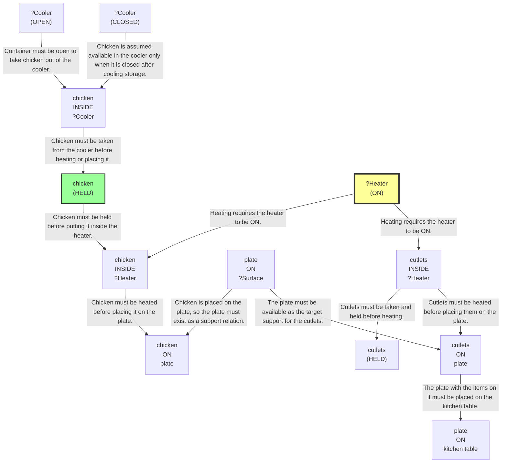
- **Observed Items (20)**: door(145) [OPEN], door(146) [OPEN], plate(170), plate(171), plate(172), plate(173), plate(177), plate(178), plate(184), kitchentable(199), fridge(225) [OPEN], microwave(234) [CLOSED,OFF], character(1), chicken(241) [COLD], cutlets(242) [COLD]...


### [PerceptionFilter] Output
```json
{
  "reasoning": "Reused cached class selection.",
  "selected_classes": [
    "plate",
    "chicken",
    "character",
    "cutlets",
    "microwave",
    "fridge",
    "door",
    "kitchentable"
  ],
  "raw_class_count": 45
}
```

### [LLMExecutor] Output
```json
{
  "reasoning": "The chicken is already held and close to the character, so the next SDG step is to place it into the heater. The heater candidate in the graph is the microwave(234), which is closed and currently off; since the SDG requires the heater ON before inserting the chicken, the immediate actionable gap is that the microwave must be opened before we can put the chicken inside. However, because the instruction says do not repeat a walk action if just did it, and the character is already close to the microwave, the next atomic step toward satisfying N5/N6 is to open the microwave.",
  "satisfied_nodes": [
    "N1"
  ],
  "current_node_focus": "N3",
  "mapped_variables": {
    "?Heater": "microwave(234)",
    "?Cooler": "fridge(225)",
    "?Surface": "kitchentable(199)"
  },
  "action": "[open] <microwave> (234)"
}
```

### [RoboStateMultiTaskController] Output
```json
{
  "action": "[open] <microwave> (234)",
  "active_task_id": "task_1",
  "task_context": {
    "active_task_id": "task_1",
    "pending_task_ids": [],
    "satisfied_task_ids": []
  },
  "source": "llm_executor"
}
```
## Step 14
- **Action**: `[open] <microwave> (234)`
- **Action Success**: `True`
- **Action Message**: {'0': {'message': 'Success'}}
- **Active Task**: `task_1`
- **Decision Source**: `llm_executor`
- **Task Progress**: T3_without_memory_P1_03=pending
- **SDG Status**:

- **Observed Items (20)**: door(145) [OPEN], door(146) [OPEN], plate(170), plate(171), plate(172), plate(173), plate(177), plate(178), plate(184), kitchentable(199), fridge(225) [OPEN], microwave(234) [CLOSED,OFF], character(1), chicken(241) [COLD], cutlets(242) [COLD]...

