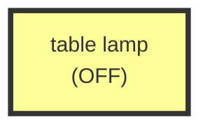
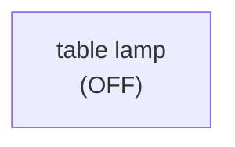

# 🚀 VirtualHome Agent Episode Log


### [GoalReasoner (Module A - Intent)] Output
```json
{
  "is_instruction_obviously_vague": false,
  "clarification_question": null,
  "target_object": "table lamp",
  "location_hint": null,
  "reasoning_chain": [
    {
      "question": "Why does the user want this object?",
      "answer": "To change the lamp's state from on to off."
    },
    {
      "question": "Why is that important?",
      "answer": "To stop the lamp from emitting light and using power."
    },
    {
      "question": "What fundamental need does this fulfill?",
      "answer": "The user wants to control illumination in the room."
    },
    {
      "question": "Are there any deeper psychological or physical motivations?",
      "answer": "They may want a darker, quieter, or more energy-efficient environment."
    }
  ],
  "deep_intent": "The user wants to reduce or stop illumination in the room.",
  "acceptable_alternatives_properties": [
    {
      "priority": 1,
      "description": "Any other indoor light source that is currently on and can be turned off, such as a floor lamp or desk lamp."
    },
    {
      "priority": 2,
      "description": "Other room lighting fixtures that can be switched off, such as ceiling lights or wall sconces."
    },
    {
      "priority": 3,
      "description": "Portable lighting devices that can be powered down, such as a flashlight or bedside light."
    },
    {
      "priority": 4,
      "description": "Any action that results in a darker indoor environment, such as closing blinds if the lamp is not the main source of light."
    }
  ]
}
```

### [PerceptionFilter] Output
```json
{
  "reasoning": "The goal is to turn off the table lamp, so the minimum needed is the lamp itself plus any direct control tool that could switch room lighting off if needed. The SDG explicitly requires the table lamp to be OFF, and the scene includes a lightswitch as a relevant backup control. No other objects are necessary.",
  "selected_classes": [
    "bed",
    "character",
    "ceiling",
    "floor",
    "lightswitch",
    "wall",
    "tablelamp",
    "desk"
  ],
  "raw_class_count": 33
}
```

### [LLMExecutor] Output
```json
{
  "reasoning": "The SDG requires the table lamp to be OFF. In the filtered graph there are two candidate table lamps, and no lamp is currently marked ON/OFF. The most likely control for the lamp is the lightswitch(173), which is the only explicit switch control visible. Since switching requires being near the object, the next step is to walk to the lightswitch first so I can inspect/use it to turn the lamp off.",
  "satisfied_nodes": [],
  "current_node_focus": "N1",
  "mapped_variables": {
    "?Switch": "lightswitch(173)"
  },
  "action": "[walk] <lightswitch> (173)"
}
```

### [RoboStateMultiTaskController] Output
```json
{
  "action": "[walk] <lightswitch> (173)",
  "active_task_id": "task_1",
  "task_context": {
    "active_task_id": "task_1",
    "pending_task_ids": [],
    "satisfied_task_ids": []
  },
  "source": "llm_executor"
}
```
## Step 0
- **Action**: `[walk] <lightswitch> (173)`
- **Action Success**: `True`
- **Action Message**: {'0': {'message': 'Success'}}
- **Active Task**: `task_1`
- **Decision Source**: `llm_executor`
- **Task Progress**: T3_without_memory_structure_G1_04=pending
- **SDG Status**:

- **Observed Items (36)**: floor(74), floor(75), floor(76), floor(77), floor(78), floor(79), floor(80), floor(81), floor(82), wall(83), wall(84), wall(85), wall(86), wall(87), wall(88)...


### [PerceptionFilter] Output
```json
{
  "reasoning": "Reused cached class selection.",
  "selected_classes": [
    "bed",
    "character",
    "ceiling",
    "floor",
    "lightswitch",
    "wall",
    "tablelamp",
    "desk"
  ],
  "raw_class_count": 33
}
```

### [LLMExecutor] Output
```json
{
  "reasoning": "The active goal is to turn the table lamp OFF. The filtered graph shows two candidate table lamps, 102 and 103, with no ON/OFF state indicated. Since the task is to switch off the lamp and a prior walk brought us to the lightswitch, the next atomic step should target the switch itself to control the lighting source. I will focus on the lightswitch instance already approached.",
  "satisfied_nodes": [],
  "current_node_focus": "N1",
  "mapped_variables": {
    "?Switch": "lightswitch(173)"
  },
  "action": "[switchon] <lightswitch> (173)"
}
```

### [RoboStateMultiTaskController] Output
```json
{
  "action": "[walk] <bathroom> (11)",
  "active_task_id": null,
  "task_context": {
    "active_task_id": null,
    "pending_task_ids": [
      "task_1"
    ],
    "satisfied_task_ids": []
  },
  "source": "loop_recovery_room_revisit"
}
```
## Step 1
- **Action**: `[walk] <bathroom> (11)`
- **Action Success**: `True`
- **Action Message**: {'0': {'message': 'Success'}}
- **Decision Source**: `loop_recovery_room_revisit`
- **Task Progress**: T3_without_memory_structure_G1_04=pending
- **SDG Status**:
No SDG active.
- **Observed Items (74)**: floor(74), floor(75), floor(76), floor(77), floor(78), floor(79), floor(80), floor(81), floor(82), wall(83), wall(84), wall(85), wall(86), wall(87), wall(88)...


### [RoboStateMultiTaskController] Output
```json
{
  "action": "[walk] <kitchen> (205)",
  "active_task_id": "task_1",
  "task_context": {
    "active_task_id": "task_1",
    "pending_task_ids": [],
    "satisfied_task_ids": []
  },
  "source": "room_frontier"
}
```
## Step 2
- **Action**: `[walk] <kitchen> (205)`
- **Action Success**: `True`
- **Action Message**: {'0': {'message': 'Success'}}
- **Active Task**: `task_1`
- **Decision Source**: `room_frontier`
- **Task Progress**: T3_without_memory_structure_G1_04=pending
- **SDG Status**:

- **Observed Items (66)**: floor(12), floor(13), floor(14), floor(15), floor(16), floor(17), wall(18), wall(19), wall(20), wall(21), wall(22), wall(23), ceiling(24), ceiling(25), ceiling(26)...


### [RoboStateMultiTaskController] Output
```json
{
  "action": "[walk] <livingroom> (335)",
  "active_task_id": "task_1",
  "task_context": {
    "active_task_id": "task_1",
    "pending_task_ids": [],
    "satisfied_task_ids": []
  },
  "source": "room_frontier"
}
```
## Step 3
- **Action**: `[walk] <livingroom> (335)`
- **Action Success**: `True`
- **Action Message**: {'0': {'message': 'Success'}}
- **Active Task**: `task_1`
- **Decision Source**: `room_frontier`
- **Task Progress**: T3_without_memory_structure_G1_04=pending
- **SDG Status**:

- **Observed Items (112)**: floor(206), floor(207), floor(208), floor(209), floor(210), floor(211), wall(212), wall(213), wall(214), wall(215), wall(216), wall(217), ceiling(218), ceiling(219), ceiling(220)...


### [RoboStateMultiTaskController] Output
```json
{
  "action": "[walk] <bedroom> (73)",
  "active_task_id": null,
  "task_context": {
    "active_task_id": null,
    "pending_task_ids": [
      "task_1"
    ],
    "satisfied_task_ids": []
  },
  "source": "loop_recovery_room_revisit"
}
```
## Step 4
- **Action**: `[walk] <bedroom> (73)`
- **Action Success**: `True`
- **Action Message**: {'0': {'message': 'Success'}}
- **Decision Source**: `loop_recovery_room_revisit`
- **Task Progress**: T3_without_memory_structure_G1_04=pending
- **SDG Status**:
No SDG active.
- **Observed Items (79)**: floor(336), floor(337), floor(338), floor(339), floor(340), floor(341), floor(342), floor(343), floor(344), wall(345), wall(346), wall(347), wall(348), wall(349), wall(350)...


### [PerceptionFilter] Output
```json
{
  "reasoning": "Reused cached class selection.",
  "selected_classes": [
    "bed",
    "character",
    "ceiling",
    "floor",
    "lightswitch",
    "wall",
    "tablelamp",
    "desk"
  ],
  "raw_class_count": 33
}
```

### [LLMExecutor] Output
```json
{
  "reasoning": "The SDG has a single sink node: the table lamp must be OFF. The filtered graph shows two candidate table lamps (102, 103) but no state information indicating which one is on. Since the goal is to turn off a lamp, the most direct next step is to move close to one candidate lamp to inspect/interact with it. I will target tablelamp(102) as the first plausible instance in the current room context.",
  "satisfied_nodes": [],
  "current_node_focus": "N1",
  "mapped_variables": {},
  "action": "[walk] <tablelamp> (102)"
}
```

### [RoboStateMultiTaskController] Output
```json
{
  "action": "[walk] <tablelamp> (102)",
  "active_task_id": "task_1",
  "task_context": {
    "active_task_id": "task_1",
    "pending_task_ids": [],
    "satisfied_task_ids": []
  },
  "source": "llm_executor"
}
```
## Step 5
- **Action**: `[walk] <tablelamp> (102)`
- **Action Success**: `True`
- **Action Message**: {'0': {'message': 'Success'}}
- **Active Task**: `task_1`
- **Decision Source**: `llm_executor`
- **Task Progress**: T3_without_memory_structure_G1_04=pending
- **SDG Status**:

- **Observed Items (36)**: floor(74), floor(75), floor(76), floor(77), floor(78), floor(79), floor(80), floor(81), floor(82), wall(83), wall(84), wall(85), wall(86), wall(87), wall(88)...


### [PerceptionFilter] Output
```json
{
  "reasoning": "Reused cached class selection.",
  "selected_classes": [
    "bed",
    "character",
    "ceiling",
    "floor",
    "lightswitch",
    "wall",
    "tablelamp",
    "desk"
  ],
  "raw_class_count": 33
}
```

### [LLMExecutor] Output
```json
{
  "reasoning": "The active goal is to turn the table lamp OFF. The current graph shows two table lamps (102, 103) with no OFF state indicated, and we are already at the bedroom/table lamp area from the previous walk actions. The next atomic step toward satisfying N1 is to switch off the lamp most likely corresponding to the target; tablelamp(102) is the current focus because it was the object last approached and the task specifically names a table lamp, not a switch or other light source.",
  "satisfied_nodes": [],
  "current_node_focus": "N1",
  "mapped_variables": {},
  "action": "[switchoff] <tablelamp> (102)"
}
```

### [RoboStateMultiTaskController] Output
```json
{
  "action": "[walk] <bathroom> (11)",
  "active_task_id": null,
  "task_context": {
    "active_task_id": null,
    "pending_task_ids": [
      "task_1"
    ],
    "satisfied_task_ids": []
  },
  "source": "loop_recovery_room_revisit"
}
```
## Step 6
- **Action**: `[walk] <bathroom> (11)`
- **Action Success**: `True`
- **Action Message**: {'0': {'message': 'Success'}}
- **Decision Source**: `loop_recovery_room_revisit`
- **Task Progress**: T3_without_memory_structure_G1_04=pending
- **SDG Status**:
No SDG active.
- **Observed Items (74)**: floor(74), floor(75), floor(76), floor(77), floor(78), floor(79), floor(80), floor(81), floor(82), wall(83), wall(84), wall(85), wall(86), wall(87), wall(88)...


### [RoboStateMultiTaskController] Output
```json
{
  "action": "[walk] <kitchen> (205)",
  "active_task_id": null,
  "task_context": {
    "active_task_id": null,
    "pending_task_ids": [
      "task_1"
    ],
    "satisfied_task_ids": []
  },
  "source": "loop_recovery_room_revisit"
}
```
## Step 7
- **Action**: `[walk] <kitchen> (205)`
- **Action Success**: `True`
- **Action Message**: {'0': {'message': 'Success'}}
- **Decision Source**: `loop_recovery_room_revisit`
- **Task Progress**: T3_without_memory_structure_G1_04=pending
- **SDG Status**:
No SDG active.
- **Observed Items (66)**: floor(12), floor(13), floor(14), floor(15), floor(16), floor(17), wall(18), wall(19), wall(20), wall(21), wall(22), wall(23), ceiling(24), ceiling(25), ceiling(26)...


### [RoboStateMultiTaskController] Output
```json
{
  "action": "[walk] <livingroom> (335)",
  "active_task_id": null,
  "task_context": {
    "active_task_id": null,
    "pending_task_ids": [
      "task_1"
    ],
    "satisfied_task_ids": []
  },
  "source": "loop_recovery_room_revisit"
}
```
## Step 8
- **Action**: `[walk] <livingroom> (335)`
- **Action Success**: `True`
- **Action Message**: {'0': {'message': 'Success'}}
- **Decision Source**: `loop_recovery_room_revisit`
- **Task Progress**: T3_without_memory_structure_G1_04=pending
- **SDG Status**:
No SDG active.
- **Observed Items (112)**: floor(206), floor(207), floor(208), floor(209), floor(210), floor(211), wall(212), wall(213), wall(214), wall(215), wall(216), wall(217), ceiling(218), ceiling(219), ceiling(220)...


### [RoboStateMultiTaskController] Output
```json
{
  "action": "[walk] <bedroom> (73)",
  "active_task_id": null,
  "task_context": {
    "active_task_id": null,
    "pending_task_ids": [
      "task_1"
    ],
    "satisfied_task_ids": []
  },
  "source": "loop_recovery_room_revisit"
}
```
## Step 9
- **Action**: `[walk] <bedroom> (73)`
- **Action Success**: `True`
- **Action Message**: {'0': {'message': 'Success'}}
- **Decision Source**: `loop_recovery_room_revisit`
- **Task Progress**: T3_without_memory_structure_G1_04=pending
- **SDG Status**:
No SDG active.
- **Observed Items (79)**: floor(336), floor(337), floor(338), floor(339), floor(340), floor(341), floor(342), floor(343), floor(344), wall(345), wall(346), wall(347), wall(348), wall(349), wall(350)...


### [PerceptionFilter] Output
```json
{
  "reasoning": "Reused cached class selection.",
  "selected_classes": [
    "bed",
    "character",
    "ceiling",
    "floor",
    "lightswitch",
    "wall",
    "tablelamp",
    "desk"
  ],
  "raw_class_count": 33
}
```

### [LLMExecutor] Output
```json
{
  "reasoning": "The active goal is to make the table lamp OFF. The current graph shows two candidate table lamps, but neither is marked ON, and the SDG only asks for the table lamp state OFF. Since no lamp is currently indicated as ON, the most direct next step is to interact with the most recently targeted lamp instance near the last known bedroom location and attempt to switch it off if needed. However, because the graph does not expose an ON state, the safest next atomic action is to check the lamp by switching it off rather than moving again. This avoids redundant walking and aligns with the goal.",
  "satisfied_nodes": [],
  "current_node_focus": "N1",
  "mapped_variables": {},
  "action": "[switchoff] <tablelamp> (102)"
}
```

### [RoboStateMultiTaskController] Output
```json
{
  "action": "[walk] <bathroom> (11)",
  "active_task_id": null,
  "task_context": {
    "active_task_id": null,
    "pending_task_ids": [
      "task_1"
    ],
    "satisfied_task_ids": []
  },
  "source": "loop_recovery_room_revisit"
}
```
## Step 10
- **Action**: `[walk] <bathroom> (11)`
- **Action Success**: `True`
- **Action Message**: {'0': {'message': 'Success'}}
- **Decision Source**: `loop_recovery_room_revisit`
- **Task Progress**: T3_without_memory_structure_G1_04=pending
- **SDG Status**:
No SDG active.
- **Observed Items (74)**: floor(74), floor(75), floor(76), floor(77), floor(78), floor(79), floor(80), floor(81), floor(82), wall(83), wall(84), wall(85), wall(86), wall(87), wall(88)...


### [RoboStateMultiTaskController] Output
```json
{
  "action": "[walk] <kitchen> (205)",
  "active_task_id": null,
  "task_context": {
    "active_task_id": null,
    "pending_task_ids": [
      "task_1"
    ],
    "satisfied_task_ids": []
  },
  "source": "loop_recovery_room_revisit"
}
```
## Step 11
- **Action**: `[walk] <kitchen> (205)`
- **Action Success**: `True`
- **Action Message**: {'0': {'message': 'Success'}}
- **Decision Source**: `loop_recovery_room_revisit`
- **Task Progress**: T3_without_memory_structure_G1_04=pending
- **SDG Status**:
No SDG active.
- **Observed Items (66)**: floor(12), floor(13), floor(14), floor(15), floor(16), floor(17), wall(18), wall(19), wall(20), wall(21), wall(22), wall(23), ceiling(24), ceiling(25), ceiling(26)...


### [RoboStateMultiTaskController] Output
```json
{
  "action": "[walk] <livingroom> (335)",
  "active_task_id": null,
  "task_context": {
    "active_task_id": null,
    "pending_task_ids": [
      "task_1"
    ],
    "satisfied_task_ids": []
  },
  "source": "loop_recovery_room_revisit"
}
```
## Step 12
- **Action**: `[walk] <livingroom> (335)`
- **Action Success**: `True`
- **Action Message**: {'0': {'message': 'Success'}}
- **Decision Source**: `loop_recovery_room_revisit`
- **Task Progress**: T3_without_memory_structure_G1_04=pending
- **SDG Status**:
No SDG active.
- **Observed Items (112)**: floor(206), floor(207), floor(208), floor(209), floor(210), floor(211), wall(212), wall(213), wall(214), wall(215), wall(216), wall(217), ceiling(218), ceiling(219), ceiling(220)...


### [RoboStateMultiTaskController] Output
```json
{
  "action": "[walk] <bedroom> (73)",
  "active_task_id": null,
  "task_context": {
    "active_task_id": null,
    "pending_task_ids": [
      "task_1"
    ],
    "satisfied_task_ids": []
  },
  "source": "loop_recovery_room_revisit"
}
```
## Step 13
- **Action**: `[walk] <bedroom> (73)`
- **Action Success**: `True`
- **Action Message**: {'0': {'message': 'Success'}}
- **Decision Source**: `loop_recovery_room_revisit`
- **Task Progress**: T3_without_memory_structure_G1_04=pending
- **SDG Status**:
No SDG active.
- **Observed Items (79)**: floor(336), floor(337), floor(338), floor(339), floor(340), floor(341), floor(342), floor(343), floor(344), wall(345), wall(346), wall(347), wall(348), wall(349), wall(350)...


### [PerceptionFilter] Output
```json
{
  "reasoning": "Reused cached class selection.",
  "selected_classes": [
    "bed",
    "character",
    "ceiling",
    "floor",
    "lightswitch",
    "wall",
    "tablelamp",
    "desk"
  ],
  "raw_class_count": 33
}
```

### [LLMExecutor] Output
```json
{
  "reasoning": "The active goal is to make the table lamp OFF. The filtered graph shows two table lamps (102, 103) and a lightswitch (173), but no explicit ON/OFF state is visible for either lamp. Since the previous actions repeatedly walked through rooms and were already near tablelamp(102) once, the most likely next useful step is to interact with the lamp itself rather than keep traveling. Because switching an object requires proximity and we are not guaranteed to still be beside it, the safest single atomic action is to walk to the lamp instance most recently approached, tablelamp(102), to set up a subsequent switch-off attempt.",
  "satisfied_nodes": [],
  "current_node_focus": "N1",
  "mapped_variables": {},
  "action": "[walk] <tablelamp> (102)"
}
```

### [RoboStateMultiTaskController] Output
```json
{
  "action": "[walk] <tablelamp> (102)",
  "active_task_id": "task_1",
  "task_context": {
    "active_task_id": "task_1",
    "pending_task_ids": [],
    "satisfied_task_ids": []
  },
  "source": "llm_executor"
}
```
## Step 14
- **Action**: `[walk] <tablelamp> (102)`
- **Action Success**: `True`
- **Action Message**: {'0': {'message': 'Success'}}
- **Active Task**: `task_1`
- **Decision Source**: `llm_executor`
- **Task Progress**: T3_without_memory_structure_G1_04=pending
- **SDG Status**:

- **Observed Items (36)**: floor(74), floor(75), floor(76), floor(77), floor(78), floor(79), floor(80), floor(81), floor(82), wall(83), wall(84), wall(85), wall(86), wall(87), wall(88)...

