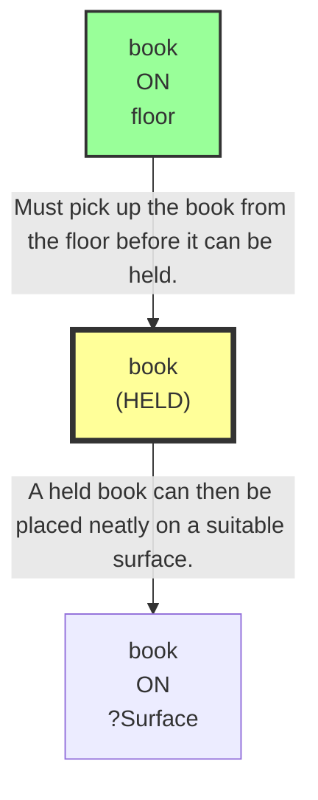
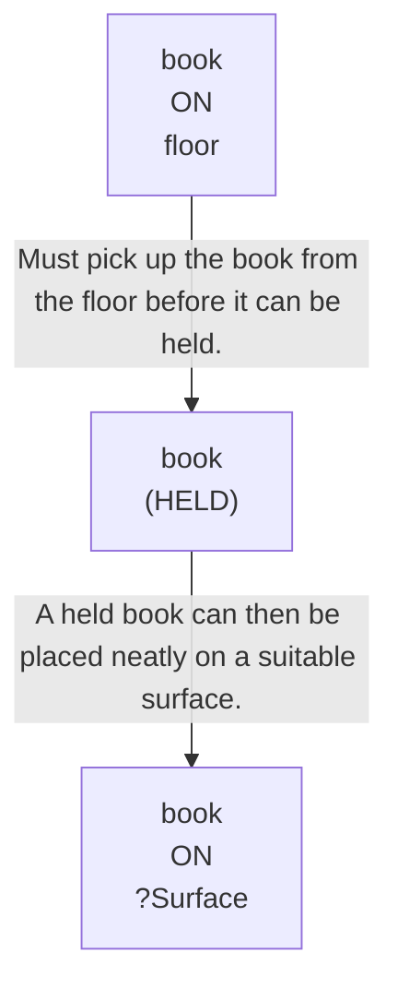
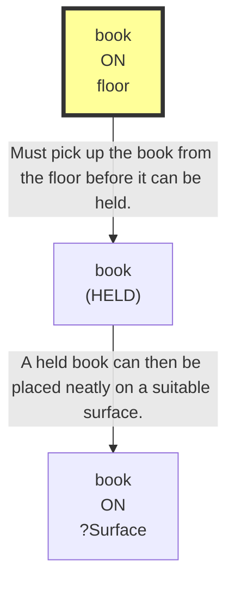

# 🚀 VirtualHome Agent Episode Log


### [GoalReasoner (Module A - Intent)] Output
```json
{
  "is_instruction_obviously_vague": false,
  "clarification_question": null,
  "target_object": "book",
  "location_hint": "floor",
  "reasoning_chain": [
    {
      "question": "Why does the user want this object?",
      "answer": "To restore the book to its proper place after it falls."
    },
    {
      "question": "Why is that important?",
      "answer": "So the area stays orderly and the book is not left out of place on the floor."
    },
    {
      "question": "What fundamental need does this fulfill?",
      "answer": "Maintaining organization and preventing clutter in the environment."
    },
    {
      "question": "Are there any deeper psychological or physical motivations?",
      "answer": "The user likely wants a tidy space and to avoid the book being damaged or obstructing movement."
    }
  ],
  "deep_intent": "The user wants to maintain order by returning a displaced item to its proper place.",
  "acceptable_alternatives_properties": [
    {
      "priority": 1,
      "description": "Other loose household items that have fallen onto the floor and should be picked up and returned to where they belong."
    },
    {
      "priority": 2,
      "description": "Other paper-based or reading materials, such as magazines or notebooks, that can be stacked or shelved neatly."
    },
    {
      "priority": 3,
      "description": "Other small portable household objects that can be tidied away to reduce clutter."
    },
    {
      "priority": 4,
      "description": "Any nearby misplaced item that is contributing to disorder and can be safely returned to an appropriate storage spot."
    }
  ]
}
```

### [PerceptionFilter] Output
```json
{
  "reasoning": "The goal is to pick up a book from the floor and place it on a suitable surface. The minimum needed is the target object book, the location floor, and a valid placement surface. From the visible objects, bookshelf is the most appropriate storage surface for a book.",
  "selected_classes": [
    "book",
    "character",
    "floor",
    "paper",
    "bookshelf"
  ],
  "raw_class_count": 41
}
```

### [LLMExecutor] Output
```json
{
  "reasoning": "The SDG requires the book to be held first (N1), and the filtered graph shows three candidate books with no distinguishing states. Since the task targets a book on the floor and I am not yet near any specific book, the correct first step is to walk to one candidate book to prepare for grabbing it. I choose book(190) as the first candidate to pursue; once near it, I can verify and grab it.",
  "satisfied_nodes": [
    "N2"
  ],
  "current_node_focus": "N1",
  "mapped_variables": {},
  "action": "[walk] <book> (190)"
}
```

### [RoboStateMultiTaskController] Output
```json
{
  "action": "[walk] <book> (190)",
  "active_task_id": "task_1",
  "task_context": {
    "active_task_id": "task_1",
    "pending_task_ids": [],
    "satisfied_task_ids": []
  },
  "source": "llm_executor"
}
```
## Step 0
- **Action**: `[walk] <book> (190)`
- **Action Success**: `True`
- **Action Message**: {'0': {'message': 'Success'}}
- **Active Task**: `task_1`
- **Decision Source**: `llm_executor`
- **Task Progress**: T3_without_memory_structure_G2_09=pending
- **SDG Status**:

- **Observed Items (19)**: floor(336), floor(337), floor(338), floor(339), floor(340), floor(341), floor(342), floor(343), floor(344), bookshelf(370), paper(451), book(190), book(191), book(268), character(1)...


### [PerceptionFilter] Output
```json
{
  "reasoning": "Reused cached class selection.",
  "selected_classes": [
    "book",
    "character",
    "floor",
    "paper",
    "bookshelf"
  ],
  "raw_class_count": 41
}
```

### [LLMExecutor] Output
```json
{
  "reasoning": "The active task is to get the book currently on the floor into a held state first. We already walked to book(190) in the previous step, and there is no indication it is held yet. Therefore the next atomic action should be to grab that specific book instance to satisfy N1 and progress from N2 toward N3.",
  "satisfied_nodes": [
    "N2"
  ],
  "current_node_focus": "N1",
  "mapped_variables": {},
  "action": "[grab] <book> (190)"
}
```

### [RoboStateMultiTaskController] Output
```json
{
  "action": "[walk] <bathroom> (11)",
  "active_task_id": null,
  "task_context": {
    "active_task_id": null,
    "pending_task_ids": [
      "task_1"
    ],
    "satisfied_task_ids": []
  },
  "source": "loop_recovery_room_revisit"
}
```
## Step 1
- **Action**: `[walk] <bathroom> (11)`
- **Action Success**: `True`
- **Action Message**: {'0': {'message': 'Success'}}
- **Decision Source**: `loop_recovery_room_revisit`
- **Task Progress**: T3_without_memory_structure_G2_09=pending
- **SDG Status**:
No SDG active.
- **Observed Items (82)**: floor(336), floor(337), floor(338), floor(339), floor(340), floor(341), floor(342), floor(343), floor(344), wall(345), wall(346), wall(347), wall(348), wall(349), wall(350)...


### [RoboStateMultiTaskController] Output
```json
{
  "action": "[walk] <bedroom> (73)",
  "active_task_id": "task_1",
  "task_context": {
    "active_task_id": "task_1",
    "pending_task_ids": [],
    "satisfied_task_ids": []
  },
  "source": "room_frontier"
}
```
## Step 2
- **Action**: `[walk] <bedroom> (73)`
- **Action Success**: `True`
- **Action Message**: {'0': {'message': 'Success'}}
- **Active Task**: `task_1`
- **Decision Source**: `room_frontier`
- **Task Progress**: T3_without_memory_structure_G2_09=pending
- **SDG Status**:

- **Observed Items (66)**: floor(12), floor(13), floor(14), floor(15), floor(16), floor(17), wall(18), wall(19), wall(20), wall(21), wall(22), wall(23), ceiling(24), ceiling(25), ceiling(26)...


### [RoboStateMultiTaskController] Output
```json
{
  "action": "[walk] <kitchen> (205)",
  "active_task_id": "task_1",
  "task_context": {
    "active_task_id": "task_1",
    "pending_task_ids": [],
    "satisfied_task_ids": []
  },
  "source": "room_frontier"
}
```
## Step 3
- **Action**: `[walk] <kitchen> (205)`
- **Action Success**: `True`
- **Action Message**: {'0': {'message': 'Success'}}
- **Active Task**: `task_1`
- **Decision Source**: `room_frontier`
- **Task Progress**: T3_without_memory_structure_G2_09=pending
- **SDG Status**:

- **Observed Items (74)**: floor(74), floor(75), floor(76), floor(77), floor(78), floor(79), floor(80), floor(81), floor(82), wall(83), wall(84), wall(85), wall(86), wall(87), wall(88)...


### [RoboStateMultiTaskController] Output
```json
{
  "action": "[walk] <livingroom> (335)",
  "active_task_id": null,
  "task_context": {
    "active_task_id": null,
    "pending_task_ids": [
      "task_1"
    ],
    "satisfied_task_ids": []
  },
  "source": "loop_recovery_room_revisit"
}
```
## Step 4
- **Action**: `[walk] <livingroom> (335)`
- **Action Success**: `True`
- **Action Message**: {'0': {'message': 'Success'}}
- **Decision Source**: `loop_recovery_room_revisit`
- **Task Progress**: T3_without_memory_structure_G2_09=pending
- **SDG Status**:
No SDG active.
- **Observed Items (111)**: floor(206), floor(207), floor(208), floor(209), floor(210), floor(211), wall(212), wall(213), wall(214), wall(215), wall(216), wall(217), ceiling(218), ceiling(219), ceiling(220)...


### [PerceptionFilter] Output
```json
{
  "reasoning": "Reused cached class selection.",
  "selected_classes": [
    "book",
    "character",
    "floor",
    "paper",
    "bookshelf"
  ],
  "raw_class_count": 41
}
```

### [LLMExecutor] Output
```json
{
  "reasoning": "The SDG requires the book to first be on the floor and then held. The current graph shows three books and multiple floor nodes, but no book is marked HELD yet. Since the user wants the displaced book returned to proper order, the best next step is to move to the most likely target book instance already previously approached: book(190). The prior action history includes walking to book(190), so the next atomic action should be to grab it, which would satisfy N2 and move toward N1.",
  "satisfied_nodes": [
    "N2"
  ],
  "current_node_focus": "N1",
  "mapped_variables": {},
  "action": "[grab] <book> (190)"
}
```

### [RoboStateMultiTaskController] Output
```json
{
  "action": "[walk] <bathroom> (11)",
  "active_task_id": null,
  "task_context": {
    "active_task_id": null,
    "pending_task_ids": [
      "task_1"
    ],
    "satisfied_task_ids": []
  },
  "source": "loop_recovery_room_revisit"
}
```
## Step 5
- **Action**: `[walk] <bathroom> (11)`
- **Action Success**: `True`
- **Action Message**: {'0': {'message': 'Success'}}
- **Decision Source**: `loop_recovery_room_revisit`
- **Task Progress**: T3_without_memory_structure_G2_09=pending
- **SDG Status**:
No SDG active.
- **Observed Items (82)**: floor(336), floor(337), floor(338), floor(339), floor(340), floor(341), floor(342), floor(343), floor(344), wall(345), wall(346), wall(347), wall(348), wall(349), wall(350)...


### [RoboStateMultiTaskController] Output
```json
{
  "action": "[walk] <bedroom> (73)",
  "active_task_id": null,
  "task_context": {
    "active_task_id": null,
    "pending_task_ids": [
      "task_1"
    ],
    "satisfied_task_ids": []
  },
  "source": "loop_recovery_room_revisit"
}
```
## Step 6
- **Action**: `[walk] <bedroom> (73)`
- **Action Success**: `True`
- **Action Message**: {'0': {'message': 'Success'}}
- **Decision Source**: `loop_recovery_room_revisit`
- **Task Progress**: T3_without_memory_structure_G2_09=pending
- **SDG Status**:
No SDG active.
- **Observed Items (66)**: floor(12), floor(13), floor(14), floor(15), floor(16), floor(17), wall(18), wall(19), wall(20), wall(21), wall(22), wall(23), ceiling(24), ceiling(25), ceiling(26)...


### [RoboStateMultiTaskController] Output
```json
{
  "action": "[walk] <kitchen> (205)",
  "active_task_id": null,
  "task_context": {
    "active_task_id": null,
    "pending_task_ids": [
      "task_1"
    ],
    "satisfied_task_ids": []
  },
  "source": "loop_recovery_room_revisit"
}
```
## Step 7
- **Action**: `[walk] <kitchen> (205)`
- **Action Success**: `True`
- **Action Message**: {'0': {'message': 'Success'}}
- **Decision Source**: `loop_recovery_room_revisit`
- **Task Progress**: T3_without_memory_structure_G2_09=pending
- **SDG Status**:
No SDG active.
- **Observed Items (74)**: floor(74), floor(75), floor(76), floor(77), floor(78), floor(79), floor(80), floor(81), floor(82), wall(83), wall(84), wall(85), wall(86), wall(87), wall(88)...


### [RoboStateMultiTaskController] Output
```json
{
  "action": "[walk] <livingroom> (335)",
  "active_task_id": null,
  "task_context": {
    "active_task_id": null,
    "pending_task_ids": [
      "task_1"
    ],
    "satisfied_task_ids": []
  },
  "source": "loop_recovery_room_revisit"
}
```
## Step 8
- **Action**: `[walk] <livingroom> (335)`
- **Action Success**: `True`
- **Action Message**: {'0': {'message': 'Success'}}
- **Decision Source**: `loop_recovery_room_revisit`
- **Task Progress**: T3_without_memory_structure_G2_09=pending
- **SDG Status**:
No SDG active.
- **Observed Items (111)**: floor(206), floor(207), floor(208), floor(209), floor(210), floor(211), wall(212), wall(213), wall(214), wall(215), wall(216), wall(217), ceiling(218), ceiling(219), ceiling(220)...


### [PerceptionFilter] Output
```json
{
  "reasoning": "Reused cached class selection.",
  "selected_classes": [
    "book",
    "character",
    "floor",
    "paper",
    "bookshelf"
  ],
  "raw_class_count": 41
}
```

### [LLMExecutor] Output
```json
{
  "reasoning": "The SDG requires the book to first be on the floor (N2) and then be held (N1). The current graph shows book(190) present and not held, but it does not explicitly indicate which book is on the floor. Since the prior action was already a walk toward book(190), the next required step is to get into position to grab that book. This is the necessary prerequisite before the hold state can be achieved.",
  "satisfied_nodes": [],
  "current_node_focus": "N2",
  "mapped_variables": {},
  "action": "[walk] <book> (190)"
}
```

### [RoboStateMultiTaskController] Output
```json
{
  "action": "[walk] <book> (190)",
  "active_task_id": "task_1",
  "task_context": {
    "active_task_id": "task_1",
    "pending_task_ids": [],
    "satisfied_task_ids": []
  },
  "source": "llm_executor"
}
```
## Step 9
- **Action**: `[walk] <book> (190)`
- **Action Success**: `True`
- **Action Message**: {'0': {'message': 'Success'}}
- **Active Task**: `task_1`
- **Decision Source**: `llm_executor`
- **Task Progress**: T3_without_memory_structure_G2_09=pending
- **SDG Status**:

- **Observed Items (19)**: floor(336), floor(337), floor(338), floor(339), floor(340), floor(341), floor(342), floor(343), floor(344), bookshelf(370), paper(451), book(190), book(191), book(268), character(1)...


### [PerceptionFilter] Output
```json
{
  "reasoning": "Reused cached class selection.",
  "selected_classes": [
    "book",
    "character",
    "floor",
    "paper",
    "bookshelf"
  ],
  "raw_class_count": 41
}
```

### [LLMExecutor] Output
```json
{
  "reasoning": "The active SDG requires the book to be held before it can later be placed on a suitable surface. The current graph shows the target book(190) and no evidence that it is already held. The last action was a walk to book(190), so the next atomic step is to grab it. This directly advances N2 -> N1 by satisfying the prerequisite that the book is in hand.",
  "satisfied_nodes": [
    "N2"
  ],
  "current_node_focus": "N1",
  "mapped_variables": {},
  "action": "[grab] <book> (190)"
}
```

### [RoboStateMultiTaskController] Output
```json
{
  "action": "[walk] <bathroom> (11)",
  "active_task_id": null,
  "task_context": {
    "active_task_id": null,
    "pending_task_ids": [
      "task_1"
    ],
    "satisfied_task_ids": []
  },
  "source": "loop_recovery_room_revisit"
}
```
## Step 10
- **Action**: `[walk] <bathroom> (11)`
- **Action Success**: `True`
- **Action Message**: {'0': {'message': 'Success'}}
- **Decision Source**: `loop_recovery_room_revisit`
- **Task Progress**: T3_without_memory_structure_G2_09=pending
- **SDG Status**:
No SDG active.
- **Observed Items (82)**: floor(336), floor(337), floor(338), floor(339), floor(340), floor(341), floor(342), floor(343), floor(344), wall(345), wall(346), wall(347), wall(348), wall(349), wall(350)...


### [RoboStateMultiTaskController] Output
```json
{
  "action": "[walk] <bedroom> (73)",
  "active_task_id": null,
  "task_context": {
    "active_task_id": null,
    "pending_task_ids": [
      "task_1"
    ],
    "satisfied_task_ids": []
  },
  "source": "loop_recovery_room_revisit"
}
```
## Step 11
- **Action**: `[walk] <bedroom> (73)`
- **Action Success**: `True`
- **Action Message**: {'0': {'message': 'Success'}}
- **Decision Source**: `loop_recovery_room_revisit`
- **Task Progress**: T3_without_memory_structure_G2_09=pending
- **SDG Status**:
No SDG active.
- **Observed Items (66)**: floor(12), floor(13), floor(14), floor(15), floor(16), floor(17), wall(18), wall(19), wall(20), wall(21), wall(22), wall(23), ceiling(24), ceiling(25), ceiling(26)...


### [RoboStateMultiTaskController] Output
```json
{
  "action": "[walk] <kitchen> (205)",
  "active_task_id": null,
  "task_context": {
    "active_task_id": null,
    "pending_task_ids": [
      "task_1"
    ],
    "satisfied_task_ids": []
  },
  "source": "loop_recovery_room_revisit"
}
```
## Step 12
- **Action**: `[walk] <kitchen> (205)`
- **Action Success**: `True`
- **Action Message**: {'0': {'message': 'Success'}}
- **Decision Source**: `loop_recovery_room_revisit`
- **Task Progress**: T3_without_memory_structure_G2_09=pending
- **SDG Status**:
No SDG active.
- **Observed Items (74)**: floor(74), floor(75), floor(76), floor(77), floor(78), floor(79), floor(80), floor(81), floor(82), wall(83), wall(84), wall(85), wall(86), wall(87), wall(88)...


### [RoboStateMultiTaskController] Output
```json
{
  "action": "[walk] <livingroom> (335)",
  "active_task_id": null,
  "task_context": {
    "active_task_id": null,
    "pending_task_ids": [
      "task_1"
    ],
    "satisfied_task_ids": []
  },
  "source": "loop_recovery_room_revisit"
}
```
## Step 13
- **Action**: `[walk] <livingroom> (335)`
- **Action Success**: `True`
- **Action Message**: {'0': {'message': 'Success'}}
- **Decision Source**: `loop_recovery_room_revisit`
- **Task Progress**: T3_without_memory_structure_G2_09=pending
- **SDG Status**:
No SDG active.
- **Observed Items (111)**: floor(206), floor(207), floor(208), floor(209), floor(210), floor(211), wall(212), wall(213), wall(214), wall(215), wall(216), wall(217), ceiling(218), ceiling(219), ceiling(220)...


### [PerceptionFilter] Output
```json
{
  "reasoning": "Reused cached class selection.",
  "selected_classes": [
    "book",
    "character",
    "floor",
    "paper",
    "bookshelf"
  ],
  "raw_class_count": 41
}
```

### [LLMExecutor] Output
```json
{
  "reasoning": "The SDG requires the target book to be HELD first, and the current graph shows multiple books with no HELD state. Since we are already near book(190) from the previous walk and the instruction is to pick up the book from the floor, the next atomic step is to grab that specific book. This advances N2 -> N1.",
  "satisfied_nodes": [
    "N2"
  ],
  "current_node_focus": "N1",
  "mapped_variables": {},
  "action": "[grab] <book> (190)"
}
```

### [RoboStateMultiTaskController] Output
```json
{
  "action": "[walk] <bathroom> (11)",
  "active_task_id": null,
  "task_context": {
    "active_task_id": null,
    "pending_task_ids": [
      "task_1"
    ],
    "satisfied_task_ids": []
  },
  "source": "loop_recovery_room_revisit"
}
```
## Step 14
- **Action**: `[walk] <bathroom> (11)`
- **Action Success**: `True`
- **Action Message**: {'0': {'message': 'Success'}}
- **Decision Source**: `loop_recovery_room_revisit`
- **Task Progress**: T3_without_memory_structure_G2_09=pending
- **SDG Status**:
No SDG active.
- **Observed Items (82)**: floor(336), floor(337), floor(338), floor(339), floor(340), floor(341), floor(342), floor(343), floor(344), wall(345), wall(346), wall(347), wall(348), wall(349), wall(350)...

