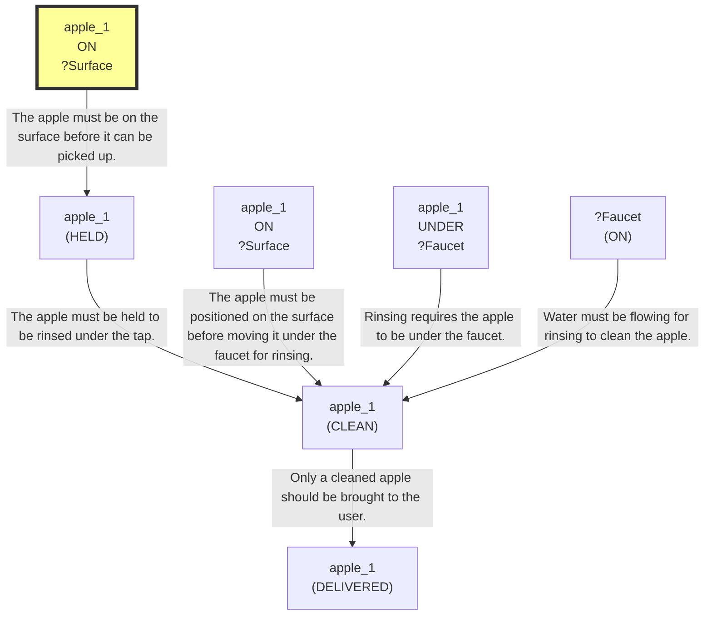
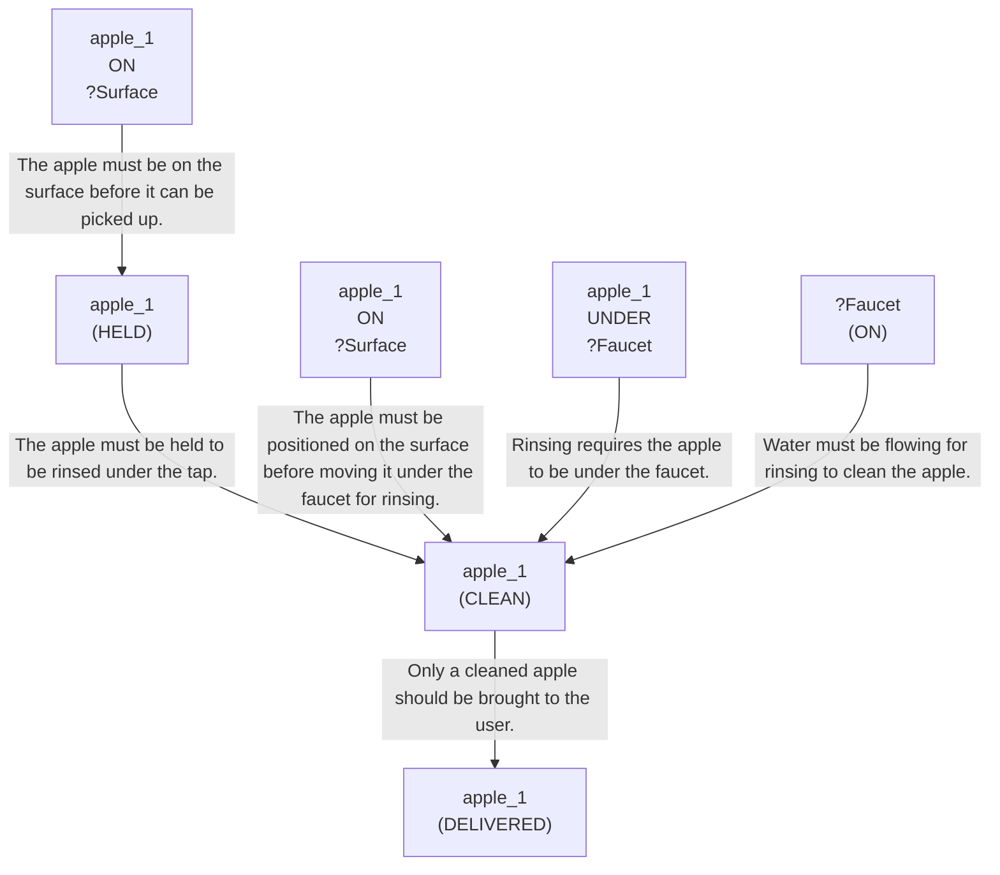
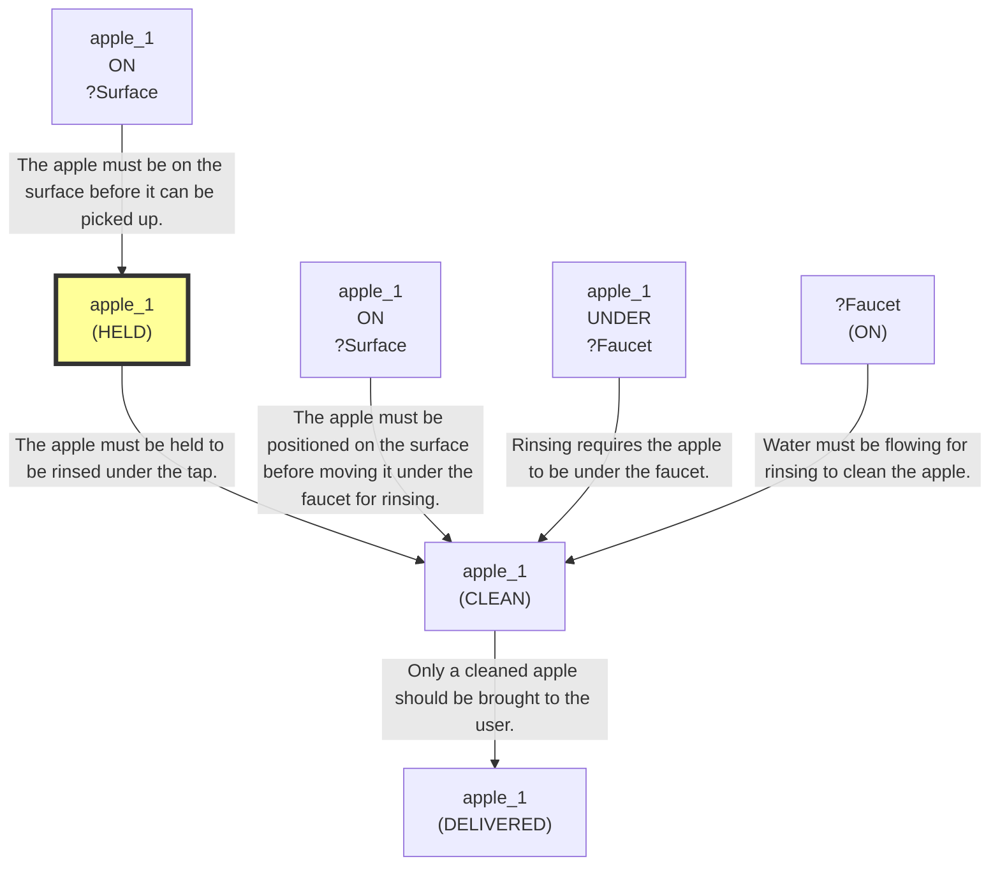

# 🚀 VirtualHome Agent Episode Log


### [GoalReasoner (Module A - Intent)] Output
```json
{
  "is_instruction_obviously_vague": false,
  "clarification_question": null,
  "target_object": "apple",
  "location_hint": "table",
  "reasoning_chain": [
    {
      "question": "Why does the user want this object?",
      "answer": "They want one of the apples from the table brought to them."
    },
    {
      "question": "Why is that important?",
      "answer": "The apple should be rinsed before being delivered, likely to make it ready for handling or eating."
    },
    {
      "question": "What fundamental need does this fulfill?",
      "answer": "It helps provide a clean, ready-to-use fruit for the user."
    },
    {
      "question": "Are there any deeper psychological or physical motivations?",
      "answer": "The user likely wants convenient access to a clean food item and may be addressing hygiene or immediate snacking needs."
    }
  ],
  "deep_intent": "The user wants a clean, ready-to-eat fruit to satisfy a food or snack need.",
  "acceptable_alternatives_properties": [
    {
      "priority": 1,
      "description": "Other rinseable ready-to-eat fruits, such as pears, grapes, or plums"
    },
    {
      "priority": 2,
      "description": "Other whole fruits that can be cleaned and served, such as oranges or peaches"
    },
    {
      "priority": 3,
      "description": "Prepared fruit items or fruit snacks that provide a similar fresh food option"
    },
    {
      "priority": 4,
      "description": "Other light ready-to-eat foods in the kitchen, such as a banana or a packaged snack"
    }
  ]
}
```

### [PerceptionFilter] Output
```json
{
  "reasoning": "The goal is to deliver a clean apple from the table. The SDG requires the apple itself, the table/surface it is on, and a faucet with water running for rinsing. A sink is also needed as the washing location/context. To support the rinsing action, a washingsponge is included as an implicit tool backup for cleaning, and a fridge is kept as a relevant food-storage alternative among kitchen appliances if needed.",
  "selected_classes": [
    "character",
    "washingsponge",
    "apple",
    "fridge",
    "sink",
    "faucet",
    "kitchentable"
  ],
  "raw_class_count": 55
}
```

### [LLMExecutor] Output
```json
{
  "reasoning": "The apple is currently on the kitchentable and is not yet held, so the first prerequisite for the SDG is to get near it before grabbing. No cleanliness or faucet state is yet relevant until the apple is held. The best next step is to walk to the apple on the table.",
  "satisfied_nodes": [],
  "current_node_focus": "N2",
  "mapped_variables": {},
  "action": "[walk] <apple> (437)"
}
```

### [RoboStateMultiTaskController] Output
```json
{
  "action": "[walk] <apple> (437)",
  "active_task_id": "task_1",
  "task_context": {
    "active_task_id": "task_1",
    "pending_task_ids": [],
    "satisfied_task_ids": []
  },
  "source": "llm_executor"
}
```
## Step 0
- **Action**: `[walk] <apple> (437)`
- **Action Success**: `True`
- **Action Message**: {'0': {'message': 'Success'}}
- **Active Task**: `task_1`
- **Decision Source**: `llm_executor`
- **Task Progress**: T3_without_memory_structure_G4_17=pending
- **SDG Status**:

- **Observed Items (11)**: kitchentable(231), sink(247), faucet(248), washingsponge(266), fridge(305), apple(437), character(1), bathroom(11), bedroom(73), kitchen(205), livingroom(335)


### [PerceptionFilter] Output
```json
{
  "reasoning": "Reused cached class selection.",
  "selected_classes": [
    "character",
    "washingsponge",
    "apple",
    "fridge",
    "sink",
    "faucet",
    "kitchentable"
  ],
  "raw_class_count": 55
}
```

### [LLMExecutor] Output
```json
{
  "reasoning": "The apple on the table is the target object and we have already walked to it successfully. The next required step toward the SDG is to pick it up so it can later be rinsed under the faucet. The apple is currently not held, and grabbing it is the only action that advances toward N1 while preserving the required sequence.",
  "satisfied_nodes": [],
  "current_node_focus": "N1",
  "mapped_variables": {},
  "action": "[grab] <apple> (437)"
}
```

### [RoboStateMultiTaskController] Output
```json
{
  "action": "[walk] <bathroom> (11)",
  "active_task_id": null,
  "task_context": {
    "active_task_id": null,
    "pending_task_ids": [
      "task_1"
    ],
    "satisfied_task_ids": []
  },
  "source": "loop_recovery_room_revisit"
}
```
## Step 1
- **Action**: `[walk] <bathroom> (11)`
- **Action Success**: `True`
- **Action Message**: {'0': {'message': 'Success'}}
- **Decision Source**: `loop_recovery_room_revisit`
- **Task Progress**: T3_without_memory_structure_G4_17=pending
- **SDG Status**:
No SDG active.
- **Observed Items (113)**: floor(206), floor(207), floor(208), floor(209), floor(210), floor(211), wall(212), wall(213), wall(214), wall(215), wall(216), wall(217), ceiling(218), ceiling(219), ceiling(220)...


### [RoboStateMultiTaskController] Output
```json
{
  "action": "[walk] <bedroom> (73)",
  "active_task_id": "task_1",
  "task_context": {
    "active_task_id": "task_1",
    "pending_task_ids": [],
    "satisfied_task_ids": []
  },
  "source": "room_frontier"
}
```
## Step 2
- **Action**: `[walk] <bedroom> (73)`
- **Action Success**: `True`
- **Action Message**: {'0': {'message': 'Success'}}
- **Active Task**: `task_1`
- **Decision Source**: `room_frontier`
- **Task Progress**: T3_without_memory_structure_G4_17=pending
- **SDG Status**:

- **Observed Items (66)**: floor(12), floor(13), floor(14), floor(15), floor(16), floor(17), wall(18), wall(19), wall(20), wall(21), wall(22), wall(23), ceiling(24), ceiling(25), ceiling(26)...


### [RoboStateMultiTaskController] Output
```json
{
  "action": "[walk] <livingroom> (335)",
  "active_task_id": "task_1",
  "task_context": {
    "active_task_id": "task_1",
    "pending_task_ids": [],
    "satisfied_task_ids": []
  },
  "source": "room_frontier"
}
```
## Step 3
- **Action**: `[walk] <livingroom> (335)`
- **Action Success**: `True`
- **Action Message**: {'0': {'message': 'Success'}}
- **Active Task**: `task_1`
- **Decision Source**: `room_frontier`
- **Task Progress**: T3_without_memory_structure_G4_17=pending
- **SDG Status**:

- **Observed Items (74)**: floor(74), floor(75), floor(76), floor(77), floor(78), floor(79), floor(80), floor(81), floor(82), wall(83), wall(84), wall(85), wall(86), wall(87), wall(88)...


### [PerceptionFilter] Output
```json
{
  "reasoning": "The goal is to retrieve and deliver a clean apple. The SDG shows the apple must be on a surface, held, rinsed under a faucet with water on, then delivered. From the visible objects, the necessary item is the apple, and the required location surface can be satisfied by the coffeetable. A faucet/sink is implied by the rinsing step, but none is visible, so no matching physical tool can be selected from the list.",
  "selected_classes": [
    "character",
    "apple",
    "plum",
    "coffeetable",
    "peach"
  ],
  "raw_class_count": 40
}
```

### [LLMExecutor] Output
```json
{
  "reasoning": "The original apple_1 is no longer present in the filtered graph, but a new apple (438) is available and matches the target fruit class. Since the task requires a clean apple from the table, the first needed step is to get to the apple before grabbing it. I should walk to apple_438 now, then I can grab it next and continue toward rinsing and delivery.",
  "satisfied_nodes": [],
  "current_node_focus": "N2",
  "mapped_variables": {},
  "action": "[walk] <apple> (438)"
}
```

### [RoboStateMultiTaskController] Output
```json
{
  "action": "[walk] <apple> (438)",
  "active_task_id": "task_1",
  "task_context": {
    "active_task_id": "task_1",
    "pending_task_ids": [],
    "satisfied_task_ids": []
  },
  "source": "llm_executor"
}
```
## Step 4
- **Action**: `[walk] <apple> (438)`
- **Action Success**: `True`
- **Action Message**: {'0': {'message': 'Success'}}
- **Active Task**: `task_1`
- **Decision Source**: `llm_executor`
- **Task Progress**: T3_without_memory_structure_G4_17=pending
- **SDG Status**:

- **Observed Items (11)**: coffeetable(371), apple(438), peach(441), peach(442), plum(443), plum(444), character(1), bathroom(11), bedroom(73), kitchen(205), livingroom(335)


### [PerceptionFilter] Output
```json
{
  "reasoning": "Reused cached class selection.",
  "selected_classes": [
    "character",
    "apple",
    "plum",
    "coffeetable",
    "peach"
  ],
  "raw_class_count": 40
}
```

### [LLMExecutor] Output
```json
{
  "reasoning": "The active task is to deliver a clean apple. The current graph shows apple(438) present and not yet held or cleaned. Because the last action was already walking to apple(438), the next required step is to grab it before any rinsing can occur. I will focus on satisfying N1 (apple held).",
  "satisfied_nodes": [],
  "current_node_focus": "N1",
  "mapped_variables": {},
  "action": "[grab] <apple> (438)"
}
```

### [RoboStateMultiTaskController] Output
```json
{
  "action": "[walk] <kitchen> (205)",
  "active_task_id": null,
  "task_context": {
    "active_task_id": null,
    "pending_task_ids": [
      "task_1"
    ],
    "satisfied_task_ids": []
  },
  "source": "loop_recovery_room_revisit"
}
```
## Step 5
- **Action**: `[walk] <kitchen> (205)`
- **Action Success**: `True`
- **Action Message**: {'0': {'message': 'Success'}}
- **Decision Source**: `loop_recovery_room_revisit`
- **Task Progress**: T3_without_memory_structure_G4_17=pending
- **SDG Status**:
No SDG active.
- **Observed Items (78)**: floor(336), floor(337), floor(338), floor(339), floor(340), floor(341), floor(342), floor(343), floor(344), wall(345), wall(346), wall(347), wall(348), wall(349), wall(350)...


### [PerceptionFilter] Output
```json
{
  "reasoning": "Reused cached class selection.",
  "selected_classes": [
    "character",
    "washingsponge",
    "apple",
    "fridge",
    "sink",
    "faucet",
    "kitchentable"
  ],
  "raw_class_count": 55
}
```

### [LLMExecutor] Output
```json
{
  "reasoning": "The goal requires apple_1 to be held before it can be cleaned and later delivered. The current graph shows apple(437) in the kitchen with no holding state, and we are already in the kitchen from the previous step. Therefore the next required action is to grab the apple. I bind the target apple_1 to apple(437).",
  "satisfied_nodes": [],
  "current_node_focus": "N1",
  "mapped_variables": {},
  "action": "[grab] <apple> (437)"
}
```

### [RoboStateMultiTaskController] Output
```json
{
  "action": "[walk] <bathroom> (11)",
  "active_task_id": null,
  "task_context": {
    "active_task_id": null,
    "pending_task_ids": [
      "task_1"
    ],
    "satisfied_task_ids": []
  },
  "source": "loop_recovery_room_revisit"
}
```
## Step 6
- **Action**: `[walk] <bathroom> (11)`
- **Action Success**: `True`
- **Action Message**: {'0': {'message': 'Success'}}
- **Decision Source**: `loop_recovery_room_revisit`
- **Task Progress**: T3_without_memory_structure_G4_17=pending
- **SDG Status**:
No SDG active.
- **Observed Items (113)**: floor(206), floor(207), floor(208), floor(209), floor(210), floor(211), wall(212), wall(213), wall(214), wall(215), wall(216), wall(217), ceiling(218), ceiling(219), ceiling(220)...


### [RoboStateMultiTaskController] Output
```json
{
  "action": "[walk] <bedroom> (73)",
  "active_task_id": null,
  "task_context": {
    "active_task_id": null,
    "pending_task_ids": [
      "task_1"
    ],
    "satisfied_task_ids": []
  },
  "source": "loop_recovery_room_revisit"
}
```
## Step 7
- **Action**: `[walk] <bedroom> (73)`
- **Action Success**: `True`
- **Action Message**: {'0': {'message': 'Success'}}
- **Decision Source**: `loop_recovery_room_revisit`
- **Task Progress**: T3_without_memory_structure_G4_17=pending
- **SDG Status**:
No SDG active.
- **Observed Items (66)**: floor(12), floor(13), floor(14), floor(15), floor(16), floor(17), wall(18), wall(19), wall(20), wall(21), wall(22), wall(23), ceiling(24), ceiling(25), ceiling(26)...


### [RoboStateMultiTaskController] Output
```json
{
  "action": "[walk] <livingroom> (335)",
  "active_task_id": null,
  "task_context": {
    "active_task_id": null,
    "pending_task_ids": [
      "task_1"
    ],
    "satisfied_task_ids": []
  },
  "source": "loop_recovery_room_revisit"
}
```
## Step 8
- **Action**: `[walk] <livingroom> (335)`
- **Action Success**: `True`
- **Action Message**: {'0': {'message': 'Success'}}
- **Decision Source**: `loop_recovery_room_revisit`
- **Task Progress**: T3_without_memory_structure_G4_17=pending
- **SDG Status**:
No SDG active.
- **Observed Items (74)**: floor(74), floor(75), floor(76), floor(77), floor(78), floor(79), floor(80), floor(81), floor(82), wall(83), wall(84), wall(85), wall(86), wall(87), wall(88)...


### [PerceptionFilter] Output
```json
{
  "reasoning": "Reused cached class selection.",
  "selected_classes": [
    "character",
    "apple",
    "plum",
    "coffeetable",
    "peach"
  ],
  "raw_class_count": 40
}
```

### [LLMExecutor] Output
```json
{
  "reasoning": "The active task is to deliver a cleaned apple. The current graph contains apple(438), but it has no HELD state yet, and the SDG requires the apple to be held before it can be rinsed. Since the last action was a walk to the kitchen area and we should not repeat that walk, the next necessary step is to grab the nearby apple(438) before moving to a faucet/sink in a later step.",
  "satisfied_nodes": [],
  "current_node_focus": "N1",
  "mapped_variables": {},
  "action": "[grab] <apple> (438)"
}
```

### [RoboStateMultiTaskController] Output
```json
{
  "action": "[walk] <kitchen> (205)",
  "active_task_id": null,
  "task_context": {
    "active_task_id": null,
    "pending_task_ids": [
      "task_1"
    ],
    "satisfied_task_ids": []
  },
  "source": "loop_recovery_room_revisit"
}
```
## Step 9
- **Action**: `[walk] <kitchen> (205)`
- **Action Success**: `True`
- **Action Message**: {'0': {'message': 'Success'}}
- **Decision Source**: `loop_recovery_room_revisit`
- **Task Progress**: T3_without_memory_structure_G4_17=pending
- **SDG Status**:
No SDG active.
- **Observed Items (78)**: floor(336), floor(337), floor(338), floor(339), floor(340), floor(341), floor(342), floor(343), floor(344), wall(345), wall(346), wall(347), wall(348), wall(349), wall(350)...


### [PerceptionFilter] Output
```json
{
  "reasoning": "Reused cached class selection.",
  "selected_classes": [
    "character",
    "washingsponge",
    "apple",
    "fridge",
    "sink",
    "faucet",
    "kitchentable"
  ],
  "raw_class_count": 55
}
```

### [LLMExecutor] Output
```json
{
  "reasoning": "The apple target in the kitchen is currently not held, and the SDG requires it to be held before it can be rinsed. The previous steps show repeated location changes but no successful grab yet. The closest actionable progress is to move to the apple's location in the kitchen and then grab it. Since the instruction says not to repeat a walk if just did it, and the last action was a walk to kitchen, the next atomic step should be grabbing the apple if already near it in the current location graph. However, grab requires proximity verification, and the apple is present in the current filtered graph in the kitchen context, so I will attempt to pick it up now to satisfy N1.",
  "satisfied_nodes": [],
  "current_node_focus": "N1",
  "mapped_variables": {
    "?Surface": "kitchentable(231)",
    "?Faucet": "faucet(248)"
  },
  "action": "[grab] <apple> (437)"
}
```

### [RoboStateMultiTaskController] Output
```json
{
  "action": "[walk] <bathroom> (11)",
  "active_task_id": null,
  "task_context": {
    "active_task_id": null,
    "pending_task_ids": [
      "task_1"
    ],
    "satisfied_task_ids": []
  },
  "source": "loop_recovery_room_revisit"
}
```
## Step 10
- **Action**: `[walk] <bathroom> (11)`
- **Action Success**: `True`
- **Action Message**: {'0': {'message': 'Success'}}
- **Decision Source**: `loop_recovery_room_revisit`
- **Task Progress**: T3_without_memory_structure_G4_17=pending
- **SDG Status**:
No SDG active.
- **Observed Items (113)**: floor(206), floor(207), floor(208), floor(209), floor(210), floor(211), wall(212), wall(213), wall(214), wall(215), wall(216), wall(217), ceiling(218), ceiling(219), ceiling(220)...


### [RoboStateMultiTaskController] Output
```json
{
  "action": "[walk] <bedroom> (73)",
  "active_task_id": null,
  "task_context": {
    "active_task_id": null,
    "pending_task_ids": [
      "task_1"
    ],
    "satisfied_task_ids": []
  },
  "source": "loop_recovery_room_revisit"
}
```
## Step 11
- **Action**: `[walk] <bedroom> (73)`
- **Action Success**: `True`
- **Action Message**: {'0': {'message': 'Success'}}
- **Decision Source**: `loop_recovery_room_revisit`
- **Task Progress**: T3_without_memory_structure_G4_17=pending
- **SDG Status**:
No SDG active.
- **Observed Items (66)**: floor(12), floor(13), floor(14), floor(15), floor(16), floor(17), wall(18), wall(19), wall(20), wall(21), wall(22), wall(23), ceiling(24), ceiling(25), ceiling(26)...


### [RoboStateMultiTaskController] Output
```json
{
  "action": "[walk] <livingroom> (335)",
  "active_task_id": null,
  "task_context": {
    "active_task_id": null,
    "pending_task_ids": [
      "task_1"
    ],
    "satisfied_task_ids": []
  },
  "source": "loop_recovery_room_revisit"
}
```
## Step 12
- **Action**: `[walk] <livingroom> (335)`
- **Action Success**: `True`
- **Action Message**: {'0': {'message': 'Success'}}
- **Decision Source**: `loop_recovery_room_revisit`
- **Task Progress**: T3_without_memory_structure_G4_17=pending
- **SDG Status**:
No SDG active.
- **Observed Items (74)**: floor(74), floor(75), floor(76), floor(77), floor(78), floor(79), floor(80), floor(81), floor(82), wall(83), wall(84), wall(85), wall(86), wall(87), wall(88)...


### [PerceptionFilter] Output
```json
{
  "reasoning": "Reused cached class selection.",
  "selected_classes": [
    "character",
    "apple",
    "plum",
    "coffeetable",
    "peach"
  ],
  "raw_class_count": 40
}
```

### [LLMExecutor] Output
```json
{
  "reasoning": "The target apple is visible in the current environment as apple(438), and the SDG requires it to be held before it can be cleaned and delivered. We are not currently holding it, and the last action was a walk, so the next valid atomic step is to move to the apple before grabbing it.",
  "satisfied_nodes": [],
  "current_node_focus": "N1",
  "mapped_variables": {},
  "action": "[walk] <apple> (438)"
}
```

### [RoboStateMultiTaskController] Output
```json
{
  "action": "[walk] <apple> (438)",
  "active_task_id": "task_1",
  "task_context": {
    "active_task_id": "task_1",
    "pending_task_ids": [],
    "satisfied_task_ids": []
  },
  "source": "llm_executor"
}
```
## Step 13
- **Action**: `[walk] <apple> (438)`
- **Action Success**: `True`
- **Action Message**: {'0': {'message': 'Success'}}
- **Active Task**: `task_1`
- **Decision Source**: `llm_executor`
- **Task Progress**: T3_without_memory_structure_G4_17=pending
- **SDG Status**:

- **Observed Items (11)**: coffeetable(371), apple(438), peach(441), peach(442), plum(443), plum(444), character(1), bathroom(11), bedroom(73), kitchen(205), livingroom(335)


### [PerceptionFilter] Output
```json
{
  "reasoning": "Reused cached class selection.",
  "selected_classes": [
    "character",
    "apple",
    "plum",
    "coffeetable",
    "peach"
  ],
  "raw_class_count": 40
}
```

### [LLMExecutor] Output
```json
{
  "reasoning": "The apple needed for the active task is the visible apple(438). The SDG requires it to be HELD before any rinsing or delivery can proceed. Since the last action was already a successful walk to apple(438), the next atomic step is to grab it. No other nodes are yet satisfied because the apple is not held, not clean, and not delivered.",
  "satisfied_nodes": [],
  "current_node_focus": "N1",
  "mapped_variables": {},
  "action": "[grab] <apple> (438)"
}
```

### [RoboStateMultiTaskController] Output
```json
{
  "action": "[walk] <kitchen> (205)",
  "active_task_id": null,
  "task_context": {
    "active_task_id": null,
    "pending_task_ids": [
      "task_1"
    ],
    "satisfied_task_ids": []
  },
  "source": "loop_recovery_room_revisit"
}
```
## Step 14
- **Action**: `[walk] <kitchen> (205)`
- **Action Success**: `True`
- **Action Message**: {'0': {'message': 'Success'}}
- **Decision Source**: `loop_recovery_room_revisit`
- **Task Progress**: T3_without_memory_structure_G4_17=pending
- **SDG Status**:
No SDG active.
- **Observed Items (78)**: floor(336), floor(337), floor(338), floor(339), floor(340), floor(341), floor(342), floor(343), floor(344), wall(345), wall(346), wall(347), wall(348), wall(349), wall(350)...

