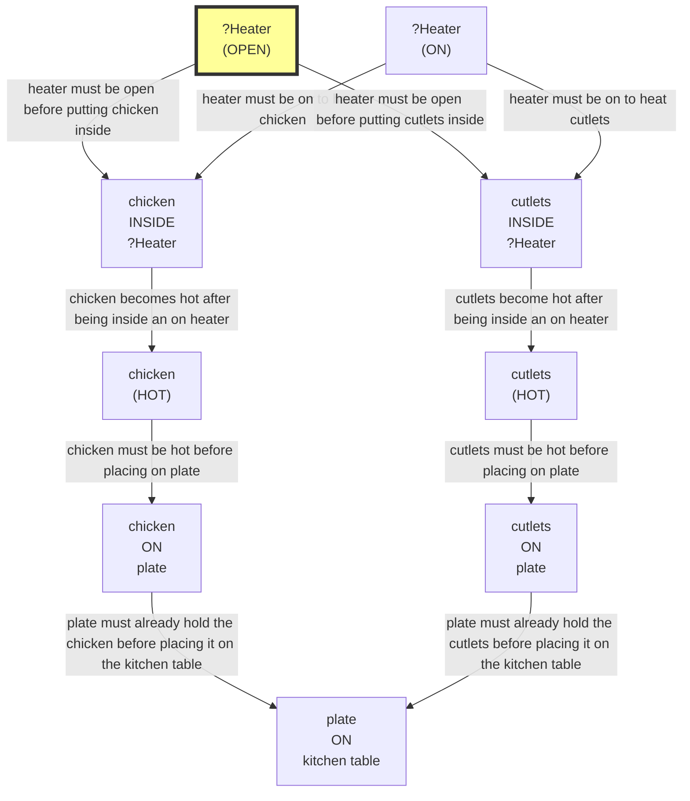
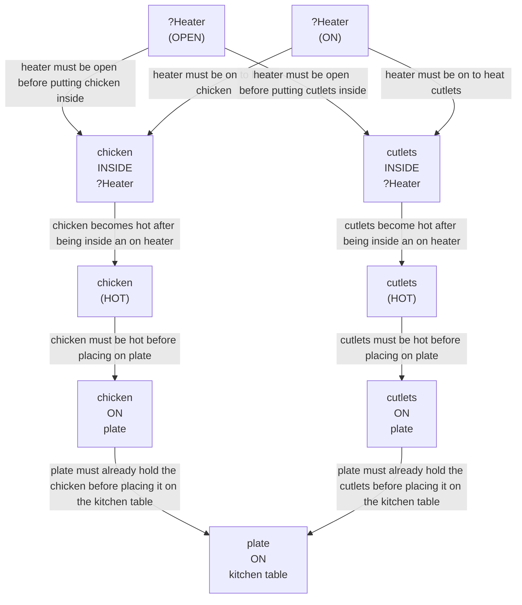
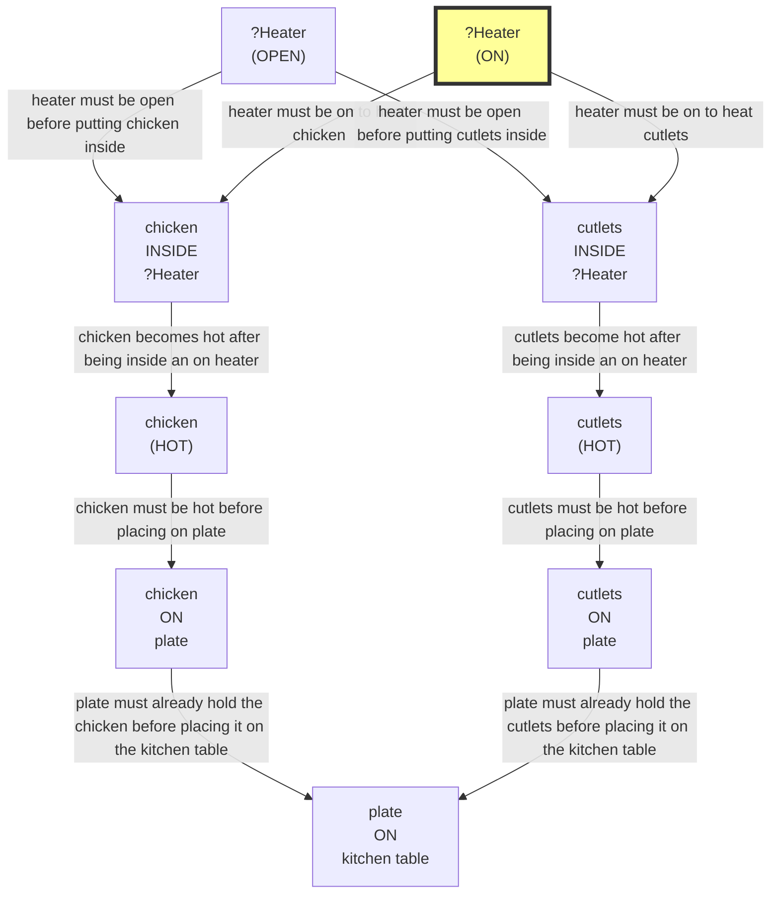

# 🚀 VirtualHome Agent Episode Log


### [GoalReasoner (Module A - Intent)] Output
```json
{
  "is_instruction_obviously_vague": false,
  "clarification_question": null,
  "target_object": "chicken and cutlets",
  "location_hint": "fridge, microwave, kitchen table",
  "reasoning_chain": [
    {
      "question": "Why does the user want this object?",
      "answer": "To have the food heated and ready to eat."
    },
    {
      "question": "Why is that important?",
      "answer": "Warm prepared food is more immediately usable and pleasant to consume."
    },
    {
      "question": "What fundamental need does this fulfill?",
      "answer": "It fulfills the need to eat and relieve hunger."
    },
    {
      "question": "Are there any deeper psychological or physical motivations?",
      "answer": "It may also be about convenience, reducing effort, and making the food accessible in a comfortable serving setup."
    }
  ],
  "deep_intent": "The user wants to relieve hunger by preparing food for immediate eating.",
  "acceptable_alternatives_properties": [
    {
      "priority": 1,
      "description": "Other ready-to-eat heated foods that can be microwaved and served on a plate, such as leftover meat, cooked vegetables, or a prepared meal."
    },
    {
      "priority": 2,
      "description": "Other cooked protein or meal items stored in the refrigerator that can be safely reheated."
    },
    {
      "priority": 3,
      "description": "Any similar refrigerated prepared food that provides a filling meal, such as pasta, rice dishes, or casserole."
    },
    {
      "priority": 4,
      "description": "Other household foods that can satisfy hunger, even if they are not the same type of food, such as bread, fruit, or packaged snacks."
    }
  ]
}
```

### [PerceptionFilter] Output
```json
{
  "reasoning": "The goal requires heating chicken and cutlets in a heater, then placing them on a plate on the kitchen table. The SDG indicates the heater must be on and open; from the visible objects, microwave is the matching heater appliance. We must keep the target foods, the serving plate, the table location, and the alternative heater appliance needed for the heating step.",
  "selected_classes": [
    "plate",
    "chicken",
    "character",
    "cutlets",
    "microwave",
    "fridge",
    "kitchentable"
  ],
  "raw_class_count": 45
}
```

### [LLMExecutor] Output
```json
{
  "reasoning": "The first unmet prerequisite in the SDG is to make the heater available and accessible. The likely heater is the microwave(234), which can be opened and turned on. No prior actions have been taken, and the microwave is present in the kitchen with chicken and cutlets available. I should first move next to the microwave before opening it, since proximity is required for open/switchon actions.",
  "satisfied_nodes": [],
  "current_node_focus": "N2",
  "mapped_variables": {
    "?Heater": "microwave(234)"
  },
  "action": "[walk] <microwave> (234)"
}
```

### [RoboStateMultiTaskController] Output
```json
{
  "action": "[walk] <microwave> (234)",
  "active_task_id": "task_1",
  "task_context": {
    "active_task_id": "task_1",
    "pending_task_ids": [],
    "satisfied_task_ids": []
  },
  "source": "llm_executor"
}
```
## Step 0
- **Action**: `[walk] <microwave> (234)`
- **Action Success**: `True`
- **Action Message**: {'0': {'message': 'Success'}}
- **Active Task**: `task_1`
- **Decision Source**: `llm_executor`
- **Task Progress**: T3_without_memory_structure_P1_03=pending
- **SDG Status**:

- **Observed Items (17)**: plate(170), plate(171), plate(172), plate(173), plate(177), plate(178), plate(184), kitchentable(199), fridge(225), microwave(234), character(1), chicken(241), cutlets(242), bathroom(11), bedroom(50)...


### [PerceptionFilter] Output
```json
{
  "reasoning": "Reused cached class selection.",
  "selected_classes": [
    "plate",
    "chicken",
    "character",
    "cutlets",
    "microwave",
    "fridge",
    "kitchentable"
  ],
  "raw_class_count": 45
}
```

### [LLMExecutor] Output
```json
{
  "reasoning": "The microwave is the best binding for ?Heater because it is present and matches the heating appliance requirement. The next unmet prerequisite for both chicken and cutlets is to open the heater before inserting food. Since I am already at the microwave from the previous successful walk, the single next atomic action should be to open it.",
  "satisfied_nodes": [],
  "current_node_focus": "N2",
  "mapped_variables": {
    "?Heater": "microwave(234)"
  },
  "action": "[open] <microwave> (234)"
}
```

### [RoboStateMultiTaskController] Output
```json
{
  "action": "[walk] <bathroom> (11)",
  "active_task_id": null,
  "task_context": {
    "active_task_id": null,
    "pending_task_ids": [
      "task_1"
    ],
    "satisfied_task_ids": []
  },
  "source": "loop_recovery_room_revisit"
}
```
## Step 1
- **Action**: `[walk] <bathroom> (11)`
- **Action Success**: `True`
- **Action Message**: {'0': {'message': 'Success'}}
- **Decision Source**: `loop_recovery_room_revisit`
- **Task Progress**: T3_without_memory_structure_P1_03=pending
- **SDG Status**:
No SDG active.
- **Observed Items (124)**: floor(127), floor(128), floor(129), floor(130), floor(131), floor(132), floor(133), floor(134), floor(135), ceiling(136), ceiling(137), ceiling(138), ceiling(139), ceiling(140), ceiling(141)...


### [RoboStateMultiTaskController] Output
```json
{
  "action": "[walk] <bedroom> (50)",
  "active_task_id": "task_1",
  "task_context": {
    "active_task_id": "task_1",
    "pending_task_ids": [],
    "satisfied_task_ids": []
  },
  "source": "room_frontier"
}
```
## Step 2
- **Action**: `[walk] <bedroom> (50)`
- **Action Success**: `True`
- **Action Message**: {'0': {'message': 'Success'}}
- **Active Task**: `task_1`
- **Decision Source**: `room_frontier`
- **Task Progress**: T3_without_memory_structure_P1_03=pending
- **SDG Status**:

- **Observed Items (43)**: wall(12), wall(13), wall(14), wall(15), ceiling(16), ceiling(17), ceiling(18), ceiling(19), floor(20), floor(21), floor(22), floor(23), toilet(24), stall(25), bathroomcabinet(26)...


### [RoboStateMultiTaskController] Output
```json
{
  "action": "[walk] <livingroom> (261)",
  "active_task_id": "task_1",
  "task_context": {
    "active_task_id": "task_1",
    "pending_task_ids": [],
    "satisfied_task_ids": []
  },
  "source": "room_frontier"
}
```
## Step 3
- **Action**: `[walk] <livingroom> (261)`
- **Action Success**: `True`
- **Action Message**: {'0': {'message': 'Success'}}
- **Active Task**: `task_1`
- **Decision Source**: `room_frontier`
- **Task Progress**: T3_without_memory_structure_P1_03=pending
- **SDG Status**:

- **Observed Items (75)**: floor(51), floor(52), floor(53), floor(54), floor(55), floor(56), floor(57), floor(58), floor(59), wall(60), wall(61), wall(62), wall(63), wall(64), wall(65)...


### [RoboStateMultiTaskController] Output
```json
{
  "action": "[walk] <kitchen> (126)",
  "active_task_id": null,
  "task_context": {
    "active_task_id": null,
    "pending_task_ids": [
      "task_1"
    ],
    "satisfied_task_ids": []
  },
  "source": "loop_recovery_room_revisit"
}
```
## Step 4
- **Action**: `[walk] <kitchen> (126)`
- **Action Success**: `True`
- **Action Message**: {'0': {'message': 'Success'}}
- **Decision Source**: `loop_recovery_room_revisit`
- **Task Progress**: T3_without_memory_structure_P1_03=pending
- **SDG Status**:
No SDG active.
- **Observed Items (64)**: wall(262), wall(263), wall(264), wall(265), wall(266), wall(267), wall(268), wall(269), ceiling(270), ceiling(271), ceiling(272), ceiling(273), ceiling(274), ceiling(275), ceiling(276)...


### [PerceptionFilter] Output
```json
{
  "reasoning": "Reused cached class selection.",
  "selected_classes": [
    "plate",
    "chicken",
    "character",
    "cutlets",
    "microwave",
    "fridge",
    "kitchentable"
  ],
  "raw_class_count": 45
}
```

### [LLMExecutor] Output
```json
{
  "reasoning": "The goal requires heating chicken and cutlets in a microwave and then placing them on a plate on the kitchen table. We are already in the kitchen and the microwave is visible. The microwave is the logical ?Heater, and the next prerequisite is to open it before placing food inside. Since the SDG requires N2 (Heater OPEN) before N3/N6, I should open the microwave now.",
  "satisfied_nodes": [],
  "current_node_focus": "N2",
  "mapped_variables": {
    "?Heater": "microwave(234)"
  },
  "action": "[open] <microwave> (234)"
}
```

### [RoboStateMultiTaskController] Output
```json
{
  "action": "[walk] <bathroom> (11)",
  "active_task_id": null,
  "task_context": {
    "active_task_id": null,
    "pending_task_ids": [
      "task_1"
    ],
    "satisfied_task_ids": []
  },
  "source": "loop_recovery_room_revisit"
}
```
## Step 5
- **Action**: `[walk] <bathroom> (11)`
- **Action Success**: `True`
- **Action Message**: {'0': {'message': 'Success'}}
- **Decision Source**: `loop_recovery_room_revisit`
- **Task Progress**: T3_without_memory_structure_P1_03=pending
- **SDG Status**:
No SDG active.
- **Observed Items (124)**: floor(127), floor(128), floor(129), floor(130), floor(131), floor(132), floor(133), floor(134), floor(135), ceiling(136), ceiling(137), ceiling(138), ceiling(139), ceiling(140), ceiling(141)...


### [RoboStateMultiTaskController] Output
```json
{
  "action": "[walk] <bedroom> (50)",
  "active_task_id": null,
  "task_context": {
    "active_task_id": null,
    "pending_task_ids": [
      "task_1"
    ],
    "satisfied_task_ids": []
  },
  "source": "loop_recovery_room_revisit"
}
```
## Step 6
- **Action**: `[walk] <bedroom> (50)`
- **Action Success**: `True`
- **Action Message**: {'0': {'message': 'Success'}}
- **Decision Source**: `loop_recovery_room_revisit`
- **Task Progress**: T3_without_memory_structure_P1_03=pending
- **SDG Status**:
No SDG active.
- **Observed Items (43)**: wall(12), wall(13), wall(14), wall(15), ceiling(16), ceiling(17), ceiling(18), ceiling(19), floor(20), floor(21), floor(22), floor(23), toilet(24), stall(25), bathroomcabinet(26)...


### [RoboStateMultiTaskController] Output
```json
{
  "action": "[walk] <livingroom> (261)",
  "active_task_id": null,
  "task_context": {
    "active_task_id": null,
    "pending_task_ids": [
      "task_1"
    ],
    "satisfied_task_ids": []
  },
  "source": "loop_recovery_room_revisit"
}
```
## Step 7
- **Action**: `[walk] <livingroom> (261)`
- **Action Success**: `True`
- **Action Message**: {'0': {'message': 'Success'}}
- **Decision Source**: `loop_recovery_room_revisit`
- **Task Progress**: T3_without_memory_structure_P1_03=pending
- **SDG Status**:
No SDG active.
- **Observed Items (75)**: floor(51), floor(52), floor(53), floor(54), floor(55), floor(56), floor(57), floor(58), floor(59), wall(60), wall(61), wall(62), wall(63), wall(64), wall(65)...


### [RoboStateMultiTaskController] Output
```json
{
  "action": "[walk] <kitchen> (126)",
  "active_task_id": null,
  "task_context": {
    "active_task_id": null,
    "pending_task_ids": [
      "task_1"
    ],
    "satisfied_task_ids": []
  },
  "source": "loop_recovery_room_revisit"
}
```
## Step 8
- **Action**: `[walk] <kitchen> (126)`
- **Action Success**: `True`
- **Action Message**: {'0': {'message': 'Success'}}
- **Decision Source**: `loop_recovery_room_revisit`
- **Task Progress**: T3_without_memory_structure_P1_03=pending
- **SDG Status**:
No SDG active.
- **Observed Items (64)**: wall(262), wall(263), wall(264), wall(265), wall(266), wall(267), wall(268), wall(269), ceiling(270), ceiling(271), ceiling(272), ceiling(273), ceiling(274), ceiling(275), ceiling(276)...


### [PerceptionFilter] Output
```json
{
  "reasoning": "Reused cached class selection.",
  "selected_classes": [
    "plate",
    "chicken",
    "character",
    "cutlets",
    "microwave",
    "fridge",
    "kitchentable"
  ],
  "raw_class_count": 45
}
```

### [LLMExecutor] Output
```json
{
  "reasoning": "The next unmet prerequisite is to bind ?Heater to the microwave and make sure it is open before placing chicken and cutlets inside. The filtered graph shows microwave(234) is the only suitable heater candidate, and we are already in the kitchen area, so the most direct next step is to open it. This progresses toward N2, which is required before N3 and N6.",
  "satisfied_nodes": [],
  "current_node_focus": "N2",
  "mapped_variables": {
    "?Heater": "microwave(234)"
  },
  "action": "[open] <microwave> (234)"
}
```

### [RoboStateMultiTaskController] Output
```json
{
  "action": "[walk] <bathroom> (11)",
  "active_task_id": null,
  "task_context": {
    "active_task_id": null,
    "pending_task_ids": [
      "task_1"
    ],
    "satisfied_task_ids": []
  },
  "source": "loop_recovery_room_revisit"
}
```
## Step 9
- **Action**: `[walk] <bathroom> (11)`
- **Action Success**: `True`
- **Action Message**: {'0': {'message': 'Success'}}
- **Decision Source**: `loop_recovery_room_revisit`
- **Task Progress**: T3_without_memory_structure_P1_03=pending
- **SDG Status**:
No SDG active.
- **Observed Items (124)**: floor(127), floor(128), floor(129), floor(130), floor(131), floor(132), floor(133), floor(134), floor(135), ceiling(136), ceiling(137), ceiling(138), ceiling(139), ceiling(140), ceiling(141)...


### [RoboStateMultiTaskController] Output
```json
{
  "action": "[walk] <bedroom> (50)",
  "active_task_id": null,
  "task_context": {
    "active_task_id": null,
    "pending_task_ids": [
      "task_1"
    ],
    "satisfied_task_ids": []
  },
  "source": "loop_recovery_room_revisit"
}
```
## Step 10
- **Action**: `[walk] <bedroom> (50)`
- **Action Success**: `True`
- **Action Message**: {'0': {'message': 'Success'}}
- **Decision Source**: `loop_recovery_room_revisit`
- **Task Progress**: T3_without_memory_structure_P1_03=pending
- **SDG Status**:
No SDG active.
- **Observed Items (43)**: wall(12), wall(13), wall(14), wall(15), ceiling(16), ceiling(17), ceiling(18), ceiling(19), floor(20), floor(21), floor(22), floor(23), toilet(24), stall(25), bathroomcabinet(26)...


### [RoboStateMultiTaskController] Output
```json
{
  "action": "[walk] <livingroom> (261)",
  "active_task_id": null,
  "task_context": {
    "active_task_id": null,
    "pending_task_ids": [
      "task_1"
    ],
    "satisfied_task_ids": []
  },
  "source": "loop_recovery_room_revisit"
}
```
## Step 11
- **Action**: `[walk] <livingroom> (261)`
- **Action Success**: `True`
- **Action Message**: {'0': {'message': 'Success'}}
- **Decision Source**: `loop_recovery_room_revisit`
- **Task Progress**: T3_without_memory_structure_P1_03=pending
- **SDG Status**:
No SDG active.
- **Observed Items (75)**: floor(51), floor(52), floor(53), floor(54), floor(55), floor(56), floor(57), floor(58), floor(59), wall(60), wall(61), wall(62), wall(63), wall(64), wall(65)...


### [RoboStateMultiTaskController] Output
```json
{
  "action": "[walk] <kitchen> (126)",
  "active_task_id": null,
  "task_context": {
    "active_task_id": null,
    "pending_task_ids": [
      "task_1"
    ],
    "satisfied_task_ids": []
  },
  "source": "loop_recovery_room_revisit"
}
```
## Step 12
- **Action**: `[walk] <kitchen> (126)`
- **Action Success**: `True`
- **Action Message**: {'0': {'message': 'Success'}}
- **Decision Source**: `loop_recovery_room_revisit`
- **Task Progress**: T3_without_memory_structure_P1_03=pending
- **SDG Status**:
No SDG active.
- **Observed Items (64)**: wall(262), wall(263), wall(264), wall(265), wall(266), wall(267), wall(268), wall(269), ceiling(270), ceiling(271), ceiling(272), ceiling(273), ceiling(274), ceiling(275), ceiling(276)...


### [PerceptionFilter] Output
```json
{
  "reasoning": "Reused cached class selection.",
  "selected_classes": [
    "plate",
    "chicken",
    "character",
    "cutlets",
    "microwave",
    "fridge",
    "kitchentable"
  ],
  "raw_class_count": 45
}
```

### [LLMExecutor] Output
```json
{
  "reasoning": "The heater variable in the SDG most plausibly maps to the microwave(234), since it is the only heating appliance in the current graph and the task is to reheat chicken and cutlets. The microwave is not yet shown as ON or OPEN, and no objects have been moved yet. To begin satisfying N1 (heater ON), the next required step is to walk to the microwave so it can be operated in the following action.",
  "satisfied_nodes": [],
  "current_node_focus": "N1",
  "mapped_variables": {
    "?Heater": "microwave(234)"
  },
  "action": "[walk] <microwave> (234)"
}
```

### [RoboStateMultiTaskController] Output
```json
{
  "action": "[walk] <microwave> (234)",
  "active_task_id": "task_1",
  "task_context": {
    "active_task_id": "task_1",
    "pending_task_ids": [],
    "satisfied_task_ids": []
  },
  "source": "llm_executor"
}
```
## Step 13
- **Action**: `[walk] <microwave> (234)`
- **Action Success**: `True`
- **Action Message**: {'0': {'message': 'Success'}}
- **Active Task**: `task_1`
- **Decision Source**: `llm_executor`
- **Task Progress**: T3_without_memory_structure_P1_03=pending
- **SDG Status**:

- **Observed Items (17)**: plate(170), plate(171), plate(172), plate(173), plate(177), plate(178), plate(184), kitchentable(199), fridge(225), microwave(234), character(1), chicken(241), cutlets(242), bathroom(11), bedroom(50)...


### [PerceptionFilter] Output
```json
{
  "reasoning": "Reused cached class selection.",
  "selected_classes": [
    "plate",
    "chicken",
    "character",
    "cutlets",
    "microwave",
    "fridge",
    "kitchentable"
  ],
  "raw_class_count": 45
}
```

### [LLMExecutor] Output
```json
{
  "reasoning": "The microwave is the best available heater for the SDG's ?Heater. We are already at the microwave from the previous step, and it is currently not shown as ON or OPEN. The first unmet prerequisite toward heating the chicken and cutlets is to open the heater before placing food inside. This action directly progresses toward N2 and enables N3/N6 afterward.",
  "satisfied_nodes": [],
  "current_node_focus": "N2",
  "mapped_variables": {
    "?Heater": "microwave(234)"
  },
  "action": "[open] <microwave> (234)"
}
```

### [RoboStateMultiTaskController] Output
```json
{
  "action": "[walk] <bathroom> (11)",
  "active_task_id": null,
  "task_context": {
    "active_task_id": null,
    "pending_task_ids": [
      "task_1"
    ],
    "satisfied_task_ids": []
  },
  "source": "loop_recovery_room_revisit"
}
```
## Step 14
- **Action**: `[walk] <bathroom> (11)`
- **Action Success**: `True`
- **Action Message**: {'0': {'message': 'Success'}}
- **Decision Source**: `loop_recovery_room_revisit`
- **Task Progress**: T3_without_memory_structure_P1_03=pending
- **SDG Status**:
No SDG active.
- **Observed Items (124)**: floor(127), floor(128), floor(129), floor(130), floor(131), floor(132), floor(133), floor(134), floor(135), ceiling(136), ceiling(137), ceiling(138), ceiling(139), ceiling(140), ceiling(141)...

