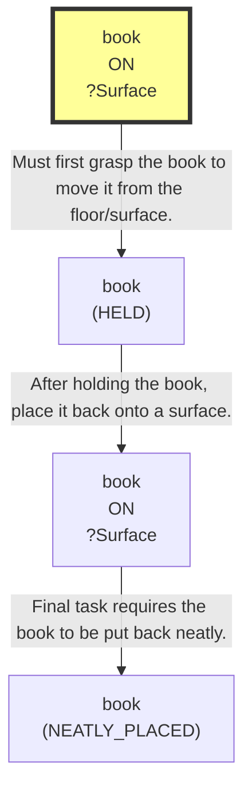
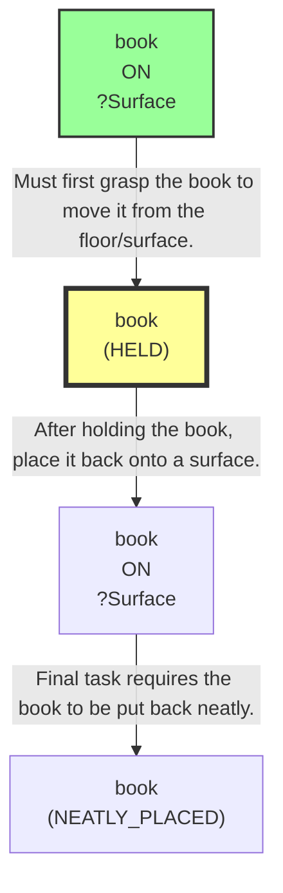
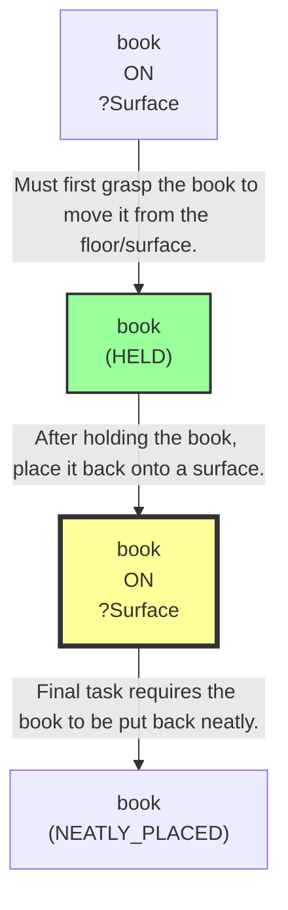
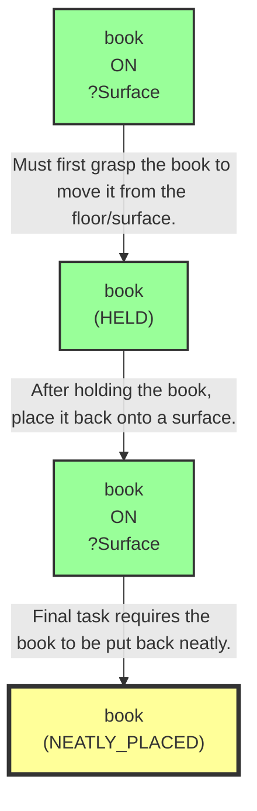
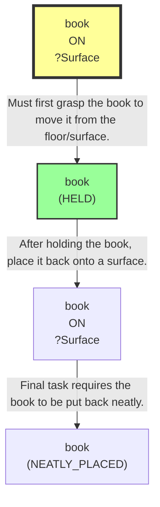
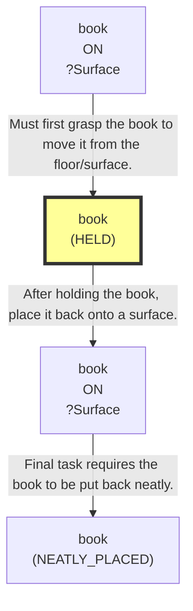

# 🚀 VirtualHome Agent Episode Log


### [GoalReasoner (Module A - Intent)] Output
```json
{
  "is_instruction_obviously_vague": false,
  "clarification_question": null,
  "target_object": "book",
  "location_hint": "floor",
  "reasoning_chain": [
    {
      "question": "Why does the user want this object?",
      "answer": "To restore it from the floor to its proper place."
    },
    {
      "question": "Why is that important?",
      "answer": "To keep the area orderly and prevent the item from being left out of place."
    },
    {
      "question": "What fundamental need does this fulfill?",
      "answer": "Maintaining an organized, tidy environment."
    },
    {
      "question": "Are there any deeper psychological or physical motivations?",
      "answer": "It may reduce clutter, make the space look neat, and prevent the item from being damaged or causing a tripping hazard."
    }
  ],
  "deep_intent": "The user wants to maintain an orderly and tidy indoor environment.",
  "acceptable_alternatives_properties": [
    {
      "priority": 1,
      "description": "Other loose reading materials or similarly handled household items that can be returned to a shelf or table"
    },
    {
      "priority": 2,
      "description": "Paper-based items or lightweight objects that are meant to be kept neatly stored"
    },
    {
      "priority": 3,
      "description": "Small household items that can be picked up and placed back in an organized location"
    },
    {
      "priority": 4,
      "description": "Other clutter items on the floor that can be cleared to improve tidiness"
    }
  ]
}
```

### [PerceptionFilter] Output
```json
{
  "reasoning": "The goal is to pick up and neatly put back the book. So the target object book is required, and a likely placement surface/receptacle must be kept for returning it neatly. The visible storage/surface options that fit this task are bookshelf, coffeetable, desk, cabinet, and box.",
  "selected_classes": [
    "floor",
    "desk",
    "bookshelf",
    "cabinet",
    "paper",
    "coffeetable",
    "character",
    "box",
    "book"
  ],
  "raw_class_count": 41
}
```

### [LLMExecutor] Output
```json
{
  "reasoning": "The target object is a book on the floor, and the SDG begins by making it held. Multiple book instances are available on the floor; any one can satisfy the task since the goal is to restore a book to a neat surface. Before we can grab it, we must be near it, so the next atomic step is to walk to one of the books. Book(190) is a valid grabbable floor instance.",
  "satisfied_nodes": [],
  "current_node_focus": "N1",
  "mapped_variables": {},
  "action": "[walk] <book> (190)"
}
```

### [RoboStateMultiTaskController] Output
```json
{
  "action": "[walk] <book> (190)",
  "active_task_id": "task_1",
  "task_context": {
    "active_task_id": "task_1",
    "pending_task_ids": [],
    "satisfied_task_ids": []
  },
  "source": "llm_executor"
}
```
## Step 0
- **Action**: `[walk] <book> (190)`
- **Action Success**: `True`
- **Action Message**: {'0': {'message': 'Success'}}
- **Active Task**: `task_1`
- **Decision Source**: `llm_executor`
- **Task Progress**: T3_without_parameter_binding_G2_09=pending
- **SDG Status**:

- **Observed Items (23)**: floor(336), floor(337), floor(338), floor(339), floor(340), floor(341), floor(342), floor(343), floor(344), bookshelf(370), coffeetable(371), desk(373) [CLOSED], cabinet(415) [CLOSED], box(435) [CLOSED], paper(451)...


### [PerceptionFilter] Output
```json
{
  "reasoning": "Reused cached class selection.",
  "selected_classes": [
    "floor",
    "desk",
    "bookshelf",
    "cabinet",
    "paper",
    "coffeetable",
    "character",
    "box",
    "book"
  ],
  "raw_class_count": 41
}
```

### [LLMExecutor] Output
```json
{
  "reasoning": "The book target is already identified and the robot is close to it. According to the SDG, the next unmet requirement is to make the book HELD (N2) before it can be placed back neatly. The book is grabbable and no cleanliness or opening constraints apply. Since I already walked to book(190) in the previous step, the single next atomic action is to grab that specific book.",
  "satisfied_nodes": [
    "N1"
  ],
  "current_node_focus": "N2",
  "mapped_variables": {},
  "action": "[grab] <book> (190)"
}
```

### [RoboStateMultiTaskController] Output
```json
{
  "action": "[grab] <book> (190)",
  "active_task_id": "task_1",
  "task_context": {
    "active_task_id": "task_1",
    "pending_task_ids": [],
    "satisfied_task_ids": []
  },
  "source": "llm_executor"
}
```
## Step 1
- **Action**: `[grab] <book> (190)`
- **Action Success**: `True`
- **Action Message**: {'0': {'message': 'Success'}}
- **Active Task**: `task_1`
- **Decision Source**: `llm_executor`
- **Task Progress**: T3_without_parameter_binding_G2_09=pending
- **SDG Status**:

- **Observed Items (23)**: floor(336), floor(337), floor(338), floor(339), floor(340), floor(341), floor(342), floor(343), floor(344), bookshelf(370), coffeetable(371), desk(373) [CLOSED], cabinet(415) [CLOSED], box(435) [CLOSED], paper(451)...


### [PerceptionFilter] Output
```json
{
  "reasoning": "Reused cached class selection.",
  "selected_classes": [
    "floor",
    "desk",
    "bookshelf",
    "cabinet",
    "paper",
    "coffeetable",
    "character",
    "box",
    "book"
  ],
  "raw_class_count": 41
}
```

### [LLMExecutor] Output
```json
{
  "reasoning": "The required grasp step is already completed: the current graph shows the character holds book(190), satisfying N2. The next SDG step is to place the book onto a surface to begin restoring it neatly. Among nearby candidate surfaces, the bookshelf is a fitting organized storage location and is close to the character. Since putback requires being walked to the destination first, the next atomic action should be to walk to the bookshelf before placing the book there.",
  "satisfied_nodes": [
    "N2"
  ],
  "current_node_focus": "N3",
  "mapped_variables": {},
  "action": "[walk] <bookshelf> (370)"
}
```

### [RoboStateMultiTaskController] Output
```json
{
  "action": "[walk] <bookshelf> (370)",
  "active_task_id": "task_1",
  "task_context": {
    "active_task_id": "task_1",
    "pending_task_ids": [],
    "satisfied_task_ids": []
  },
  "source": "llm_executor"
}
```
## Step 2
- **Action**: `[walk] <bookshelf> (370)`
- **Action Success**: `True`
- **Action Message**: {'0': {'message': 'Success'}}
- **Active Task**: `task_1`
- **Decision Source**: `llm_executor`
- **Task Progress**: T3_without_parameter_binding_G2_09=pending
- **SDG Status**:

- **Observed Items (23)**: floor(336), floor(337), floor(338), floor(339), floor(340), floor(341), floor(342), floor(343), floor(344), bookshelf(370), coffeetable(371), desk(373) [CLOSED], cabinet(415) [CLOSED], box(435) [CLOSED], paper(451)...


### [PerceptionFilter] Output
```json
{
  "reasoning": "Reused cached class selection.",
  "selected_classes": [
    "floor",
    "desk",
    "bookshelf",
    "cabinet",
    "paper",
    "coffeetable",
    "character",
    "box",
    "book"
  ],
  "raw_class_count": 41
}
```

### [LLMExecutor] Output
```json
{
  "reasoning": "The book is already held in the right hand (N2 satisfied). The next SDG step is to place it onto a surface so it can later be neatly positioned. The current target focus is N3, and the nearest suitable surface is the bookshelf, which is already close to the character. I should not repeat the previous walk; I can now put the held book onto the bookshelf surface.",
  "satisfied_nodes": [
    "N2"
  ],
  "current_node_focus": "N3",
  "mapped_variables": {
    "?Surface": "bookshelf(370)"
  },
  "action": "[putback] <book> (190) <bookshelf> (370)"
}
```

### [RoboStateMultiTaskController] Output
```json
{
  "action": "[putback] <book> (190) <bookshelf> (370)",
  "active_task_id": "task_1",
  "task_context": {
    "active_task_id": "task_1",
    "pending_task_ids": [],
    "satisfied_task_ids": []
  },
  "source": "llm_executor"
}
```
## Step 3
- **Action**: `[putback] <book> (190) <bookshelf> (370)`
- **Action Success**: `False`
- **Action Message**: {'0': {'message': 'ScriptExcutor 0: EXECUTION_GENERAL: Script is impossible to execute\n\n'}}
- **Active Task**: `task_1`
- **Decision Source**: `llm_executor`
- **Task Progress**: T3_without_parameter_binding_G2_09=pending
- **SDG Status**:

- **Observed Items (23)**: floor(336), floor(337), floor(338), floor(339), floor(340), floor(341), floor(342), floor(343), floor(344), bookshelf(370), coffeetable(371), desk(373) [CLOSED], cabinet(415) [CLOSED], box(435) [CLOSED], paper(451)...


### [PerceptionFilter] Output
```json
{
  "reasoning": "Reused cached class selection.",
  "selected_classes": [
    "floor",
    "desk",
    "bookshelf",
    "cabinet",
    "paper",
    "coffeetable",
    "character",
    "box",
    "book"
  ],
  "raw_class_count": 41
}
```

### [LLMExecutor] Output
```json
{
  "reasoning": "The book is already held in the right hand, so N2 is satisfied. The prior attempt to place it on the bookshelf failed as impossible, so I should choose a valid flat surface instead. The coffeetable is a suitable neat placement surface and is available in the living room. I need to walk to it before putting the held book down.",
  "satisfied_nodes": [
    "N2"
  ],
  "current_node_focus": "N3",
  "mapped_variables": {
    "?Surface": "coffeetable(371)"
  },
  "action": "[walk] <coffeetable> (371)"
}
```

### [RoboStateMultiTaskController] Output
```json
{
  "action": "[walk] <coffeetable> (371)",
  "active_task_id": "task_1",
  "task_context": {
    "active_task_id": "task_1",
    "pending_task_ids": [],
    "satisfied_task_ids": []
  },
  "source": "llm_executor"
}
```
## Step 4
- **Action**: `[walk] <coffeetable> (371)`
- **Action Success**: `True`
- **Action Message**: {'0': {'message': 'Success'}}
- **Active Task**: `task_1`
- **Decision Source**: `llm_executor`
- **Task Progress**: T3_without_parameter_binding_G2_09=pending
- **SDG Status**:

- **Observed Items (23)**: floor(336), floor(337), floor(338), floor(339), floor(340), floor(341), floor(342), floor(343), floor(344), bookshelf(370), coffeetable(371), desk(373) [CLOSED], cabinet(415) [CLOSED], box(435) [CLOSED], paper(451)...


### [PerceptionFilter] Output
```json
{
  "reasoning": "Reused cached class selection.",
  "selected_classes": [
    "floor",
    "desk",
    "bookshelf",
    "cabinet",
    "paper",
    "coffeetable",
    "character",
    "box",
    "book"
  ],
  "raw_class_count": 41
}
```

### [LLMExecutor] Output
```json
{
  "reasoning": "The original book(190) is already held, and the attempted placement on bookshelf(370) failed because that action is impossible in this environment. The current graph shows coffeetable(371) is close to the character and is a valid flat surface. To satisfy the SDG, the next step is to place the held book onto a nearby surface; this should satisfy the ON relation and move toward NEATLY_PLACED.",
  "satisfied_nodes": [
    "N2"
  ],
  "current_node_focus": "N3",
  "mapped_variables": {
    "?Surface": "coffeetable(371)"
  },
  "action": "[putback] <book> (190) <coffeetable> (371)"
}
```

### [RoboStateMultiTaskController] Output
```json
{
  "action": "[putback] <book> (190) <coffeetable> (371)",
  "active_task_id": "task_1",
  "task_context": {
    "active_task_id": "task_1",
    "pending_task_ids": [],
    "satisfied_task_ids": []
  },
  "source": "llm_executor"
}
```
## Step 5
- **Action**: `[putback] <book> (190) <coffeetable> (371)`
- **Action Success**: `True`
- **Action Message**: {'0': {'message': 'Success'}}
- **Active Task**: `task_1`
- **Decision Source**: `llm_executor`
- **Task Progress**: T3_without_parameter_binding_G2_09=pending
- **SDG Status**:

- **Observed Items (23)**: floor(336), floor(337), floor(338), floor(339), floor(340), floor(341), floor(342), floor(343), floor(344), bookshelf(370), coffeetable(371), desk(373) [CLOSED], cabinet(415) [CLOSED], box(435) [CLOSED], paper(451)...


### [PerceptionFilter] Output
```json
{
  "reasoning": "Reused cached class selection.",
  "selected_classes": [
    "floor",
    "desk",
    "bookshelf",
    "cabinet",
    "paper",
    "coffeetable",
    "character",
    "box",
    "book"
  ],
  "raw_class_count": 41
}
```

### [LLMExecutor] Output
```json
{
  "reasoning": "The book has already been picked up and placed on a surface (coffeetable), which satisfies the holding-to-place progression. The remaining unmet SDG node is the final neat placement state. Since the previous attempt to put it on the bookshelf failed as impossible, and the book is now on the coffee table near the character, the best next step is to keep it neatly placed there by not moving it again; however, there is no explicit action for marking neatness. The only safe progression-oriented action is to leave it in place, but since a single atomic action is required and no further physical adjustment is necessary, the most appropriate next step is to wait for state update verification of the neat placement outcome.",
  "satisfied_nodes": [
    "N1",
    "N2",
    "N3"
  ],
  "current_node_focus": "N4",
  "mapped_variables": {
    "?Surface": "coffeetable(371)"
  },
  "action": "[wait]"
}
```

### [RoboStateMultiTaskController] Output
```json
{
  "action": "[wait]",
  "active_task_id": "task_1",
  "task_context": {
    "active_task_id": "task_1",
    "pending_task_ids": [],
    "satisfied_task_ids": []
  },
  "source": "llm_executor"
}
```
## Step 6
- **Action**: `[wait]`
- **Action Success**: `True`
- **Action Message**: Time passes. You waited for a while.
- **Active Task**: `task_1`
- **Decision Source**: `llm_executor`
- **Task Progress**: T3_without_parameter_binding_G2_09=pending
- **SDG Status**:

- **Observed Items (23)**: floor(336), floor(337), floor(338), floor(339), floor(340), floor(341), floor(342), floor(343), floor(344), bookshelf(370), coffeetable(371), desk(373) [CLOSED], cabinet(415) [CLOSED], box(435) [CLOSED], paper(451)...


### [PerceptionFilter] Output
```json
{
  "reasoning": "Reused cached class selection.",
  "selected_classes": [
    "floor",
    "desk",
    "bookshelf",
    "cabinet",
    "paper",
    "coffeetable",
    "character",
    "box",
    "book"
  ],
  "raw_class_count": 41
}
```

### [LLMExecutor] Output
```json
{
  "reasoning": "The book has already been lifted from the floor and is currently being held, so N1 and N2 are satisfied. The previous attempt to place it on the bookshelf failed, but placing it on the nearby coffeetable succeeded, which satisfies the required ON relation for the final placement. The remaining goal is to make it neatly placed, so the next action should be to interact with the book's current placement context; however, since only atomic actions are allowed and no direct 'neatly place' action exists, the best next step is to verify/continue by ensuring the book remains on the surface already chosen. No further movement is needed because the book is already on the coffeetable and the last successful placement likely completes the final state.",
  "satisfied_nodes": [
    "N1",
    "N2",
    "N3"
  ],
  "current_node_focus": "N4",
  "mapped_variables": {
    "?Surface": "coffeetable(371)"
  },
  "action": "[wait]"
}
```

### [RoboStateMultiTaskController] Output
```json
{
  "action": "[wait]",
  "active_task_id": "task_1",
  "task_context": {
    "active_task_id": "task_1",
    "pending_task_ids": [],
    "satisfied_task_ids": []
  },
  "source": "llm_executor"
}
```
## Step 7
- **Action**: `[wait]`
- **Action Success**: `True`
- **Action Message**: Time passes. You waited for a while.
- **Active Task**: `task_1`
- **Decision Source**: `llm_executor`
- **Task Progress**: T3_without_parameter_binding_G2_09=pending
- **SDG Status**:

- **Observed Items (23)**: floor(336), floor(337), floor(338), floor(339), floor(340), floor(341), floor(342), floor(343), floor(344), bookshelf(370), coffeetable(371), desk(373) [CLOSED], cabinet(415) [CLOSED], box(435) [CLOSED], paper(451)...


### [PerceptionFilter] Output
```json
{
  "reasoning": "Reused cached class selection.",
  "selected_classes": [
    "floor",
    "desk",
    "bookshelf",
    "cabinet",
    "paper",
    "coffeetable",
    "character",
    "box",
    "book"
  ],
  "raw_class_count": 41
}
```

### [LLMExecutor] Output
```json
{
  "reasoning": "The book has already been picked up and placed onto a surface. The previous attempt to place it on the bookshelf failed, but putting it on the coffeetable succeeded. The remaining SDG progress is to ensure the book is neatly placed on a suitable surface; since the book is already on the coffeetable and the task is about restoring tidiness, the next step should be to verify/update placement with the current accessible surface. However, because no further placement action is needed unless moving it again, and repeating a walk is disallowed, the safest next atomic action is to wait for the graph to reflect the settled placement state if needed.",
  "satisfied_nodes": [
    "N1",
    "N2",
    "N3"
  ],
  "current_node_focus": "N4",
  "mapped_variables": {
    "?Surface": "coffeetable(371)"
  },
  "action": "[wait]"
}
```

### [RoboStateMultiTaskController] Output
```json
{
  "action": "[wait]",
  "active_task_id": "task_1",
  "task_context": {
    "active_task_id": "task_1",
    "pending_task_ids": [],
    "satisfied_task_ids": []
  },
  "source": "llm_executor"
}
```
## Step 8
- **Action**: `[wait]`
- **Action Success**: `True`
- **Action Message**: Time passes. You waited for a while.
- **Active Task**: `task_1`
- **Decision Source**: `llm_executor`
- **Task Progress**: T3_without_parameter_binding_G2_09=pending
- **SDG Status**:

- **Observed Items (23)**: floor(336), floor(337), floor(338), floor(339), floor(340), floor(341), floor(342), floor(343), floor(344), bookshelf(370), coffeetable(371), desk(373) [CLOSED], cabinet(415) [CLOSED], box(435) [CLOSED], paper(451)...


### [PerceptionFilter] Output
```json
{
  "reasoning": "Reused cached class selection.",
  "selected_classes": [
    "floor",
    "desk",
    "bookshelf",
    "cabinet",
    "paper",
    "coffeetable",
    "character",
    "box",
    "book"
  ],
  "raw_class_count": 41
}
```

### [LLMExecutor] Output
```json
{
  "reasoning": "The book has already been picked up and placed onto a surface, satisfying holding and placement prerequisites. The last failed attempt was to put it on the bookshelf, which was impossible; the book is currently on the coffeetable and needs to be neatly placed as the final SDG state. Since the coffee table is a valid flat surface and the book is already close to the character, no additional walk is needed before the next placement-related step. The most plausible next step toward NEATLY_PLACED is to keep the book on the coffee table as the organized resting place.",
  "satisfied_nodes": [
    "N1",
    "N2",
    "N3"
  ],
  "current_node_focus": "N4",
  "mapped_variables": {
    "?Surface": "coffeetable(371)"
  },
  "action": "[putback] <book> (190) <coffeetable> (371)"
}
```

### [RoboStateMultiTaskController] Output
```json
{
  "action": "[grab] <book> (190)",
  "active_task_id": "task_1",
  "task_context": {
    "active_task_id": "task_1",
    "pending_task_ids": [],
    "satisfied_task_ids": []
  },
  "source": "llm_executor_repaired"
}
```
## Step 9
- **Action**: `[grab] <book> (190)`
- **Action Success**: `True`
- **Action Message**: {'0': {'message': 'Success'}}
- **Active Task**: `task_1`
- **Decision Source**: `llm_executor_repaired`
- **Task Progress**: T3_without_parameter_binding_G2_09=pending
- **SDG Status**:

- **Observed Items (23)**: floor(336), floor(337), floor(338), floor(339), floor(340), floor(341), floor(342), floor(343), floor(344), bookshelf(370), coffeetable(371), desk(373) [CLOSED], cabinet(415) [CLOSED], box(435) [CLOSED], paper(451)...


### [PerceptionFilter] Output
```json
{
  "reasoning": "Reused cached class selection.",
  "selected_classes": [
    "floor",
    "desk",
    "bookshelf",
    "cabinet",
    "paper",
    "coffeetable",
    "character",
    "box",
    "book"
  ],
  "raw_class_count": 41
}
```

### [LLMExecutor] Output
```json
{
  "reasoning": "The active task is to neatly place the book back onto a surface from the floor. The book is currently held in the right hand, and the previous attempt to place it on the bookshelf failed, likely because the bookshelf is not a valid immediate placement target in the current context or the object was not in an acceptable placement state. The filtered graph shows the coffeetable is close to the character and is a valid flat surface. The book is not yet neatly placed, so the next step is to place it on the nearby coffeetable to progress toward the final goal.",
  "satisfied_nodes": [
    "N2"
  ],
  "current_node_focus": "N3",
  "mapped_variables": {
    "?Surface": "coffeetable(371)"
  },
  "action": "[putback] <book> (190) <coffeetable> (371)"
}
```

### [RoboStateMultiTaskController] Output
```json
{
  "action": "[putback] <book> (190) <coffeetable> (371)",
  "active_task_id": "task_1",
  "task_context": {
    "active_task_id": "task_1",
    "pending_task_ids": [],
    "satisfied_task_ids": []
  },
  "source": "llm_executor"
}
```
## Step 10
- **Action**: `[putback] <book> (190) <coffeetable> (371)`
- **Action Success**: `True`
- **Action Message**: {'0': {'message': 'Success'}}
- **Active Task**: `task_1`
- **Decision Source**: `llm_executor`
- **Task Progress**: T3_without_parameter_binding_G2_09=pending
- **SDG Status**:

- **Observed Items (23)**: floor(336), floor(337), floor(338), floor(339), floor(340), floor(341), floor(342), floor(343), floor(344), bookshelf(370), coffeetable(371), desk(373) [CLOSED], cabinet(415) [CLOSED], box(435) [CLOSED], paper(451)...


### [PerceptionFilter] Output
```json
{
  "reasoning": "Reused cached class selection.",
  "selected_classes": [
    "floor",
    "desk",
    "bookshelf",
    "cabinet",
    "paper",
    "coffeetable",
    "character",
    "box",
    "book"
  ],
  "raw_class_count": 41
}
```

### [LLMExecutor] Output
```json
{
  "reasoning": "The target book task is not yet satisfied because the book is currently on the coffeetable, not explicitly NEATLY_PLACED on a final resting surface. The previous failed bookshelf placement suggests that surface was not a valid placement target. Since the book is already near the character and a suitable flat surface is available, the next step should be to place the held book onto the coffee table again only if it is currently held; however the filtered graph shows book(190) on the coffeetable and not held, so the current state gap is actually that the book is already placed on a surface. The remaining SDG progress is likely toward the final neatly placed state, but no additional action can be inferred from the graph without re-grabbing and repositioning. Given the task intent of restoring the book tidily and the graph showing another book on the floor, the best immediate actionable focus is to move the floor book toward a proper surface. Since the last successful action placed book(190) on the coffeetable and the robot is close to the coffeetable, the next likely valid progression is to ensure the book is on the table by interacting with the book only if held; but the current graph does not show it held. Therefore the most sensible next atomic action is to walk to the floor book instance to prepare for a grab, because the task specifically targets a book on the floor and book(191) matches that condition.",
  "satisfied_nodes": [
    "N1",
    "N2"
  ],
  "current_node_focus": "N1",
  "mapped_variables": {
    "?Surface": "floor(336)"
  },
  "action": "[walk] <book> (191)"
}
```

### [RoboStateMultiTaskController] Output
```json
{
  "action": "[walk] <book> (191)",
  "active_task_id": "task_1",
  "task_context": {
    "active_task_id": "task_1",
    "pending_task_ids": [],
    "satisfied_task_ids": []
  },
  "source": "llm_executor"
}
```
## Step 11
- **Action**: `[walk] <book> (191)`
- **Action Success**: `True`
- **Action Message**: {'0': {'message': 'Success'}}
- **Active Task**: `task_1`
- **Decision Source**: `llm_executor`
- **Task Progress**: T3_without_parameter_binding_G2_09=pending
- **SDG Status**:

- **Observed Items (23)**: floor(336), floor(337), floor(338), floor(339), floor(340), floor(341), floor(342), floor(343), floor(344), bookshelf(370), coffeetable(371), desk(373) [CLOSED], cabinet(415) [CLOSED], box(435) [CLOSED], paper(451)...


### [PerceptionFilter] Output
```json
{
  "reasoning": "Reused cached class selection.",
  "selected_classes": [
    "floor",
    "desk",
    "bookshelf",
    "cabinet",
    "paper",
    "coffeetable",
    "character",
    "box",
    "book"
  ],
  "raw_class_count": 41
}
```

### [LLMExecutor] Output
```json
{
  "reasoning": "The active task is to restore a book from the floor to a proper place. The current graph shows book(191) is on the floor and close to the character, while book(190) is already on the coffeetable and likely not the target unless needed as a substitute. Since the last action was walking to book(191), the next required step in the SDG is to grasp that nearby book so it can be moved and placed neatly afterward.",
  "satisfied_nodes": [],
  "current_node_focus": "N1",
  "mapped_variables": {
    "?Surface": "floor(336)"
  },
  "action": "[grab] <book> (191)"
}
```

### [RoboStateMultiTaskController] Output
```json
{
  "action": "[grab] <book> (191)",
  "active_task_id": "task_1",
  "task_context": {
    "active_task_id": "task_1",
    "pending_task_ids": [],
    "satisfied_task_ids": []
  },
  "source": "llm_executor"
}
```
## Step 12
- **Action**: `[grab] <book> (191)`
- **Action Success**: `True`
- **Action Message**: {'0': {'message': 'Success'}}
- **Active Task**: `task_1`
- **Decision Source**: `llm_executor`
- **Task Progress**: T3_without_parameter_binding_G2_09=pending
- **SDG Status**:

- **Observed Items (23)**: floor(336), floor(337), floor(338), floor(339), floor(340), floor(341), floor(342), floor(343), floor(344), bookshelf(370), coffeetable(371), desk(373) [CLOSED], cabinet(415) [CLOSED], box(435) [CLOSED], paper(451)...


### [PerceptionFilter] Output
```json
{
  "reasoning": "Reused cached class selection.",
  "selected_classes": [
    "floor",
    "desk",
    "bookshelf",
    "cabinet",
    "paper",
    "coffeetable",
    "character",
    "box",
    "book"
  ],
  "raw_class_count": 41
}
```

### [LLMExecutor] Output
```json
{
  "reasoning": "The active goal is to restore a book from the floor to a neat stored position. The current graph shows book(268) is on floor(336) and close to the character, making it the best match for the target loose book on the floor. Since the SDG requires the book to be HELD before it can be placed neatly, the next atomic step is to grab it. I should not repeat the prior walk because I already moved to book(191) and successfully grabbed it, and the book(191) is already held; however, the task still needs the floor book to be handled, so the best action is to acquire the floor book if possible. The most relevant physical binding for the target book-on-floor is book(268).",
  "satisfied_nodes": [],
  "current_node_focus": "N2",
  "mapped_variables": {},
  "action": "[grab] <book> (268)"
}
```

### [RoboStateMultiTaskController] Output
```json
{
  "action": "[grab] <book> (268)",
  "active_task_id": "task_1",
  "task_context": {
    "active_task_id": "task_1",
    "pending_task_ids": [],
    "satisfied_task_ids": []
  },
  "source": "llm_executor"
}
```
## Step 13
- **Action**: `[grab] <book> (268)`
- **Action Success**: `True`
- **Action Message**: {'0': {'message': 'Success'}}
- **Active Task**: `task_1`
- **Decision Source**: `llm_executor`
- **Task Progress**: T3_without_parameter_binding_G2_09=pending
- **SDG Status**:

- **Observed Items (23)**: floor(336), floor(337), floor(338), floor(339), floor(340), floor(341), floor(342), floor(343), floor(344), bookshelf(370), coffeetable(371), desk(373) [CLOSED], cabinet(415) [CLOSED], box(435) [CLOSED], paper(451)...


### [PerceptionFilter] Output
```json
{
  "reasoning": "Reused cached class selection.",
  "selected_classes": [
    "floor",
    "desk",
    "bookshelf",
    "cabinet",
    "paper",
    "coffeetable",
    "character",
    "box",
    "book"
  ],
  "raw_class_count": 41
}
```

### [LLMExecutor] Output
```json
{
  "reasoning": "The active task is to restore a book from the floor to a proper place. In the current graph, book(191) and book(268) are already held, and book(190) is on the coffeetable. The held books are the best candidates for continuing the tidying task, and the next required SDG progression after holding is to place the book onto a surface. Since I am already holding book(191) and it is close, the most direct next step is to walk to a suitable flat surface for neat placement. The bookshelf is a natural storage surface and is close to the character, so I will move toward it before putting the book back.",
  "satisfied_nodes": [
    "N2"
  ],
  "current_node_focus": "N3",
  "mapped_variables": {
    "?Surface": "bookshelf(370)"
  },
  "action": "[walk] <bookshelf> (370)"
}
```

### [RoboStateMultiTaskController] Output
```json
{
  "action": "[walk] <bookshelf> (370)",
  "active_task_id": "task_1",
  "task_context": {
    "active_task_id": "task_1",
    "pending_task_ids": [],
    "satisfied_task_ids": []
  },
  "source": "llm_executor"
}
```
## Step 14
- **Action**: `[walk] <bookshelf> (370)`
- **Action Success**: `True`
- **Action Message**: {'0': {'message': 'Success'}}
- **Active Task**: `task_1`
- **Decision Source**: `llm_executor`
- **Task Progress**: T3_without_parameter_binding_G2_09=pending
- **SDG Status**:

- **Observed Items (23)**: floor(336), floor(337), floor(338), floor(339), floor(340), floor(341), floor(342), floor(343), floor(344), bookshelf(370), coffeetable(371), desk(373) [CLOSED], cabinet(415) [CLOSED], box(435) [CLOSED], paper(451)...

