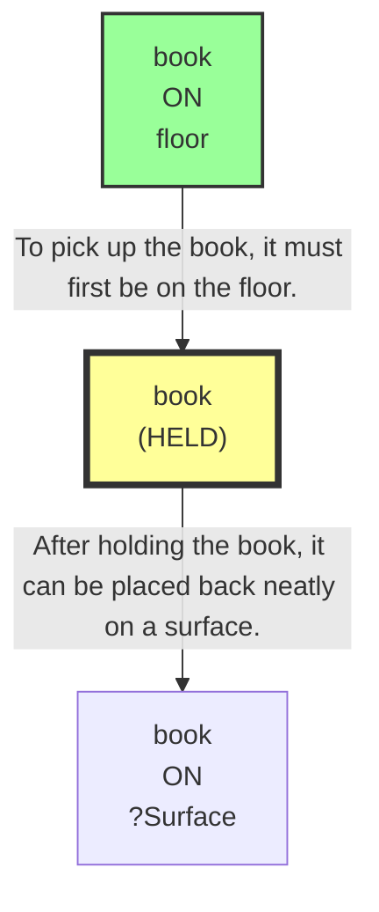
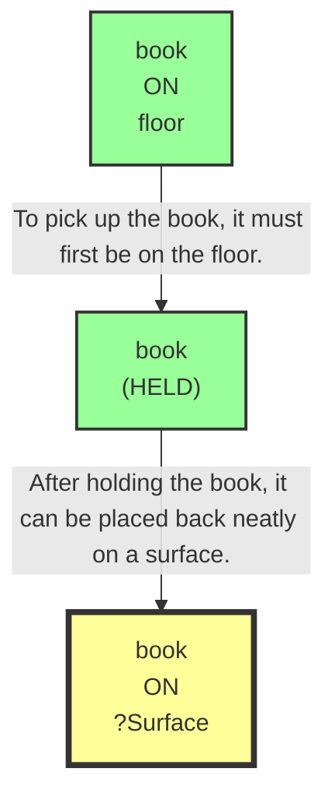
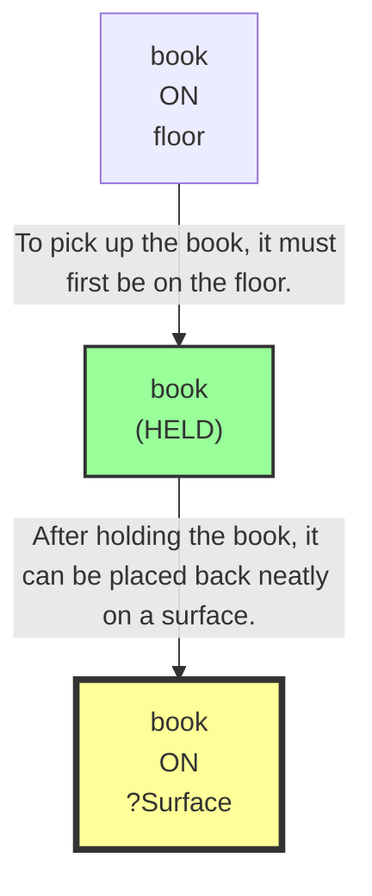
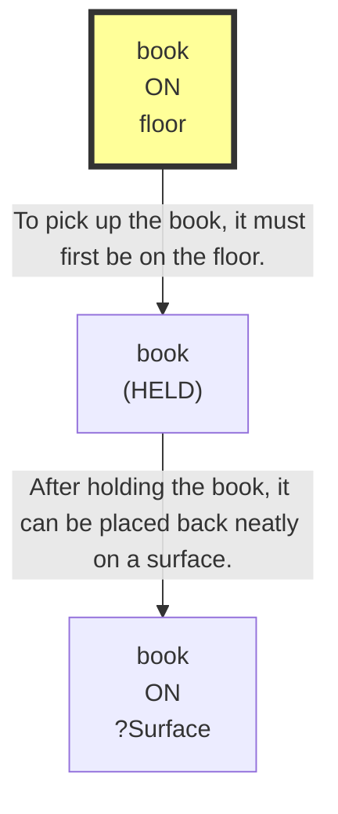

# 🚀 VirtualHome Agent Episode Log


### [GoalReasoner (Module A - Intent)] Output
```json
{
  "is_instruction_obviously_vague": false,
  "clarification_question": null,
  "target_object": "book",
  "location_hint": "floor",
  "reasoning_chain": [
    {
      "question": "Why does the user want this object?",
      "answer": "To restore the book to its proper place after it falls."
    },
    {
      "question": "Why is that important?",
      "answer": "So the area remains tidy and the book is not left on the floor."
    },
    {
      "question": "What fundamental need does this fulfill?",
      "answer": "Maintaining order and organization in the environment."
    },
    {
      "question": "Are there any deeper psychological or physical motivations?",
      "answer": "It may prevent clutter, reduce the chance of the book being damaged or stepped on, and satisfy a preference for neatness."
    }
  ],
  "deep_intent": "The user wants to restore order by returning a misplaced item to its proper place.",
  "acceptable_alternatives_properties": [
    {
      "priority": 1,
      "description": "Other fallen household items that can be picked up and returned to their place, such as a notebook, magazine, or folder."
    },
    {
      "priority": 2,
      "description": "Similar paper-based or reading-related items that may need to be tidied up, such as documents, pamphlets, or papers."
    },
    {
      "priority": 3,
      "description": "Other lightweight personal items that can be repositioned to reduce clutter, such as a remote control or glasses."
    },
    {
      "priority": 4,
      "description": "Any small indoor object that has fallen and can be put back in an orderly location."
    }
  ]
}
```

### [PerceptionFilter] Output
```json
{
  "reasoning": "The goal is to pick up the fallen book from the floor and return it to a proper surface. I only need the target object, the floor relation for its current location, and likely candidate placement surfaces/furniture for putting it back neatly. To preserve alternatives, I keep all plausible surfaces/receptacles where a book could be placed.",
  "selected_classes": [
    "book",
    "box",
    "cabinet",
    "character",
    "floor",
    "paper",
    "coffeetable",
    "bookshelf",
    "sofa",
    "folder",
    "desk"
  ],
  "raw_class_count": 41
}
```

### [LLMExecutor] Output
```json
{
  "reasoning": "The SDG is currently at N1: the book must be on the floor. Multiple books satisfy this, and any of them can be treated as the target because the goal is to pick up a fallen book and restore order. I will start by moving to the nearest matching book on the floor so I can grab it next.",
  "satisfied_nodes": [
    "N1"
  ],
  "current_node_focus": "N2",
  "mapped_variables": {
    "?Surface": "coffeetable(371)"
  },
  "action": "[walk] <book> (190)"
}
```

### [RoboStateMultiTaskController] Output
```json
{
  "action": "[walk] <book> (190)",
  "active_task_id": "task_1",
  "task_context": {
    "active_task_id": "task_1",
    "pending_task_ids": [],
    "satisfied_task_ids": []
  },
  "source": "llm_executor"
}
```
## Step 0
- **Action**: `[walk] <book> (190)`
- **Action Success**: `True`
- **Action Message**: {'0': {'message': 'Success'}}
- **Active Task**: `task_1`
- **Decision Source**: `llm_executor`
- **Task Progress**: T3_without_parameter_binding_G2_09=pending
- **SDG Status**:

- **Observed Items (25)**: floor(336), floor(337), floor(338), floor(339), floor(340), floor(341), floor(342), floor(343), floor(344), sofa(368), bookshelf(370), coffeetable(371), desk(373) [CLOSED], cabinet(415) [CLOSED], box(435) [CLOSED]...


### [PerceptionFilter] Output
```json
{
  "reasoning": "Reused cached class selection.",
  "selected_classes": [
    "book",
    "box",
    "cabinet",
    "character",
    "floor",
    "paper",
    "coffeetable",
    "bookshelf",
    "sofa",
    "folder",
    "desk"
  ],
  "raw_class_count": 41
}
```

### [LLMExecutor] Output
```json
{
  "reasoning": "The target book is already on the floor and is close to the character, so the next step in the SDG is to satisfy N2 by grabbing the book. The most likely intended binding is book(190) since it is the book explicitly approached in the prior action and is on the floor, matching N1.",
  "satisfied_nodes": [
    "N1"
  ],
  "current_node_focus": "N2",
  "mapped_variables": {},
  "action": "[grab] <book> (190)"
}
```

### [RoboStateMultiTaskController] Output
```json
{
  "action": "[grab] <book> (190)",
  "active_task_id": "task_1",
  "task_context": {
    "active_task_id": "task_1",
    "pending_task_ids": [],
    "satisfied_task_ids": []
  },
  "source": "llm_executor"
}
```
## Step 1
- **Action**: `[grab] <book> (190)`
- **Action Success**: `True`
- **Action Message**: {'0': {'message': 'Success'}}
- **Active Task**: `task_1`
- **Decision Source**: `llm_executor`
- **Task Progress**: T3_without_parameter_binding_G2_09=pending
- **SDG Status**:

- **Observed Items (25)**: floor(336), floor(337), floor(338), floor(339), floor(340), floor(341), floor(342), floor(343), floor(344), sofa(368), bookshelf(370), coffeetable(371), desk(373) [CLOSED], cabinet(415) [CLOSED], box(435) [CLOSED]...


### [PerceptionFilter] Output
```json
{
  "reasoning": "Reused cached class selection.",
  "selected_classes": [
    "book",
    "box",
    "cabinet",
    "character",
    "floor",
    "paper",
    "coffeetable",
    "bookshelf",
    "sofa",
    "folder",
    "desk"
  ],
  "raw_class_count": 41
}
```

### [LLMExecutor] Output
```json
{
  "reasoning": "The book target for the active task is already being held in the right hand, so N1 (book on floor) and N2 (book held) are satisfied. The next required step toward the final goal N3 is to place the book onto a suitable surface. A nearby flat surface that supports putting objects down is the coffeetable, which is present in the living room. To satisfy the proximity rule for putback, I must first walk to that surface.",
  "satisfied_nodes": [
    "N1",
    "N2"
  ],
  "current_node_focus": "N3",
  "mapped_variables": {
    "?Surface": "coffeetable(371)"
  },
  "action": "[walk] <coffeetable> (371)"
}
```

### [RoboStateMultiTaskController] Output
```json
{
  "action": "[walk] <coffeetable> (371)",
  "active_task_id": "task_1",
  "task_context": {
    "active_task_id": "task_1",
    "pending_task_ids": [],
    "satisfied_task_ids": []
  },
  "source": "llm_executor"
}
```
## Step 2
- **Action**: `[walk] <coffeetable> (371)`
- **Action Success**: `True`
- **Action Message**: {'0': {'message': 'Success'}}
- **Active Task**: `task_1`
- **Decision Source**: `llm_executor`
- **Task Progress**: T3_without_parameter_binding_G2_09=pending
- **SDG Status**:

- **Observed Items (25)**: floor(336), floor(337), floor(338), floor(339), floor(340), floor(341), floor(342), floor(343), floor(344), sofa(368), bookshelf(370), coffeetable(371), desk(373) [CLOSED], cabinet(415) [CLOSED], box(435) [CLOSED]...


### [PerceptionFilter] Output
```json
{
  "reasoning": "Reused cached class selection.",
  "selected_classes": [
    "book",
    "box",
    "cabinet",
    "character",
    "floor",
    "paper",
    "coffeetable",
    "bookshelf",
    "sofa",
    "folder",
    "desk"
  ],
  "raw_class_count": 41
}
```

### [LLMExecutor] Output
```json
{
  "reasoning": "The target book is currently already held in the right hand according to the graph (HOLDS_RH book(190)), so N2 is satisfied. The next unmet SDG node is to place the book onto a suitable surface. We are already close to the coffeetable from the previous walk action, and coffeetable(371) is a valid flat surface for putting the book back neatly. Since putback requires being near the destination and the previous step established proximity, the correct next atomic action is to place the held book on the coffee table.",
  "satisfied_nodes": [
    "N1",
    "N2"
  ],
  "current_node_focus": "N3",
  "mapped_variables": {
    "?Surface": "coffeetable(371)"
  },
  "action": "[putback] <book> (190) <coffeetable> (371)"
}
```

### [RoboStateMultiTaskController] Output
```json
{
  "action": "[putback] <book> (190) <coffeetable> (371)",
  "active_task_id": "task_1",
  "task_context": {
    "active_task_id": "task_1",
    "pending_task_ids": [],
    "satisfied_task_ids": []
  },
  "source": "llm_executor"
}
```
## Step 3
- **Action**: `[putback] <book> (190) <coffeetable> (371)`
- **Action Success**: `True`
- **Action Message**: {'0': {'message': 'Success'}}
- **Active Task**: `task_1`
- **Decision Source**: `llm_executor`
- **Task Progress**: T3_without_parameter_binding_G2_09=pending
- **SDG Status**:

- **Observed Items (25)**: floor(336), floor(337), floor(338), floor(339), floor(340), floor(341), floor(342), floor(343), floor(344), sofa(368), bookshelf(370), coffeetable(371), desk(373) [CLOSED], cabinet(415) [CLOSED], box(435) [CLOSED]...


### [PerceptionFilter] Output
```json
{
  "reasoning": "Reused cached class selection.",
  "selected_classes": [
    "book",
    "box",
    "cabinet",
    "character",
    "floor",
    "paper",
    "coffeetable",
    "bookshelf",
    "sofa",
    "folder",
    "desk"
  ],
  "raw_class_count": 41
}
```

### [LLMExecutor] Output
```json
{
  "reasoning": "N1 (book on floor) is satisfied for book(191) or book(268), but the active task most likely refers to a book to be restored to a proper place. We already completed the book(190) pickup and placed it on the coffeetable(371), so N2 (book held) is no longer satisfied for book(190). To progress toward the final goal, we need to pick up the book again from the coffeetable before placing it elsewhere. The character is already close to the coffeetable, so the next atomic action should be grabbing the same book.",
  "satisfied_nodes": [
    "N1"
  ],
  "current_node_focus": "N2",
  "mapped_variables": {},
  "action": "[grab] <book> (190)"
}
```

### [RoboStateMultiTaskController] Output
```json
{
  "action": "[grab] <book> (190)",
  "active_task_id": "task_1",
  "task_context": {
    "active_task_id": "task_1",
    "pending_task_ids": [],
    "satisfied_task_ids": []
  },
  "source": "llm_executor"
}
```
## Step 4
- **Action**: `[grab] <book> (190)`
- **Action Success**: `True`
- **Action Message**: {'0': {'message': 'Success'}}
- **Active Task**: `task_1`
- **Decision Source**: `llm_executor`
- **Task Progress**: T3_without_parameter_binding_G2_09=pending
- **SDG Status**:

- **Observed Items (25)**: floor(336), floor(337), floor(338), floor(339), floor(340), floor(341), floor(342), floor(343), floor(344), sofa(368), bookshelf(370), coffeetable(371), desk(373) [CLOSED], cabinet(415) [CLOSED], box(435) [CLOSED]...


### [PerceptionFilter] Output
```json
{
  "reasoning": "Reused cached class selection.",
  "selected_classes": [
    "book",
    "box",
    "cabinet",
    "character",
    "floor",
    "paper",
    "coffeetable",
    "bookshelf",
    "sofa",
    "folder",
    "desk"
  ],
  "raw_class_count": 41
}
```

### [LLMExecutor] Output
```json
{
  "reasoning": "The active goal is to move the book from the floor to a proper surface. The current graph shows book(190) is already held by the character, so N2 (HELD) is satisfied. The next unmet node is placing the book on some surface, and the closest valid surface is the coffeetable(371), which was already used successfully before and is close to the character. Since putback requires being at the destination surface first, and we are already close to the coffeetable, the next action should be to place the held book back onto it.",
  "satisfied_nodes": [
    "N2"
  ],
  "current_node_focus": "N3",
  "mapped_variables": {
    "?Surface": "coffeetable(371)"
  },
  "action": "[putback] <book> (190) <coffeetable> (371)"
}
```

### [RoboStateMultiTaskController] Output
```json
{
  "action": "[putback] <book> (190) <coffeetable> (371)",
  "active_task_id": "task_1",
  "task_context": {
    "active_task_id": "task_1",
    "pending_task_ids": [],
    "satisfied_task_ids": []
  },
  "source": "llm_executor"
}
```
## Step 5
- **Action**: `[putback] <book> (190) <coffeetable> (371)`
- **Action Success**: `True`
- **Action Message**: {'0': {'message': 'Success'}}
- **Active Task**: `task_1`
- **Decision Source**: `llm_executor`
- **Task Progress**: T3_without_parameter_binding_G2_09=pending
- **SDG Status**:

- **Observed Items (25)**: floor(336), floor(337), floor(338), floor(339), floor(340), floor(341), floor(342), floor(343), floor(344), sofa(368), bookshelf(370), coffeetable(371), desk(373) [CLOSED], cabinet(415) [CLOSED], box(435) [CLOSED]...


### [PerceptionFilter] Output
```json
{
  "reasoning": "Reused cached class selection.",
  "selected_classes": [
    "book",
    "box",
    "cabinet",
    "character",
    "floor",
    "paper",
    "coffeetable",
    "bookshelf",
    "sofa",
    "folder",
    "desk"
  ],
  "raw_class_count": 41
}
```

### [LLMExecutor] Output
```json
{
  "reasoning": "The goal requires the book to end up on some surface after being held. Book(190) is already on the coffeetable and close to the character, so the current gap is that it is not yet in the final neatly placed state required by N3. Since the task is to restore a fallen book to its proper place and the only nearby suitable surface in the current graph is the coffeetable, the best next step is to place the held book onto that surface, which should satisfy the final relation node.",
  "satisfied_nodes": [
    "N2"
  ],
  "current_node_focus": "N3",
  "mapped_variables": {
    "?Surface": "coffeetable(371)"
  },
  "action": "[putback] <book> (190) <coffeetable> (371)"
}
```

### [RoboStateMultiTaskController] Output
```json
{
  "action": "[grab] <book> (190)",
  "active_task_id": "task_1",
  "task_context": {
    "active_task_id": "task_1",
    "pending_task_ids": [],
    "satisfied_task_ids": []
  },
  "source": "llm_executor_repaired"
}
```
## Step 6
- **Action**: `[grab] <book> (190)`
- **Action Success**: `True`
- **Action Message**: {'0': {'message': 'Success'}}
- **Active Task**: `task_1`
- **Decision Source**: `llm_executor_repaired`
- **Task Progress**: T3_without_parameter_binding_G2_09=pending
- **SDG Status**:

- **Observed Items (25)**: floor(336), floor(337), floor(338), floor(339), floor(340), floor(341), floor(342), floor(343), floor(344), sofa(368), bookshelf(370), coffeetable(371), desk(373) [CLOSED], cabinet(415) [CLOSED], box(435) [CLOSED]...


### [PerceptionFilter] Output
```json
{
  "reasoning": "Reused cached class selection.",
  "selected_classes": [
    "book",
    "box",
    "cabinet",
    "character",
    "floor",
    "paper",
    "coffeetable",
    "bookshelf",
    "sofa",
    "folder",
    "desk"
  ],
  "raw_class_count": 41
}
```

### [LLMExecutor] Output
```json
{
  "reasoning": "The active task is to return a book to a proper place. N1 (book on floor) is not satisfied for the currently relevant book, but the graph shows book(190) is already in hand, so N2 is satisfied. To complete N3, I need to place the held book onto a suitable surface. The nearest valid surface already close to the character is the coffeetable(371), which is a flat surface and can accept putback. I must first be near the destination before putting it down, and I am already close to the coffeetable per the graph, so the next step is to place the book there.",
  "satisfied_nodes": [
    "N2"
  ],
  "current_node_focus": "N3",
  "mapped_variables": {
    "?Surface": "coffeetable(371)"
  },
  "action": "[putback] <book> (190) <coffeetable> (371)"
}
```

### [RoboStateMultiTaskController] Output
```json
{
  "action": "[walk] <bathroom> (11)",
  "active_task_id": null,
  "task_context": {
    "active_task_id": null,
    "pending_task_ids": [
      "task_1"
    ],
    "satisfied_task_ids": []
  },
  "source": "loop_recovery_room_revisit"
}
```
## Step 7
- **Action**: `[walk] <bathroom> (11)`
- **Action Success**: `True`
- **Action Message**: {'0': {'message': 'Success'}}
- **Decision Source**: `loop_recovery_room_revisit`
- **Task Progress**: T3_without_parameter_binding_G2_09=pending
- **SDG Status**:
No SDG active.
- **Observed Items (82)**: floor(336), floor(337), floor(338), floor(339), floor(340), floor(341), floor(342), floor(343), floor(344), wall(345), wall(346), wall(347), wall(348), wall(349), wall(350)...


### [PerceptionFilter] Output
```json
{
  "reasoning": "The goal is to pick up a book from the floor and place it back on a suitable surface. The SDG explicitly requires the book, the floor, and some target surface to put it on; the visible storage/surface options that fit this task are bookshelf, desk, coffeetable, cabinet, and shelves. Since we must keep all plausible placement alternatives, I include the book, floor, and all visible surfaces/receptacles that could serve as the book’s proper place.",
  "selected_classes": [
    "book",
    "cabinet",
    "character",
    "floor",
    "paper",
    "coffeetable",
    "bookshelf",
    "wallshelf",
    "door",
    "folder",
    "desk"
  ],
  "raw_class_count": 63
}
```

### [LLMExecutor] Output
```json
{
  "reasoning": "The active task is to restore a book that is on the floor. The current graph shows two candidate floor books in the living room: book(191) and book(268). Book(190) is already being held by the character in the bathroom, so it is not the floor target. Since we are currently in the bathroom and need to interact with a floor book in the living room, the next step must be to walk to one of the valid floor-book candidates before grabbing. I will bind the target book to the closest/most direct valid floor candidate from the graph, book(191), and move toward it.",
  "satisfied_nodes": [],
  "current_node_focus": "N1",
  "mapped_variables": {
    "?Surface": "coffeetable(371)"
  },
  "action": "[walk] <book> (191)"
}
```

### [RoboStateMultiTaskController] Output
```json
{
  "action": "[walk] <book> (191)",
  "active_task_id": "task_1",
  "task_context": {
    "active_task_id": "task_1",
    "pending_task_ids": [],
    "satisfied_task_ids": []
  },
  "source": "llm_executor"
}
```
## Step 8
- **Action**: `[walk] <book> (191)`
- **Action Success**: `True`
- **Action Message**: {'0': {'message': 'Success'}}
- **Active Task**: `task_1`
- **Decision Source**: `llm_executor`
- **Task Progress**: T3_without_parameter_binding_G2_09=pending
- **SDG Status**:

- **Observed Items (31)**: floor(336), floor(337), floor(338), floor(339), floor(340), floor(341), floor(342), floor(343), floor(344), bookshelf(370), coffeetable(371), desk(373) [CLOSED], cabinet(415) [CLOSED], paper(451), folder(453) [CLOSED]...


### [PerceptionFilter] Output
```json
{
  "reasoning": "Reused cached class selection.",
  "selected_classes": [
    "book",
    "cabinet",
    "character",
    "floor",
    "paper",
    "coffeetable",
    "bookshelf",
    "wallshelf",
    "door",
    "folder",
    "desk"
  ],
  "raw_class_count": 63
}
```

### [LLMExecutor] Output
```json
{
  "reasoning": "The active goal is to restore the book from the floor to a proper surface. The current graph shows book(191) and book(268) are on the floor, while book(190) is already held by the character, so the next useful step is to place the held book onto a valid surface. Since the previous step was a walk to book(191) and no grab has occurred yet, the held book(190) should be put down on the nearby coffee table to progress toward the final state N3. The coffee table is a flat surface and is available in the living room.",
  "satisfied_nodes": [
    "N1",
    "N2"
  ],
  "current_node_focus": "N3",
  "mapped_variables": {
    "?Surface": "coffeetable(371)"
  },
  "action": "[putback] <book> (190) <coffeetable> (371)"
}
```

### [RoboStateMultiTaskController] Output
```json
{
  "action": "[walk] <coffeetable> (371)",
  "active_task_id": "task_1",
  "task_context": {
    "active_task_id": "task_1",
    "pending_task_ids": [],
    "satisfied_task_ids": []
  },
  "source": "llm_executor_repaired"
}
```
## Step 9
- **Action**: `[walk] <coffeetable> (371)`
- **Action Success**: `True`
- **Action Message**: {'0': {'message': 'Success'}}
- **Active Task**: `task_1`
- **Decision Source**: `llm_executor_repaired`
- **Task Progress**: T3_without_parameter_binding_G2_09=pending
- **SDG Status**:

- **Observed Items (31)**: floor(336), floor(337), floor(338), floor(339), floor(340), floor(341), floor(342), floor(343), floor(344), bookshelf(370), coffeetable(371), desk(373) [CLOSED], cabinet(415) [CLOSED], paper(451), folder(453) [CLOSED]...


### [PerceptionFilter] Output
```json
{
  "reasoning": "Reused cached class selection.",
  "selected_classes": [
    "book",
    "cabinet",
    "character",
    "floor",
    "paper",
    "coffeetable",
    "bookshelf",
    "wallshelf",
    "door",
    "folder",
    "desk"
  ],
  "raw_class_count": 63
}
```

### [LLMExecutor] Output
```json
{
  "reasoning": "The active task is to restore a book from the floor to a proper surface. In the current graph, book(190) is already held by the character, so N2 is satisfied. The remaining unmet goal is to place the book onto a surface; the coffee table is a valid flat surface and is already close to the character. Since we are already adjacent to coffeetable(371), the next step is to put the held book back onto it to satisfy N3.",
  "satisfied_nodes": [
    "N2"
  ],
  "current_node_focus": "N3",
  "mapped_variables": {
    "?Surface": "coffeetable(371)"
  },
  "action": "[putback] <book> (190) <coffeetable> (371)"
}
```

### [RoboStateMultiTaskController] Output
```json
{
  "action": "[putback] <book> (190) <coffeetable> (371)",
  "active_task_id": "task_1",
  "task_context": {
    "active_task_id": "task_1",
    "pending_task_ids": [],
    "satisfied_task_ids": []
  },
  "source": "llm_executor"
}
```
## Step 10
- **Action**: `[putback] <book> (190) <coffeetable> (371)`
- **Action Success**: `True`
- **Action Message**: {'0': {'message': 'Success'}}
- **Active Task**: `task_1`
- **Decision Source**: `llm_executor`
- **Task Progress**: T3_without_parameter_binding_G2_09=pending
- **SDG Status**:

- **Observed Items (31)**: floor(336), floor(337), floor(338), floor(339), floor(340), floor(341), floor(342), floor(343), floor(344), bookshelf(370), coffeetable(371), desk(373) [CLOSED], cabinet(415) [CLOSED], paper(451), folder(453) [CLOSED]...


### [PerceptionFilter] Output
```json
{
  "reasoning": "Reused cached class selection.",
  "selected_classes": [
    "book",
    "cabinet",
    "character",
    "floor",
    "paper",
    "coffeetable",
    "bookshelf",
    "wallshelf",
    "door",
    "folder",
    "desk"
  ],
  "raw_class_count": 63
}
```

### [LLMExecutor] Output
```json
{
  "reasoning": "The active task is to restore a book from the floor to a proper surface. The SDG final goal is N3: book ON ?Surface, but the current graph shows book(190) is already on coffeetable(371), not on the floor. However, book(191) and book(268) are on the floor and match the target object class. To satisfy the first unsatisfied prerequisite N1, the best binding is book(191) because it is explicitly on the floor in the living room and is a valid instance of the target class. The next atomic step must be to move near it before grabbing, since grab requires proximity.",
  "satisfied_nodes": [],
  "current_node_focus": "N1",
  "mapped_variables": {
    "?Surface": "coffeetable(371)"
  },
  "action": "[walk] <book> (191)"
}
```

### [RoboStateMultiTaskController] Output
```json
{
  "action": "[walk] <book> (191)",
  "active_task_id": "task_1",
  "task_context": {
    "active_task_id": "task_1",
    "pending_task_ids": [],
    "satisfied_task_ids": []
  },
  "source": "llm_executor"
}
```
## Step 11
- **Action**: `[walk] <book> (191)`
- **Action Success**: `True`
- **Action Message**: {'0': {'message': 'Success'}}
- **Active Task**: `task_1`
- **Decision Source**: `llm_executor`
- **Task Progress**: T3_without_parameter_binding_G2_09=pending
- **SDG Status**:

- **Observed Items (31)**: floor(336), floor(337), floor(338), floor(339), floor(340), floor(341), floor(342), floor(343), floor(344), bookshelf(370), coffeetable(371), desk(373) [CLOSED], cabinet(415) [CLOSED], paper(451), folder(453) [CLOSED]...


### [PerceptionFilter] Output
```json
{
  "reasoning": "Reused cached class selection.",
  "selected_classes": [
    "book",
    "cabinet",
    "character",
    "floor",
    "paper",
    "coffeetable",
    "bookshelf",
    "wallshelf",
    "door",
    "folder",
    "desk"
  ],
  "raw_class_count": 63
}
```

### [LLMExecutor] Output
```json
{
  "reasoning": "The active goal is to restore a book from the floor to a surface. In the current graph, book(191) and book(268) are on the floor, and character(1) is already close to both. Since the previous action was [walk] to book(191), the next atomic step should be to grab the nearby floor book. I choose book(191) as the best binding for the target book because it is explicitly on the floor and close to the character, satisfying N1 and progressing toward N2.",
  "satisfied_nodes": [
    "N1"
  ],
  "current_node_focus": "N2",
  "mapped_variables": {
    "?Surface": "coffeetable(371)"
  },
  "action": "[grab] <book> (191)"
}
```

### [RoboStateMultiTaskController] Output
```json
{
  "action": "[grab] <book> (191)",
  "active_task_id": "task_1",
  "task_context": {
    "active_task_id": "task_1",
    "pending_task_ids": [],
    "satisfied_task_ids": []
  },
  "source": "llm_executor"
}
```
## Step 12
- **Action**: `[grab] <book> (191)`
- **Action Success**: `True`
- **Action Message**: {'0': {'message': 'Success'}}
- **Active Task**: `task_1`
- **Decision Source**: `llm_executor`
- **Task Progress**: T3_without_parameter_binding_G2_09=pending
- **SDG Status**:

- **Observed Items (31)**: floor(336), floor(337), floor(338), floor(339), floor(340), floor(341), floor(342), floor(343), floor(344), bookshelf(370), coffeetable(371), desk(373) [CLOSED], cabinet(415) [CLOSED], paper(451), folder(453) [CLOSED]...


### [PerceptionFilter] Output
```json
{
  "reasoning": "Reused cached class selection.",
  "selected_classes": [
    "book",
    "cabinet",
    "character",
    "floor",
    "paper",
    "coffeetable",
    "bookshelf",
    "wallshelf",
    "door",
    "folder",
    "desk"
  ],
  "raw_class_count": 63
}
```

### [LLMExecutor] Output
```json
{
  "reasoning": "The active goal is to restore the book to a proper place. The current SDG focus is N2: the book must be HELD. In the graph, book(191) is the only book currently CLOSE to the character and is already held in the right hand, but the goal object in the SDG is simply 'book' and book(268) is also on the floor, matching N1. Since the next prerequisite to satisfy the final placement is having the target book held, and the currently tracked book(191) is already held, the most progress toward the SDG is to bind the task to the floor book candidate only after confirming possession; however, because the state shows a held book already and the system requires atomic actions, no further acquisition is needed before proceeding to placement in the next step. The immediate next action should therefore move toward the placement target once chosen. However, the task is not yet at N3, so the correct single next action is to walk to the intended placement surface after holding the book. The best available surface consistent with tidying is the coffeetable.",
  "satisfied_nodes": [
    "N1",
    "N2"
  ],
  "current_node_focus": "N3",
  "mapped_variables": {},
  "action": "[walk] <coffeetable> (371)"
}
```

### [RoboStateMultiTaskController] Output
```json
{
  "action": "[walk] <coffeetable> (371)",
  "active_task_id": "task_1",
  "task_context": {
    "active_task_id": "task_1",
    "pending_task_ids": [],
    "satisfied_task_ids": []
  },
  "source": "llm_executor"
}
```
## Step 13
- **Action**: `[walk] <coffeetable> (371)`
- **Action Success**: `True`
- **Action Message**: {'0': {'message': 'Success'}}
- **Active Task**: `task_1`
- **Decision Source**: `llm_executor`
- **Task Progress**: T3_without_parameter_binding_G2_09=pending
- **SDG Status**:

- **Observed Items (31)**: floor(336), floor(337), floor(338), floor(339), floor(340), floor(341), floor(342), floor(343), floor(344), bookshelf(370), coffeetable(371), desk(373) [CLOSED], cabinet(415) [CLOSED], paper(451), folder(453) [CLOSED]...


### [PerceptionFilter] Output
```json
{
  "reasoning": "Reused cached class selection.",
  "selected_classes": [
    "book",
    "cabinet",
    "character",
    "floor",
    "paper",
    "coffeetable",
    "bookshelf",
    "wallshelf",
    "door",
    "folder",
    "desk"
  ],
  "raw_class_count": 63
}
```

### [LLMExecutor] Output
```json
{
  "reasoning": "The active task is to restore the book from the floor to a proper surface. In the current graph, book(268) is the only book explicitly on the floor, so it best matches the SDG prerequisite N1. We are already close to book(268), and the previous action was a walk to the coffeetable, so the next atomic step should be to grab the floor book before placing it elsewhere.",
  "satisfied_nodes": [
    "N1"
  ],
  "current_node_focus": "N2",
  "mapped_variables": {},
  "action": "[grab] <book> (268)"
}
```

### [RoboStateMultiTaskController] Output
```json
{
  "action": "[walk] <book> (268)",
  "active_task_id": "task_1",
  "task_context": {
    "active_task_id": "task_1",
    "pending_task_ids": [],
    "satisfied_task_ids": []
  },
  "source": "llm_executor_repaired"
}
```
## Step 14
- **Action**: `[walk] <book> (268)`
- **Action Success**: `True`
- **Action Message**: {'0': {'message': 'Success'}}
- **Active Task**: `task_1`
- **Decision Source**: `llm_executor_repaired`
- **Task Progress**: T3_without_parameter_binding_G2_09=pending
- **SDG Status**:

- **Observed Items (31)**: floor(336), floor(337), floor(338), floor(339), floor(340), floor(341), floor(342), floor(343), floor(344), bookshelf(370), coffeetable(371), desk(373) [CLOSED], cabinet(415) [CLOSED], paper(451), folder(453) [CLOSED]...

