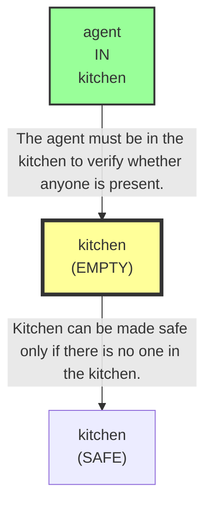
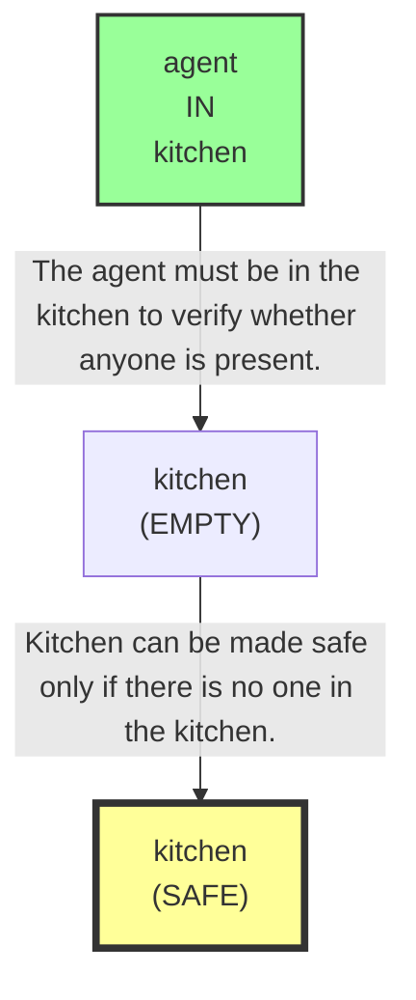

# 🚀 VirtualHome Agent Episode Log


### [GoalReasoner (Module A - Intent)] Output
```json
{
  "is_instruction_obviously_vague": false,
  "clarification_question": null,
  "target_object": "kitchen",
  "location_hint": null,
  "reasoning_chain": [
    {
      "question": "Why does the user want this object?",
      "answer": "To have the kitchen in a safe condition when no one is present."
    },
    {
      "question": "Why is that important?",
      "answer": "To prevent hazards, damage, or unsafe situations while the kitchen is unattended."
    },
    {
      "question": "What fundamental need does this fulfill?",
      "answer": "Physical safety and hazard prevention."
    },
    {
      "question": "Are there any deeper psychological or physical motivations?",
      "answer": "A desire to reduce risk, avoid accidents, and ensure the environment is secure."
    }
  ],
  "deep_intent": "The user wants to reduce hazards and ensure physical safety in an unattended kitchen.",
  "acceptable_alternatives_properties": [
    {
      "priority": 1,
      "description": "Actions that eliminate immediate hazards in the kitchen, such as turning off appliances, closing burners, or removing spill risks"
    },
    {
      "priority": 2,
      "description": "General household safety checks in the kitchen area, such as confirming doors, outlets, and equipment are in a safe state"
    },
    {
      "priority": 3,
      "description": "Other indoor safety-related cleanup or shutdown tasks that reduce accident risk in the home"
    },
    {
      "priority": 4,
      "description": "Safety-focused checks in another room or area of the home if the kitchen cannot be made fully safe"
    }
  ]
}
```

### [PerceptionFilter] Output
```json
{
  "reasoning": "The goal is to make the kitchen safe and empty, so the only needed classes are the kitchen-relevant safety/inspection and hazard-control objects: the room entry/visibility items, appliances that could pose hazards, and tools for shutdown or cleanup if needed. I keep cooking/heating appliances and their control/cleanup supports because they are the likely sources of immediate hazards in an unattended kitchen.",
  "selected_classes": [
    "stove",
    "coffeemaker",
    "lightswitch",
    "door",
    "fryingpan",
    "toaster",
    "sink",
    "dishwashingliquid",
    "microwave",
    "character",
    "washingsponge",
    "faucet",
    "fridge",
    "garbagecan"
  ],
  "raw_class_count": 54
}
```

### [LLMExecutor] Output
```json
{
  "reasoning": "The agent is already inside the kitchen, which satisfies the prerequisite for checking whether the kitchen is empty. The next step toward making the kitchen safe is to verify/prepare to verify emptiness by moving to the area where presence can be assessed. Since no other people are listed in the filtered graph, the most direct progress is to continue within the kitchen context rather than manipulate appliances prematurely.",
  "satisfied_nodes": [
    "N3"
  ],
  "current_node_focus": "N2",
  "mapped_variables": {},
  "action": "[wait]"
}
```

### [RoboStateMultiTaskController] Output
```json
{
  "action": "[wait]",
  "active_task_id": "task_1",
  "task_context": {
    "active_task_id": "task_1",
    "pending_task_ids": [],
    "satisfied_task_ids": []
  },
  "source": "llm_executor"
}
```
## Step 0
- **Action**: `[wait]`
- **Action Success**: `True`
- **Action Message**: Time passes. You waited for a while.
- **Active Task**: `task_1`
- **Decision Source**: `llm_executor`
- **Task Progress**: T3_without_parameter_binding_G2_10=pending
- **SDG Status**:

- **Observed Items (18)**: door(224) [OPEN], garbagecan(229) [CLOSED], sink(247), faucet(248) [OFF], lightswitch(261) [ON], washingsponge(266), dishwashingliquid(267), fryingpan(269), fridge(305) [CLOSED], coffeemaker(306) [OFF], toaster(308) [OFF], stove(311) [ON,CLOSED], microwave(313) [CLOSED,OFF], character(1), bathroom(11)...


### [PerceptionFilter] Output
```json
{
  "reasoning": "Reused cached class selection.",
  "selected_classes": [
    "stove",
    "coffeemaker",
    "lightswitch",
    "door",
    "fryingpan",
    "toaster",
    "sink",
    "dishwashingliquid",
    "microwave",
    "character",
    "washingsponge",
    "faucet",
    "fridge",
    "garbagecan"
  ],
  "raw_class_count": 54
}
```

### [LLMExecutor] Output
```json
{
  "reasoning": "The SDG requires the agent to be in the kitchen before checking whether it is empty/safe. Current graph shows the character is already INSIDE kitchen(205), so N3 is satisfied. The next unmet prerequisite is N2 (kitchen EMPTY), which cannot be directly asserted from the graph alone; the only available physical next step toward verifying safety is to inspect the kitchen state from the current position, but since no observation action exists, we continue by focusing on the safest immediate hazard in the room. The stove is ON and CLOSED, which is an immediate kitchen hazard, so turning it off is the best next step toward making the kitchen safe.",
  "satisfied_nodes": [
    "N3"
  ],
  "current_node_focus": "N1",
  "mapped_variables": {},
  "action": "[switchoff] <stove> (311)"
}
```

### [RoboStateMultiTaskController] Output
```json
{
  "action": "[walk] <stove> (311)",
  "active_task_id": "task_1",
  "task_context": {
    "active_task_id": "task_1",
    "pending_task_ids": [],
    "satisfied_task_ids": []
  },
  "source": "llm_executor_repaired"
}
```
## Step 1
- **Action**: `[walk] <stove> (311)`
- **Action Success**: `True`
- **Action Message**: {'0': {'message': 'Success'}}
- **Active Task**: `task_1`
- **Decision Source**: `llm_executor_repaired`
- **Task Progress**: T3_without_parameter_binding_G2_10=pending
- **SDG Status**:

- **Observed Items (18)**: door(224) [OPEN], garbagecan(229) [CLOSED], sink(247), faucet(248) [OFF], lightswitch(261) [ON], washingsponge(266), dishwashingliquid(267), fryingpan(269), fridge(305) [CLOSED], coffeemaker(306) [OFF], toaster(308) [OFF], stove(311) [ON,CLOSED], microwave(313) [CLOSED,OFF], character(1), bathroom(11)...


### [PerceptionFilter] Output
```json
{
  "reasoning": "Reused cached class selection.",
  "selected_classes": [
    "stove",
    "coffeemaker",
    "lightswitch",
    "door",
    "fryingpan",
    "toaster",
    "sink",
    "dishwashingliquid",
    "microwave",
    "character",
    "washingsponge",
    "faucet",
    "fridge",
    "garbagecan"
  ],
  "raw_class_count": 54
}
```

### [LLMExecutor] Output
```json
{
  "reasoning": "The SDG requires the agent to be in the kitchen to verify whether anyone is present before the kitchen can be considered EMPTY and then SAFE. The current graph shows the agent character is INSIDE kitchen(205), so N3 is satisfied. No evidence yet confirms the kitchen is empty or safe, and the next atomic step should be to assess the presence of others by moving/looking within the kitchen area; however, the only available atomic action that advances proximity/verification without assuming more is to continue focusing on the kitchen environment from the current location. Since I am already in the kitchen and have just walked to stove(311), the most sensible next step is to interact with the kitchen context by checking the nearby safety hazard source: the stove is ON. Turning it off is directly relevant to making the kitchen safer while unattended and is the clearest immediate hazard. This does not require any holding or opening. ",
  "satisfied_nodes": [
    "N3"
  ],
  "current_node_focus": "N1",
  "mapped_variables": {},
  "action": "[switchoff] <stove> (311)"
}
```

### [RoboStateMultiTaskController] Output
```json
{
  "action": "[switchoff] <stove> (311)",
  "active_task_id": "task_1",
  "task_context": {
    "active_task_id": "task_1",
    "pending_task_ids": [],
    "satisfied_task_ids": []
  },
  "source": "llm_executor"
}
```
## Step 2
- **Action**: `[switchoff] <stove> (311)`
- **Action Success**: `True`
- **Action Message**: Faked switch operation in Python layer (bypassed Unity failure)
- **Active Task**: `task_1`
- **Decision Source**: `llm_executor`
- **Task Progress**: T3_without_parameter_binding_G2_10=done
- **SDG Status**:

- **Observed Items (18)**: door(224) [OPEN], garbagecan(229) [CLOSED], sink(247), faucet(248) [OFF], lightswitch(261) [ON], washingsponge(266), dishwashingliquid(267), fryingpan(269), fridge(305) [CLOSED], coffeemaker(306) [OFF], toaster(308) [OFF], stove(311) [ON,CLOSED], microwave(313) [CLOSED,OFF], character(1), bathroom(11)...

