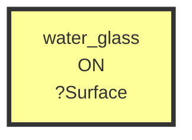

# 🚀 VirtualHome Agent Episode Log


### [GoalReasoner (Module A - Intent)] Output
```json
{
  "is_instruction_obviously_vague": false,
  "clarification_question": null,
  "target_object": "water glasses",
  "location_hint": "sink",
  "reasoning_chain": [
    {
      "question": "Why does the user want this object?",
      "answer": "To remove dirty drinking vessels from where they are seen and place them in the sink."
    },
    {
      "question": "Why is that important?",
      "answer": "To keep the area orderly and prepare the items for washing or further handling."
    },
    {
      "question": "What fundamental need does this fulfill?",
      "answer": "It supports cleanliness and household organization."
    },
    {
      "question": "Are there any deeper psychological or physical motivations?",
      "answer": "The user likely wants to reduce clutter and maintain a hygienic environment by promptly relocating dirty items to the proper place."
    }
  ],
  "deep_intent": "The user wants to keep the indoor environment clean and organized by promptly moving dirty dishware to the proper washing area.",
  "acceptable_alternatives_properties": [
    {
      "priority": 1,
      "description": "Other dirty dishware or drinkware that should be placed in the sink, such as cups, mugs, or plates"
    },
    {
      "priority": 2,
      "description": "Any used kitchen items that belong in the sink or washing area"
    },
    {
      "priority": 3,
      "description": "Household items contributing to clutter that can be collected for cleaning or sorting"
    },
    {
      "priority": 4,
      "description": "Other items in the room that can be tidied away to support a cleaner, more organized space"
    }
  ]
}
```

### [PerceptionFilter] Output
```json
{
  "reasoning": "The goal is to move dirty water glasses to the washing area. The SDG explicitly requires water_glass objects, and the location hint points to the sink. To preserve functional alternatives for washing/placement and backups, include other dishware that may also need to be moved, plus the washing receptacle and its related appliance alternative.",
  "selected_classes": [
    "cup",
    "plate",
    "character",
    "mug",
    "dishwasher",
    "dishbowl",
    "door",
    "waterglass",
    "sink"
  ],
  "raw_class_count": 50
}
```

### [LLMExecutor] Output
```json
{
  "reasoning": "The active goal is to place a water glass on the sink. The best match is waterglass(64) because it is explicitly DIRTY, which aligns with the intent to move dirty dishware to the washing area. The sink(155) is the correct destination surface, and it does not need opening. Since putting something on the sink requires being near the destination first, the next atomic step is to walk to the sink.",
  "satisfied_nodes": [],
  "current_node_focus": "N1",
  "mapped_variables": {
    "?Surface": "sink(155)"
  },
  "action": "[walk] <sink> (155)"
}
```

### [RoboStateMultiTaskController] Output
```json
{
  "action": "[walk] <sink> (155)",
  "active_task_id": "task_1",
  "task_context": {
    "active_task_id": "task_1",
    "pending_task_ids": [],
    "satisfied_task_ids": []
  },
  "source": "llm_executor"
}
```
## Step 0
- **Action**: `[walk] <sink> (155)`
- **Action Success**: `True`
- **Action Message**: {'0': {'message': 'Success'}}
- **Active Task**: `task_1`
- **Decision Source**: `llm_executor`
- **Task Progress**: T3_without_parameter_binding_M1_03=pending
- **SDG Status**:

- **Observed Items (32)**: door(47) [OPEN], waterglass(64) [DIRTY], plate(67), plate(68), waterglass(71), waterglass(72), plate(75), plate(76), waterglass(79), waterglass(80), plate(83), plate(84), waterglass(87), waterglass(88), plate(91)...


### [PerceptionFilter] Output
```json
{
  "reasoning": "Reused cached class selection.",
  "selected_classes": [
    "cup",
    "plate",
    "character",
    "mug",
    "dishwasher",
    "dishbowl",
    "door",
    "waterglass",
    "sink"
  ],
  "raw_class_count": 50
}
```

### [LLMExecutor] Output
```json
{
  "reasoning": "The goal is to place a water glass in the sink. I am already close to the sink, but I am not holding any glass yet. The best matching target is the dirty waterglass(64), since the intent prioritizes dirty drinking vessels. To satisfy the ON relation, I must first get near the glass before grabbing it. Since the current graph places all candidate glasses inside the kitchen and does not show me adjacent to waterglass(64), the next atomic step is to walk to that specific object.",
  "satisfied_nodes": [],
  "current_node_focus": "N1",
  "mapped_variables": {
    "?Surface": "sink(155)"
  },
  "action": "[walk] <waterglass> (64)"
}
```

### [RoboStateMultiTaskController] Output
```json
{
  "action": "[walk] <waterglass> (64)",
  "active_task_id": "task_1",
  "task_context": {
    "active_task_id": "task_1",
    "pending_task_ids": [],
    "satisfied_task_ids": []
  },
  "source": "llm_executor"
}
```
## Step 1
- **Action**: `[walk] <waterglass> (64)`
- **Action Success**: `True`
- **Action Message**: {'0': {'message': 'Success'}}
- **Active Task**: `task_1`
- **Decision Source**: `llm_executor`
- **Task Progress**: T3_without_parameter_binding_M1_03=pending
- **SDG Status**:

- **Observed Items (32)**: door(47) [OPEN], waterglass(64) [DIRTY], plate(67), plate(68), waterglass(71), waterglass(72), plate(75), plate(76), waterglass(79), waterglass(80), plate(83), plate(84), waterglass(87), waterglass(88), plate(91)...


### [PerceptionFilter] Output
```json
{
  "reasoning": "Reused cached class selection.",
  "selected_classes": [
    "cup",
    "plate",
    "character",
    "mug",
    "dishwasher",
    "dishbowl",
    "door",
    "waterglass",
    "sink"
  ],
  "raw_class_count": 50
}
```

### [LLMExecutor] Output
```json
{
  "reasoning": "The active goal is to place a dirty water glass on the sink. The target glass waterglass(64) is already close to the character and is DIRTY. Since to move it into the sink I must first hold it, and the sink is the correct destination surface for the SDG node ON ?Surface, the next step is to grab the dirty water glass. I am already near it, so no additional walk is needed before grabbing.",
  "satisfied_nodes": [],
  "current_node_focus": "N1",
  "mapped_variables": {
    "?Surface": "sink(155)"
  },
  "action": "[grab] <waterglass> (64)"
}
```

### [RoboStateMultiTaskController] Output
```json
{
  "action": "[grab] <waterglass> (64)",
  "active_task_id": "task_1",
  "task_context": {
    "active_task_id": "task_1",
    "pending_task_ids": [],
    "satisfied_task_ids": []
  },
  "source": "llm_executor"
}
```
## Step 2
- **Action**: `[grab] <waterglass> (64)`
- **Action Success**: `False`
- **Action Message**: temporary_unavailable: target disappeared; wait or search and retry
- **Active Task**: `task_1`
- **Decision Source**: `llm_executor`
- **Task Progress**: T3_without_parameter_binding_M1_03=pending
- **SDG Status**:

- **Observed Items (32)**: door(47) [OPEN], waterglass(64) [DIRTY], plate(67), plate(68), waterglass(71), waterglass(72), plate(75), plate(76), waterglass(79), waterglass(80), plate(83), plate(84), waterglass(87), waterglass(88), plate(91)...


### [PerceptionFilter] Output
```json
{
  "reasoning": "Reused cached class selection.",
  "selected_classes": [
    "cup",
    "plate",
    "character",
    "mug",
    "dishwasher",
    "dishbowl",
    "door",
    "waterglass",
    "sink"
  ],
  "raw_class_count": 50
}
```

### [LLMExecutor] Output
```json
{
  "reasoning": "The target waterglass(64) is still present, close to the character, but the previous grab failed because it was temporarily unavailable. The correct recovery is to wait in place so the object can reappear, rather than switching targets or re-walking. This directly supports the SDG node N1 by eventually enabling the water glass to be placed on the sink.",
  "satisfied_nodes": [],
  "current_node_focus": "N1",
  "mapped_variables": {
    "?Surface": "sink(155)"
  },
  "action": "[wait]"
}
```

### [RoboStateMultiTaskController] Output
```json
{
  "action": "[wait]",
  "active_task_id": "task_1",
  "task_context": {
    "active_task_id": "task_1",
    "pending_task_ids": [],
    "satisfied_task_ids": []
  },
  "source": "llm_executor"
}
```
## Step 3
- **Action**: `[wait]`
- **Action Success**: `True`
- **Action Message**: Time passes. You waited for a while.
- **Active Task**: `task_1`
- **Decision Source**: `llm_executor`
- **Task Progress**: T3_without_parameter_binding_M1_03=pending
- **SDG Status**:

- **Observed Items (32)**: door(47) [OPEN], waterglass(64) [DIRTY], plate(67), plate(68), waterglass(71), waterglass(72), plate(75), plate(76), waterglass(79), waterglass(80), plate(83), plate(84), waterglass(87), waterglass(88), plate(91)...


### [PerceptionFilter] Output
```json
{
  "reasoning": "Reused cached class selection.",
  "selected_classes": [
    "cup",
    "plate",
    "character",
    "mug",
    "dishwasher",
    "dishbowl",
    "door",
    "waterglass",
    "sink"
  ],
  "raw_class_count": 50
}
```

### [LLMExecutor] Output
```json
{
  "reasoning": "The target water glass should be moved to the sink. The closest matching dirty water glass currently available and near the character is waterglass(64), but it temporarily disappeared when I tried to grab it, and the graph now still shows it close by. Per the temporary disappearance rule, I should wait in place for it to reappear rather than switching targets. The sink task is still unsatisfied.",
  "satisfied_nodes": [],
  "current_node_focus": "N1",
  "mapped_variables": {
    "?Surface": "sink(155)"
  },
  "action": "[wait]"
}
```

### [RoboStateMultiTaskController] Output
```json
{
  "action": "[wait]",
  "active_task_id": "task_1",
  "task_context": {
    "active_task_id": "task_1",
    "pending_task_ids": [],
    "satisfied_task_ids": []
  },
  "source": "llm_executor"
}
```
## Step 4
- **Action**: `[wait]`
- **Action Success**: `True`
- **Action Message**: Time passes. You waited for a while.
- **Active Task**: `task_1`
- **Decision Source**: `llm_executor`
- **Task Progress**: T3_without_parameter_binding_M1_03=pending
- **SDG Status**:

- **Observed Items (32)**: door(47) [OPEN], waterglass(64) [DIRTY], plate(67), plate(68), waterglass(71), waterglass(72), plate(75), plate(76), waterglass(79), waterglass(80), plate(83), plate(84), waterglass(87), waterglass(88), plate(91)...


### [PerceptionFilter] Output
```json
{
  "reasoning": "Reused cached class selection.",
  "selected_classes": [
    "cup",
    "plate",
    "character",
    "mug",
    "dishwasher",
    "dishbowl",
    "door",
    "waterglass",
    "sink"
  ],
  "raw_class_count": 50
}
```

### [LLMExecutor] Output
```json
{
  "reasoning": "The target object is the dirty waterglass(64), which is currently close to the character and was previously unavailable. Since the grab failed due to temporary disappearance and the object is now visible again, the next step should be to move back to it only if needed. However, we are already close to waterglass(64) according to the graph, so the proper next atomic action is to attempt grabbing it again to satisfy the SDG node that requires the water glass to be on the sink surface after transport. This is the prerequisite for eventually placing it in the sink.",
  "satisfied_nodes": [],
  "current_node_focus": "N1",
  "mapped_variables": {
    "?Surface": "sink(155)"
  },
  "action": "[grab] <waterglass> (64)"
}
```

### [RoboStateMultiTaskController] Output
```json
{
  "action": "[grab] <waterglass> (64)",
  "active_task_id": "task_1",
  "task_context": {
    "active_task_id": "task_1",
    "pending_task_ids": [],
    "satisfied_task_ids": []
  },
  "source": "llm_executor"
}
```
## Step 5
- **Action**: `[grab] <waterglass> (64)`
- **Action Success**: `False`
- **Action Message**: temporary_unavailable: target is temporarily hidden
- **Active Task**: `task_1`
- **Decision Source**: `llm_executor`
- **Task Progress**: T3_without_parameter_binding_M1_03=pending
- **SDG Status**:

- **Observed Items (32)**: door(47) [OPEN], waterglass(64) [DIRTY], plate(67), plate(68), waterglass(71), waterglass(72), plate(75), plate(76), waterglass(79), waterglass(80), plate(83), plate(84), waterglass(87), waterglass(88), plate(91)...


### [PerceptionFilter] Output
```json
{
  "reasoning": "Reused cached class selection.",
  "selected_classes": [
    "cup",
    "plate",
    "character",
    "mug",
    "dishwasher",
    "dishbowl",
    "door",
    "waterglass",
    "sink"
  ],
  "raw_class_count": 50
}
```

### [LLMExecutor] Output
```json
{
  "reasoning": "The active goal is to place a dirty water glass onto the sink. The closest matching target is waterglass(64), which is dirty and currently close to the character, so the next required step is to grab it before walking it to the sink and placing it there. A prior grab attempt failed because the object was temporarily unavailable, but it is now visible again, so retrying the grab is appropriate.",
  "satisfied_nodes": [],
  "current_node_focus": "N1",
  "mapped_variables": {
    "?Surface": "sink(155)"
  },
  "action": "[grab] <waterglass> (64)"
}
```

### [RoboStateMultiTaskController] Output
```json
{
  "action": "[grab] <waterglass> (64)",
  "active_task_id": "task_1",
  "task_context": {
    "active_task_id": "task_1",
    "pending_task_ids": [],
    "satisfied_task_ids": []
  },
  "source": "llm_executor"
}
```
## Step 6
- **Action**: `[grab] <waterglass> (64)`
- **Action Success**: `True`
- **Action Message**: {'0': {'message': 'Success'}}
- **Active Task**: `task_1`
- **Decision Source**: `llm_executor`
- **Task Progress**: T3_without_parameter_binding_M1_03=pending
- **SDG Status**:

- **Observed Items (32)**: door(47) [OPEN], waterglass(64) [DIRTY], plate(67), plate(68), waterglass(71), waterglass(72), plate(75), plate(76), waterglass(79), waterglass(80), plate(83), plate(84), waterglass(87), waterglass(88), plate(91)...


### [PerceptionFilter] Output
```json
{
  "reasoning": "Reused cached class selection.",
  "selected_classes": [
    "cup",
    "plate",
    "character",
    "mug",
    "dishwasher",
    "dishbowl",
    "door",
    "waterglass",
    "sink"
  ],
  "raw_class_count": 50
}
```

### [LLMExecutor] Output
```json
{
  "reasoning": "The target waterglass(64) is now successfully held in the right hand, and the sink(155) is the required destination for placing dirty drinkware. Since putback/putin requires being explicitly walked to the destination first, the next step is to move near the sink before placing the glass there.",
  "satisfied_nodes": [],
  "current_node_focus": "N1",
  "mapped_variables": {
    "?Surface": "sink(155)"
  },
  "action": "[walk] <sink> (155)"
}
```

### [RoboStateMultiTaskController] Output
```json
{
  "action": "[walk] <sink> (155)",
  "active_task_id": "task_1",
  "task_context": {
    "active_task_id": "task_1",
    "pending_task_ids": [],
    "satisfied_task_ids": []
  },
  "source": "llm_executor"
}
```
## Step 7
- **Action**: `[walk] <sink> (155)`
- **Action Success**: `True`
- **Action Message**: {'0': {'message': 'Success'}}
- **Active Task**: `task_1`
- **Decision Source**: `llm_executor`
- **Task Progress**: T3_without_parameter_binding_M1_03=pending
- **SDG Status**:

- **Observed Items (32)**: door(47) [OPEN], waterglass(64) [DIRTY], plate(67), plate(68), waterglass(71), waterglass(72), plate(75), plate(76), waterglass(79), waterglass(80), plate(83), plate(84), waterglass(87), waterglass(88), plate(91)...


### [PerceptionFilter] Output
```json
{
  "reasoning": "Reused cached class selection.",
  "selected_classes": [
    "cup",
    "plate",
    "character",
    "mug",
    "dishwasher",
    "dishbowl",
    "door",
    "waterglass",
    "sink"
  ],
  "raw_class_count": 50
}
```

### [LLMExecutor] Output
```json
{
  "reasoning": "The active goal is to place the dirty water glass on the sink. The graph shows waterglass(64) is already held in the right hand and the character is already close to sink(155), so the next required step is to place it onto the sink surface. Since the sink is a flat surface, the correct action is putback, not putin.",
  "satisfied_nodes": [],
  "current_node_focus": "N1",
  "mapped_variables": {
    "?Surface": "sink(155)"
  },
  "action": "[putback] <waterglass> (64) <sink> (155)"
}
```

### [RoboStateMultiTaskController] Output
```json
{
  "action": "[walk] <livingroom> (183)",
  "active_task_id": null,
  "task_context": {
    "active_task_id": null,
    "pending_task_ids": [
      "task_1"
    ],
    "satisfied_task_ids": []
  },
  "source": "loop_recovery_room_revisit"
}
```
## Step 8
- **Action**: `[walk] <livingroom> (183)`
- **Action Success**: `True`
- **Action Message**: {'0': {'message': 'Success'}}
- **Decision Source**: `loop_recovery_room_revisit`
- **Task Progress**: T3_without_parameter_binding_M1_03=pending
- **SDG Status**:
No SDG active.
- **Observed Items (159)**: wall(12), wall(13), wall(14), wall(15), wall(16), wall(17), wall(18), wall(19), wall(20), wall(21), floor(22), floor(23), floor(24), floor(25), floor(26)...


### [PerceptionFilter] Output
```json
{
  "reasoning": "The goal is to move water glasses to the sink area for cleaning. The SDG requires the water_glass target and a surface/location to act on, and the location hint explicitly points to the sink. To support the washing action and alternatives/backups, include the sink and dishwasher as washing-area options, plus waterglass as the target object class.",
  "selected_classes": [
    "plate",
    "character",
    "dishwasher",
    "door",
    "waterglass",
    "sink"
  ],
  "raw_class_count": 59
}
```

### [LLMExecutor] Output
```json
{
  "reasoning": "The active goal is to place a dirty water glass at the sink. The currently held object waterglass(64) is dirty, and the character is now in the livingroom while the sink(155) is in the kitchen. To satisfy N1 (water_glass ON ?Surface with the sink as the intended surface), the next required step is to return to the sink before any putback action. I will walk to the sink so the glass can be placed there next.",
  "satisfied_nodes": [],
  "current_node_focus": "N1",
  "mapped_variables": {
    "?Surface": "sink(155)"
  },
  "action": "[walk] <sink> (155)"
}
```

### [RoboStateMultiTaskController] Output
```json
{
  "action": "[walk] <sink> (155)",
  "active_task_id": "task_1",
  "task_context": {
    "active_task_id": "task_1",
    "pending_task_ids": [],
    "satisfied_task_ids": []
  },
  "source": "llm_executor"
}
```
## Step 9
- **Action**: `[walk] <sink> (155)`
- **Action Success**: `True`
- **Action Message**: {'0': {'message': 'Success'}}
- **Active Task**: `task_1`
- **Decision Source**: `llm_executor`
- **Task Progress**: T3_without_parameter_binding_M1_03=pending
- **SDG Status**:

- **Observed Items (28)**: door(47) [OPEN], waterglass(64) [DIRTY], plate(67), plate(68), waterglass(71), waterglass(72), plate(75), plate(76), waterglass(79), waterglass(80), plate(83), plate(84), waterglass(87), waterglass(88), plate(91)...


### [PerceptionFilter] Output
```json
{
  "reasoning": "Reused cached class selection.",
  "selected_classes": [
    "plate",
    "character",
    "dishwasher",
    "door",
    "waterglass",
    "sink"
  ],
  "raw_class_count": 59
}
```

### [LLMExecutor] Output
```json
{
  "reasoning": "The active SDG node N1 requires a water_glass ON some surface, and the current graph shows waterglass(64) is held by the character and close to the sink. Since the sink is the intended location hint and a sink is a valid flat surface for putback, the next step is to place the held dirty water glass into/on the sink. I must explicitly walk to the sink before putting it back, even though we are already close, to satisfy the proximity rule for the destination.",
  "satisfied_nodes": [],
  "current_node_focus": "N1",
  "mapped_variables": {
    "?Surface": "sink(155)"
  },
  "action": "[walk] <sink> (155)"
}
```

### [RoboStateMultiTaskController] Output
```json
{
  "action": "[walk] <sink> (155)",
  "active_task_id": "task_1",
  "task_context": {
    "active_task_id": "task_1",
    "pending_task_ids": [],
    "satisfied_task_ids": []
  },
  "source": "llm_executor"
}
```
## Step 10
- **Action**: `[walk] <sink> (155)`
- **Action Success**: `True`
- **Action Message**: {'0': {'message': 'Success'}}
- **Active Task**: `task_1`
- **Decision Source**: `llm_executor`
- **Task Progress**: T3_without_parameter_binding_M1_03=pending
- **SDG Status**:

- **Observed Items (28)**: door(47) [OPEN], waterglass(64) [DIRTY], plate(67), plate(68), waterglass(71), waterglass(72), plate(75), plate(76), waterglass(79), waterglass(80), plate(83), plate(84), waterglass(87), waterglass(88), plate(91)...


### [PerceptionFilter] Output
```json
{
  "reasoning": "Reused cached class selection.",
  "selected_classes": [
    "plate",
    "character",
    "dishwasher",
    "door",
    "waterglass",
    "sink"
  ],
  "raw_class_count": 59
}
```

### [LLMExecutor] Output
```json
{
  "reasoning": "The active SDG requires placing a water glass on a surface. The currently held dirty waterglass(64) is close to the character, and the sink(155) is also close. Since the instruction's location hint and intent indicate the sink as the target placement area, the next step is to place the held glass into the sink using putback (sink is a flat surface in this engine, not a container).",
  "satisfied_nodes": [],
  "current_node_focus": "N1",
  "mapped_variables": {
    "?Surface": "sink(155)"
  },
  "action": "[putback] <waterglass> (64) <sink> (155)"
}
```

### [RoboStateMultiTaskController] Output
```json
{
  "action": "[walk] <bedroom> (241)",
  "active_task_id": null,
  "task_context": {
    "active_task_id": null,
    "pending_task_ids": [
      "task_1"
    ],
    "satisfied_task_ids": []
  },
  "source": "loop_recovery_room_revisit"
}
```
## Step 11
- **Action**: `[walk] <bedroom> (241)`
- **Action Success**: `True`
- **Action Message**: {'0': {'message': 'Success'}}
- **Decision Source**: `loop_recovery_room_revisit`
- **Task Progress**: T3_without_parameter_binding_M1_03=pending
- **SDG Status**:
No SDG active.
- **Observed Items (211)**: wall(12), wall(13), wall(14), wall(15), wall(16), wall(17), wall(18), wall(19), wall(20), wall(21), floor(22), floor(23), floor(24), floor(25), floor(26)...


### [PerceptionFilter] Output
```json
{
  "reasoning": "The goal is to move dirty water glasses to the washing area. The SDG requires the target object water_glass and a sink as the destination/location. No extra tools are needed for simply identifying these items.",
  "selected_classes": [
    "plate",
    "character",
    "door",
    "waterglass",
    "sink"
  ],
  "raw_class_count": 65
}
```

### [LLMExecutor] Output
```json
{
  "reasoning": "The active goal is to place the dirty water glass on the sink. The current graph shows I am already in the bedroom, holding waterglass(64), and sink(155) is close. Since putback onto a sink requires being near the sink and I already am, the next step is to place the held glass onto the sink. This directly satisfies the only SDG node N1 (water_glass ON ?Surface with ?Surface bound to sink).",
  "satisfied_nodes": [],
  "current_node_focus": "N1",
  "mapped_variables": {
    "?Surface": "sink(155)"
  },
  "action": "[putback] <waterglass> (64) <sink> (155)"
}
```

### [RoboStateMultiTaskController] Output
```json
{
  "action": "[walk] <bathroom> (285)",
  "active_task_id": null,
  "task_context": {
    "active_task_id": null,
    "pending_task_ids": [
      "task_1"
    ],
    "satisfied_task_ids": []
  },
  "source": "loop_recovery_room_revisit"
}
```
## Step 12
- **Action**: `[walk] <bathroom> (285)`
- **Action Success**: `True`
- **Action Message**: {'0': {'message': 'Success'}}
- **Decision Source**: `loop_recovery_room_revisit`
- **Task Progress**: T3_without_parameter_binding_M1_03=pending
- **SDG Status**:
No SDG active.
- **Observed Items (243)**: wall(12), wall(13), wall(14), wall(15), wall(16), wall(17), wall(18), wall(19), wall(20), wall(21), floor(22), floor(23), floor(24), floor(25), floor(26)...


### [PerceptionFilter] Output
```json
{
  "reasoning": "The goal is to move dirty water glasses to the washing area. The SDG identifies the target object class waterglass and implies a surface relation that can be resolved by the sink. To support the task and backups, keep the sink as the required location and waterglass as the target item class.",
  "selected_classes": [
    "plate",
    "character",
    "door",
    "waterglass",
    "sink"
  ],
  "raw_class_count": 81
}
```

### [LLMExecutor] Output
```json
{
  "reasoning": "The active goal is to place the dirty water glass in the sink. The target glass is waterglass(64), which is already held in the right hand and is close to the character in the bathroom. The sink candidate for the destination is sink(326), but I should not output another walk immediately after multiple walks unless needed; however, the crucial next step toward satisfying N1 is to place the held water glass onto a valid surface/receptacle. Since sink is a flat surface in this engine, the correct action is to put the held glass back onto the sink. The glass is dirty, but cleaning is not required to satisfy the current SDG node of being ON a surface; sink placement is the goal state.",
  "satisfied_nodes": [],
  "current_node_focus": "N1",
  "mapped_variables": {
    "?Surface": "sink(326)"
  },
  "action": "[putback] <waterglass> (64) <sink> (326)"
}
```

### [RoboStateMultiTaskController] Output
```json
{
  "action": "[walk] <bedroom> (346)",
  "active_task_id": null,
  "task_context": {
    "active_task_id": null,
    "pending_task_ids": [
      "task_1"
    ],
    "satisfied_task_ids": []
  },
  "source": "loop_recovery_room_revisit"
}
```
## Step 13
- **Action**: `[walk] <bedroom> (346)`
- **Action Success**: `True`
- **Action Message**: {'0': {'message': 'Success'}}
- **Decision Source**: `loop_recovery_room_revisit`
- **Task Progress**: T3_without_parameter_binding_M1_03=pending
- **SDG Status**:
No SDG active.
- **Observed Items (303)**: wall(12), wall(13), wall(14), wall(15), wall(16), wall(17), wall(18), wall(19), wall(20), wall(21), floor(22), floor(23), floor(24), floor(25), floor(26)...


### [PerceptionFilter] Output
```json
{
  "reasoning": "The goal is to move dirty water glasses to the washing area, and the SDG explicitly requires the water_glass object and a surface/location for it, with the sink as the hinted placement area. I keep the target item class and the necessary location/receptacle for washing, plus a close functional alternative for drinkware if needed.",
  "selected_classes": [
    "cup",
    "plate",
    "character",
    "mug",
    "dishbowl",
    "door",
    "waterglass",
    "sink"
  ],
  "raw_class_count": 91
}
```

### [LLMExecutor] Output
```json
{
  "reasoning": "The active SDG goal is to satisfy that a water glass is ON some surface. We are currently holding waterglass(64) in the right hand, and we are already close to sink(155) in the kitchen per the graph. Since the sink is a flat surface in this engine, placing the held water glass onto the sink directly satisfies the relation. The glass is dirty, but the task goal only requires ON ?Surface, not cleaning.",
  "satisfied_nodes": [],
  "current_node_focus": "N1",
  "mapped_variables": {
    "?Surface": "sink(155)"
  },
  "action": "[putback] <waterglass> (64) <sink> (155)"
}
```

### [RoboStateMultiTaskController] Output
```json
{
  "action": "[walk] <livingroom> (183)",
  "active_task_id": null,
  "task_context": {
    "active_task_id": null,
    "pending_task_ids": [
      "task_1"
    ],
    "satisfied_task_ids": []
  },
  "source": "loop_recovery_room_revisit"
}
```
## Step 14
- **Action**: `[walk] <livingroom> (183)`
- **Action Success**: `True`
- **Action Message**: {'0': {'message': 'Success'}}
- **Decision Source**: `loop_recovery_room_revisit`
- **Task Progress**: T3_without_parameter_binding_M1_03=pending
- **SDG Status**:
No SDG active.
- **Observed Items (361)**: wall(12), wall(13), wall(14), wall(15), wall(16), wall(17), wall(18), wall(19), wall(20), wall(21), floor(22), floor(23), floor(24), floor(25), floor(26)...


### [PerceptionFilter] Output
```json
{
  "reasoning": "Reused cached class selection.",
  "selected_classes": [
    "cup",
    "plate",
    "character",
    "mug",
    "dishbowl",
    "door",
    "waterglass",
    "sink"
  ],
  "raw_class_count": 91
}
```

### [LLMExecutor] Output
```json
{
  "reasoning": "The active goal is to place the dirty water glass in the sink. The current graph shows waterglass(64) is already held in the right hand and is close to the character in the livingroom. The sink destination is sink(155) in the kitchen. To satisfy the ON relation in the SDG, the next required step is to move to the sink before any putback action can be done.",
  "satisfied_nodes": [],
  "current_node_focus": "N1",
  "mapped_variables": {
    "?Surface": "sink(155)"
  },
  "action": "[walk] <sink> (155)"
}
```

### [RoboStateMultiTaskController] Output
```json
{
  "action": "[walk] <sink> (155)",
  "active_task_id": "task_1",
  "task_context": {
    "active_task_id": "task_1",
    "pending_task_ids": [],
    "satisfied_task_ids": []
  },
  "source": "llm_executor"
}
```
## Step 15
- **Action**: `[walk] <sink> (155)`
- **Action Success**: `True`
- **Action Message**: {'0': {'message': 'Success'}}
- **Active Task**: `task_1`
- **Decision Source**: `llm_executor`
- **Task Progress**: T3_without_parameter_binding_M1_03=pending
- **SDG Status**:

- **Observed Items (41)**: door(47) [OPEN], waterglass(64) [DIRTY], plate(67), plate(68), waterglass(71), waterglass(72), plate(75), plate(76), waterglass(79), waterglass(80), plate(83), plate(84), waterglass(87), waterglass(88), plate(91)...


### [PerceptionFilter] Output
```json
{
  "reasoning": "Reused cached class selection.",
  "selected_classes": [
    "cup",
    "plate",
    "character",
    "mug",
    "dishbowl",
    "door",
    "waterglass",
    "sink"
  ],
  "raw_class_count": 91
}
```

### [LLMExecutor] Output
```json
{
  "reasoning": "The active goal is to place the dirty water glass on the sink. The target object is already in my right hand: waterglass(64), and I am already close to sink(155). The sink is a flat surface recipient, so the correct next step is to put the held glass back onto the sink to satisfy N1 (water_glass ON ?Surface, with the sink as the best surface match).",
  "satisfied_nodes": [],
  "current_node_focus": "N1",
  "mapped_variables": {
    "?Surface": "sink(155)"
  },
  "action": "[putback] <waterglass> (64) <sink> (155)"
}
```

### [RoboStateMultiTaskController] Output
```json
{
  "action": "[walk] <bedroom> (241)",
  "active_task_id": null,
  "task_context": {
    "active_task_id": null,
    "pending_task_ids": [
      "task_1"
    ],
    "satisfied_task_ids": []
  },
  "source": "loop_recovery_room_revisit"
}
```
## Step 16
- **Action**: `[walk] <bedroom> (241)`
- **Action Success**: `True`
- **Action Message**: {'0': {'message': 'Success'}}
- **Decision Source**: `loop_recovery_room_revisit`
- **Task Progress**: T3_without_parameter_binding_M1_03=pending
- **SDG Status**:
No SDG active.
- **Observed Items (361)**: wall(12), wall(13), wall(14), wall(15), wall(16), wall(17), wall(18), wall(19), wall(20), wall(21), floor(22), floor(23), floor(24), floor(25), floor(26)...


### [PerceptionFilter] Output
```json
{
  "reasoning": "Reused cached class selection.",
  "selected_classes": [
    "cup",
    "plate",
    "character",
    "mug",
    "dishbowl",
    "door",
    "waterglass",
    "sink"
  ],
  "raw_class_count": 91
}
```

### [LLMExecutor] Output
```json
{
  "reasoning": "The active goal is to place a dirty water glass in the sink. The currently relevant object is waterglass(64), which is DIRTY and already close to the character, while the sink(155) is also close in the bedroom. Since the robot is already holding the target glass, the next step toward satisfying N1 is to move to the sink before attempting to put it down there. Because putback onto a destination requires explicit proximity first, the correct single next action is to walk to the sink.",
  "satisfied_nodes": [],
  "current_node_focus": "N1",
  "mapped_variables": {
    "?Surface": "sink(155)"
  },
  "action": "[walk] <sink> (155)"
}
```

### [RoboStateMultiTaskController] Output
```json
{
  "action": "[walk] <sink> (155)",
  "active_task_id": "task_1",
  "task_context": {
    "active_task_id": "task_1",
    "pending_task_ids": [],
    "satisfied_task_ids": []
  },
  "source": "llm_executor"
}
```
## Step 17
- **Action**: `[walk] <sink> (155)`
- **Action Success**: `True`
- **Action Message**: {'0': {'message': 'Success'}}
- **Active Task**: `task_1`
- **Decision Source**: `llm_executor`
- **Task Progress**: T3_without_parameter_binding_M1_03=pending
- **SDG Status**:

- **Observed Items (41)**: door(47) [OPEN], waterglass(64) [DIRTY], plate(67), plate(68), waterglass(71), waterglass(72), plate(75), plate(76), waterglass(79), waterglass(80), plate(83), plate(84), waterglass(87), waterglass(88), plate(91)...

