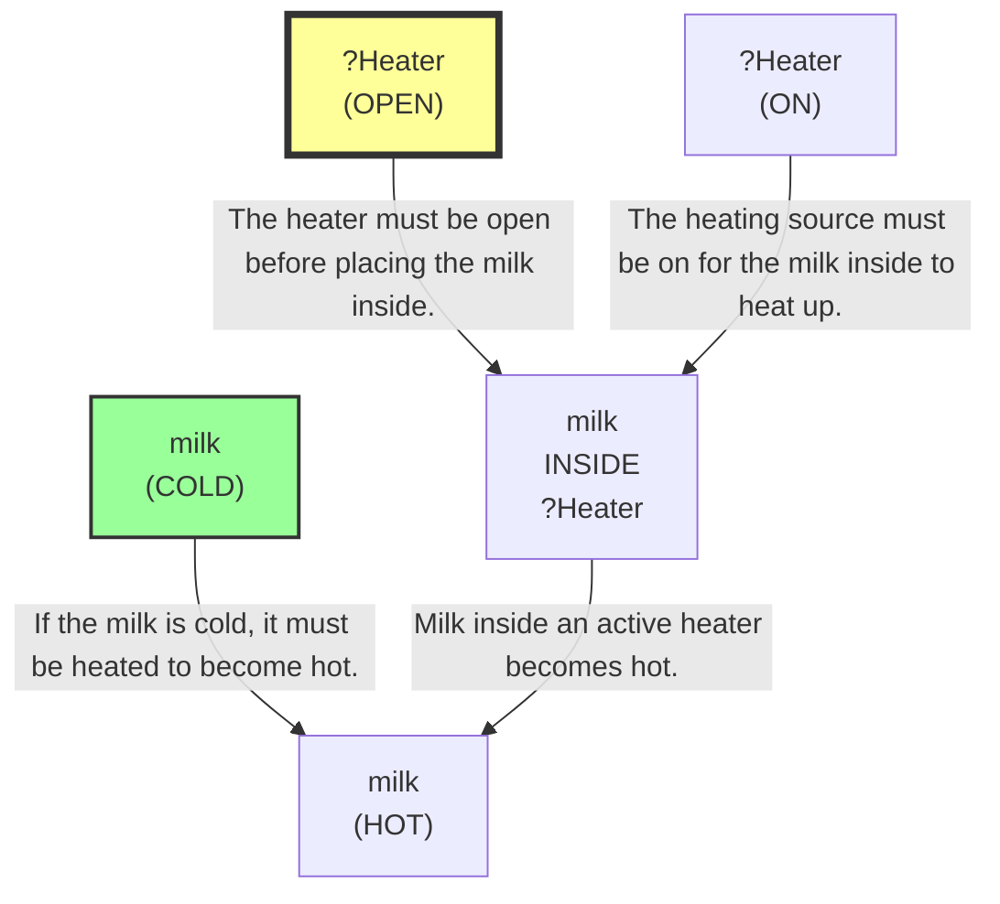
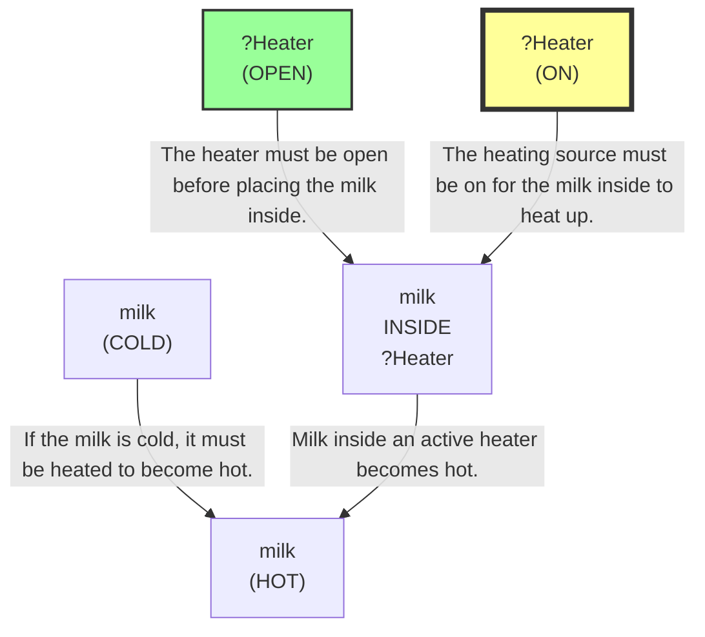
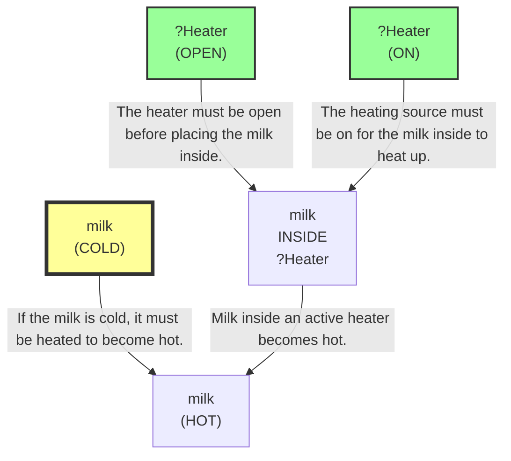
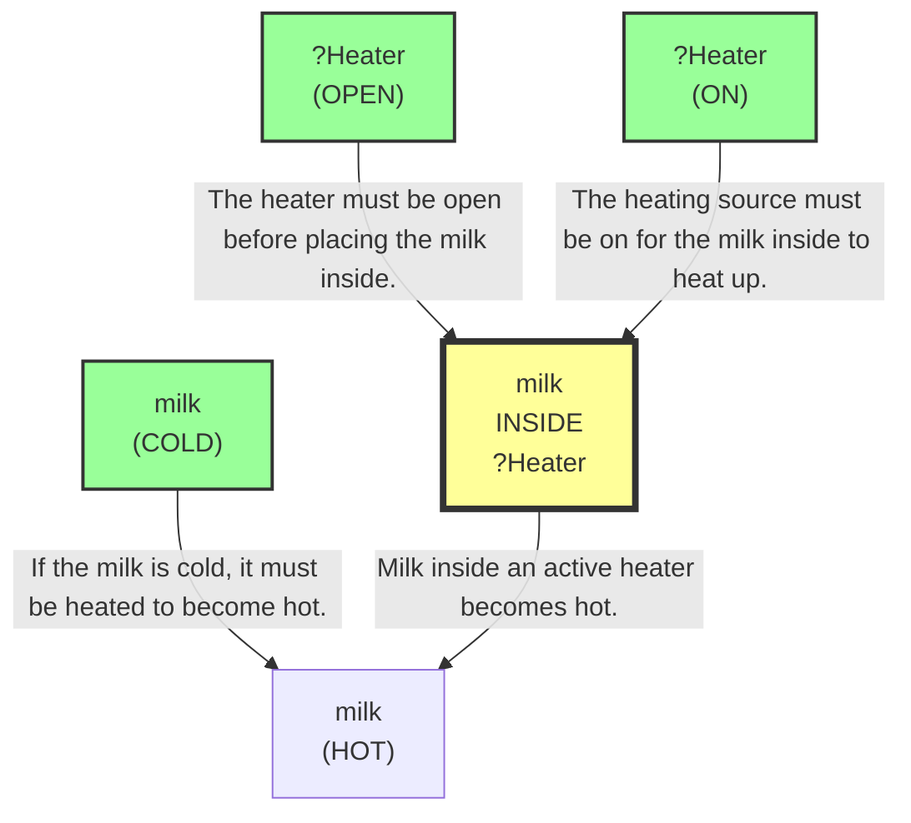
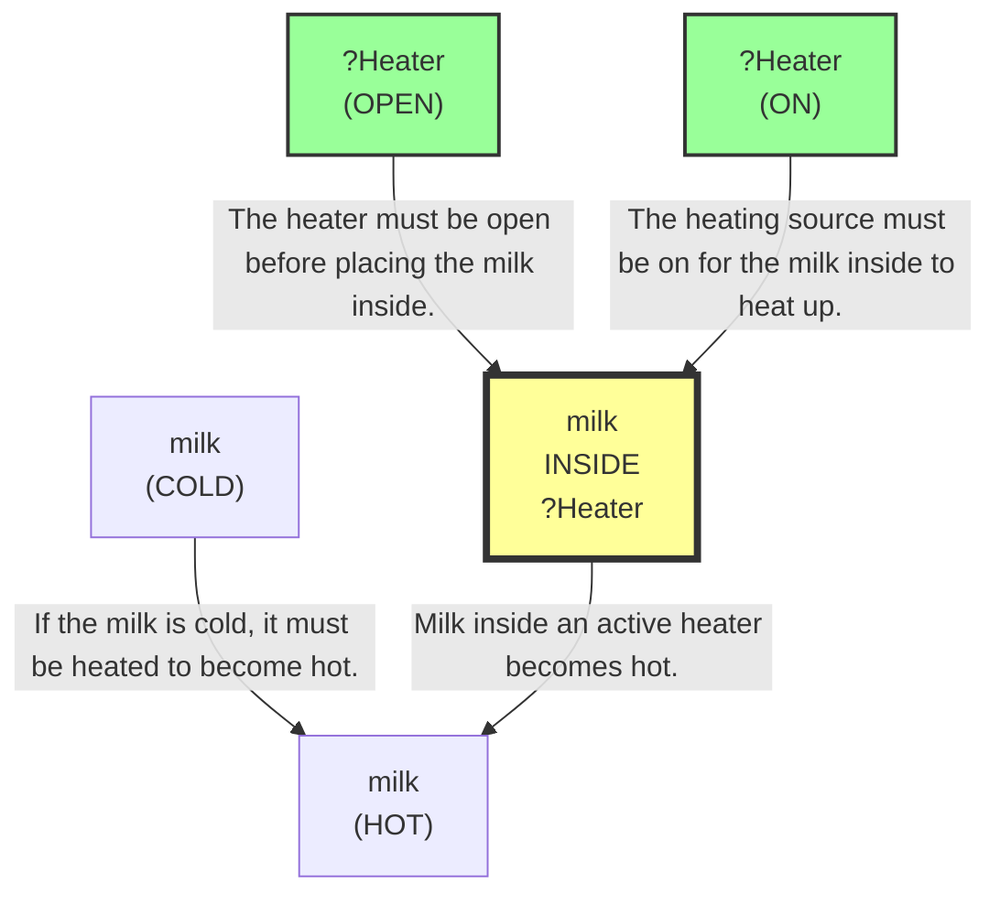

# 🚀 VirtualHome Agent Episode Log


### [GoalReasoner (Module A - Intent)] Output
```json
{
  "is_instruction_obviously_vague": false,
  "clarification_question": null,
  "target_object": "milk",
  "location_hint": null,
  "reasoning_chain": [
    {
      "question": "Why does the user want this object?",
      "answer": "To have the liquid heated if it is currently cold."
    },
    {
      "question": "Why is that important?",
      "answer": "So it is warmed to a more usable or preferable temperature for consumption or use."
    },
    {
      "question": "What fundamental need does this fulfill?",
      "answer": "The user wants to make a beverage or food item warm."
    },
    {
      "question": "Are there any deeper psychological or physical motivations?",
      "answer": "Likely to improve comfort, taste, or readiness for drinking or mixing."
    }
  ],
  "deep_intent": "The user wants to warm a cold beverage or liquid.",
  "acceptable_alternatives_properties": [
    {
      "priority": 1,
      "description": "Other cold beverages or liquids that can be safely heated for drinking, such as water or juice"
    },
    {
      "priority": 2,
      "description": "Dairy or plant-based milk alternatives that serve the same warming function"
    },
    {
      "priority": 3,
      "description": "Ready-to-drink beverages intended to be consumed warm, such as tea or hot cocoa"
    },
    {
      "priority": 4,
      "description": "Other comforting warm drinks that satisfy the need for a heated beverage"
    }
  ]
}
```

### [PerceptionFilter] Output
```json
{
  "reasoning": "Need the target item milk, plus all plausible heating appliances that can serve as the required heater. For warming liquid, the relevant alternatives visible are microwave and stove; a coffeemaker can also heat liquids in some contexts, so it is retained as a backup heater. No other objects are necessary.",
  "selected_classes": [
    "character",
    "milk",
    "stove",
    "microwave",
    "juice",
    "coffeemaker"
  ],
  "raw_class_count": 50
}
```

### [LLMExecutor] Output
```json
{
  "reasoning": "The task is to warm milk. The SDG requires a heater that is open and on, and milk inside it becomes hot. In the current graph, the microwave(171) is a suitable heater because it has CAN_OPEN and HAS_SWITCH, and it is currently CLOSED and OFF. The milk(176) is already identified as COLD, so it matches N1. The correct first step is to walk to the heater before any open/switch actions due to the proximity rule.",
  "satisfied_nodes": [
    "N1"
  ],
  "current_node_focus": "N4",
  "mapped_variables": {
    "?Heater": "microwave(171)"
  },
  "action": "[walk] <microwave> (171)"
}
```

### [RoboStateMultiTaskController] Output
```json
{
  "action": "[walk] <microwave> (171)",
  "active_task_id": "task_1",
  "task_context": {
    "active_task_id": "task_1",
    "pending_task_ids": [],
    "satisfied_task_ids": []
  },
  "source": "llm_executor"
}
```
## Step 0
- **Action**: `[walk] <microwave> (171)`
- **Action Success**: `True`
- **Action Message**: {'0': {'message': 'Success'}}
- **Active Task**: `task_1`
- **Decision Source**: `llm_executor`
- **Task Progress**: T3_without_parameter_binding_M1_05=pending
- **SDG Status**:

- **Observed Items (13)**: stove(163) [OFF,CLOSED], coffeemaker(169) [OFF], microwave(171) [CLOSED,OFF], juice(173), juice(174), milk(177) [CLOSED], milk(176) [COLD,CLOSED], character(1), kitchen(11), livingroom(183), bedroom(241), bathroom(285), bedroom(346)


### [PerceptionFilter] Output
```json
{
  "reasoning": "Reused cached class selection.",
  "selected_classes": [
    "character",
    "milk",
    "stove",
    "microwave",
    "juice",
    "coffeemaker"
  ],
  "raw_class_count": 50
}
```

### [LLMExecutor] Output
```json
{
  "reasoning": "The goal is to heat cold milk. The only milk explicitly in the COLD state is milk(176), so that is the correct instance to pursue. According to the SDG, we need a heater that is open and on before placing the milk inside. We are already near the microwave from the previous step, and the microwave is the best heater candidate because it is a container with HAS_SWITCH and CAN_OPEN. The next required step is to open it before inserting the milk.",
  "satisfied_nodes": [
    "N1"
  ],
  "current_node_focus": "N4",
  "mapped_variables": {
    "?Heater": "microwave(171)"
  },
  "action": "[open] <microwave> (171)"
}
```

### [RoboStateMultiTaskController] Output
```json
{
  "action": "[open] <microwave> (171)",
  "active_task_id": "task_1",
  "task_context": {
    "active_task_id": "task_1",
    "pending_task_ids": [],
    "satisfied_task_ids": []
  },
  "source": "llm_executor"
}
```
## Step 1
- **Action**: `[open] <microwave> (171)`
- **Action Success**: `True`
- **Action Message**: {'0': {'message': 'Success'}}
- **Active Task**: `task_1`
- **Decision Source**: `llm_executor`
- **Task Progress**: T3_without_parameter_binding_M1_05=pending
- **SDG Status**:

- **Observed Items (13)**: stove(163) [OFF,CLOSED], coffeemaker(169) [OFF], microwave(171) [CLOSED,OFF], juice(173), juice(174), milk(177) [CLOSED], milk(176) [COLD,CLOSED], character(1), kitchen(11), livingroom(183), bedroom(241), bathroom(285), bedroom(346)


### [PerceptionFilter] Output
```json
{
  "reasoning": "Reused cached class selection.",
  "selected_classes": [
    "character",
    "milk",
    "stove",
    "microwave",
    "juice",
    "coffeemaker"
  ],
  "raw_class_count": 50
}
```

### [LLMExecutor] Output
```json
{
  "reasoning": "The goal is to heat milk. The SDG requires the milk to be inside an open heater and the heater to be ON. We are already at the microwave and it is open, but it is still OFF. The next required step is to switch on the microwave before placing milk inside. I will bind ?Heater to microwave(171) because it is openable, switchable, and currently adjacent.",
  "satisfied_nodes": [
    "N4"
  ],
  "current_node_focus": "N3",
  "mapped_variables": {
    "?Heater": "microwave(171)"
  },
  "action": "[switchon] <microwave> (171)"
}
```

### [RoboStateMultiTaskController] Output
```json
{
  "action": "[switchon] <microwave> (171)",
  "active_task_id": "task_1",
  "task_context": {
    "active_task_id": "task_1",
    "pending_task_ids": [],
    "satisfied_task_ids": []
  },
  "source": "llm_executor"
}
```
## Step 2
- **Action**: `[switchon] <microwave> (171)`
- **Action Success**: `True`
- **Action Message**: Faked switch operation in Python layer (bypassed Unity failure)
- **Active Task**: `task_1`
- **Decision Source**: `llm_executor`
- **Task Progress**: T3_without_parameter_binding_M1_05=pending
- **SDG Status**:

- **Observed Items (13)**: stove(163) [OFF,CLOSED], coffeemaker(169) [OFF], microwave(171) [OPEN,OFF], juice(173), juice(174), milk(177) [CLOSED], milk(176) [COLD,CLOSED], character(1), kitchen(11), livingroom(183), bedroom(241), bathroom(285), bedroom(346)


### [PerceptionFilter] Output
```json
{
  "reasoning": "Reused cached class selection.",
  "selected_classes": [
    "character",
    "milk",
    "stove",
    "microwave",
    "juice",
    "coffeemaker"
  ],
  "raw_class_count": 50
}
```

### [LLMExecutor] Output
```json
{
  "reasoning": "The microwave is already open and on, so the heater prerequisites N4 and N3 are satisfied. The remaining gap is to place a milk object inside it. The current graph shows two milk instances; milk(176) is explicitly COLD, matching N1 and making it the best binding for the task. Since the last action was switching on the microwave, the next step should be to walk to the cold milk so it can later be grabbed and inserted.",
  "satisfied_nodes": [
    "N3",
    "N4"
  ],
  "current_node_focus": "N1",
  "mapped_variables": {
    "?Heater": "microwave(171)"
  },
  "action": "[walk] <milk> (176)"
}
```

### [RoboStateMultiTaskController] Output
```json
{
  "action": "[walk] <milk> (176)",
  "active_task_id": "task_1",
  "task_context": {
    "active_task_id": "task_1",
    "pending_task_ids": [],
    "satisfied_task_ids": []
  },
  "source": "llm_executor"
}
```
## Step 3
- **Action**: `[walk] <milk> (176)`
- **Action Success**: `True`
- **Action Message**: {'0': {'message': 'Success'}}
- **Active Task**: `task_1`
- **Decision Source**: `llm_executor`
- **Task Progress**: T3_without_parameter_binding_M1_05=pending
- **SDG Status**:

- **Observed Items (13)**: stove(163) [OFF,CLOSED], coffeemaker(169) [OFF], microwave(171) [OPEN,ON], juice(173), juice(174), milk(177) [CLOSED], milk(176) [COLD,CLOSED], character(1), kitchen(11), livingroom(183), bedroom(241), bathroom(285), bedroom(346)


### [PerceptionFilter] Output
```json
{
  "reasoning": "Reused cached class selection.",
  "selected_classes": [
    "character",
    "milk",
    "stove",
    "microwave",
    "juice",
    "coffeemaker"
  ],
  "raw_class_count": 50
}
```

### [LLMExecutor] Output
```json
{
  "reasoning": "The goal is to heat the cold milk by placing it inside an active heater. The microwave(171) already satisfies the heater requirements: it is OPEN and ON. I am currently near milk(176), which is the cold milk instance and is close to the character, so the next required step is to grab it before putting it inside the microwave. No other node beyond N1 is satisfied yet.",
  "satisfied_nodes": [
    "N1",
    "N3",
    "N4"
  ],
  "current_node_focus": "N5",
  "mapped_variables": {
    "?Heater": "microwave(171)"
  },
  "action": "[grab] <milk> (176)"
}
```

### [RoboStateMultiTaskController] Output
```json
{
  "action": "[grab] <milk> (176)",
  "active_task_id": "task_1",
  "task_context": {
    "active_task_id": "task_1",
    "pending_task_ids": [],
    "satisfied_task_ids": []
  },
  "source": "llm_executor"
}
```
## Step 4
- **Action**: `[grab] <milk> (176)`
- **Action Success**: `False`
- **Action Message**: temporary_unavailable: target disappeared; wait or search and retry
- **Active Task**: `task_1`
- **Decision Source**: `llm_executor`
- **Task Progress**: T3_without_parameter_binding_M1_05=pending
- **SDG Status**:

- **Observed Items (13)**: stove(163) [OFF,CLOSED], coffeemaker(169) [OFF], microwave(171) [OPEN,ON], juice(173), juice(174), milk(177) [CLOSED], milk(176) [COLD,CLOSED], character(1), kitchen(11), livingroom(183), bedroom(241), bathroom(285), bedroom(346)


### [PerceptionFilter] Output
```json
{
  "reasoning": "Reused cached class selection.",
  "selected_classes": [
    "character",
    "milk",
    "stove",
    "microwave",
    "juice",
    "coffeemaker"
  ],
  "raw_class_count": 50
}
```

### [LLMExecutor] Output
```json
{
  "reasoning": "The target milk is currently the cold milk(176), and the microwave(171) is already open and on, satisfying the heater prerequisites. The last grab attempt failed because the milk disappeared temporarily, so per the temporary-unavailable rule I should wait in place for it to reappear rather than changing targets or repeating unrelated actions.",
  "satisfied_nodes": [
    "N3",
    "N4"
  ],
  "current_node_focus": "N5",
  "mapped_variables": {
    "?Heater": "microwave(171)"
  },
  "action": "[wait]"
}
```

### [RoboStateMultiTaskController] Output
```json
{
  "action": "[wait]",
  "active_task_id": "task_1",
  "task_context": {
    "active_task_id": "task_1",
    "pending_task_ids": [],
    "satisfied_task_ids": []
  },
  "source": "llm_executor"
}
```
## Step 5
- **Action**: `[wait]`
- **Action Success**: `True`
- **Action Message**: Time passes. You waited for a while.
- **Active Task**: `task_1`
- **Decision Source**: `llm_executor`
- **Task Progress**: T3_without_parameter_binding_M1_05=pending
- **SDG Status**:

- **Observed Items (13)**: stove(163) [OFF,CLOSED], coffeemaker(169) [OFF], microwave(171) [OPEN,ON], juice(173), juice(174), milk(177) [CLOSED], milk(176) [COLD,CLOSED], character(1), kitchen(11), livingroom(183), bedroom(241), bathroom(285), bedroom(346)


### [PerceptionFilter] Output
```json
{
  "reasoning": "Reused cached class selection.",
  "selected_classes": [
    "character",
    "milk",
    "stove",
    "microwave",
    "juice",
    "coffeemaker"
  ],
  "raw_class_count": 50
}
```

### [LLMExecutor] Output
```json
{
  "reasoning": "The goal is to heat milk to HOT by placing it inside an active heater. The microwave(171) is already OPEN and ON, satisfying the heater prerequisites. The earlier grab of milk(176) failed because it temporarily disappeared, but the milk has reappeared in the current graph as milk(176) close to the character and still COLD. The next required step is to move the milk toward the heater process, starting by grabbing the milk now that it is available again. Since the last action was wait, repeating a walk is not necessary if already near the milk according to the graph.",
  "satisfied_nodes": [
    "N1",
    "N3",
    "N4"
  ],
  "current_node_focus": "N5",
  "mapped_variables": {
    "?Heater": "microwave(171)"
  },
  "action": "[grab] <milk> (176)"
}
```

### [RoboStateMultiTaskController] Output
```json
{
  "action": "[grab] <milk> (176)",
  "active_task_id": "task_1",
  "task_context": {
    "active_task_id": "task_1",
    "pending_task_ids": [],
    "satisfied_task_ids": []
  },
  "source": "llm_executor"
}
```
## Step 6
- **Action**: `[grab] <milk> (176)`
- **Action Success**: `False`
- **Action Message**: temporary_unavailable: target is temporarily hidden
- **Active Task**: `task_1`
- **Decision Source**: `llm_executor`
- **Task Progress**: T3_without_parameter_binding_M1_05=pending
- **SDG Status**:

- **Observed Items (13)**: stove(163) [OFF,CLOSED], coffeemaker(169) [OFF], microwave(171) [OPEN,ON], juice(173), juice(174), milk(177) [CLOSED], milk(176) [COLD,CLOSED], character(1), kitchen(11), livingroom(183), bedroom(241), bathroom(285), bedroom(346)


### [PerceptionFilter] Output
```json
{
  "reasoning": "Reused cached class selection.",
  "selected_classes": [
    "character",
    "milk",
    "stove",
    "microwave",
    "juice",
    "coffeemaker"
  ],
  "raw_class_count": 50
}
```

### [LLMExecutor] Output
```json
{
  "reasoning": "The microwave is already open and on, satisfying the heater prerequisites. The needed milk target is currently visible as milk(176) and is marked CLOSE to the character, but the previous grab attempts failed because it was temporarily unavailable/hidden. Per the disappearance strategy, the correct next step is to wait in place for it to reappear rather than switching targets or repeating a walk.",
  "satisfied_nodes": [
    "N3",
    "N4"
  ],
  "current_node_focus": "N5",
  "mapped_variables": {
    "?Heater": "microwave(171)"
  },
  "action": "[wait]"
}
```

### [RoboStateMultiTaskController] Output
```json
{
  "action": "[wait]",
  "active_task_id": "task_1",
  "task_context": {
    "active_task_id": "task_1",
    "pending_task_ids": [],
    "satisfied_task_ids": []
  },
  "source": "llm_executor"
}
```
## Step 7
- **Action**: `[wait]`
- **Action Success**: `True`
- **Action Message**: Time passes. You waited for a while.
- **Active Task**: `task_1`
- **Decision Source**: `llm_executor`
- **Task Progress**: T3_without_parameter_binding_M1_05=pending
- **SDG Status**:

- **Observed Items (13)**: stove(163) [OFF,CLOSED], coffeemaker(169) [OFF], microwave(171) [OPEN,ON], juice(173), juice(174), milk(177) [CLOSED], milk(176) [COLD,CLOSED], character(1), kitchen(11), livingroom(183), bedroom(241), bathroom(285), bedroom(346)


### [PerceptionFilter] Output
```json
{
  "reasoning": "Reused cached class selection.",
  "selected_classes": [
    "character",
    "milk",
    "stove",
    "microwave",
    "juice",
    "coffeemaker"
  ],
  "raw_class_count": 50
}
```

### [LLMExecutor] Output
```json
{
  "reasoning": "Milk(176) is the correct target because it is explicitly COLD and near the character, but the last two grab attempts failed because it is temporarily unavailable/hidden. Per the disappearing-object strategy, I should wait in place for it to reappear rather than switch targets or repeat walking. The microwave is already open and on, so once the milk becomes available again, the next step will be to grab it and place it inside the microwave.",
  "satisfied_nodes": [
    "N3",
    "N4"
  ],
  "current_node_focus": "N5",
  "mapped_variables": {
    "?Heater": "microwave(171)"
  },
  "action": "[wait]"
}
```

### [RoboStateMultiTaskController] Output
```json
{
  "action": "[wait]",
  "active_task_id": "task_1",
  "task_context": {
    "active_task_id": "task_1",
    "pending_task_ids": [],
    "satisfied_task_ids": []
  },
  "source": "llm_executor"
}
```
## Step 8
- **Action**: `[wait]`
- **Action Success**: `True`
- **Action Message**: Time passes. You waited for a while.
- **Active Task**: `task_1`
- **Decision Source**: `llm_executor`
- **Task Progress**: T3_without_parameter_binding_M1_05=pending
- **SDG Status**:

- **Observed Items (13)**: stove(163) [OFF,CLOSED], coffeemaker(169) [OFF], microwave(171) [OPEN,ON], juice(173), juice(174), milk(177) [CLOSED], milk(176) [COLD,CLOSED], character(1), kitchen(11), livingroom(183), bedroom(241), bathroom(285), bedroom(346)


### [PerceptionFilter] Output
```json
{
  "reasoning": "Reused cached class selection.",
  "selected_classes": [
    "character",
    "milk",
    "stove",
    "microwave",
    "juice",
    "coffeemaker"
  ],
  "raw_class_count": 50
}
```

### [LLMExecutor] Output
```json
{
  "reasoning": "The milk target is currently temporarily unavailable, and the previous grab attempts at milk(176) failed because it disappeared/was hidden. The correct autonomous response is to wait in place until it reappears rather than switching targets or repeating the same ineffective grab. The microwave is already open and on, so once the milk returns, the next useful action will be to grab it and place it inside the microwave.",
  "satisfied_nodes": [
    "N3",
    "N4"
  ],
  "current_node_focus": "N5",
  "mapped_variables": {
    "?Heater": "microwave(171)"
  },
  "action": "[wait]"
}
```

### [RoboStateMultiTaskController] Output
```json
{
  "action": "[wait]",
  "active_task_id": "task_1",
  "task_context": {
    "active_task_id": "task_1",
    "pending_task_ids": [],
    "satisfied_task_ids": []
  },
  "source": "llm_executor"
}
```
## Step 9
- **Action**: `[wait]`
- **Action Success**: `True`
- **Action Message**: Time passes. You waited for a while.
- **Active Task**: `task_1`
- **Decision Source**: `llm_executor`
- **Task Progress**: T3_without_parameter_binding_M1_05=pending
- **SDG Status**:

- **Observed Items (13)**: stove(163) [OFF,CLOSED], coffeemaker(169) [OFF], microwave(171) [OPEN,ON], juice(173), juice(174), milk(177) [CLOSED], milk(176) [COLD,CLOSED], character(1), kitchen(11), livingroom(183), bedroom(241), bathroom(285), bedroom(346)


### [PerceptionFilter] Output
```json
{
  "reasoning": "Reused cached class selection.",
  "selected_classes": [
    "character",
    "milk",
    "stove",
    "microwave",
    "juice",
    "coffeemaker"
  ],
  "raw_class_count": 50
}
```

### [LLMExecutor] Output
```json
{
  "reasoning": "Milk(176) is the only instance currently matching the SDG requirement N1: it is cold and nearby. The microwave(171) is already open and on, so the remaining gap is to obtain the milk before placing it inside. Since the last attempts failed because the milk was temporarily unavailable, the correct next step is to retry grabbing the same nearby milk now rather than moving elsewhere.",
  "satisfied_nodes": [
    "N1",
    "N3",
    "N4"
  ],
  "current_node_focus": "N5",
  "mapped_variables": {
    "?Heater": "microwave(171)"
  },
  "action": "[grab] <milk> (176)"
}
```

### [RoboStateMultiTaskController] Output
```json
{
  "action": "[grab] <milk> (176)",
  "active_task_id": "task_1",
  "task_context": {
    "active_task_id": "task_1",
    "pending_task_ids": [],
    "satisfied_task_ids": []
  },
  "source": "llm_executor"
}
```
## Step 10
- **Action**: `[grab] <milk> (176)`
- **Action Success**: `True`
- **Action Message**: {'0': {'message': 'Success'}}
- **Active Task**: `task_1`
- **Decision Source**: `llm_executor`
- **Task Progress**: T3_without_parameter_binding_M1_05=pending
- **SDG Status**:

- **Observed Items (13)**: stove(163) [OFF,CLOSED], coffeemaker(169) [OFF], microwave(171) [OPEN,ON], juice(173), juice(174), milk(177) [CLOSED], milk(176) [COLD,CLOSED], character(1), kitchen(11), livingroom(183), bedroom(241), bathroom(285), bedroom(346)


### [PerceptionFilter] Output
```json
{
  "reasoning": "Reused cached class selection.",
  "selected_classes": [
    "character",
    "milk",
    "stove",
    "microwave",
    "juice",
    "coffeemaker"
  ],
  "raw_class_count": 50
}
```

### [LLMExecutor] Output
```json
{
  "reasoning": "Milk(176) is now successfully held in the right hand, and the microwave(171) is already OPEN and ON, satisfying the heater prerequisites. The remaining gap toward the goal is to place the milk inside the active heater, which requires being near the microwave first. The next atomic step is to walk to the microwave so a subsequent putin can be performed.",
  "satisfied_nodes": [
    "N1",
    "N3",
    "N4"
  ],
  "current_node_focus": "N5",
  "mapped_variables": {
    "?Heater": "microwave(171)"
  },
  "action": "[walk] <microwave> (171)"
}
```

### [RoboStateMultiTaskController] Output
```json
{
  "action": "[walk] <microwave> (171)",
  "active_task_id": "task_1",
  "task_context": {
    "active_task_id": "task_1",
    "pending_task_ids": [],
    "satisfied_task_ids": []
  },
  "source": "llm_executor"
}
```
## Step 11
- **Action**: `[walk] <microwave> (171)`
- **Action Success**: `True`
- **Action Message**: {'0': {'message': 'Success'}}
- **Active Task**: `task_1`
- **Decision Source**: `llm_executor`
- **Task Progress**: T3_without_parameter_binding_M1_05=pending
- **SDG Status**:

- **Observed Items (13)**: stove(163) [OFF,CLOSED], coffeemaker(169) [OFF], microwave(171) [OPEN,ON], juice(173), juice(174), milk(177) [CLOSED], milk(176) [COLD,CLOSED], character(1), kitchen(11), livingroom(183), bedroom(241), bathroom(285), bedroom(346)


### [PerceptionFilter] Output
```json
{
  "reasoning": "Reused cached class selection.",
  "selected_classes": [
    "character",
    "milk",
    "stove",
    "microwave",
    "juice",
    "coffeemaker"
  ],
  "raw_class_count": 50
}
```

### [LLMExecutor] Output
```json
{
  "reasoning": "The active task is to heat milk from COLD to HOT by placing it inside an ON heater. The microwave(171) is already ON and OPEN, and the robot is already CLOSE to it. The current held milk is milk(176), so the next required step is to place it into the open microwave. This satisfies the INSIDE relation prerequisite for heating.",
  "satisfied_nodes": [
    "N1",
    "N3",
    "N4"
  ],
  "current_node_focus": "N5",
  "mapped_variables": {
    "?Heater": "microwave(171)"
  },
  "action": "[putin] <milk> (176) <microwave> (171)"
}
```

### [RoboStateMultiTaskController] Output
```json
{
  "action": "[putin] <milk> (176) <microwave> (171)",
  "active_task_id": "task_1",
  "task_context": {
    "active_task_id": "task_1",
    "pending_task_ids": [],
    "satisfied_task_ids": []
  },
  "source": "llm_executor"
}
```
## Step 12
- **Action**: `[putin] <milk> (176) <microwave> (171)`
- **Action Success**: `True`
- **Action Message**: {'0': {'message': 'Success'}}
- **Active Task**: `task_1`
- **Decision Source**: `llm_executor`
- **Task Progress**: T3_without_parameter_binding_M1_05=done
- **SDG Status**:

- **Observed Items (13)**: stove(163) [OFF,CLOSED], coffeemaker(169) [OFF], microwave(171) [OPEN,ON], juice(173), juice(174), milk(177) [CLOSED], milk(176) [COLD,CLOSED], character(1), kitchen(11), livingroom(183), bedroom(241), bathroom(285), bedroom(346)

