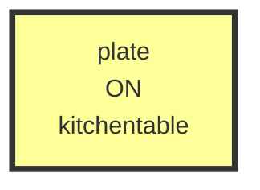

# 🚀 VirtualHome Agent Episode Log


### [GoalReasoner (Module A - Intent)] Output
```json
{
  "is_instruction_obviously_vague": false,
  "clarification_question": null,
  "target_object": "plate",
  "location_hint": "kitchentable",
  "reasoning_chain": [
    {
      "question": "Why does the user want this object?",
      "answer": "To have the used plate placed on the kitchen table."
    },
    {
      "question": "Why is that important?",
      "answer": "To position the item in the desired household location after it has been used."
    },
    {
      "question": "What fundamental need does this fulfill?",
      "answer": "To tidy or organize a used dining item within the home."
    },
    {
      "question": "Are there any deeper psychological or physical motivations?",
      "answer": "It likely supports cleanup, reduces clutter, and keeps the eating area orderly."
    }
  ],
  "deep_intent": "The user wants to organize or tidy a used dining item in the home.",
  "acceptable_alternatives_properties": [
    {
      "priority": 1,
      "description": "Other used dining items that can be placed on the kitchen table, such as a bowl, cup, or utensil."
    },
    {
      "priority": 2,
      "description": "Other used food-service items that belong with meal cleanup, such as a serving dish or tray."
    },
    {
      "priority": 3,
      "description": "Nearby kitchenware that can be moved to the table as part of clearing or organizing the eating area."
    },
    {
      "priority": 4,
      "description": "Other household items from the meal area that can be repositioned to reduce clutter."
    }
  ]
}
```

### [PerceptionFilter] Output
```json
{
  "reasoning": "The goal and SDG require the plate and the kitchen table as the target location. No extra tools are needed because the task is only to place/keep the used plate on the table.",
  "selected_classes": [
    "plate",
    "character",
    "kitchentable"
  ],
  "raw_class_count": 50
}
```

### [LLMExecutor] Output
```json
{
  "reasoning": "The goal is to have a plate on the kitchen table. In the current graph, plate(75) is already on kitchentable(135), and plate(76) is also on kitchentable(131). Since the SDG only requires a plate on a kitchen table, the node is already satisfied by the current state. No physical action is needed.",
  "satisfied_nodes": [
    "N1"
  ],
  "current_node_focus": "N1",
  "mapped_variables": {
    "?TargetPlate": "plate(75)",
    "?Table": "kitchentable(135)"
  },
  "action": "[wait]"
}
```

### [RoboStateMultiTaskController] Output
```json
{
  "action": "[wait]",
  "active_task_id": "task_1",
  "task_context": {
    "active_task_id": "task_1",
    "pending_task_ids": [],
    "satisfied_task_ids": []
  },
  "source": "llm_executor"
}
```
## Step 0
- **Action**: `[wait]`
- **Action Success**: `True`
- **Action Message**: Time passes. You waited for a while.
- **Active Task**: `task_1`
- **Decision Source**: `llm_executor`
- **Task Progress**: T3_without_parameter_binding_M4_18=pending
- **SDG Status**:

- **Observed Items (17)**: plate(75), plate(76), plate(83), plate(84), plate(91), plate(103), plate(104), kitchentable(131), kitchentable(135), character(1), plate(67), plate(68), kitchen(11), livingroom(183), bedroom(241)...


### [PerceptionFilter] Output
```json
{
  "reasoning": "Reused cached class selection.",
  "selected_classes": [
    "plate",
    "character",
    "kitchentable"
  ],
  "raw_class_count": 50
}
```

### [LLMExecutor] Output
```json
{
  "reasoning": "The SDG goal is already satisfied in the current graph: plate(75) is ON kitchentable(135), and plate(84) is also ON kitchentable(135). Since the active task only requires a plate on the kitchen table, no further physical action is needed.",
  "satisfied_nodes": [
    "N1"
  ],
  "current_node_focus": "N1",
  "mapped_variables": {},
  "action": "[wait]"
}
```

### [RoboStateMultiTaskController] Output
```json
{
  "action": "[wait]",
  "active_task_id": "task_1",
  "task_context": {
    "active_task_id": "task_1",
    "pending_task_ids": [],
    "satisfied_task_ids": []
  },
  "source": "llm_executor"
}
```
## Step 1
- **Action**: `[wait]`
- **Action Success**: `True`
- **Action Message**: Time passes. You waited for a while.
- **Active Task**: `task_1`
- **Decision Source**: `llm_executor`
- **Task Progress**: T3_without_parameter_binding_M4_18=pending
- **SDG Status**:

- **Observed Items (17)**: plate(75), plate(76), plate(83), plate(84), plate(91), plate(103), plate(104), kitchentable(131), kitchentable(135), character(1), plate(67), plate(68), kitchen(11), livingroom(183), bedroom(241)...


### [PerceptionFilter] Output
```json
{
  "reasoning": "Reused cached class selection.",
  "selected_classes": [
    "plate",
    "character",
    "kitchentable"
  ],
  "raw_class_count": 50
}
```

### [LLMExecutor] Output
```json
{
  "reasoning": "The SDG requires the plate to be ON a kitchentable. The current graph already shows multiple plates on kitchen tables, and plate(75) is both on kitchentable(135) and close to the character, so the goal relation is already satisfied by this object-instance. No further physical action is needed for the active task; however, since the system requests a single next atomic action, the safest no-op is to wait rather than risk manipulating another plate unnecessarily.",
  "satisfied_nodes": [
    "N1"
  ],
  "current_node_focus": "N1",
  "mapped_variables": {
    "?Table": "kitchentable(135)"
  },
  "action": "[wait]"
}
```

### [RoboStateMultiTaskController] Output
```json
{
  "action": "[wait]",
  "active_task_id": "task_1",
  "task_context": {
    "active_task_id": "task_1",
    "pending_task_ids": [],
    "satisfied_task_ids": []
  },
  "source": "llm_executor"
}
```
## Step 2
- **Action**: `[wait]`
- **Action Success**: `True`
- **Action Message**: Time passes. You waited for a while.
- **Active Task**: `task_1`
- **Decision Source**: `llm_executor`
- **Task Progress**: T3_without_parameter_binding_M4_18=pending
- **SDG Status**:

- **Observed Items (17)**: plate(75), plate(76), plate(83), plate(84), plate(91), plate(103), plate(104), kitchentable(131), kitchentable(135), character(1), plate(67), plate(68), kitchen(11), livingroom(183), bedroom(241)...


### [PerceptionFilter] Output
```json
{
  "reasoning": "Reused cached class selection.",
  "selected_classes": [
    "plate",
    "character",
    "kitchentable"
  ],
  "raw_class_count": 50
}
```

### [LLMExecutor] Output
```json
{
  "reasoning": "The SDG requires a plate to be ON a kitchen table. In the current graph, plate(75) is already on kitchentable(135) and is close to the character, so the goal node is already satisfied. No further physical action is needed; to avoid unnecessary movement or manipulation, I will wait.",
  "satisfied_nodes": [
    "N1"
  ],
  "current_node_focus": "N1",
  "mapped_variables": {},
  "action": "[wait]"
}
```

### [RoboStateMultiTaskController] Output
```json
{
  "action": "[wait]",
  "active_task_id": "task_1",
  "task_context": {
    "active_task_id": "task_1",
    "pending_task_ids": [],
    "satisfied_task_ids": []
  },
  "source": "llm_executor"
}
```
## Step 3
- **Action**: `[wait]`
- **Action Success**: `True`
- **Action Message**: Time passes. You waited for a while.
- **Active Task**: `task_1`
- **Decision Source**: `llm_executor`
- **Task Progress**: T3_without_parameter_binding_M4_18=pending
- **SDG Status**:

- **Observed Items (17)**: plate(75), plate(76), plate(83), plate(84), plate(91), plate(103), plate(104), kitchentable(131), kitchentable(135), character(1), plate(67), plate(68), kitchen(11), livingroom(183), bedroom(241)...


### [PerceptionFilter] Output
```json
{
  "reasoning": "Reused cached class selection.",
  "selected_classes": [
    "plate",
    "character",
    "kitchentable"
  ],
  "raw_class_count": 50
}
```

### [LLMExecutor] Output
```json
{
  "reasoning": "The SDG goal is already satisfied in the current filtered graph: plate(75) is ON kitchentable(135), and the same object is close to the character. Since the task is to ensure a plate is on the kitchen table, no further action is needed for the active task.",
  "satisfied_nodes": [
    "N1"
  ],
  "current_node_focus": "N1",
  "mapped_variables": {
    "?TargetPlate": "plate(75)",
    "?Table": "kitchentable(135)"
  },
  "action": "[wait]"
}
```

### [RoboStateMultiTaskController] Output
```json
{
  "action": "[wait]",
  "active_task_id": "task_1",
  "task_context": {
    "active_task_id": "task_1",
    "pending_task_ids": [],
    "satisfied_task_ids": []
  },
  "source": "llm_executor"
}
```
