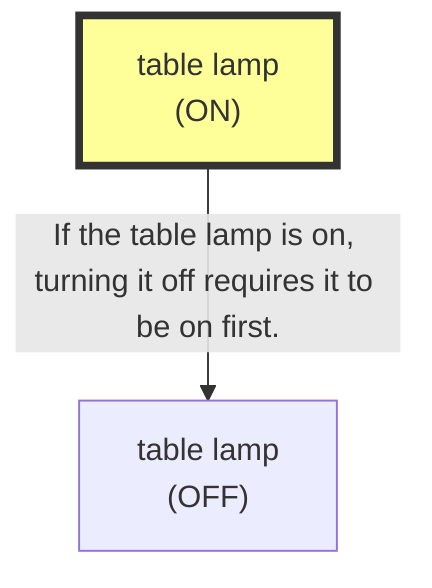
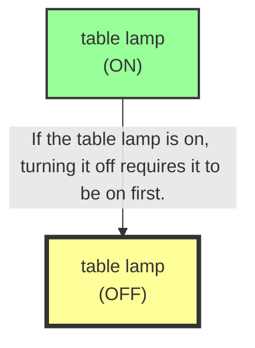

# 🚀 VirtualHome Agent Episode Log


### [GoalReasoner (Module A - Intent)] Output
```json
{
  "is_instruction_obviously_vague": false,
  "clarification_question": null,
  "target_object": "table lamp",
  "location_hint": null,
  "reasoning_chain": [
    {
      "question": "Why does the user want this object?",
      "answer": "To control the lamp's state based on whether it is currently on."
    },
    {
      "question": "Why is that important?",
      "answer": "To ensure the lamp is turned off when it is illuminated, likely to reduce unwanted light or save energy."
    },
    {
      "question": "What fundamental need does this fulfill?",
      "answer": "The need to regulate lighting in the environment."
    },
    {
      "question": "Are there any deeper psychological or physical motivations?",
      "answer": "The user may want a more comfortable, darker, or more energy-efficient indoor space."
    }
  ],
  "deep_intent": "The user wants to disable unnecessary lighting in the room.",
  "acceptable_alternatives_properties": [
    {
      "priority": 1,
      "description": "Other indoor light sources that can be turned off, such as a floor lamp, desk lamp, or ceiling light."
    },
    {
      "priority": 2,
      "description": "Any nearby lighting fixture with a similar on/off control, including wall sconces or accent lights."
    },
    {
      "priority": 3,
      "description": "Other sources of artificial light in the room that can be switched off to reduce brightness."
    },
    {
      "priority": 4,
      "description": "If no lamp is available, reducing light by closing curtains or blinds to make the room darker."
    }
  ]
}
```

### [PerceptionFilter] Output
```json
{
  "reasoning": "The goal is to turn off the target light source. The SDG requires the table lamp to be in the ON state before it can be turned OFF, so the target object must be included. Because the intent allows alternative indoor lights or light controls, I also keep other relevant lighting-related classes and the nearby control used to switch lights off. Curtains are retained as a fallback for reducing light if needed.",
  "selected_classes": [
    "curtains",
    "character",
    "ceiling",
    "floor",
    "lightswitch",
    "wall",
    "ceilinglamp",
    "tablelamp",
    "desk"
  ],
  "raw_class_count": 33
}
```

### [LLMExecutor] Output
```json
{
  "reasoning": "The goal is to make a table lamp OFF. In the current graph, both tablelamp(102) and tablelamp(103) are ON and have HAS_SWITCH, so either could satisfy the target if the task refers to the room's table lamp. Since there are two matching instances, I should act on one exact instance. No proximity is guaranteed yet, and to switch it off I must first walk to it. I will target tablelamp(102) as the first valid candidate and move to it before attempting the switch-off in the next step.",
  "satisfied_nodes": [],
  "current_node_focus": "N2",
  "mapped_variables": {
    "?Lamp": "tablelamp(102)"
  },
  "action": "[walk] <tablelamp> (102)"
}
```

### [RoboStateMultiTaskController] Output
```json
{
  "action": "[walk] <tablelamp> (102)",
  "active_task_id": "task_1",
  "task_context": {
    "active_task_id": "task_1",
    "pending_task_ids": [],
    "satisfied_task_ids": []
  },
  "source": "llm_executor"
}
```
## Step 0
- **Action**: `[walk] <tablelamp> (102)`
- **Action Success**: `True`
- **Action Message**: {'0': {'message': 'Success'}}
- **Active Task**: `task_1`
- **Decision Source**: `llm_executor`
- **Task Progress**: T3_without_path_merging_G1_04=pending
- **SDG Status**:

- **Observed Items (39)**: floor(74), floor(75), floor(76), floor(77), floor(78), floor(79), floor(80), floor(81), floor(82), wall(83), wall(84), wall(85), wall(86), wall(87), wall(88)...


### [PerceptionFilter] Output
```json
{
  "reasoning": "Reused cached class selection.",
  "selected_classes": [
    "curtains",
    "character",
    "ceiling",
    "floor",
    "lightswitch",
    "wall",
    "ceilinglamp",
    "tablelamp",
    "desk"
  ],
  "raw_class_count": 33
}
```

### [LLMExecutor] Output
```json
{
  "reasoning": "The target table lamp is already identified and currently ON. We are already close to tablelamp(102), so the next atomic step is to turn it off directly. This satisfies the active SDG progress from N2 (ON) toward N1 (OFF).",
  "satisfied_nodes": [
    "N2"
  ],
  "current_node_focus": "N1",
  "mapped_variables": {},
  "action": "[switchoff] <tablelamp> (102)"
}
```

### [RoboStateMultiTaskController] Output
```json
{
  "action": "[switchoff] <tablelamp> (102)",
  "active_task_id": "task_1",
  "task_context": {
    "active_task_id": "task_1",
    "pending_task_ids": [],
    "satisfied_task_ids": []
  },
  "source": "llm_executor"
}
```
## Step 1
- **Action**: `[switchoff] <tablelamp> (102)`
- **Action Success**: `True`
- **Action Message**: Faked switch operation in Python layer (bypassed Unity failure)
- **Active Task**: `task_1`
- **Decision Source**: `llm_executor`
- **Task Progress**: T3_without_path_merging_G1_04=done
- **SDG Status**:

- **Observed Items (39)**: floor(74), floor(75), floor(76), floor(77), floor(78), floor(79), floor(80), floor(81), floor(82), wall(83), wall(84), wall(85), wall(86), wall(87), wall(88)...

