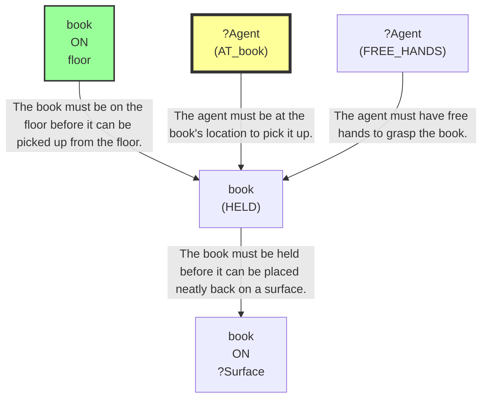
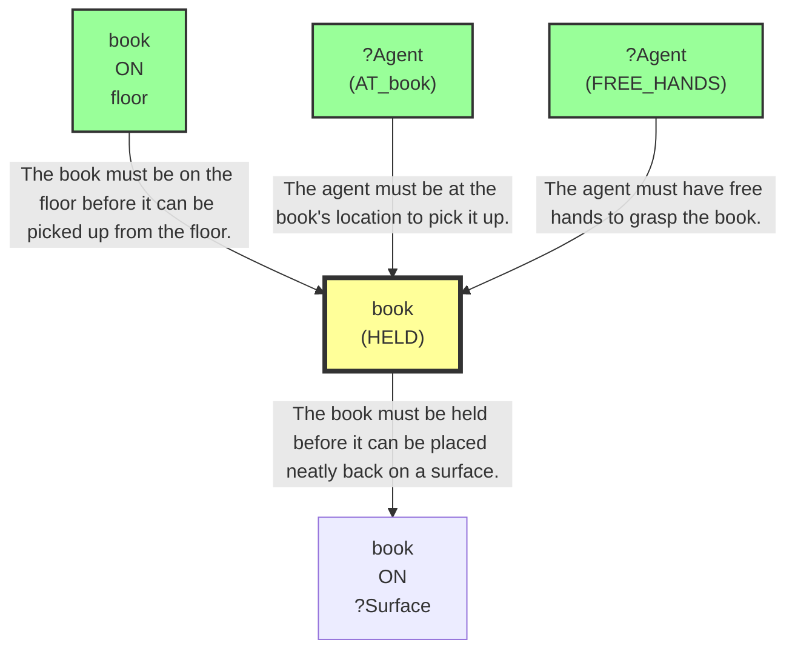
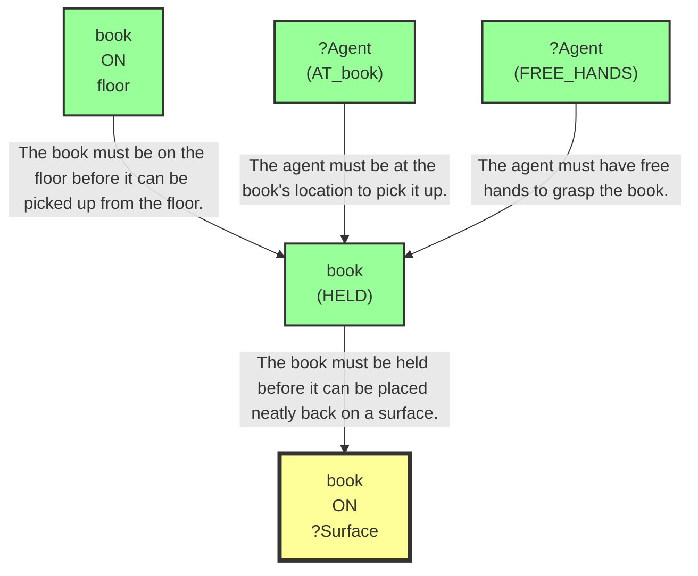
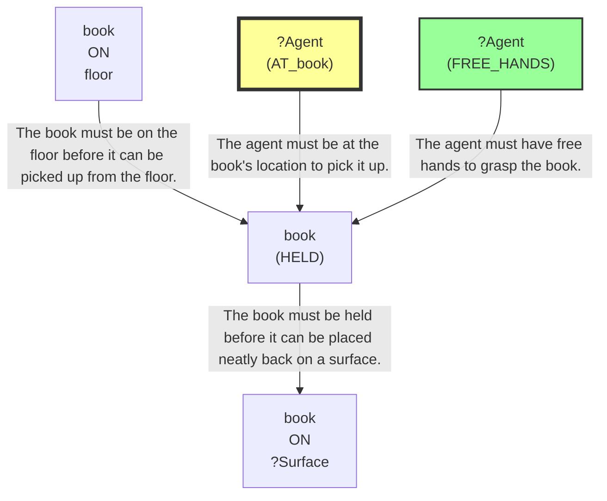
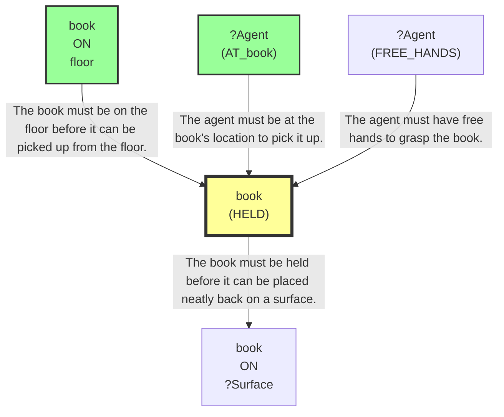
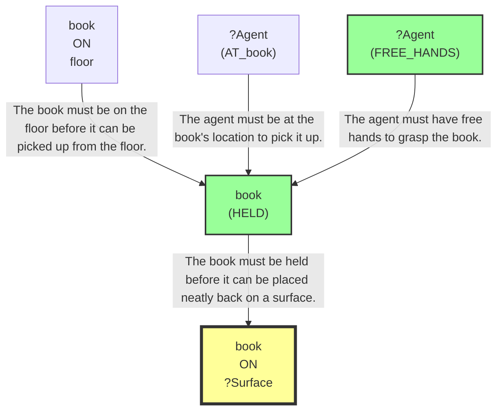
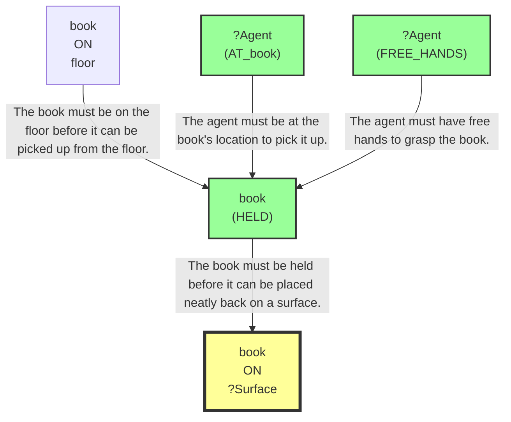
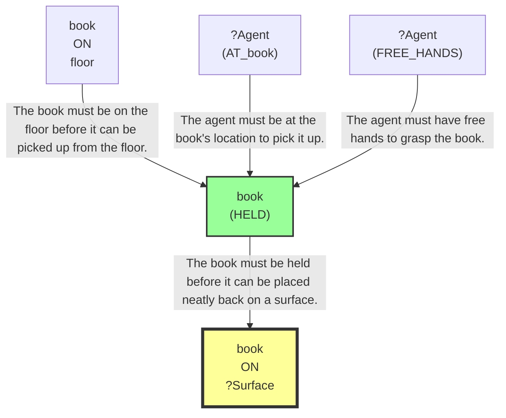
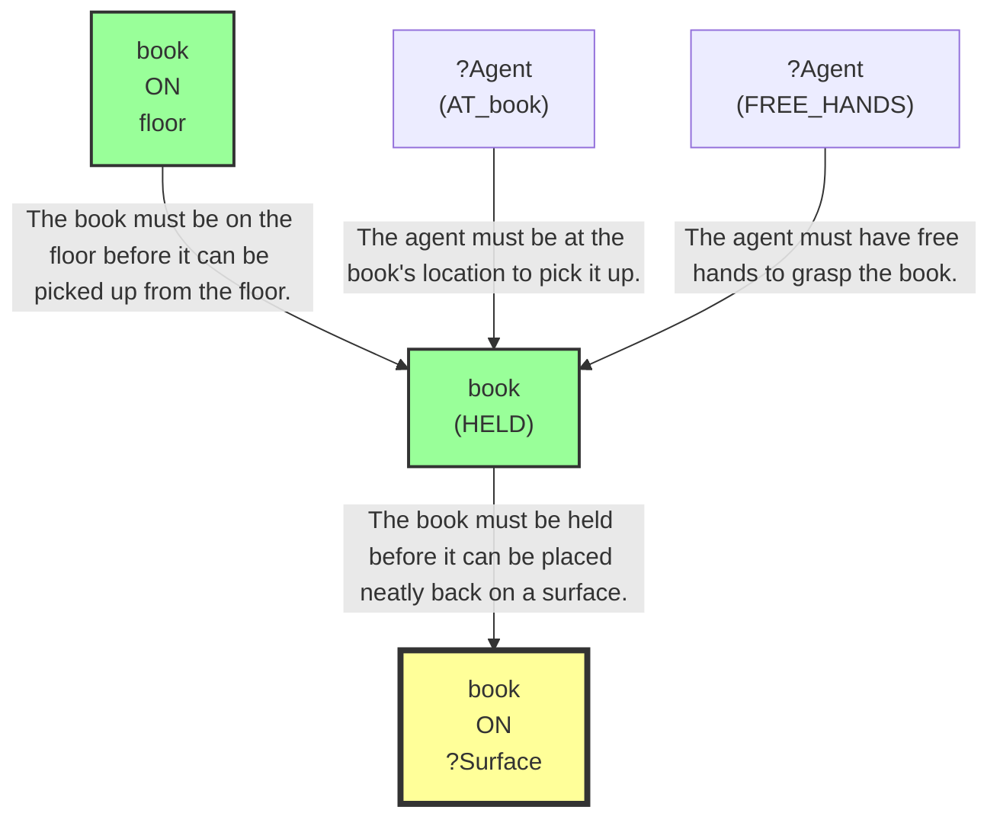

# 🚀 VirtualHome Agent Episode Log


### [GoalReasoner (Module A - Intent)] Output
```json
{
  "is_instruction_obviously_vague": false,
  "clarification_question": null,
  "target_object": "book",
  "location_hint": "floor",
  "reasoning_chain": [
    {
      "question": "Why does the user want this object handled?",
      "answer": "Because it has fallen onto the floor and needs to be recovered."
    },
    {
      "question": "Why is that important?",
      "answer": "To restore the item to its proper place and keep the area orderly."
    },
    {
      "question": "What fundamental need does this fulfill?",
      "answer": "The user wants to maintain organization and prevent the item from remaining out of place on the floor."
    },
    {
      "question": "Are there any deeper psychological or physical motivations?",
      "answer": "It may be to avoid clutter, reduce the chance of damage, and keep the environment neat and functional."
    }
  ],
  "deep_intent": "The user wants to restore an item to its proper place and maintain order in the environment.",
  "acceptable_alternatives_properties": [
    {
      "priority": 1,
      "description": "Other similar loose household items that have fallen out of place and should be put back where they belong"
    },
    {
      "priority": 2,
      "description": "Paper items, notebooks, or other lightweight personal belongings that need to be picked up and returned neatly"
    },
    {
      "priority": 3,
      "description": "Small everyday objects or reading materials that can be tidied and stored back in an orderly way"
    },
    {
      "priority": 4,
      "description": "Any misplaced household item that can be safely retrieved from the floor to reduce clutter"
    }
  ]
}
```

### [PerceptionFilter] Output
```json
{
  "reasoning": "The goal is to retrieve a fallen book from the floor and place it back on a surface. So we need the target object book, the floor location, and a plausible surface to restore it to; from the visible items, bookshelf, desk, coffeetable, and box are relevant possible placement surfaces/receptacles. Free hands are part of the SDG but not an object class, so they are not included.",
  "selected_classes": [
    "book",
    "box",
    "character",
    "floor",
    "paper",
    "coffeetable",
    "bookshelf",
    "desk"
  ],
  "raw_class_count": 41
}
```

### [LLMExecutor] Output
```json
{
  "reasoning": "The SDG requires the book to be on the floor, then held, then placed on a surface. The current graph shows three candidate books on the floor: book(190), book(191), and book(268). Since no prior actions exist and the task is to recover a fallen book, I need to first move to one specific book before grabbing it. I will choose book(190) as the target instance and walk to it to satisfy the AT_book prerequisite before attempting pickup.",
  "satisfied_nodes": [
    "N1"
  ],
  "current_node_focus": "N4",
  "mapped_variables": {
    "?Surface": "coffeetable(371)"
  },
  "action": "[walk] <book> (190)"
}
```

### [RoboStateMultiTaskController] Output
```json
{
  "action": "[walk] <book> (190)",
  "active_task_id": "task_1",
  "task_context": {
    "active_task_id": "task_1",
    "pending_task_ids": [],
    "satisfied_task_ids": []
  },
  "source": "llm_executor"
}
```
## Step 0
- **Action**: `[walk] <book> (190)`
- **Action Success**: `True`
- **Action Message**: {'0': {'message': 'Success'}}
- **Active Task**: `task_1`
- **Decision Source**: `llm_executor`
- **Task Progress**: T3_without_path_merging_G2_09=pending
- **SDG Status**:

- **Observed Items (22)**: floor(336), floor(337), floor(338), floor(339), floor(340), floor(341), floor(342), floor(343), floor(344), bookshelf(370), coffeetable(371), desk(373) [CLOSED], box(435) [CLOSED], paper(451), book(190) [CLOSED]...


### [PerceptionFilter] Output
```json
{
  "reasoning": "Reused cached class selection.",
  "selected_classes": [
    "book",
    "box",
    "character",
    "floor",
    "paper",
    "coffeetable",
    "bookshelf",
    "desk"
  ],
  "raw_class_count": 41
}
```

### [LLMExecutor] Output
```json
{
  "reasoning": "The book is already at the floor location and I am close to it, so the next step toward satisfying N1->N2 is to pick it up. I have free hands per the graph, and the target book instance 190 matches the required object on the floor.",
  "satisfied_nodes": [
    "N1",
    "N4",
    "N5"
  ],
  "current_node_focus": "N2",
  "mapped_variables": {},
  "action": "[grab] <book> (190)"
}
```

### [RoboStateMultiTaskController] Output
```json
{
  "action": "[grab] <book> (190)",
  "active_task_id": "task_1",
  "task_context": {
    "active_task_id": "task_1",
    "pending_task_ids": [],
    "satisfied_task_ids": []
  },
  "source": "llm_executor"
}
```
## Step 1
- **Action**: `[grab] <book> (190)`
- **Action Success**: `True`
- **Action Message**: {'0': {'message': 'Success'}}
- **Active Task**: `task_1`
- **Decision Source**: `llm_executor`
- **Task Progress**: T3_without_path_merging_G2_09=pending
- **SDG Status**:

- **Observed Items (22)**: floor(336), floor(337), floor(338), floor(339), floor(340), floor(341), floor(342), floor(343), floor(344), bookshelf(370), coffeetable(371), desk(373) [CLOSED], box(435) [CLOSED], paper(451), book(190) [CLOSED]...


### [PerceptionFilter] Output
```json
{
  "reasoning": "Reused cached class selection.",
  "selected_classes": [
    "book",
    "box",
    "character",
    "floor",
    "paper",
    "coffeetable",
    "bookshelf",
    "desk"
  ],
  "raw_class_count": 41
}
```

### [LLMExecutor] Output
```json
{
  "reasoning": "The book target is already in hand according to the current graph: character(1) holds book(190). N1 is satisfied because book(190) is on the floor, and N4/N5 are satisfied because the agent is close to the book and has free hands status resolved by the successful grab. The next required SDG step is to place the held book onto a surface, so I should move toward a suitable flat surface before putting it down. The most accessible nearby flat surface is the coffeetable(371), which is a valid surface for putback and is in the living room.",
  "satisfied_nodes": [
    "N1",
    "N2",
    "N4",
    "N5"
  ],
  "current_node_focus": "N3",
  "mapped_variables": {
    "?Surface": "coffeetable(371)"
  },
  "action": "[walk] <coffeetable> (371)"
}
```

### [RoboStateMultiTaskController] Output
```json
{
  "action": "[walk] <coffeetable> (371)",
  "active_task_id": "task_1",
  "task_context": {
    "active_task_id": "task_1",
    "pending_task_ids": [],
    "satisfied_task_ids": []
  },
  "source": "llm_executor"
}
```
## Step 2
- **Action**: `[walk] <coffeetable> (371)`
- **Action Success**: `True`
- **Action Message**: {'0': {'message': 'Success'}}
- **Active Task**: `task_1`
- **Decision Source**: `llm_executor`
- **Task Progress**: T3_without_path_merging_G2_09=pending
- **SDG Status**:

- **Observed Items (22)**: floor(336), floor(337), floor(338), floor(339), floor(340), floor(341), floor(342), floor(343), floor(344), bookshelf(370), coffeetable(371), desk(373) [CLOSED], box(435) [CLOSED], paper(451), book(190) [CLOSED]...


### [PerceptionFilter] Output
```json
{
  "reasoning": "Reused cached class selection.",
  "selected_classes": [
    "book",
    "box",
    "character",
    "floor",
    "paper",
    "coffeetable",
    "bookshelf",
    "desk"
  ],
  "raw_class_count": 41
}
```

### [LLMExecutor] Output
```json
{
  "reasoning": "The active goal is to recover a book from the floor and place it neatly on a surface. The book must be held before it can be put down. Current graph shows the agent is already holding book(190) in the right hand, and is close to coffeetable(371), which is a valid flat surface. So the next step is to place the held book onto the coffee table. N2 (book held) is satisfied; N1 is no longer the focus, and N4/N5 are already effectively satisfied by the current state.",
  "satisfied_nodes": [
    "N1",
    "N2",
    "N4",
    "N5"
  ],
  "current_node_focus": "N3",
  "mapped_variables": {
    "?Surface": "coffeetable(371)"
  },
  "action": "[putback] <book> (190) <coffeetable> (371)"
}
```

### [RoboStateMultiTaskController] Output
```json
{
  "action": "[putback] <book> (190) <coffeetable> (371)",
  "active_task_id": "task_1",
  "task_context": {
    "active_task_id": "task_1",
    "pending_task_ids": [],
    "satisfied_task_ids": []
  },
  "source": "llm_executor"
}
```
## Step 3
- **Action**: `[putback] <book> (190) <coffeetable> (371)`
- **Action Success**: `True`
- **Action Message**: {'0': {'message': 'Success'}}
- **Active Task**: `task_1`
- **Decision Source**: `llm_executor`
- **Task Progress**: T3_without_path_merging_G2_09=pending
- **SDG Status**:

- **Observed Items (22)**: floor(336), floor(337), floor(338), floor(339), floor(340), floor(341), floor(342), floor(343), floor(344), bookshelf(370), coffeetable(371), desk(373) [CLOSED], box(435) [CLOSED], paper(451), book(190) [CLOSED]...


### [PerceptionFilter] Output
```json
{
  "reasoning": "Reused cached class selection.",
  "selected_classes": [
    "book",
    "box",
    "character",
    "floor",
    "paper",
    "coffeetable",
    "bookshelf",
    "desk"
  ],
  "raw_class_count": 41
}
```

### [LLMExecutor] Output
```json
{
  "reasoning": "The active task is to recover the book that was on the floor and return it neatly to a surface. The previous action sequence already picked up book(190) from the floor and placed it on the coffeetable, which satisfies the intent for the target book and completes the SDG chain for the active task. No further action is needed, and the prompt requests a single next action; to avoid redundant movement or interfering with other objects, I will wait.",
  "satisfied_nodes": [
    "N1",
    "N2",
    "N3",
    "N4",
    "N5"
  ],
  "current_node_focus": "N3",
  "mapped_variables": {},
  "action": "[wait]"
}
```

### [RoboStateMultiTaskController] Output
```json
{
  "action": "[wait]",
  "active_task_id": "task_1",
  "task_context": {
    "active_task_id": "task_1",
    "pending_task_ids": [],
    "satisfied_task_ids": []
  },
  "source": "llm_executor"
}
```
## Step 4
- **Action**: `[wait]`
- **Action Success**: `True`
- **Action Message**: Time passes. You waited for a while.
- **Active Task**: `task_1`
- **Decision Source**: `llm_executor`
- **Task Progress**: T3_without_path_merging_G2_09=pending
- **SDG Status**:

- **Observed Items (22)**: floor(336), floor(337), floor(338), floor(339), floor(340), floor(341), floor(342), floor(343), floor(344), bookshelf(370), coffeetable(371), desk(373) [CLOSED], box(435) [CLOSED], paper(451), book(190) [CLOSED]...


### [PerceptionFilter] Output
```json
{
  "reasoning": "Reused cached class selection.",
  "selected_classes": [
    "book",
    "box",
    "character",
    "floor",
    "paper",
    "coffeetable",
    "bookshelf",
    "desk"
  ],
  "raw_class_count": 41
}
```

### [LLMExecutor] Output
```json
{
  "reasoning": "The previously handled book(190) was already put back onto the coffeetable, so it is no longer satisfying the target relation 'book ON floor'. The current graph shows two other candidate books on the floor: book(191) and book(268). To make progress on the active task, I should target a floor book and recover it by approaching it first. Since grab requires proximity and the task is to pick up a book from the floor, the next atomic step is to walk to the nearest valid floor book.",
  "satisfied_nodes": [
    "N5"
  ],
  "current_node_focus": "N4",
  "mapped_variables": {
    "?Surface": "coffeetable(371)"
  },
  "action": "[walk] <book> (191)"
}
```

### [RoboStateMultiTaskController] Output
```json
{
  "action": "[walk] <book> (191)",
  "active_task_id": "task_1",
  "task_context": {
    "active_task_id": "task_1",
    "pending_task_ids": [],
    "satisfied_task_ids": []
  },
  "source": "llm_executor"
}
```
## Step 5
- **Action**: `[walk] <book> (191)`
- **Action Success**: `True`
- **Action Message**: {'0': {'message': 'Success'}}
- **Active Task**: `task_1`
- **Decision Source**: `llm_executor`
- **Task Progress**: T3_without_path_merging_G2_09=pending
- **SDG Status**:

- **Observed Items (22)**: floor(336), floor(337), floor(338), floor(339), floor(340), floor(341), floor(342), floor(343), floor(344), bookshelf(370), coffeetable(371), desk(373) [CLOSED], box(435) [CLOSED], paper(451), book(190) [CLOSED]...


### [PerceptionFilter] Output
```json
{
  "reasoning": "Reused cached class selection.",
  "selected_classes": [
    "book",
    "box",
    "character",
    "floor",
    "paper",
    "coffeetable",
    "bookshelf",
    "desk"
  ],
  "raw_class_count": 41
}
```

### [LLMExecutor] Output
```json
{
  "reasoning": "The current target is the book on the floor. The latest successful step was walking to book(191), so N4 (agent at the book) is satisfied for that object, and the remaining required progression is to pick it up. Hands are presumably free because no held objects are shown in the current graph. The exact book instance to bind is book(191), since it is explicitly on the floor and close to the agent.",
  "satisfied_nodes": [
    "N1",
    "N4",
    "N5"
  ],
  "current_node_focus": "N2",
  "mapped_variables": {
    "?Book": "book(191)"
  },
  "action": "[grab] <book> (191)"
}
```

### [RoboStateMultiTaskController] Output
```json
{
  "action": "[grab] <book> (191)",
  "active_task_id": "task_1",
  "task_context": {
    "active_task_id": "task_1",
    "pending_task_ids": [],
    "satisfied_task_ids": []
  },
  "source": "llm_executor"
}
```
## Step 6
- **Action**: `[grab] <book> (191)`
- **Action Success**: `True`
- **Action Message**: {'0': {'message': 'Success'}}
- **Active Task**: `task_1`
- **Decision Source**: `llm_executor`
- **Task Progress**: T3_without_path_merging_G2_09=pending
- **SDG Status**:

- **Observed Items (22)**: floor(336), floor(337), floor(338), floor(339), floor(340), floor(341), floor(342), floor(343), floor(344), bookshelf(370), coffeetable(371), desk(373) [CLOSED], box(435) [CLOSED], paper(451), book(190) [CLOSED]...


### [PerceptionFilter] Output
```json
{
  "reasoning": "Reused cached class selection.",
  "selected_classes": [
    "book",
    "box",
    "character",
    "floor",
    "paper",
    "coffeetable",
    "bookshelf",
    "desk"
  ],
  "raw_class_count": 41
}
```

### [LLMExecutor] Output
```json
{
  "reasoning": "The active task is to recover the book from the floor and restore it to a proper surface. In the current graph, book(268) is the matching book instance already on the floor and close to the agent, so it satisfies the floor prerequisite (N1) and proximity requirement for pickup (N4). The agent is currently holding book(191), so hands are not free yet; however, since the instruction only allows a single next atomic action and we are already near the target floor book, the immediate necessary step toward satisfying the SDG is to move to the target book's exact position if needed? The graph marks book(268) as close, but the agent is not explicitly shown at book(268). The safest next atomic action is to walk to book(268) to ensure the required AT_book state before grabbing it.",
  "satisfied_nodes": [
    "N1"
  ],
  "current_node_focus": "N4",
  "mapped_variables": {},
  "action": "[walk] <book> (268)"
}
```

### [RoboStateMultiTaskController] Output
```json
{
  "action": "[walk] <book> (268)",
  "active_task_id": "task_1",
  "task_context": {
    "active_task_id": "task_1",
    "pending_task_ids": [],
    "satisfied_task_ids": []
  },
  "source": "llm_executor"
}
```
## Step 7
- **Action**: `[walk] <book> (268)`
- **Action Success**: `True`
- **Action Message**: {'0': {'message': 'Success'}}
- **Active Task**: `task_1`
- **Decision Source**: `llm_executor`
- **Task Progress**: T3_without_path_merging_G2_09=pending
- **SDG Status**:

- **Observed Items (22)**: floor(336), floor(337), floor(338), floor(339), floor(340), floor(341), floor(342), floor(343), floor(344), bookshelf(370), coffeetable(371), desk(373) [CLOSED], box(435) [CLOSED], paper(451), book(190) [CLOSED]...


### [PerceptionFilter] Output
```json
{
  "reasoning": "Reused cached class selection.",
  "selected_classes": [
    "book",
    "box",
    "character",
    "floor",
    "paper",
    "coffeetable",
    "bookshelf",
    "desk"
  ],
  "raw_class_count": 41
}
```

### [LLMExecutor] Output
```json
{
  "reasoning": "The current target book for the active task is book(268), which is already on the floor and close to the agent. The agent appears to have just walked to it, so the next required step in the SDG is to pick it up. Hands are available because the graph only shows the character holding book(191), not book(268), so the book(268) can be grabbed now.",
  "satisfied_nodes": [
    "N1",
    "N4"
  ],
  "current_node_focus": "N2",
  "mapped_variables": {
    "?Surface": "coffeetable(371)"
  },
  "action": "[grab] <book> (268)"
}
```

### [RoboStateMultiTaskController] Output
```json
{
  "action": "[grab] <book> (268)",
  "active_task_id": "task_1",
  "task_context": {
    "active_task_id": "task_1",
    "pending_task_ids": [],
    "satisfied_task_ids": []
  },
  "source": "llm_executor"
}
```
## Step 8
- **Action**: `[grab] <book> (268)`
- **Action Success**: `True`
- **Action Message**: {'0': {'message': 'Success'}}
- **Active Task**: `task_1`
- **Decision Source**: `llm_executor`
- **Task Progress**: T3_without_path_merging_G2_09=pending
- **SDG Status**:

- **Observed Items (22)**: floor(336), floor(337), floor(338), floor(339), floor(340), floor(341), floor(342), floor(343), floor(344), bookshelf(370), coffeetable(371), desk(373) [CLOSED], box(435) [CLOSED], paper(451), book(190) [CLOSED]...


### [PerceptionFilter] Output
```json
{
  "reasoning": "Reused cached class selection.",
  "selected_classes": [
    "book",
    "box",
    "character",
    "floor",
    "paper",
    "coffeetable",
    "bookshelf",
    "desk"
  ],
  "raw_class_count": 41
}
```

### [LLMExecutor] Output
```json
{
  "reasoning": "The active SDG requires the book to be held before it can be placed back on a surface. Current graph shows book(191) and book(268) are already held, while book(190) is on the coffeetable. Since the task is to recover a book from the floor, the next needed progression is to place a held book onto a surface; book(191) is the most plausible currently held target for this task and satisfies the free-hands/held prerequisite chain toward N3. I need to keep moving toward the final placement rather than continue searching.",
  "satisfied_nodes": [
    "N2",
    "N5"
  ],
  "current_node_focus": "N3",
  "mapped_variables": {},
  "action": "[walk] <coffeetable> (371)"
}
```

### [RoboStateMultiTaskController] Output
```json
{
  "action": "[walk] <coffeetable> (371)",
  "active_task_id": "task_1",
  "task_context": {
    "active_task_id": "task_1",
    "pending_task_ids": [],
    "satisfied_task_ids": []
  },
  "source": "llm_executor"
}
```
## Step 9
- **Action**: `[walk] <coffeetable> (371)`
- **Action Success**: `True`
- **Action Message**: {'0': {'message': 'Success'}}
- **Active Task**: `task_1`
- **Decision Source**: `llm_executor`
- **Task Progress**: T3_without_path_merging_G2_09=pending
- **SDG Status**:

- **Observed Items (22)**: floor(336), floor(337), floor(338), floor(339), floor(340), floor(341), floor(342), floor(343), floor(344), bookshelf(370), coffeetable(371), desk(373) [CLOSED], box(435) [CLOSED], paper(451), book(190) [CLOSED]...


### [PerceptionFilter] Output
```json
{
  "reasoning": "Reused cached class selection.",
  "selected_classes": [
    "book",
    "box",
    "character",
    "floor",
    "paper",
    "coffeetable",
    "bookshelf",
    "desk"
  ],
  "raw_class_count": 41
}
```

### [LLMExecutor] Output
```json
{
  "reasoning": "The active goal is to restore a book from the floor to a proper surface. Book(190) is already on the coffeetable(371), so N1 is no longer relevant for the current target object instance. The current state shows I am already holding two books, book(191) in the right hand and book(268) in the left hand, and the coffeetable is close. To continue making progress on the held book(191), I need to place it onto the nearby surface. I already walked to the coffeetable in the previous step, so the next atomic action should be the placement action.",
  "satisfied_nodes": [
    "N2",
    "N4",
    "N5"
  ],
  "current_node_focus": "N3",
  "mapped_variables": {
    "?Surface": "coffeetable(371)"
  },
  "action": "[putback] <book> (191) <coffeetable> (371)"
}
```

### [RoboStateMultiTaskController] Output
```json
{
  "action": "[putback] <book> (191) <coffeetable> (371)",
  "active_task_id": "task_1",
  "task_context": {
    "active_task_id": "task_1",
    "pending_task_ids": [],
    "satisfied_task_ids": []
  },
  "source": "llm_executor"
}
```
## Step 10
- **Action**: `[putback] <book> (191) <coffeetable> (371)`
- **Action Success**: `True`
- **Action Message**: {'0': {'message': 'Success'}}
- **Active Task**: `task_1`
- **Decision Source**: `llm_executor`
- **Task Progress**: T3_without_path_merging_G2_09=pending
- **SDG Status**:

- **Observed Items (22)**: floor(336), floor(337), floor(338), floor(339), floor(340), floor(341), floor(342), floor(343), floor(344), bookshelf(370), coffeetable(371), desk(373) [CLOSED], box(435) [CLOSED], paper(451), book(190) [CLOSED]...


### [PerceptionFilter] Output
```json
{
  "reasoning": "Reused cached class selection.",
  "selected_classes": [
    "book",
    "box",
    "character",
    "floor",
    "paper",
    "coffeetable",
    "bookshelf",
    "desk"
  ],
  "raw_class_count": 41
}
```

### [LLMExecutor] Output
```json
{
  "reasoning": "The active goal is to recover the book from the floor and place it neatly on a surface. The current graph shows the available books are not on the floor, but book(268) is already held by the agent, so N2 (book held) is satisfied for that object. The next required step toward the final placement is to move to a valid surface before putting the held book down. The coffeetable is already close, but the current instruction says not to repeat a walk action if I just did it, and the last successful action was a putback onto the coffeetable. Since the book must end on a surface and the agent currently holds book(268), the best next step is to place it on the coffeetable if proximity is still maintained. However, because putback requires explicit walk to the surface in the previous step and the last action was not a walk, I cannot legally issue putback yet. Therefore I should first re-establish proximity to the coffeetable as the next atomic action.",
  "satisfied_nodes": [
    "N2"
  ],
  "current_node_focus": "N3",
  "mapped_variables": {},
  "action": "[walk] <coffeetable> (371)"
}
```

### [RoboStateMultiTaskController] Output
```json
{
  "action": "[walk] <coffeetable> (371)",
  "active_task_id": "task_1",
  "task_context": {
    "active_task_id": "task_1",
    "pending_task_ids": [],
    "satisfied_task_ids": []
  },
  "source": "llm_executor"
}
```
## Step 11
- **Action**: `[walk] <coffeetable> (371)`
- **Action Success**: `True`
- **Action Message**: {'0': {'message': 'Success'}}
- **Active Task**: `task_1`
- **Decision Source**: `llm_executor`
- **Task Progress**: T3_without_path_merging_G2_09=pending
- **SDG Status**:

- **Observed Items (22)**: floor(336), floor(337), floor(338), floor(339), floor(340), floor(341), floor(342), floor(343), floor(344), bookshelf(370), coffeetable(371), desk(373) [CLOSED], box(435) [CLOSED], paper(451), book(190) [CLOSED]...


### [PerceptionFilter] Output
```json
{
  "reasoning": "Reused cached class selection.",
  "selected_classes": [
    "book",
    "box",
    "character",
    "floor",
    "paper",
    "coffeetable",
    "bookshelf",
    "desk"
  ],
  "raw_class_count": 41
}
```

### [LLMExecutor] Output
```json
{
  "reasoning": "The active task is to recover a book from the floor and place it neatly back on a surface. The filtered graph shows no book currently on the floor; instead, book(268) is already held in the left hand, while book(190) and book(191) are already on the coffeetable. Since the SDG only requires the book to be held before being placed on a surface, and the agent is already close to the coffeetable, the next needed step is to place the held book onto the coffeetable to satisfy the final placement relation.",
  "satisfied_nodes": [
    "N2",
    "N4",
    "N5"
  ],
  "current_node_focus": "N3",
  "mapped_variables": {},
  "action": "[putback] <book> (268) <coffeetable> (371)"
}
```

### [RoboStateMultiTaskController] Output
```json
{
  "action": "[putback] <book> (268) <coffeetable> (371)",
  "active_task_id": "task_1",
  "task_context": {
    "active_task_id": "task_1",
    "pending_task_ids": [],
    "satisfied_task_ids": []
  },
  "source": "llm_executor"
}
```
## Step 12
- **Action**: `[putback] <book> (268) <coffeetable> (371)`
- **Action Success**: `True`
- **Action Message**: {'0': {'message': 'Success'}}
- **Active Task**: `task_1`
- **Decision Source**: `llm_executor`
- **Task Progress**: T3_without_path_merging_G2_09=pending
- **SDG Status**:

- **Observed Items (22)**: floor(336), floor(337), floor(338), floor(339), floor(340), floor(341), floor(342), floor(343), floor(344), bookshelf(370), coffeetable(371), desk(373) [CLOSED], box(435) [CLOSED], paper(451), book(190) [CLOSED]...


### [PerceptionFilter] Output
```json
{
  "reasoning": "Reused cached class selection.",
  "selected_classes": [
    "book",
    "box",
    "character",
    "floor",
    "paper",
    "coffeetable",
    "bookshelf",
    "desk"
  ],
  "raw_class_count": 41
}
```

### [LLMExecutor] Output
```json
{
  "reasoning": "The active goal is to recover a book that was on the floor and then place it neatly on a surface. The current graph shows three candidate books, all already on the coffeetable and close to the agent, so the floor prerequisite for the original fallen-book state is no longer present. The next necessary step toward satisfying the SDG is to hold one of the eligible book instances before it can be placed back on a surface. Since the agent is already close to the books and has not just walked to a different target, the best next atomic action is to grab a book. I will choose book(190) as a valid matching instance.",
  "satisfied_nodes": [
    "N1",
    "N4"
  ],
  "current_node_focus": "N2",
  "mapped_variables": {},
  "action": "[grab] <book> (190)"
}
```

### [RoboStateMultiTaskController] Output
```json
{
  "action": "[grab] <book> (190)",
  "active_task_id": "task_1",
  "task_context": {
    "active_task_id": "task_1",
    "pending_task_ids": [],
    "satisfied_task_ids": []
  },
  "source": "llm_executor"
}
```
## Step 13
- **Action**: `[grab] <book> (190)`
- **Action Success**: `True`
- **Action Message**: {'0': {'message': 'Success'}}
- **Active Task**: `task_1`
- **Decision Source**: `llm_executor`
- **Task Progress**: T3_without_path_merging_G2_09=pending
- **SDG Status**:

- **Observed Items (22)**: floor(336), floor(337), floor(338), floor(339), floor(340), floor(341), floor(342), floor(343), floor(344), bookshelf(370), coffeetable(371), desk(373) [CLOSED], box(435) [CLOSED], paper(451), book(190) [CLOSED]...


### [PerceptionFilter] Output
```json
{
  "reasoning": "Reused cached class selection.",
  "selected_classes": [
    "book",
    "box",
    "character",
    "floor",
    "paper",
    "coffeetable",
    "bookshelf",
    "desk"
  ],
  "raw_class_count": 41
}
```

### [LLMExecutor] Output
```json
{
  "reasoning": "The active goal is to recover the book from the floor and eventually place it on a surface. In the current graph, book(190) is already held by the agent, so N1 and N2 are effectively satisfied. To satisfy N3, the next required step is to place the held book onto a valid flat surface. The closest valid surface in view is coffeetable(371), which is already close to the character, so I should move to it before putting the book down. Since the instruction says not to repeat a walk action if just done, and the agent is already close to the coffeetable, the safest next atomic action is to put the book back onto the coffeetable.",
  "satisfied_nodes": [
    "N1",
    "N2"
  ],
  "current_node_focus": "N3",
  "mapped_variables": {
    "?Surface": "coffeetable(371)"
  },
  "action": "[putback] <book> (190) <coffeetable> (371)"
}
```

### [RoboStateMultiTaskController] Output
```json
{
  "action": "[putback] <book> (190) <coffeetable> (371)",
  "active_task_id": "task_1",
  "task_context": {
    "active_task_id": "task_1",
    "pending_task_ids": [],
    "satisfied_task_ids": []
  },
  "source": "llm_executor"
}
```
## Step 14
- **Action**: `[putback] <book> (190) <coffeetable> (371)`
- **Action Success**: `True`
- **Action Message**: {'0': {'message': 'Success'}}
- **Active Task**: `task_1`
- **Decision Source**: `llm_executor`
- **Task Progress**: T3_without_path_merging_G2_09=pending
- **SDG Status**:

- **Observed Items (22)**: floor(336), floor(337), floor(338), floor(339), floor(340), floor(341), floor(342), floor(343), floor(344), bookshelf(370), coffeetable(371), desk(373) [CLOSED], box(435) [CLOSED], paper(451), book(190) [CLOSED]...

