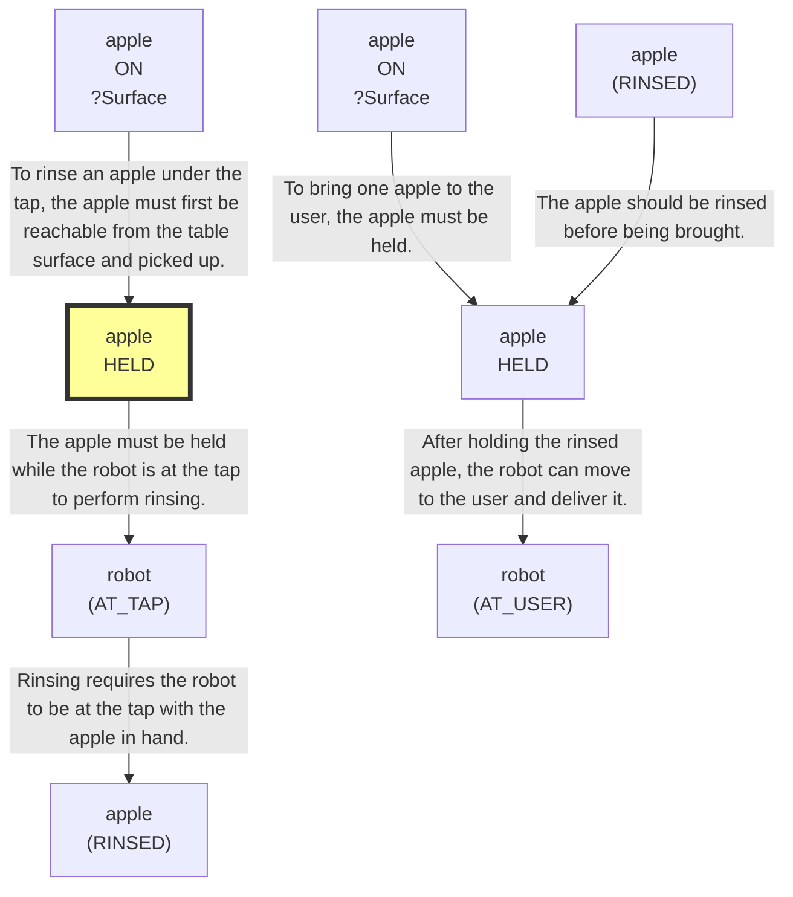
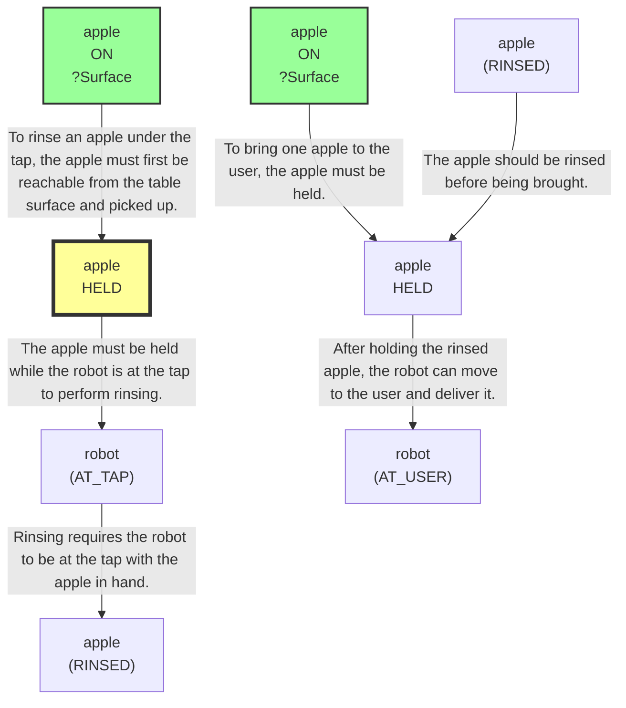
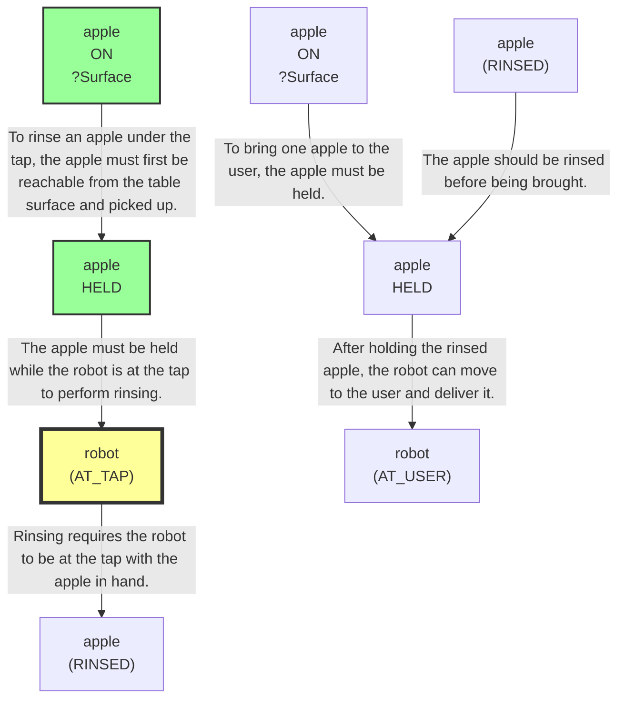
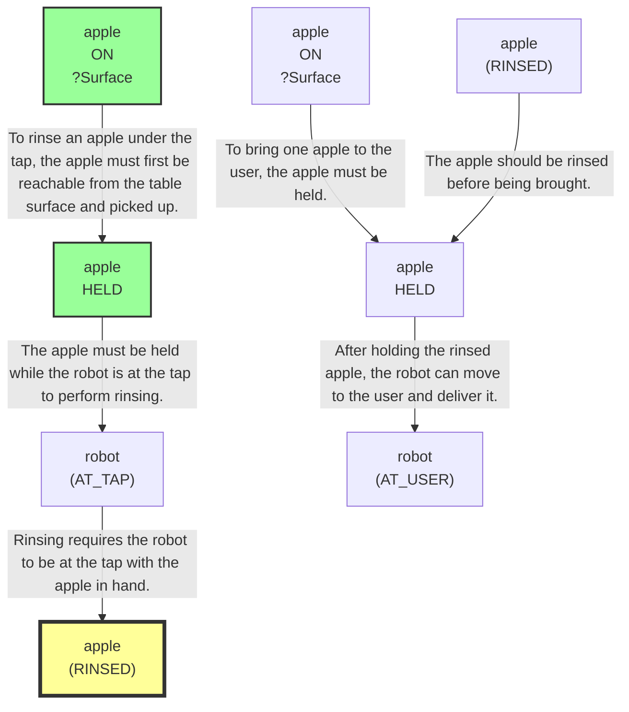

# 🚀 VirtualHome Agent Episode Log


### [GoalReasoner (Module A - Intent)] Output
```json
{
  "is_instruction_obviously_vague": false,
  "clarification_question": null,
  "target_object": "apple",
  "location_hint": "the table",
  "reasoning_chain": [
    {
      "question": "Why does the user want this object?",
      "answer": "To obtain one of the apples if they are available on the table."
    },
    {
      "question": "Why is that important?",
      "answer": "The apple is intended to be washed before being brought to the user, likely so it is clean and ready to eat."
    },
    {
      "question": "What fundamental need does this fulfill?",
      "answer": "It fulfills the need to have clean, ready-to-eat food."
    },
    {
      "question": "Are there any deeper psychological or physical motivations?",
      "answer": "The user may be hungry or simply want a cleaned fruit to consume."
    }
  ],
  "deep_intent": "The user wants clean, ready-to-eat food to satisfy hunger or snacking needs.",
  "acceptable_alternatives_properties": [
    {
      "priority": 1,
      "description": "Other ready-to-eat fruits that can be rinsed and served, such as a pear, banana, or orange"
    },
    {
      "priority": 2,
      "description": "Other whole fruits available indoors that can be washed and eaten"
    },
    {
      "priority": 3,
      "description": "Prepared snack foods or fresh produce that provide a similar eating experience"
    },
    {
      "priority": 4,
      "description": "Any clean, edible item that can satisfy a desire for a small food portion"
    }
  ]
}
```

### [PerceptionFilter] Output
```json
{
  "reasoning": "The goal is to obtain an apple from the table, rinse it at the tap, and deliver it to the user. So we need the target object apple, the table surface where it is located, and the tap/washing setup needed for rinsing. Because the SDG requires the robot to be at a tap, sink and faucet are retained, along with the washing tool sponge as an implicit aid for rinsing. The user delivery location is also implied by the goal, but no specific furniture there is needed.",
  "selected_classes": [
    "character",
    "washingsponge",
    "apple",
    "door",
    "sink",
    "faucet",
    "kitchentable"
  ],
  "raw_class_count": 55
}
```

### [LLMExecutor] Output
```json
{
  "reasoning": "The apple needed for the active task is already identified: apple(437) is on the kitchentable and is DIRTY. To satisfy the SDG, the next required step is to pick up the apple before moving to the tap for rinsing. The character is already close to the kitchentable, so the correct immediate atomic action is to grab the apple.",
  "satisfied_nodes": [],
  "current_node_focus": "N3",
  "mapped_variables": {
    "?Surface": "kitchentable(231)"
  },
  "action": "[grab] <apple> (437)"
}
```

### [RoboStateMultiTaskController] Output
```json
{
  "action": "[walk] <apple> (437)",
  "active_task_id": "task_1",
  "task_context": {
    "active_task_id": "task_1",
    "pending_task_ids": [],
    "satisfied_task_ids": []
  },
  "source": "llm_executor_repaired"
}
```
## Step 0
- **Action**: `[walk] <apple> (437)`
- **Action Success**: `True`
- **Action Message**: {'0': {'message': 'Success'}}
- **Active Task**: `task_1`
- **Decision Source**: `llm_executor_repaired`
- **Task Progress**: T3_without_path_merging_G4_17=pending
- **SDG Status**:

- **Observed Items (11)**: door(224) [OPEN], kitchentable(231), sink(247), faucet(248) [OFF], washingsponge(266), apple(437) [DIRTY], character(1), bathroom(11), bedroom(73), kitchen(205), livingroom(335)


### [PerceptionFilter] Output
```json
{
  "reasoning": "Reused cached class selection.",
  "selected_classes": [
    "character",
    "washingsponge",
    "apple",
    "door",
    "sink",
    "faucet",
    "kitchentable"
  ],
  "raw_class_count": 55
}
```

### [LLMExecutor] Output
```json
{
  "reasoning": "The apple is already reachable and on the kitchentable, but it is DIRTY. To rinse it, I must first hold it. The next required step in the SDG is to satisfy N3 (apple HELD) before moving to the sink for rinsing.",
  "satisfied_nodes": [
    "N1",
    "N5"
  ],
  "current_node_focus": "N3",
  "mapped_variables": {
    "?Surface": "kitchentable(231)"
  },
  "action": "[grab] <apple> (437)"
}
```

### [RoboStateMultiTaskController] Output
```json
{
  "action": "[grab] <apple> (437)",
  "active_task_id": "task_1",
  "task_context": {
    "active_task_id": "task_1",
    "pending_task_ids": [],
    "satisfied_task_ids": []
  },
  "source": "llm_executor"
}
```
## Step 1
- **Action**: `[grab] <apple> (437)`
- **Action Success**: `True`
- **Action Message**: {'0': {'message': 'Success'}}
- **Active Task**: `task_1`
- **Decision Source**: `llm_executor`
- **Task Progress**: T3_without_path_merging_G4_17=pending
- **SDG Status**:

- **Observed Items (11)**: door(224) [OPEN], kitchentable(231), sink(247), faucet(248) [OFF], washingsponge(266), apple(437) [DIRTY], character(1), bathroom(11), bedroom(73), kitchen(205), livingroom(335)


### [PerceptionFilter] Output
```json
{
  "reasoning": "Reused cached class selection.",
  "selected_classes": [
    "character",
    "washingsponge",
    "apple",
    "door",
    "sink",
    "faucet",
    "kitchentable"
  ],
  "raw_class_count": 55
}
```

### [LLMExecutor] Output
```json
{
  "reasoning": "The apple is already held, and the next prerequisite for rinsing is to be at the tap/sink area. The sink is the correct washer target for the rinse sequence, and the filtered graph shows the kitchen sink is available. Since washing/rinsing requires being near the sink first, the next atomic step is to walk to the sink.",
  "satisfied_nodes": [
    "N1",
    "N3"
  ],
  "current_node_focus": "N4",
  "mapped_variables": {
    "?Surface": "sink(247)"
  },
  "action": "[walk] <sink> (247)"
}
```

### [RoboStateMultiTaskController] Output
```json
{
  "action": "[walk] <sink> (247)",
  "active_task_id": "task_1",
  "task_context": {
    "active_task_id": "task_1",
    "pending_task_ids": [],
    "satisfied_task_ids": []
  },
  "source": "llm_executor"
}
```
## Step 2
- **Action**: `[walk] <sink> (247)`
- **Action Success**: `True`
- **Action Message**: {'0': {'message': 'Success'}}
- **Active Task**: `task_1`
- **Decision Source**: `llm_executor`
- **Task Progress**: T3_without_path_merging_G4_17=pending
- **SDG Status**:

- **Observed Items (11)**: door(224) [OPEN], kitchentable(231), sink(247), faucet(248) [OFF], washingsponge(266), apple(437) [DIRTY], character(1), bathroom(11), bedroom(73), kitchen(205), livingroom(335)


### [PerceptionFilter] Output
```json
{
  "reasoning": "Reused cached class selection.",
  "selected_classes": [
    "character",
    "washingsponge",
    "apple",
    "door",
    "sink",
    "faucet",
    "kitchentable"
  ],
  "raw_class_count": 55
}
```

### [LLMExecutor] Output
```json
{
  "reasoning": "The apple is already held and the robot is already close to the sink/faucet, so the next required step is to rinse the apple. This satisfies the prerequisite for the apple being clean before delivery. The sink is a valid washing location and no additional navigation is needed before washing.",
  "satisfied_nodes": [
    "N1",
    "N3"
  ],
  "current_node_focus": "N2",
  "mapped_variables": {
    "?Surface": "sink(247)"
  },
  "action": "[wash] <apple> (437)"
}
```

### [RoboStateMultiTaskController] Output
```json
{
  "action": "[wash] <apple> (437)",
  "active_task_id": "task_1",
  "task_context": {
    "active_task_id": "task_1",
    "pending_task_ids": [],
    "satisfied_task_ids": []
  },
  "source": "llm_executor"
}
```
## Step 3
- **Action**: `[wash] <apple> (437)`
- **Action Success**: `True`
- **Action Message**: Washed successfully.
- **Active Task**: `task_1`
- **Decision Source**: `llm_executor`
- **Task Progress**: T3_without_path_merging_G4_17=done
- **SDG Status**:

- **Observed Items (11)**: door(224) [OPEN], kitchentable(231), sink(247), faucet(248) [OFF], washingsponge(266), apple(437) [DIRTY], character(1), bathroom(11), bedroom(73), kitchen(205), livingroom(335)

