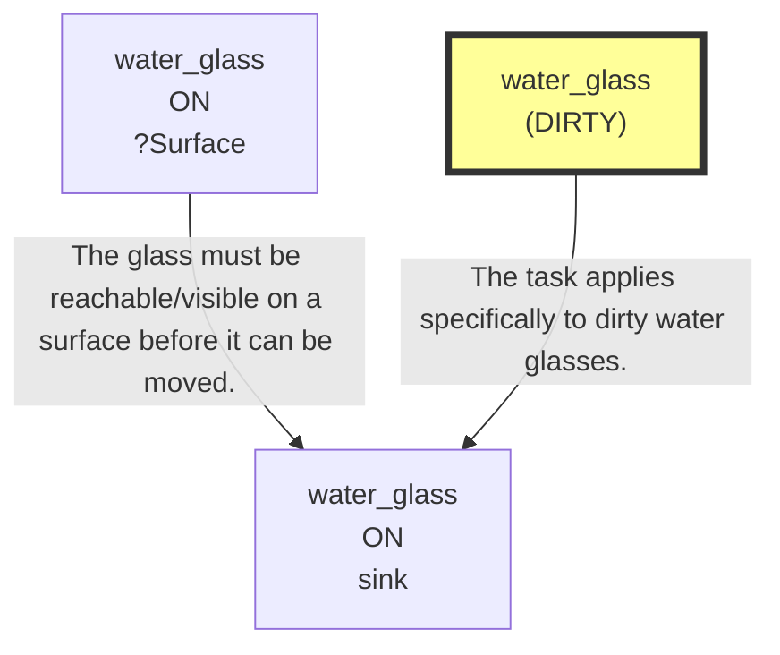
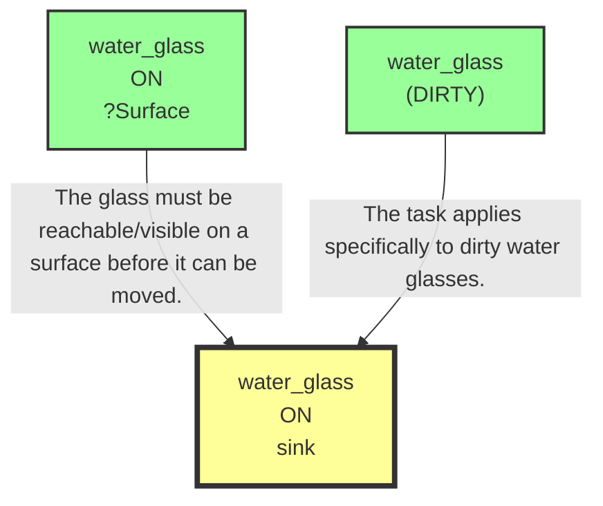
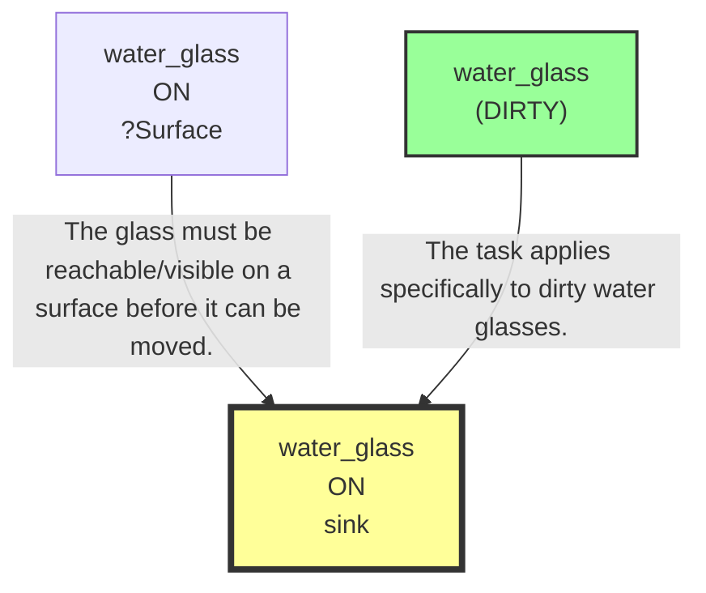
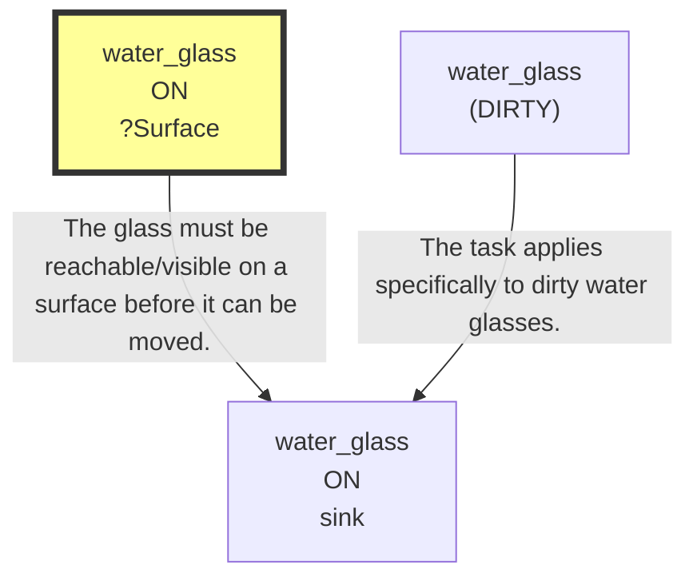

# 🚀 VirtualHome Agent Episode Log


### [GoalReasoner (Module A - Intent)] Output
```json
{
  "is_instruction_obviously_vague": false,
  "clarification_question": null,
  "target_object": "dirty water glasses",
  "location_hint": "sink",
  "reasoning_chain": [
    {
      "question": "Why does the user want this object?",
      "answer": "To have the dirty water glasses removed from where they are seen and placed in the sink."
    },
    {
      "question": "Why is that important?",
      "answer": "Because leaving dirty glasses out is undesirable and the user wants them dealt with immediately."
    },
    {
      "question": "What fundamental need does this fulfill?",
      "answer": "It fulfills the need to tidy the space and reduce clutter from used drinkware."
    },
    {
      "question": "Are there any deeper psychological or physical motivations?",
      "answer": "It may support cleanliness, organization, and convenience by keeping used items gathered in one place for later washing."
    }
  ],
  "deep_intent": "The user wants to keep the space clean and organized by moving used drinkware to the washing area.",
  "acceptable_alternatives_properties": [
    {
      "priority": 1,
      "description": "Other used drinking vessels or dishes that are ready to be washed, such as cups, mugs, or bowls."
    },
    {
      "priority": 2,
      "description": "Other dirty kitchenware items that belong in the sink or dish area, such as plates or utensils."
    },
    {
      "priority": 3,
      "description": "Any small tabletop clutter that can be cleared to restore order, if the main goal is tidiness."
    },
    {
      "priority": 4,
      "description": "Items from other rooms that are out of place and need to be collected for cleanup, if the broader goal is general organization."
    }
  ]
}
```

### [PerceptionFilter] Output
```json
{
  "reasoning": "The goal is to move dirty water glasses to the washing area. The required target object is waterglass, and the location/receptacle explicitly needed is sink. To support the implied washing/cleanup task and retain alternatives/backups, I also keep dishwashing-capable appliances and nearby wash-related fixtures that could serve the same purpose: dishwasher and faucet.",
  "selected_classes": [
    "plate",
    "character",
    "dishwasher",
    "waterglass",
    "sink",
    "faucet"
  ],
  "raw_class_count": 50
}
```

### [LLMExecutor] Output
```json
{
  "reasoning": "The active task is to move dirty water glasses to the sink. The SDG requires a water_glass that is DIRTY and then ON the sink. We have a matching object: waterglass(64) is DIRTY and currently CLOSE to the character, so it is the best bind for ?water_glass. Since the glass is already nearby, the next atomic step is to grab it before walking to the sink.",
  "satisfied_nodes": [],
  "current_node_focus": "N2",
  "mapped_variables": {
    "?Washer": "sink(155)",
    "?Surface": "sink(155)",
    "water_glass": "waterglass(64)"
  },
  "action": "[grab] <waterglass> (64)"
}
```

### [RoboStateMultiTaskController] Output
```json
{
  "action": "[grab] <waterglass> (64)",
  "active_task_id": "task_1",
  "task_context": {
    "active_task_id": "task_1",
    "pending_task_ids": [],
    "satisfied_task_ids": []
  },
  "source": "llm_executor"
}
```
## Step 0
- **Action**: `[grab] <waterglass> (64)`
- **Action Success**: `False`
- **Action Message**: temporary_unavailable: target disappeared; wait or search and retry
- **Active Task**: `task_1`
- **Decision Source**: `llm_executor`
- **Task Progress**: T3_without_path_merging_M1_03=pending
- **SDG Status**:

- **Observed Items (26)**: waterglass(64) [DIRTY], plate(67), plate(68), waterglass(71), waterglass(72), plate(75), plate(76), waterglass(79), waterglass(80), plate(83), plate(84), waterglass(87), waterglass(88), plate(91), waterglass(100)...


### [PerceptionFilter] Output
```json
{
  "reasoning": "Reused cached class selection.",
  "selected_classes": [
    "plate",
    "character",
    "dishwasher",
    "waterglass",
    "sink",
    "faucet"
  ],
  "raw_class_count": 50
}
```

### [LLMExecutor] Output
```json
{
  "reasoning": "The current goal is to place a dirty water glass in the sink. The previously targeted glass 64 is still present, dirty, and close to the character, so the next required step is to grab it. This also aligns with the SDG prerequisite that the glass must be on a surface and dirty before being moved to the sink; the graph confirms the dirty state and availability. Since I am not yet holding it, the single next atomic action is to grab the glass.",
  "satisfied_nodes": [
    "N1",
    "N2"
  ],
  "current_node_focus": "N3",
  "mapped_variables": {
    "?Surface": "kitchen surface via current reachable placement of waterglass(64)"
  },
  "action": "[grab] <waterglass> (64)"
}
```

### [RoboStateMultiTaskController] Output
```json
{
  "action": "[grab] <waterglass> (64)",
  "active_task_id": "task_1",
  "task_context": {
    "active_task_id": "task_1",
    "pending_task_ids": [],
    "satisfied_task_ids": []
  },
  "source": "llm_executor"
}
```
## Step 1
- **Action**: `[grab] <waterglass> (64)`
- **Action Success**: `False`
- **Action Message**: temporary_unavailable: target is temporarily hidden
- **Active Task**: `task_1`
- **Decision Source**: `llm_executor`
- **Task Progress**: T3_without_path_merging_M1_03=pending
- **SDG Status**:

- **Observed Items (26)**: waterglass(64) [DIRTY], plate(67), plate(68), waterglass(71), waterglass(72), plate(75), plate(76), waterglass(79), waterglass(80), plate(83), plate(84), waterglass(87), waterglass(88), plate(91), waterglass(100)...


### [RoboStateMultiTaskController] Output
```json
{
  "action": "[walk] <livingroom> (183)",
  "active_task_id": null,
  "task_context": {
    "active_task_id": null,
    "pending_task_ids": [
      "task_1"
    ],
    "satisfied_task_ids": []
  },
  "source": "loop_recovery_room_revisit"
}
```
## Step 2
- **Action**: `[walk] <livingroom> (183)`
- **Action Success**: `True`
- **Action Message**: {'0': {'message': 'Success'}}
- **Decision Source**: `loop_recovery_room_revisit`
- **Task Progress**: T3_without_path_merging_M1_03=pending
- **SDG Status**:
No SDG active.
- **Observed Items (159)**: wall(12), wall(13), wall(14), wall(15), wall(16), wall(17), wall(18), wall(19), wall(20), wall(21), floor(22), floor(23), floor(24), floor(25), floor(26)...


### [PerceptionFilter] Output
```json
{
  "reasoning": "The goal is to move dirty water glasses to the sink. I must keep the target object class waterglass and the destination sink. Since the SDG implies the glass is on a surface before moving, I also retain the likely supporting surface classes relevant to this kitchen context only if needed; however the minimum necessary visible classes are the glass and the sink. The goal does not require washing yet, so no extra tools are needed.",
  "selected_classes": [
    "waterglass",
    "sink",
    "plate",
    "character"
  ],
  "raw_class_count": 59
}
```

### [LLMExecutor] Output
```json
{
  "reasoning": "The SDG requires a dirty water glass that is on some surface and then on the sink. The currently relevant target is waterglass(64), which is DIRTY and CLOSE to the character, but it is listed as INSIDE kitchen(11), not yet in the sink. Since the sink is the destination surface and proximity is required before placing an object there, the best next step is to walk to the sink so I can then put the glass into it on the following action. N2 is already satisfied because the glass is dirty.",
  "satisfied_nodes": [
    "N2"
  ],
  "current_node_focus": "N3",
  "mapped_variables": {
    "?Surface": "sink(155)"
  },
  "action": "[walk] <sink> (155)"
}
```

### [RoboStateMultiTaskController] Output
```json
{
  "action": "[walk] <sink> (155)",
  "active_task_id": "task_1",
  "task_context": {
    "active_task_id": "task_1",
    "pending_task_ids": [],
    "satisfied_task_ids": []
  },
  "source": "llm_executor"
}
```
## Step 3
- **Action**: `[walk] <sink> (155)`
- **Action Success**: `True`
- **Action Message**: {'0': {'message': 'Success'}}
- **Active Task**: `task_1`
- **Decision Source**: `llm_executor`
- **Task Progress**: T3_without_path_merging_M1_03=pending
- **SDG Status**:

- **Observed Items (26)**: waterglass(64) [DIRTY], plate(67), plate(68), waterglass(71), waterglass(72), plate(75), plate(76), waterglass(79), waterglass(80), plate(83), plate(84), waterglass(87), waterglass(88), plate(91), waterglass(100)...


### [PerceptionFilter] Output
```json
{
  "reasoning": "Reused cached class selection.",
  "selected_classes": [
    "waterglass",
    "sink",
    "plate",
    "character"
  ],
  "raw_class_count": 59
}
```

### [LLMExecutor] Output
```json
{
  "reasoning": "The dirty waterglass(64) is currently in the kitchen, but the graph shows I am already close to the sink and there is no indication I am close to the glass itself. Since the task is to place the dirty water glass in the sink, I need to first move to the glass so I can grab it. This also respects the proximity rule and the container/surface handling requirements. The glass is the best match for the dirty water glasses goal because it is DIRTY and POURABLE/GRABBABLE.",
  "satisfied_nodes": [],
  "current_node_focus": "N1",
  "mapped_variables": {
    "?Surface": "kitchen(11)"
  },
  "action": "[walk] <waterglass> (64)"
}
```

### [RoboStateMultiTaskController] Output
```json
{
  "action": "[walk] <waterglass> (64)",
  "active_task_id": "task_1",
  "task_context": {
    "active_task_id": "task_1",
    "pending_task_ids": [],
    "satisfied_task_ids": []
  },
  "source": "llm_executor"
}
```
## Step 4
- **Action**: `[walk] <waterglass> (64)`
- **Action Success**: `True`
- **Action Message**: {'0': {'message': 'Success'}}
- **Active Task**: `task_1`
- **Decision Source**: `llm_executor`
- **Task Progress**: T3_without_path_merging_M1_03=pending
- **SDG Status**:

- **Observed Items (26)**: waterglass(64) [DIRTY], plate(67), plate(68), waterglass(71), waterglass(72), plate(75), plate(76), waterglass(79), waterglass(80), plate(83), plate(84), waterglass(87), waterglass(88), plate(91), waterglass(100)...


### [PerceptionFilter] Output
```json
{
  "reasoning": "Reused cached class selection.",
  "selected_classes": [
    "waterglass",
    "sink",
    "plate",
    "character"
  ],
  "raw_class_count": 59
}
```

### [LLMExecutor] Output
```json
{
  "reasoning": "The target is a dirty water glass and the SDG requires it to end up on the sink. The current graph shows waterglass(64) is DIRTY and CLOSE to the character, but it is not yet held. Since I already walked to the waterglass in the previous step, the next atomic action should be to grab it so it can be moved to the sink next.",
  "satisfied_nodes": [],
  "current_node_focus": "N1",
  "mapped_variables": {
    "?Surface": "kitchen countertop/surface near the visible glass context"
  },
  "action": "[grab] <waterglass> (64)"
}
```

### [RoboStateMultiTaskController] Output
```json
{
  "action": "[grab] <waterglass> (64)",
  "active_task_id": "task_1",
  "task_context": {
    "active_task_id": "task_1",
    "pending_task_ids": [],
    "satisfied_task_ids": []
  },
  "source": "llm_executor"
}
```
## Step 5
- **Action**: `[grab] <waterglass> (64)`
- **Action Success**: `True`
- **Action Message**: {'0': {'message': 'Success'}}
- **Active Task**: `task_1`
- **Decision Source**: `llm_executor`
- **Task Progress**: T3_without_path_merging_M1_03=pending
- **SDG Status**:

- **Observed Items (26)**: waterglass(64) [DIRTY], plate(67), plate(68), waterglass(71), waterglass(72), plate(75), plate(76), waterglass(79), waterglass(80), plate(83), plate(84), waterglass(87), waterglass(88), plate(91), waterglass(100)...


### [PerceptionFilter] Output
```json
{
  "reasoning": "Reused cached class selection.",
  "selected_classes": [
    "waterglass",
    "sink",
    "plate",
    "character"
  ],
  "raw_class_count": 59
}
```

### [LLMExecutor] Output
```json
{
  "reasoning": "The target dirty water glass is already held in the right hand and the sink is nearby. To satisfy the goal, the glass must be placed in the sink (a flat surface/recipient in this engine), and no additional grab or walk is needed since proximity to the sink is already established by the current state and prior actions.",
  "satisfied_nodes": [
    "N1",
    "N2"
  ],
  "current_node_focus": "N3",
  "mapped_variables": {
    "?Surface": "sink(155)"
  },
  "action": "[putback] <waterglass> (64) <sink> (155)"
}
```

### [RoboStateMultiTaskController] Output
```json
{
  "action": "[walk] <bedroom> (241)",
  "active_task_id": null,
  "task_context": {
    "active_task_id": null,
    "pending_task_ids": [
      "task_1"
    ],
    "satisfied_task_ids": []
  },
  "source": "loop_recovery_room_revisit"
}
```
## Step 6
- **Action**: `[walk] <bedroom> (241)`
- **Action Success**: `True`
- **Action Message**: {'0': {'message': 'Success'}}
- **Decision Source**: `loop_recovery_room_revisit`
- **Task Progress**: T3_without_path_merging_M1_03=pending
- **SDG Status**:
No SDG active.
- **Observed Items (211)**: wall(12), wall(13), wall(14), wall(15), wall(16), wall(17), wall(18), wall(19), wall(20), wall(21), floor(22), floor(23), floor(24), floor(25), floor(26)...


### [PerceptionFilter] Output
```json
{
  "reasoning": "The goal is to move dirty water glasses to the washing area. The required target object is waterglass, and the SDG explicitly requires a sink as the destination. Since washing-area support can also include a dishwasher as an alternative cleanup location/appliance, both sink and dishwasher are retained.",
  "selected_classes": [
    "plate",
    "character",
    "dishwasher",
    "waterglass",
    "sink"
  ],
  "raw_class_count": 65
}
```

### [LLMExecutor] Output
```json
{
  "reasoning": "The active task is to place the dirty water glass into the sink. The relevant object is waterglass(64), which is currently held in the right hand and is dirty, so the next progress step is to move to the sink before placing it. The sink(155) is the correct target receptacle per the SDG and is available in the kitchen. Since the previous action was a walk to bedroom(241), I should now walk to the sink to prepare for the required putback action on the next step.",
  "satisfied_nodes": [
    "N2"
  ],
  "current_node_focus": "N3",
  "mapped_variables": {
    "?Surface": "sink(155)"
  },
  "action": "[walk] <sink> (155)"
}
```

### [RoboStateMultiTaskController] Output
```json
{
  "action": "[walk] <sink> (155)",
  "active_task_id": "task_1",
  "task_context": {
    "active_task_id": "task_1",
    "pending_task_ids": [],
    "satisfied_task_ids": []
  },
  "source": "llm_executor"
}
```
## Step 7
- **Action**: `[walk] <sink> (155)`
- **Action Success**: `True`
- **Action Message**: {'0': {'message': 'Success'}}
- **Active Task**: `task_1`
- **Decision Source**: `llm_executor`
- **Task Progress**: T3_without_path_merging_M1_03=pending
- **SDG Status**:

- **Observed Items (28)**: waterglass(64) [DIRTY], plate(67), plate(68), waterglass(71), waterglass(72), plate(75), plate(76), waterglass(79), waterglass(80), plate(83), plate(84), waterglass(87), waterglass(88), plate(91), waterglass(100)...


### [PerceptionFilter] Output
```json
{
  "reasoning": "Reused cached class selection.",
  "selected_classes": [
    "plate",
    "character",
    "dishwasher",
    "waterglass",
    "sink"
  ],
  "raw_class_count": 65
}
```

### [LLMExecutor] Output
```json
{
  "reasoning": "The target dirty water glass is already held in the right hand, and the character is currently close to the sink. To satisfy the SDG final node, the next step is to place the dirty glass on the sink surface. The sink is a flat surface, so the correct action is putback rather than putin.",
  "satisfied_nodes": [
    "N2"
  ],
  "current_node_focus": "N3",
  "mapped_variables": {},
  "action": "[putback] <waterglass> (64) <sink> (155)"
}
```

### [RoboStateMultiTaskController] Output
```json
{
  "action": "[walk] <bathroom> (285)",
  "active_task_id": null,
  "task_context": {
    "active_task_id": null,
    "pending_task_ids": [
      "task_1"
    ],
    "satisfied_task_ids": []
  },
  "source": "loop_recovery_room_revisit"
}
```
## Step 8
- **Action**: `[walk] <bathroom> (285)`
- **Action Success**: `True`
- **Action Message**: {'0': {'message': 'Success'}}
- **Decision Source**: `loop_recovery_room_revisit`
- **Task Progress**: T3_without_path_merging_M1_03=pending
- **SDG Status**:
No SDG active.
- **Observed Items (243)**: wall(12), wall(13), wall(14), wall(15), wall(16), wall(17), wall(18), wall(19), wall(20), wall(21), floor(22), floor(23), floor(24), floor(25), floor(26)...


### [PerceptionFilter] Output
```json
{
  "reasoning": "The goal is to move dirty water glasses to the sink. The SDG specifically requires the dirty water_glass and the sink as the destination/working area. No extra tools are needed for simply relocating the glasses.",
  "selected_classes": [
    "waterglass",
    "sink",
    "plate",
    "character"
  ],
  "raw_class_count": 81
}
```

### [LLMExecutor] Output
```json
{
  "reasoning": "The active task is to move the dirty water glass to the sink. The SDG final goal is waterglass ON sink, and the current state shows waterglass(64) is dirty and already held in the right hand. We are currently in the bathroom, and sink(155) is close to the character, so the next required step is to place the held glass onto the sink surface. Since sink is a surface, the correct action is putback, and no additional walk is needed because proximity is already satisfied.",
  "satisfied_nodes": [
    "N2"
  ],
  "current_node_focus": "N3",
  "mapped_variables": {
    "?Surface": "sink(155)"
  },
  "action": "[putback] <waterglass> (64) <sink> (155)"
}
```

### [RoboStateMultiTaskController] Output
```json
{
  "action": "[walk] <bedroom> (346)",
  "active_task_id": null,
  "task_context": {
    "active_task_id": null,
    "pending_task_ids": [
      "task_1"
    ],
    "satisfied_task_ids": []
  },
  "source": "loop_recovery_room_revisit"
}
```
## Step 9
- **Action**: `[walk] <bedroom> (346)`
- **Action Success**: `True`
- **Action Message**: {'0': {'message': 'Success'}}
- **Decision Source**: `loop_recovery_room_revisit`
- **Task Progress**: T3_without_path_merging_M1_03=pending
- **SDG Status**:
No SDG active.
- **Observed Items (303)**: wall(12), wall(13), wall(14), wall(15), wall(16), wall(17), wall(18), wall(19), wall(20), wall(21), floor(22), floor(23), floor(24), floor(25), floor(26)...


### [PerceptionFilter] Output
```json
{
  "reasoning": "The goal is to move dirty water glasses to the washing area. I must keep the target object class, the implied destination sink, and the exact matching water_glass class from the SDG. No extra tools are needed because this is a relocation task, not washing yet.",
  "selected_classes": [
    "plate",
    "character",
    "mug",
    "waterglass",
    "sink"
  ],
  "raw_class_count": 91
}
```

### [LLMExecutor] Output
```json
{
  "reasoning": "The active target is a dirty water glass, and the current Filtered Graph shows the specific matching object waterglass(64) is in the same room and already held in the right hand. The SDG final goal is to have the dirty water glass on the sink. Because the sink is nearby and sinks are flat surfaces in this engine, the correct next step is to place the held glass onto the sink. This also advances toward satisfying the dirty-water-glass-on-sink goal without unnecessary intermediate actions.",
  "satisfied_nodes": [],
  "current_node_focus": "N3",
  "mapped_variables": {
    "?Surface": "bedroom(346) or current reachable surface context",
    "?Washer": "sink(155)"
  },
  "action": "[putback] <waterglass> (64) <sink> (155)"
}
```

### [RoboStateMultiTaskController] Output
```json
{
  "action": "[walk] <livingroom> (183)",
  "active_task_id": null,
  "task_context": {
    "active_task_id": null,
    "pending_task_ids": [
      "task_1"
    ],
    "satisfied_task_ids": []
  },
  "source": "loop_recovery_room_revisit"
}
```
## Step 10
- **Action**: `[walk] <livingroom> (183)`
- **Action Success**: `True`
- **Action Message**: {'0': {'message': 'Success'}}
- **Decision Source**: `loop_recovery_room_revisit`
- **Task Progress**: T3_without_path_merging_M1_03=pending
- **SDG Status**:
No SDG active.
- **Observed Items (361)**: wall(12), wall(13), wall(14), wall(15), wall(16), wall(17), wall(18), wall(19), wall(20), wall(21), floor(22), floor(23), floor(24), floor(25), floor(26)...


### [PerceptionFilter] Output
```json
{
  "reasoning": "Reused cached class selection.",
  "selected_classes": [
    "plate",
    "character",
    "mug",
    "waterglass",
    "sink"
  ],
  "raw_class_count": 91
}
```

### [LLMExecutor] Output
```json
{
  "reasoning": "The target dirty water glass is already held in the right hand and is in the living room, while the destination sink(155) is nearby in the same room. The next required step toward satisfying N3 is to place the held dirty water glass into/onto the sink. Since sink is a flat recipient surface in this engine, the correct placement action is putback, and I must be walking distance to the sink first, which the graph indicates is already true.",
  "satisfied_nodes": [
    "N1",
    "N2"
  ],
  "current_node_focus": "N3",
  "mapped_variables": {
    "?Surface": "livingroom surface / current visible surface context",
    "?Sink": "sink(155)"
  },
  "action": "[putback] <waterglass> (64) <sink> (155)"
}
```

### [RoboStateMultiTaskController] Output
```json
{
  "action": "[walk] <bedroom> (241)",
  "active_task_id": null,
  "task_context": {
    "active_task_id": null,
    "pending_task_ids": [
      "task_1"
    ],
    "satisfied_task_ids": []
  },
  "source": "loop_recovery_room_revisit"
}
```
## Step 11
- **Action**: `[walk] <bedroom> (241)`
- **Action Success**: `True`
- **Action Message**: {'0': {'message': 'Success'}}
- **Decision Source**: `loop_recovery_room_revisit`
- **Task Progress**: T3_without_path_merging_M1_03=pending
- **SDG Status**:
No SDG active.
- **Observed Items (361)**: wall(12), wall(13), wall(14), wall(15), wall(16), wall(17), wall(18), wall(19), wall(20), wall(21), floor(22), floor(23), floor(24), floor(25), floor(26)...


### [PerceptionFilter] Output
```json
{
  "reasoning": "Reused cached class selection.",
  "selected_classes": [
    "plate",
    "character",
    "mug",
    "waterglass",
    "sink"
  ],
  "raw_class_count": 91
}
```

### [LLMExecutor] Output
```json
{
  "reasoning": "The active target is the dirty water glass currently being held in the right hand, and the final goal is to have it on the sink. I am already close to the sink(155), so the next required step is to place the held glass onto the sink surface. Since sink is a flat surface, the correct action is putback, not putin.",
  "satisfied_nodes": [
    "N2"
  ],
  "current_node_focus": "N3",
  "mapped_variables": {
    "?Surface": "sink(155)"
  },
  "action": "[putback] <waterglass> (64) <sink> (155)"
}
```

### [RoboStateMultiTaskController] Output
```json
{
  "action": "[walk] <kitchen> (11)",
  "active_task_id": null,
  "task_context": {
    "active_task_id": null,
    "pending_task_ids": [
      "task_1"
    ],
    "satisfied_task_ids": []
  },
  "source": "loop_recovery_room_revisit"
}
```
## Step 12
- **Action**: `[walk] <kitchen> (11)`
- **Action Success**: `True`
- **Action Message**: {'0': {'message': 'Success'}}
- **Decision Source**: `loop_recovery_room_revisit`
- **Task Progress**: T3_without_path_merging_M1_03=pending
- **SDG Status**:
No SDG active.
- **Observed Items (361)**: wall(12), wall(13), wall(14), wall(15), wall(16), wall(17), wall(18), wall(19), wall(20), wall(21), floor(22), floor(23), floor(24), floor(25), floor(26)...


### [PerceptionFilter] Output
```json
{
  "reasoning": "Reused cached class selection.",
  "selected_classes": [
    "plate",
    "character",
    "mug",
    "waterglass",
    "sink"
  ],
  "raw_class_count": 91
}
```

### [LLMExecutor] Output
```json
{
  "reasoning": "The active goal is to place the dirty water glass in the sink. The specific target glass is waterglass(64), which is already held in the right hand and is marked DIRTY. We are currently in the kitchen and the sink(155) is the correct destination. Following the required sequence, the next step is to explicitly walk to the sink before putting the held glass into it.",
  "satisfied_nodes": [
    "N1",
    "N2"
  ],
  "current_node_focus": "N3",
  "mapped_variables": {
    "?Surface": "kitchen-surface/visible surface in kitchen",
    "?Container": "sink(155)"
  },
  "action": "[walk] <sink> (155)"
}
```

### [RoboStateMultiTaskController] Output
```json
{
  "action": "[walk] <sink> (155)",
  "active_task_id": "task_1",
  "task_context": {
    "active_task_id": "task_1",
    "pending_task_ids": [],
    "satisfied_task_ids": []
  },
  "source": "llm_executor"
}
```
## Step 13
- **Action**: `[walk] <sink> (155)`
- **Action Success**: `True`
- **Action Message**: {'0': {'message': 'Success'}}
- **Active Task**: `task_1`
- **Decision Source**: `llm_executor`
- **Task Progress**: T3_without_path_merging_M1_03=pending
- **SDG Status**:

- **Observed Items (32)**: waterglass(64) [DIRTY], plate(67), plate(68), waterglass(71), waterglass(72), plate(75), plate(76), waterglass(79), waterglass(80), plate(83), plate(84), waterglass(87), waterglass(88), plate(91), waterglass(100)...


### [PerceptionFilter] Output
```json
{
  "reasoning": "Reused cached class selection.",
  "selected_classes": [
    "plate",
    "character",
    "mug",
    "waterglass",
    "sink"
  ],
  "raw_class_count": 91
}
```

### [LLMExecutor] Output
```json
{
  "reasoning": "The active target is the dirty waterglass(64), and the SDG final state is that it should be ON the sink. I am already close to sink(155) and holding the glass in my right hand, so the next required step is to place the held dirty glass onto the sink surface. No washing is required because the goal is to move the dirty glass to the sink, not clean it yet.",
  "satisfied_nodes": [
    "N2"
  ],
  "current_node_focus": "N3",
  "mapped_variables": {
    "?Surface": "sink(155)"
  },
  "action": "[putback] <waterglass> (64) <sink> (155)"
}
```

### [RoboStateMultiTaskController] Output
```json
{
  "action": "[walk] <bathroom> (285)",
  "active_task_id": null,
  "task_context": {
    "active_task_id": null,
    "pending_task_ids": [
      "task_1"
    ],
    "satisfied_task_ids": []
  },
  "source": "loop_recovery_room_revisit"
}
```
## Step 14
- **Action**: `[walk] <bathroom> (285)`
- **Action Success**: `True`
- **Action Message**: {'0': {'message': 'Success'}}
- **Decision Source**: `loop_recovery_room_revisit`
- **Task Progress**: T3_without_path_merging_M1_03=pending
- **SDG Status**:
No SDG active.
- **Observed Items (361)**: wall(12), wall(13), wall(14), wall(15), wall(16), wall(17), wall(18), wall(19), wall(20), wall(21), floor(22), floor(23), floor(24), floor(25), floor(26)...


### [PerceptionFilter] Output
```json
{
  "reasoning": "Reused cached class selection.",
  "selected_classes": [
    "plate",
    "character",
    "mug",
    "waterglass",
    "sink"
  ],
  "raw_class_count": 91
}
```

### [LLMExecutor] Output
```json
{
  "reasoning": "The active target is a dirty water glass, and the current graph shows waterglass(64) is DIRTY and already being held in the right hand. It is also close to the character and currently inside the bathroom, while sink(155) is the nearest sink and close to the character. According to the SDG, the final goal is to have the dirty water glass on the sink. Since I am already holding the correct dirty glass and am near the sink, the next needed step is to place it onto the sink surface. This should satisfy the remaining goal relation N3 after the prior dirty state is already matched.",
  "satisfied_nodes": [
    "N2"
  ],
  "current_node_focus": "N3",
  "mapped_variables": {},
  "action": "[putback] <waterglass> (64) <sink> (155)"
}
```

### [RoboStateMultiTaskController] Output
```json
{
  "action": "[walk] <bedroom> (346)",
  "active_task_id": null,
  "task_context": {
    "active_task_id": null,
    "pending_task_ids": [
      "task_1"
    ],
    "satisfied_task_ids": []
  },
  "source": "loop_recovery_room_revisit"
}
```
## Step 15
- **Action**: `[walk] <bedroom> (346)`
- **Action Success**: `True`
- **Action Message**: {'0': {'message': 'Success'}}
- **Decision Source**: `loop_recovery_room_revisit`
- **Task Progress**: T3_without_path_merging_M1_03=pending
- **SDG Status**:
No SDG active.
- **Observed Items (361)**: wall(12), wall(13), wall(14), wall(15), wall(16), wall(17), wall(18), wall(19), wall(20), wall(21), floor(22), floor(23), floor(24), floor(25), floor(26)...


### [PerceptionFilter] Output
```json
{
  "reasoning": "Reused cached class selection.",
  "selected_classes": [
    "plate",
    "character",
    "mug",
    "waterglass",
    "sink"
  ],
  "raw_class_count": 91
}
```

### [LLMExecutor] Output
```json
{
  "reasoning": "The active task is to place dirty water glasses in the sink. The current graph shows the dirty target glass waterglass(64) is in the bedroom and already close to the character, while the sink(155) is also close in the same room. Since the glass is already held in the right hand, the next required step is to move to the sink before any putback/putin action. The sink is a flat surface in this engine, so the eventual placement should be [putback] onto the sink, but proximity requires walking there first.",
  "satisfied_nodes": [
    "N1",
    "N2"
  ],
  "current_node_focus": "N3",
  "mapped_variables": {
    "?Surface": "bedroom(346)"
  },
  "action": "[walk] <sink> (155)"
}
```

### [RoboStateMultiTaskController] Output
```json
{
  "action": "[walk] <sink> (155)",
  "active_task_id": "task_1",
  "task_context": {
    "active_task_id": "task_1",
    "pending_task_ids": [],
    "satisfied_task_ids": []
  },
  "source": "llm_executor"
}
```
## Step 16
- **Action**: `[walk] <sink> (155)`
- **Action Success**: `True`
- **Action Message**: {'0': {'message': 'Success'}}
- **Active Task**: `task_1`
- **Decision Source**: `llm_executor`
- **Task Progress**: T3_without_path_merging_M1_03=pending
- **SDG Status**:

- **Observed Items (32)**: waterglass(64) [DIRTY], plate(67), plate(68), waterglass(71), waterglass(72), plate(75), plate(76), waterglass(79), waterglass(80), plate(83), plate(84), waterglass(87), waterglass(88), plate(91), waterglass(100)...


### [PerceptionFilter] Output
```json
{
  "reasoning": "Reused cached class selection.",
  "selected_classes": [
    "plate",
    "character",
    "mug",
    "waterglass",
    "sink"
  ],
  "raw_class_count": 91
}
```

### [LLMExecutor] Output
```json
{
  "reasoning": "The active goal is to move dirty water glasses to the sink. The current graph shows waterglass(64) is DIRTY, currently held in the right hand, and already close to the character in the kitchen. The sink(155) is also close and is the correct destination. Since placing into/on a sink must be done with [putback] and I must be near the destination first, the next step is to place the held dirty water glass into the sink.",
  "satisfied_nodes": [
    "N1",
    "N2"
  ],
  "current_node_focus": "N3",
  "mapped_variables": {
    "?Surface": "kitchen(11)"
  },
  "action": "[putback] <waterglass> (64) <sink> (155)"
}
```

### [RoboStateMultiTaskController] Output
```json
{
  "action": "[walk] <livingroom> (183)",
  "active_task_id": null,
  "task_context": {
    "active_task_id": null,
    "pending_task_ids": [
      "task_1"
    ],
    "satisfied_task_ids": []
  },
  "source": "loop_recovery_room_revisit"
}
```
## Step 17
- **Action**: `[walk] <livingroom> (183)`
- **Action Success**: `True`
- **Action Message**: {'0': {'message': 'Success'}}
- **Decision Source**: `loop_recovery_room_revisit`
- **Task Progress**: T3_without_path_merging_M1_03=pending
- **SDG Status**:
No SDG active.
- **Observed Items (361)**: wall(12), wall(13), wall(14), wall(15), wall(16), wall(17), wall(18), wall(19), wall(20), wall(21), floor(22), floor(23), floor(24), floor(25), floor(26)...

