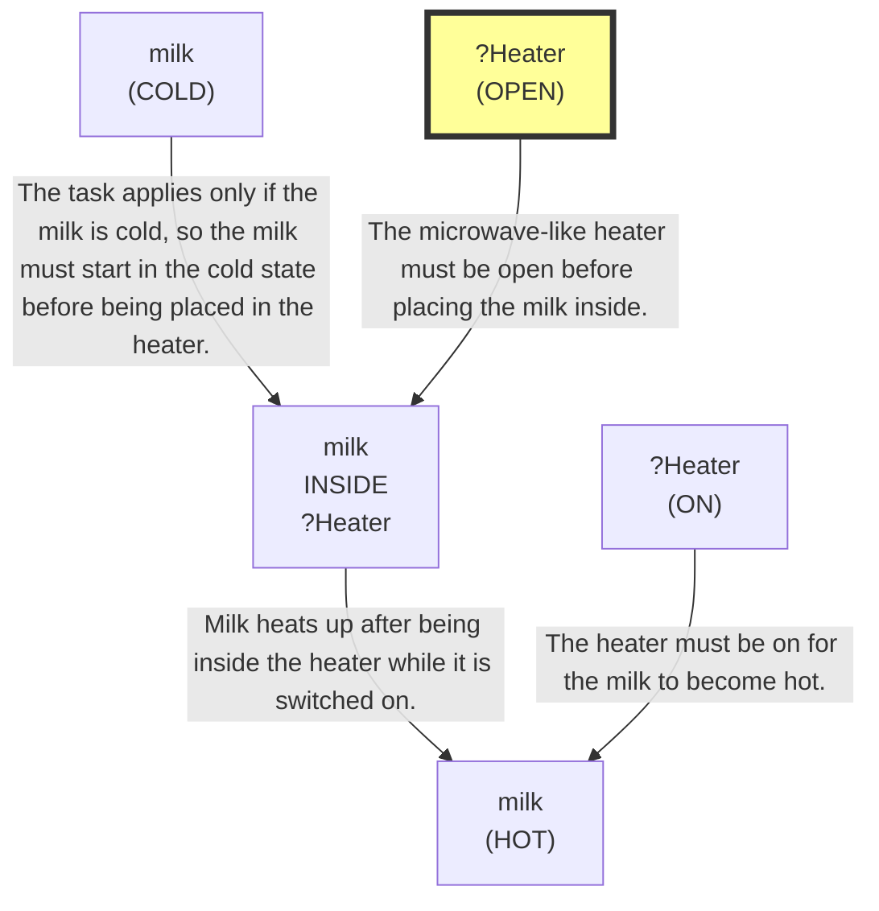
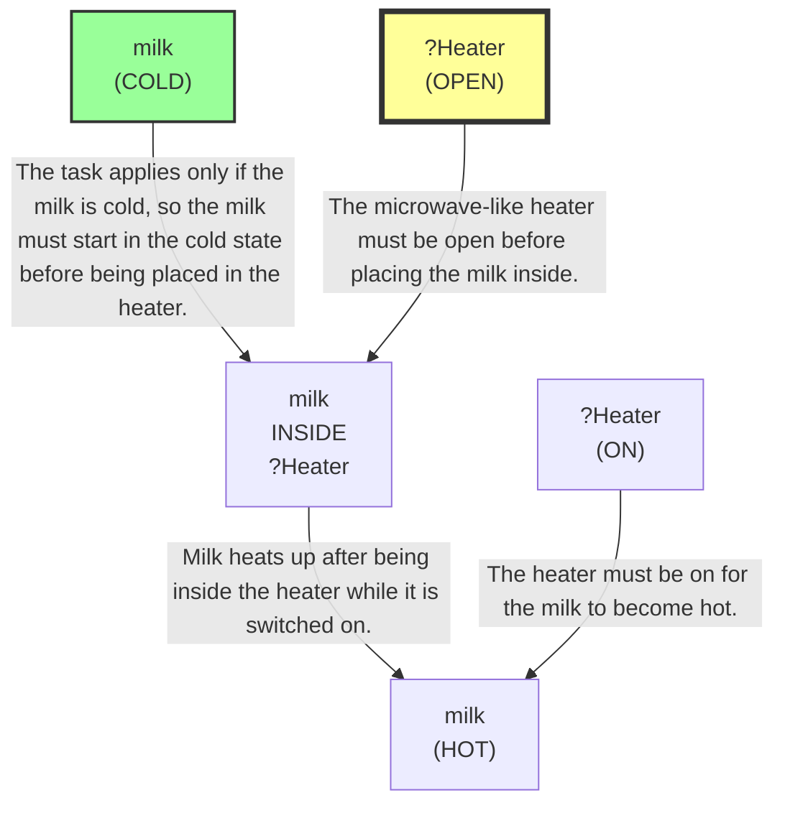
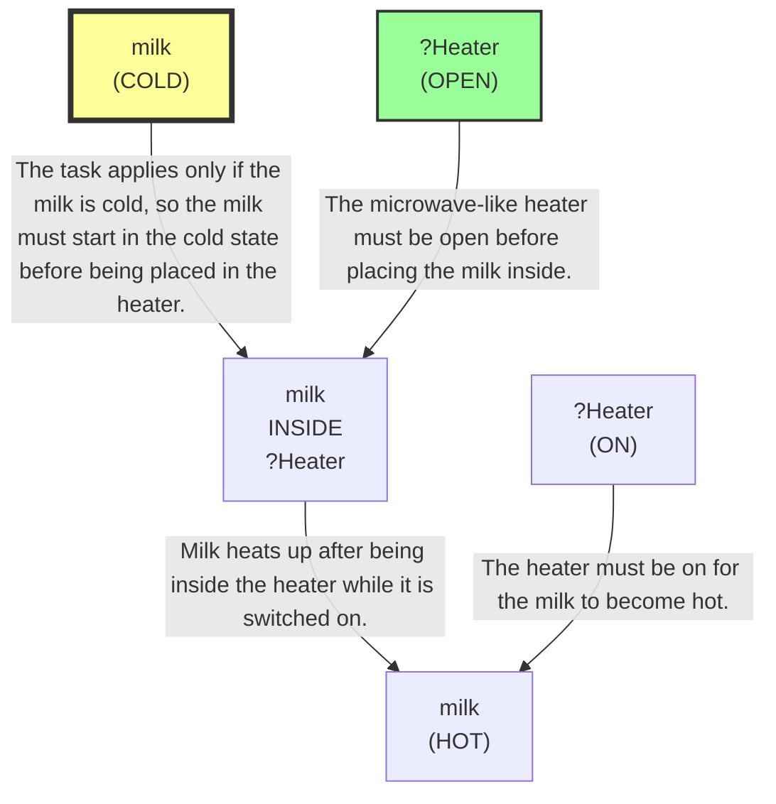
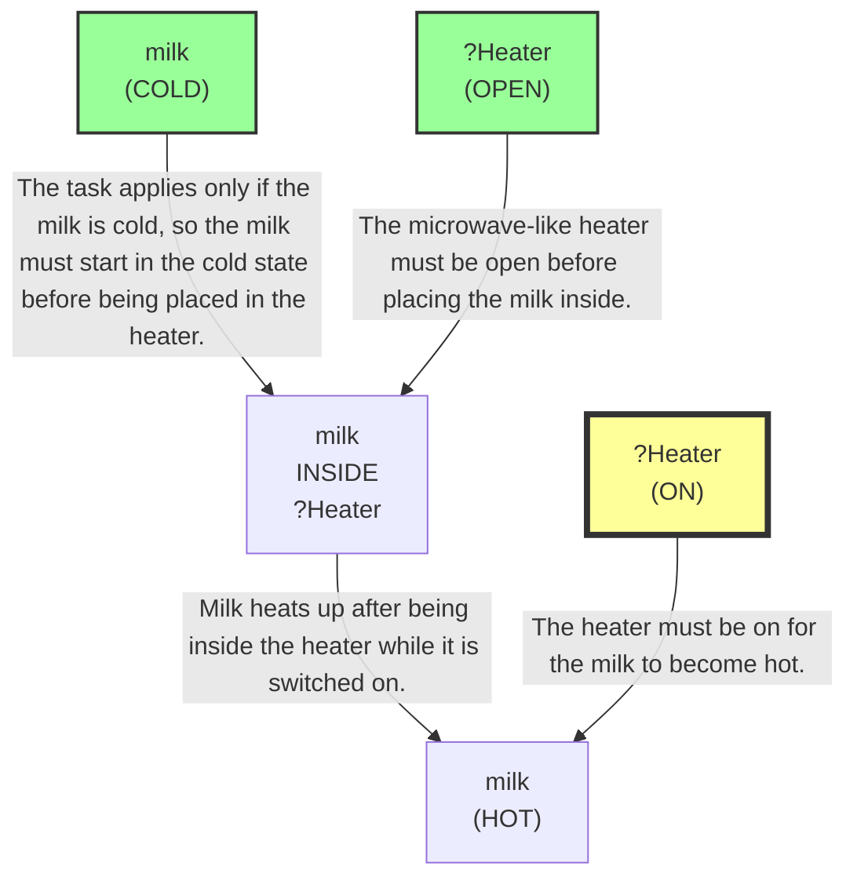
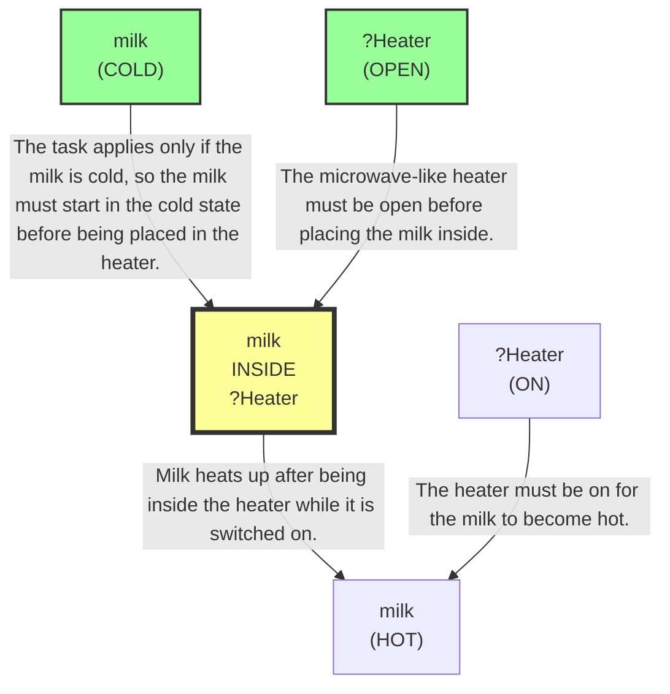
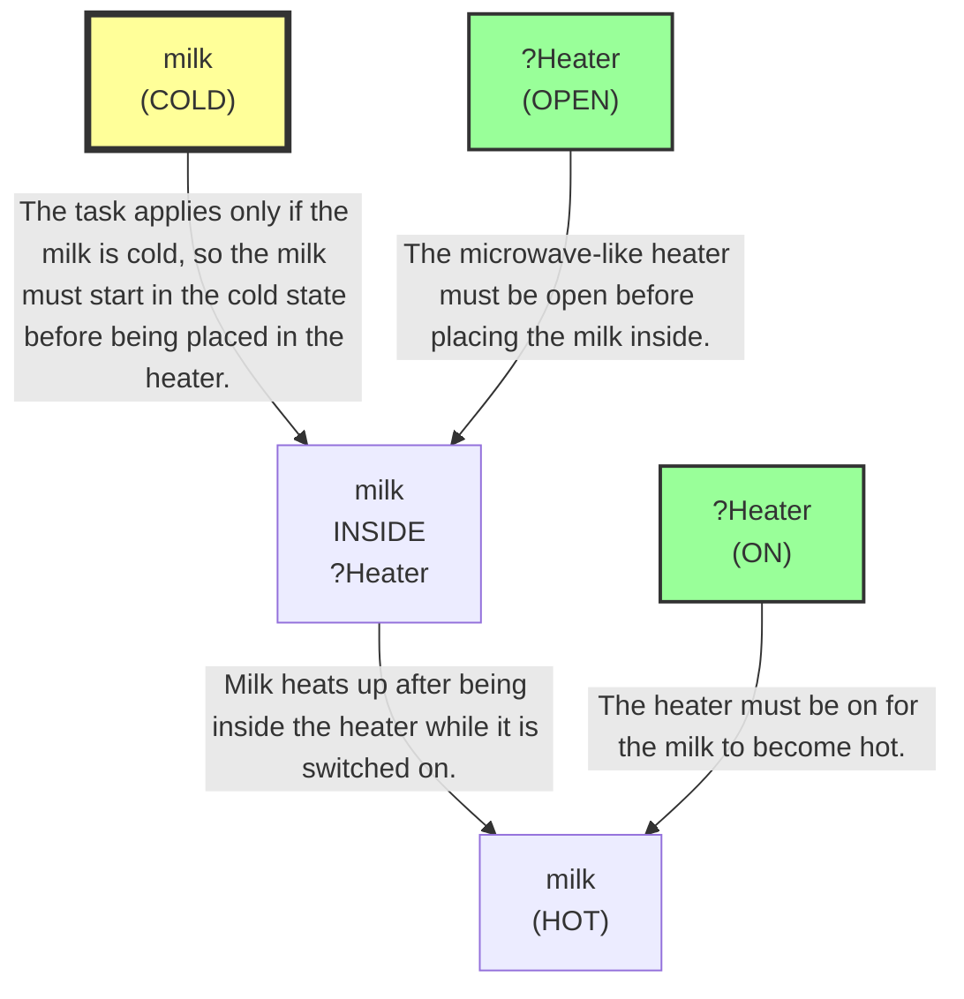
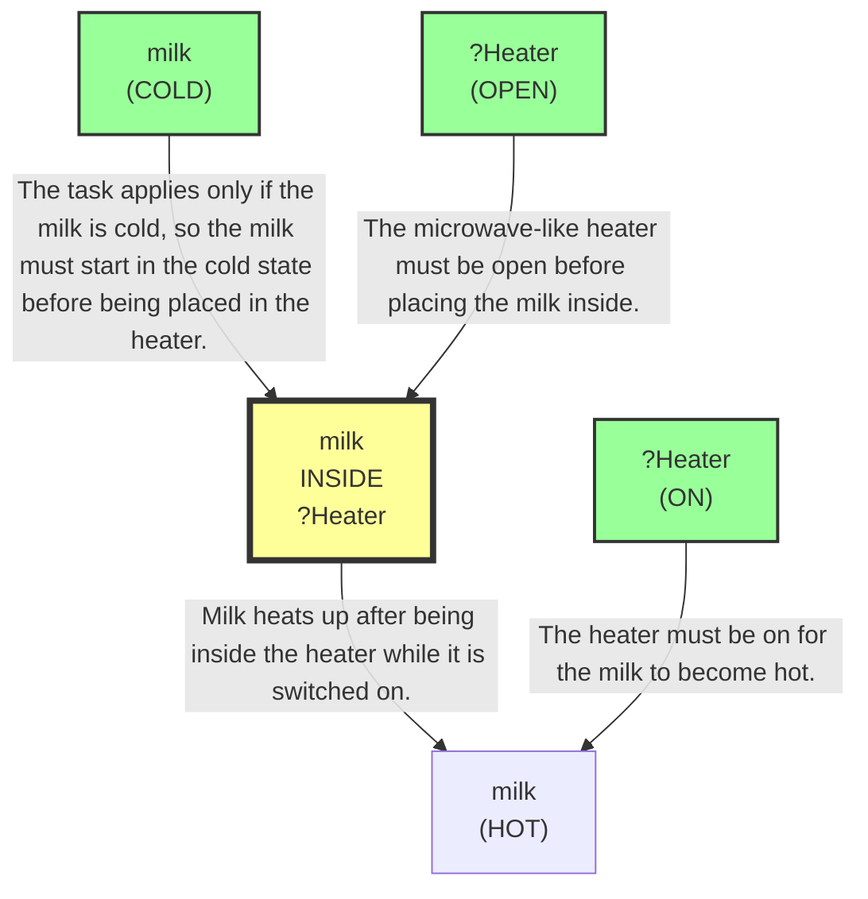
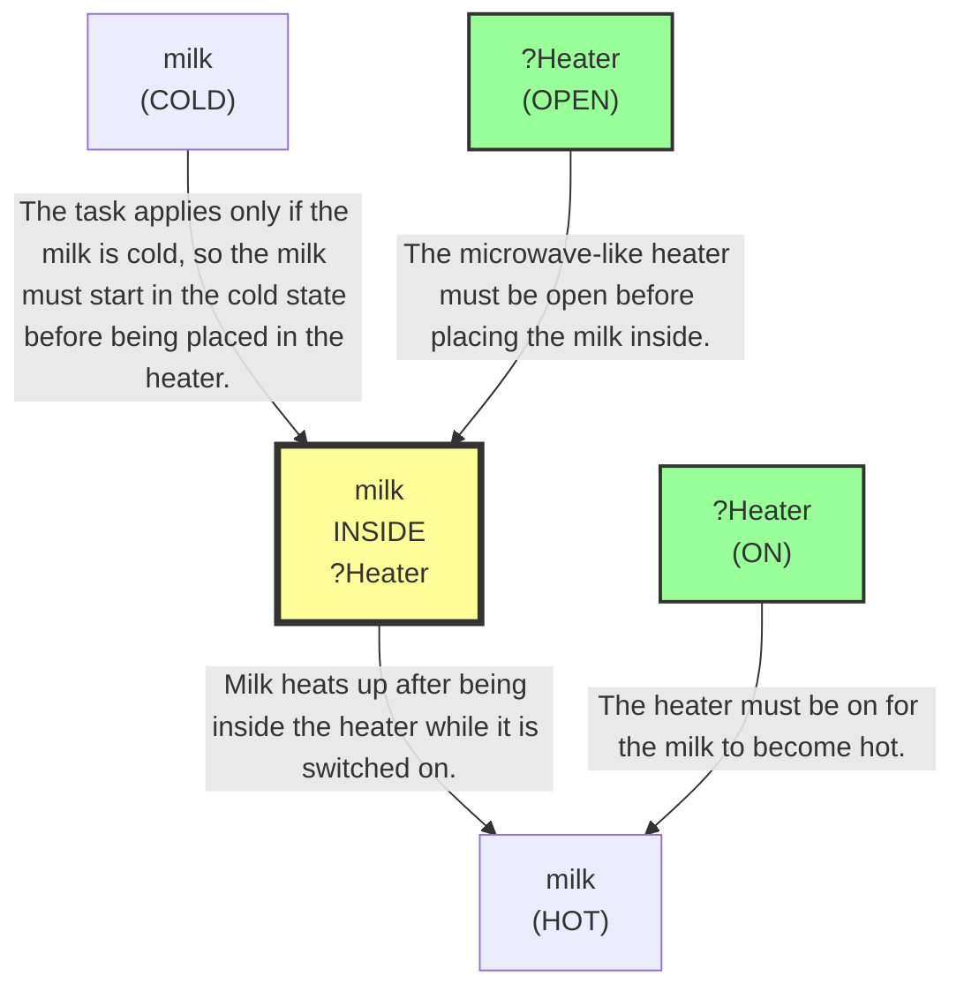

# 🚀 VirtualHome Agent Episode Log


### [GoalReasoner (Module A - Intent)] Output
```json
{
  "is_instruction_obviously_vague": false,
  "clarification_question": null,
  "target_object": "milk",
  "location_hint": null,
  "reasoning_chain": [
    {
      "question": "Why does the user want this object?",
      "answer": "To have the milk warmed up."
    },
    {
      "question": "Why is that important?",
      "answer": "Because the milk is cold and the user wants it heated."
    },
    {
      "question": "What fundamental need does this fulfill?",
      "answer": "It fulfills the need to obtain a drink at a desired warm temperature."
    },
    {
      "question": "Are there any deeper psychological or physical motivations?",
      "answer": "The user may want the drink to be more comfortable or suitable for immediate consumption."
    }
  ],
  "deep_intent": "The user wants a drink warmed to a comfortable temperature.",
  "acceptable_alternatives_properties": [
    {
      "priority": 1,
      "description": "Another cold drink that can be safely heated, such as a similar dairy or plant-based beverage."
    },
    {
      "priority": 2,
      "description": "Other liquid beverages intended to be served warm, such as coffee, tea, or hot chocolate."
    },
    {
      "priority": 3,
      "description": "Ready-to-heat drinkable liquids in a household environment."
    },
    {
      "priority": 4,
      "description": "A different warm beverage that satisfies the same need for a comforting heated drink."
    }
  ]
}
```

### [PerceptionFilter] Output
```json
{
  "reasoning": "Need the target milk plus a valid heater from the SDG. Since the heater is abstract (?Heater) and alternatives must be retained, include all visible appliances that can function as heating tools for a drink: microwave, stove, and coffeemaker. Milk must also be kept to perform the task.",
  "selected_classes": [
    "character",
    "milk",
    "stove",
    "microwave",
    "coffeemaker"
  ],
  "raw_class_count": 50
}
```

### [LLMExecutor] Output
```json
{
  "reasoning": "The goal requires milk to become HOT after being placed inside an open, ON heater. The Filtered Graph contains two milk instances: milk(176) is explicitly COLD, matching N1, while milk(177) is not marked cold. The microwave(171) is the best match for ?Heater because it is a movable appliance with CAN_OPEN, HAS_SWITCH, and HAS_PLUG, and it is currently CLOSED/OFF. Before any open/switch action, I must first walk to the heater due to the proximity rule. No prior actions exist, so navigation is the correct next step.",
  "satisfied_nodes": [],
  "current_node_focus": "N4",
  "mapped_variables": {
    "?Heater": "microwave(171)"
  },
  "action": "[walk] <microwave> (171)"
}
```

### [RoboStateMultiTaskController] Output
```json
{
  "action": "[walk] <microwave> (171)",
  "active_task_id": "task_1",
  "task_context": {
    "active_task_id": "task_1",
    "pending_task_ids": [],
    "satisfied_task_ids": []
  },
  "source": "llm_executor"
}
```
## Step 0
- **Action**: `[walk] <microwave> (171)`
- **Action Success**: `True`
- **Action Message**: {'0': {'message': 'Success'}}
- **Active Task**: `task_1`
- **Decision Source**: `llm_executor`
- **Task Progress**: T3_without_path_merging_M1_05=pending
- **SDG Status**:

- **Observed Items (11)**: stove(163) [OFF,CLOSED], coffeemaker(169) [OFF], microwave(171) [CLOSED,OFF], milk(177) [CLOSED], milk(176) [COLD,CLOSED], character(1), kitchen(11), livingroom(183), bedroom(241), bathroom(285), bedroom(346)


### [PerceptionFilter] Output
```json
{
  "reasoning": "Reused cached class selection.",
  "selected_classes": [
    "character",
    "milk",
    "stove",
    "microwave",
    "coffeemaker"
  ],
  "raw_class_count": 50
}
```

### [LLMExecutor] Output
```json
{
  "reasoning": "The goal is to heat milk in a heater. The current graph shows two milk instances near me, and only milk(176) is explicitly COLD, so it best matches N1. I am already close to the microwave(171), but it is CLOSED and OFF. Since the SDG requires the heater to be OPEN before inserting the milk, the next step is to open the microwave. I will focus on satisfying N4 first.",
  "satisfied_nodes": [
    "N1"
  ],
  "current_node_focus": "N4",
  "mapped_variables": {
    "?Heater": "microwave(171)"
  },
  "action": "[open] <microwave> (171)"
}
```

### [RoboStateMultiTaskController] Output
```json
{
  "action": "[open] <microwave> (171)",
  "active_task_id": "task_1",
  "task_context": {
    "active_task_id": "task_1",
    "pending_task_ids": [],
    "satisfied_task_ids": []
  },
  "source": "llm_executor"
}
```
## Step 1
- **Action**: `[open] <microwave> (171)`
- **Action Success**: `True`
- **Action Message**: {'0': {'message': 'Success'}}
- **Active Task**: `task_1`
- **Decision Source**: `llm_executor`
- **Task Progress**: T3_without_path_merging_M1_05=pending
- **SDG Status**:

- **Observed Items (11)**: stove(163) [OFF,CLOSED], coffeemaker(169) [OFF], microwave(171) [CLOSED,OFF], milk(177) [CLOSED], milk(176) [COLD,CLOSED], character(1), kitchen(11), livingroom(183), bedroom(241), bathroom(285), bedroom(346)


### [PerceptionFilter] Output
```json
{
  "reasoning": "Reused cached class selection.",
  "selected_classes": [
    "character",
    "milk",
    "stove",
    "microwave",
    "coffeemaker"
  ],
  "raw_class_count": 50
}
```

### [LLMExecutor] Output
```json
{
  "reasoning": "The SDG requires the milk to be COLD first, then placed inside an open heater while the heater is ON. The microwave is already open and currently OFF, and there are two milk instances: milk(176) is explicitly COLD, so it best satisfies N1. We are already close to milk(177), but not necessarily to milk(176); however, the next actionable prerequisite toward heating is to acquire the cold milk instance. Since the microwave is already open, I will move to the cold milk so it can be grabbed next.",
  "satisfied_nodes": [
    "N4"
  ],
  "current_node_focus": "N1",
  "mapped_variables": {
    "?Heater": "microwave(171)"
  },
  "action": "[walk] <milk> (176)"
}
```

### [RoboStateMultiTaskController] Output
```json
{
  "action": "[walk] <milk> (176)",
  "active_task_id": "task_1",
  "task_context": {
    "active_task_id": "task_1",
    "pending_task_ids": [],
    "satisfied_task_ids": []
  },
  "source": "llm_executor"
}
```
## Step 2
- **Action**: `[walk] <milk> (176)`
- **Action Success**: `True`
- **Action Message**: {'0': {'message': 'Success'}}
- **Active Task**: `task_1`
- **Decision Source**: `llm_executor`
- **Task Progress**: T3_without_path_merging_M1_05=pending
- **SDG Status**:

- **Observed Items (11)**: stove(163) [OFF,CLOSED], coffeemaker(169) [OFF], microwave(171) [OPEN,OFF], milk(177) [CLOSED], milk(176) [COLD,CLOSED], character(1), kitchen(11), livingroom(183), bedroom(241), bathroom(285), bedroom(346)


### [PerceptionFilter] Output
```json
{
  "reasoning": "Reused cached class selection.",
  "selected_classes": [
    "character",
    "milk",
    "stove",
    "microwave",
    "coffeemaker"
  ],
  "raw_class_count": 50
}
```

### [LLMExecutor] Output
```json
{
  "reasoning": "The milk target is identified as milk(176), which is explicitly COLD and already near the character, satisfying N1. The microwave heater is microwave(171), which is already OPEN but still OFF. To progress toward heating the milk, the next required prerequisite is to turn the heater ON. Since I am already at the microwave from the previous step and it has HAS_SWITCH, I should switch it on now.",
  "satisfied_nodes": [
    "N1",
    "N4"
  ],
  "current_node_focus": "N3",
  "mapped_variables": {
    "?Heater": "microwave(171)"
  },
  "action": "[switchon] <microwave> (171)"
}
```

### [RoboStateMultiTaskController] Output
```json
{
  "action": "[walk] <microwave> (171)",
  "active_task_id": "task_1",
  "task_context": {
    "active_task_id": "task_1",
    "pending_task_ids": [],
    "satisfied_task_ids": []
  },
  "source": "llm_executor_repaired"
}
```
## Step 3
- **Action**: `[walk] <microwave> (171)`
- **Action Success**: `True`
- **Action Message**: {'0': {'message': 'Success'}}
- **Active Task**: `task_1`
- **Decision Source**: `llm_executor_repaired`
- **Task Progress**: T3_without_path_merging_M1_05=pending
- **SDG Status**:

- **Observed Items (11)**: stove(163) [OFF,CLOSED], coffeemaker(169) [OFF], microwave(171) [OPEN,OFF], milk(177) [CLOSED], milk(176) [COLD,CLOSED], character(1), kitchen(11), livingroom(183), bedroom(241), bathroom(285), bedroom(346)


### [PerceptionFilter] Output
```json
{
  "reasoning": "Reused cached class selection.",
  "selected_classes": [
    "character",
    "milk",
    "stove",
    "microwave",
    "coffeemaker"
  ],
  "raw_class_count": 50
}
```

### [LLMExecutor] Output
```json
{
  "reasoning": "The microwave heater is already open and the milk object matching the SDG's required cold starting state is milk(176). The next prerequisite toward placing milk inside the heater is to be near the milk so it can be grabbed. I should not repeat a walk to the microwave because that was just done and the heater is already open.",
  "satisfied_nodes": [
    "N1",
    "N4"
  ],
  "current_node_focus": "N5",
  "mapped_variables": {
    "?Heater": "microwave(171)"
  },
  "action": "[walk] <milk> (176)"
}
```

### [RoboStateMultiTaskController] Output
```json
{
  "action": "[walk] <milk> (176)",
  "active_task_id": "task_1",
  "task_context": {
    "active_task_id": "task_1",
    "pending_task_ids": [],
    "satisfied_task_ids": []
  },
  "source": "llm_executor"
}
```
## Step 4
- **Action**: `[walk] <milk> (176)`
- **Action Success**: `True`
- **Action Message**: {'0': {'message': 'Success'}}
- **Active Task**: `task_1`
- **Decision Source**: `llm_executor`
- **Task Progress**: T3_without_path_merging_M1_05=pending
- **SDG Status**:

- **Observed Items (11)**: stove(163) [OFF,CLOSED], coffeemaker(169) [OFF], microwave(171) [OPEN,OFF], milk(177) [CLOSED], milk(176) [COLD,CLOSED], character(1), kitchen(11), livingroom(183), bedroom(241), bathroom(285), bedroom(346)


### [PerceptionFilter] Output
```json
{
  "reasoning": "Reused cached class selection.",
  "selected_classes": [
    "character",
    "milk",
    "stove",
    "microwave",
    "coffeemaker"
  ],
  "raw_class_count": 50
}
```

### [LLMExecutor] Output
```json
{
  "reasoning": "The goal requires milk to become HOT inside an open, switched-on heater. The microwave(171) is already OPEN but currently OFF. Since I am already positioned near it from the prior action history, the next progress-making step is to turn the heater ON before placing milk inside or waiting for heating.",
  "satisfied_nodes": [
    "N1",
    "N4"
  ],
  "current_node_focus": "N3",
  "mapped_variables": {
    "?Heater": "microwave(171)"
  },
  "action": "[switchon] <microwave> (171)"
}
```

### [RoboStateMultiTaskController] Output
```json
{
  "action": "[walk] <microwave> (171)",
  "active_task_id": "task_1",
  "task_context": {
    "active_task_id": "task_1",
    "pending_task_ids": [],
    "satisfied_task_ids": []
  },
  "source": "llm_executor_repaired"
}
```
## Step 5
- **Action**: `[walk] <microwave> (171)`
- **Action Success**: `True`
- **Action Message**: {'0': {'message': 'Success'}}
- **Active Task**: `task_1`
- **Decision Source**: `llm_executor_repaired`
- **Task Progress**: T3_without_path_merging_M1_05=pending
- **SDG Status**:

- **Observed Items (11)**: stove(163) [OFF,CLOSED], coffeemaker(169) [OFF], microwave(171) [OPEN,OFF], milk(177) [CLOSED], milk(176) [COLD,CLOSED], character(1), kitchen(11), livingroom(183), bedroom(241), bathroom(285), bedroom(346)


### [PerceptionFilter] Output
```json
{
  "reasoning": "Reused cached class selection.",
  "selected_classes": [
    "character",
    "milk",
    "stove",
    "microwave",
    "coffeemaker"
  ],
  "raw_class_count": 50
}
```

### [LLMExecutor] Output
```json
{
  "reasoning": "The SDG requires the milk to be placed inside an open heater and the heater switched on to make it hot. The microwave(171) is already open but still OFF, and the milk(176) is the cold milk instance matching N1. Since I am already close to the microwave and it is open, the next missing prerequisite is turning the heater on.",
  "satisfied_nodes": [
    "N1",
    "N4"
  ],
  "current_node_focus": "N3",
  "mapped_variables": {
    "?Heater": "microwave(171)"
  },
  "action": "[switchon] <microwave> (171)"
}
```

### [RoboStateMultiTaskController] Output
```json
{
  "action": "[switchon] <microwave> (171)",
  "active_task_id": "task_1",
  "task_context": {
    "active_task_id": "task_1",
    "pending_task_ids": [],
    "satisfied_task_ids": []
  },
  "source": "llm_executor"
}
```
## Step 6
- **Action**: `[switchon] <microwave> (171)`
- **Action Success**: `True`
- **Action Message**: Faked switch operation in Python layer (bypassed Unity failure)
- **Active Task**: `task_1`
- **Decision Source**: `llm_executor`
- **Task Progress**: T3_without_path_merging_M1_05=pending
- **SDG Status**:

- **Observed Items (11)**: stove(163) [OFF,CLOSED], coffeemaker(169) [OFF], microwave(171) [OPEN,OFF], milk(177) [CLOSED], milk(176) [COLD,CLOSED], character(1), kitchen(11), livingroom(183), bedroom(241), bathroom(285), bedroom(346)


### [PerceptionFilter] Output
```json
{
  "reasoning": "Reused cached class selection.",
  "selected_classes": [
    "character",
    "milk",
    "stove",
    "microwave",
    "coffeemaker"
  ],
  "raw_class_count": 50
}
```

### [LLMExecutor] Output
```json
{
  "reasoning": "The microwave heater is already open and on, satisfying N3 and N4. The remaining gap is that the cold milk (N1) must be placed inside the heater to reach the hot state (N2). I should act on the specific cold milk instance 176, which matches the required COLD state, and the next needed step is to grab it before it can be put into the microwave.",
  "satisfied_nodes": [
    "N3",
    "N4"
  ],
  "current_node_focus": "N1",
  "mapped_variables": {
    "?Heater": "microwave(171)"
  },
  "action": "[grab] <milk> (176)"
}
```

### [RoboStateMultiTaskController] Output
```json
{
  "action": "[walk] <milk> (176)",
  "active_task_id": "task_1",
  "task_context": {
    "active_task_id": "task_1",
    "pending_task_ids": [],
    "satisfied_task_ids": []
  },
  "source": "llm_executor_repaired"
}
```
## Step 7
- **Action**: `[walk] <milk> (176)`
- **Action Success**: `True`
- **Action Message**: {'0': {'message': 'Success'}}
- **Active Task**: `task_1`
- **Decision Source**: `llm_executor_repaired`
- **Task Progress**: T3_without_path_merging_M1_05=pending
- **SDG Status**:

- **Observed Items (11)**: stove(163) [OFF,CLOSED], coffeemaker(169) [OFF], microwave(171) [OPEN,ON], milk(177) [CLOSED], milk(176) [COLD,CLOSED], character(1), kitchen(11), livingroom(183), bedroom(241), bathroom(285), bedroom(346)


### [PerceptionFilter] Output
```json
{
  "reasoning": "Reused cached class selection.",
  "selected_classes": [
    "character",
    "milk",
    "stove",
    "microwave",
    "coffeemaker"
  ],
  "raw_class_count": 50
}
```

### [LLMExecutor] Output
```json
{
  "reasoning": "The heater node N4 (OPEN) is already satisfied by the microwave being open, and N3 (ON) is also satisfied because the microwave is on. The remaining gap is N5: the cold milk must be placed inside the open, powered microwave to transition to HOT. The current graph shows milk(176) is the cold milk candidate and it is close to the character, but not yet held. Since putting into a container requires holding the object first, the next atomic action should be to grab the milk after being near it. I will focus on the cold milk(176) instance because it matches N1 exactly.",
  "satisfied_nodes": [
    "N1",
    "N3",
    "N4"
  ],
  "current_node_focus": "N5",
  "mapped_variables": {
    "?Heater": "microwave(171)"
  },
  "action": "[grab] <milk> (176)"
}
```

### [RoboStateMultiTaskController] Output
```json
{
  "action": "[grab] <milk> (176)",
  "active_task_id": "task_1",
  "task_context": {
    "active_task_id": "task_1",
    "pending_task_ids": [],
    "satisfied_task_ids": []
  },
  "source": "llm_executor"
}
```
## Step 8
- **Action**: `[grab] <milk> (176)`
- **Action Success**: `False`
- **Action Message**: temporary_unavailable: target disappeared; wait or search and retry
- **Active Task**: `task_1`
- **Decision Source**: `llm_executor`
- **Task Progress**: T3_without_path_merging_M1_05=pending
- **SDG Status**:

- **Observed Items (11)**: stove(163) [OFF,CLOSED], coffeemaker(169) [OFF], microwave(171) [OPEN,ON], milk(177) [CLOSED], milk(176) [COLD,CLOSED], character(1), kitchen(11), livingroom(183), bedroom(241), bathroom(285), bedroom(346)


### [PerceptionFilter] Output
```json
{
  "reasoning": "Reused cached class selection.",
  "selected_classes": [
    "character",
    "milk",
    "stove",
    "microwave",
    "coffeemaker"
  ],
  "raw_class_count": 50
}
```

### [LLMExecutor] Output
```json
{
  "reasoning": "The heater (microwave 171) is already open and on, satisfying N3 and N4. The previous grab attempt on milk 176 failed because the target temporarily disappeared, and the current graph shows a milk 177 now present in the kitchen with the same relevant properties (drinkable, pourable, movable, can open) and no cold state yet shown. Since the task requires the milk to be inside the heater to become hot, the next step is to re-approach the available milk object so I can attempt to grab it again after confirming proximity. This avoids assuming the disappeared item is still reachable and follows the temporary-unavailable handling.",
  "satisfied_nodes": [
    "N3",
    "N4"
  ],
  "current_node_focus": "N5",
  "mapped_variables": {
    "?Heater": "microwave(171)"
  },
  "action": "[walk] <milk> (177)"
}
```

### [RoboStateMultiTaskController] Output
```json
{
  "action": "[walk] <milk> (177)",
  "active_task_id": "task_1",
  "task_context": {
    "active_task_id": "task_1",
    "pending_task_ids": [],
    "satisfied_task_ids": []
  },
  "source": "llm_executor"
}
```
## Step 9
- **Action**: `[walk] <milk> (177)`
- **Action Success**: `True`
- **Action Message**: {'0': {'message': 'Success'}}
- **Active Task**: `task_1`
- **Decision Source**: `llm_executor`
- **Task Progress**: T3_without_path_merging_M1_05=pending
- **SDG Status**:

- **Observed Items (11)**: stove(163) [OFF,CLOSED], coffeemaker(169) [OFF], microwave(171) [OPEN,ON], milk(177) [CLOSED], milk(176) [COLD,CLOSED], character(1), kitchen(11), livingroom(183), bedroom(241), bathroom(285), bedroom(346)


### [PerceptionFilter] Output
```json
{
  "reasoning": "Reused cached class selection.",
  "selected_classes": [
    "character",
    "milk",
    "stove",
    "microwave",
    "coffeemaker"
  ],
  "raw_class_count": 50
}
```

### [LLMExecutor] Output
```json
{
  "reasoning": "The microwave heater (171) is already OPEN and ON, satisfying N4 and N3. We attempted to grab milk(176) before and it temporarily disappeared, but the current graph now shows both milk(176) with COLD and milk(177) nearby. Since the task requires heating cold milk and the graph explicitly preserves a cold milk instance, the next required step is to get the milk into hand before placing it into the open microwave. Because the instruction says not to repeat a walk action if just done, and the most recent successful navigation was to milk(177), the immediate atomic next action is to grab the available milk instance. I will bind the target milk to the cold instance milk(176) because it satisfies N1.",
  "satisfied_nodes": [
    "N1",
    "N3",
    "N4"
  ],
  "current_node_focus": "N5",
  "mapped_variables": {
    "?Heater": "microwave(171)"
  },
  "action": "[grab] <milk> (176)"
}
```

### [RoboStateMultiTaskController] Output
```json
{
  "action": "[grab] <milk> (176)",
  "active_task_id": "task_1",
  "task_context": {
    "active_task_id": "task_1",
    "pending_task_ids": [],
    "satisfied_task_ids": []
  },
  "source": "llm_executor"
}
```
## Step 10
- **Action**: `[grab] <milk> (176)`
- **Action Success**: `False`
- **Action Message**: temporary_unavailable: target is temporarily hidden
- **Active Task**: `task_1`
- **Decision Source**: `llm_executor`
- **Task Progress**: T3_without_path_merging_M1_05=pending
- **SDG Status**:

- **Observed Items (11)**: stove(163) [OFF,CLOSED], coffeemaker(169) [OFF], microwave(171) [OPEN,ON], milk(177) [CLOSED], milk(176) [COLD,CLOSED], character(1), kitchen(11), livingroom(183), bedroom(241), bathroom(285), bedroom(346)


### [PerceptionFilter] Output
```json
{
  "reasoning": "Reused cached class selection.",
  "selected_classes": [
    "character",
    "milk",
    "stove",
    "microwave",
    "coffeemaker"
  ],
  "raw_class_count": 50
}
```

### [LLMExecutor] Output
```json
{
  "reasoning": "The microwave heater is already open and on, satisfying N3 and N4. The remaining gap is to get the cold milk into the microwave. The previous milk(176) became temporarily unavailable, but a second milk(177) is now visible, close to the character, and matches the required properties (drinkable, pourable, movable). I should align to this visible milk instance and retry by moving to it and grabbing it next. Since I just walked to milk(177) in the prior step, I should not repeat a walk; the next atomic action is to grab it.",
  "satisfied_nodes": [
    "N3",
    "N4"
  ],
  "current_node_focus": "N5",
  "mapped_variables": {
    "?Heater": "microwave(171)"
  },
  "action": "[grab] <milk> (177)"
}
```

### [RoboStateMultiTaskController] Output
```json
{
  "action": "[grab] <milk> (177)",
  "active_task_id": "task_1",
  "task_context": {
    "active_task_id": "task_1",
    "pending_task_ids": [],
    "satisfied_task_ids": []
  },
  "source": "llm_executor"
}
```
## Step 11
- **Action**: `[grab] <milk> (177)`
- **Action Success**: `True`
- **Action Message**: {'0': {'message': 'Success'}}
- **Active Task**: `task_1`
- **Decision Source**: `llm_executor`
- **Task Progress**: T3_without_path_merging_M1_05=pending
- **SDG Status**:

- **Observed Items (11)**: stove(163) [OFF,CLOSED], coffeemaker(169) [OFF], microwave(171) [OPEN,ON], milk(177) [CLOSED], milk(176) [COLD,CLOSED], character(1), kitchen(11), livingroom(183), bedroom(241), bathroom(285), bedroom(346)


### [PerceptionFilter] Output
```json
{
  "reasoning": "Reused cached class selection.",
  "selected_classes": [
    "character",
    "milk",
    "stove",
    "microwave",
    "coffeemaker"
  ],
  "raw_class_count": 50
}
```

### [LLMExecutor] Output
```json
{
  "reasoning": "The active task is to heat milk. The SDG requires the milk to be inside the microwave while it is open and on. Microwave(171) is already OPEN and ON, so N3 and N4 are satisfied. I am currently holding milk(177), which is a valid milk instance and is close to the character. The next missing prerequisite is to place the held milk into the already-open microwave, which will satisfy the INSIDE relation N5 and move toward the HOT state N2.",
  "satisfied_nodes": [
    "N3",
    "N4"
  ],
  "current_node_focus": "N5",
  "mapped_variables": {
    "?Heater": "microwave(171)"
  },
  "action": "[putin] <milk> (177) <microwave> (171)"
}
```

### [RoboStateMultiTaskController] Output
```json
{
  "action": "[putin] <milk> (177) <microwave> (171)",
  "active_task_id": "task_1",
  "task_context": {
    "active_task_id": "task_1",
    "pending_task_ids": [],
    "satisfied_task_ids": []
  },
  "source": "llm_executor"
}
```
## Step 12
- **Action**: `[putin] <milk> (177) <microwave> (171)`
- **Action Success**: `True`
- **Action Message**: {'0': {'message': 'Success'}}
- **Active Task**: `task_1`
- **Decision Source**: `llm_executor`
- **Task Progress**: T3_without_path_merging_M1_05=done
- **SDG Status**:

- **Observed Items (11)**: stove(163) [OFF,CLOSED], coffeemaker(169) [OFF], microwave(171) [OPEN,ON], milk(177) [CLOSED], milk(176) [COLD,CLOSED], character(1), kitchen(11), livingroom(183), bedroom(241), bathroom(285), bedroom(346)

