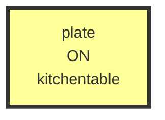

# 🚀 VirtualHome Agent Episode Log


### [GoalReasoner (Module A - Intent)] Output
```json
{
  "is_instruction_obviously_vague": false,
  "clarification_question": null,
  "target_object": "plate",
  "location_hint": "kitchentable",
  "reasoning_chain": [
    {
      "question": "Why does the user want this object?",
      "answer": "They want the used plate relocated to the kitchen table."
    },
    {
      "question": "Why is that important?",
      "answer": "It likely helps clear the current area and place the plate where it should be for the next step, such as cleanup or reuse."
    },
    {
      "question": "What fundamental need does this fulfill?",
      "answer": "It fulfills the need to organize or clear dining items after use."
    },
    {
      "question": "Are there any deeper psychological or physical motivations?",
      "answer": "The user may want to reduce clutter, prepare for cleaning, or keep the used dish in an appropriate household location."
    }
  ],
  "deep_intent": "The user wants to organize or clear a used dining item by placing it in an appropriate household location.",
  "acceptable_alternatives_properties": [
    {
      "priority": 1,
      "description": "Other used dining items, such as a bowl, cup, or utensil, placed on the kitchen table"
    },
    {
      "priority": 2,
      "description": "Other tableware or dishes that have just been used and need to be set down in the kitchen area"
    },
    {
      "priority": 3,
      "description": "Any washable food-related items that belong with other used dishes for later cleanup"
    },
    {
      "priority": 4,
      "description": "Other household items that need to be moved off the current surface to clear space"
    }
  ]
}
```

### [PerceptionFilter] Output
```json
{
  "reasoning": "The goal is to place a used plate on the kitchen table. The SDG explicitly requires the plate and kitchentable, and the only necessary location/receptacle is the kitchen table itself. No additional tools are required for this relocation task.",
  "selected_classes": [
    "plate",
    "character",
    "kitchentable"
  ],
  "raw_class_count": 50
}
```

### [LLMExecutor] Output
```json
{
  "reasoning": "The SDG requires a plate to be ON the kitchentable. In the current graph, plate(75) is already ON kitchentable(135) and is close to the character, so the goal node is satisfied without any further action. I should not manipulate other plates because only the active task matters.",
  "satisfied_nodes": [
    "N1"
  ],
  "current_node_focus": "N1",
  "mapped_variables": {
    "?TargetPlate": "plate(75)",
    "?DestinationTable": "kitchentable(135)"
  },
  "action": "[wait]"
}
```

### [RoboStateMultiTaskController] Output
```json
{
  "action": "[wait]",
  "active_task_id": "task_1",
  "task_context": {
    "active_task_id": "task_1",
    "pending_task_ids": [],
    "satisfied_task_ids": []
  },
  "source": "llm_executor"
}
```
## Step 0
- **Action**: `[wait]`
- **Action Success**: `True`
- **Action Message**: Time passes. You waited for a while.
- **Active Task**: `task_1`
- **Decision Source**: `llm_executor`
- **Task Progress**: T3_without_path_merging_M4_18=pending
- **SDG Status**:

- **Observed Items (17)**: plate(75), plate(76), plate(83), plate(84), plate(91), plate(103), plate(104), kitchentable(131), kitchentable(135), character(1), plate(67), plate(68), kitchen(11), livingroom(183), bedroom(241)...


### [PerceptionFilter] Output
```json
{
  "reasoning": "Reused cached class selection.",
  "selected_classes": [
    "plate",
    "character",
    "kitchentable"
  ],
  "raw_class_count": 50
}
```

### [LLMExecutor] Output
```json
{
  "reasoning": "The SDG requires a plate to be ON the kitchen table. Plate(75) is already on kitchentable(135), which is a valid instance of kitchentable in the current graph, so the goal condition is already satisfied for this task.",
  "satisfied_nodes": [
    "N1"
  ],
  "current_node_focus": "N1",
  "mapped_variables": {
    "?TargetPlate": "plate(75)",
    "?KitchenTable": "kitchentable(135)"
  },
  "action": "[wait]"
}
```

### [RoboStateMultiTaskController] Output
```json
{
  "action": "[wait]",
  "active_task_id": "task_1",
  "task_context": {
    "active_task_id": "task_1",
    "pending_task_ids": [],
    "satisfied_task_ids": []
  },
  "source": "llm_executor"
}
```
## Step 1
- **Action**: `[wait]`
- **Action Success**: `True`
- **Action Message**: Time passes. You waited for a while.
- **Active Task**: `task_1`
- **Decision Source**: `llm_executor`
- **Task Progress**: T3_without_path_merging_M4_18=pending
- **SDG Status**:

- **Observed Items (17)**: plate(75), plate(76), plate(83), plate(84), plate(91), plate(103), plate(104), kitchentable(131), kitchentable(135), character(1), plate(67), plate(68), kitchen(11), livingroom(183), bedroom(241)...


### [PerceptionFilter] Output
```json
{
  "reasoning": "Reused cached class selection.",
  "selected_classes": [
    "plate",
    "character",
    "kitchentable"
  ],
  "raw_class_count": 50
}
```

### [LLMExecutor] Output
```json
{
  "reasoning": "The SDG requires a plate to be ON the kitchen table. The current graph already shows plate(75) is on kitchentable(135), and it is close to the character, so the goal node is satisfied. No further physical action is needed for the active task.",
  "satisfied_nodes": [
    "N1"
  ],
  "current_node_focus": "N1",
  "mapped_variables": {},
  "action": "[wait]"
}
```

### [RoboStateMultiTaskController] Output
```json
{
  "action": "[wait]",
  "active_task_id": "task_1",
  "task_context": {
    "active_task_id": "task_1",
    "pending_task_ids": [],
    "satisfied_task_ids": []
  },
  "source": "llm_executor"
}
```
## Step 2
- **Action**: `[wait]`
- **Action Success**: `True`
- **Action Message**: Time passes. You waited for a while.
- **Active Task**: `task_1`
- **Decision Source**: `llm_executor`
- **Task Progress**: T3_without_path_merging_M4_18=pending
- **SDG Status**:

- **Observed Items (17)**: plate(75), plate(76), plate(83), plate(84), plate(91), plate(103), plate(104), kitchentable(131), kitchentable(135), character(1), plate(67), plate(68), kitchen(11), livingroom(183), bedroom(241)...


### [PerceptionFilter] Output
```json
{
  "reasoning": "Reused cached class selection.",
  "selected_classes": [
    "plate",
    "character",
    "kitchentable"
  ],
  "raw_class_count": 50
}
```

### [LLMExecutor] Output
```json
{
  "reasoning": "The SDG goal is to have a plate ON the kitchentable. The current graph already shows plate(75) is on kitchentable(135) and is close to the character, so the goal node N1 is already satisfied. No physical action is needed for the active task, and we should not manipulate any plate further.",
  "satisfied_nodes": [
    "N1"
  ],
  "current_node_focus": "N1",
  "mapped_variables": {},
  "action": "[wait]"
}
```

### [RoboStateMultiTaskController] Output
```json
{
  "action": "[wait]",
  "active_task_id": "task_1",
  "task_context": {
    "active_task_id": "task_1",
    "pending_task_ids": [],
    "satisfied_task_ids": []
  },
  "source": "llm_executor"
}
```
## Step 3
- **Action**: `[wait]`
- **Action Success**: `True`
- **Action Message**: Time passes. You waited for a while.
- **Active Task**: `task_1`
- **Decision Source**: `llm_executor`
- **Task Progress**: T3_without_path_merging_M4_18=pending
- **SDG Status**:

- **Observed Items (17)**: plate(75), plate(76), plate(83), plate(84), plate(91), plate(103), plate(104), kitchentable(131), kitchentable(135), character(1), plate(67), plate(68), kitchen(11), livingroom(183), bedroom(241)...


### [PerceptionFilter] Output
```json
{
  "reasoning": "Reused cached class selection.",
  "selected_classes": [
    "plate",
    "character",
    "kitchentable"
  ],
  "raw_class_count": 50
}
```

### [LLMExecutor] Output
```json
{
  "reasoning": "The active goal is to get a plate onto the kitchen table. The current graph already shows plate(75) on kitchentable(135), which satisfies N1 directly. No further action is needed to make progress toward the active task, and repeating a walk or manipulation would be unnecessary.",
  "satisfied_nodes": [
    "N1"
  ],
  "current_node_focus": "N1",
  "mapped_variables": {},
  "action": "[wait]"
}
```

### [RoboStateMultiTaskController] Output
```json
{
  "action": "[wait]",
  "active_task_id": "task_1",
  "task_context": {
    "active_task_id": "task_1",
    "pending_task_ids": [],
    "satisfied_task_ids": []
  },
  "source": "llm_executor"
}
```
