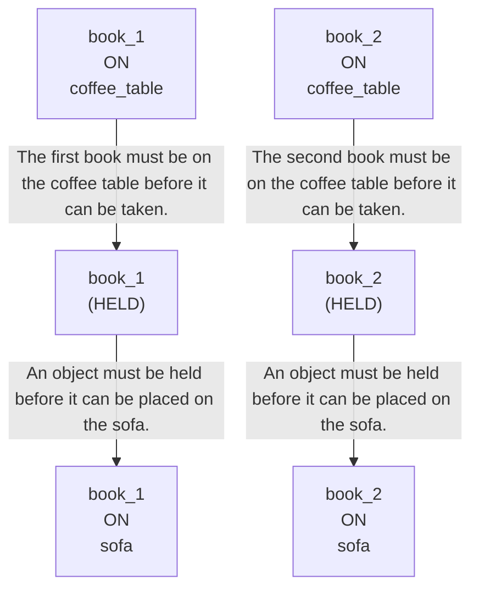
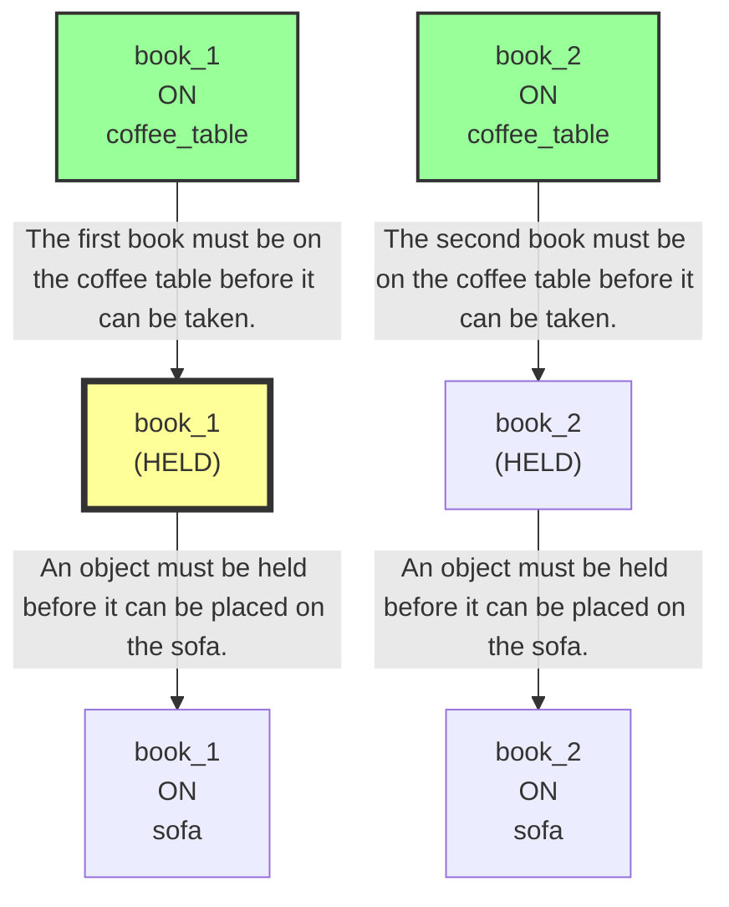
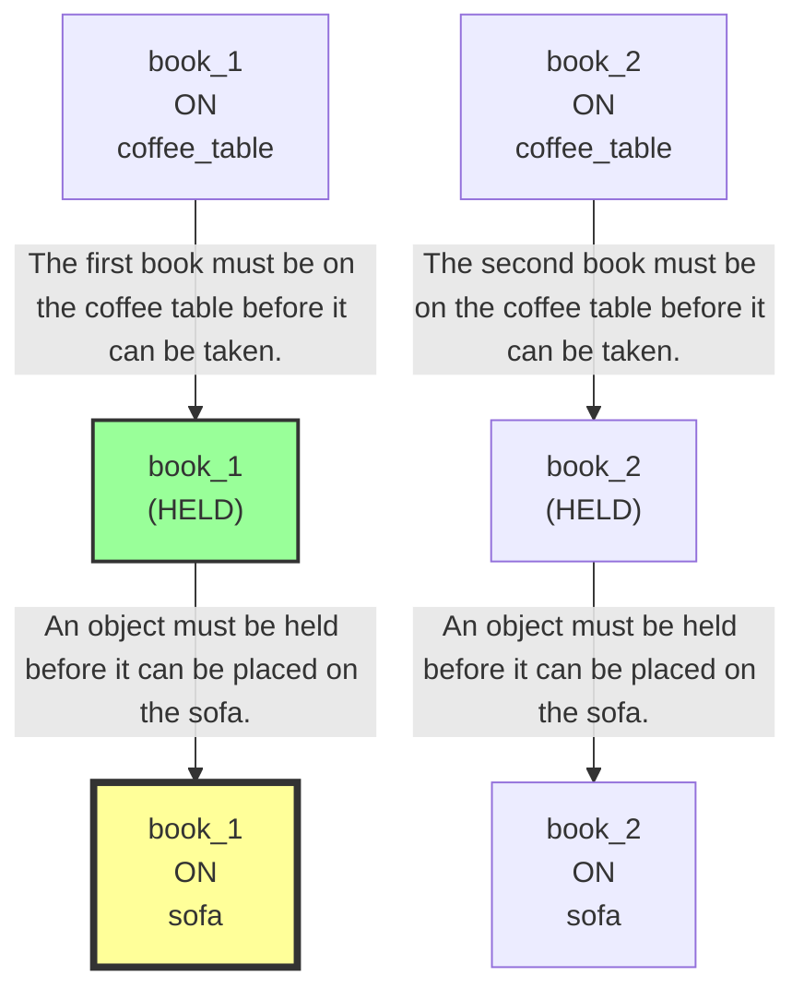
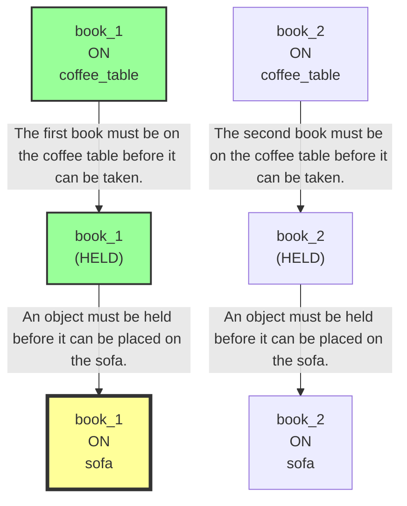
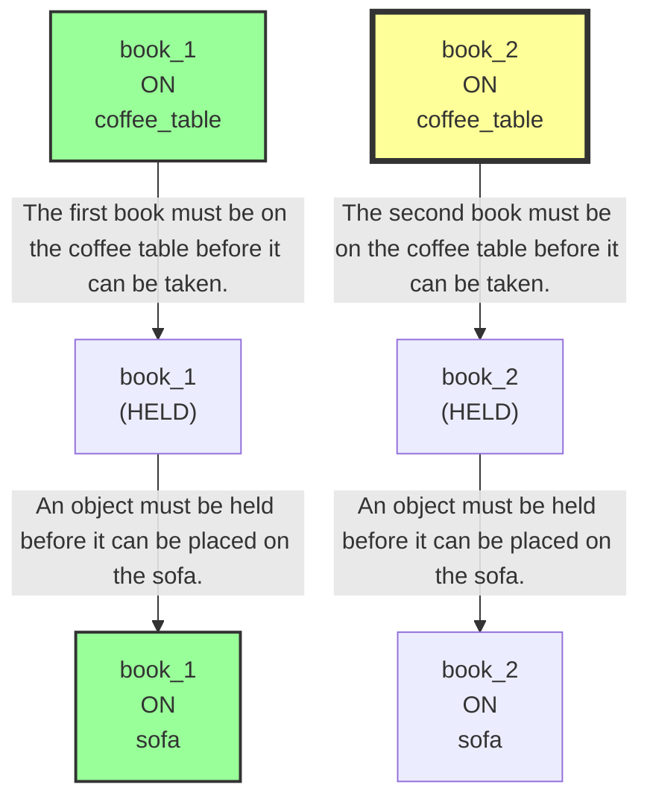
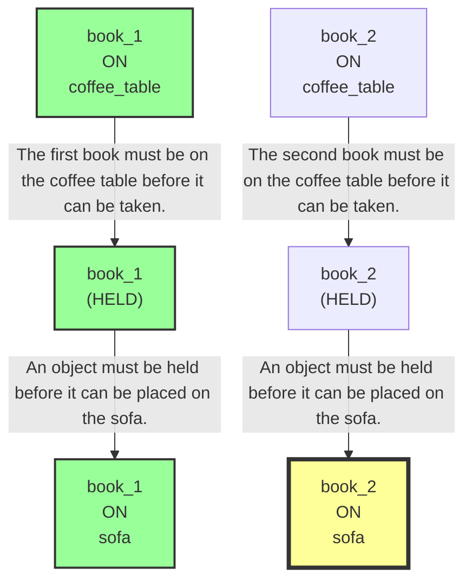

# 🚀 VirtualHome Agent Episode Log


### [GoalReasoner (Module A - Intent)] Output
```json
{
  "is_instruction_obviously_vague": false,
  "clarification_question": null,
  "target_object": "books",
  "location_hint": "coffee table",
  "reasoning_chain": [
    {
      "question": "Why does the user want this object?",
      "answer": "To move the books from the coffee table to the sofa."
    },
    {
      "question": "Why is that important?",
      "answer": "To relocate the books to the desired resting place or nearby area."
    },
    {
      "question": "What fundamental need does this fulfill?",
      "answer": "The user wants objects transferred from one household surface to another."
    },
    {
      "question": "Are there any deeper psychological or physical motivations?",
      "answer": "Possibly to organize the space, clear the coffee table, or make the books easier to access on the sofa."
    }
  ],
  "deep_intent": "The user wants to relocate items within the room for organization or convenience.",
  "acceptable_alternatives_properties": [
    {
      "priority": 1,
      "description": "Other small, easily carried household items that can be moved from the coffee table to the sofa."
    },
    {
      "priority": 2,
      "description": "Other reading materials or lightweight personal items found on the coffee table."
    },
    {
      "priority": 3,
      "description": "General clutter items on the coffee table that can be safely transferred to the sofa."
    },
    {
      "priority": 4,
      "description": "Any portable household objects that need to be moved to clear or reorganize the coffee table."
    }
  ]
}
```

### [RoboStateMultiTaskController] Output
```json
{
  "action": "[walk] <bathroom> (11)",
  "active_task_id": "task_1",
  "task_context": {
    "active_task_id": "task_1",
    "pending_task_ids": [],
    "satisfied_task_ids": []
  },
  "source": "room_frontier"
}
```
## Step 0
- **Action**: `[walk] <bathroom> (11)`
- **Action Success**: `True`
- **Action Message**: {'0': {'message': 'Success'}}
- **Active Task**: `task_1`
- **Decision Source**: `room_frontier`
- **Task Progress**: T3_without_path_merging_P2_10=pending
- **SDG Status**:

- **Observed Items (79)**: floor(336), floor(337), floor(338), floor(339), floor(340), floor(341), floor(342), floor(343), floor(344), wall(345), wall(346), wall(347), wall(348), wall(349), wall(350)...


### [RoboStateMultiTaskController] Output
```json
{
  "action": "[walk] <bedroom> (73)",
  "active_task_id": "task_1",
  "task_context": {
    "active_task_id": "task_1",
    "pending_task_ids": [],
    "satisfied_task_ids": []
  },
  "source": "room_frontier"
}
```
## Step 1
- **Action**: `[walk] <bedroom> (73)`
- **Action Success**: `True`
- **Action Message**: {'0': {'message': 'Success'}}
- **Active Task**: `task_1`
- **Decision Source**: `room_frontier`
- **Task Progress**: T3_without_path_merging_P2_10=pending
- **SDG Status**:

- **Observed Items (140)**: floor(336), floor(337), floor(338), floor(339), floor(340), floor(341), floor(342), floor(343), floor(344), wall(345), wall(346), wall(347), wall(348), wall(349), wall(350)...


### [PerceptionFilter] Output
```json
{
  "reasoning": "The goal is to move books from the coffee table to the sofa. The SDG requires the books themselves plus the source and destination locations to identify the correct items and placement surfaces. No extra tools are needed for simply carrying and placing books.",
  "selected_classes": [
    "sofa",
    "character",
    "coffeetable",
    "book"
  ],
  "raw_class_count": 70
}
```

### [LLMExecutor] Output
```json
{
  "reasoning": "The active SDG requires moving two books from the coffee table to the sofa. Both book_1 and book_2 are currently on coffeetable(111), and the character is already close to them. To start satisfying the first prerequisite chain, I should grab one of the books first. I will bind book_1 to the book closest to the task intent, which is book(190), and pick it up before moving it to the sofa.",
  "satisfied_nodes": [
    "N1",
    "N2"
  ],
  "current_node_focus": "N3",
  "mapped_variables": {
    "book_1": "book(190)",
    "book_2": "book(191)"
  },
  "action": "[grab] <book> (190)"
}
```

### [RoboStateMultiTaskController] Output
```json
{
  "action": "[grab] <book> (190)",
  "active_task_id": "task_1",
  "task_context": {
    "active_task_id": "task_1",
    "pending_task_ids": [],
    "satisfied_task_ids": []
  },
  "source": "llm_executor"
}
```
## Step 2
- **Action**: `[grab] <book> (190)`
- **Action Success**: `True`
- **Action Message**: {'0': {'message': 'Success'}}
- **Active Task**: `task_1`
- **Decision Source**: `llm_executor`
- **Task Progress**: T3_without_path_merging_P2_10=pending
- **SDG Status**:

- **Observed Items (10)**: sofa(368), coffeetable(371), character(1), bathroom(11), bedroom(73), kitchen(205), livingroom(335), coffeetable(111), book(190) [CLOSED], book(191) [CLOSED]


### [PerceptionFilter] Output
```json
{
  "reasoning": "Reused cached class selection.",
  "selected_classes": [
    "sofa",
    "character",
    "coffeetable",
    "book"
  ],
  "raw_class_count": 70
}
```

### [LLMExecutor] Output
```json
{
  "reasoning": "We already hold book(190) in the right hand, satisfying the first book's held-state prerequisite. The sofa(368) is nearby in the living room, so the next atomic step toward placing the book on the sofa is to move to the sofa before any putback action. The second book on the coffee table remains for later. Since the SDG's next required transition for book_1 is from HELD to ON sofa, I should walk to the sofa now.",
  "satisfied_nodes": [
    "N3"
  ],
  "current_node_focus": "N5",
  "mapped_variables": {
    "?Destination": "sofa(368)",
    "?Book1": "book(190)",
    "?Book2": "book(191)"
  },
  "action": "[walk] <sofa> (368)"
}
```

### [RoboStateMultiTaskController] Output
```json
{
  "action": "[walk] <sofa> (368)",
  "active_task_id": "task_1",
  "task_context": {
    "active_task_id": "task_1",
    "pending_task_ids": [],
    "satisfied_task_ids": []
  },
  "source": "llm_executor"
}
```
## Step 3
- **Action**: `[walk] <sofa> (368)`
- **Action Success**: `True`
- **Action Message**: {'0': {'message': 'Success'}}
- **Active Task**: `task_1`
- **Decision Source**: `llm_executor`
- **Task Progress**: T3_without_path_merging_P2_10=pending
- **SDG Status**:

- **Observed Items (10)**: sofa(368), coffeetable(371), character(1), bathroom(11), bedroom(73), kitchen(205), livingroom(335), coffeetable(111), book(190) [CLOSED], book(191) [CLOSED]


### [PerceptionFilter] Output
```json
{
  "reasoning": "Reused cached class selection.",
  "selected_classes": [
    "sofa",
    "character",
    "coffeetable",
    "book"
  ],
  "raw_class_count": 70
}
```

### [LLMExecutor] Output
```json
{
  "reasoning": "Book_1 is already held in the right hand and the sofa is close, so the next step in the SDG is to place book_1 onto the sofa to satisfy N5. The filtered graph shows sofa(368) is a valid flat surface and we are already close to it, so no additional walk is needed before putting it back.",
  "satisfied_nodes": [
    "N1",
    "N3"
  ],
  "current_node_focus": "N5",
  "mapped_variables": {
    "?TargetSurface": "sofa(368)"
  },
  "action": "[putback] <book> (190) <sofa> (368)"
}
```

### [RoboStateMultiTaskController] Output
```json
{
  "action": "[putback] <book> (190) <sofa> (368)",
  "active_task_id": "task_1",
  "task_context": {
    "active_task_id": "task_1",
    "pending_task_ids": [],
    "satisfied_task_ids": []
  },
  "source": "llm_executor"
}
```
## Step 4
- **Action**: `[putback] <book> (190) <sofa> (368)`
- **Action Success**: `True`
- **Action Message**: {'0': {'message': 'Success'}}
- **Active Task**: `task_1`
- **Decision Source**: `llm_executor`
- **Task Progress**: T3_without_path_merging_P2_10=pending
- **SDG Status**:

- **Observed Items (10)**: sofa(368), coffeetable(371), character(1), bathroom(11), bedroom(73), kitchen(205), livingroom(335), coffeetable(111), book(190) [CLOSED], book(191) [CLOSED]


### [PerceptionFilter] Output
```json
{
  "reasoning": "Reused cached class selection.",
  "selected_classes": [
    "sofa",
    "character",
    "coffeetable",
    "book"
  ],
  "raw_class_count": 70
}
```

### [LLMExecutor] Output
```json
{
  "reasoning": "The prior book_1 task appears partially satisfied by book(190) already being on the sofa, but the active SDG requires two books moved from the coffee table to the sofa. The current graph shows book(191) is on coffeetable(111) and close to the character, so the next required prerequisite is to pick up book_191. I will bind the second book requirement to book(191) because it is the only remaining book currently on a coffee table and it matches the needed relation N2.",
  "satisfied_nodes": [
    "N1",
    "N5"
  ],
  "current_node_focus": "N2",
  "mapped_variables": {
    "?Book2": "book(191)",
    "?Destination": "sofa(368)"
  },
  "action": "[grab] <book> (191)"
}
```

### [RoboStateMultiTaskController] Output
```json
{
  "action": "[grab] <book> (191)",
  "active_task_id": "task_1",
  "task_context": {
    "active_task_id": "task_1",
    "pending_task_ids": [],
    "satisfied_task_ids": []
  },
  "source": "llm_executor"
}
```
## Step 5
- **Action**: `[grab] <book> (191)`
- **Action Success**: `True`
- **Action Message**: {'0': {'message': 'Success'}}
- **Active Task**: `task_1`
- **Decision Source**: `llm_executor`
- **Task Progress**: T3_without_path_merging_P2_10=pending
- **SDG Status**:

- **Observed Items (10)**: sofa(368), coffeetable(371), character(1), bathroom(11), bedroom(73), kitchen(205), livingroom(335), coffeetable(111), book(190) [CLOSED], book(191) [CLOSED]


### [PerceptionFilter] Output
```json
{
  "reasoning": "Reused cached class selection.",
  "selected_classes": [
    "sofa",
    "character",
    "coffeetable",
    "book"
  ],
  "raw_class_count": 70
}
```

### [LLMExecutor] Output
```json
{
  "reasoning": "The current goal is to move two books from the coffee table to the sofa. Book_1 has already been satisfied in practice by book(190) being on the sofa and held/handled earlier, but the SDG specifically requires book_2 to be held then placed on the sofa. The current graph shows book(191) is already close to the character and being held in the right hand, so the next atomic step should be to place it onto the sofa. The sofa is a flat surface, and the robot is already close to it from prior steps, so the correct next action is to put the held book onto the sofa.",
  "satisfied_nodes": [
    "N1",
    "N3",
    "N5"
  ],
  "current_node_focus": "N6",
  "mapped_variables": {},
  "action": "[putback] <book> (191) <sofa> (368)"
}
```

### [RoboStateMultiTaskController] Output
```json
{
  "action": "[putback] <book> (191) <sofa> (368)",
  "active_task_id": "task_1",
  "task_context": {
    "active_task_id": "task_1",
    "pending_task_ids": [],
    "satisfied_task_ids": []
  },
  "source": "llm_executor"
}
```
## Step 6
- **Action**: `[putback] <book> (191) <sofa> (368)`
- **Action Success**: `True`
- **Action Message**: {'0': {'message': 'Success'}}
- **Active Task**: `task_1`
- **Decision Source**: `llm_executor`
- **Task Progress**: T3_without_path_merging_P2_10=done
- **SDG Status**:

- **Observed Items (10)**: sofa(368), coffeetable(371), character(1), bathroom(11), bedroom(73), kitchen(205), livingroom(335), coffeetable(111), book(190) [CLOSED], book(191) [CLOSED]

