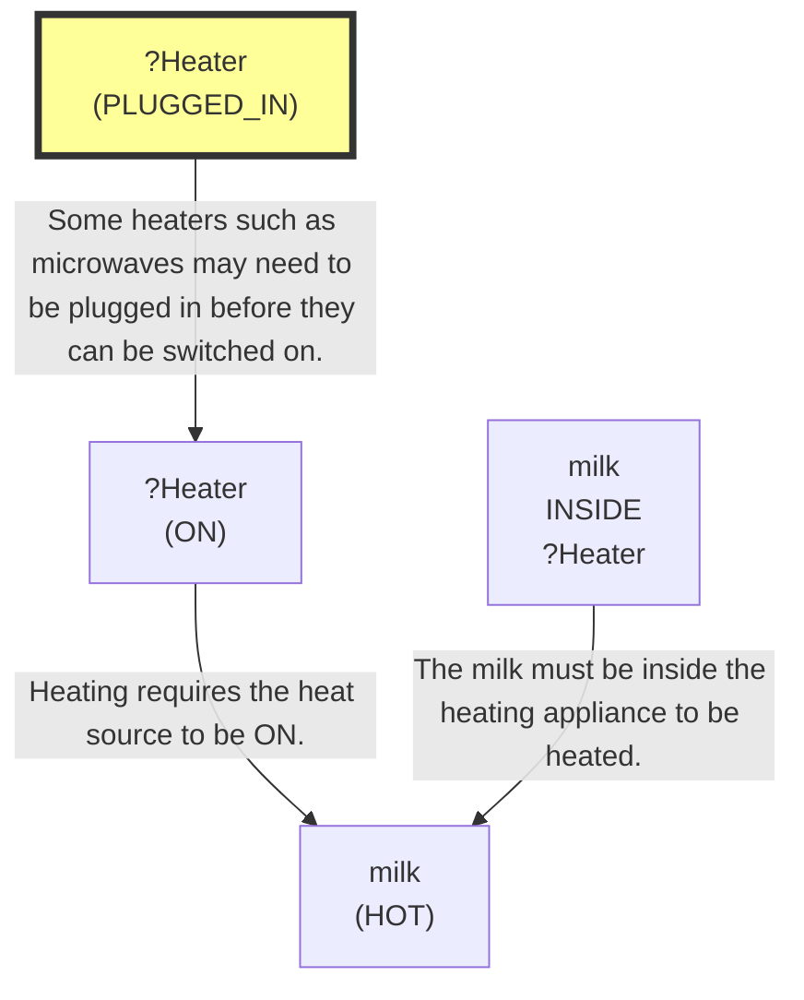
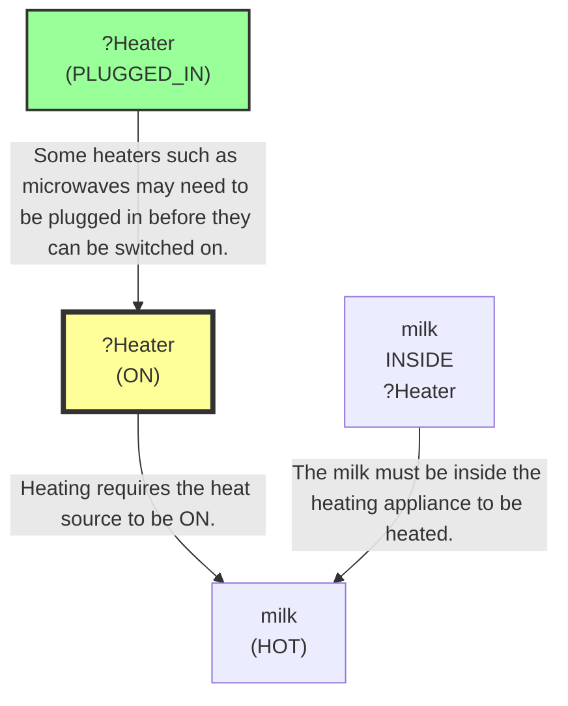
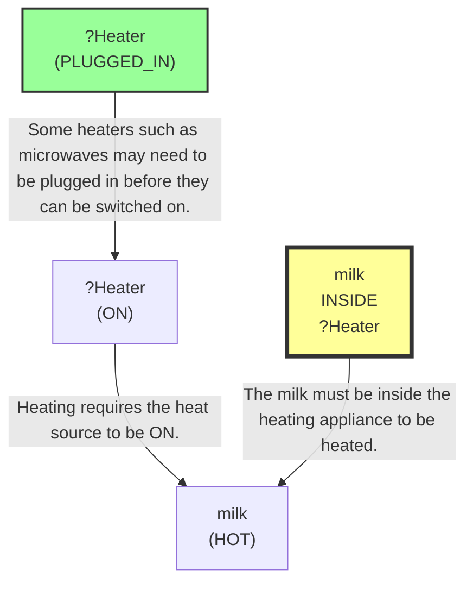
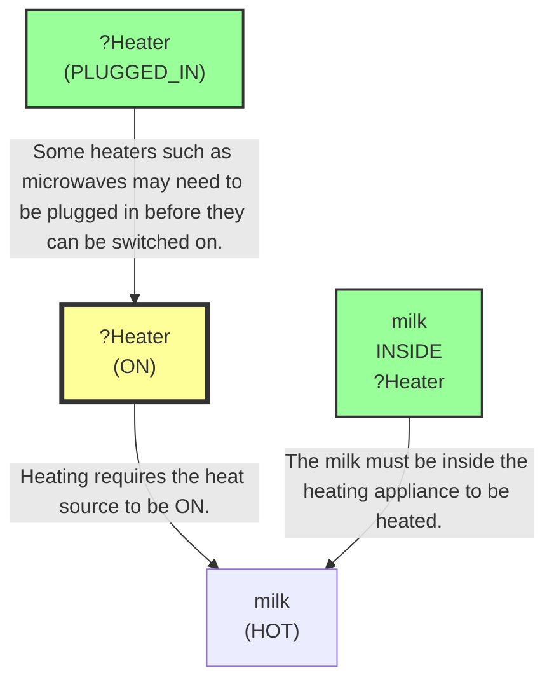

# 🚀 VirtualHome Agent Episode Log


### [GoalReasoner (Module A - Intent)] Output
```json
{
  "is_instruction_obviously_vague": false,
  "clarification_question": null,
  "target_object": "milk",
  "location_hint": null,
  "reasoning_chain": [
    {
      "question": "Why does the user want this object?",
      "answer": "To have the milk in a warmer state."
    },
    {
      "question": "Why is that important?",
      "answer": "Because cold milk is not the desired temperature for the intended use."
    },
    {
      "question": "What fundamental need does this fulfill?",
      "answer": "It helps make a beverage suitable for drinking or use in a recipe."
    },
    {
      "question": "Are there any deeper psychological or physical motivations?",
      "answer": "The user likely wants to improve comfort, palatability, or readiness for consumption."
    }
  ],
  "deep_intent": "The user wants to warm a beverage or liquid to a more suitable drinking temperature.",
  "acceptable_alternatives_properties": [
    {
      "priority": 1,
      "description": "Other drinkable liquids that are typically warmed for consumption, such as water, coffee, or tea"
    },
    {
      "priority": 2,
      "description": "Other dairy or non-dairy beverages that can be heated safely and serve a similar warming purpose"
    },
    {
      "priority": 3,
      "description": "Ready-to-drink warm beverages that already satisfy the need for a warm drink"
    },
    {
      "priority": 4,
      "description": "Any safe warm beverage that can provide comfort and hydration, such as broth"
    }
  ]
}
```

### [PerceptionFilter] Output
```json
{
  "reasoning": "The goal is to heat milk, so we must keep the target object (milk) and all plausible heating appliances/backup heaters visible. The SDG requires a heater that is ON and plugged in, so we also need the electrical power source and heater options that can accomplish this. Relevant alternatives for warming liquids include microwave, stove, coffeemaker, and possibly a cookingpot/fryingpan as heat containers if using the stove. A sink/fridge are not necessary for heating the milk itself.",
  "selected_classes": [
    "fryingpan",
    "character",
    "milk",
    "stove",
    "powersocket",
    "microwave",
    "coffeemaker",
    "cookingpot"
  ],
  "raw_class_count": 50
}
```

### [LLMExecutor] Output
```json
{
  "reasoning": "To make the milk HOT, the SDG requires an ON heater and the milk inside it. The best available heater is the microwave(171), which has HAS_PLUG and is currently OFF/CLOSED. The first prerequisite is to plug it in before switching it on. I am not yet near it, so the next atomic step is to walk to the microwave.",
  "satisfied_nodes": [],
  "current_node_focus": "N4",
  "mapped_variables": {
    "?Heater": "microwave(171)"
  },
  "action": "[walk] <microwave> (171)"
}
```

### [RoboStateMultiTaskController] Output
```json
{
  "action": "[walk] <microwave> (171)",
  "active_task_id": "task_1",
  "task_context": {
    "active_task_id": "task_1",
    "pending_task_ids": [],
    "satisfied_task_ids": []
  },
  "source": "llm_executor"
}
```
## Step 0
- **Action**: `[walk] <microwave> (171)`
- **Action Success**: `True`
- **Action Message**: {'0': {'message': 'Success'}}
- **Active Task**: `task_1`
- **Decision Source**: `llm_executor`
- **Task Progress**: T3_without_path_merging_P3_11=pending
- **SDG Status**:

- **Observed Items (14)**: powersocket(57), fryingpan(62), cookingpot(63) [CLOSED], stove(163) [OFF,CLOSED], coffeemaker(169) [OFF], microwave(171) [CLOSED,OFF], milk(176) [CLOSED], milk(177) [CLOSED], character(1), kitchen(11), livingroom(183), bedroom(241), bathroom(285), bedroom(346)


### [PerceptionFilter] Output
```json
{
  "reasoning": "Reused cached class selection.",
  "selected_classes": [
    "fryingpan",
    "character",
    "milk",
    "stove",
    "powersocket",
    "microwave",
    "coffeemaker",
    "cookingpot"
  ],
  "raw_class_count": 50
}
```

### [LLMExecutor] Output
```json
{
  "reasoning": "The goal is to make milk HOT using a heater. The current graph shows two milk instances close to the character and a microwave that is close and available. The heater must be plugged in before switching on, and the microwave has HAS_PLUG, so the next prerequisite action is to plug it in. This progresses toward the required ON state for the heater/microwave before heating the milk.",
  "satisfied_nodes": [],
  "current_node_focus": "N4",
  "mapped_variables": {
    "?Heater": "microwave(171)"
  },
  "action": "[plugin] <microwave> (171)"
}
```

### [RoboStateMultiTaskController] Output
```json
{
  "action": "[plugin] <microwave> (171)",
  "active_task_id": "task_1",
  "task_context": {
    "active_task_id": "task_1",
    "pending_task_ids": [],
    "satisfied_task_ids": []
  },
  "source": "llm_executor"
}
```
## Step 1
- **Action**: `[plugin] <microwave> (171)`
- **Action Success**: `True`
- **Action Message**: Faked plug operation in Python layer
- **Active Task**: `task_1`
- **Decision Source**: `llm_executor`
- **Task Progress**: T3_without_path_merging_P3_11=pending
- **SDG Status**:

- **Observed Items (14)**: powersocket(57), fryingpan(62), cookingpot(63) [CLOSED], stove(163) [OFF,CLOSED], coffeemaker(169) [OFF], microwave(171) [CLOSED,OFF], milk(176) [CLOSED], milk(177) [CLOSED], character(1), kitchen(11), livingroom(183), bedroom(241), bathroom(285), bedroom(346)


### [PerceptionFilter] Output
```json
{
  "reasoning": "Reused cached class selection.",
  "selected_classes": [
    "fryingpan",
    "character",
    "milk",
    "stove",
    "powersocket",
    "microwave",
    "coffeemaker",
    "cookingpot"
  ],
  "raw_class_count": 50
}
```

### [LLMExecutor] Output
```json
{
  "reasoning": "The heater variable should bind to the microwave because it is already PLUGGED_IN and can be switched on. The microwave is currently CLOSED and OFF, and milk is nearby but not yet inside it. Since the required next prerequisite in the SDG is the heater being ON, the next atomic step should be to open the microwave so the milk can be placed inside afterward.",
  "satisfied_nodes": [
    "N4"
  ],
  "current_node_focus": "N2",
  "mapped_variables": {
    "?Heater": "microwave(171)"
  },
  "action": "[open] <microwave> (171)"
}
```

### [RoboStateMultiTaskController] Output
```json
{
  "action": "[open] <microwave> (171)",
  "active_task_id": "task_1",
  "task_context": {
    "active_task_id": "task_1",
    "pending_task_ids": [],
    "satisfied_task_ids": []
  },
  "source": "llm_executor"
}
```
## Step 2
- **Action**: `[open] <microwave> (171)`
- **Action Success**: `True`
- **Action Message**: {'0': {'message': 'Success'}}
- **Active Task**: `task_1`
- **Decision Source**: `llm_executor`
- **Task Progress**: T3_without_path_merging_P3_11=pending
- **SDG Status**:

- **Observed Items (14)**: powersocket(57), fryingpan(62), cookingpot(63) [CLOSED], stove(163) [OFF,CLOSED], coffeemaker(169) [OFF], microwave(171) [PLUGGED_IN,CLOSED,OFF], milk(176) [CLOSED], milk(177) [CLOSED], character(1), kitchen(11), livingroom(183), bedroom(241), bathroom(285), bedroom(346)


### [PerceptionFilter] Output
```json
{
  "reasoning": "Reused cached class selection.",
  "selected_classes": [
    "fryingpan",
    "character",
    "milk",
    "stove",
    "powersocket",
    "microwave",
    "coffeemaker",
    "cookingpot"
  ],
  "raw_class_count": 50
}
```

### [LLMExecutor] Output
```json
{
  "reasoning": "The heater is already identified as the microwave(171), and the SDG requires the milk to end up HOT inside it. We have already satisfied the heater power state with PLUGGED_IN, and the microwave is open and close to the character. The missing next prerequisite is getting the milk into the microwave. Since putin requires being near the destination first and the milk is currently close, the next atomic step is to walk to the microwave so we can place the milk inside on the following step.",
  "satisfied_nodes": [
    "N4"
  ],
  "current_node_focus": "N3",
  "mapped_variables": {
    "?Heater": "microwave(171)"
  },
  "action": "[walk] <microwave> (171)"
}
```

### [RoboStateMultiTaskController] Output
```json
{
  "action": "[walk] <microwave> (171)",
  "active_task_id": "task_1",
  "task_context": {
    "active_task_id": "task_1",
    "pending_task_ids": [],
    "satisfied_task_ids": []
  },
  "source": "llm_executor"
}
```
## Step 3
- **Action**: `[walk] <microwave> (171)`
- **Action Success**: `True`
- **Action Message**: {'0': {'message': 'Success'}}
- **Active Task**: `task_1`
- **Decision Source**: `llm_executor`
- **Task Progress**: T3_without_path_merging_P3_11=pending
- **SDG Status**:

- **Observed Items (14)**: powersocket(57), fryingpan(62), cookingpot(63) [CLOSED], stove(163) [OFF,CLOSED], coffeemaker(169) [OFF], microwave(171) [OPEN,PLUGGED_IN,OFF], milk(176) [CLOSED], milk(177) [CLOSED], character(1), kitchen(11), livingroom(183), bedroom(241), bathroom(285), bedroom(346)


### [PerceptionFilter] Output
```json
{
  "reasoning": "Reused cached class selection.",
  "selected_classes": [
    "fryingpan",
    "character",
    "milk",
    "stove",
    "powersocket",
    "microwave",
    "coffeemaker",
    "cookingpot"
  ],
  "raw_class_count": 50
}
```

### [LLMExecutor] Output
```json
{
  "reasoning": "The heater variable best maps to the microwave(171), which is already PLUGGED_IN and OPEN. The remaining gap is that the milk is not yet inside the microwave. Since I am already close to the milk and the microwave is open, the next step should be to grab one milk first before placing it into the heater.",
  "satisfied_nodes": [
    "N4"
  ],
  "current_node_focus": "N3",
  "mapped_variables": {
    "?Heater": "microwave(171)"
  },
  "action": "[grab] <milk> (176)"
}
```

### [RoboStateMultiTaskController] Output
```json
{
  "action": "[grab] <milk> (176)",
  "active_task_id": "task_1",
  "task_context": {
    "active_task_id": "task_1",
    "pending_task_ids": [],
    "satisfied_task_ids": []
  },
  "source": "llm_executor"
}
```
## Step 4
- **Action**: `[grab] <milk> (176)`
- **Action Success**: `True`
- **Action Message**: {'0': {'message': 'Success'}}
- **Active Task**: `task_1`
- **Decision Source**: `llm_executor`
- **Task Progress**: T3_without_path_merging_P3_11=pending
- **SDG Status**:

- **Observed Items (14)**: powersocket(57), fryingpan(62), cookingpot(63) [CLOSED], stove(163) [OFF,CLOSED], coffeemaker(169) [OFF], microwave(171) [OPEN,PLUGGED_IN,OFF], milk(176) [CLOSED], milk(177) [CLOSED], character(1), kitchen(11), livingroom(183), bedroom(241), bathroom(285), bedroom(346)


### [PerceptionFilter] Output
```json
{
  "reasoning": "Reused cached class selection.",
  "selected_classes": [
    "fryingpan",
    "character",
    "milk",
    "stove",
    "powersocket",
    "microwave",
    "coffeemaker",
    "cookingpot"
  ],
  "raw_class_count": 50
}
```

### [LLMExecutor] Output
```json
{
  "reasoning": "The milk object (176) is already held in the right hand, and the microwave heater (171) is already open, plugged in, and nearby. To satisfy the remaining SDG node for milk INSIDE the heater, the next atomic step is to place the held milk into the open microwave. The heater being ON is still pending, but the milk must be inside first before heating can complete.",
  "satisfied_nodes": [
    "N4"
  ],
  "current_node_focus": "N3",
  "mapped_variables": {
    "?Heater": "microwave(171)"
  },
  "action": "[putin] <milk> (176) <microwave> (171)"
}
```

### [RoboStateMultiTaskController] Output
```json
{
  "action": "[putin] <milk> (176) <microwave> (171)",
  "active_task_id": "task_1",
  "task_context": {
    "active_task_id": "task_1",
    "pending_task_ids": [],
    "satisfied_task_ids": []
  },
  "source": "llm_executor"
}
```
## Step 5
- **Action**: `[putin] <milk> (176) <microwave> (171)`
- **Action Success**: `True`
- **Action Message**: {'0': {'message': 'Success'}}
- **Active Task**: `task_1`
- **Decision Source**: `llm_executor`
- **Task Progress**: T3_without_path_merging_P3_11=pending
- **SDG Status**:

- **Observed Items (14)**: powersocket(57), fryingpan(62), cookingpot(63) [CLOSED], stove(163) [OFF,CLOSED], coffeemaker(169) [OFF], microwave(171) [OPEN,PLUGGED_IN,OFF], milk(176) [CLOSED], milk(177) [CLOSED], character(1), kitchen(11), livingroom(183), bedroom(241), bathroom(285), bedroom(346)


### [PerceptionFilter] Output
```json
{
  "reasoning": "Reused cached class selection.",
  "selected_classes": [
    "fryingpan",
    "character",
    "milk",
    "stove",
    "powersocket",
    "microwave",
    "coffeemaker",
    "cookingpot"
  ],
  "raw_class_count": 50
}
```

### [LLMExecutor] Output
```json
{
  "reasoning": "The milk already appears inside the microwave, and the microwave is plugged in and open. The remaining SDG requirement is to turn the heater on, which should begin heating the milk toward HOT. I should switch on the microwave now.",
  "satisfied_nodes": [
    "N4",
    "N3"
  ],
  "current_node_focus": "N2",
  "mapped_variables": {
    "?Heater": "microwave(171)"
  },
  "action": "[switchon] <microwave> (171)"
}
```

### [RoboStateMultiTaskController] Output
```json
{
  "action": "[switchon] <microwave> (171)",
  "active_task_id": "task_1",
  "task_context": {
    "active_task_id": "task_1",
    "pending_task_ids": [],
    "satisfied_task_ids": []
  },
  "source": "llm_executor"
}
```
## Step 6
- **Action**: `[switchon] <microwave> (171)`
- **Action Success**: `True`
- **Action Message**: Faked switch operation in Python layer (bypassed Unity failure)
- **Active Task**: `task_1`
- **Decision Source**: `llm_executor`
- **Task Progress**: T3_without_path_merging_P3_11=done
- **SDG Status**:

- **Observed Items (14)**: powersocket(57), fryingpan(62), cookingpot(63) [CLOSED], stove(163) [OFF,CLOSED], coffeemaker(169) [OFF], microwave(171) [OPEN,PLUGGED_IN,OFF], milk(176) [CLOSED], milk(177) [CLOSED], character(1), kitchen(11), livingroom(183), bedroom(241), bathroom(285), bedroom(346)

