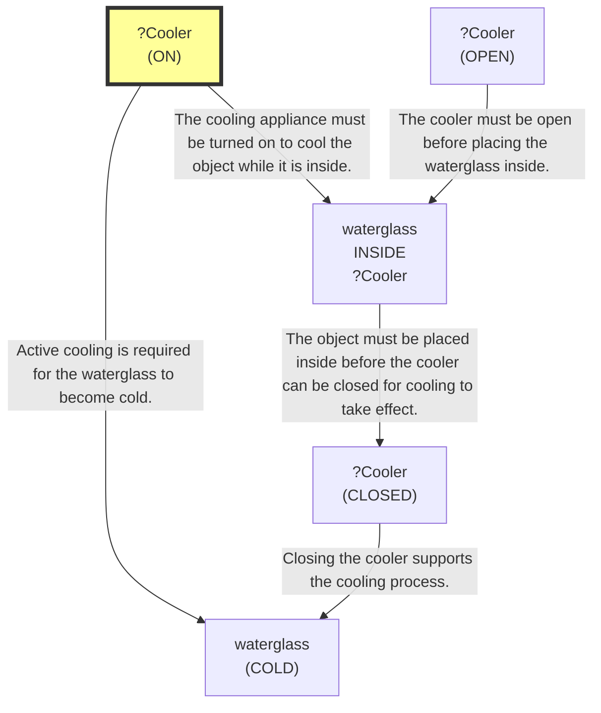
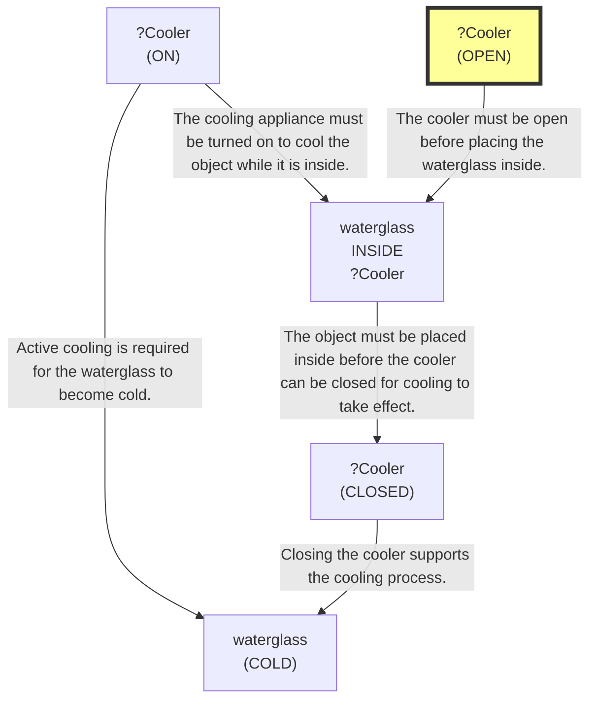
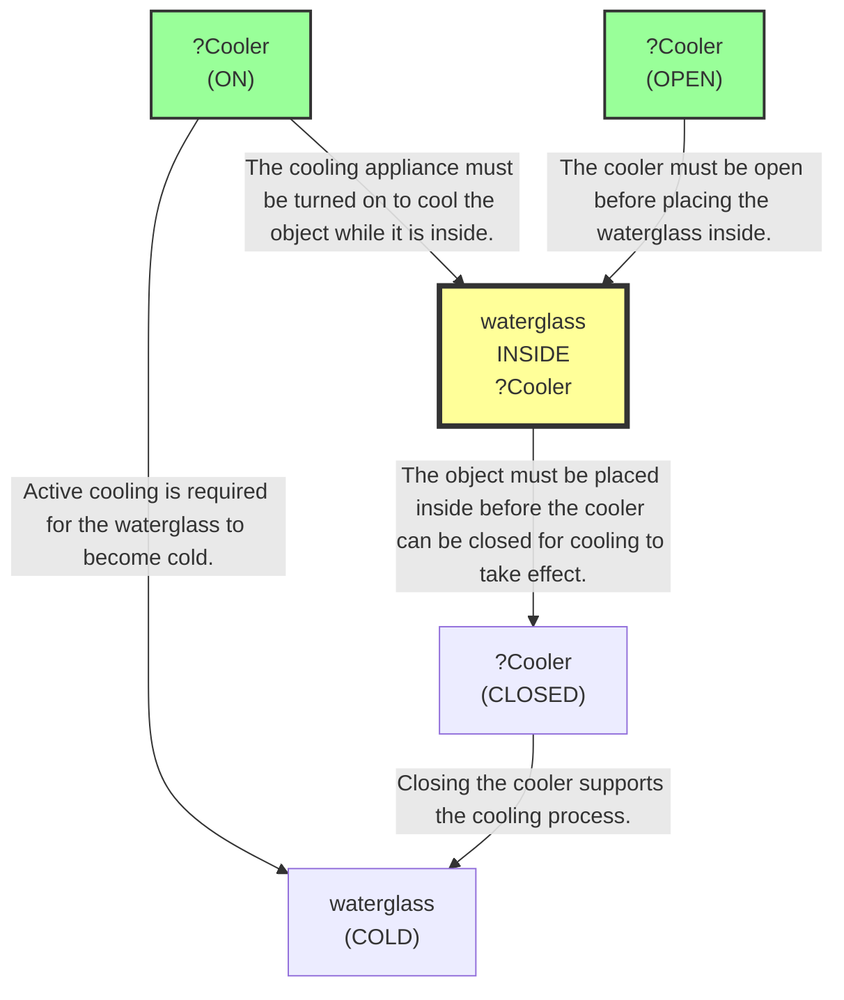
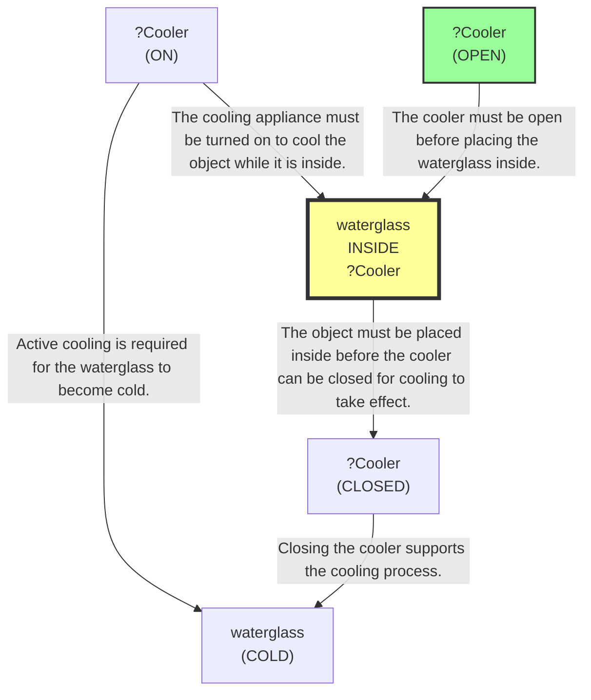

# 🚀 VirtualHome Agent Episode Log


### [GoalReasoner (Module A - Intent)] Output
```json
{
  "is_instruction_obviously_vague": false,
  "clarification_question": null,
  "target_object": "waterglass",
  "location_hint": "fridge",
  "reasoning_chain": [
    {
      "question": "Why does the user want this object in the fridge?",
      "answer": "To cool the water in the glass."
    },
    {
      "question": "Why is that important?",
      "answer": "They likely want the water to become colder and more refreshing."
    },
    {
      "question": "What fundamental need does this fulfill?",
      "answer": "It fulfills the need for a cooler drink or temperature preference."
    },
    {
      "question": "Are there any deeper psychological or physical motivations?",
      "answer": "The motivation is likely physical comfort, hydration preference, or making the drink more pleasant to consume."
    }
  ],
  "deep_intent": "The user wants a drink cooled to a colder temperature.",
  "acceptable_alternatives_properties": [
    {
      "priority": 1,
      "description": "Other drink containers with beverages that can be chilled in a refrigerator, such as a cup, bottle, or mug."
    },
    {
      "priority": 2,
      "description": "Other beverages that can be cooled, such as water, juice, milk, or tea."
    },
    {
      "priority": 3,
      "description": "Any cold drinkable liquid stored in a household fridge, including pre-chilled bottled drinks or poured beverages."
    },
    {
      "priority": 4,
      "description": "Another way to satisfy the preference for a cold refreshment, such as an ice-cold beverage already kept cold in the fridge."
    }
  ]
}
```

### [PerceptionFilter] Output
```json
{
  "reasoning": "The goal is to cool a waterglass in a refrigerator. The SDG requires the target object waterglass and a cooler; the visible matching cooler is fridge. Since cooling a drink implies a refrigerator being opened, used, and closed, only the target container and the fridge are strictly necessary from the observed classes.",
  "selected_classes": [
    "character",
    "milk",
    "juice",
    "fridge",
    "waterglass"
  ],
  "raw_class_count": 50
}
```

### [LLMExecutor] Output
```json
{
  "reasoning": "The active goal is to chill a waterglass by placing it inside the fridge, then closing the fridge. The fridge is the best match for ?Cooler because it has CAN_OPEN, HAS_SWITCH, and is the location hint. It is currently CLOSED, so the first required step in the SDG is to turn it ON before opening and placing the waterglass inside. I am not yet at the fridge specifically, but the available waterglass is already close to the character; however, the current node focus is the cooler's ON state, so the next atomic action should target the fridge's switch. After that, I will open it and transfer the waterglass.",
  "satisfied_nodes": [],
  "current_node_focus": "N1",
  "mapped_variables": {
    "?Cooler": "fridge(162)"
  },
  "action": "[switchon] <fridge> (162)"
}
```

### [RoboStateMultiTaskController] Output
```json
{
  "action": "[walk] <fridge> (162)",
  "active_task_id": "task_1",
  "task_context": {
    "active_task_id": "task_1",
    "pending_task_ids": [],
    "satisfied_task_ids": []
  },
  "source": "llm_executor_repaired"
}
```
## Step 0
- **Action**: `[walk] <fridge> (162)`
- **Action Success**: `True`
- **Action Message**: {'0': {'message': 'Success'}}
- **Active Task**: `task_1`
- **Decision Source**: `llm_executor_repaired`
- **Task Progress**: T3_without_path_merging_P3_15=pending
- **SDG Status**:

- **Observed Items (19)**: waterglass(64), waterglass(71), waterglass(72), waterglass(79), waterglass(80), waterglass(87), waterglass(88), waterglass(100), fridge(162) [CLOSED], juice(173), juice(174), milk(176) [CLOSED], milk(177) [CLOSED], character(1), kitchen(11)...


### [PerceptionFilter] Output
```json
{
  "reasoning": "Reused cached class selection.",
  "selected_classes": [
    "character",
    "milk",
    "juice",
    "fridge",
    "waterglass"
  ],
  "raw_class_count": 50
}
```

### [LLMExecutor] Output
```json
{
  "reasoning": "The goal requires placing a waterglass inside the fridge, with the fridge turned on and open first. We are already near the fridge from the previous successful walk, and the fridge is currently CLOSED. The next prerequisite toward satisfying N1/N2/N3 is to open the fridge. After that, the glass can be located inside the kitchen and moved in on subsequent steps.",
  "satisfied_nodes": [],
  "current_node_focus": "N2",
  "mapped_variables": {
    "?Cooler": "fridge(162)"
  },
  "action": "[open] <fridge> (162)"
}
```

### [RoboStateMultiTaskController] Output
```json
{
  "action": "[open] <fridge> (162)",
  "active_task_id": "task_1",
  "task_context": {
    "active_task_id": "task_1",
    "pending_task_ids": [],
    "satisfied_task_ids": []
  },
  "source": "llm_executor"
}
```
## Step 1
- **Action**: `[open] <fridge> (162)`
- **Action Success**: `True`
- **Action Message**: {'0': {'message': 'Success'}}
- **Active Task**: `task_1`
- **Decision Source**: `llm_executor`
- **Task Progress**: T3_without_path_merging_P3_15=pending
- **SDG Status**:

- **Observed Items (19)**: waterglass(64), waterglass(71), waterglass(72), waterglass(79), waterglass(80), waterglass(87), waterglass(88), waterglass(100), fridge(162) [CLOSED], juice(173), juice(174), milk(176) [CLOSED], milk(177) [CLOSED], character(1), kitchen(11)...


### [PerceptionFilter] Output
```json
{
  "reasoning": "Reused cached class selection.",
  "selected_classes": [
    "character",
    "milk",
    "juice",
    "fridge",
    "waterglass"
  ],
  "raw_class_count": 50
}
```

### [LLMExecutor] Output
```json
{
  "reasoning": "The fridge is already open and on, so the next prerequisite for cooling is to place the target waterglass inside it. The graph shows multiple waterglass instances in the kitchen; I will bind ?Cooler to fridge(162) and continue toward N3 by first getting the specific waterglass into hand. Since the last action was opening the fridge, I should not repeat walking to it. The immediate next atomic step is to walk to a candidate waterglass before grabbing it, because grabbing requires proximity.",
  "satisfied_nodes": [
    "N1",
    "N2"
  ],
  "current_node_focus": "N3",
  "mapped_variables": {
    "?Cooler": "fridge(162)"
  },
  "action": "[walk] <waterglass> (64)"
}
```

### [RoboStateMultiTaskController] Output
```json
{
  "action": "[walk] <waterglass> (64)",
  "active_task_id": "task_1",
  "task_context": {
    "active_task_id": "task_1",
    "pending_task_ids": [],
    "satisfied_task_ids": []
  },
  "source": "llm_executor"
}
```
## Step 2
- **Action**: `[walk] <waterglass> (64)`
- **Action Success**: `True`
- **Action Message**: {'0': {'message': 'Success'}}
- **Active Task**: `task_1`
- **Decision Source**: `llm_executor`
- **Task Progress**: T3_without_path_merging_P3_15=pending
- **SDG Status**:

- **Observed Items (19)**: waterglass(64), waterglass(71), waterglass(72), waterglass(79), waterglass(80), waterglass(87), waterglass(88), waterglass(100), fridge(162) [OPEN], juice(173), juice(174), milk(176) [CLOSED], milk(177) [CLOSED], character(1), kitchen(11)...


### [PerceptionFilter] Output
```json
{
  "reasoning": "Reused cached class selection.",
  "selected_classes": [
    "character",
    "milk",
    "juice",
    "fridge",
    "waterglass"
  ],
  "raw_class_count": 50
}
```

### [LLMExecutor] Output
```json
{
  "reasoning": "The fridge is already open and on, satisfying N1 and N2. The next required step is to get the target waterglass into the cooler. I can interact with waterglass(64) because it is currently CLOSE to the character and is the best matching target instance for the user's requested waterglass. To satisfy the INSIDE relation, I should first grab it before later moving it into the fridge.",
  "satisfied_nodes": [
    "N1",
    "N2"
  ],
  "current_node_focus": "N3",
  "mapped_variables": {
    "?Cooler": "fridge(162)"
  },
  "action": "[grab] <waterglass> (64)"
}
```

### [RoboStateMultiTaskController] Output
```json
{
  "action": "[grab] <waterglass> (64)",
  "active_task_id": "task_1",
  "task_context": {
    "active_task_id": "task_1",
    "pending_task_ids": [],
    "satisfied_task_ids": []
  },
  "source": "llm_executor"
}
```
## Step 3
- **Action**: `[grab] <waterglass> (64)`
- **Action Success**: `True`
- **Action Message**: {'0': {'message': 'Success'}}
- **Active Task**: `task_1`
- **Decision Source**: `llm_executor`
- **Task Progress**: T3_without_path_merging_P3_15=pending
- **SDG Status**:

- **Observed Items (19)**: waterglass(64), waterglass(71), waterglass(72), waterglass(79), waterglass(80), waterglass(87), waterglass(88), waterglass(100), fridge(162) [OPEN], juice(173), juice(174), milk(176) [CLOSED], milk(177) [CLOSED], character(1), kitchen(11)...


### [PerceptionFilter] Output
```json
{
  "reasoning": "Reused cached class selection.",
  "selected_classes": [
    "character",
    "milk",
    "juice",
    "fridge",
    "waterglass"
  ],
  "raw_class_count": 50
}
```

### [LLMExecutor] Output
```json
{
  "reasoning": "The fridge is already open and switched on, satisfying N1 and N2. I am holding waterglass(64), which is the target object, so the next required step is to place it inside the cooler. Since the fridge is open and I am already close to it, the single next action is to put the held waterglass into the fridge.",
  "satisfied_nodes": [
    "N1",
    "N2"
  ],
  "current_node_focus": "N3",
  "mapped_variables": {
    "?Cooler": "fridge(162)"
  },
  "action": "[putin] <waterglass> (64) <fridge> (162)"
}
```

### [RoboStateMultiTaskController] Output
```json
{
  "action": "[walk] <fridge> (162)",
  "active_task_id": "task_1",
  "task_context": {
    "active_task_id": "task_1",
    "pending_task_ids": [],
    "satisfied_task_ids": []
  },
  "source": "llm_executor_repaired"
}
```
## Step 4
- **Action**: `[walk] <fridge> (162)`
- **Action Success**: `True`
- **Action Message**: {'0': {'message': 'Success'}}
- **Active Task**: `task_1`
- **Decision Source**: `llm_executor_repaired`
- **Task Progress**: T3_without_path_merging_P3_15=pending
- **SDG Status**:

- **Observed Items (19)**: waterglass(64), waterglass(71), waterglass(72), waterglass(79), waterglass(80), waterglass(87), waterglass(88), waterglass(100), fridge(162) [OPEN], juice(173), juice(174), milk(176) [CLOSED], milk(177) [CLOSED], character(1), kitchen(11)...


### [PerceptionFilter] Output
```json
{
  "reasoning": "Reused cached class selection.",
  "selected_classes": [
    "character",
    "milk",
    "juice",
    "fridge",
    "waterglass"
  ],
  "raw_class_count": 50
}
```

### [LLMExecutor] Output
```json
{
  "reasoning": "The fridge is already open, and I am holding waterglass(64). To satisfy the SDG, the next required step is to place the waterglass inside the cooler (fridge) before closing it and waiting for cooling. Since put-in requires being near the destination and I am already close to the fridge from the previous walk, the next atomic action is to put the held waterglass into the fridge.",
  "satisfied_nodes": [
    "N2"
  ],
  "current_node_focus": "N3",
  "mapped_variables": {
    "?Cooler": "fridge(162)"
  },
  "action": "[putin] <waterglass> (64) <fridge> (162)"
}
```

### [RoboStateMultiTaskController] Output
```json
{
  "action": "[putin] <waterglass> (64) <fridge> (162)",
  "active_task_id": "task_1",
  "task_context": {
    "active_task_id": "task_1",
    "pending_task_ids": [],
    "satisfied_task_ids": []
  },
  "source": "llm_executor"
}
```
## Step 5
- **Action**: `[putin] <waterglass> (64) <fridge> (162)`
- **Action Success**: `True`
- **Action Message**: {'0': {'message': 'Success'}}
- **Active Task**: `task_1`
- **Decision Source**: `llm_executor`
- **Task Progress**: T3_without_path_merging_P3_15=done
- **SDG Status**:

- **Observed Items (19)**: waterglass(64), waterglass(71), waterglass(72), waterglass(79), waterglass(80), waterglass(87), waterglass(88), waterglass(100), fridge(162) [OPEN], juice(173), juice(174), milk(176) [CLOSED], milk(177) [CLOSED], character(1), kitchen(11)...

