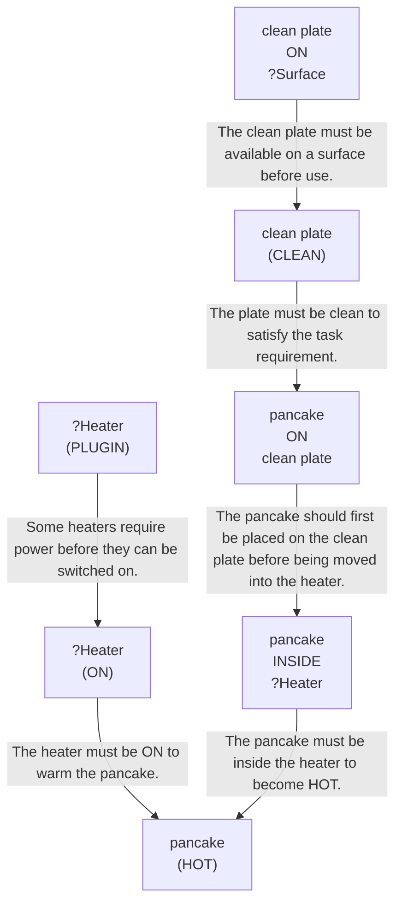

# 🚀 VirtualHome Agent Episode Log


### [GoalReasoner (Module A - Intent)] Output
```json
{
  "is_instruction_obviously_vague": false,
  "clarification_question": null,
  "target_object": "pancake",
  "location_hint": null,
  "reasoning_chain": [
    {
      "question": "Why does the user want this object?",
      "answer": "To have the pancake heated and ready to eat."
    },
    {
      "question": "Why is that important?",
      "answer": "So it is warm and more pleasant to consume."
    },
    {
      "question": "What fundamental need does this fulfill?",
      "answer": "It fulfills the need to eat a warm meal or snack."
    },
    {
      "question": "Are there any deeper psychological or physical motivations?",
      "answer": "The user likely wants convenience and comfort from eating food at an enjoyable temperature."
    }
  ],
  "deep_intent": "The user wants to heat food for immediate consumption and comfort.",
  "acceptable_alternatives_properties": [
    {
      "priority": 1,
      "description": "Other ready-to-eat breakfast foods that can be microwaved, such as waffles or French toast."
    },
    {
      "priority": 2,
      "description": "Other cooked baked goods or breakfast items that can be warmed in a microwave."
    },
    {
      "priority": 3,
      "description": "Other prepared snack or meal items that provide a warm, ready-to-eat food option."
    },
    {
      "priority": 4,
      "description": "Any indoor household food item that can satisfy hunger when warmed for eating."
    }
  ]
}
```

### [RoboStateMultiTaskController] Output
```json
{
  "action": "[walk] <bathroom> (172)",
  "active_task_id": "task_1",
  "task_context": {
    "active_task_id": "task_1",
    "pending_task_ids": [],
    "satisfied_task_ids": []
  },
  "source": "room_frontier"
}
```
## Step 0
- **Action**: `[walk] <bathroom> (172)`
- **Action Success**: `True`
- **Action Message**: {'0': {'message': 'Success'}}
- **Active Task**: `task_1`
- **Decision Source**: `room_frontier`
- **Task Progress**: T3_without_path_merging_P3_17=pending
- **SDG Status**:

- **Observed Items (159)**: floor(12), floor(13), floor(14), floor(15), floor(16), floor(17), floor(18), floor(19), floor(20), ceiling(21), ceiling(22), ceiling(23), ceiling(24), ceiling(25), ceiling(26)...


### [RoboStateMultiTaskController] Output
```json
{
  "action": "[walk] <bedroom> (211)",
  "active_task_id": "task_1",
  "task_context": {
    "active_task_id": "task_1",
    "pending_task_ids": [],
    "satisfied_task_ids": []
  },
  "source": "room_frontier"
}
```
## Step 1
- **Action**: `[walk] <bedroom> (211)`
- **Action Success**: `True`
- **Action Message**: {'0': {'message': 'Success'}}
- **Active Task**: `task_1`
- **Decision Source**: `room_frontier`
- **Task Progress**: T3_without_path_merging_P3_17=pending
- **SDG Status**:

- **Observed Items (197)**: floor(12), floor(13), floor(14), floor(15), floor(16), floor(17), floor(18), floor(19), floor(20), ceiling(21), ceiling(22), ceiling(23), ceiling(24), ceiling(25), ceiling(26)...


### [RoboStateMultiTaskController] Output
```json
{
  "action": "[walk] <livingroom> (268)",
  "active_task_id": "task_1",
  "task_context": {
    "active_task_id": "task_1",
    "pending_task_ids": [],
    "satisfied_task_ids": []
  },
  "source": "room_frontier"
}
```
## Step 2
- **Action**: `[walk] <livingroom> (268)`
- **Action Success**: `True`
- **Action Message**: {'0': {'message': 'Success'}}
- **Active Task**: `task_1`
- **Decision Source**: `room_frontier`
- **Task Progress**: T3_without_path_merging_P3_17=pending
- **SDG Status**:

- **Observed Items (240)**: floor(12), floor(13), floor(14), floor(15), floor(16), floor(17), floor(18), floor(19), floor(20), ceiling(21), ceiling(22), ceiling(23), ceiling(24), ceiling(25), ceiling(26)...


### [RoboStateMultiTaskController] Output
```json
{
  "action": "[walk] <kitchen> (11)",
  "active_task_id": null,
  "task_context": {
    "active_task_id": null,
    "pending_task_ids": [
      "task_1"
    ],
    "satisfied_task_ids": []
  },
  "source": "loop_recovery_room_revisit"
}
```
## Step 3
- **Action**: `[walk] <kitchen> (11)`
- **Action Success**: `True`
- **Action Message**: {'0': {'message': 'Success'}}
- **Decision Source**: `loop_recovery_room_revisit`
- **Task Progress**: T3_without_path_merging_P3_17=pending
- **SDG Status**:
No SDG active.
- **Observed Items (312)**: floor(12), floor(13), floor(14), floor(15), floor(16), floor(17), floor(18), floor(19), floor(20), ceiling(21), ceiling(22), ceiling(23), ceiling(24), ceiling(25), ceiling(26)...


### [RoboStateMultiTaskController] Output
```json
{
  "action": "[walk] <bathroom> (172)",
  "active_task_id": null,
  "task_context": {
    "active_task_id": null,
    "pending_task_ids": [
      "task_1"
    ],
    "satisfied_task_ids": []
  },
  "source": "loop_recovery_room_revisit"
}
```
## Step 4
- **Action**: `[walk] <bathroom> (172)`
- **Action Success**: `True`
- **Action Message**: {'0': {'message': 'Success'}}
- **Decision Source**: `loop_recovery_room_revisit`
- **Task Progress**: T3_without_path_merging_P3_17=pending
- **SDG Status**:
No SDG active.
- **Observed Items (312)**: floor(12), floor(13), floor(14), floor(15), floor(16), floor(17), floor(18), floor(19), floor(20), ceiling(21), ceiling(22), ceiling(23), ceiling(24), ceiling(25), ceiling(26)...


### [RoboStateMultiTaskController] Output
```json
{
  "action": "[walk] <bedroom> (211)",
  "active_task_id": null,
  "task_context": {
    "active_task_id": null,
    "pending_task_ids": [
      "task_1"
    ],
    "satisfied_task_ids": []
  },
  "source": "loop_recovery_room_revisit"
}
```
## Step 5
- **Action**: `[walk] <bedroom> (211)`
- **Action Success**: `True`
- **Action Message**: {'0': {'message': 'Success'}}
- **Decision Source**: `loop_recovery_room_revisit`
- **Task Progress**: T3_without_path_merging_P3_17=pending
- **SDG Status**:
No SDG active.
- **Observed Items (312)**: floor(12), floor(13), floor(14), floor(15), floor(16), floor(17), floor(18), floor(19), floor(20), ceiling(21), ceiling(22), ceiling(23), ceiling(24), ceiling(25), ceiling(26)...


### [RoboStateMultiTaskController] Output
```json
{
  "action": "[walk] <livingroom> (268)",
  "active_task_id": null,
  "task_context": {
    "active_task_id": null,
    "pending_task_ids": [
      "task_1"
    ],
    "satisfied_task_ids": []
  },
  "source": "loop_recovery_room_revisit"
}
```
## Step 6
- **Action**: `[walk] <livingroom> (268)`
- **Action Success**: `True`
- **Action Message**: {'0': {'message': 'Success'}}
- **Decision Source**: `loop_recovery_room_revisit`
- **Task Progress**: T3_without_path_merging_P3_17=pending
- **SDG Status**:
No SDG active.
- **Observed Items (312)**: floor(12), floor(13), floor(14), floor(15), floor(16), floor(17), floor(18), floor(19), floor(20), ceiling(21), ceiling(22), ceiling(23), ceiling(24), ceiling(25), ceiling(26)...


### [RoboStateMultiTaskController] Output
```json
{
  "action": "[walk] <kitchen> (11)",
  "active_task_id": null,
  "task_context": {
    "active_task_id": null,
    "pending_task_ids": [
      "task_1"
    ],
    "satisfied_task_ids": []
  },
  "source": "loop_recovery_room_revisit"
}
```
## Step 7
- **Action**: `[walk] <kitchen> (11)`
- **Action Success**: `True`
- **Action Message**: {'0': {'message': 'Success'}}
- **Decision Source**: `loop_recovery_room_revisit`
- **Task Progress**: T3_without_path_merging_P3_17=pending
- **SDG Status**:
No SDG active.
- **Observed Items (312)**: floor(12), floor(13), floor(14), floor(15), floor(16), floor(17), floor(18), floor(19), floor(20), ceiling(21), ceiling(22), ceiling(23), ceiling(24), ceiling(25), ceiling(26)...


### [RoboStateMultiTaskController] Output
```json
{
  "action": "[walk] <bathroom> (172)",
  "active_task_id": null,
  "task_context": {
    "active_task_id": null,
    "pending_task_ids": [
      "task_1"
    ],
    "satisfied_task_ids": []
  },
  "source": "loop_recovery_room_revisit"
}
```
## Step 8
- **Action**: `[walk] <bathroom> (172)`
- **Action Success**: `True`
- **Action Message**: {'0': {'message': 'Success'}}
- **Decision Source**: `loop_recovery_room_revisit`
- **Task Progress**: T3_without_path_merging_P3_17=pending
- **SDG Status**:
No SDG active.
- **Observed Items (312)**: floor(12), floor(13), floor(14), floor(15), floor(16), floor(17), floor(18), floor(19), floor(20), ceiling(21), ceiling(22), ceiling(23), ceiling(24), ceiling(25), ceiling(26)...


### [RoboStateMultiTaskController] Output
```json
{
  "action": "[walk] <bedroom> (211)",
  "active_task_id": null,
  "task_context": {
    "active_task_id": null,
    "pending_task_ids": [
      "task_1"
    ],
    "satisfied_task_ids": []
  },
  "source": "loop_recovery_room_revisit"
}
```
## Step 9
- **Action**: `[walk] <bedroom> (211)`
- **Action Success**: `True`
- **Action Message**: {'0': {'message': 'Success'}}
- **Decision Source**: `loop_recovery_room_revisit`
- **Task Progress**: T3_without_path_merging_P3_17=pending
- **SDG Status**:
No SDG active.
- **Observed Items (312)**: floor(12), floor(13), floor(14), floor(15), floor(16), floor(17), floor(18), floor(19), floor(20), ceiling(21), ceiling(22), ceiling(23), ceiling(24), ceiling(25), ceiling(26)...


### [RoboStateMultiTaskController] Output
```json
{
  "action": "[walk] <livingroom> (268)",
  "active_task_id": null,
  "task_context": {
    "active_task_id": null,
    "pending_task_ids": [
      "task_1"
    ],
    "satisfied_task_ids": []
  },
  "source": "loop_recovery_room_revisit"
}
```
## Step 10
- **Action**: `[walk] <livingroom> (268)`
- **Action Success**: `True`
- **Action Message**: {'0': {'message': 'Success'}}
- **Decision Source**: `loop_recovery_room_revisit`
- **Task Progress**: T3_without_path_merging_P3_17=pending
- **SDG Status**:
No SDG active.
- **Observed Items (312)**: floor(12), floor(13), floor(14), floor(15), floor(16), floor(17), floor(18), floor(19), floor(20), ceiling(21), ceiling(22), ceiling(23), ceiling(24), ceiling(25), ceiling(26)...


### [RoboStateMultiTaskController] Output
```json
{
  "action": "[walk] <kitchen> (11)",
  "active_task_id": null,
  "task_context": {
    "active_task_id": null,
    "pending_task_ids": [
      "task_1"
    ],
    "satisfied_task_ids": []
  },
  "source": "loop_recovery_room_revisit"
}
```
## Step 11
- **Action**: `[walk] <kitchen> (11)`
- **Action Success**: `True`
- **Action Message**: {'0': {'message': 'Success'}}
- **Decision Source**: `loop_recovery_room_revisit`
- **Task Progress**: T3_without_path_merging_P3_17=pending
- **SDG Status**:
No SDG active.
- **Observed Items (312)**: floor(12), floor(13), floor(14), floor(15), floor(16), floor(17), floor(18), floor(19), floor(20), ceiling(21), ceiling(22), ceiling(23), ceiling(24), ceiling(25), ceiling(26)...


### [RoboStateMultiTaskController] Output
```json
{
  "action": "[walk] <bathroom> (172)",
  "active_task_id": null,
  "task_context": {
    "active_task_id": null,
    "pending_task_ids": [
      "task_1"
    ],
    "satisfied_task_ids": []
  },
  "source": "loop_recovery_room_revisit"
}
```
## Step 12
- **Action**: `[walk] <bathroom> (172)`
- **Action Success**: `True`
- **Action Message**: {'0': {'message': 'Success'}}
- **Decision Source**: `loop_recovery_room_revisit`
- **Task Progress**: T3_without_path_merging_P3_17=pending
- **SDG Status**:
No SDG active.
- **Observed Items (312)**: floor(12), floor(13), floor(14), floor(15), floor(16), floor(17), floor(18), floor(19), floor(20), ceiling(21), ceiling(22), ceiling(23), ceiling(24), ceiling(25), ceiling(26)...


### [RoboStateMultiTaskController] Output
```json
{
  "action": "[walk] <bedroom> (211)",
  "active_task_id": null,
  "task_context": {
    "active_task_id": null,
    "pending_task_ids": [
      "task_1"
    ],
    "satisfied_task_ids": []
  },
  "source": "loop_recovery_room_revisit"
}
```
## Step 13
- **Action**: `[walk] <bedroom> (211)`
- **Action Success**: `True`
- **Action Message**: {'0': {'message': 'Success'}}
- **Decision Source**: `loop_recovery_room_revisit`
- **Task Progress**: T3_without_path_merging_P3_17=pending
- **SDG Status**:
No SDG active.
- **Observed Items (312)**: floor(12), floor(13), floor(14), floor(15), floor(16), floor(17), floor(18), floor(19), floor(20), ceiling(21), ceiling(22), ceiling(23), ceiling(24), ceiling(25), ceiling(26)...


### [RoboStateMultiTaskController] Output
```json
{
  "action": "[walk] <livingroom> (268)",
  "active_task_id": null,
  "task_context": {
    "active_task_id": null,
    "pending_task_ids": [
      "task_1"
    ],
    "satisfied_task_ids": []
  },
  "source": "loop_recovery_room_revisit"
}
```
## Step 14
- **Action**: `[walk] <livingroom> (268)`
- **Action Success**: `True`
- **Action Message**: {'0': {'message': 'Success'}}
- **Decision Source**: `loop_recovery_room_revisit`
- **Task Progress**: T3_without_path_merging_P3_17=pending
- **SDG Status**:
No SDG active.
- **Observed Items (312)**: floor(12), floor(13), floor(14), floor(15), floor(16), floor(17), floor(18), floor(19), floor(20), ceiling(21), ceiling(22), ceiling(23), ceiling(24), ceiling(25), ceiling(26)...

